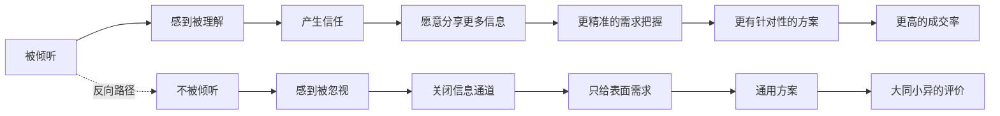

## 案例七：销售谈判——倾听中的需求挖掘

销售谈判中的倾听，与日常倾听有本质区别。日常倾听的目标是"理解"，而销售倾听的目标是"发现"——发现客户自己都没意识到的需求，发现竞争对手忽略的痛点，发现能让你从"供应商"变成"合作伙伴"的关键信息。顶级销售和普通销售之间的差距，往往不在于"会说"，而在于"会听"。

本案例将从心理学机制、信号解码方法论、错误模式拆解、分阶段正确示范、需求挖掘框架、进阶策略六个维度，完整呈现"销售谈判倾听"的每一个关键动作。

---

### 场景描述

你是一家软件公司的销售经理，在和一个潜在客户进行需求沟通。客户说：

> "我们现在用的系统太老了，很多功能跟不上。我们看了好几家供应商的方案，说实话大同小异。你们有什么不一样的地方吗？"

**场景要素分析**：

| 要素 | 具体内容 | 倾听意义 |
|------|---------|---------|
| 痛点信号 | "系统太老了"、"功能跟不上" | 客户有明确的不满，但描述笼统——具体是哪些功能跟不上？这是需要深挖的第一层 |
| 竞争信号 | "看了好几家"、"大同小异" | 客户已经做了充分的市场调研，不是早期接触阶段，而是比较决策阶段 |
| 隐含抱怨 | "大同小异" | 客户对现有供应商方案不满意，暗示"你们都不理解我真正需要什么" |
| 试探信号 | "你们有什么不一样的地方吗？" | 不是真正的提问，而是在考验你——你是否能说出真正理解他需求的话 |
| 未说出口的信息 | 决策标准、预算范围、内部阻力、时间压力 | 这些是客户不会主动告诉你的关键信息，需要通过倾听技巧引导出来 |

这段话不到60个字，但背后包含了至少5层信息：痛点层（系统老旧）、竞争层（已比较多家）、判断层（大同小异）、期望层（想找到不同）、隐藏层（真正的决策标准未暴露）。如果只听到了"系统太老"这一层，你就丢掉了客户真正想说的80%。

---

### 心理学基础：为什么倾听是销售中最强大的武器

#### 认知心理学：说与听的信息不对称

大多数销售人员的认知模型是"说服模型"——我的任务是把产品的优点说到客户心里去。但认知心理学研究表明，这个模型存在根本性缺陷：

**信息接收效率差异**：人说话的速度大约是每分钟125-175个词，但大脑处理信息的速度可以达到每分钟400-800个词。这意味着当你在说话时，客户的大脑有大量"空闲算力"在做别的事——质疑你的话、想着自己的问题、甚至在想午饭吃什么。而当你在倾听时，客户在主动输出信息，这些信息全部进入了你的处理通道。

**自我表露的心理效应**：心理学中的"自我表露互惠性"（Self-Disclosure Reciprocity）研究表明，当一个人感到被倾听时，他会倾向于分享更多信息。在销售场景中，这意味着你听得越多，客户告诉你的越多，你掌握的信息优势就越大。

**说服的悖论**：哈佛商学院的研究发现，销售人员说话比例与成交率之间呈倒U型关系——说话太少（不专业），说话太多（不倾听），都不行。最佳比例是"客户说70%，销售说30%"。而那30%中，有20%应该是提问和确认，只有10%是真正的"推销"。

#### 社会心理学：信任建立的底层逻辑

销售的本质是信任转移——客户信任你能解决他的问题，才会把钱交给你。信任的建立遵循一个可预测的心理学规律：



客户说"大同小异"，本质上就是在说"你们都没有真正听我说话，所以给我的方案都一样"。

---

### 错误示范：七种致命的销售倾听模式

#### 错误类型一：功能轰炸型——"我们有以下优势"

> "我们的产品有以下几个优势：第一，我们的技术架构是最新一代的微服务架构；第二，我们的客户覆盖了全球500强企业中的200家；第三，我们获得了ISO27001安全认证；第四……"

**逐句拆解**：

- **没有倾听需求就开始推销**：客户说"太老了"、"功能跟不上"，你根本没问具体是什么功能。你的"优势"可能和客户的痛点完全对不上——客户可能根本不在乎架构，他在乎的是某个报表能不能按时出。
- **列举产品功能而不是解决客户痛点**：客户不关心你的架构是微服务还是单体，他关心自己的问题能不能解决。你在说"我有什么"，客户想听的是"你能帮我什么"。
- **"大同小异"是客户给你的信号**：他在暗示"你要告诉我你真的理解我的需求"。你的回答恰好验证了他的判断——又一个背话术的销售。

**心理学根源**：这种回应犯了"自我中心偏差"（Egocentric Bias）——你以为重要的东西，客户也一定觉得重要。实际上，客户只关心和自己问题相关的东西。

#### 错误类型二：虚假倾听型——"嗯嗯我理解，我们的产品正好……"

> "嗯嗯，我理解您的痛点。我们很多客户之前也有类似的困扰。我们的产品正好可以解决这些问题，让我给您演示一下……"

**问题分析**：

- **"我理解"是廉价的理解**：没有复述、没有确认、没有追问，这个"我理解"没有任何信息含量。客户心里想的是"你理解什么了？我还没说完呢。"
- **"很多客户也有类似困扰"**：你是在说"你的问题不特殊，我见多了"。客户不会因此感到被安慰，反而会想"那你的方案肯定也是千篇一律的"。
- **急于展示产品**：你听到了客户的痛点，但没有深挖痛点的具体内容和严重程度，就直接跳到了产品演示。这就像医生听病人说了一句"肚子疼"，不做任何检查就开药。

#### 错误类型三：审问式提问型——"您的预算是多少？"

> "请问您现在的系统是什么架构？有多少用户？预算是多少？什么时候要上线？谁是最终决策人？"

**问题分析**：

- **审问式提问让客户感到被"盘问"**：连续五个封闭式问题，像在填表而不是在对话。客户感觉自己是一个"潜在客户编号"，而不是一个有血有肉的人。
- **只问事实性问题，不问感受性问题**：你在收集"信息"，而不是在理解"需求"。信息告诉你"是什么"，感受告诉你"为什么重要"。
- **过早触及敏感话题**：预算和决策人在初次沟通时问，会让客户产生防御心理。客户会想"你关心的是我的预算，不是我的问题"。

#### 错误类型四：急于解题型——"这个我们能解决"

> "您说的这些问题我们都遇到过。系统老旧的问题，我们的迁移方案可以无缝过渡；功能跟不上的问题，我们的模块化设计可以灵活扩展；集成的问题，我们有标准API……"

**问题分析**：

- **在客户还没说完之前就给答案**：你急于展示解决方案，但客户的需求描述可能还没到核心部分。你解的是表面问题，不是深层问题。
- **假设你知道客户的问题**：客户说"功能跟不上"，你就假设你知道是哪些功能。但实际上，"功能跟不上"可能意味着完全不同的事情——可能是报表功能，可能是审批流程，可能是移动端支持。
- **没有区分"想要"和"需要"**：客户说出来的往往是"想要"（Want），真正驱动决策的是"需要"（Need）。你必须通过倾听才能发现两者之间的差距。

#### 错误类型五：竞争攻击型——"他们确实不行"

> "您说得对，那几家确实都有各自的短板。A公司的技术架构老旧，B公司的售后服务差，C公司的行业经验不足。我们在这方面比他们强多了……"

**问题分析**：

- **贬低竞争对手**：客户可能和这些供应商有关系，甚至和其中某些人是朋友。你的攻击可能让客户反感。
- **没有听出"大同小异"的真正含义**：客户说"大同小异"不是在说"他们不好"，而是在说"你们都不理解我"。你在攻击竞争对手，却没有回答"你到底理解我什么"。
- **落入同质化竞争陷阱**：你在用"比较"的方式竞争，但客户已经说了"大同小异"——比较没有意义。你必须跳出比较框架，展示真正的差异化理解。

#### 错误类型六：过度承诺型——"什么都能做"

> "您说的这些需求我们都能满足。不管是数据迁移、系统集成、还是定制开发，我们都有丰富的经验。您放心，交给我们就没问题了。"

**问题分析**：

- **"什么都能做"等于"什么都不精"**：当你说什么都行的时候，客户反而不信任你。因为一个真正了解这个领域的专家，应该知道什么能做、什么难做、什么有风险。
- **没有建立边界感**：专业性的一部分是知道自己的边界。一个连"这个功能实现起来有挑战，但我们有具体的解决方案"都不敢说的销售，客户不会相信他真的懂。
- **错失了建立信任的机会**：当你承认某些挑战并展示应对方案时，客户会觉得"这个人说的是实话"。

#### 错误类型七：自我感动型——"我们为这个行业付出了很多"

> "我们公司在这个行业深耕了十五年，服务了上千家客户，获得了无数奖项。我们的团队非常专业，每一位工程师都是行业精英……"

**问题分析**：

- **你在说自己，客户在想自己**：十五年的历史、上千家客户、无数奖项——这些和客户现在面临的具体问题有什么关系？客户不关心你的故事，他关心自己的故事。
- **用历史代替能力**：做了十五年不代表能解决我的问题。客户需要的是"你理解我的问题，并且有能力解决"，而不是"你做了很久"。

---

### 正确示范：分阶段的需求挖掘框架

下面的回应经过精心设计，分为六个阶段。每个阶段都有明确的目标和心理学依据。

#### 第一阶段：锚定痛点（0-30秒）

> "张总，您提到现在的系统'功能跟不上'，我想具体了解一下——您目前最头疼的是哪个方面？"

**动作拆解**：

| 话语 | 核心动作 | 心理学依据 |
|------|---------|----------|
| "张总" | 用姓名称呼 | 建立个人关系而非商务关系 |
| "您提到的'功能跟不上'" | 直接引用客户的原话 | "语言镜像"效应：用客户的词让客户感到被听见 |
| "最头疼的是哪个方面" | 聚焦于痛点而非功能 | 痛点是情感性的（"头疼"），功能是理性的——情感驱动决策 |

**为什么不直接问"您需要什么功能"**：这个问题太抽象，客户可能自己都说不清楚。"最头疼"把问题缩小到了具体场景，降低了客户的回答成本。

#### 第二阶段：选项式澄清（30-60秒）

> "是数据处理效率、用户体验，还是和其他系统的集成？"

**动作拆解**：

- **给出选项帮助表达**：当客户说不清楚时，给出几个选项让他选择。这不是"限制"客户的回答，而是"帮助"他把模糊的不满具体化。
- **选项的来源**：这三个选项来自你对行业常见痛点的经验总结。客户可能会说"对，主要是集成问题"，也可能会说"都不是，主要是……"——无论哪种，你都获得了比原来更具体的信息。
- **每个选项都是一个探询方向**：即使客户说"都不是"，他接下来的描述会比原来更具体，因为你给了他一个思考的起点。

#### 第三阶段：复述确认（60-90秒）

> （客户回答后）
>
> "明白了。您目前面临的主要是数据处理效率的问题，特别是在月末结账期间，系统响应时间太长，影响了财务团队的工作效率。我理解得对吗？"

**动作拆解**：

- **复述客户的原话并结构化**：把客户零散的描述整理成清晰的结构，让客户确认你的理解是否准确。
- **"我理解得对吗？"**：这是一个关键的确认动作。它传递的信息是："我不假设我理解了你，我需要你来确认。"这种谦逊姿态本身就是信任建立的方式。
- **从"功能跟不上"到"月末结账时系统响应慢"**：你的复述展示了你不仅听到了表面信息，还理解了具体场景。这就是"深度倾听"和"表面倾听"的区别。

#### 第四阶段：挖掘隐藏需求（90-120秒）

> "您说'看了好几家大同小异'，那在您看来，什么样的方案才能真正打动您？"

**动作拆解**：

- **"大同小异"是金矿**：这句话暗示客户已经建立了一套评价标准，但现有供应商都没有满足。你的任务是挖掘这套标准。
- **"在您看来"**：把定义权交给客户。你不是在推销，你是在学习——学习客户眼中的"好方案"是什么样的。
- **"真正打动"**：这个词比"满足需求"更强烈。它暗示客户想要的不只是"及格"，而是"超出预期"。

#### 第五阶段：总结核心需求（120-150秒）

> "我理解了。您最看重的不是功能数量，而是能否无缝对接您现有的ERP系统，以及迁移过程中对业务的影响能不能降到最低。"

**动作拆解**：

- **"不是……而是……"**：这是一个强大的句式，它展示了你区分了客户的"表面需求"（功能数量）和"深层需求"（无缝对接、低影响迁移）。
- **把客户未明确表达的需求说出来了**：客户可能没有直接说"我最担心的是迁移风险"，但通过前面几轮的倾听，你捕捉到了这个信号。当你把它说出来时，客户会感到"这个人真的理解我"。

#### 第六阶段：基于理解的行动建议（150-180秒）

> "基于您的需求，我建议我们安排一次技术团队的深度对接，针对您提到的ERP集成问题做一个详细的方案，包括迁移路径、风险评估、以及业务连续性保障计划。您看这周方便吗？"

**动作拆解**：

- **"基于您的需求"**：明确告诉客户，这个建议不是通用的，而是根据他刚才说的内容量身定制的。
- **方案内容直接对应客户的核心诉求**：客户说担心ERP集成和迁移影响，你的方案就包含了"ERP集成"、"迁移路径"、"风险评估"、"业务连续性"——每一个词都在回应客户的需求。
- **具体的时间建议**："这周"比"找个时间"更有推动力。具体的时间建议暗示你对此事的重视程度。

---

### 技巧深度分析：六大核心倾听技术

#### 技巧一：隐性需求挖掘（Uncovering Latent Needs）

**原理**：在销售领域，客户需求分为三个层次：

| 需求层次 | 定义 | 客户表达 | 倾听方法 |
|---------|------|---------|---------|
| 表面需求 | 客户明确说出来的问题 | "系统太老了" | 直接听取即可 |
| 隐性需求 | 客户意识到但没有明确表达的问题 | "迁移风险"（没说出口） | 通过追问和观察发现 |
| 深层需求 | 客户自己都没有意识到的根本动机 | "不想因为系统问题被老板质疑" | 通过长期对话和情境分析推断 |

**为什么挖掘隐性需求至关重要**：IBM的销售研究发现，能够识别并回应客户隐性需求的销售人员，成交率比只回应表面需求的销售人员高出5倍。因为隐性需求才是客户真正的决策驱动力。

**如何通过倾听挖掘隐性需求**：

- **关注客户的情绪词**：当客户说"最头疼"、"最担心"、"最怕"时，后面跟着的就是隐性需求的入口。
- **注意客户回避的话题**：客户不提的事情，往往比他提的事情更重要。如果客户全程不提价格，说明预算不是核心障碍；如果客户反复提到某个功能但又不详细描述，说明这个功能可能是"面子需求"而非真实需求。
- **追踪客户的"但是"**：客户说"你们方案挺好的，但是……"后面的内容，才是真正的顾虑。

#### 技巧二：SPIN提问法的倾听维度

SPIN是尼尔·雷克汉姆（Neil Rackham）在《SPIN Selling》中提出的经典销售提问框架。但大多数人只关注了"提问"，忽略了每个问题背后的"倾听"任务：

| SPIN阶段 | 提问目的 | 倾听任务 | 关注什么 |
|----------|---------|---------|---------|
| **S**ituation（情境） | 了解客户现状 | 建立客户的业务地图 | 组织结构、流程、痛点分布 |
| **P**roblem（问题） | 引导客户说出不满 | 识别客户的"痛点热图" | 哪些问题被提及最多、语气最重 |
| **I**mplication（影响） | 放大问题的严重性 | 发现问题的连锁反应 | 一个技术问题如何影响业务、人员、财务 |
| **N**eed-payoff（价值） | 让客户自己说出解决方案的价值 | 捕捉客户的期望标准 | 客户心目中的"好方案"是什么样的 |

**在本案例中的应用**：

- **S阶段倾听**：客户说"系统太老了"——你在建立客户的业务地图：现有系统、使用年限、主要功能。
- **P阶段倾听**：客户说"功能跟不上"——你在识别痛点：具体是哪些功能、影响了哪些业务环节。
- **I阶段倾听**（未被触发）：你需要追问"这些问题对业务的影响有多大？"来发现连锁反应。
- **N阶段倾听**：客户说"大同小异"——这是在告诉你"你们的价值主张都没有打动我"，你需要挖掘"什么才能打动"。

#### 技巧三：客户语言解码

客户说的话和他真正想表达的意思之间，往往存在巨大的翻译差距。以下是销售场景中最常见的"客户暗语"解码表：

| 客户原话 | 表面意思 | 真实含义 | 你的倾听行动 |
|---------|---------|---------|------------|
| "我们再看看" | 需要时间考虑 | 你没有打动我 / 我要拿你的方案去压其他供应商的价 | 追问"您还需要了解哪些信息才能做决定？" |
| "价格有点高" | 预算不够 | 你没有展示足够的价值 / 我在试探你的底价 | 追问"您觉得这个投资回报比合理吗？" |
| "你们方案挺好的" | 对方案满意 | "但是"后面才是重点——可能是不买，可能是压价 | 耐心等待"但是"后面的内容 |
| "领导还没决定" | 决策流程中 | 我不是最终决策人 / 我需要内部支持 | 追问"决策流程中还需要哪些人参与？" |
| "大同小异" | 方案差不多 | 你们都不理解我 / 我需要你证明你不同 | 深挖"什么才是真正的不同" |
| "挺着急的" | 时间紧迫 | 有内部deadline / 有竞争压力 | 追问"什么时间节点对您来说是关键的？" |
| "功能跟不上" | 需要新功能 | 某个具体场景下效率太低 / 被老板/用户批评了 | 追问"哪个场景让您最头疼？" |

**核心原则**：客户的每句话都是冰山露出水面的部分，你需要通过追问来看到水面下的90%。

#### 技巧四：沉默的力量

**原理**：在销售对话中，沉默是最被低估的工具。大多数人对沉默有本能的不适感，会在沉默出现时急于填补空白。但研究表明：

- 在客户回答完一个问题后，保持3-5秒的沉默，客户有60-70%的概率会继续补充信息。
- 这些"补充信息"往往比第一轮回答更真实、更接近核心需求。

**为什么客户会在沉默中说出更多**：

- **社交压力**：沉默创造了轻微的社交压力，客户会本能地想"我说得够不够清楚？"然后补充更多细节。
- **思考空间**：客户的第一轮回答往往是"标准答案"（已经在多次沟通中说过的话）。沉默给了他时间思考"还有什么是没说的"，第二轮回答更可能是独特的、私密的信息。

**使用场景**：

- 当客户说完一个观点后，不要马上接话，数3秒。
- 当你问了一个关键问题后，即使客户停顿了也不要着急，给他时间思考。
- 当客户说了"大同小异"这种总结性的话后，保持沉默——他可能会解释为什么这么说。

#### 技巧五：情绪信号识别

**原理**：客户在说话时，不仅在传递信息，还在传递情绪。情绪信号往往比语言内容更真实——因为语言可以修饰，但情绪很难伪装。

| 情绪信号 | 表现形式 | 可能的深层含义 | 你的回应策略 |
|---------|---------|-------------|------------|
| 烦躁 | 语速加快、叹气、重复 | 对现状忍耐到了极限，急需改变 | 展示紧迫感，强调"快速见效" |
| 怀疑 | 语气上扬、停顿多、问"真的吗" | 被之前的供应商伤害过，信任值低 | 用具体案例和数据建立可信度 |
| 焦虑 | 语速快但不流畅、频繁切换话题 | 有未说出的压力来源（可能是老板的deadline） | 帮助梳理优先级，降低不确定感 |
| 期待 | 语速正常、主动提问、身体前倾 | 对你的方案感兴趣，想深入了解 | 抓住窗口期，深入展示相关能力 |
| 冷漠 | 回答简短、不主动提问、敷衍 | 已经有了倾向性选择，你可能是陪标 | 打破常规，用出人意料的洞察重新吸引注意力 |
| 兴奋 | 语速加快、音量提高、主动延伸话题 | 你触到了他的核心需求 | 加深这个方向的讨论，确认并锁定需求 |

#### 技巧六：反馈式倾听的销售应用

**原理**：反馈式倾听（Reflective Listening）在销售场景中有特殊的用法——不仅是确认理解，更是引导对话方向。

**三级反馈法**：

| 反馈层级 | 方式 | 示例 | 作用 |
|---------|------|------|------|
| 一级反馈 | 简单重复关键词 | "功能跟不上" | 让客户知道你在听，鼓励继续说 |
| 二级反馈 | 结构化复述 | "您是说在月末结账时系统响应慢？" | 确认理解，把模糊变具体 |
| 三级反馈 | 推断性总结 | "所以您真正担心的是迁移过程中的业务连续性风险？" | 挖掘隐性需求，展示深度理解 |

**三级反馈的信任建立效应**：

当客户听到三级反馈时，他的反应通常是"对！就是这个意思！"——这种"被说中"的感觉会产生强烈的心理效应：他会觉得你不仅听懂了他说的话，还听懂了他没说的话。这种"被深度理解"的感觉，是任何产品功能优势都无法替代的。

---

### 需求挖掘的完整对话脚本

将六个阶段串联起来，以下是一个完整的需求挖掘对话脚本，标注了每个动作的时机和心理意图：

[0:00-0:03] 客户：
    "我们现在用的系统太老了，很多功能跟不上。我们看了好几家
     供应商的方案，说实话大同小异。你们有什么不一样的地方吗？"

[0:03-0:05] 销售（沉默2秒）
    [心理意图：不要急于回应，让客户感到你在认真思考他的话]

[0:05-0:20] 销售（锚定痛点）：
    "张总，您提到'功能跟不上'，我想具体了解一下——
     您目前最头疼的是哪个方面？"
    [心理意图：语言镜像 + 聚焦痛点 + 降低回答成本]

[0:20-0:30] 客户：
    "主要是数据处理那块。月末结账的时候，系统响应特别慢，
     财务部门的人天天抱怨。"
    
[0:30-0:35] 销售（一级反馈 + 沉默）：
    "月末结账……"（停顿，看着客户，等待补充）
    
[0:35-0:50] 客户（补充信息，被沉默触发）：
    "对，而且不只是慢，有时候数据还会出错。上个月就因为
     系统问题，财务报表拖了三天才出来，老板很不满意。"
    [观察：沉默触发了"补充信息"，且补充了更深层的痛点
     ——老板不满意，这是隐性需求的入口]

[0:50-1:10] 销售（二级反馈 + 影响放大）：
    "我明白了。不只是系统响应慢的问题，还导致了数据准确性
     和报表时效性的问题，最终影响到了管理层的信心。
     这个问题出现多久了？之前尝试过什么解决方法吗？"
    [心理意图：结构化复述展示理解深度 + 探询历史和影响范围]

[1:10-1:30] 客户：
    "快两年了。之前我们也找过供应商做过优化，花了几十万，
     效果不大。所以这次我们想彻底换掉。"
    [观察："花了几十万效果不大"——这是信任被伤害过的信号，
     也是"大同小异"的真正根源]

[1:30-1:45] 销售（三级反馈 + 挖掘隐藏需求）：
    "我理解了。之前投入了不少但没有根本解决问题，所以这次
     您不仅需要一个新系统，更需要确定这次投入能真正见效。
     您说'大同小异'——在您看来，那几家的方案具体是哪方面
     没有打动您？"
    [心理意图：推断出隐性需求（确定性/低风险）+
     引导客户说出具体的决策标准]

[1:45-2:10] 客户：
    "他们都在说自己的功能多强大，但没有人认真问过我到底
     需要什么。有一个厂商甚至连我们的业务流程都没了解清楚
     就开始报价了。"
    [观察：客户说出了真正的不满——"没有人认真问过我"。
     这正是在验证"倾听"在销售中的核心价值]

[2:10-2:30] 销售（总结核心需求 + 行动建议）：
    "张总，我听下来，您这次最看重的是三个点：第一，对方
     真正理解您的业务场景和痛点；第二，方案要有明确的效果
     承诺和可验证的指标；第三，迁移过程中的风险可控。
     基于这三点，我建议我们安排技术团队先做一个免费的
     业务诊断，深入了解您的系统现状和痛点，然后给您一个
     带有具体指标承诺的方案。您看这周方便安排吗？"
    [心理意图：三点总结精准回应客户的每一层需求；
     "免费业务诊断"既降低决策门槛又展示专业诚意；
     具体的时间建议推动进程]

[2:30] 客户：
    "这个可以。那你安排吧。"
    [观察：简洁的同意 = 信任初步建立]

---

### 进阶内容：不同销售场景的倾听策略调整

#### B2B大客户销售的倾听要点

| 特征 | 倾听策略 |
|------|---------|
| 决策链长（多个人参与决策） | 倾听每个人的需求和顾虑，绘制"决策地图"——谁是使用者、谁是影响者、谁是决策者、谁是审批者 |
| 采购周期长（3-12个月） | 每次沟通都要更新需求理解——客户的优先级会随时间变化 |
| 风险厌恶（"没人因为买IBM被开除"） | 关注客户的风险顾虑——"如果选你们出了问题，谁负责？" |
| 政治因素（内部博弈） | 倾听客户提到的内部关系和压力——"老板的意思是……"、"IT部门那边……" |

**关键技巧**：在B2B场景中，每次会议结束后，写一份"需求理解备忘录"发给客户确认。这不仅是确认需求，更是展示专业性和认真态度的方式。

#### B2C销售的倾听要点

| 特征 | 倾听策略 |
|------|---------|
| 决策快（冲动型消费多） | 倾听情绪信号比事实信号更重要——客户的"感觉"比"分析"更影响决策 |
| 决策者单一（通常是本人） | 可以更直接地挖掘个人需求，不需要考虑"其他决策者" |
| 价格敏感 | 倾听客户对"值不值"的判断标准——有人看重品牌，有人看重功能，有人看重售后 |
| 信任建立快（面对面场景） | 利用非语言信号（微笑、点头、身体前倾）增强倾听效果 |

#### 竞标场景的倾听要点

当客户同时在评估多家供应商时（如本案例所示），倾听策略需要特殊调整：

- **不要急于差异化**：客户说"大同小异"时，急于展示"我们不一样"是最常见的错误。你应该先问"什么才是真正的不同"，让客户定义差异化标准。
- **倾听竞争对手的信息**：客户可能会无意中透露其他供应商的信息——"那家说他们能做到……"。这些信息是极其宝贵的。
- **建立"理解型"差异化的壁垒**：当客户感受到"你是最理解我的"时，竞争对手的"功能优势"就变得不重要了。

---

### 常见误区与纠正

#### 误区一：问得越多越好

**错误认知**："我问得越多，了解得越多，就越能精准推荐。"

**事实**：提问的数量和需求挖掘的质量不成正比。连续的审问式提问会让客户感到疲惫和被审问。高质量的需求挖掘应该遵循"少问多听"原则——每问一个问题，给客户充分的时间回答，并通过反馈式倾听让客户主动扩展。一个问题深入追问三次，比问三个浅层问题更有价值。

**纠正方法**：使用"问题-沉默-反馈-追问"四步循环，而不是"问题-问题-问题-问题"连续轰炸。

#### 误区二：客户说的就是需求

**错误认知**："客户告诉我他需要什么，我就给他什么。"

**事实**：客户说出来的往往是"解决方案"而非"需求"。例如客户说"我需要一个报表系统"，他的真实需求可能是"每个月能按时给老板交报告"——解决方案可能不是报表系统，而是流程优化。你必须追问"您为什么需要这个？""这个问题的影响是什么？"才能发现真实需求。

**纠正方法**：对客户的每一个"解决方案式需求"，追问至少两层"为什么"。

#### 误区三：倾听就是不说话

**错误认知**："我安静地听客户说就行了，这就是倾听。"

**事实**：被动的沉默不是倾听，而是缺席。真正的倾听需要积极的反馈——点头、回应"嗯"、复述关键词、提出追问。没有反馈的倾听，客户会觉得"你在走神"或者"你根本不在乎"。

**纠正方法**：每30-60秒至少做一次主动反馈——可以是一个简短的"嗯"，也可以是一个复述，也可以是一个追问。

#### 误区四：需求只在初次沟通中挖掘

**错误认知**："第一次见面把需求了解清楚就行了，后面就是推进流程。"

**事实**：需求是动态变化的。客户在和你沟通的过程中，也在和竞争对手沟通、也在和内部团队讨论。他的需求优先级、决策标准、甚至预算都可能发生变化。每次沟通都应该有需求确认的环节。

**纠正方法**：每次沟通开始时，花2-3分钟"刷新"需求理解："上次我们聊到您最关注的是X，这个优先级有变化吗？"

#### 误区五：只听"买方"的话

**错误认知**："我只需要听决策者/采购者的话就行了。"

**事实**：在B2B销售中，使用者、影响者、技术评估者的声音同样重要。使用者的抱怨可能揭示真正的产品问题，技术评估者的担忧可能导致方案被否决，影响者的一句话可能改变决策者的态度。

**纠正方法**：尽可能接触决策链上的每一个人，倾听他们各自的"痛点语言"。

---

### 需求挖掘工具箱

#### 工具一：需求记录模板

在每次销售沟通后，使用以下模板整理你通过倾听获得的信息：

```markdown
## 客户需求记录

### 基本信息
- 客户名称：
- 沟通日期：
- 参与人员（我方/客户方）：

### 需求层次分析
| 层次 | 内容 | 来源（原话引用） | 置信度 |
|------|------|----------------|-------|
| 表面需求 | | | 高/中/低 |
| 隐性需求 | | | 高/中/低 |
| 深层需求 | | | 高/中/低 |

### 痛点热图
| 痛点 | 严重程度(1-5) | 紧迫程度(1-5) | 影响范围 | 客户情绪反应 |
|------|-------------|-------------|---------|------------|
| | | | | |

### 竞争情报
- 已接触的竞争对手：
- 客户对竞争对手的评价：
- 我们的差异化机会：

### 决策地图
- 最终决策人：
- 关键影响者：
- 技术评估者：
- 使用者代表：

### 下次沟通重点
- 需要进一步确认的信息：
- 需要深挖的需求：
- 需要准备的材料：
```

#### 工具二：需求验证检查清单

在给出方案之前，用这个清单验证你的需求理解是否完整：

- [ ] 我能用一句话描述客户的核心痛点吗？
- [ ] 我知道客户为什么会关注这个问题（历史背景）吗？
- [ ] 我知道这个问题对客户业务的具体影响吗？
- [ ] 我知道客户的决策标准和优先级排序吗？
- [ ] 我知道客户的预算范围吗？
- [ ] 我知道决策流程和关键决策人吗？
- [ ] 我知道客户的时间要求和关键节点吗？
- [ ] 我知道客户之前尝试过什么方案以及效果如何吗？
- [ ] 我知道客户对我们的竞争对手有什么看法吗？
- [ ] 我能预测客户可能的反对意见吗？

如果任何一项的答案是"不知道"，说明你还需要更多的倾听。

#### 工具三：提问菜单

按需求挖掘的不同阶段，准备以下提问清单：

**情境类问题**（了解现状）：
- "能简单介绍一下您目前使用的系统情况吗？"
- "这个系统大概用了多长时间了？"
- "日常主要哪些团队在使用这个系统？"

**问题类问题**（发现痛点）：
- "在使用过程中，最让您头疼的是什么？"
- "有没有什么功能是您一直想要但现有系统不支持的？"
- "如果给现在的系统打分（1-10分），您会打几分？扣分的地方在哪里？"

**影响类问题**（放大痛点）：
- "这个问题对您的团队效率影响有多大？"
- "如果不解决这个问题，半年后会发展成什么样？"
- "这个问题有没有让您在管理层面前承受压力？"

**期望类问题**（挖掘标准）：
- "您心目中理想的解决方案是什么样的？"
- "在选择供应商时，您最看重的三个因素是什么？"
- "什么样的方案能让您觉得'就是它了'？"

---

### 举一反三：从销售倾听看需求发现的通用法则

本案例的核心技巧不仅适用于销售谈判，而是适用于所有需要"发现真实需求"的情境：

- **产品经理做用户调研**：用户说"我想要一匹更快的马"——表面需求是马，真实需求是"更快地到达目的地"。倾听时要区分"解决方案"和"底层需求"。
- **管理者了解团队问题**：员工说"我们需要更多人手"——表面需求是人手，真实需求可能是"流程太复杂导致效率低下"。倾听时要追问"为什么需要更多人手"。
- **咨询师诊断组织问题**：客户说"我们需要一套新的绩效考核系统"——表面需求是系统，真实需求可能是"员工积极性不高"。解决方案可能不是系统，而是激励机制。
- **创业者验证商业想法**：潜在用户说"这个产品挺好的"——表面是认可，真实可能是"我不需要但不好意思直说"。倾听时要关注语气和后续行为的一致性。

**万变不离其宗**：在任何需要"发现需求"的场景中，倾听的终极目标不是"听到客户说了什么"，而是"理解客户为什么这么说"。前者是信息收集，后者是需求洞察。当你能准确回答"为什么"时，你给出的方案自然会与众不同——因为你不再是在解决表面问题，而是在解决根本问题。这就是客户说"大同小异"时，真正期待听到的东西。

***
