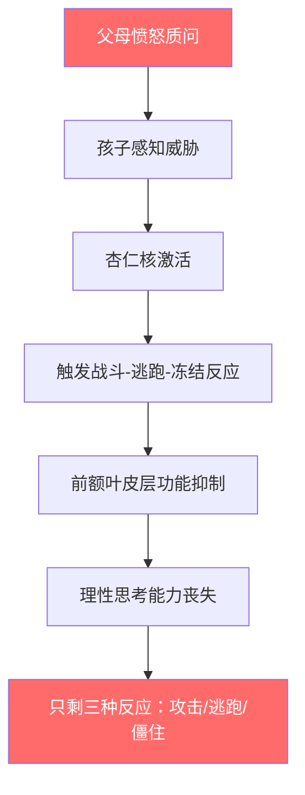
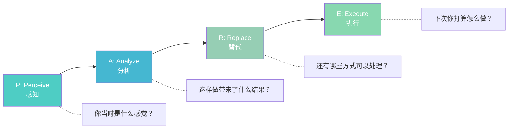
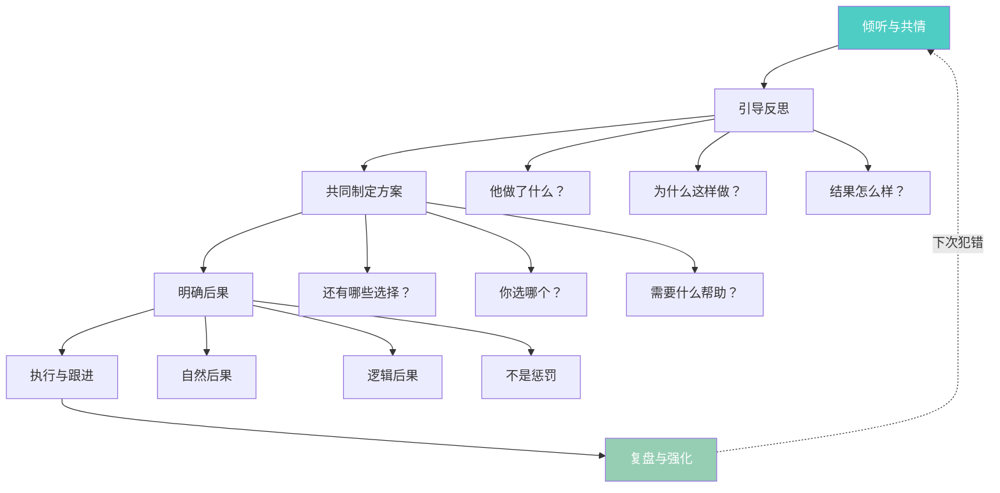

## 案例八：孩子犯错——倾听中的教育智慧

孩子犯错的时刻，恰恰是教育的黄金窗口。然而多数父母在这个窗口里做的不是"教育"，而是"训斥"——结果窗口关闭，孩子学到的唯一教训是"下次别让爸妈知道"。本案例拆解倾听式教育的完整方法论，从神经科学原理到分龄实操，帮助你在孩子最需要引导的时刻，成为他最想倾诉的人。

### 场景还原

你接到老师电话，说你 10 岁的儿子今天在学校和同学打架了。你回到家，儿子坐在沙发上，低着头不说话。

这个场景包含三层信息：

| 层级 | 信息 | 父母容易忽略的点 |
|------|------|------------------|
| 事实层 | 孩子打架了 | 只知道结果，不知道原因 |
| 情绪层 | 孩子低着头不说话 | 他可能在害怕、羞愧、委屈，或兼而有之 |
| 关系层 | 孩子选择沉默而非主动坦白 | 说明他预判了父母的反应是惩罚，而非帮助 |

**关键认知**：孩子的沉默不是"不认错"，而是"自我保护"。他正在评估——"说实话会换来什么？" 你的第一句话，决定了这个评估的结果。

### 为什么训斥式回应必然失败

#### 神经科学解释

当孩子面对父母的愤怒质问时，大脑会发生以下反应：

哈佛大学儿童发展中心的研究表明：当孩子处于高压力状态时，皮质醇水平飙升，前额叶皮层（负责逻辑推理、后果评估、冲动控制的脑区）的血流量下降高达 40%。这意味着——**你越是愤怒地要求孩子"想清楚再说"，他的大脑越没有能力去"想清楚"**。

#### 训斥的四重伤害

| 伤害类型 | 具体表现 | 长期后果 |
|----------|----------|----------|
| 信任断裂 | "说了会被骂，不如不说" | 亲子沟通通道关闭，青春期全面封锁信息 |
| 自我否定 | "我就是个坏孩子" | 形成固定型思维，遇事回避而非面对 |
| 策略错误 | "下次藏好就行" | 学会撒谎和隐瞒，而非解决问题 |
| 情感隔离 | "爸妈只关心对错，不关心我" | 安全依恋受损，成年后亲密关系困难 |

### 错误示范与逐句拆解

> "你又打架了？！跟你说过多少次了不能打人！你怎么就是不听话？你看看人家 XXX，人家怎么不打架？你今天给我说清楚，为什么要打人？！"

逐句分析这句话里包含的六种沟通毒素：

| 原话 | 毒素类型 | 孩子内心翻译 |
|------|----------|--------------|
| "你又打架了？！" | 质问式开场 | "他已经认定我有罪了" |
| "跟你说过多少次" | 翻旧账 | "我永远洗不掉这个标签" |
| "不能打人" | 未审先判 | "他根本不想听原因" |
| "你怎么就是不听话" | 人格攻击 | "我是个坏孩子" |
| "看看人家 XXX" | 比较贬低 | "我不如别人，我让他失望了" |
| "给我说清楚" | 审讯语气 | "这不是对话，是审判" |

**核心问题**：这段话的潜台词是"我是法官，你是被告"。孩子接收到的信号是——父母不是来帮助我的，是来定罪的。在审判席上，被告的第一反应永远是自我保护，而非坦白从宽。

### 正确示范与分步拆解

#### 第一阶段：建立安全场域

> （走到儿子身边坐下，保持视线平齐，不要站着居高临下）
>
> "我接到老师的电话了。"（**陈述已知事实，不加评判**）
>
> ……（停顿 3-5 秒，观察孩子的身体语言）
>
> "你愿意跟我说说今天发生了什么吗？"（**邀请，不是命令**）

**动作要领**：

- **坐下**：物理高度差会强化权力感。坐下意味着"我跟你在一起"，而非"我在你上面"。
- **视线平齐**：10 岁孩子坐着时，成人站着会形成 1 米以上的高度差，这在进化心理学中等同于"大型威胁源"。
- **先陈述事实再邀请**："我接到电话了"让孩子知道你已经知情，省去他试探"爸妈知道多少"的博弈，直接进入正题。
- **用"愿意"而非"能不能"**："你能不能说说"暗含"你有义务说"；"你愿意说说"则把主动权交给孩子。

#### 第二阶段：容纳沉默

> ……（如果孩子不说话，保持安静。不要追问、不要叹气、不要露出不耐烦的表情）
>
> "你不想说也没关系，等你准备好了再说。"（**给予时间和空间**）
>
> "不管发生了什么，爸爸/妈妈都爱你。"（**提供无条件的安全感**）

**为什么沉默至关重要**：

多数父母无法忍受超过 10 秒的沉默，会觉得"冷场了"而急于填补。但孩子处理情绪的速度比成人慢——他需要时间来：

1. 评估当前环境是否安全
2. 整理自己混乱的情绪
3. 鼓起勇气面对已经发生的事
4. 组织语言准备表达

研究表明，将等待时间从 3 秒延长到 10 秒以上，儿童主动表达的意愿提升约 60%，表达的信息量增加约 40%。

**"不管发生什么都爱你"这句话为什么是关键**：它直接回答了孩子内心最大的恐惧——"爸妈会不会因此不爱我了？" 这句话不是纵容错误行为，而是将"行为"和"人"分离：你的行为需要讨论，但你作为一个人是被完全接纳的。

#### 第三阶段：倾听与共情

> ……（孩子开始说出事情经过："那个同学说我妈是……所以我就……"）
>
> "我听明白了。那个同学先说了很难听的话，你觉得很生气，所以动了手。"（**复述事实 + 命名情绪**）
>
> "被人说那些话确实会很生气，这种感受我能理解。"（**接纳情绪，不等于认可行为**）

**复述的三层结构**：

| 层次 | 示例 | 作用 |
|------|------|------|
| 事实复述 | "那个同学说了难听的话" | 确认你真的在听，没有误解 |
| 情感命名 | "你觉得很生气" | 帮孩子识别和表达自己的情绪 |
| 行为联结 | "所以动了手" | 将情绪和行为关联，为后续讨论做铺垫 |

**"接纳情绪"与"认可行为"的区分**——这是最核心的教育技巧：

- ✅ "你很生气，这种感受是正常的"——接纳情绪
- ✅ "动手打人这个做法，我们需要讨论"——引导行为
- ❌ "你生气就可以打人吗？"——否定情绪 + 否定行为，双重打击

孩子需要先感到自己的情绪被理解，才有心理资源去反思自己的行为。如果情绪都没被看见，他会把所有精力用在"捍卫自己的感受"上，根本没有余力去思考"下次怎么办"。

#### 第四阶段：引导反思

> "不过，动手打人这个做法，你觉得是最好的解决方式吗？"（**用提问代替说教**）
>
> ……（孩子回答："可是他先骂我的……"）
>
> "嗯，他先挑衅确实不对。我们先不讨论他的问题，就说你这边——如果下次再遇到类似的情况，你觉得还有哪些方式可以处理？"（**承认对方的错，但聚焦自家孩子的选择**）
>
> ……（和孩子一起列出选项：告诉老师、走开冷静、用语言回应、找同学帮忙等）
>
> "这些方法你觉得哪个最适合你？"（**让孩子自己选择，增强自主感**）

**引导反思的提问框架**（PARE 模型）：

| 步骤 | 提问示例 | 目的 |
|------|----------|------|
| Perceive（感知） | "你当时是什么感觉？" | 帮孩子回顾和识别情绪 |
| Analyze（分析） | "这样做结果怎么样？" | 引导孩子看到行为的后果 |
| Replace（替代） | "还有哪些方式可以处理？" | 拓展孩子的行为选项库 |
| Execute（执行） | "下次遇到这种情况你打算怎么做？" | 将反思转化为行动计划 |

#### 第五阶段：表达支持

> "如果需要的话，我可以和你一起去跟那个同学谈谈，或者请老师帮忙。"（**提供具体支持，不是空洞的"有事找我"**）
>
> "你已经很勇敢了，愿意把事情告诉我。"（**强化坦诚行为**）

**支持的三要素**：

- **具体化**："我和你一起去谈"比"爸爸支持你"有力得多——孩子知道支持长什么样
- **选择权**："或者请老师帮忙"——给选项，不替孩子做决定
- **正向强化**："你愿意告诉我，这很勇敢"——让孩子知道"下次说实话是安全的"

### 不同犯错类型的应对策略

孩子犯的错各不相同，倾听的侧重点也需要调整：

| 错误类型 | 典型场景 | 倾听重点 | 引导方向 |
|----------|----------|----------|----------|
| 冲动型 | 打架、摔东西、说狠话 | 先处理情绪，再讨论行为 | 情绪管理技巧、冷静策略 |
| 试探型 | 撒谎、偷拿东西、违反规则 | 了解背后的动机和需求 | 明确边界、满足合理需求 |
| 能力不足型 | 考试失利、比赛失误、社交碰壁 | 共情挫败感，肯定努力 | 具体改进方法、成长型思维 |
| 道德型 | 欺负他人、嘲笑弱者、不守承诺 | 严肃但不攻击地讨论价值观 | 同理心培养、换位思考练习 |
| 关系型 | 和朋友闹矛盾、被排挤、失恋 | 倾听感受，不急于评判对错 | 社交技能、边界意识 |

### 分龄调整指南

同一个"孩子犯错"的场景，面对不同年龄段的孩子，倾听策略需要显著调整：

#### 3-6 岁：简短 + 具体 + 行动导向

这个阶段的孩子语言能力有限，抽象思维尚未发展，无法进行复杂的因果推理。

**对话模板**：

> "妈妈看到你把弟弟推倒了。"（**描述行为，不加标签**）
>
> "你刚才是不是很生气？"（**帮助命名情绪**）
>
> "生气的时候，我们可以说'我很生气'，但是不能推人。"（**给出明确规则**）
>
> "来，我们去看看弟弟有没有受伤，然后你跟弟弟说声对不起。"（**给出具体行动步骤**）

**要点**：少讲道理，多给规则和行动。3 岁孩子不需要理解"为什么不能打人"的伦理学论证，他需要知道"生气了可以做什么、不可以做什么"。

#### 7-12 岁：倾听 + 引导 + 共同决策

本案例中的 10 岁正处于这个阶段。孩子已经具备一定的因果推理能力，开始在意公平和正义，渴望被当作"大人"对待。

**核心策略**：用 PARE 模型引导他自主反思，让他参与制定规则和后果。

**对话模板**（完整版见上方正确示范）：

> "你愿意说说发生了什么吗？"
>
> "我理解你为什么生气。不过动手这个方式，我们一起想想有没有更好的选择？"
>
> "你觉得下次遇到这种情况可以怎么做？"

#### 13-18 岁：尊重 + 平等 + 留空间

青春期孩子最强烈的诉求是"被尊重"和"有隐私"。过度追问会适得其反。

**对话模板**：

> "老师跟我说了一些今天的事。如果你想聊，我在。"（**简短陈述 + 开放邀请**）
>
> ……（如果孩子不回应）
>
> "行，你自己先想想。需要我的时候随时说。"（**不追问、不施压**）
>
> ……（如果孩子开始说）
>
> "嗯，然后呢？" "你当时怎么想的？"（**少评价，多追问细节**）
>
> "你打算怎么处理？需要我帮什么忙吗？"（**把主导权交给孩子**）

**要点**：青春期的孩子如果主动来找你倾诉，说明亲子关系质量已经很高。此时最重要的是"管住嘴"——少给建议，多听。他需要的不是解决方案，而是一个安全的出口。

### 父母常见误区与纠正

#### 误区一：急于"解决问题"

**典型表现**：孩子刚开口说了两句，父母立刻打断："你应该这样做……"

**问题**：孩子感受到的是"你不在乎我的感受，你只想证明你比我聪明"。

**纠正**：听完再回应。完整的倾听流程是：安静听完 → 复述确认 → 共情感受 → 询问需求 → 再给建议（如果孩子需要的话）。

#### 误区二：把"倾听"变成"套话"

**典型表现**：假装温和地问"你愿意说说吗"，孩子说完后立刻翻脸开始训斥。

**问题**：这比直接训斥更糟糕——它教会孩子"爸妈的温和是陷阱"。一次这样的经历，需要用十次真诚的倾听才能修复信任。

**纠正**：如果你还没有准备好不带评判地听完，宁可先说"我现在有点生气，需要先冷静一下，我们半小时后再谈"，也不要伪装平静。

#### 误区三：用"我都是为你好"绑架对话

**典型表现**："我骂你是因为爱你，你长大就明白了。"

**问题**：爱是感受，不是声明。如果孩子感受到的是恐惧和压力，你说再多"这是爱"也无济于事。

**纠正**：用行为而非语言表达爱——坐下、倾听、拥抱、陪伴。这些不需要翻译，孩子天然能感受到。

#### 误区四：只谈行为不谈感受

**典型表现**：快速进入"下次不许再这样了"模式，跳过所有情感环节。

**问题**：孩子的情绪没有被处理，它不会消失，只会在下一次以更激烈的方式爆发。

**纠正**：在讨论"怎么办"之前，先确认"你现在感觉怎么样"。情绪被看见了，才有空间去思考行为。

#### 误区五：事后反复提起

**典型表现**：事情已经解决了，之后每次孩子犯错都拿出来："你上次不也打架了吗？"

**问题**：这等于告诉孩子"你永远翻不了身"，彻底摧毁改正的动力。

**纠正**：事情过了就过了。如果需要回顾，聚焦于"你上次用了什么方法解决的？这次也可以试试"——将过去的经验转化为正面资源。

### 倾听之后：行为引导的完整框架

倾听不是终点，而是起点。孩子表达完、情绪平复之后，还需要一个结构化的行为引导过程：

#### 自然后果 vs 逻辑后果 vs 惩罚

| 类型 | 定义 | 示例（打架场景） | 教育效果 |
|------|------|-------------------|----------|
| 自然后果 | 行为本身带来的直接结果 | 同学不愿和他玩、被老师批评 | 高——孩子直接体验因果关系 |
| 逻辑后果 | 与行为相关的合理结果 | 需要向同学道歉、暂时不能参加课间活动 | 中高——帮助孩子理解社会规则 |
| 惩罚 | 与行为无关的惩罚手段 | 一周不许看电视、罚站 | 低——孩子学到的是"如何避免被罚"，而非"为什么不该这样做" |

**核心原则**：后果是为了帮助孩子学习，不是为了让他"吃苦头"。如果一个后果不能帮助孩子理解"我的选择带来了什么结果"，它就不是教育，只是发泄。

#### 跟进复盘的时机

| 时间点 | 做什么 | 话术示例 |
|--------|--------|----------|
| 当天晚些时候 | 轻松地确认状态 | "今天聊完感觉怎么样？" |
| 第二天 | 观察有没有后续 | "和那个同学现在怎么样了？" |
| 一周后 | 正面强化 | "最近遇到类似的事你是怎么处理的？做得很好。" |
| 下次类似情况 | 唤起成功经验 | "上次你用了什么方法？这次也可以试试。" |

### 何时需要专业帮助

大多数孩子犯错可以通过家庭内的倾听和引导解决。但以下情况建议寻求专业支持：

| 信号 | 可能的问题 | 建议行动 |
|------|-----------|----------|
| 频繁且升级的攻击行为 | 情绪调节障碍、校园霸凌 | 儿童心理咨询师 |
| 持续撒谎且越来越精密 | 焦虑、安全感缺失 | 家庭治疗 |
| 自伤或伤害动物 | 严重情绪困扰 | 立即就医 |
| 突然的行为巨变（原本乖巧突然叛逆） | 可能遭遇创伤事件 | 专业评估 |
| 家庭内部无法保持冷静对话 | 亲子关系模式需要调整 | 家长自身心理咨询 |

**提醒**：寻求专业帮助不是"承认自己教育失败"，而是"为孩子提供更好的资源"。这本身就是一种教育智慧。

### 核心要点总结

孩子犯错时的倾听，本质上是一次"关系投资"——你在这个时刻投入的理解和耐心，会在未来十年甚至更长时间里，以孩子愿意对你敞开心扉的形式回报给你。

记住三个核心原则：

1. **先连接，再纠正**——孩子需要先感到被理解，才有能力去反思行为
2. **提问比说教有效**——"你觉得呢？"比"你应该……"更能激发真正的思考
3. **行为可以不被接受，但人永远被接纳**——"打人不对"可以说，但"你是坏孩子"永远不能说

教育的最高境界不是让孩子害怕犯错，而是让孩子知道——即使犯了错，家永远是可以说实话的地方。
