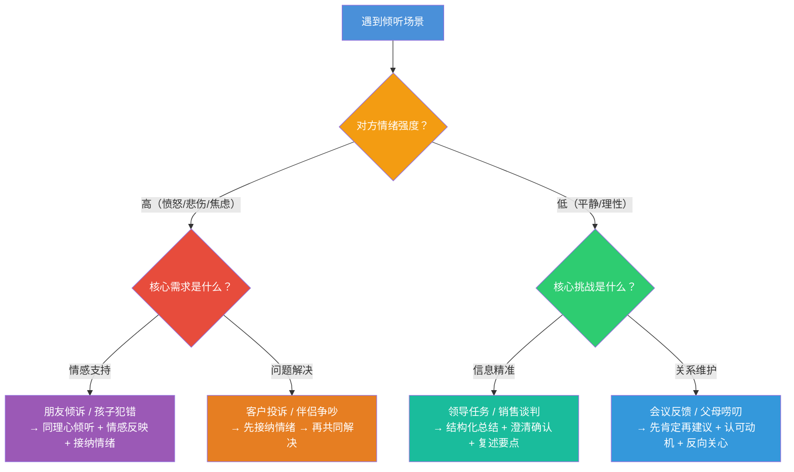

## 案例汇总与技巧对照表

前面八个案例覆盖了倾听在生活中最常见的八种场景。每个案例都从心理学机制、错误模式、正确示范、分阶段实操四个维度进行了深度拆解。本章作为整个案例系列的收尾，将完成三件事：第一，建立跨场景的技巧对照体系，让你看清哪些技巧是通用的、哪些是场景专属的；第二，提炼出倾听的底层模式，帮助你从"记招式"升级到"懂原理"；第三，提供一套自评工具和进阶路线图，让你在合上这本书之后，依然有清晰的成长路径。

---

### 八案全景速览

在深入对照之前，先用一张总览表把八个案例的核心信息拉齐。这张表不是简单的罗列——它的设计逻辑是：**看到场景→识别挑战→匹配技巧→回溯案例**。当你在现实中遇到类似场景时，可以先查表定位，再翻到对应案例深读。

| 案例 | 场景 | 对话对象 | 核心倾听挑战 | 关键技巧（优先级排序） | 最常见致命错误 | 情绪强度 |
|------|------|---------|-------------|---------------------|---------------|---------|
| 案例一 | 朋友深夜倾诉 | 朋友 | 情绪支持，不急于给建议 | ①同理心倾听 ②情感反映 ③搁置评判 | 急于给建议、情感抢夺 | ★★★★ |
| 案例二 | 领导布置任务 | 上级 | 精准捕获信息，避免遗漏 | ①结构化总结 ②澄清确认 ③复述要点 | 假装听懂、只记细节丢目标 | ★★ |
| 案例三 | 客户投诉 | 客户 | 情绪管理，先处理心情再处理事情 | ①接纳情绪 ②不急于解释 ③明确行动 | 防御性辩解、过早给方案 | ★★★★★ |
| 案例四 | 伴侣争吵 | 伴侣 | 情绪降级，避免冲突升级 | ①不反驳字眼 ②情感反映 ③共同解决 | 纠正事实、理性分析、冷战回避 | ★★★★★ |
| 案例五 | 会议发言 | 同事 | 建设性反馈，保护关系 | ①先肯定再建议 ②用提问代替否定 ③对事不对人 | 直接否定、公开批评 | ★★★ |
| 案例六 | 父母唠叨 | 父母 | 理解代际差异，接受关爱 | ①认可动机 ②给出回应 ③反向关心 | 不耐烦打断、敷衍应付 | ★★★ |
| 案例七 | 销售谈判 | 客户/对手 | 深度需求挖掘 | ①先问再推 ②澄清需求 ③总结核心 | 急于推销、只听表面需求 | ★★★ |
| 案例八 | 孩子犯错 | 孩子 | 建立信任，引导而非说教 | ①邀请表达 ②接纳情绪 ③引导思考 | 训斥指责、翻旧账 | ★★★★ |

**阅读这张表的方法**：先找到你最常遇到的场景，看"核心倾听挑战"是否准确描述了你的困难，再看"关键技巧"是否和你目前的做法一致。如果不一致——恭喜你，你找到了一个明确的改进方向。

---

### 场景×技巧交叉矩阵

上面的速览表是纵向看（一个场景用哪些技巧），下面这张矩阵是横向看（一个技巧在哪些场景中出现）。技巧出现的场景越多，说明它越是一个**通用底层能力**；只在特定场景出现的，则是**场景专用技能**。

| 倾听技巧 | 朋友倾诉 | 领导任务 | 客户投诉 | 伴侣争吵 | 会议反馈 | 父母唠叨 | 销售谈判 | 孩子犯错 | 出现次数 |
|---------|:-------:|:-------:|:-------:|:-------:|:-------:|:-------:|:-------:|:-------:|:-------:|
| 同理心倾听 | ★ | | ★ | ★ | | ★ | | ★ | 5 |
| 情感反映 | ★ | | ★ | ★ | | | | ★ | 4 |
| 搁置评判 | ★ | | ★ | ★ | ★ | ★ | | ★ | 6 |
| 结构化总结 | | ★ | | | ★ | | ★ | | 3 |
| 澄清确认 | | ★ | | | ★ | | ★ | | 3 |
| 接纳情绪 | | | ★ | ★ | | ★ | | ★ | 4 |
| 不急于解释/建议 | ★ | | ★ | ★ | | | | | 3 |
| 先肯定再建议 | | | | | ★ | | | | 1 |
| 用提问代替否定 | | | | | ★ | | ★ | ★ | 3 |
| 认可动机 | | | | | | ★ | | | 1 |
| 先问再推（探询优先） | | | | | | | ★ | | 1 |
| 引导式提问 | | | | | ★ | | ★ | ★ | 3 |
| 不反驳字眼 | | | | ★ | | | | | 1 |
| 反向关心 | | | | | | ★ | | | 1 |

**从这张矩阵中可以读出三层信息**：

**第一层：三大通用基石技巧**

"搁置评判"出现在六个场景中，是出现频率最高的技巧。这意味着：无论面对谁、在什么场景下，**不急着下结论**都是倾听的第一课。它不是一种技巧，而是一种底层心态。

"同理心倾听"出现在五个场景中，排名第二。同理心不是"我理解你"这句口头禅，而是一种**主动进入对方心理世界**的能力——暂时放下自己的框架，用对方的眼睛看问题。

"情感反映"和"接纳情绪"各出现四次，并列第三。这两个技巧的本质相同：**让对方感到"我的情绪是被允许的"**。区别在于，情感反映是主动说出来（"你现在很失望"），接纳情绪是不否定、不压制（不打断、不纠正）。

**第二层：场景分化的专用技巧**

"结构化总结""澄清确认"主要出现在信息密集型场景（领导任务、会议、销售），这些场景的核心挑战不是情绪，而是**信息的精准度**。

"先肯定再建议""用提问代替否定"集中在反馈型场景（会议、销售、教育），这些场景的核心挑战是**给反馈而不伤关系**。

"认可动机""反向关心"只出现在代际沟通场景（父母唠叨），这是因为代际沟通的特殊性在于**动机和行为的错位**——父母的唠叨行为让人烦，但动机是爱。

**第三层：技巧组合的场景特异性**

没有任何一个场景只用一种技巧就能搞定。每个场景都是**技巧组合**的结果。比如伴侣争吵需要"不反驳字眼＋情感反映＋共同解决"三步走，缺任何一步都会失败——只做到不反驳但不做情感反映，对方会觉得你在敷衍；做到了情感反映但不走向共同解决，问题会反复爆发。

---

### 四维分类框架：从场景特征选技巧

八个案例看起来各不相同，但如果抽象到**场景特征**层面，可以归纳为四个维度。掌握这个框架后，即使遇到本书没有覆盖的新场景，你也能快速判断该用哪些技巧。

**使用方法**：遇到任何倾听场景，先判断两个问题——"对方情绪高还是低？"和"核心需求/挑战是什么？"——然后沿着决策树走到对应的技巧组合。这比死记硬背八个案例的细节要高效得多。

#### 维度一：情绪强度

情绪强度决定了你的**第一步**是什么。高强度情绪场景（伴侣争吵、客户投诉、朋友倾诉）必须先处理情绪，任何试图"讲道理"或"给方案"的行为都会被对方的大脑解读为"你不理解我"。低强度情绪场景（领导任务、会议反馈）可以相对快速进入信息处理阶段，但也不能完全跳过情感连接。

**判断指标**：

| 情绪信号 | 高强度表现 | 低强度表现 |
|---------|-----------|-----------|
| 语速 | 明显加快或明显放慢 | 正常 |
| 音量 | 提高，或者刻意压低 | 正常 |
| 用词 | 绝对化（"总是""从来""根本"） | 描述性（"有时候""这次"） |
| 身体 | 前倾、握拳、呼吸急促 | 放松、正常姿态 |
| 话题跳跃 | 从一个抱怨连到另一个 | 围绕单一主题展开 |

#### 维度二：关系类型

关系类型决定了你的**姿态**。上下级关系需要适度的结构化和确认；亲密关系需要更多的脆弱性和情感投入；服务关系需要专业感和行动承诺；代际关系需要尊重和耐心。

#### 维度三：信息密度

信息密度决定了你需要使用的**倾听工具**。高信息密度场景（领导布置复杂任务、销售谈判中的需求挖掘）需要笔记、复述、结构化总结等"信息管理"工具。低信息密度场景（朋友倾诉、父母唠叨）更需要"情感管理"工具——你的注意力不在信息上，而在对方的情绪和需求上。

#### 维度四：目标导向

目标导向决定了你的**终点**在哪里。有些倾听的目标是"让对方感到被理解"（朋友倾诉、伴侣争吵的前期），有些是"获取准确信息"（领导任务），有些是"推动行动"（客户投诉的后期、销售谈判），有些是"改变行为"（孩子犯错）。目标不同，你的倾听策略完全不同。

---

### 底层模式提炼：从"记招式"到"懂原理"

八个案例拆解了几十种具体技巧，但如果把它们往底层推，所有技巧都可以归结为**五条底层模式**。掌握这五条模式，你不需要记住每一种技巧的名称，因为在任何场景中，你都能从模式推导出应该怎么做。

#### 模式一：先连接，再解决问题

**在八个案例中的体现**：

- 案例一（朋友倾诉）：先共情，再考虑是否给建议
- 案例三（客户投诉）：先接纳愤怒，再解释原因
- 案例四（伴侣争吵）：先情感反映，再讨论家务分配
- 案例六（父母唠叨）：先认可关心，再表达边界
- 案例八（孩子犯错）：先建立安全感，再引导反思

**底层原理**：人的情绪脑和理性脑是"跷跷板"关系——情绪脑活跃时，理性脑就下线。只有当对方感到"你理解我"（情绪脑得到安抚），理性脑才会重新上线，此时才有可能进行问题解决、信息传递、行为引导等理性活动。

**实操检验标准**：在你说出任何"解决方案""建议""解释"之前，问自己一个问题——**"对方是否已经感到被理解了？"** 如果不确定，继续做情感连接。判断方法：对方的语速是否放慢了？身体是否放松了？是否开始主动补充信息而不是反复强调同一个抱怨？

#### 模式二：听"没说出口的话"

**在八个案例中的体现**：

- 案例一：朋友说"不知道该怎么办"，真正的需求是"有人陪我"
- 案例三：客户说"你们太差了"，真正的需求是"我很害怕这个问题解决不了"
- 案例四：伴侣说"你根本不把这个家当回事"，真正的需求是"我对你重要吗"
- 案例七：客户说"大同小异"，真正的需求是"你们谁能真正理解我的问题"
- 案例八：孩子低头不说话，真正的信息是"我在害怕你的反应"

**底层原理**：人们很少直接说出自己的核心需求，因为直接暴露需求让人感到脆弱。他们会用**抱怨、批评、沉默、反问**等方式包装需求。倾听高手的能力不在于听懂字面意思，而在于**穿透包装，触达需求**。

**实操检验标准**：每当你听到一句抱怨或批评，问自己——**"如果把这句话翻译成一个需求，它是什么？"** "你总是不洗碗"→"我需要感到被支持"。"你们方案都差不多"→"我需要有人真正理解我的问题"。

#### 模式三：用提问代替告知

**在八个案例中的体现**：

- 案例五（会议反馈）："你觉得这个方案的哪个部分最有潜力？"比"这个方案有问题"好十倍
- 案例七（销售谈判）：先问"您最关心的是什么？"比直接推产品有效一百倍
- 案例八（孩子犯错）："你能告诉我发生了什么吗？"比"你为什么打架？"更能打开对话

**底层原理**：当一个人"被告知"时，他的大脑会自动进入防御模式（评估"你说的对不对"）；当一个人"被提问"时，他的大脑会进入思考模式（"让我想想怎么回答"）。提问把主动权交给对方，让对方从"被评判者"变成"表达者"——这从根本上改变了对话的动力学。

**实操检验标准**：在你说出一句陈述句之前，问自己——**"这句话能不能改成一个问句？"** 如果能，改成问句。"你这样做不对"→"你当时是怎么考虑的？""这个方案有三个问题"→"你觉得这个方案还有哪些可以优化的地方？"

#### 模式四：匹配情绪频率，再引导方向

**在八个案例中的体现**：

- 案例一：朋友悲伤时，你也放慢语速、降低音量，而不是用兴奋的语气说"别难过"
- 案例三：客户愤怒时，你用坚定而平静的语气说"我理解这确实让人非常恼火"
- 案例四：伴侣激动时，你不跟着激动，但也不冷冰冰——而是用温和但有力的语气说"我听到了"
- 案例六：父母唠叨时，你用认真（而非敷衍）的语气回应

**底层原理**：人类有一种本能的"情绪同步"机制——当你和对方的情绪频率匹配时，对方会本能地感到"你是自己人"，防御会降低。但"匹配"不是"复制"——对方愤怒你也愤怒，那叫冲突升级。真正的匹配是**在情绪强度上靠近，在情绪方向上稳定**——让对方感到"你理解我的感受，但你没有被我的情绪淹没"。

**实操检验标准**：想象你的情绪是一个"音量旋钮"。对方的音量是8，你是2，对方会觉得你冷淡；对方是8，你也是8，你们会吵起来。最佳状态是**你在5-6的位置**——既不是冷淡的旁观者，也不是情绪的同谋者，而是一个"稳定的在场者"。

#### 模式五：收尾要有行动锚点

**在八个案例中的体现**：

- 案例一：倾诉结束后，"你要是今晚睡不着，随时给我打电话"——一个具体的、可执行的承诺
- 案例二（领导任务）：最后复述一遍任务要点和时间节点——把信息锚定
- 案例三（客户投诉）：明确"我会在明天下午3点前给您回复"——一个有时间约束的行动
- 案例四（伴侣争吵）：争吵后提出"这周六我们一起坐下来聊聊家务怎么分"——把问题转化为共同行动
- 案例七（销售谈判）：确认"我下周二给您发一份定制方案"——把对话转化为推进

**底层原理**：对话的**结尾**比**过程**更容易被记住（心理学中的"近因效应"）。一个好的收尾能把整段对话的情绪基调从"问题"转向"希望"。同时，没有行动锚点的倾听是不完整的——对方会觉得"你听了，但什么也不会改变"。

**实操检验标准**：在每次重要对话结束时，问自己——**"对方离开这段对话时，带着什么？"** 如果只是"被理解的感觉"，那已经不错了；但如果再加上一个具体的行动承诺，那就从"不错"升级为"卓越"。

---

### 技巧迁移指南：当场景不在八个案例之内

现实中的倾听场景远不止八种。当遇到本书没有直接覆盖的场景时，用以下四步法进行技巧迁移：

**第一步：场景画像**

用四维框架（情绪强度、关系类型、信息密度、目标导向）给当前场景"画像"。比如"同事向你抱怨另一个同事"——情绪强度中高、关系类型是平级同事、信息密度中等、目标是关系维护。这个画像会告诉你参考案例五（会议反馈）和案例一（朋友倾诉）的组合。

**第二步：识别核心矛盾**

每个倾听场景都有一个核心矛盾。朋友倾诉的矛盾是"我想帮忙"vs"他只需要被听"；领导任务的矛盾是"我想表现积极"vs"我需要先确认理解"；伴侣争吵的矛盾是"我是对的"vs"关系比对错重要"。找到核心矛盾，你就知道哪些本能反应需要克制。

**第三步：选取技巧组合**

根据场景画像和核心矛盾，从交叉矩阵中选取2-4个最相关的技巧。不要贪多——在紧张的对话中，你最多能记住并执行3个技巧。选择标准：哪个技巧最能解决核心矛盾？哪个技巧你最熟练？

**第四步：预演最坏情况**

在实际对话之前，预想对方可能说出的**最难回应**（最尖锐的批评、最出乎意料的问题、最强烈的情绪），然后预演你的应对。这不是为了"赢"，而是为了在真实对话中不被对方的反应"击穿"你的倾听框架。

---

### 常见误区：跨场景的七种典型失败模式

从八个案例中提取出的最常见的倾听失败模式，不是按场景分类，而是按**失败的本质**分类。如果你发现自己有其中任何一种倾向，建议把对应的案例重新精读一遍。

#### 误区一：建议冲动——"我必须帮他解决问题"

**出现场景**：朋友倾诉、伴侣争吵、孩子犯错

**本质**：看到别人痛苦时，大脑会产生强烈的"修复"欲望。这种欲望往往不是为了对方，而是为了缓解**我们自己**无法忍受对方痛苦的不适感。

**破解方法**：在给建议之前，先在心里默数五秒。这五秒用来问自己一个问题——"他现在需要的是建议，还是被理解？"如果你不确定，做一个试探："你现在是想聊聊感受，还是想一起想想怎么办？"把选择权交给对方。

#### 误区二：防御性倾听——"他在攻击我"

**出现场景**：客户投诉、伴侣争吵、会议反馈

**本质**：当对方的话被大脑解读为"威胁"时，杏仁核会启动战斗-逃跑反应。你的注意力从"对方在说什么"转移到"我如何反驳/保护自己"。从这一刻起，你已经不是在倾听了。

**破解方法**：当感到被攻击时，在心里对自己说一句暗语——"他说的是他的感受，不是我的价值"。这句话的作用是把"针对我的攻击"重新框定为"对方的情绪表达"。重新框定之后，你才能听到对方真正想说的东西。

#### 误区三：情感抢夺——"我也经历过"

**出现场景**：朋友倾诉、伴侣争吵

**本质**：分享自己的经历看起来是在"共情"，实际上是在抢夺对方的表达空间。焦点从"你"变成了"我"，对方从"被倾听者"变成了"你的故事的听众"。

**破解方法**：分享自己的经历之前，先完成至少三轮"情感反映"（即对方说了三段话，你做了三次情感回应）。如果三轮之后对方说"你有类似经历吗？"——这时候分享才是合适的。

#### 误区四：评判性倾听——"你当初就不应该"

**出现场景**：朋友倾诉、伴侣争吵、孩子犯错

**本质**：事后诸葛亮式的评判。潜台词是"你的判断力有问题"。对方本来已经在自我怀疑了，评判会把自我怀疑变成自我否定。

**破解方法**：把"你当初不应该……"替换成"当时是什么让你做了这个决定？"前一句是审判，后一句是理解。两者信息量相同，但对关系的影响天差地别。

#### 误区五：假装倾听——"嗯嗯，我在听"

**出现场景**：父母唠叨、领导任务、会议发言

**本质**：表面上在听，脑子里在想别的事。这种"伪倾听"比不听更糟糕——因为它给对方传递了一个虚假信号"你被关注了"，当对方发现真相时，信任的损失比直接说"我现在没空"更大。

**破解方法**：如果确实无法集中注意力，诚实地告诉对方——"我现在脑子里有件事在转，可能没办法完全集中注意力。你是想现在聊，还是我们等会儿找个安静的时间？"诚实比伪装更能保护关系。

#### 误区六：只听内容不听情绪——"所以到底发生了什么？"

**出现场景**：伴侣争吵、客户投诉、孩子犯错

**本质**：注意力全部放在"事实"上，忽略了事实背后的情绪。对方说"你每次都迟到"，你只听到"迟到"这个事实，然后开始解释"我今天是因为堵车"——但对方真正想说的是"我觉得不被你重视"。

**破解方法**：每当你发现自己在准备"解释"或"反驳"时，暂停，问自己——"他这句话背后的感受是什么？"先回应感受，再处理事实。

#### 误区七：过早关闭对话——"好了好了，我知道了"

**出现场景**：父母唠叨、朋友倾诉、伴侣争吵

**本质**：对方还没说完，你就急着结束对话。原因可能是你不耐烦了，也可能是你觉得已经听够了。但对对方来说，"被打断"等于"你说的不重要"。

**破解方法**：在你想说"好了"之前，先确认一件事——"对方是说完了吗？还是只是暂停了一下？"很多深度情感表达中间会有停顿，那不是结束，而是鼓起勇气继续的准备。

---

### 自评工具：倾听能力雷达图

以下是一套自评量表，涵盖从八个案例中提炼的八个核心能力维度。每个维度有三个具体的行为指标。诚实评估自己（1-5分），然后画出你的能力雷达图。这不是考试——目的是找到你最大的提升空间。

#### 评分标准

- **1分**：从不这样做 / 完全没有意识到
- **2分**：偶尔这样做 / 知道但很难做到
- **3分**：有时这样做 / 在低压力场景下能做到
- **4分**：经常这样做 / 大多数场景下能做到
- **5分**：总是这样做 / 即使在高压力场景下也能做到

#### 八维度自评表

**维度一：搁置评判（对应案例一、三、四、五、六、八）**

1. 当别人和我倾诉时，我能在听完之前不给出评价（1-5分）
2. 当别人做了我不认同的选择时，我能先理解原因再表达看法（1-5分）
3. 当别人用绝对化词语（"总是""从来"）时，我不纠结于字面准确性（1-5分）

**维度二：同理心倾听（对应案例一、三、四、六、八）**

1. 我能准确识别对方话语中的情绪（不只是内容）（1-5分）
2. 我能用语言把对方的情绪"反映"回去（如"你现在很失望"）（1-5分）
3. 我能在对方情绪激动时保持冷静而不显得冷漠（1-5分）

**维度三：信息精准度（对应案例二、七）**

1. 在重要对话后，我能准确复述对方的核心要求（1-5分）
2. 我会在不确定的地方主动澄清，而不是假装听懂（1-5分）
3. 我能区分"事实""观点""情绪"三种不同类型的信息（1-5分）

**维度四：情绪管理（对应案例三、四）**

1. 当对方愤怒时，我不跟着愤怒（1-5分）
2. 当被误解时，我能先回应对方的情绪再澄清事实（1-5分）
3. 在争吵中，我能识别"追-逃循环"并主动打破它（1-5分）

**维度五：提问能力（对应案例五、七、八）**

1. 我能用开放式问题引导对方展开表达（1-5分）
2. 我能把否定句转化为提问（如把"你不对"改成"你怎么看"）（1-5分）
3. 我能通过追问挖出对方没有主动说出的信息（1-5分）

**维度六：关系敏感度（对应案例五、六）**

1. 我能在给反馈时照顾到对方的面子和自尊（1-5分）
2. 我能分辨对方唠叨/批评背后的真实关心（1-5分）
3. 我能在表达不同意见的同时让对方感到被尊重（1-5分）

**维度七：行动收尾（对应所有案例）**

1. 重要对话结束时，我会确认双方的理解一致（1-5分）
2. 我能给对方一个具体的、可执行的下一步（1-5分）
3. 对话结束后，我会跟进承诺的行动（1-5分）

**维度八：场景切换（综合能力）**

1. 我能根据不同的对象（领导/伴侣/朋友/客户）调整倾听方式（1-5分）
2. 我能在对话中实时判断对方的需求变化（从倾诉变为求助、从抱怨变为决策）（1-5分）
3. 我能在情绪被触发时主动暂停而不是本能反应（1-5分）

**如何使用自评结果**：

将24个评分加总（满分120分），同时标注每个维度的平均分（满分5分）。

| 总分区间 | 水平判断 | 下一步建议 |
|---------|---------|-----------|
| 24-48分 | 初学者：还没有形成倾听意识 | 从"搁置评判"开始，这是所有技巧的基础。选择一个最常遇到的场景，练习一周 |
| 49-72分 | 进阶者：有意识但执行不稳定 | 找到得分最低的2个维度，结合对应案例重点突破。每次对话后做3分钟复盘 |
| 73-96分 | 熟练者：大多数场景能应对 | 开始关注"技巧组合"和"场景切换"，在高压力场景中测试自己的极限 |
| 97-120分 | 精通者：倾听已成为本能 | 关注"未说出口的话"和"长期关系模式"，从单次对话技巧升级到关系经营能力 |

---

### 从八个案例到一套成长路线

#### 阶段一：建立意识（第1-2周）

**目标**：从"无意识的坏习惯"变成"有意识的笨拙"

**练习方法**：

1. 选择自评中得分最低的一个维度
2. 阅读对应的案例，重点看"错误示范"部分——那些错误就是你目前的默认模式
3. 每天选一次对话，刻意练习这个维度的第一个行为指标
4. 对话后记录：我做到了吗？对方的反应是什么？哪里卡住了？

**预期感受**：不自然、别扭、反应变慢。这是正常的——你正在用"有意识的控制"替代"无意识的习惯"，就像学开车时手忙脚乱一样。

#### 阶段二：形成肌肉记忆（第3-6周）

**目标**：从"刻意控制"变成"半自动执行"

**练习方法**：

1. 扩展到2-3个维度同时练习
2. 开始在中等压力场景中练习（如同事间的讨论、朋友间的深度聊天）
3. 每周做一次完整的自评，跟踪分数变化
4. 找一个"倾听伙伴"——你们互相给对方的倾听表现打分

**预期感受**：在简单场景中开始自然，在复杂场景中还是会退回到旧习惯。关键指标是"反应延迟"在缩短——从需要5秒思考到2秒就能做出合适的回应。

#### 阶段三：场景切换（第7-12周）

**目标**：从"一个场景能做到"变成"多个场景都能做到"

**练习方法**：

1. 刻意在不同场景中练习（工作、家庭、社交、服务场景）
2. 练习"四步迁移法"——遇到新场景时快速画像、选技巧、预演、执行
3. 关注"最难场景"——通常是伴侣争吵和客户投诉，因为情绪强度最高
4. 开始记录"金句"——在某个场景中效果特别好的一句话，存下来反复用

**预期感受**：大多数场景开始变自然，但偶尔遇到突发的高压力场景还是会"掉线"。

#### 阶段四：内化为本能（第13周+）

**目标**：从"我在用技巧"变成"我就是这样的人"

**标志**：不再需要在心里默念"先连接再解决""听没说出口的话"这些口诀——它们已经成为你听别人说话时的默认模式。你的注意力不再放在"我该怎么回应"上，而是完全放在"对方在说什么"上。

**这个阶段的进阶方向**：

- 从**单次对话技巧**升级到**长期关系模式**——不仅在一次对话中做得好，还能在关系的长线中持续创造安全的倾听空间
- 从**被动倾听**升级到**主动倾听**——不是等别人来找你倾诉，而是在日常对话中主动创造深度连接的机会
- 从**技巧使用者**升级到**倾听文化塑造者**——在你的团队、家庭、朋友圈中，你的倾听方式会影响周围人的沟通习惯

---

### 速查手册：八个场景的一页纸行动指南

当你没有时间翻阅完整案例时，以下八个速查卡可以帮你快速进入状态。每张卡只包含最核心的三个信息：**第一句话说什么**、**过程中做什么**、**最后怎么收尾**。

#### 速查卡一：朋友深夜倾诉

| 阶段 | 行动 | 语言模板 |
|------|------|---------|
| 开口 | 表达在场感 | "我在，你说。" |
| 过程 | 情感反映，不给建议 | "这件事真的让你很……（情绪词）" |
| 过程 | 搁置评判，不比较 | 不说"你应该""你不应该""我当年" |
| 收尾 | 给出具体陪伴承诺 | "你今晚要是睡不着，随时打给我" |

#### 速查卡二：领导布置任务

| 阶段 | 行动 | 语言模板 |
|------|------|---------|
| 开口 | 表达专注 | "好的，我在认真听。" |
| 过程 | 记笔记，标记不清楚的地方 | 用纸笔或电子设备记录关键信息 |
| 过程 | 在关键节点复述确认 | "我确认一下：您的意思是……对吗？" |
| 收尾 | 总结要点+确认时间 | "所以核心是A、B、C，截止时间是X，对吗？" |

#### 速查卡三：客户投诉

| 阶段 | 行动 | 语言模板 |
|------|------|---------|
| 开口 | 接纳情绪，不辩解 | "我能感受到这件事让您非常不满，这是完全可以理解的。" |
| 过程 | 不急于解释原因 | 让客户把情绪和事实都说完 |
| 过程 | 澄清事实细节 | "我确认一下具体情况……是这样吗？" |
| 收尾 | 给出明确行动+时间 | "我会在X时间之前给您Y方案。" |

#### 速查卡四：伴侣争吵

| 阶段 | 行动 | 语言模板 |
|------|------|---------|
| 开口 | 不反驳绝对化用词 | 不说"我没有每次""你才总是" |
| 过程 | 情感反映 | "你是觉得我不够重视这个家，对吗？" |
| 过程 | 承认对方的感受（即使不认同事实） | "你有这种感觉，说明我确实做得不够好。" |
| 收尾 | 提出共同解决 | "这周末我们一起商量一下怎么分工？" |

#### 速查卡五：会议发言反馈

| 阶段 | 行动 | 语言模板 |
|------|------|---------|
| 开口 | 先肯定 | "这个方案在X方面很有想法。" |
| 过程 | 用提问代替否定 | "关于Y部分，你是怎么考虑的？" |
| 过程 | 对事不对人 | 不说"你这个方案不行"，说"这个方案在Z方面可能有风险" |
| 收尾 | 表达支持 | "如果需要我帮忙，随时找我。" |

#### 速查卡六：父母唠叨

| 阶段 | 行动 | 语言模板 |
|------|------|---------|
| 开口 | 认可动机 | "妈，我知道你担心我。" |
| 过程 | 给出实际回应（不敷衍） | 用具体的语言回应具体内容，而不是"嗯嗯好好" |
| 过程 | 适度分享生活细节 | 让父母感到"被纳入你的生活" |
| 收尾 | 反向关心 | "你最近身体怎么样？别光操心我。" |

#### 速查卡七：销售谈判

| 阶段 | 行动 | 语言模板 |
|------|------|---------|
| 开口 | 先问再推 | "在介绍方案之前，我想先了解一下您的核心需求。" |
| 过程 | 深挖需求，不做假设 | "您说的'跟不上'，具体是指哪些方面？" |
| 过程 | 总结确认 | "所以您的核心需求是A，优先级最高的是B，对吗？" |
| 收尾 | 明确下一步 | "我回去做一份针对A和B的定制方案，周X给您。" |

#### 速查卡八：孩子犯错

| 阶段 | 行动 | 语言模板 |
|------|------|---------|
| 开口 | 创造安全感 | "我想听听你的说法，不会因为你说实话而罚你。" |
| 过程 | 邀请表达，不审讯 | "你能告诉我发生了什么吗？"（而非"你为什么打架？"） |
| 过程 | 接纳情绪再引导 | "你当时很生气/委屈，我理解。但打人这个行为确实不对。" |
| 收尾 | 引导思考解决方案 | "你觉得下次遇到这种情况，可以怎么做？" |

---

> 📝 **练习建议**：不要试图同时掌握所有八个场景的技巧。选择2-3个与你生活最相关的案例，先精读对应的完整案例文章，然后用速查卡做日常提醒，在接下来的两周中刻意练习。当这些场景的技巧开始变自然后，再扩展到其他场景。记住，倾听能力的成长不是"学完了就会了"，而是"练够了才内化了"。每一次真实的对话，都是一次练习机会。
