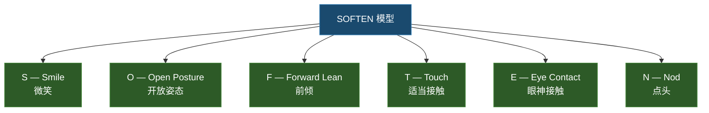

## 一、主动倾听技巧

### 1.1 什么是主动倾听

主动倾听（Active Listening）是所有倾听技巧的基石。它由心理学家托马斯·戈登（Thomas Gordon）在20世纪60年代首次系统化提出，最初应用于亲子沟通领域，后被广泛引入企业管理、心理咨询、冲突调解等场景，至今仍是全球沟通培训的核心模块。

主动倾听的核心理念是：**倾听不是被动的等待，而是一种需要全身心投入的主动行为**。它要求你不仅"听到"对方说了什么，还要通过语言和非语言的方式，让对方真切地感受到"你在认真听，你理解我"。

#### "主动"的含义

很多人把倾听理解为"安静地坐着，等对方说完"。这是最大的误解。主动倾听中的"主动"体现在三个层面：

| 维度 | 被动倾听 | 主动倾听 |
|------|----------|----------|
| **注意力** | 自然分配，听多少算多少 | 有意识地聚焦于对方，主动排除干扰 |
| **回应** | 偶尔"嗯"一声，或等对方说完再说 | 适时插入回应，用语言和肢体信号持续反馈 |
| **理解** | 停留在字面意思 | 主动思考"他为什么这样说"、"他的感受是什么"、"他真正需要什么" |
| **验证** | 假设自己听懂了 | 通过复述、提问等方式主动验证理解是否准确 |

心理学家Carl Rogers对主动倾听的本质有一个精辟的总结："真正的倾听，是暂时放弃用自己的参照系去评判，转而进入对方的参照系去理解。"这意味着主动倾听不仅是行为上的技巧，更是一种认知和态度上的转变。

#### 主动倾听的神经科学基础

现代脑科学研究揭示了主动倾听为什么如此"耗能"。当我们认真倾听他人说话时：

- **听觉皮层**处理声波信号，将声音转化为可识别的语言单元
- **韦尼克区**负责语义理解——解读"这句话是什么意思"
- **前额叶皮层**负责工作记忆和注意力调控——帮助你在纷杂的信息中保持聚焦，不走神
- **镜像神经元系统**让你能够"感同身受"——当对方描述痛苦时，你大脑中负责感受痛苦的区域也会被激活
- **杏仁核**负责情绪识别——帮你捕捉对方话语中的情绪信号

这意味着主动倾听是一项涉及听觉、语言、注意力、情绪、共情等多个脑区协同工作的复杂认知活动。fMRI研究证实，认真倾听时大脑的耗氧量与解数学题相当——它确实在"烧脑"。

理解这一点很重要：**如果你在对话后感到疲惫，那说明你可能真的在认真倾听**。同样，这也解释了为什么在高强度工作后我们的倾听质量会急剧下降——大脑的认知资源已经耗尽。

#### 主动倾听的SOFTEN模型

SOFTEN模型是国际沟通培训领域广泛使用的主动倾听行为框架。它将主动倾听的非语言行为归纳为六个维度：

| 维度 | 含义 | 具体做法 | 注意事项 |
|------|------|----------|----------|
| **S — Smile（微笑）** | 用友善的表情传递开放和接纳 | 在对方开始说话时给予自然微笑；在对方讲到轻松话题时保持微笑 | 不要在对方讲伤心事时微笑；微笑要自然，不要假笑 |
| **O — Open Posture（开放姿态）** | 身体姿态传递"我接纳你"的信号 | 双臂自然放下，不交叉；身体面向对方；双脚朝向对方 | 避免抱胸、双手插口袋等封闭姿态 |
| **F — Forward Lean（前倾）** | 身体微微前倾表示关注和兴趣 | 大约10-15度的前倾幅度即可 | 不要前倾过度，会给人压迫感 |
| **T — Touch（适当接触）** | 在关系允许的范围内，适当的肢体接触传递温暖 | 拍拍肩膀、握手（适用于关系亲密的场景） | 必须考虑关系亲密度、文化背景和场合；在职场中要特别谨慎 |
| **E — Eye Contact（眼神接触）** | 目光是最直接的关注信号 | 60%-70%的时间看着对方的眼睛区域 | 不同文化对眼神接触的规范不同（详见1.2节） |
| **N — Nod（点头）** | 适度点头表示"我在跟上你的思路" | 在对方说到关键点时点头；频率不要太快 | 不要像啄木鸟一样不停点，那反而显得敷衍 |

SOFTEN模型的价值在于，它给了初学者一个具体的、可操作的行为清单。当不确定该怎么做时，逐一检查这六个维度，基本能保证你在"看起来在认真听"。当然，真正的主动倾听不仅是"看起来在听"，但行为层面的改变往往是态度转变的起点。

***

### 1.2 眼神接触：最直接的关注信号

眼神接触是主动倾听中最基础也最具力量的非语言信号。神经科学研究表明，当两个人进行眼神接触时，双方大脑中的社会认知网络都会被激活——这在神经层面创造了一种"连接"的感觉。

#### 眼神接触的科学

英国心理学家Michael Argyle的研究发现，眼神接触在传递关注、信任和亲密感方面具有不可替代的作用。具体来说：

- **传递关注**：当你看着对方时，对方的大脑会接收到"这个人正在关注我"的信号，这激活了他的社会奖赏回路
- **促进理解**：眼神接触帮助你读取对方的微表情，从而更准确地理解其情绪状态
- **建立信任**：适当的眼神接触与可信度正相关——眼神游移的人更容易被怀疑在隐瞒什么
- **调节对话节奏**：眼神的保持和移开可以自然地控制对话的节奏——移开目光暗示"我在思考"，重新注视暗示"我准备回应了"

#### 具体做法

**黄金比例：60%-70%的注视时间**

在倾听过程中，大约60%-70%的时间应该看着对方的眼睛区域。这不是死盯着不放，而是在注视和自然移开之间交替。具体来说：

- 对方开始说话时，先注视对方，建立连接
- 对方说到关键内容时，保持注视，传递"我在认真听"
- 对方说到轻松或过渡性内容时，可以自然地移开目光
- 当你想要思考对方的话时，适度移开目光（这是自然的，对方不会觉得你不礼貌）

**三角区轮换法**

如果你觉得直视对方眼睛有压力（这是很多内向者的共同困扰），可以在对方的双眼和鼻尖形成的倒三角区域之间自然轮换。对方几乎不会察觉你不是在直视他的眼睛，但你的压力会小很多。这是一个经过验证的"偷懒"技巧，效果几乎与直视等同。

**眼神移开的技巧**

眼神移开不是随便看——方向有讲究：

- **向下移开**：表示"我在思考你说的话"——这是倾听时最自然的眼神移开方向
- **向侧面移开**：表示"我在回忆"或"我在组织语言"——也还可以接受
- **向上移开**：表示"我在翻白眼"或"我觉得无聊"——尽量避免
- **看向手机/电脑**：等于说"你不如屏幕上的东西重要"——绝对避免

#### 文化差异

眼神接触在不同文化中的含义差异很大，这是跨文化沟通中必须注意的：

| 文化背景 | 眼神接触规范 | 解读 |
|----------|-------------|------|
| 北美/西欧 | 持续的眼神接触是自信和诚实的表现 | 避免眼神接触可能被解读为不自信或不诚实 |
| 东亚（中国/日本/韩国） | 过度的眼神接触可能被视为不礼貌或挑衅 | 对长辈或上级，适度低头+偶尔注视更得体 |
| 中东 | 同性之间眼神接触较强烈；异性之间要克制 | 异性间的直接眼神接触可能被误解 |
| 拉丁美洲 | 眼神接触较多，表达热情和关注 | 正常范围的眼神接触不会引起误解 |
| 非洲部分地区 | 对权威人物避免直视是尊重的表现 | 不要将"不看"等同于"不听" |

**核心原则**：在不清楚对方文化背景时，保持温和的、不具压迫感的眼神接触（约50%的注视时间），并在眼神中加入友善的表情，是最安全的通用策略。

#### 常见错误

- ❌ **一边看手机一边说"我在听"**——这是最普遍也最具破坏力的错误，它传递的信息是"你不如我的手机重要"
- ❌ **眼神飘忽不定**——看天花板、看窗外、看来来往往的人，让对方觉得你心不在焉
- ❌ **死盯着对方眼睛不放**——持续100%的注视会让人感到被审视和不适，特别是在一对一场景中
- ❌ **说话时一直看对方，倾听时反而不看**——这会让对方觉得你只关注自己的表达
- ❌ **用审视的眼神看对方**——带有评判意味的注视会激发对方的防御心理

#### 适用场景

眼神接触适用于所有面对面沟通场景，但力度和方式需要根据场景调整：

- **一对一谈话**：标准的60%-70%注视比例
- **一对多会议**：在不同发言者之间自然轮换注视，每人3-5秒
- **安慰场景**：适度降低注视强度，避免对方感到被审视的压力
- **冲突场景**：保持适度注视，但不要用锐利的目光——温和但坚定

***

### 1.3 肢体语言：身体在说话

肢体语言在沟通中的作用远超大多数人的想象。Albert Mehrabian的研究虽然常被过度简化，但其核心洞察是成立的：**当一个人在表达情感和态度时，非语言信号（面部表情+肢体语言+语调）所传递的信息量远超语言内容本身**。

#### 身体姿态的核心原则

身体姿态传递的信号可以归纳为两个核心维度：

- **开放 vs 封闭**：开放的姿态（双臂自然、身体面向对方）传递"我接纳你、我愿意听"；封闭的姿态（抱胸、后仰、身体侧对）传递"我在防御、我不太想听"
- **投入 vs 退缩**：投入的姿态（前倾、点头、表情匹配）传递"我很感兴趣"；退缩的姿态（后仰、看手表、面无表情）传递"我心不在焉"

#### 具体做法

**身体朝向**

将身体和脚尖都朝向对方。这个看似微小的动作传递的信号非常强烈——"此刻，我的注意力完全在你身上"。心理学研究发现，人的脚尖方向是身体朝向最诚实的指标：即使上半身对着对方，如果脚尖指向门口，对方会本能地感知到你"想走"。

**身体前倾**

前倾约10-15度是最理想的幅度。这个角度传递"我对你的话很感兴趣"，但不会给对方压迫感。注意前倾的时机：

- 对方说到重要或情感性内容时前倾——传递"这很重要，我在认真听"
- 对方讲到轻松内容时可以回到自然坐姿——不要一直保持前倾，那样很累也不自然
- 绝对不要后仰——后仰传递的是"我不太感兴趣"或"我在评判你"

**手臂和手的位置**

手臂是最容易暴露你内心状态的身体部位：

- ✅ 双手自然放在桌上或腿上——传递放松和开放
- ✅ 做一些自然的手势——传递投入和活力
- ❌ 双臂交叉抱胸——这是最常见的封闭信号，心理学实验证实抱胸会让对方感知到的距离感增加30%以上
- ❌ 手插口袋——传递"我不太在乎"
- ❌ 不停摆弄东西（笔、手机、杯子）——传递焦虑或无聊

**适度点头**

点头是倾听中最有效的微动作之一。它的作用是传递"我在跟上你的思路"和"请继续说"。但点头的节奏和幅度很重要：

- **频率**：在对方说到关键点时点一下，不要连续快速点头（那像在催促）
- **幅度**：轻微的点头即可，不需要大幅度上下摆动
- **时机**：在对方完成一个完整观点后点头，比在中间打断式点头更有效
- **配合**：点头配合简短的语言回应（"嗯"、"对"、"我理解"）效果最佳

**表情匹配（Mirroring）**

你的面部表情应该与对方讲述的内容和情绪状态相匹配。这是人类天然的共情机制——当我们真正理解对方时，我们的表情会自然地"镜像"对方的情绪。

- 对方讲到开心的事 → 你微笑、眼睛发亮
- 对方讲到难过的事 → 你表情凝重、眉头微蹙
- 对方讲到愤怒的事 → 你表情严肃、表示理解
- 对方讲到困惑的事 → 你若有所思、表示共鸣

**重要提醒**：表情匹配是自然流露，不是表演。如果你只是在"演"对方的情绪，对方会本能地感知到不真诚。真正的表情匹配来自你对对方的理解和共情——当你真的理解了对方的处境，你的表情自然会与之匹配。

#### 微表情：读懂对方的潜台词

微表情是持续时间不到1/5秒的面部表情，它们揭示了一个人真实的情感状态，即使对方试图隐藏。主动倾听者可以通过训练识别这些微表情，从而更准确地理解对方的真实感受。

| 微表情 | 含义 | 出现场景 |
|--------|------|----------|
| 嘴角瞬间下撇 | 不满或失望 | 当你说了对方不爱听的话时 |
| 眉毛快速上扬 | 惊讶或质疑 | 当你说出对方没预料到的信息时 |
| 嘴唇紧抿 | 压抑情绪（通常是愤怒或焦虑） | 对方在克制自己的情绪反应时 |
| 眼神瞬间回避 | 不安或撒谎 | 当对方在某些话题上不想深入时 |
| 鼻翼微张 | 紧张或愤怒 | 对方在压力情境下 |

**如何练习微表情识别**：看无声电影或视频时，尝试猜测角色的情绪状态，然后打开声音验证。经过2-3周的练习，你的微表情识别能力会有明显提升。

#### 常见错误

- ❌ **身体后仰、双手抱胸**——这是最典型的防御姿态，会让对方立刻关闭表达的意愿
- ❌ **不停看手表或时钟**——等于说"你浪费了我的时间"
- ❌ **身体朝向门口或出口**——即使你没有刻意，对方也会感受到你想离开
- ❌ **面无表情**——像一个"面瘫"，让对方无法判断你是否在听、是否理解
- ❌ **表情与内容不匹配**——对方讲伤心事你在微笑，或对方讲开心的事你面无表情
- ❌ **过度模仿对方的姿态**——适度的镜像有助于建立连接，但明显的模仿会让对方觉得你在戏弄他
- ❌ **坐立不安、抖腿、转笔**——这些无意识的小动作会严重分散对方的注意力

#### 适用场景

肢体语言在所有面对面沟通场景中都适用，但需要注意以下特殊情况：

- **正式会议**：姿态要端正但不僵硬，点头和微笑要适度，不要过于随意
- **亲密关系**：可以使用更多的表情匹配和身体接触（如握手、拍肩），表达更强烈的情感支持
- **冲突场景**：保持开放姿态比任何时候都重要——交叉的双臂会让对方感受到敌意
- **跨文化场景**：肢体语言的文化差异比语言更大，务必提前了解对方文化中哪些手势是禁忌

***

### 1.4 适时回应：让对话流动起来

适时回应是主动倾听中最具"主动性"的部分。它指的是在对方说话的过程中，插入简短的语言回应，传递"我还在听、我理解了、请继续"的信号。

没有适时回应的对话，对说话者来说就像对着一堵墙说话——他不知道你是否在听，是否理解，是否同意。这种不确定感会让说话者焦虑、自我怀疑，最终缩短表达。

#### 回应的四种类型

| 回应类型 | 示例 | 作用 | 适用时机 |
|---------|------|------|----------|
| **鼓励性回应** | "嗯"、"哦"、"是的"、"然后呢" | 表示在听，请继续 | 对方刚开始表达、中间过渡时 |
| **确认性回应** | "我明白了"、"原来如此"、"对" | 表示理解了内容 | 对方表达完一个完整观点后 |
| **情感性回应** | "那确实很不容易"、"我能理解"、"天哪" | 表示理解了情感 | 对方表达出明显情绪时 |
| **好奇性回应** | "后来呢？"、"真的吗？"、"怎么会？" | 表示感兴趣，鼓励深入 | 对方说到关键但未展开的内容时 |

#### 回应的节奏和频率

回应不是越频繁越好。一个好的回应节奏应该像音乐中的节拍——既不过于密集（让说话者觉得被打断），也不过于稀疏（让说话者觉得没人在听）。

**理想的回应节奏**：

- 每30-60秒左右做一次简短的回应（"嗯"、"对"）
- 在对方完成一个完整观点或段落时，做一次更有实质内容的回应（"我明白了，你的意思是……"）
- 在对方表达出情绪时，立即做情感性回应（"听起来你很失望"）
- 在对方停顿时，用好奇性回应鼓励继续（"后来呢？"）

**回应的音量和语调**：

- 回应的音量应该比对方说话的音量略低——不要盖过对方的声音
- 语调应该与对方的情绪匹配——对方沉重时你的回应也应该低沉，对方兴奋时你的回应可以有活力
- "嗯"的语调有讲究：上扬的"嗯？"表示疑问或好奇（请继续），平调的"嗯"表示理解（我听到了），下沉的"嗯"表示认同或沉重（我理解你的感受）

#### 语言回应 vs 非语言回应

语言回应（"嗯"、"我明白"、"然后呢"）和非语言回应（点头、表情变化、身体前倾）应该交替使用，形成自然的节奏：

#### 关键原则

1. **回应要简短**——你的回应应该是一两个词或最多一句话，不要喧宾夺主
2. **回应要自然**——不要像机器人一样固定节奏地"嗯嗯嗯"，那反而让人烦躁
3. **回应要真诚**——不要在你根本没在听的时候机械性地"嗯"，对方会察觉到不真诚
4. **回应要匹配情绪**——对方说难过的事你说"太棒了"，这是最糟糕的回应
5. **回应不要打断思路**——在对方说到一半、正在组织语言时，不要用回应打断他

#### 常见错误

- ❌ **全程一声不吭**——让对方对着"墙壁"说话，不确定你是否在听，很快就失去表达动力
- ❌ **过度回应，频繁"嗯嗯嗯"**——打断对方的思路和节奏，让人觉得你在催促
- ❌ **回应与内容不匹配**——对方说难过的事你回应"太好了"，暴露你根本没在听
- ❌ **用回应来表达自己的观点**——"嗯，但是……"这已经不是回应，而是打断
- ❌ **回应的语调始终不变**——机械性的"嗯嗯嗯"比不回应更让人崩溃
- ❌ **在对方情绪激动时用理性的回应**——对方在哭你说"我理解"远不如你递上纸巾+沉默

***

### 1.5 声音的力量：语调、语速和音量

大多数关于倾听的讨论集中在"看"（眼神、肢体）和"说什么"（回应内容）上，但忽视了一个关键维度——**你用什么声音回应**。你的语调、语速、音量和停顿，传递着丰富的信息。

#### 语调

语调是声音的"表情"。同样一个"嗯"字，不同的语调可以传递完全不同的含义：

| 语调 | 传递的信号 | 示例场景 |
|------|----------|----------|
| 上扬 | 疑问、好奇、请继续 | 对方说到一半时 |
| 平调 | 理解、确认、在听 | 对方表达一个事实时 |
| 下沉 | 认同、沉重、共情 | 对方说到悲伤的事情时 |
| 温暖柔和 | 关心、支持、安全 | 对方在倾诉脆弱的事情时 |
| 活力上扬 | 兴奋、认同、共鸣 | 对方在分享好消息时 |

#### 语速

你的语速应该略慢于对方的语速。当对方情绪激动、语速加快时，你用略慢的语速回应，会本能地帮助对方放慢节奏、平静下来。反之，如果对方语速很慢、在思考中，你的语速也不应该过快——那会让对方觉得你在催促。

#### 音量

回应的音量应该与对方的音量保持在同一水平或略低。音量过高会给人压迫感，过低会让人觉得你不在状态。特别注意：当对方压低声音说话时（通常意味着话题敏感或私密），你也应该相应地降低音量。

#### 停顿

在回应之前有意识地停顿1-2秒，是一个强大的倾听技巧。这个停顿传递的信息是："我在认真消化你说的话，而不是在准备我的发言。"大多数人害怕沉默，急着用语言填满每一个空隙，但这个短暂的停顿会让对方感到被重视。

#### 常见错误

- ❌ **回应的语调始终单一**——无论对方说什么，你的"嗯"都是同一个调，让人觉得你在敷衍
- ❌ **用很快的语速回应**——传递"我不耐烦了"的信号
- ❌ **音量过大**——尤其在安慰场景中，大音量会给人压力
- ❌ **在对方话音未落就抢着回应**——这会让对方觉得你一直在等他说完，而不是在听他说

***

### 1.6 保持沉默：最有力的倾听工具

适当的沉默比任何语言都更有力量。它给对方思考的时间、表达的空间，也传递出"我不着急，你慢慢说"的尊重。

#### 沉默的心理学价值

心理咨询师有一个术语叫"黄金沉默"——在来访者说完一段话后，保持3-5秒的沉默，往往能让对方说出更深层、更真实的想法。这3-5秒的沉默，比任何追问都有效。

日本有一个概念叫"间"（ma），指的是留白的力量——在音乐中是音符之间的停顿，在对话中是话语之间的沉默。好的倾听者懂得运用"间"的力量，让对话有呼吸感。

研究表明，大多数人能忍受的沉默极限是4秒左右。超过4秒，人们会感到"冷场"并急于填补。但恰恰是在这4秒之后，很多人会说出他们真正想说的话——那些他们一直在犹豫要不要说的话。

#### 何时使用沉默

| 场景 | 沉默的作用 | 时长建议 |
|------|----------|----------|
| 对方正在思考如何表达 | 给对方组织语言的时间 | 3-8秒，直到对方开口 |
| 对方刚说完一段重要的话 | 可能还有补充；也给对方"这个很重要，我在消化"的信号 | 2-4秒 |
| 对方情绪激动（哭、愤怒） | 给对方平复情绪的空间 | 5-15秒，甚至更长 |
| 话题敏感，对方需要勇气 | 传递"我不会催你，你准备好了再说" | 3-10秒 |
| 对方说出了一个让你惊讶的信息 | 给自己消化的时间，避免冲动回应 | 2-3秒 |

#### 沉默中的"工作"

沉默不是发呆。在沉默的几秒钟里，你应该积极地做以下事情：

1. **观察对方的表情和肢体语言**——对方在沉默时的表情往往比说话时更真实
2. **思考对方刚才说了什么**——不仅仅是字面意思，还有背后的含义
3. **思考对方可能还有什么没说出来**——真正的信息往往在"沉默之后"
4. **观察对方是否想继续说**——如果对方的眼神有话要说，不要打断他
5. **准备你的理解和回应**——确保你的下一句话是经过思考的，而不是随口而出

#### 沉默的类型

不是所有沉默都一样。在倾听中，你需要区分几种不同类型的沉默：

- **思考性沉默**：对方在组织语言——你应该安静等待，用温和的眼神传递支持
- **情感性沉默**：对方被情绪淹没，无法说话——你应该用存在本身传递支持，可以轻轻点头或递纸巾
- **对抗性沉默**：对方在表达不满或拒绝沟通——你应该用平静的语气打破沉默（"我感觉到你可能有些想法，愿意说说吗？"）
- **验证性沉默**：对方在等待你的反应——你应该及时给予回应

#### 常见错误

- ❌ **害怕沉默，急着用问题或评论填满空白**——你打断的可能正是对方即将说出的最重要的信息
- ❌ **对方还在思考你就抢着说**——传递"你的思考不重要，我的想法更重要"
- ❌ **沉默时间过长，让对方感到不安**——超过10秒的沉默在大多数社交场景中会让人不舒服，除非是在情绪支持场景中
- ❌ **在沉默中表现出不耐烦**——叹气、看手表、变换坐姿——这些比说话更破坏沉默的力量
- ❌ **把沉默当作"没话可说"**——沉默是有意识的选择，不是不知道说什么

#### 适用场景

沉默的力量在以下场景中尤为突出：

- **朋友深夜倾诉**——有时候对方需要的不是你的建议，只是一个安静的、不会评判他的人
- **心理咨询**——沉默是心理咨询师最重要的工具之一
- **冲突调解**——在双方情绪都很激动时，一段沉默比任何调解词都有效
- **辅导和教练**——给被辅导者思考和自我发现的空间
- **告别和伤痛**——在面对他人的丧失时，语言往往是苍白的，沉默中的陪伴更有力量

***

### 1.7 管理干扰：为倾听创造条件

在数字时代，最大的倾听障碍往往不是来自外部环境，而是来自我们口袋里的那块小小的屏幕。管理干扰是主动倾听的前提——如果连注意力都无法保持，所有的倾听技巧都是空中楼阁。

#### 数字干扰的现实

微软的一项研究显示，在线上会议中，人们的平均注意力集中时间只有8秒（从2000年的12秒下降到2015年的8秒）。另一项研究发现，智能手机放在桌面上（即使屏幕朝下、静音），也会降低人们的认知能力和对话质量——仅仅"手机的存在"就会占用你的认知资源。

加州大学欧文分校的研究者Gloria Mark发现，当你的注意力被打断后，平均需要23分钟才能完全回到之前的专注状态。这意味着，如果你在一场重要对话中看了一眼手机通知，你可能在接下来的23分钟里都无法真正回到倾听状态。

#### 具体做法

**物理层面的管理**：

- **手机面朝下放置或放入口袋**——这个简单的动作传递的信号是"此刻，你比手机更重要"。研究证实，仅仅是把手机从视线中移除，就能显著提升对话质量
- **关闭不必要的通知**——在重要对话前，将手机设置为静音或勿扰模式。iPhone的"专注模式"或Android的"免打扰"可以设定特定联系人的白名单，确保真正紧急的电话不会被错过
- **电脑上的管理**——如果对话中需要使用电脑，关闭所有与对话无关的标签页和通知。不要在倾听的同时回复邮件或消息

**环境层面的管理**：

- **选择合适的环境**——如果可能，选择安静、私密、不受打扰的环境进行重要对话。一个嘈杂的咖啡厅不是讨论敏感话题的好地方
- **减少视觉干扰**——背对窗户或门口而坐，避免被走过的人分散注意力
- **提前告知**——如果你正在和人谈话，有第三方想打断你，可以说"我现在正在和XX谈话，稍后找你"——这既是对你谈话对象的尊重，也是对第三方的尊重

**心理层面的管理**：

- **提前清空大脑**——在重要对话前，花1-2分钟写下脑海中盘旋的事情（待办事项、担忧、计划），将它们"卸载"到纸上，为倾听腾出认知空间
- **设定意图**——在对话开始前，对自己说"接下来的XX分钟，我的全部注意力都在对方身上"——这种心理准备会显著提升你的倾听质量
- **觉察走神并温和地拉回**——走神是正常的，不要因此自责。关键是在发现自己走神后，温和地将注意力拉回对方身上。可以用一个信号词（比如"回来"）在心中提醒自己

#### 线上沟通中的干扰管理

在线上会议或视频通话中，干扰管理更具挑战性：

- **关闭与会议无关的标签页**——避免在听别人发言时偷偷看邮件或社交媒体
- **将视频窗口放大到全屏**——减少看到桌面图标和其他应用的诱惑
- **使用耳机**——耳机不仅提升音质，还在心理上创造了一个"专注区"
- **关闭自己的视频预览**——很多人会不自觉地盯着自己的画面看，关闭预览可以减少这个干扰
- **做笔记**——做笔记是保持注意力的有效手段，它强迫你的大脑持续处理听到的信息

#### 常见错误

- ❌ **手机放在桌上，屏幕一亮就忍不住看**——研究显示，仅仅"手机在视野内"就会降低对话质量
- ❌ **"你先说，我回个消息"**——这等于告诉对方"这条消息比你更重要"
- ❌ **在嘈杂的餐厅进行重要谈话**——环境噪音不仅干扰你听，也干扰对方说
- ❌ **对话中频繁切换电脑窗口**——对方能从你的眼神变化中察觉到你注意力的转移
- ❌ **觉得自己"可以一心二用"**——认知心理学的结论是：人类不擅长真正的多任务处理，你所谓的"同时听"实际上是"交替忽视"

***

### 1.8 创造心理安全：让对方愿意说

主动倾听不仅仅是你"怎么做"，还包括你如何"创造条件"让对方愿意说。如果对方感到不安全、害怕被评判，他就会关闭表达——你的倾听技巧再好也没有用。

#### 什么是心理安全感

哈佛商学院教授Amy Edmondson将心理安全感定义为"一个人认为在团队中承担人际风险是安全的"。在倾听语境中，这意味着对方相信：

- 他说的话不会被嘲笑或轻视
- 他表达不同意见不会被惩罚
- 他的脆弱不会被利用
- 他的隐私不会被泄露

#### 如何通过倾听行为建立心理安全感

**开场阶段**：

- 用温暖的眼神和微笑开始对话——第一印象决定了对方是否愿意敞开心扉
- 先聊一些轻松的话题，让对方放松——不要一上来就直奔主题
- 明确对话的保密性——"今天你说的话，不会从我这里传出去"
- 让对方选择时间和地点——给予对方控制感

**倾听过程中**：

- 不要急于评判——即使你不同意对方的观点，也先听完再表达
- 不要打断——让对方把话说完
- 用语言表达接纳——"你说的有道理"、"我理解你为什么会这样想"
- 避免使用否定性语言——"你不能这样想"、"你不应该这么感觉"
- 对对方的脆弱表达尊重——"谢谢你愿意告诉我这些"

**回应阶段**：

- 先回应情感，再讨论事实——"我能感受到你很沮丧"比"你应该怎么做"更重要
- 不要在对方还没有请求的情况下给建议——很多时候，对方只需要被听见
- 如果要给建议，先征求许可——"你希望我给你一些建议，还是只是想聊聊？"
- 肯定对方表达的勇气——"我知道说出这些不容易"

#### 常见错误

- ❌ **对方刚开口你就开始评判**——"你怎么能这么想？"会让对方立刻关闭
- ❌ **把对方的隐私当谈资**——一次泄露就会永久摧毁信任
- ❌ **在对方脆弱时表现出优越感**——"我早就跟你说过了"是最具破坏力的回应
- ❌ **用"你应该……"开头回应对方的情绪**——对方需要的是理解，不是指导

***

### 1.9 场景化应用：在不同情境中灵活调整

主动倾听不是一个固定的公式，而是需要根据具体场景灵活调整的技能体系。以下是一些常见场景的调整建议：

#### 场景一：朋友深夜来电倾诉

- 眼神接触：不适用（电话场景），用声音的温度替代
- 肢体语言：不适用，但你的坐姿会影响你的声音质量——坐直或微微前倾
- 回应：更多使用情感性回应（"天哪"、"我能理解"、"那真的很难"）
- 沉默：允许更长的沉默，因为对方可能正在哭或需要时间平复
- 干扰管理：找一个安静的地方，关闭所有通知

#### 场景二：领导布置任务

- 眼神接触：保持适度注视，传递专注和尊重
- 肢体语言：端正坐姿，适当点头，可以微微前倾
- 回应：更多使用确认性回应（"明白"、"我理解了"）和记录行为
- 关键技巧：在领导说完后做总结确认——"我确认一下：任务是XX，截止日期是XX，优先级是XX，对吗？"
- 记录：一定要做笔记，不要只靠记忆

#### 场景三：客户投诉

- 眼神接触：保持温和注视，不要回避也不要审视
- 肢体语言：开放姿态，微微前倾，传递"我认真对待你的问题"
- 回应：先做情感性回应（"给您带来了不好的体验，非常抱歉"），再做确认性回应
- 沉默：在客户情绪激动时保持沉默，让对方发泄完
- 关键原则：不要急于辩解或解释，先让客户感到被听到了

#### 场景四：伴侣沟通

- 眼神接触：温暖的、充满爱意的注视——这不是"工作中的专业注视"，而是亲密关系中的连接
- 肢体语言：可以有身体接触（握着手、搂着肩），表达情感支持
- 回应：大量使用情感性回应——伴侣最需要的是"你理解我的感受"
- 关键原则：不要急于解决问题——研究表明，当伴侣倾诉时，他们最需要的往往不是解决方案，而是被理解

#### 场景五：在线会议

- 眼神接触：看着摄像头（而不是屏幕上的画面）——这样对方会感觉你在看着他
- 肢体语言：坐直，适度点头，表情比面对面时稍微夸张一些（因为视频会削弱非语言信号）
- 回应：比面对面时更频繁地使用语言回应（因为视频延迟和非语言信号的削弱，对方需要更多的语言确认）
- 干扰管理：关闭所有与会议无关的标签页和通知
- 关键技巧：在对方说完后，用一句话总结确认——"你的意思是XX，对吗？"

#### 场景六：多人讨论中的倾听

- 眼神接触：在不同发言者之间自然轮换，对当前发言者保持主要注视
- 肢体语言：身体朝向当前发言者，但同时用余光关注其他人的反应
- 回应：主要对当前发言者做回应，但也可以用眼神和表情对其他参与者传递关注
- 关键技巧：做"会议倾听笔记"——记录每个人的核心观点，以便在总结时涵盖所有人的贡献

***

### 1.10 主动倾听的进阶技巧

当你掌握了以上基础技巧后，可以开始练习以下进阶能力：

#### 预判性倾听

当你足够了解一个人的思维方式和表达习惯时，你可以在他说出结论之前就"预判"到他想说什么。这不是要你打断对方说"我知道你要说什么"，而是让你能更深入地理解对方的表达——你不仅听到了他"说了什么"，还理解了他"为什么这样说"。

**练习方法**：在会议中，尝试预判发言者的结论，然后验证你的预判是否准确。不要说出来，只是在心里练习。随着练习，你的预判准确率会越来越高——这说明你对这个人的思维方式有了深入的理解。

#### 全息倾听

全息倾听是指同时处理多个信息层面的能力：

- **内容层**：对方在说什么事实？
- **情感层**：对方在表达什么情绪？
- **关系层**：这些话对我们的关系意味着什么？
- **需求层**：对方真正需要的是什么？
- **元信息层**：对方选择在这个时机、用这种方式说这些话，背后的考虑是什么？

大多数初学者只能关注到内容层。随着练习，你可以逐渐扩展到同时处理2-3个层面。全息倾听是同理心倾听的技术基础。

#### 沉默中的洞察

高水平的倾听者不仅能听到对方"说了什么"，还能听到对方"没说什么"。对方刻意回避的话题、跳过的细节、欲言又止的瞬间，往往比说出来的话更有信息量。

**练习方法**：在对话结束后，花2分钟回顾：对方有没有什么明显回避的话题？有没有什么欲言又止的时刻？有没有什么说了但没有展开的内容？这些"沉默"中的信息，往往是最值得你关注的。

#### 对话能量管理

每个对话都有一个"能量水平"。高水平的倾听者能够感知到对话的能量变化，并相应地调整自己的倾听策略：

- **能量上升**（对方越来越兴奋、语速加快）→ 你也可以适度提升能量，匹配对方的节奏
- **能量下降**（对方越来越疲惫、语速放慢）→ 你应该降低能量，给对方空间
- **能量突然转变**（从兴奋到沉默，或从平静到激动）→ 这通常意味着话题触及了对方的某个敏感点，需要你特别关注

***

### 1.11 主动倾听自检清单

每次重要对话结束后，用以下清单评估自己的主动倾听表现：

| 检查项 | 是 | 否 | 改进计划 |
|--------|----|----|----------|
| 我在整个对话中保持了眼神接触（60%+时间） | | | |
| 我的身体姿态是开放和面向对方的 | | | |
| 我在对方说话时适时点头和回应 | | | |
| 我的回应与对方的内容和情绪匹配 | | | |
| 我管理好了手机和其他干扰 | | | |
| 我在适当的时候保持了沉默 | | | |
| 我没有急于打断对方 | | | |
| 我的声音（语调、语速、音量）与对方匹配 | | | |
| 我创造了让对方感到安全的环境 | | | |
| 对方表达了"被听见"的感觉 | | | |

**评分**：8-10个"是"——优秀，继续保持。5-7个"是"——良好，有提升空间。0-4个"是"——需要系统练习，建议按照本章21天训练计划进行。

***

### 1.12 核心要点回顾

主动倾听不是一套僵硬的动作，而是一种全身心投入的沟通态度。回顾本节的核心要点：

1. **主动倾听是主动行为**——不是安静地等对方说完，而是需要调动注意力、情绪和认知资源的全身心投入
2. **SOFTEN模型**提供了非语言行为的完整框架——微笑、开放姿态、前倾、适当接触、眼神接触、点头
3. **眼神接触**是最直接的关注信号——60%-70%的注视比例，注意文化差异
4. **肢体语言**传递你的真实态度——开放姿态+前倾+点头+表情匹配
5. **适时回应**让对话流动——鼓励性、确认性、情感性、好奇性四种回应交替使用
6. **声音的力量**常被忽视——语调、语速、音量和停顿都是倾听工具
7. **沉默**是最有力的倾听工具——黄金沉默、"间"的力量
8. **管理干扰**是前提——手机是倾听最大的敌人
9. **心理安全感**让对方愿意说——没有安全感，再好的技巧也没有用
10. **场景化灵活调整**——不同场景需要不同的倾听策略

记住：主动倾听的目标不是"表演在听"，而是真正地理解对方。当你的内心是真诚地想要理解对方时，这些技巧会变成自然的流露，而不是刻意的表演。

***
