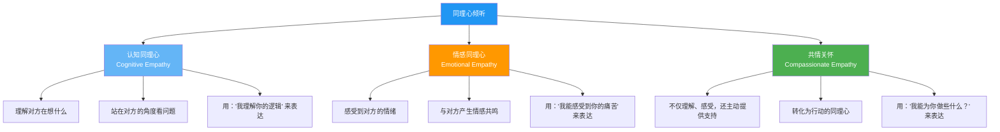
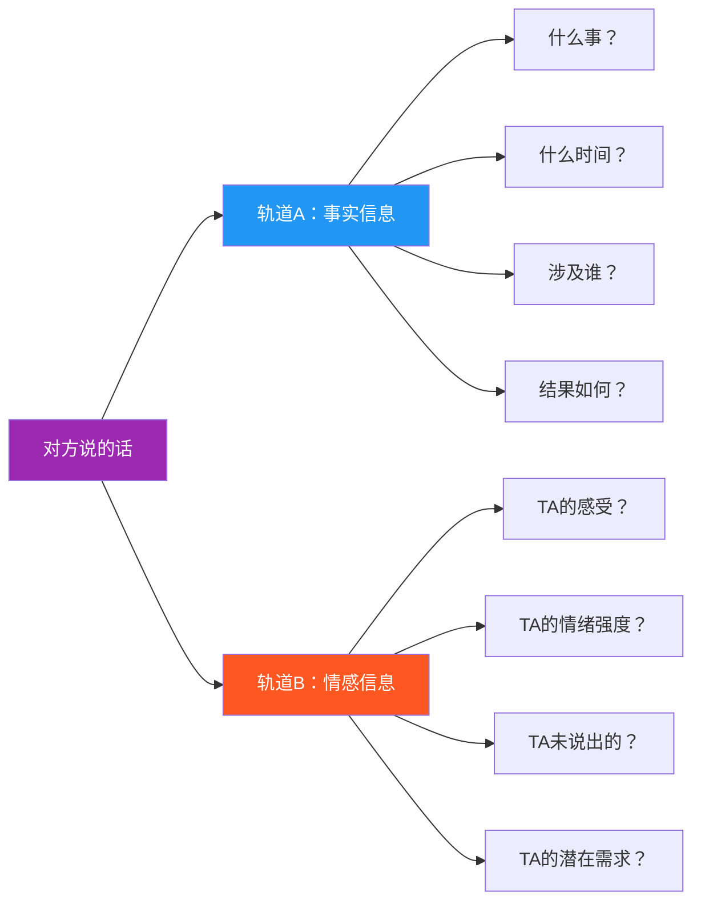
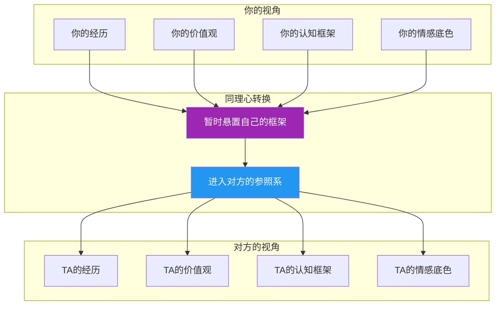
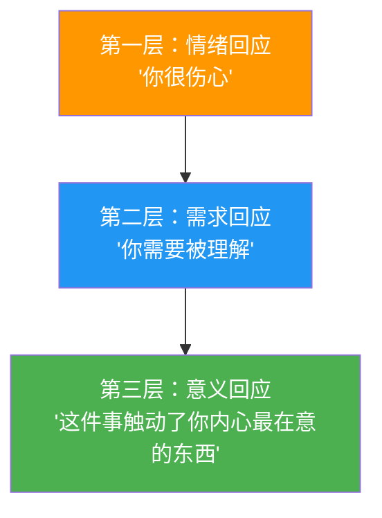
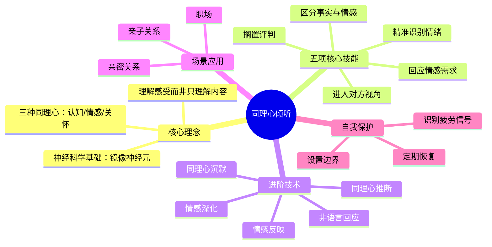

## 二、同理心倾听技巧

同理心倾听（Empathic Listening）是倾听金字塔的最高层级。如果说主动倾听解决的是"我听清了你说的话"，那么同理心倾听解决的是"我感受到了你的心"。它要求倾听者暂时放下自己的参照系，进入对方的内心世界，理解对方的感受、需求和未说出口的话。

这不仅仅是"更认真地听"，而是一种根本性的倾听范式转换——从"理解信息"转向"理解人"。

### 2.1 同理心倾听的本质

#### 什么是同理心

同理心（Empathy）源于德语单词"Einfühlung"，字面意思是"感受进去"。心理学家Edward Titchener在1909年将其引入英语世界。同理心不是"替对方感到难过"（那是同情心/Sympathy），而是"在对方的感受中待一会儿"。

三者的区别至关重要：

| 维度 | 同情心（Sympathy） | 共情（Empathy） | 同理心倾听（Empathic Listening） |
|------|-------------------|----------------|-------------------------------|
| **视角** | 从自己的角度看对方 | 进入对方的视角 | 持续停留在对方的视角中 |
| **情感距离** | "我为你感到难过"（保持距离） | "我能感受到你的痛苦"（情感共鸣） | "我理解这种痛苦对你意味着什么"（深层理解） |
| **典型回应** | "别难过了，会好起来的" | "这真的很难受" | "这件事触动了你内心最在意的东西，对吗？" |
| **关系效果** | 表达善意，但可能让对方感到被居高临下 | 建立情感连接 | 建立深层信任和安全感 |
| **认知负荷** | 低 | 中 | 高 |

#### 同理心的三种类型

心理学研究将同理心分为三种，它们在同理心倾听中缺一不可：

- **认知同理心**：你能理解对方的思维过程和立场——"我明白你为什么会这样想"。这是用大脑理解对方的逻辑。
- **情感同理心**：你能感受到对方的情绪——"我能感受到你现在很痛苦"。这是用心感受对方的情感。神经科学研究发现，这与大脑中的镜像神经元系统密切相关。
- **共情关怀**：你不只是理解和感受，还产生了帮助对方的动机——"我想为你做些什么"。这是同理心的最高形态，也是同理心倾听的终极目标。

#### 同理心倾听的神经科学基础

当你真正做到同理心倾听时，你的大脑在发生什么？

现代脑科学研究（fMRI成像技术）揭示了同理心倾听的神经机制：

- **镜像神经元系统**（Mirror Neuron System）：位于大脑的前运动皮层和顶下小叶。当对方描述一种体验时，你大脑中负责该体验的区域也会被激活——对方说"手指被门夹了"，你大脑中负责手指疼痛的区域会亮起来。这就是"感同身受"的生物学基础。
- **颞顶联合区**（TPJ）：负责"心理理论"（Theory of Mind），即推断他人想法和感受的能力。认知同理心主要依赖这个区域。
- **前脑岛**（Anterior Insula）：负责将身体感觉转化为情感体验。它是情感同理心的核心枢纽。当你看到对方痛苦时，前脑岛的活动模式会模拟对方的痛苦状态。
- **前扣带回皮层**（ACC）：负责检测冲突和调节情绪反应。在同理心倾听中，它帮助你管理自己被对方情绪"感染"后的内在张力。
- **催产素回路**：深层的同理心连接会触发催产素释放，这种"信任荷尔蒙"会增强双方的情感纽带。这就是为什么真正的同理心倾听能快速建立信任。

关键发现：同理心不是一种固定的"性格特质"，而是一种可以通过训练增强的神经能力。研究表明，持续的共情练习（如冥想、角色扮演）可以增厚前脑岛和颞顶联合区的灰质。这意味着——**每个人都可以通过练习成为更好的同理心倾听者**。

### 2.2 核心技能一：区分事实与情感

每个人在表达时，都会同时传递两种信息流——事实信息（发生了什么）和情感信息（我感觉如何）。大多数倾听者只关注前者，忽略了后者。但研究表明，在人际沟通中，情感信息对关系质量的影响力是事实信息的3到5倍。

#### 为什么情感信息更容易被忽略

- **教育惯性**：从小到大的训练都强调"听懂内容"，很少有人教你"听懂感受"
- **认知偏好**：大脑更擅长处理结构化的事实信息，而情感信息是模糊的、隐含的
- **舒适区**：处理事实信息是"安全"的，而回应情感信息需要你暴露自己的感受
- **效率焦虑**：很多人觉得关注情感信息"浪费时间"，不如直接解决问题

#### 识别情感信息的信号通道

情感信息通过多个通道同时传递：

| 信号通道 | 具体表现 | 示例 |
|---------|---------|------|
| **语调** | 声调的高低、升降、颤抖 | 语调突然升高可能表示激动或紧张 |
| **语速** | 加快、减慢、不均匀 | 语速加快可能表示焦虑或愤怒 |
| **音量** | 提高、降低、突然变化 | 音量降低可能表示不确定或悲伤 |
| **停顿** | 长时间沉默、语句中途停顿 | 说到某个话题时突然停顿，可能触及敏感点 |
| **用词** | 夸大词、绝对化表达、贬义词 | "每次都这样""永远不""烦死了" |
| **重复** | 反复提及同一话题 | 反复说某件事，说明这件事对TA很重要 |
| **非语言** | 面部表情、手势、身体姿态 | 双臂交叉可能表示防御或不安 |

#### 实操训练：双轨信息分离法

每次倾听时，在心里同时运行两条信息处理轨道：

#### 案例分析

**场景一：职场加班**

> 同事说："这个月我已经加了20天班了，每天回到家孩子都睡了。"

| 信息类型 | 内容 | 关键线索 |
|---------|------|---------|
| 事实信息 | 本月加班20天，每天很晚回家 | 数字"20天"、时间描述 |
| 情感信息 | 疲惫、愧疚（对家人）、委屈、不满 | "孩子都睡了"——这句看似事实的话，实际上是在表达一种情感上的失落 |
| 未说出的 | 可能在寻求认可、希望被看见、或期待改善现状 | 如果只是想传达加班事实，不需要提到孩子 |

- ❌ 只关注事实的回应："那你效率确实要提高一下。"
- ✅ 回应情感的回应："连续加班这么多天，真的很辛苦。而且每天见不到孩子，心里肯定不是滋味。"

**场景二：朋友吐槽**

> 朋友说："我男朋友今天又忘了我们的纪念日。"

| 信息类型 | 内容 |
|---------|------|
| 事实信息 | 男朋友忘了纪念日 |
| 情感信息 | 失望、不被重视的感觉、可能还有愤怒 |
| 深层信息 | "他是不是不在乎我了？"——对关系安全感的动摇 |

- ❌ 只关注事实："提醒他一下呗。"
- ✅ 回应情感："又忘了……你会觉得在他心里，你没有那么重要吧。"

**场景三：父母唠叨**

> 母亲说："你也不打个电话回来，上次感冒好了没有？"

| 信息类型 | 内容 |
|---------|------|
| 事实信息 | 很久没打电话，之前感冒了 |
| 情感信息 | 想念、担心、被忽视的失落 |
| 深层信息 | "你心里还有我吗？"——对亲子连接的渴望 |

- ❌ 只关注事实："好了好了，早就好了。"
- ✅ 回应情感："妈，对不起，最近忙昏头了。你是不是想我了？"

### 2.3 核心技能二：精准识别情绪

心理学家Matthew Lieberman（UCLA）的研究发现，当你能准确地"命名"一种情绪时，这种情绪的强度会降低——这个效应被称为"affect labeling"（情感标签化）。在倾听中，准确识别并回应对方的情绪，是最高效的共情方式。

#### 情绪颗粒度：从模糊到精确

大多数人的情绪词汇量非常有限——"开心""不开心""还行""挺烦的"。但情绪远比这丰富。心理学家Lisa Feldman Barrett提出了"情绪颗粒度"（Emotional Granularity）的概念：你识别和区分情绪的精度越高，你的情绪调节能力就越强，你的共情能力也越强。

| 颗粒度层级 | 低颗粒度（常见） | 高颗粒度（精准） |
|-----------|----------------|----------------|
| 愤怒类 | "我很生气" | 恼火→愤怒→暴怒→怨恨→愤慨→憋屈→抓狂 |
| 悲伤类 | "我很难过" | 失落→伤心→沮丧→绝望→心碎→哀伤→凄凉 |
| 恐惧类 | "我有点怕" | 不安→担心→焦虑→紧张→恐慌→恐惧→战栗 |
| 快乐类 | "我挺开心" | 愉悦→满足→兴奋→感恩→自豪→狂喜→欣慰 |
| 复杂情绪 | "我也说不清" | 矛盾→纠结→五味杂陈→百感交集→又爱又恨 |

#### 识别情绪的四个维度

精准识别情绪需要综合四个维度的信息：

**维度一：语言内容**

注意对方使用的具体词汇和表达方式。情绪往往会通过特定的用词模式泄露出来：
- 绝对化词汇（"总是""永远""每次"）——通常伴随着强烈的挫败感或愤怒
- 否定词汇（"我不在乎""无所谓"）——往往恰恰说明TA很在乎
- 贬低性词汇（"就那样吧""没什么大不了的"）——可能是压抑或逃避
- 身体化表达（"我心里堵得慌""头疼"）——情绪被身体替代表达

**维度二：副语言特征**

副语言是指"怎么说"而非"说了什么"：
- 音调升高：激动、紧张、愤怒
- 音调降低：悲伤、失望、疲惫
- 语速加快：焦虑、兴奋、急切
- 语速减慢：犹豫、沉思、沉重
- 声音颤抖：恐惧、激动、压抑的哭泣
- 频繁叹气：无奈、疲惫、失望

**维度三：非语言信号**

- 眼神回避：不安、羞愧、隐瞒
- 眼神直视（过度）：愤怒、恳求、需要被认真对待
- 眉头紧锁：困惑、担忧、不满
- 嘴角下垂：失望、悲伤
- 双臂交叉：防御、不安、抗拒
- 身体前倾：急切、想要被理解
- 身体后仰：退缩、不认同、疲惫

**维度四：上下文线索**

情绪不是凭空产生的，它有触发事件和背景：
- 最近发生了什么？（触发事件）
- 这个话题对TA意味着什么？（个人意义）
- TA的性格和过往经历如何？（人格底色）
- 当前的环境压力是什么？（情境因素）

#### 情绪标签的精准表达

识别了情绪之后，如何用语言回应？以下是不同层次的回应方式：

| 回应层次 | 示例 | 效果评估 |
|---------|------|---------|
| **忽略情绪** | "别想太多了" | ❌ 无效——对方感到被否定 |
| **粗略标签** | "你看起来不太开心" | △ 基本——对方知道你注意到了，但觉得你没真正理解 |
| **精准标签** | "你现在有一种深深的失望感，因为你投入了很多，却没有得到预期的回报" | ✅ 高效——对方感到被真正理解 |
| **深层标签** | "你失望的不只是这件事本身，而是它触发了你内心一直以来'不被认可'的那种感觉" | ✅✅ 触及核心——对方可能因此打开更深层的心扉 |

#### 实操训练：情绪标签词汇库

建立你自己的情绪词汇库，按类别组织，在倾听时快速调用：

**初级词汇（10个基础词）**：开心、难过、生气、害怕、惊讶、厌恶、轻蔑、尴尬、内疚、骄傲

**中级词汇（30个扩展词）**：愉悦、满足、兴奋、感恩、感动、失落、沮丧、绝望、孤独、嫉妒、焦虑、紧张、恐慌、不安、羞愧、愤怒、暴躁、怨恨、憋屈、困惑、迷茫、纠结、无奈、厌烦、麻木、释然、心疼、委屈、感动、怀旧

**高级词汇（50个精准词）**：欣喜若狂、心花怒放、如释重负、百感交集、五味杂陈、怅然若失、心如刀割、万念俱灰、义愤填膺、怒不可遏、惶恐不安、如坐针毡、战战兢兢、羞愧难当、无地自容、追悔莫及、痛心疾首、耿耿于怀、愤愤不平、郁郁寡欢……

### 2.4 核心技能三：搁置评判

同理心倾听的最大敌人不是不专心，而是评判。当你在心里说"他不应该这样想"、"这也太夸张了"、"换我我就不会这样"时，你就已经从"理解模式"切换到了"评判模式"——同理心通道就此关闭。

#### 评判的六种隐蔽形式

很多人以为自己没有在评判，但评判往往以非常隐蔽的方式出现：

| 评判类型 | 内心独白 | 外在表现 | 对话效果 |
|---------|---------|---------|---------|
| **建议型评判** | "你应该……" | 急于给出解决方案 | 对方觉得你没有在听TA的感受，只想"修好"TA |
| **比较型评判** | "这算什么，我以前……" | 把话题转向自己 | 对方觉得自己的感受被贬低了 |
| **否定型评判** | "你不应该这样想" | 直接否定对方的感受 | 对方感到被否定，关闭心扉 |
| **安慰型评判** | "别难过了，会好的" | 过早试图消除负面情绪 | 对方觉得你在敷衍，没有真正理解TA的痛苦 |
| **追问型评判** | "你为什么不……？" | 质疑对方的选择 | 对方感到被审问，开始防御 |
| **标签型评判** | "你就是太敏感了" | 给对方贴标签 | 对方感到被定义、被简化 |

#### 搁置评判的四步法

搁置评判不是"永远不评判"——那是不可能的，也是不必要的。而是在倾听的过程中，先把评判"暂时搁置"起来：

**第一步：觉察评判**

培养一种元认知能力——当评判出现时，你能意识到"我现在在评判了"。这是最基础也是最困难的一步。

练习方法：每次对话后回顾——"在刚才的对话中，我有哪些时候在评判对方？那些评判是什么？"

**第二步：暂停评判**

觉察到评判后，不是压制它（那会适得其反），而是给它"贴上标签"，然后暂时放到一边。你可以想象把评判写在一张纸上，放到桌子旁边——它还在，但现在不是处理它的时候。

**第三步：用好奇替代评判**

把评判性的问题转化为好奇性的问题：

| 评判性问题（内心独白） | 好奇性问题（替代） |
|----------------------|-----------------|
| "他不应该这样想" | "他为什么会这样想？在他的经历中，是什么让他形成了这种看法？" |
| "这也太夸张了" | "这件事对他来说意味着什么？为什么他会如此反应？" |
| "换我我就不会这样" | "他和我的经历有什么不同？他的感受从何而来？" |
| "这完全是他的错" | "在他的视角中，这件事是怎样的？" |

**第四步：区分理解和认同**

这是最容易被忽略的一步。很多倾听者之所以急于评判，是因为他们把"理解"和"认同"混为一谈了。

- 理解 = "我知道你为什么会这样想"
- 认同 = "我认为你这样想是对的"

你完全可以理解一个人而不认同TA。当你真正理解了这一点，搁置评判就变得容易多了——你不需要同意对方，只需要理解对方。

#### 案例分析

> 朋友："我觉得我应该辞职去旅行一年。"

| 回应方式 | 内心状态 | 具体回应 | 效果 |
|---------|---------|---------|------|
| ❌ 评判模式 | "太不理性了" | "你疯了吧？现在工作多难找。" | 对方感到被否定，可能再也不愿和你分享真实想法 |
| ❌ 建议模式 | 急于解决问题 | "你可以先请个长假试试？" | 对方觉得你在"管理"TA，而不是在听TA |
| ✅ 搁置评判 | "他为什么会有这个想法？" | "这是个很大的决定。你是怎么想到这个的？" | 对方感到被尊重，愿意继续深入分享 |
| ✅✅ 深层好奇 | "这个想法背后是什么？" | "听起来你内心有一种想要'逃离'的感觉。是最近发生了什么，还是这种想法已经酝酿很久了？" | 对方感到被深度理解，对话进入更深层 |

### 2.5 核心技能四：进入对方的视角

同理心的本质是"视角转换"（Perspective Taking）——暂时从自己的视角跳出来，尝试进入对方的视角看世界。这不是说你要完全同意对方，而是说你要理解：在对方的位置、经历、认知背景下，TA为什么会这样感受和思考。

#### 视角转换的认知模型

#### 影响视角差异的关键变量

同一个事件，不同背景的人会有完全不同的感受。以下是最常见的差异变量：

**文化背景**：集体主义文化（中国、日本）更重视和谐与面子，个人主义文化（美国、北欧）更重视自我表达与独立性。一个中国人说"我不好意思拒绝"，可能包含着对关系维护的深层考量。

**代际差异**：00后在互联网环境中长大，他们对"会议"的理解与70后完全不同。对他们来说，冗长的会议不是"正式"，而是"低效"。

**职业背景**：一个程序员说"这个方案不够优雅"，和一个销售说"这个方案不够优雅"，含义完全不同。程序员关注的是代码结构，销售关注的是客户体验。

**性格特质**：内向者需要独处来充电，外向者需要社交来充电。对一个内向者说"你应该多参加社交活动"，就像对一个外向者说"你应该多待在家里"一样不理解。

**人生阶段**：一个25岁的单身人士和一个45岁的中年父母，面对"加班"这件事的感受完全不同。

#### 进入视角的三步练习

**第一步：信息收集**

在尝试进入对方视角之前，你需要先了解对方的背景信息。你了解得越多，视角转换就越准确。

核心问题清单：
- TA的人生经历是怎样的？（童年、教育、工作、关键事件）
- TA的核心价值观是什么？（最看重什么，最不能接受什么）
- TA当前面临的主要压力是什么？（工作、家庭、健康、经济）
- TA的性格特质是什么？（内向/外向、理性/感性、控制型/随和型）
- TA在这件事上的利害关系是什么？（TA可能失去什么，得到什么）

**第二步：角色模拟**

想象自己就是对方——不是"如果我是TA"（你还是你），而是"我就是TA"——有着TA的童年经历、TA的教育背景、TA的失败经历、TA的恐惧和渴望。

关键练习：闭上眼睛，想象你就是对方。你经历了TA所经历的一切。现在，面对眼前这件事，你会怎么感受？

**第三步：验证假设**

视角转换永远是假设，不是事实。你需要通过倾听来验证你的假设是否正确。

验证方式：
- "我猜你现在可能觉得……对吗？"
- "我试着理解了一下你的感受，是不是有点像……？"
- "如果我是你，我可能会觉得……你觉得呢？"

如果猜对了，对方会感到被深深理解。如果猜错了，对方会纠正你——这同样是一种有效的沟通，因为你展现了努力理解的意愿。

#### 案例分析

> 一个00后员工在会议上说："我觉得开会太无聊了，能不能直接在群里说？"

| 视角 | 解读 | 回应 |
|------|------|------|
| ❌ 从你的视角 | "这年轻人太不懂事了，一点职场规矩都不懂" | "会议是很重要的沟通方式，你要学会适应。" |
| ✅ 从对方的视角 | "对于在数字环境中长大的一代人，冗长的会议确实是一种低效沟通。TA不是不尊重，而是对效率有更高的追求。而且TA愿意直接表达，说明TA对这个团队有基本的信任。" | "你希望提高效率，这个想法很好。我们来看看哪些议题确实可以在线上异步处理，哪些还是需要面对面讨论的。" |

> 一位同事对你的方案提出了尖锐批评。

| 视角 | 解读 | 回应 |
|------|------|------|
| ❌ 从你的视角 | "TA在针对我"、"TA太不给面子了" | 防御性回应，争论对错 |
| ✅ 从对方的视角 | "TA可能承担着很大的交付压力。TA的批评可能不是针对我个人，而是对项目风险的担忧。TA用尖锐的方式表达，可能是因为TA觉得温和的方式没有被重视。" | "你提的这些风险点很重要。能详细说说你最担心的是哪个部分吗？" |

### 2.6 核心技能五：回应情感需求

每个人在表达时，都有一个潜在的情感需求（Emotional Need）。如果你只回应了事实内容，而没有回应情感需求，对方会感到"你没听懂"——即使你在事实层面完全理解了TA。

#### 七种核心情感需求

心理学家Willard Harley提出了"情感爱箱"（Love Tank）理论，识别了人类最基本的情感需求。在倾听中，这些需求以更具体的形式出现：

| 情感需求 | 心理机制 | 对方的表现 | 你需要回应什么 | 回应示例 |
|---------|---------|-----------|-------------|---------|
| **被认可** | 需要确认自己的价值和努力被看见 | "我做得还可以吧？""这个项目我花了三个月" | 肯定TA的付出和成果 | "你做得很好，三个月的时间我看到了你的用心" |
| **被理解** | 需要确认自己的感受被正确接收 | "你不知道我有多累""你不懂" | 用语言表达你理解TA的感受 | "听起来你承受了很多，不是身体上的累，而是心累" |
| **安全感** | 需要确认自己是安全的、被支持的 | "我不知道该怎么办""万一失败了呢" | 提供稳定感和支持承诺 | "不管怎样，我都站在你这边。我们一起想办法" |
| **被尊重** | 需要确认自己的想法和意见被认真对待 | "我的想法是……""我觉得应该……" | 认真对待TA的观点，即使你不同意 | "你的角度很有意思，我之前没这样想过" |
| **被关心** | 需要确认自己被在意 | "我最近身体不太好""最近挺累的" | 表达关心和愿意提供帮助 | "你还好吗？有什么我能帮你做的吗？" |
| **归属感** | 需要确认自己属于这个群体 | "你们是不是都不同意我？""就我一个人这样想吗？" | 让TA感到被接纳、不孤单 | "你的感受是很正常的，很多人在这种情况下都会有类似的想法" |
| **自主感** | 需要确认自己的选择被尊重 | "我已经决定了""我不需要别人告诉我该怎么做" | 尊重TA的选择权 | "这是你的决定，我支持你。如果你需要我，我随时都在" |

#### 三层回应法

回应情感需求需要分三层，由浅入深：

**第一层：情绪回应**——用语言回应对方的情绪状态
- "听起来你很失望"
- "你现在一定很生气"
- "我能感觉到你很焦虑"

**第二层：需求回应**——回应情绪背后的情感需求
- "你需要有人站在你这边"（安全感）
- "你希望自己的努力被看见"（被认可）
- "你想要一个可以信任的倾听者"（安全感+被理解）

**第三层：意义回应**——触及情绪背后的深层意义
- "这件事之所以让你这么难受，是因为它触碰到了你一直以来最在意的那个东西——公平"
- "你不是在为这件事生气，你是在为'不被尊重'这个感觉生气"

#### 案例分析

> 伴侣说："你今天又加班到这么晚。"

**只回应事实**（错误）：
> "今天有个紧急项目，必须处理完。"

**第一层回应**（基本）：
> "你生气了。"

**第二层回应**（良好）：
> "你觉得被忽略了。你需要我多花时间陪你。"

**第三层回应**（优秀）：
> "你不是在气我加班。你是觉得在你和工作之间，我好像总是选了工作。这让你怀疑自己在我心里到底重不重要。"

### 2.7 进阶技术

掌握了五项核心技能后，以下进阶技术可以将你的同理心倾听提升到专业水平。

#### 技术一：情感反映（Reflection of Feeling）

情感反映是心理咨询中最基础也最强大的共情技术，由Carl Rogers在"以来访者为中心"的疗法中系统化提出。它的核心是：**用自己的语言重述对方的情感体验，并通过疑问句确认**。

公式："你感到[情绪词]，因为[触发事件/原因]？"

| 对方的表达 | 情感反映回应 |
|-----------|------------|
| "我在这个岗位干了五年，升职的却是刚来一年的新人" | "你感到很不公平，也很失落，因为你付出了五年却没有得到应有的认可？" |
| "我妈总是拿我和别人家的孩子比" | "你感到很烦躁，甚至有点受伤，因为不管你怎么做，好像都达不到她的期望？" |
| "我准备了三个月的方案被直接否决了" | "你感到非常沮丧和不甘，因为你投入了那么多心血，却没有得到任何解释？" |

**关键要点**：
- 用疑问句（"？"）而不是陈述句，给对方纠正你的机会
- 宁可说轻了（对方会补充），不要说重了（对方会觉得你在夸张）
- 不要每次都用，适度使用才有力量

#### 技术二：情感深化（Deepening）

当对方停留在表面情绪时，帮助TA触及更深层的情感：

表层：烦躁 → 中层：失望 → 深层：不被重视的痛苦 → 核心：对自我价值的怀疑

深化技巧：
- "除了[表面情绪]，还有别的感受吗？"
- "这件事最让你难受的部分是什么？"
- "如果这件事有一个最痛的点，那是什么？"

#### 技术三：同理心沉默

不是所有的回应都需要语言。有时候，最有力的回应是沉默——一个充满理解的沉默。

当对方说到最痛苦的部分时，不要急于填补沉默。你的沉默传递的信息是："我听到了。我在这里。你需要多久都可以。"

**使用时机**：
- 对方哽咽或流泪时
- 对方说到一个沉重的话题后停顿时
- 对方似乎在思考如何表达时
- 你不确定说什么才好的时候

**注意事项**：
- 沉默不等于面无表情——你的面部表情和肢体语言应该传递出"我在乎"
- 沉默不要太长（通常3-10秒），否则会让对方感到尴尬
- 沉默之后可以用一个轻声的回应过渡："嗯……"

#### 技术四：同理心推断（Empathic Conjecture）

基于你对对方的理解，提出一个关于TA内心状态的假设。这比情感反映更大胆——你不仅在反映已说出口的，还在推测未说出口的。

公式："我在想，是不是[推测的内心状态]？"

> 对方："我最近每天都在加班，周末也在赶方案。"
>
> 同理心推断："我在想，你这么拼，是不是除了工作本身的压力，还有一些别的东西在推动你？比如，你是不是想证明什么？"

**风险与应对**：
- 如果猜对了，对方会感到被深深理解，对话深度会大幅增加
- 如果猜错了，对方会纠正你——"不是这样的，其实是……"——这同样是有价值的，因为你帮助TA更清晰地认识了自己的感受
- 关键是语气：用试探性、好奇性的语气，而不是斩钉截铁的判断

#### 技术五：非语言同理心回应

同理心倾听不只是语言的艺术。研究表明，沟通中55%的信息通过肢体语言传递，38%通过副语言（语调、语速等），只有7%通过文字内容。

| 非语言回应 | 传递的信息 | 使用时机 |
|-----------|-----------|---------|
| 身体微微前倾 | "我在认真听你说" | 对方开始分享重要内容时 |
| 眼神接触（柔和的） | "我关注你，你对我很重要" | 全程保持，但不要死盯 |
| 点头（缓慢、有节奏） | "我在跟上你说的内容" | 对方表达过程中 |
| 面部表情同步 | "我和你在同一个频道上" | 对方微笑时你也微笑，对方面露忧愁时你也眉头微蹙 |
| 轻触（适当的情况下） | "我在这里，你不是一个人" | 对方哭泣时轻拍肩膀（需确认关系足够亲密） |
| 放下手机/合上电脑 | "你比任何事都重要" | 对方开始倾诉时 |

### 2.8 不同场景的同理心倾听策略

同理心倾听的底层原则不变，但在不同场景中，侧重点和注意事项有所不同。

#### 职场场景

| 场景 | 侧重点 | 关键策略 | 注意事项 |
|------|--------|---------|---------|
| **下属汇报困难** | 先回应情感，再解决问题 | "听起来这件事让你很受挫"→"我们一起看看怎么处理" | 不要过早给建议，否则下属会觉得你只关心结果不关心人 |
| **同事吐槽工作** | 区分"寻求建议"和"寻求宣泄" | 先问"你想让我帮你想想办法，还是就想找人说说？" | 很多时候对方只是想倾诉，不需要你解决任何问题 |
| **领导表达不满** | 理解压力背后的期望 | "您对这个项目的标准很高，我能感受到您对质量的重视" | 同理心不等于示弱，展现理解的同时保持专业 |
| **跨部门冲突** | 先理解各方立场再调和 | "我理解你的顾虑，你担心的是……" | 不偏不倚，先建立各方的信任 |

#### 亲密关系场景

| 场景 | 侧重点 | 关键策略 | 注意事项 |
|------|--------|---------|---------|
| **伴侣抱怨** | 70%的情况对方只是想被理解 | "你希望我能多陪你"（直接说出需求） | 男性倾向于直接给解决方案，但伴侣往往只需要情感回应 |
| **伴侣争吵** | 先降级情绪再处理问题 | "我现在听到了你的愤怒和受伤" | 不要在对方情绪激动时讲道理 |
| **伴侣沉默** | 理解沉默背后的情感 | "你不想说话也没关系，我就在这里陪你" | 不要逼迫对方说话，给TA空间 |

#### 亲子关系场景

| 场景 | 侧重点 | 关键策略 | 注意事项 |
|------|--------|---------|---------|
| **孩子哭闹** | 先命名情绪再引导行为 | "你很生气，因为玩具被抢走了" | 不要说"别哭了"——否定情绪不会让情绪消失，只会让孩子觉得自己的感受不重要 |
| **青春期叛逆** | 理解独立需求 | "你希望自己的选择被尊重" | 不要把叛逆当作"不懂事"，它是成长的必经之路 |
| **孩子犯错** | 先连接再纠正 | "你是不是吓了一跳？"→"我们一起想想下次怎么做更好" | 先回应恐惧/羞愧/内疚，再讨论行为 |

### 2.9 常见错误与纠正

即使理解了同理心倾听的原则，实践中仍然容易犯以下错误：

#### 错误一：过早给建议

**典型表现**：对方还没说完，你就开始"你可以试试……""你为什么不……"

**为什么是错的**：给建议的前提是你已经完全理解了对方的问题。但在情感没有被回应之前，对方根本无法接受建议——TA会觉得你只是在"解决"TA，而不是在"理解"TA。

**纠正方法**：在给出任何建议之前，先确认对方的情感已被回应。一个简单的检查标准——对方是否说了类似"嗯，就是这样的感觉"这样的话？

#### 错误二：用自己的经历替代对方的

**典型表现**："我以前也……""我也经历过……"

**为什么是错的**：当你开始讲述自己的经历时，注意力的焦点从对方转移到了你身上。即使你的经历确实相似，对方也可能觉得你在"抢话"或"比惨"。

**纠正方法**：如果确实想用自己的经历来表达理解，必须非常简短，并且立刻把焦点还给对方："我之前也遇到过类似的情况，所以我能理解那种感觉。你现在……"

#### 错误三：强迫对方表达

**典型表现**："你倒是说啊""你到底怎么想的？""别憋着，说出来就好了"

**为什么是错的**：不是每个人都准备好随时表达自己的感受。强迫表达只会让对方更加封闭。

**纠正方法**：尊重对方的节奏。你可以说："如果你想说的时候，我都在。不想说也没关系，我陪你。"

#### 错误四：情绪传染而非情绪理解

**典型表现**：对方哭你也哭，对方愤怒你也愤怒，完全被对方的情绪淹没。

**为什么是错的**：这不是同理心，而是情绪传染（Emotional Contagion）。当你被对方的情绪淹没时，你就失去了作为倾听者的稳定性和支持功能。

**纠正方法**：保持"第三只眼"——你既在感受对方的情绪，也在观察自己在感受对方的情绪。这种"双重意识"让你既能共情，又能保持清醒。

一个有用的意象：你是一个游泳教练。你的学员在水里挣扎。你需要理解TA的恐惧（同理心），但你不能自己也跳进水里一起挣扎（情绪传染）。你需要站在一个稳固的位置，让TA知道你在这里，TA是安全的。

#### 错误五：同理心疲劳后的"硬撑"

**典型表现**：你已经精疲力竭了，但还是在"表演"同理心——"嗯嗯，我理解"，但内心已经麻木。

**为什么是错的**：假装的同理心比没有同理心更糟糕。对方能感觉到你的敷衍，这会比你不回应更伤人。

**纠正方法**：坦诚告知自己的状态。"我很想好好听你说，但我现在确实很累了。你能给我10分钟休息一下吗？然后我全心全意听你讲。"这种坦诚本身就是一种尊重。

#### 错误六：用"我理解"来终止对话

**典型表现**：频繁说"我理解""我懂""我明白"，但实际上没有展示任何具体的理解。

**为什么是错的**："我理解"这三个字本身没有任何信息量。它更像一个"对话终止符"，而不是真正的共情回应。

**纠正方法**：用具体的语言替代空洞的"我理解"。不是"我理解你的感受"，而是"你投入了三个月心血的方案被否决，那种努力白费的感觉真的很痛苦"。

### 2.10 自我保护：同理心疲劳与恢复

同理心是一种有限的心理资源。长期、高强度的同理心倾听会导致"同理心疲劳"（Empathy Fatigue）或"共情倦怠"（Compassion Fatigue），表现为情感麻木、回避社交、易怒、失眠等。

#### 识别同理心疲劳的信号

| 阶段 | 信号 | 你的内心状态 |
|------|------|------------|
| **初期** | 听到别人的困难时开始感到不耐烦 | "怎么又来了" |
| **中期** | 对他人的情感需求感到烦躁 | "能不能自己解决" |
| **后期** | 情感麻木，无法对任何人产生共情 | "我什么都不想听" |
| **严重期** | 回避一切社交，对所有人封闭自己 | "别来找我" |

#### 恢复策略

**策略一：设置同理心边界**

你不需要对所有人、所有事都保持同理心。学会识别"哪些人值得我投入同理心资源"，并为不值得的人设置边界。

**策略二：定期补充情感资源**

做让你感到被滋养的事——和让你放松的人在一起，做你喜欢的活动，独处充电。同理心是"给予"，你需要先"被充满"。

**策略三：身体层面的恢复**

同理心疲劳不仅仅是心理问题，也是身体问题。充足的睡眠、规律的运动、深呼吸练习都有助于恢复共情能力。

**策略四：寻求专业支持**

如果你长期从事高同理心需求的工作（心理咨询师、社会工作者、医护人员），定期接受专业督导和自我关怀训练是必要的。

### 2.11 日常练习计划

同理心倾听能力的提升需要刻意练习。以下是一个28天的练习计划：

| 周次 | 主题 | 每日练习 | 目标 |
|------|------|---------|------|
| **第一周** | 事实与情感分离 | 每次对话后记录：对方说了什么事实？表达了什么情感？ | 培养双轨信息处理习惯 |
| **第二周** | 情绪标签化 | 每天学习3个新情绪词汇，在对话中尝试使用 | 扩大情绪词汇量，提升情绪颗粒度 |
| **第三周** | 搁置评判 | 每次对话时觉察评判念头，记录出现次数 | 减少评判对倾听的干扰 |
| **第四周** | 综合同理心倾听 | 每天至少进行一次完整的同理心倾听（10分钟以上） | 整合所有技能，在真实对话中运用 |

**每日反思问题**：
1. 今天我在哪次对话中做到了真正的同理心倾听？
2. 我在哪里错过了对方的情感信息？
3. 有哪些评判在干扰我的倾听？
4. 对方在被我同理心倾听后，有什么反应？

### 2.12 本节小结

同理心倾听不是一种天赋，而是一种可以通过刻意练习掌握的能力。它的本质是：**暂时放下自己，全心全意地进入对方的世界**。这很难——因为你需要同时管理自己的注意力、情绪和判断。但当你真正做到的时候，你会发现，这是你能给予另一个人的最珍贵的礼物——被真正理解的体验。

正如Carl Rogers所说："当一个人感到被真正理解时，TA的眼睛会湿润。那不是悲伤的眼泪，而是一个人终于被'看见'时的释然。"
