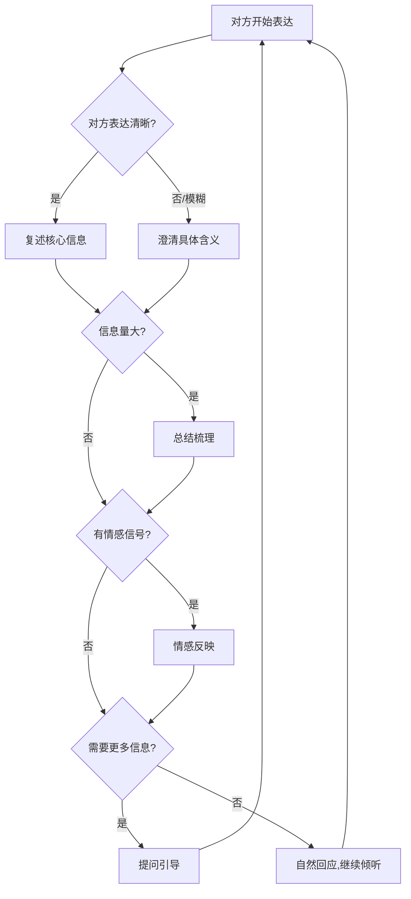

## 三、反馈式倾听技巧

反馈式倾听（Reflective Listening）是倾听技术体系中最核心的实操层，它将"听到"升级为"听懂"，将"被动接收"转化为"主动确认"。心理学家卡尔·罗杰斯（Carl Rogers）在人本主义治疗中系统化地发展了这一技术，其核心理念是：**倾听者通过语言或非语言的方式将自己对说话者信息的理解回馈给对方，从而实现双向校准，消除信息传递中的噪声和偏差。**

为什么反馈式倾听如此重要？因为人类沟通中存在一个根本性障碍——**知识的诅咒（Curse of Knowledge）**。说话者以为自己表达得很清楚，听话者也以为自己听懂了，但双方脑中的理解可能相去甚远。1990年斯坦福大学伊丽莎白·牛顿（Elizabeth Newton）的"敲击-猜歌"实验证明了这一点：敲击者预测听者能猜对歌曲的概率是50%，但实际猜对率只有2.5%。反馈式倾听就是打破这个诅咒的工具——它迫使听话者将内部理解外化为语言，让说话者有机会纠正偏差。

### 3.1 复述（Paraphrasing）

#### 3.1.1 定义与原理

复述是用你自己的语言重新表达对方所说内容的技巧。它不是鹦鹉学舌式的原句重复，而是对信息的**解码-重组-输出**过程。

复述之所以有效，背后有三层认知机制：

- **编码深度效应**：认知心理学研究表明，信息加工的深度越深，记忆和理解的效果越好。当你把对方的话转化为自己的语言时，你正在进行深层语义加工，而非浅层语音加工。
- **元认知校验**：复述迫使你将模糊的"感觉自己听懂了"转化为具体的语言表达，暴露理解中的盲区和偏差。
- **对话反馈环**：复述为说话者提供了一个自然的纠正节点，让沟通形成闭环而非单向传递。

#### 3.1.2 标准操作流程

复述可以按照以下四步法执行：

| 步骤 | 动作 | 内心独白 |
|:----:|------|----------|
| 1 | 专注接收 | "他在说什么？核心信息是什么？" |
| 2 | 内部解码 | "他想表达的实质意思是什么？背后有什么诉求？" |
| 3 | 语言重组 | "如果我是他，我会怎么概括这个意思？" |
| 4 | 校验确认 | "我理解得对吗？请他确认一下。" |

#### 3.1.3 实用句式模板

复述并不需要死记硬背公式，但以下句式框架可以帮你快速上手：

**基础型：**
- "你的意思是……对吗？"
- "也就是说……我理解得对吗？"
- "让我确认一下，你刚才说的是……"

**进阶型（带意图推断）：**
- "听起来你不仅是在说……更重要的是……是这样吗？"
- "如果我没理解错的话，你的核心关注点是……"
- "我听到你说了很多，最关键的一点是不是……"

**委婉型（用于敏感话题）：**
- "不知道我理解得对不对，你似乎在表达……"
- "我试着总结一下你的意思，看有没有偏差：……"

#### 3.1.4 完整案例演示

**职场场景——向上汇报后的复述：**

> 领导："这个季度的销售数据不理想，华东区尤其差，我需要你跟华东团队开个会，找出问题出在哪里。同时注意一下不要影响团队士气，毕竟Q4还要冲业绩。"
>
> 你的复述："明白。您希望我做三件事：第一，和华东区团队开会做数据复盘，找到业绩下滑的根因；第二，要注意沟通方式，保护团队的信心和积极性；第三，最终目的是为Q4冲刺做好准备。我理解得全面吗？还有其他要补充的吗？"

这个复述做到了：提炼了三个核心信息点、用结构化方式呈现、识别了隐含意图（保护士气）、最后留出了补充空间。

**亲密关系场景——伴侣间的复述：**

> 对方："你最近天天加班，回来就倒头睡，周末也在忙工作。我知道你工作重要，但我觉得自己像空气一样。"
>
> 你的复述："你是说，虽然你理解我工作忙，但长时间缺乏陪伴让你感到被忽略了，心里很失落，对吗？"

这个复述做到了：捕捉了事实信息（加班多）和情感信息（感到像空气）、没有加入辩解、最后以确认收尾。

#### 3.1.5 常见错误与纠正

| 错误类型 | 错误示范 | 正确做法 | 问题分析 |
|----------|---------|---------|---------|
| 复读机型 | 对方说什么原样重复 | 用自己的话重组 | 原句重复不经过大脑加工，无法验证理解 |
| 加入建议 | "你的意思是进度慢，我觉得应该增加人手" | 先确认理解，建议另起话题 | 复述阶段的目标是理解，不是解决问题 |
| 遗漏关键信息 | 只复述了部分内容 | 努力捕捉完整信息链 | 不完整的复述会误导对方以为你只关心这部分 |
| 改变语气 | 对方很担忧，你复述得很轻松 | 保持与对方一致的情感基调 | 语气偏差会让对方觉得你没有共情 |
| 过于频繁 | 每句话都复述 | 关键节点复述 | 过度复述会打断对方思路，让对话变得机械 |

### 3.2 澄清（Clarifying）

#### 3.2.1 定义与原理

澄清是在对方表达的信息中存在模糊、歧义、不完整或矛盾之处时，通过有针对性的提问来获取更清晰理解的技术。

人类语言天生具有**高语境性**——很多信息依赖上下文、共同知识和非语言线索来传递。爱德华·霍尔（Edward T. Hall）在《超越文化》中区分了高语境文化（如中国、日本）和低语境文化（如美国、德国）的沟通差异。在高语境文化中，大量信息隐藏在语境中不直接表达，这使得澄清在中国职场和社交场景中尤为必要。

澄清不是质疑，而是一种**对沟通质量负责的态度**。它传递的信号是："你说的内容对我很重要，所以我希望准确理解。"

#### 3.2.2 澄清的时机判断

不是所有模糊都需要澄清。你需要判断：

- **影响决策的模糊必须澄清**：如果模糊信息会直接影响你的行动或判断，必须澄清。例如"尽快完成"——是今天、这周还是这个月？
- **影响情感的模糊应当澄清**：如果对方话里有隐含情绪或未明说的诉求，值得澄清。例如"随便吧"——真的无所谓，还是在表达不满？
- **不影响核心的模糊可以跳过**：纯描述性的、不影响理解核心信息的模糊细节，不必逐一追问。

#### 3.2.3 澄清的五种类型

根据需要获取的信息类型，澄清可以分为五种：

**1. 定义澄清——明确概念含义**
- "你说的'优化'具体是指哪些方面？"
- "你提到的'标准化'在你们的语境里是什么意思？"

**2. 范围澄清——界定边界**
- "'尽快'大概是多长时间？"
- "你说的'整个团队'包括实习生吗？"
- "这个问题'严重'到什么程度？"

**3. 原因澄清——追溯动机**
- "是什么让你做了这个决定？"
- "你提到的顾虑具体来自哪里？"

**4. 举例澄清——请求具体案例**
- "你能举一个具体的例子吗？"
- "上一次出现这种情况是什么时候？当时发生了什么？"

**5. 对比澄清——厘清差异**
- "你说的这个和之前的方案相比，主要区别是什么？"
- "你说的'不行'是指完全不可行，还是需要调整方向？"

#### 3.2.4 澄清的语气与姿态

澄清最容易踩的雷是让对方觉得你在质疑或挑战他。以下是语气控制的关键：

| 场景 | ❌ 有攻击性的问法 | ✅ 有建设性的问法 |
|------|------------------|------------------|
| 对方说"这个方案不行" | "哪里不行了？你说清楚" | "我理解你觉得方案还需要改进，能具体说说哪些方面需要调整吗？" |
| 对方说"你们部门效率太低" | "具体是什么让你觉得效率低？" | "你说的效率问题我很重视，方便分享一下你观察到的具体情况吗？" |
| 对方说"这个项目风险很大" | "什么风险？你说清楚点" | "你提到的风险我很在意，能帮我了解一下具体是哪些风险点吗？" |

**核心原则：先共情，再澄清。** 在提问之前，先用一句话表明你理解了大意或重视对方的感受，然后自然地转入澄清问题。

#### 3.2.5 澄清的注意事项

- **一次只问一个问题**：多个问题同时抛出让对方不知所措，也显得你没有认真听。
- **从宽到窄**：先问开放性问题了解全貌，再用封闭性问题确认细节。
- **给对方思考空间**：不要急于填满沉默，有些人需要时间组织语言。
- **避免连续追问**：连续三个以上的澄清问题会让对方感到被审问。如果确实需要了解很多信息，穿插复述和情感反映来调节节奏。

### 3.3 总结（Summarizing）

#### 3.3.1 定义与原理

总结是在对方完成一段较长的表达后，用精炼的语言概括其核心信息、情感和诉求的技术。如果说复述是"逐句校验"，总结就是"段落对齐"。

总结的认知价值在于帮助双方建立**共同知识基础（Common Ground）**。语言学家赫伯特·克拉克（Herbert Clark）提出的"基础理论"指出，有效沟通的前提是双方不断确认彼此拥有共同的理解基础。长对话中信息量大、话题切换频繁，如果不对齐理解，双方很可能在不知不觉中走向不同的方向。

#### 3.3.2 总结的时机

| 时机 | 具体场景 | 说明 |
|------|---------|------|
| 话题转换时 | 对方讲完一个话题要转到下一个 | 确认前一个话题的理解，为下一个话题铺路 |
| 信息密集时 | 对方一次性讲了很多内容 | 帮助梳理结构，避免信息遗漏 |
| 情绪高涨时 | 对方倾诉了很多情感 | 在情绪释放后帮助整理，表示你认真听了 |
| 讨论结束前 | 双方要形成结论或行动方案 | 确保所有人对结论的理解一致 |
| 出现分歧时 | 双方观点不同需要找到分歧点 | 通过总结各自立场，定位真正的分歧 |
| 长时间对话中 | 讨论已经进行了30分钟以上 | 中途总结防止偏差累积 |

#### 3.3.3 总结的黄金公式

一个好的总结通常包含以下四个要素：

"我来总结一下，看看理解得对不对。"

[核心观点] + [情感线索] + [关键诉求] + [补充邀请]

"你主要关注的是……（核心观点），
在这个过程中你感到……（情感线索），
你希望的是……（关键诉求）。
我遗漏了什么吗？"

#### 3.3.4 总结的进阶技巧

**结构化呈现**：对于复杂信息，用"第一、第二、第三"的方式呈现，比用一段话概括更清晰。

**区分事实与观点**：好的总结会区分对方陈述的客观事实和主观判断。例如：
- "你观察到华东区Q3的销售数据下降了30%（事实），你认为主要原因是新竞品进入市场导致的（观点），对吗？"

**标注优先级**：当对方提到多个关注点时，总结时可以问："你刚才提到了A、B、C三个点，如果要排优先级的话，你最关心的是哪个？"

**连接前文**：如果之前有过相关讨论，可以在总结中建立连接："你之前提到过X，现在又说到Y，这两者之间的关系是……"

#### 3.3.5 总结的常见误区

| 误区 | 表现 | 纠正 |
|------|------|------|
| 贪多求全 | 试图复述每一个细节 | 只提炼核心信息，允许30%的省略 |
| 缺少确认 | 总结完直接说"好的我知道了" | 总结后必须留出纠正空间 |
| 注入观点 | 在总结中加入自己的评价 | 总结阶段只做客观概括，评价另起话题 |
| 过于简略 | 一句话就概括了对方十分钟的表达 | 总结应该足够详细，让对方觉得你真的听进去了 |
| 忽略情感 | 只总结事实信息 | 情感信息往往比事实信息更重要 |

### 3.4 提问（Questioning）

#### 3.4.1 定义与原理

提问是通过精心设计的问题引导对方深入表达、获取关键信息、推动对话进展的技术。在反馈式倾听中，提问不是为了主导对话，而是**服务于理解**——每一个问题都应该帮助你更准确地理解对方。

提问的底层逻辑是：人的表达往往只是冰山一角。弗洛伊德的冰山模型告诉我们，人们说出来的只是意识层面的一小部分，大量的动机、恐惧、需求和过往经验都隐藏在水面以下。好的提问就像一把钥匙，帮助打开通往深层信息的门。

#### 3.4.2 开放式问题与封闭式问题

这两类问题是提问的基石，各有其适用场景：

| 维度 | 开放式问题 | 封闭式问题 |
|------|----------|----------|
| 回答方式 | 需要展开描述，无法用"是/否"回答 | 通常用"是/否"或简短词语回答 |
| 信息量 | 大，能获取丰富信息 | 小，只能确认特定事实 |
| 控制度 | 低，对方主导话题走向 | 高，你主导话题走向 |
| 适用场景 | 探索新话题、了解对方想法、建立关系 | 确认事实、缩小范围、推动决策 |
| 典型句式 | "你怎么看……""能说说……""描述一下……" | "是不是……""有没有……""对不对……" |

**最佳实践：漏斗式提问法**

      ┌───────────────────────┐
      │   开放式问题（探索）    │  ← 先打开话题
      │  "说说你的想法？"      │
      ├───────────────────────┤
      │  半开放式问题（聚焦）   │  ← 再缩小范围
      │ "主要是哪几个方面？"   │
      ├───────────────────────┤
      │  封闭式问题（确认）     │  ← 最后锁定
      │  "所以你的意思是X？"   │
      └───────────────────────┘

#### 3.4.3 高质量提问的六个原则

**原则一：少问"为什么"，多问"是什么"**

"为什么"在中文语境中带有质问和审判的意味。"你为什么迟到？"听起来像是在追责，而"是什么让你今天晚到了？"则更像是在关心和了解。

| ❌ "为什么"型 | ✅ "是什么"型 |
|--------------|--------------|
| "你为什么做这个决定？" | "是什么让你做了这个决定？" |
| "你为什么不同意？" | "是什么让你觉得这个方案有问题？" |
| "你为什么不提前告诉我？" | "是什么原因让你当时没有说出来？" |

**原则二：一次只问一个问题**

> ❌ "你对这个方案怎么看？你觉得预算够不够？时间上有没有问题？"

对方不知道该先回答哪个，最终可能只回答了最容易的那个，你真正关心的问题反而被跳过了。

**原则三：问题要具体**

> ❌ "你觉得这个项目怎么样？" （太宽泛，对方不知道从何说起）
> ✅ "这个项目目前最大的技术风险是什么？" （具体，容易回答）

**原则四：不要预设答案**

> ❌ "你是不是也觉得老王的方案不靠谱？" （引导性问题，预设了立场）
> ✅ "你对老王的方案有什么看法？" （开放、中立）

**原则五：问题要服务于理解，不是展示聪明**

提问的目的是帮助你理解对方，而不是证明你有多聪明、看问题有多深入。如果你的问题让对方感到被刁难而非被理解，那你的提问方式就需要调整。

**原则六：善用追问**

当对方给出一个有趣的、重要的或模糊的回答时，追问是深入挖掘的最佳工具：
- "你刚才提到了XX，能再展开说说吗？"
- "这个细节很有意思，背后有什么故事吗？"
- "你说的'感觉不太对'，能帮我理解一下这个'不对'具体指什么吗？"

#### 3.4.4 特殊场景的提问策略

**面对沉默的提问策略：**

沉默可能意味着对方在思考、不知道怎么回答、或者情绪上有障碍。这时不要急于用问题填满沉默，可以：
- 给予充分的等待时间（5-10秒是可以接受的）
- 用温和的开放式问题降低门槛："想到什么就说什么，没有标准答案。"
- 提供选择题而非问答题："是A方面让你困扰，还是B方面？"

**面对情绪化的提问策略：**

当对方情绪激动时，直接提问可能火上浇油。应该先情感反映（见3.5节），等情绪平复后再用温和的提问了解情况。

**面对模糊回答的提问策略：**

当对方反复给出模糊回答时，不要追问同一个问题，而是换个角度：
- 用具体案例引导："能不能举个最近的例子？"
- 用对比锚定："和上次那个项目相比呢？"
- 用假设情景："如果预算不受限，你会怎么做？"

### 3.5 情感反映（Reflecting Feelings）

#### 3.5.1 定义与原理

情感反映是用语言表达你对对方情感状态的理解——不仅听到对方说了什么，更感受到对方是什么心情，并将这种理解反馈给对方。

情感反映的心理学基础来自两个重要理论：

**一是情绪标注效应（Affect Labeling）**。加州大学洛杉矶分校的马修·利伯曼（Matthew Lieberman）通过fMRI脑扫描研究发现，当人用语言描述自己的情绪时，大脑杏仁核（负责恐惧和焦虑的区域）的活动会显著降低。也就是说，**用语言说出情绪本身就具有减压效果**。

**二是依恋理论中的"安全基地"概念**。约翰·鲍尔比（John Bowlby）指出，当一个人感到自己的情绪被理解和接纳时，会产生安全感，从而更有能力面对问题。这就是为什么情感反映在心理咨询中如此有效——它创造了一个安全的情感空间。

#### 3.5.2 情感反映的核心公式

"你现在感到[情绪词]，因为[引发情绪的事件/原因]。"

更精确的版本：

"你[情绪词]，一方面是[原因A]，另一方面[原因B]，对吗？"

**情绪词的精准使用是关键。** 不要笼统地说"你很难过"，而要找到最贴切的情绪词：

| 一般性描述 | 精准描述 |
|-----------|---------|
| 不开心 | 失望、沮丧、失落、委屈、郁闷 |
| 生气 | 愤怒、不满、烦躁、委屈、被冒犯 |
| 担心 | 焦虑、不安、忧虑、紧张、不踏实 |
| 开心 | 兴奋、满足、欣慰、自豪、踏实 |
| 难过 | 伤心、心酸、心痛、无助、孤独 |

#### 3.5.3 情感反映的三个层次

**层次一：命名情绪（最基础）**
> "你现在很生气。"

这一步只是识别并命名对方的情绪，但信息量有限。

**层次二：情绪+原因（标准水平）**
> "你很生气，因为你付出了很多努力，但没有得到认可。"

加入了原因，让对方知道你理解了情绪的来龙去脉。

**层次三：情绪+原因+影响/需求（深度共情）**
> "你很生气，因为你付出了很多努力但没有得到认可。这让你开始怀疑自己的付出是否值得，你也希望自己的努力能被看到。"

不仅理解了当前的情绪，还触及了情绪背后的深层需求和可能产生的连锁影响。

#### 3.5.4 情感反映的完整案例

**案例一：职场受挫**

> 同事："辛辛苦苦做了一个月的方案，领导看都没看就否决了。连解释的机会都不给。"
>
> 层次一："你很沮丧。" ——正确但太单薄
>
> 层次二："你现在很沮丧，也很委屈。因为你投入了大量的时间和心血，但没有得到应有的重视。" ——准确且有温度
>
> 层次三："你现在很沮丧，也很委屈。一个月的心血被一眼否决，连展示的机会都没有，这让你觉得自己的努力不被尊重。你真正想要的，可能不只是方案通过，而是一个被认真对待的机会。" ——触及了深层需求

**案例二：朋友诉苦**

> 朋友："我跟我妈又吵了。她每次都说'我是为你好'，可她从来不愿意听我的想法。我都28岁了，她还是把我当小孩。"
>
> 情感反映："你感到很压抑，也很无力。一方面你理解妈妈的出发点是关心你，但另一方面你觉得自己作为成年人的想法和边界不被尊重。你想要的其实很简单——被当作一个有独立判断力的成年人来对待。"

#### 3.5.5 情感反映的注意事项

**第一，不要急于"灭火"。** 很多人在对方表达负面情绪时，本能反应是"别难过了""想开点"或者直接给建议。这些都是在否定对方的情绪。情感反映的第一步是承认情绪的合理性："你有这种感受是完全可以理解的。"

**第二，不要过度解读。** 情感反映是对你观察到的情绪做温和的猜测，而不是给对方"下诊断"。用疑问语气比陈述语气更安全："你是不是觉得……？"而不是"你就是觉得……"。

**第三，注意文化差异。** 在中国文化中，很多人不习惯直接表达情感，也不习惯被"读心"。如果对方对情感反映表现出抗拒，不要强行推进，可以退回事实层面的复述和总结。

**第四，身体语言要配合。** 情感反映如果配上冷漠的表情或急促的语气，效果会适得其反。放慢语速、降低音量、保持眼神接触、点头示意，这些非语言信号比语言本身更重要。

### 3.6 五种技巧的协同运用

#### 3.6.1 单独使用的局限性

任何一种反馈式倾听技巧都不是万能的。单独使用时：

- 只用复述 → 听起来像机器人，缺乏温度
- 只用澄清 → 听起来像审讯，让人疲惫
- 只用总结 → 只在话题结束时有用，日常对话中不自然
- 只用提问 → 容易变成单方面索取信息，对方感到被盘问
- 只用情感反映 → 过于感性，缺乏对事实的关注

#### 3.6.2 协同运用的模式

实际对话中，五种技巧需要灵活组合。以下是一个典型的长对话中五种技巧的运用节奏：

#### 3.6.3 一个完整的对话示例

以下展示了五种技巧在一段真实对话中的自然运用：

> **朋友**："我最近工作状态很差。老板给了一堆任务，每件都说是'最优先'，我根本分不清哪个更重要。上周还被客户投诉了，说我回复太慢。但我手上同时有七八个项目在跑，怎么可能每件事都第一时间处理？我觉得自己怎么做都不对。"

> **你（情感反映）**："你压力很大，也很委屈。明明已经满负荷了，还要被投诉，这让你觉得怎么努力都不够。"

> **朋友**："对！就是这种感觉。而且更让我烦的是，我们部门新来的那个同事，什么都不用干，天天准点下班。"

> **你（澄清）**："你说新同事什么都不用干——是他的工作量确实比你少很多，还是他的工作性质和你不同？"

> **朋友**："他负责的是一个固定的维护项目，没什么新需求。而我这边全是新项目，每天都有新的紧急任务。"

> **你（复述）**："也就是说，你们虽然在同一个部门，但工作量和压力完全不在一个水平线上。你觉得分配上不太公平，对吗？"

> **朋友**："对，就是不公平。而且我也跟老板说过，我需要排优先级，但老板的回复永远是'都重要，都抓紧'。"

> **你（提问）**："当你跟老板说需要排优先级时，你是用什么方式提的？是口头说了一下，还是列了一个清单让他帮你排？"

> **朋友**："就是开会时口头说了一下……"

> **你（提问）**："有没有试过把所有任务列出来，标注截止日期和预期工作量，然后请老板帮你确认优先级？"

> **朋友**："这个……确实没试过。"

> **你（总结）**："我来梳理一下。你目前的核心困境有三个：第一，任务量远超合理负荷，而且每件都被标记为'最紧急'；第二，你尝试过沟通但没有得到实质性的回应；第三，团队内部的资源分配让你觉得不公平。你现在感到沮丧和无力。除了情绪上的消耗，你更担心长期下去会影响自己的工作质量和职业口碑。你觉得这个总结准确吗？"

### 3.7 反馈式倾听的练习方法

#### 3.7.1 每日微练习

反馈式倾听是一种需要通过刻意练习才能内化的技能。以下练习方案按难度递进：

**入门练习（第1-2周）：每天1次复述**
- 在日常对话中，选择至少一个对话进行一次复述练习
- 不需要完美，重在养成"用自己的话确认"的习惯
- 记录：用了什么句式？对方什么反应？

**基础练习（第3-4周）：每天1次情感反映**
- 尝试在对话中捕捉对方的情感信号
- 用"你感到……因为……"的句式进行反映
- 记录：情绪判断对了吗？对方怎么回应？

**进阶练习（第5-8周）：完整对话练习**
- 在一次5分钟以上的对话中，有意识地使用至少三种反馈式倾听技巧
- 对话结束后回忆：用了哪几种？在什么时机用的？效果如何？

**高级练习（持续）：录音回听**
- 如果条件允许，录下一段对话（征得对方同意），回听时评估：
  - 我在哪些时刻做了有效的反馈？
  - 我错过了哪些可以反馈的时机？
  - 我的反馈是帮助了对话还是打断了对话？

#### 3.7.2 自我评估清单

每次使用反馈式倾听技巧后，可以用以下清单快速自评：

- [ ] 我的反馈是否基于对方实际说的内容（而非我的猜测）？
- [ ] 我的反馈是否使用了自己的语言（而非原句重复）？
- [ ] 我的语气是否真诚、非评判？
- [ ] 我是否给了对方纠正我的机会？
- [ ] 我的反馈是否帮助对话向前推进了？
- [ ] 对方对我的反馈反应如何——点头、展开、纠正、还是跳过？

### 3.8 反馈式倾听的常见障碍与应对

| 障碍 | 表现 | 应对策略 |
|------|------|---------|
| 急于回应 | 对方还没说完就想说自己的观点 | 提醒自己"先理解，后表达"；用深呼吸控制冲动 |
| 内心评判 | 一边听一边在心里评价对方对错 | 暂时搁置判断，专注于"他在表达什么"而非"他说得对不对" |
| 走神分心 | 听着听着注意力就飘了 | 用"跟读"策略——在心里默默复述对方的话，保持注意力集中 |
| 害怕显得蠢 | 觉得复述和总结很傻、很做作 | 想一想：是理解错了代价大，还是"显得做作"代价大？ |
| 对方不配合 | 你复述/总结时对方表现不耐烦 | 减少频率和长度，用更自然的方式融入对话，而不是机械地套公式 |
| 文化障碍 | 中国文化中直接反馈可能显得不自然 | 用更委婉的语气，如"不知道我理解得对不对……""我试着说说看……" |
