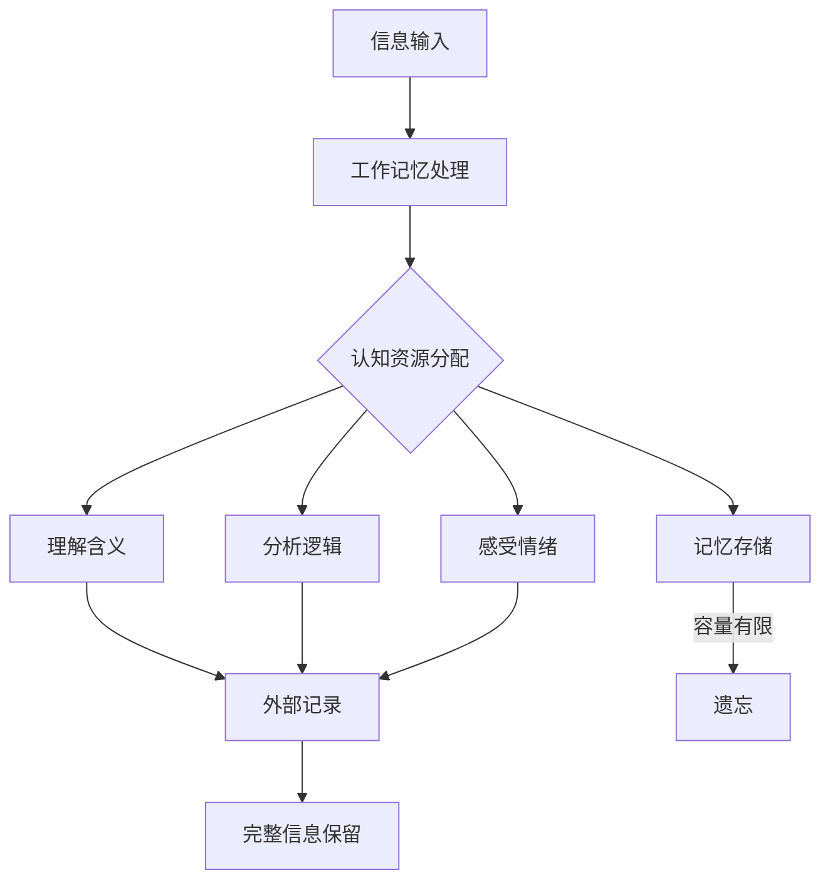
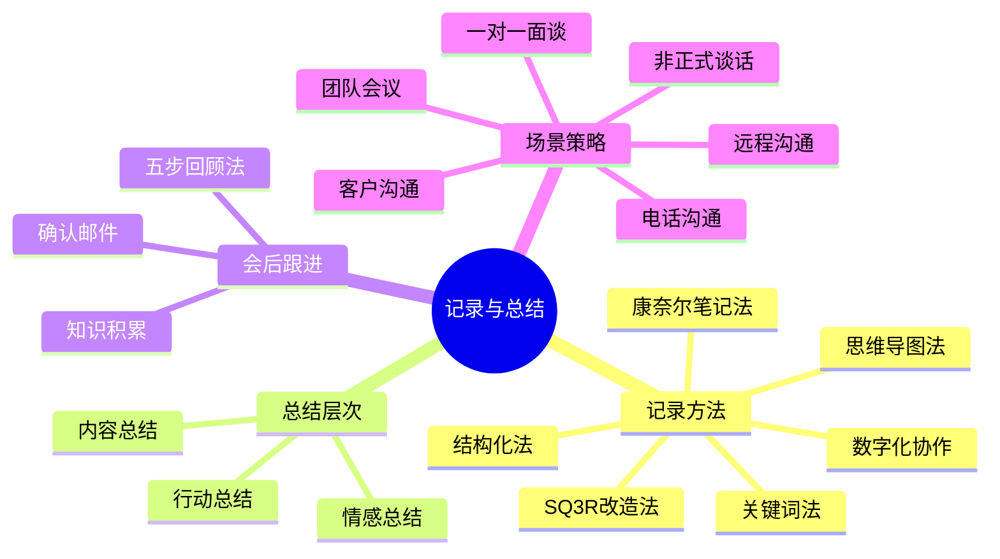

## 四、记录和总结技巧

倾听不是被动地接收声音——它是一个从"听到"到"理解"再到"保留"的完整信息处理链。前三个技巧（主动倾听、同理心倾听、反馈式倾听）解决的是"如何听懂"的问题，而记录和总结技巧解决的是"如何不忘"和"如何对齐"的问题。

研究表明，人类在听完一段信息后，**20分钟内会遗忘42%，一天后遗忘67%，一周后遗忘高达75%**（艾宾浩斯遗忘曲线）。在信息密度高的商务沟通中，这个数字只会更糟。因此，掌握系统化的记录和总结技巧，是倾听能力从"及格"到"优秀"的关键跨越。

### 4.1 为什么记录是倾听的核心能力

#### 4.1.1 认知负荷理论与记录的必要性

心理学家约翰·斯威勒（John Sweller）提出的**认知负荷理论**指出，人的工作记忆容量有限——米勒定律告诉我们，人一次只能处理7±2个信息组块。在倾听过程中，你需要同时完成多项任务：

- 解码语言含义
- 捕捉非语言信号
- 分析对方的逻辑结构
- 过滤无关信息
- 形成回应思路

当这些任务同时占用工作记忆时，留给"记忆信息"的容量就非常有限了。外部记录的本质是**将记忆负担从大脑卸载到外部介质**，释放认知资源用于更高层次的理解和思考。

#### 4.1.2 记录的三个核心价值

| 价值维度 | 不记录 | 有记录 |
|---------|--------|--------|
| 信息准确性 | 依赖模糊印象，容易遗漏关键细节 | 精确还原对话内容，减少信息偏差 |
| 沟通对齐度 | 双方理解可能不一致却无法察觉 | 有据可查，及时发现并纠正分歧 |
| 行动执行力 | 待办事项模糊，执行走样 | 明确责任人、截止时间、交付标准 |

#### 4.1.3 什么场景必须记录

不是所有对话都需要记录。以下是判断标准：

**必须记录的场景：**
- 涉及决策、任务分配、截止时间的工作讨论
- 客户需求沟通、合同条款协商
- 跨部门协调、多方会议
- 一对一绩效面谈、职业发展对话
- 任何你预判后续需要"对质"或"回溯"的对话

**不需要记录的场景：**
- 日常寒暄和社交闲聊
- 你已经非常熟悉且不涉及变化的信息
- 对方明确表达"私下说说"的敏感话题（此时记录反而破坏信任）

### 4.2 六大记录方法详解

#### 4.2.1 关键词记录法

**原理：** 人脑对关键词的记忆触发效率远高于完整句子。关键词充当"记忆锚点"——一个词就能激活一整段上下文的记忆网络。

**操作步骤：**

1. **预判主题**：在对话开始前，先写下你已知的讨论主题
2. **捕捉动词和数字**：动词代表行动，数字代表标准——这两类词是最容易遗忘的
3. **用竖线分隔**：用竖线`|`分隔不同信息点，避免连成一句话
4. **标注优先级**：在最重要的2-3个关键词旁画星号`★`

**实战示例：**

> 对方说了3分钟关于项目进展的汇报：
> "这个项目目前进度大概完成了60%，但是我们在API对接上遇到了技术瓶颈，主要是第三方接口的文档不完整，我们自己的后端架构也需要做一些调整。目前看可能会影响交付时间。我们希望能再要两个有经验的工程师来支援，如果能在下个月15号之前到位的话，我们有信心按时交付。"

你的记录：
★进度60% | 技术瓶颈：API对接(第三方文档+后端调整) | ★需支援：2人(资深) | 截止：下月15 | 态度：有信心

**进阶技巧——符号速记系统：**

建立一套个人速记符号，可以大幅提升记录速度：

| 符号 | 含义 | 符号 | 含义 |
|------|------|------|------|
| → | 导致/下一步 | ← | 原因/来源 |
| △ | 风险/问题 | ✓ | 已确认/同意 |
| ★ | 重点/优先 | ? | 待确认/存疑 |
| & | 和/以及 | ≠ | 分歧/不一致 |
| ↑ | 增长/提升 | ↓ | 下降/减少 |
| @ | 负责人 | ⏰ | 截止时间 |

#### 4.2.2 结构化记录法

**原理：** 预先设计的框架能引导注意力，确保不遗漏关键维度。就像有了渔网，你不需要记住每条鱼在哪里——只要把网撒下去，自然能捕到。

**框架一：5W1H**

| 要素 | 问题 | 记录位置 |
|------|------|---------|
| Who（谁） | 谁参与？谁负责？谁受影响？ | 左侧列 |
| What（什么） | 做什么？要什么？产出什么？ | 核心内容区 |
| When（何时） | 什么时候开始/截止？频率？ | 右上角 |
| Where（何地） | 在哪发生？通过什么渠道？ | 备注区 |
| Why（为什么） | 原因是什么？目的是什么？ | 核心内容区上方 |
| How（如何） | 怎么做？用什么方法？资源？ | 核心内容区下方 |

**框架二：问题-原因-方案（PCS）**

适用于对方来反映问题或汇报困难的场景：

┌─────────────────────────────────┐
│ 问题(P): 对方提出了什么问题？    │
│ 原因(C): 他认为原因是什么？      │
│ 方案(S): 他建议怎么办？          │
│ 我的判断: 我认为的根因和方案      │
│ 行动项: 下一步谁做什么            │
└─────────────────────────────────┘

**框架三：现状-目标-差距（CGP）**

适用于规划类、目标设定类对话：

当前状况(C): 实际是什么样？
期望目标(G): 想达到什么样？
差距分析(G): GAP在哪里？瓶颈是什么？

**框架四：ORID焦点讨论法**

这是引导式对话的结构化记录框架，适用于需要深度分析的会议：

| 层次 | 含义 | 记录内容 |
|------|------|---------|
| O（客观） | 事实数据 | 会议中呈现的客观信息、数据、事实 |
| R（反应） | 情感反应 | 参与者的即时反应、情绪、直觉感受 |
| I（诠释） | 意义理解 | 对事实的解读、分析、因果推断 |
| D（决定） | 行动方向 | 结论、决策、下一步行动 |

#### 4.2.3 思维导图法

**原理：** 托尼·博赞（Tony Buzan）发明的思维导图模拟了大脑神经元的放射性连接结构——以核心概念为中心，向外发散分支。这种方式与人脑的信息组织方式高度吻合，既适合实时记录，也适合事后整理。

**操作步骤：**

1. **中心节点**：写下对话的核心主题
2. **主分支**：每个主要论点画一条分支（通常3-7条）
3. **子分支**：在主分支上延伸支撑论据和细节
4. **连接线**：用虚线连接不同分支之间的关联
5. **图标标注**：用颜色或图标标记优先级和状态

**适用场景：**
- 头脑风暴会议
- 战略规划讨论
- 复杂问题的多方观点汇总
- 需要看到信息之间关联的场合

**数字工具推荐：**

| 工具 | 特点 | 适用场景 |
|------|------|---------|
| XMind | 功能全面，模板丰富 | 正式会议记录 |
| MindNode | 界面简洁，上手快 | 快速思维整理 |
| Miro | 协作白板，支持多人 | 远程团队协作 |
| 手绘笔记 | 最灵活，零门槛 | 面对面沟通 |

#### 4.2.4 康奈尔笔记法（Cornell Method）

**原理：** 由康奈尔大学沃尔特·波克（Walter Pauk）教授开发，是被验证最有效的笔记系统之一。其核心创新在于**将笔记区、提示区和总结区三分**，天然支持后续复习和知识转化。

**页面布局：**

┌──────────────────┬───────────────────────────┐
│                   │                            │
│   提示栏(Cue)     │      笔记栏(Note)          │
│                   │                            │
│  记关键词和问题    │   实时记录的内容            │
│  复习时用来自测    │   用简写和符号              │
│                   │                            │
│  宽度约1/3        │   宽度约2/3                 │
│                   │                            │
├──────────────────┴───────────────────────────┤
│                                               │
│              总结栏(Summary)                   │
│                                               │
│   用1-2句话概括本页核心内容                     │
│   对话结束后24小时内完成                        │
│                                               │
└───────────────────────────────────────────────┘

**操作流程：**

1. **记录阶段**（对话进行中）：在笔记栏快速记录关键词、要点、例子
2. **提示阶段**（对话结束后立即）：在提示栏提炼出问题和关键词
3. **总结阶段**（24小时内）：在总结栏用1-2句话概括核心内容
4. **复习阶段**（定期）：遮住笔记栏，只看提示栏尝试回忆

**优势对比：**

| 对比维度 | 传统线性笔记 | 康奈尔笔记法 |
|---------|------------|-------------|
| 记录效率 | 逐字记录，速度慢 | 关键词记录，速度快 |
| 信息结构 | 平铺直叙，层次不清 | 三维分区，层次清晰 |
| 复习效果 | 需要重读全部内容 | 用提示栏自测，效率高3倍 |
| 知识转化 | 被动阅读 | 主动回忆，转化率高 |

#### 4.2.5 数字化协作记录

在远程办公和数字化协作成为常态的今天，记录方式也在进化：

**实时协作文档：**
- **石墨文档/腾讯文档**：多人同时编辑，适合远程会议
- **Notion**：支持数据库化管理，适合长期项目跟踪
- **飞书文档**：可与飞书会议打通，自动关联日程

**AI辅助记录：**
- **讯飞听见/飞书妙记**：语音实时转文字，自动提取关键信息
- **通义听悟**：支持多人对话识别，自动生成会议纪要
- **Otter.ai**：英文场景首选，支持实时标注和搜索

**AI记录的注意事项：**

| 优势 | 风险 |
|------|------|
| 不遗漏任何原始信息 | 可能涉及隐私和保密问题 |
| 支持回溯和搜索 | AI摘要可能遗漏隐含信息 |
| 节省手动记录时间 | 过度依赖会削弱主动倾听能力 |
| 支持多语言翻译 | 技术术语识别率不稳定 |

**最佳实践：** AI记录作为"底稿"，人工进行二次整理和提炼。AI保证完整性，人保证深度。

#### 4.2.6 SQ3R阅读式记录法改造

SQ3R（Survey-Question-Read-Recite-Review）原本是阅读方法，经过改造后可以用于高信息密度的倾听场景：

| 步骤 | 原始含义 | 倾听场景改造 |
|------|---------|-------------|
| S - Survey | 浏览全文 | 对话前了解议程和背景 |
| Q - Question | 提出问题 | 预设你希望得到答案的问题 |
| R - Read | 阅读 | 倾听并记录 |
| R - Recite | 复述 | 对话中用自己的话复述确认 |
| R - Review | 复习 | 对话后整理和回顾 |

这种方法特别适合**你需要从对话中学习新知识**的场景——比如技术方案评审、行业分析讨论。

### 4.3 总结的三个层次

总结不是简单的"复述"，而是一种更高层次的认知活动。它要求你对听到的信息进行**筛选、提炼、重组**，最终输出经过加工的理解。

#### 4.3.1 层次一：内容总结（说了什么）

**目标：** 确保双方对"说了什么"有相同的理解。

**操作方法：**
- 提炼核心观点（通常不超过3个）
- 保留关键数据和事实
- 去掉修饰和举例，只留骨架

**示例：**
> "你刚才主要提到了三点：第一，项目进度到60%了；第二，API对接有技术瓶颈；第三，需要两个人的支援，下月15号之前到位。"

**常见错误：**
- ❌ 把所有细节都复述一遍（这不是总结，是复读）
- ❌ 加入自己的解读（先确认事实，再讨论观点）
- ❌ 遗漏对方最在意的点（总结时要抓住对方反复强调的内容）

#### 4.3.2 层次二：情感总结（感受如何）

**目标：** 让对方感到"被理解"，而不仅仅是"被听到"。

**操作方法：**
- 识别对方话语背后的情绪色彩
- 用"我能感受到……"或"听起来你……"开头
- 不评判情绪的对错，只确认情绪的存在

**示例：**
> "从你的描述中，我能感受到你对这个技术瓶颈有些焦虑，但同时你对团队的能力还是有信心的——你觉得只要人手到位，这个问题能解决。"

**为什么情感总结如此重要：**

哈佛商学院的研究表明，当一个人的情绪被准确识别和回应时，他的信任度会提升40%，合作意愿提升35%。在商务场景中，情感总结不是"煽情"，而是**建立信任的高效工具**。

#### 4.3.3 层次三：行动总结（接下来做什么）

**目标：** 将对话转化为可执行的下一步。

**操作方法：**
- 明确每个行动项的负责人（Who）
- 明确每个行动项的截止时间（When）
- 明确每个行动项的交付标准（What）
- 明确需要的资源和支持（How）

**示例：**
> "所以我们接下来的计划是：第一，你这边在周三前列出API对接的技术方案；第二，我去协调两个后端工程师的支援，目标下周一到位；第三，下周五我们再碰一次，看进展。对吗？"

#### 4.3.4 总结的黄金公式

将三个层次整合为一个可直接使用的总结模板：

"让我确认一下。你刚才主要说了 [核心内容/事实]，
从你的表达中我能感受到 [情绪/态度]，
接下来我们需要 [具体行动计划]。
我说的对吗？还有需要补充的吗？"

**变体——适用于不同场景：**

| 场景 | 总结模板 |
|------|---------|
| 工作汇报 | "所以目前的情况是[现状]，关键风险是[风险]，你需要的支持是[需求]。" |
| 客户沟通 | "您的核心需求是[需求]，最关注的是[优先级]，我们下一步会[行动]。" |
| 冲突调解 | "A觉得[观点A]，B觉得[观点B]，双方的共识是[共同点]，分歧在[差异点]。" |
| 学习交流 | "你教我的核心是[知识点]，关键要注意[易错点]，我回去会[实践计划]。" |

### 4.4 会后跟进记录系统

重要的沟通结束后，建议花5分钟做一次系统化的"会后回顾"。这5分钟的投入，可以避免未来50小时的误解和返工。

#### 4.4.1 五步回顾法

**第一步：回顾关键信息（1分钟）**
- 对方的核心观点是什么？
- 有没有之前没想到的新信息？
- 哪些信息与你之前的认知不一致？

**第二步：记录行动项（1分钟）**
- 有哪些待办事项？
- 每项的负责人是谁？
- 截止时间是什么？
- 需要什么资源或支持？

**第三步：记录疑点（1分钟）**
- 有哪些不确定或需要进一步确认的地方？
- 有哪些模糊的表述需要对方澄清？
- 有哪些信息需要自己去验证？

**第四步：记录观察（1分钟）**
- 对方的情绪状态和非语言信号
- 对方反复强调的关键词（这通常暗示优先级）
- 对方回避的话题（这可能暗示隐藏问题）
- 对方的决策风格和关注点

**第五步：发送确认（1分钟）**
- 如果条件允许，将沟通要点通过邮件或消息发送给对方确认
- 确认邮件不需要长篇大论，列出关键决策和行动项即可

#### 4.4.2 会后确认邮件模板

主题：【确认】[会议主题] - [日期]

Hi [对方姓名]，

感谢今天的沟通。为确保我们理解一致，以下是我记录的要点：

【核心结论】
1. [结论1]
2. [结论2]

【行动项】
| 事项 | 负责人 | 截止时间 |
|------|--------|---------|
| [事项1] | [谁] | [何时] |
| [事项2] | [谁] | [何时] |

【待确认事项】
- [疑问1]
- [疑问2]

如有遗漏或理解偏差，请随时指正。

[你的姓名]

#### 4.4.3 会后回顾的隐藏价值

这一步看似"多余"，但能带来三个层面的长期收益：

**1. 减少误解成本**
很多职场纠纷的根源，就是双方对同一次沟通的理解不一致。一份及时的确认记录，可以将"各说各话"变成"有据可查"。

**2. 建立专业形象**
主动发送确认邮件的人，在同事和客户眼中通常是"靠谱"和"专业"的代名词。这是一种低成本、高回报的个人品牌建设。

**3. 积累知识资产**
长期积累的会后记录，就是你的"沟通数据库"。当你需要回顾某个人的合作风格、某个项目的决策历史、某个客户的需求演变时，这些记录就是你的第二大脑。

### 4.5 不同场景的记录策略

#### 4.5.1 一对一面谈

**记录方式：** 关键词 + 行动项

**核心挑战：** 不要因记笔记而忽略眼神接触和情感连接。

**解决策略：**
- 用一张A6小卡片或手机备忘录，只记关键词
- 对方说到重要内容时，先点头回应，再低头记关键词
- 对方在思考或停顿时，快速补记
- 对话结束后30秒内补充完整

**特别注意：** 在一对一的深度对话中（比如绩效面谈、职业辅导），拿出本子记录反而可能让对方紧张。此时可以用"我记几个关键词方便后续跟进"来化解尴尬。

#### 4.5.2 团队会议

**记录方式：** 结构化记录（议题-讨论-决策-行动项）

**会议记录的标准结构：**

会议主题：[主题]
参会人：[名单]
日期时间：[时间]

议题1：[议题名称]
  讨论要点：
    - [观点A]（发言人）
    - [观点B]（发言人）
  决策：[最终决定]
  行动项：[谁] [做什么] [何时完成]

议题2：[议题名称]
  ...

遗留问题：
  - [需要后续跟进的事项]

**技巧：** 指定专人做会议记录，其他人专注参与讨论。如果轮到你记录，使用"议题-讨论-决策"的三栏表格，边听边填。

#### 4.5.3 客户沟通

**记录方式：** 5W1H + 需求清单

**客户沟通的记录要点：**

| 维度 | 记录内容 | 重要程度 |
|------|---------|---------|
| 需求 | 客户明确表达的需求 | ★★★★★ |
| 隐含需求 | 客户没说但从上下文推断的需求 | ★★★★ |
| 约束条件 | 预算、时间、技术限制 | ★★★★★ |
| 决策链 | 谁有最终决定权 | ★★★★ |
| 竞品信息 | 客户提到的替代方案 | ★★★ |
| 个人偏好 | 客户的沟通风格和喜好 | ★★★ |

**会后必做：** 24小时内发送确认邮件，列明需求理解和下一步计划。这不仅是记录，更是**防止客户"需求漂移"**的法律保护。

#### 4.5.4 电话沟通

**记录方式：** 关键词 + 会后立刻整理

**电话沟通的特殊挑战：** 没有视觉信号辅助记忆，信息流失速度更快。

**应对策略：**
- 电话旁边常备纸笔或打开笔记软件
- 听到关键信息时可以说"稍等，我记一下"来争取时间
- 使用**"复述+确认"**技巧："您刚才说的是XX，对吗？"
- 挂断后立刻花2分钟整理笔记——此时记忆衰减最快

**电话记录的"30秒法则"：** 挂断电话后30秒内，用一句话写下这次通话的核心结论。超过30秒，你已经开始遗忘了。

#### 4.5.5 非正式谈话

**记录方式：** 脑中总结 + 事后回忆

**场景：** 茶水间偶遇、走廊闲聊、饭局交谈

**策略：**
- 不适合当面拿出本子记录（会破坏轻松氛围）
- 对话结束时在脑中做一个3秒的"快照"：核心信息是什么？
- 找一个安静的时刻（比如回工位后），立刻用手机记下关键信息
- 长期练习"对话后回忆"能力：每天回忆当天3次重要对话的内容

#### 4.5.6 线上会议与远程沟通

**记录方式：** 数字工具 + AI辅助

**远程场景的特殊优势：**
- 可以开屏幕录制（需提前告知参会者）
- 可以使用AI转写工具自动记录全文
- 可以在聊天区实时记录关键结论
- 可以用共享文档让多人同时记录

**最佳实践：**
- 会前在共享文档中列出议题框架
- 会中指定1-2人负责填写结论和行动项
- 会后5分钟内所有人确认记录的准确性
- 使用AI工具生成完整文字稿作为备份

### 4.6 记录与总结的常见误区

#### 误区一：试图逐字记录

**表现：** 试图把对方说的每个字都写下来

**后果：** 手跟不上耳朵，记录变成"听写"，反而丢失了理解

**纠正：** 记关键词，不记句子。你的笔记应该是"路标"，不是"地图"——路标能指引你回忆起完整的场景。

#### 误区二：只记录不思考

**表现：** 机械地写下信息，不加工不分析

**后果：** 笔记变成了"录音的文字版"，没有价值增量

**纠正：** 记录时同步做三件事：**记下事实 → 标注疑问 → 关联已有知识**。好的笔记应该有你自己的思考痕迹。

#### 误区三：总结时加入新观点

**表现：** 在总结对方的话时，夹带自己的新想法或判断

**后果：** 对方感觉你在"篡改"他的意思，信任受损

**纠正：** 总结和讨论是两件事。先完整准确地总结对方的观点，确认无误后再表达自己的看法。

#### 误区四：忽视情感层面

**表现：** 只记录事实和数据，完全忽略对方的情绪状态

**后果：** 后续沟通可能踩到"情绪地雷"——你不知道对方在哪个点上特别敏感

**纠正：** 在记录的事实旁边，用简单的情绪标签标注（如：😊满意 / 😟担忧 / 😤不满）。

#### 误区五：会后不整理

**表现：** 会中记录了但会后不整理，笔记越积越多越看不懂

**后果：** 记录的价值随时间快速衰减，最终变成"无法解码的密文"

**纠正：** 遵循"24小时整理法则"——会议结束后24小时内完成笔记整理和总结发送。超过48小时，你当时记的关键词很可能已经对不上号了。

#### 误区六：过度依赖AI记录

**表现：** 完全依赖AI转写工具，自己不做任何主动记录

**后果：** 听的过程变成"背景音"，主动倾听能力退化，且AI可能遗漏隐含信息和非语言信号

**纠正：** AI是"备份"，不是"替代"。你在听的过程中应该同步做主动记录（关键词、疑问、判断），AI的全文转写作为补充和回溯工具。

### 4.7 记录能力的进阶训练

#### 4.7.1 短期训练（1-2周）

**练习一：关键词速记**
- 每天听一段5分钟的播客或演讲
- 只允许记10个关键词
- 听完后尝试用10个关键词还原主要内容
- 逐步提高还原的准确度

**练习二：结构化记录**
- 下次会议时，提前选定一个记录框架（5W1H/PCS/CGP）
- 对照框架填写，确保每个维度都有内容
- 会后对比"结构化记录"和之前的"自由记录"，看信息完整度的差异

#### 4.7.2 中期训练（1-3个月）

**练习三：实时总结**
- 在日常对话中练习"总结"——每隔3-5分钟做一次简短总结
- 观察对方的反应：他们是否频繁补充或纠正？这说明你的总结不够准确
- 逐步提高一次总结的准确率

**练习四：多场景切换**
- 在一周内分别用不同的记录方法处理不同场景
- 周末回顾：哪种方法在哪个场景最有效？
- 建立你的"场景-方法"对应表

#### 4.7.3 长期修炼（3个月以上）

**练习五：建立个人知识管理系统**
- 将所有沟通记录按项目/人物/主题分类存储
- 定期回顾和提炼，形成"沟通模式识别"能力
- 你将能够预判某个人在某个情境下会说什么，这是倾听的最高境界

**练习六：教授他人**
- 最好的学习是教。把你学到的记录和总结技巧教给同事
- 在教学过程中，你会发现自己对知识的理解又深了一层

### 4.8 本节核心要点

**记住三个原则：**

1. **记录是为了释放认知资源**——不要让记忆拖累理解
2. **总结是为了对齐理解**——不要假设双方的理解是一致的
3. **会后整理是为了积累资产**——今天的记录是明天的知识财富

---
