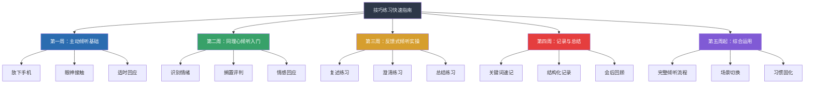

## 技巧练习快速指南

> "知道和做到之间，隔着一万次练习。"

前面四节分别讲解了主动倾听、同理心倾听、反馈式倾听、记录和总结四大类技巧。本节将这些技巧整合为一套**可立即执行的练习体系**——不需要额外安排时间，不需要专门的练习伙伴，只需要在日常对话中有意识地运用。

本指南的设计遵循刻意练习理论的四个核心要素：明确目标（每次练习聚焦一个技巧）、即时反馈（通过对方反应和自我评估获得反馈）、舒适区边缘（从最容易的场景开始，逐步升级）、高度专注（每次对话有意识地运用一个技巧，而非心不在焉地"听"）。

***

### 一、练习的核心原则

在开始之前，先理解五条决定练习成败的原则。这些原则来自行为科学和认知心理学的研究结论，不遵守它们，再好的练习清单也会变成废纸。

#### 原则一：一次只练一个技巧

认知心理学中的"注意力资源有限理论"指出，人同时关注多个目标时，每个目标的执行质量都会下降。如果你同时练习"不插嘴+眼神接触+复述+情感反映"，你会手忙脚乱，最后哪个都练不好，还会产生挫败感。

**正确做法**：每周选择1-2个技巧作为重点。比如第一周只练"放下手机"和"3分钟不插嘴"，等它们变成自然习惯后（通常需要2周），再练习新技巧。

**错误做法**：拿着一张长长的清单，每次对话都想把所有项目打勾——这不是练习，这是自我折磨。

#### 原则二：从安全的关系开始

不要一开始就挑战高难度场景。先从你最信任、最放松的关系开始练习——伴侣、好友、家人。原因有二：犯错成本低（即使做得不够好，对方也更容易包容），反馈更真实（亲密的人更愿意告诉你"你刚才走神了"）。

**推荐的练习关系顺序**：

| 顺序 | 关系类型 | 难度 | 原因 |
|:----:|---------|:----:|------|
| 1 | 伴侣或最亲密的朋友 | ★☆☆ | 最安全，反馈最真诚 |
| 2 | 家人 | ★★☆ | 较安全，但可能有历史包袱 |
| 3 | 普通朋友 | ★★★ | 中等难度，社交压力适中 |
| 4 | 同事 | ★★★★ | 中高难度，涉及职业形象 |
| 5 | 领导/客户/陌生人 | ★★★★★ | 最高难度，最后挑战 |

#### 原则三：小步迭代，比昨天好一点

行为科学家BJ Fogg提出的"微习惯"理论指出：最容易坚持的习惯是那些小到不可能失败的行为。与其设定"每天都要做到完美倾听"这种宏大目标，不如设定"今天至少有1次对话全程放下手机"这样的微小目标。

每次练习后，花1分钟回顾三个问题：
1. 我今天哪个地方做得好？
2. 哪个地方可以改进？
3. 明天想尝试什么微调？

不需要追求完美，只要比昨天好一点就够了。

#### 原则四：接受不适感

改变习惯一定会带来不适感。当你克制自己不插嘴时，你会觉得很难受；当你尝试复述对方的话时，你可能会觉得"这太刻意了、太假了"。这是完全正常的。

就像健身时肌肉会酸痛一样，不适感说明你的"倾听肌肉"在生长。研究表明，不适感通常在4-6周后显著减轻——当新的行为模式开始自动化时。在那之前，忍受不适是你进步的证明，不是你做错了的信号。

#### 原则五：主动寻求反馈

不要等到别人主动给你反馈——大多数人不会。你要主动问：

- "你觉得我今天有没有在认真听你说话？"
- "有没有什么地方让你觉得不舒服？"
- "如果满分10分，你给我的倾听打几分？扣分的原因是什么？"

真实的人际反馈是最好的改进指南。它比自我评估更客观，因为它来自你倾听的对象——他们才是你倾听质量的最终裁判。

***

### 二、第一周：主动倾听基础练习

主动倾听是所有技巧的基石。第一周的目标很简单：在对话中真正"在场"。不需要做任何复杂的事，只需要把干扰源移除，让注意力回到对方身上。

#### 每日练习清单

| 编号 | 练习项目 | 达标标准 | 预计耗时 |
|:----:|---------|---------|:--------:|
| A1 | **放下手机**：今天至少有1次面对面对话，全程将手机放入口袋或翻面朝下，不看一眼 | 连续3天做到 | 0分钟 |
| A2 | **3分钟不插嘴**：今天至少有1次对话，对方说话时保持3分钟不插嘴，只用"嗯""我明白了""继续说"回应 | 能自然做到5分钟不插嘴 | 3-5分钟 |
| A3 | **对话后回忆**：每次对话结束后，在心里默想：对方刚才说了哪些要点？如果想不起来，说明你走神了 | 能回忆起80%以上要点 | 30秒 |
| A4 | **眼神接触**：今天至少有1次对话保持60%以上的眼神接触，使用"三角区轮换法"（左眼、右眼、嘴巴之间自然轮换） | 对方不觉得你在"盯着看" | 0分钟 |
| A5 | **身体前倾**：在对方说重要话题时，让身体微微前倾（约10-15度），传递"我在认真听" | 自然做到，不再刻意想 | 0分钟 |

#### 具体场景示例

| 场景 | 怎么练 | 预期困难 | 应对策略 |
|------|--------|---------|---------|
| 同事午饭闲聊 | 放下手机，全程看着对方，只用"嗯""然后呢"回应 | 对方说的内容无聊，想插嘴转移话题 | 提醒自己"现在在练3分钟不插嘴"，把这当成一个游戏 |
| 伴侣晚上聊天 | 放下手机，坐近一点，用点头和"嗯"鼓励对方 | 忍不住想给建议 | 提醒自己"现在只听，不解决"，建议留到对方主动问 |
| 朋友电话倾诉 | 找个安静地方，关掉电脑/电视，只听 | 觉得话题和自己无关想走神 | 在心里默默复述对方的话，用"跟读"策略保持注意力 |

#### 常见问题与应对

**Q：我觉得放下手机很焦虑，怕错过重要消息怎么办？**

A：这是"手机存在焦虑"——研究表明，仅仅是把手机从视线中移除，就能显著提升对话质量。实际操作中，你可以把手机调成静音放在口袋里。真正紧急的事情，对方会打第二个电话。而在过去没有手机的年代，人们从未因为"错过消息"而世界末日。

**Q：3分钟不插嘴太难了，我脑子里有好多话想说怎么办？**

A：准备一张小纸条或打开手机备忘录，把想说的话快速记下来。这个"记下来"的动作本身就能缓解你的表达焦虑。等对方说完后再表达，你会发现很多当时想说的话其实并不重要。

**Q：眼神接触让我很不自在，总觉得自己在"盯着看"怎么办？**

A：使用"三角区轮换法"——在对方的左眼、右眼、嘴巴之间自然轮换，每隔5-7秒自然移开视线1-2秒（看向斜下方，不要看天花板或门外）。对方几乎不会察觉你不是在直视他的眼睛。给自己2周时间，不适感会逐渐消失。

***

### 三、第二周：同理心倾听入门练习

同理心倾听是倾听金字塔的最高层级。第二周的目标是：不仅听到对方说了什么，还要开始感受对方是什么心情。

#### 每日练习清单

| 编号 | 练习项目 | 达标标准 | 预计耗时 |
|:----:|---------|---------|:--------:|
| B1 | **情绪扫描**：今天至少有1次对话，在心里进行"情绪扫描"——观察对方的面部表情、语调变化、用词选择，在心里默默标记"他现在应该是____的情绪" | 能识别出至少一种情绪 | 0分钟 |
| B2 | **搁置评判**：当你发现自己在对对方的话做评判时（"他怎么能这样想"），立刻暂停，转而问自己"他为什么会这样想？" | 能觉察到自己的评判冲动 | 0分钟 |
| B3 | **情感回应**：今天至少有1次对话，用语言回应对方的情感需求，例如"那确实不容易""我能理解你的感受" | 对方的反应是"被理解了" | 0分钟 |
| B4 | **事实与情感分离**：在心里同时运行两条轨道——轨道A记录事实信息，轨道B记录情感信息 | 能区分对方表达中的事实和情感 | 0分钟 |

#### 情绪识别快速参考表

| 情绪 | 面部表情 | 语调特征 | 典型用词 | 回应示例 |
|------|---------|---------|---------|---------|
| 焦虑 | 眉头微皱、眼神闪烁 | 语速偏快、音调偏高 | "怎么办""万一""可是" | "听起来你挺担心的" |
| 沮丧 | 嘴角下垂、目光低沉 | 语速偏慢、音量偏低 | "算了""无所谓""没意思" | "你现在有点心灰意冷吧" |
| 愤怒 | 眉头紧皱、咬紧牙关 | 语速加快、音量增大 | "凭什么""太过分了""受不了" | "这件事确实让人很气愤" |
| 开心 | 眼角有笑纹、嘴角上扬 | 语调轻快、有起伏 | "真的太好了""哈哈" | "看得出来你真的很开心" |
| 无助 | 目光呆滞、肩膀下垂 | 语气平淡、缺少变化 | "不知道""我也不知道该怎么办" | "你现在有点不知道该怎么办" |
| 委屈 | 眼眶泛红、嘴唇微颤 | 声音发紧、带哭腔 | "我明明……""为什么" | "你觉得自己受了委屈" |

#### 常见问题与应对

**Q：我猜错对方的情绪怎么办？会不会很尴尬？**

A：猜错情绪没关系——对方会纠正你，而这个纠正过程本身就是深化理解。你说"你是不是有点焦虑？"对方说"不是焦虑，是觉得不公平"——这比你什么都不说要好一万倍。猜错的代价远低于不猜的代价。

**Q：搁置评判太难了，我内心总是忍不住想"这也太傻了"怎么办？**

A：评判是人类大脑的自动反应，不需要自责。关键不是消灭评判，而是觉察它、暂停它。当评判出现时，对自己说"暂停，我先听完"，然后用好奇心替代评判心："他为什么会这样想？在他的经历中，是什么让他形成了这种看法？"你不需要同意对方，只需要理解对方。

**Q：情感回应会不会显得很做作？**

A：如果你机械地套用句式，确实会做作。但如果你真的在听、真的在感受，情感回应就是自然的流露。关键不是用什么句式，而是你是否真的把注意力放在了对方身上。一个真诚的"那确实很辛苦"，比一个精心设计的长篇共情更有力。

***

### 四、第三周：反馈式倾听实操练习

反馈式倾听是将"听到"升级为"听懂"的关键技术。第三周的目标是：通过复述、澄清和总结，验证你的理解是否准确。

#### 每日练习清单

| 编号 | 练习项目 | 达标标准 | 预计耗时 |
|:----:|---------|---------|:--------:|
| C1 | **复述练习**：今天至少使用1次复述技巧，用自己的语言重新表达对方的核心意思，并以"对吗？"结尾 | 对方确认你的理解基本正确 | 0分钟 |
| C2 | **澄清练习**：当对方使用模糊表达（"太离谱了""不太好"）时，至少追问1次"具体是指什么？" | 获取了更清晰的信息 | 0分钟 |
| C3 | **总结练习**：在一次较长的对话结束时，用"我来总结一下"开头，概括对方的核心观点、情感和诉求 | 对方说"你理解得挺全面的" | 1分钟 |
| C4 | **提问练习**：在对话中至少提1个开放式问题（"你怎么看……""能说说……"），而不是封闭式问题（"是不是……"） | 对方的回答比预期更丰富 | 0分钟 |

#### 复述的三个层次

| 层次 | 方式 | 示例 | 效果 |
|:----:|------|------|:----:|
| 表面复述 | 照搬原话的核心词 | "你说你加班到凌晨三点" | △ 只能确认你听到了 |
| 概括复述 | 提炼要点，用自己的话 | "你最近工作压力很大" | ✅ 说明你理解了核心意思 |
| 深层复述 | 理解意图，触及潜台词 | "你希望领导能体谅一下你的付出" | ✅✅ 说明你理解了对方真正想表达的 |

练习时从表面复述开始，逐步过渡到概括复述和深层复述。不要急于一步到位——能在对话中做到概括复述，就已经超过了大多数人。

#### 实用复述句式

以下句式不需要死记硬背，挑2-3个用熟即可：

**基础型：**
- "你的意思是……对吗？"
- "也就是说……我理解得对吗？"
- "让我确认一下，你刚才说的是……"

**进阶型（带意图推断）：**
- "听起来你不仅是在说……更重要的是……是这样吗？"
- "如果我没理解错的话，你的核心关注点是……"

**委婉型（用于敏感话题）：**
- "不知道我理解得对不对，你似乎在表达……"
- "我试着总结一下你的意思，看有没有偏差：……"

#### 澄清的时机与句式

| 时机 | 句式示例 |
|------|---------|
| 对方用了模糊的词 | "你说的'太过分了'，具体是指什么？" |
| 对方的话有两种以上理解方式 | "你说的'调整'，是指大改还是小修？" |
| 对方的逻辑跳跃太大 | "你从A直接到了C，中间的B是什么？" |
| 对方提到了你不知道的人/事/概念 | "你提到的XX，能简单介绍一下吗？" |

**关键原则：先共情，再澄清。** 在提问之前，先用一句话表明你理解了大意或重视对方的感受。例如："你说的效率问题我很重视，方便分享一下你观察到的具体情况吗？"而不是"具体是什么让你觉得效率低？"——后者听起来像在质疑。

#### 常见问题与应对

**Q：复述会不会让对方觉得我很啰嗦？**

A：不会——前提是你不要每句话都复述。在关键节点（对方表达完一个重要观点后、话题转换时、对话即将结束时）复述，对方会觉得你认真听了。频繁复述确实会让人烦躁，所以节奏很重要。

**Q：我复述的时候对方纠正了我，是不是说明我听力很差？**

A：恰恰相反——对方纠正你，说明复述起了作用。如果你不复述，你可能带着错误的理解走了，而双方都不知道。被纠正一次，就避免了一次潜在的误解。这是双赢，不是失败。

**Q：总结的时候总是遗漏要点怎么办？**

A：两个技巧：第一，对话中记关键词（哪怕只是心里默记）；第二，总结后主动问"我遗漏了什么吗？"——把遗漏的风险变成邀请补充的机会。没有人能一次总结得100%准确，留出补充空间比追求完美更重要。

***

### 五、第四周：记录与总结练习

记录和总结是倾听能力从"及格"到"优秀"的关键跨越。第四周的目标是：在重要对话中运用记录技巧，确保信息不遗漏、理解可验证。

#### 每日练习清单

| 编号 | 练习项目 | 达标标准 | 预计耗时 |
|:----:|---------|---------|:--------:|
| D1 | **关键词速记**：在一次重要对话中，用关键词记录核心信息点（不需要完整句子，只需动词+数字+人名） | 对话结束后能凭关键词回忆80%内容 | 2分钟 |
| D2 | **符号速记**：使用至少3个速记符号（→导致、△风险、★重点、?待确认）记录信息 | 能快速建立个人速记系统 | 0分钟 |
| D3 | **会后5分钟回顾**：在一次重要对话结束后，花5分钟完成回顾——记录核心结论、行动项、疑点、观察 | 能产出一份结构化的对话记录 | 5分钟 |
| D4 | **发送确认**：在一次工作相关的对话后，通过消息或邮件将要点发送给对方确认 | 对方确认或补充了你的记录 | 3分钟 |

#### 速记符号系统

建立一套个人速记符号，可以大幅提升记录速度。以下是最常用的符号，你可以直接采用，也可以根据自己的习惯调整：

| 符号 | 含义 | 符号 | 含义 |
|:----:|------|:----:|------|
| → | 导致/下一步 | ← | 原因/来源 |
| △ | 风险/问题 | ✓ | 已确认/同意 |
| ★ | 重点/优先 | ? | 待确认/存疑 |
| & | 和/以及 | ≠ | 分歧/不一致 |
| ↑ | 增长/提升 | ↓ | 下降/减少 |
| @ | 负责人 | ⏰ | 截止时间 |

**实战示例：**

对方说了3分钟关于项目进展的汇报：
> "这个项目目前进度大概完成了60%，但是我们在API对接上遇到了技术瓶颈，主要是第三方接口的文档不完整，我们自己的后端架构也需要做一些调整。目前看可能会影响交付时间。我们希望能再要两个有经验的工程师来支援，如果能在下个月15号之前到位的话，我们有信心按时交付。"

你的记录：
★进度60% | 技术瓶颈：API对接(第三方文档+后端调整) | ★需支援：2人(资深) | ⏰下月15 | 态度：有信心

#### 会后回顾模板

每次重要对话结束后，花5分钟填写以下模板。长期积累下来，这就是你的"沟通数据库"：

## 对话回顾

### 基本信息
- 时间：____
- 对象：____
- 场景：____（工作/家庭/社交）

### 核心结论
1. ____
2. ____
3. ____

### 行动项
| 事项 | 负责人 | 截止时间 |
|------|--------|---------|
| ____ | ____ | ____ |

### 疑点与待确认
- ____

### 观察
- 对方反复强调的关键词：____（通常暗示优先级）
- 对方回避的话题：____（可能暗示隐藏问题）
- 对方的情绪状态：____

### 自我评估
- 本次倾听我做得最好的一点：____
- 本次倾听我最需要改进的一点：____

#### 常见问题与应对

**Q：记录会不会打断倾听？我一边记一边听不过来怎么办？**

A：记录的核心是"关键词"，不是"逐字记录"。你只需要记动词、数字、人名——这些是最容易遗忘的。如果实在来不及记，可以说"稍等，我记一下"来争取时间，对方不会觉得不礼貌，反而会觉得你很重视他说的内容。

**Q：不是所有对话都需要记录吧？什么时候该记，什么时候不该记？**

A：判断标准很简单：如果这个对话的信息后续需要"回溯"或"对质"，就必须记。具体来说：涉及决策、任务分配、截止时间的工作讨论必须记；客户需求沟通、合同条款协商必须记。日常寒暄、社交闲聊不需要记。对方明确说"私下说说"的敏感话题不要记——此时记录反而破坏信任。

***

### 六、第五周起：综合运用与习惯固化

从第五周开始，将前四周练习的技巧整合为一套完整的倾听流程。这一阶段的目标是：从"刻意模仿"变成"自然而然"。

#### 完整倾听流程

在每天至少1次对话中，有意识地走完以下流程：

| 阶段 | 核心动作 | 使用的技巧 |
|------|---------|-----------|
| 准备 | 放下手机、关闭通知、清空杂念 | 主动倾听（干扰管理） |
| 开始 | 微笑、眼神接触、身体前倾 | 主动倾听（SOFTEN模型） |
| 倾听 | 适时"嗯""然后呢""真的吗" | 主动倾听（适时回应） |
| 理解 | 复述关键观点、澄清模糊表达 | 反馈式倾听（复述+澄清） |
| 共情 | 识别情绪、回应情感需求 | 同理心倾听（情感反映） |
| 收尾 | 总结核心要点、确认理解一致 | 反馈式倾听（总结）+ 记录技巧 |

#### 不同场景的策略切换

| 场景 | 核心策略 | 绝对不要做 | 记录建议 |
|------|---------|-----------|---------|
| 伴侣倾诉情绪 | 重情感回应、轻解决方案 | 说"你不要想太多" | 不记录，保持情感连接 |
| 领导布置任务 | 重复述确认、记录要点 | 只点头不确认细节 | 关键词速记+会后确认邮件 |
| 同事抱怨工作 | 先共情、再分析 | 传话或站队 | 脑中总结，不留下文字记录 |
| 朋友分享好消息 | 兴奋匹配、追问细节 | 急着转到自己的事 | 不记录 |
| 客户表达不满 | 先道歉、再澄清、后解决 | 急于辩解 | 结构化记录+24小时内确认邮件 |
| 孩子讲述学校的事 | 蹲下来平视、不评判、追问细节 | 急着给教育建议 | 不记录 |
| 电话沟通 | 复述确认、30秒内记下核心结论 | 挂断后立刻做别的事 | 关键词速记+挂断后立刻整理 |

#### 每日倾听日记

每天花3分钟写一段倾听日记。不是流水账，而是聚焦于以下问题：

## 今日倾听日记

### 最有价值的一次倾听
- 对象和场景：____
- 我运用了哪些技巧：____
- 对方的反应：____
- 我的发现/心得：____

### 明天想尝试的改进
____

这个日记不需要给任何人看，它是你和自己之间的对话。长期坚持，你会清晰地看到自己的进步轨迹。

***

### 七、30天速查日历

以下是一份30天的练习日历，每天只需要在日常对话中有意识地运用一个技巧。不需要额外安排时间，不需要专门的练习伙伴——你每天都在和人对话，只需要在对话中多做一件事。

| 天数 | 今日练习重点 | 完成打勾 |
|:----:|------------|:--------:|
| **第1周：专注力** | | |
| D1 | 放下手机：1次对话全程不看手机 | □ |
| D2 | 放下手机：2次对话全程不看手机 | □ |
| D3 | 不插嘴：1次对话保持3分钟不插嘴 | □ |
| D4 | 不插嘴：1次对话保持5分钟不插嘴 | □ |
| D5 | 对话后回忆：回忆今天2次对话的要点 | □ |
| D6 | 眼神接触：1次对话保持60%以上注视 | □ |
| D7 | 周回顾：本周做得最好的一点是什么？ | □ |
| **第2周：回应力** | | |
| D8 | 适时回应：1次对话中使用"嗯""然后呢" | □ |
| D9 | 情感回应：1次对话中回应对方的情感 | □ |
| D10 | 情绪识别：在心里标记对方的情绪 | □ |
| D11 | 情绪识别：尝试说出对方的情绪词 | □ |
| D12 | 搁置评判：觉察并暂停1次评判冲动 | □ |
| D13 | 事实与情感分离：在心里区分事实和情感 | □ |
| D14 | 周回顾：本周最容易和最困难的练习是什么？ | □ |
| **第3周：反馈力** | | |
| D15 | 复述：1次对话中复述对方的核心观点 | □ |
| D16 | 复述：尝试从表面复述升级到概括复述 | □ |
| D17 | 澄清：1次对话中追问模糊表达 | □ |
| D18 | 澄清：练习"先共情再澄清"的语气 | □ |
| D19 | 总结：1次较长对话结束时做总结 | □ |
| D20 | 提问：1次对话中使用开放式问题 | □ |
| D21 | 周回顾：复述和澄清时对方的反应如何？ | □ |
| **第4周：记录力** | | |
| D22 | 关键词速记：1次重要对话中记录关键词 | □ |
| D23 | 符号速记：使用3个以上速记符号 | □ |
| D24 | 会后回顾：1次重要对话后花5分钟回顾 | □ |
| D25 | 发送确认：1次工作对话后发送要点确认 | □ |
| D26 | 综合运用：1次对话中同时运用3种以上技巧 | □ |
| D27 | 综合运用：尝试走完整倾听流程 | □ |
| D28 | 周回顾：记录技巧对你的帮助有多大？ | □ |
| **第5-30天：习惯固化** | | |
| D29 | 每日倾听日记：开始写倾听日记 | □ |
| D30 | 30天总回顾：回顾你的进步，设定下阶段目标 | □ |

***

### 八、自评与进阶

#### 倾听水平自测

完成30天练习后，用以下问卷评估自己的进步。对每个陈述评分（1=完全不符合，5=完全符合）：

**基础层（专注力）：**
1. 对方说话时，我能保持3分钟以上不想别的事情
2. 对方说话时，我不会去看手机
3. 我能在对话中保持眼神接触
4. 对方说完后，我能大致复述对方说了什么
5. 我能注意到自己什么时候走神了

**进阶层（回应力）：**
6. 我会用"嗯""然后呢"等回应鼓励对方继续说
7. 我会复述对方的关键观点来确认理解
8. 我会在不确定时主动提问澄清
9. 我能区分对方说的"事实"和"感受"
10. 我的回应能让对方感觉到"被听到了"

**高级层（共情力）：**
11. 我能准确识别对方当下的情绪
12. 我能在回应中反映对方的情绪
13. 我能在不同意对方观点时仍然不评判地倾听
14. 我能在对方情绪激动时保持冷静和专注
15. 对方经常主动找我倾诉或寻求建议

**评分解读：**

| 总分区间 | 水平 | 建议 |
|:--------:|:----:|------|
| 15-30分 | 入门 | 从第一周开始重新练习，放慢节奏 |
| 31-45分 | 初级 | 继续练习，重点关注得分最低的层面 |
| 46-55分 | 中级 | 可以跳过基础练习，重点练反馈式倾听和记录 |
| 56-65分 | 中高级 | 重点练综合运用和场景切换 |
| 66-75分 | 高级 | 进入长期维持阶段，挑战高难度场景 |

#### 进阶方向

当你在日常对话中已经能自然运用基础技巧后，可以向以下方向进阶：

**方向一：高难度场景挑战**
- 冲突调解中的倾听
- 情绪激动者的倾听
- 跨文化沟通中的倾听
- 公开场合（会议、演讲）中的倾听

**方向二：专业倾听技能**
- 教练式倾听（Coaching Listening）
- 咨询式倾听（Counseling Listening）
- 销售场景的需求倾听
- 管理场景的反馈倾听

**方向三：倾听的长期习惯化**
- 每周一次倾听复盘
- 每月一次自测问卷
- 建立"倾听伙伴"关系（互相练习、互相反馈）
- 录音回听（征得对方同意后录下对话，回听评估自己的倾听质量）

> 💡 **最后的提醒**：不要试图同时练习所有技巧，这会让你手忙脚乱。每周专注练习1-2个技巧，直到它们变成自然习惯，然后再练习新的技巧。倾听能力的提升不是冲刺，而是马拉松——持续、有节奏、不急不躁。

***
