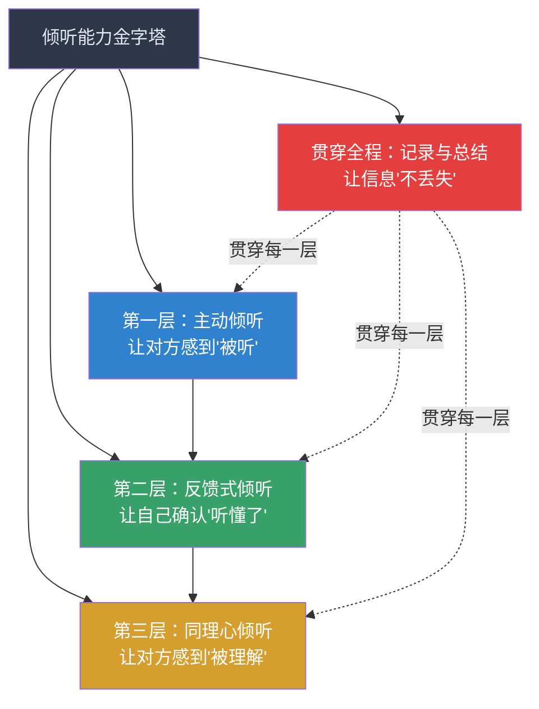
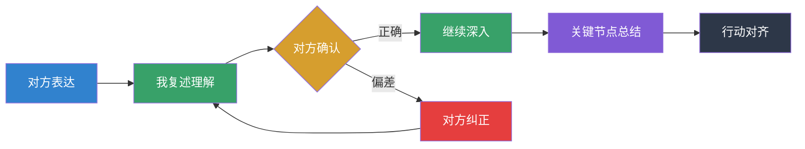
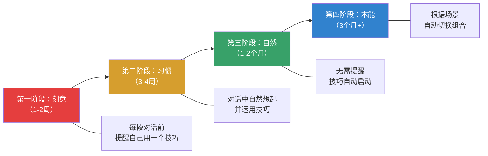

## 本节小结

> "技巧是工具，理解是目的，连接是结果。"

本节系统讲解了倾听的四大核心技巧体系——主动倾听、同理心倾听、反馈式倾听、记录与总结。这四类技巧不是并列的菜单选项，而是一条从"听见"到"听懂"到"记住"到"共鸣"的能力递进链。下面从整体视角重新梳理它们之间的关系、核心要点、常见误区，以及如何在实际场景中灵活组合。

### 四大技巧的定位与关系

四大技巧解决的是倾听过程中四个不同层级的问题：

把它们的关系用一句话概括：**主动倾听是入场券，反馈式倾听是校准器，同理心倾听是加速器，记录与总结是保险箱。** 缺少任何一个，倾听的效果都会大打折扣。

| 技巧类别 | 核心问题 | 解决什么 | 典型场景 | 难度 |
|----------|---------|---------|---------|------|
| **主动倾听** | 我在认真听吗？ | 传递关注信号，建立对话安全感 | 任何对话的起步阶段 | ★★☆ |
| **反馈式倾听** | 我听懂了吗？ | 验证理解准确性，消除信息偏差 | 信息密集的工作讨论、需求确认 | ★★★ |
| **同理心倾听** | 我理解你的感受吗？ | 建立情感连接，深入理解对方 | 情绪激烈的对话、冲突调解、亲密关系 | ★★★★ |
| **记录与总结** | 我还记得吗？ | 保存关键信息，确保后续执行 | 会议、谈判、面谈、任何需要跟进的对话 | ★★☆ |

### 各技巧核心要点回顾

#### 主动倾听：六个行为信号

主动倾听的SOFTEN模型给出了六个可立即执行的非语言行为——微笑（Smile）、开放姿态（Open Posture）、前倾（Forward Lean）、适当接触（Touch）、眼神接触（Eye Contact）、点头（Nod）。这些行为的价值不在于"表演"，而在于它们能反向影响你的内在状态：心理学中的**面部反馈假说**（Facial Feedback Hypothesis）证实，当你做出倾听的姿态时，你的大脑会倾向于进入倾听的状态。

三个最容易被忽视的细节：

1. **眼神接触的60%-70%法则**——不是越多越好。持续直视会造成压迫感，频繁移开则显得心不在焉。用"三角区轮换法"（在对方双眼和鼻尖形成的倒三角区域自然切换）可以降低压力，效果几乎与直视等同。
2. **沉默的力量**——对方说完后，停顿2-3秒再回应。这个"留白"传递的信号是"我在认真消化你说的话"，而不是"我在等你闭嘴好轮到我说"。
3. **手机放到视线之外**——不是翻面放在桌上，是放到包里或抽屉里。研究显示，即使手机只是放在桌面上（屏幕朝下），也会降低对话双方的亲密度和信任感——这被称为"iPhone效应"（iPhone Effect, Ward et al., 2017）。

#### 反馈式倾听：三层验证闭环

反馈式倾听的三个核心动作——复述、澄清、总结——构成了一个完整的验证闭环：

三个关键原则：

1. **复述不是复读**——用你自己的话重组对方的意思，而非原句重复。原句重复不经过大脑加工，无法验证你是否真正理解。
2. **澄清要具体**——"你能再解释一下吗"是最低效的澄清方式。高效的做法是指出具体疑点："你说的'尽快'是指这周内还是月底前？"
3. **总结要结构化**——用"三点式"总结最有效："你刚才主要说了三件事：第一……第二……第三……我理解得全面吗？"人类大脑天然偏好三段式结构，这比散点罗列更容易被对方确认。

#### 同理心倾听：三种同理心的递进

同理心不是一种单一能力，而是由三个层面组成：

1. **认知同理心**（用大脑理解）——"我明白你为什么会这样想"。这是最基础的层面，要求你暂时搁置自己的立场，从对方的逻辑链出发去理解。
2. **情感同理心**（用心感受）——"我能感受到你现在很痛苦"。这要求你不只是理解对方说了什么，还要捕捉对方话语背后的情绪信号——语调的变化、停顿的长度、措辞的选择。
3. **共情关怀**（转化为行动）——"我能为你做些什么？"这是同理心的最高形态，也是最容易被忽视的一步。很多人做到了理解和感受，却卡在了"然后呢"这一步。

区分事实与情感是同理心倾听的第一步技能。每一个表达都同时包含事实信息（发生了什么）和情感信息（我感觉如何），而情感信息对关系质量的影响力是事实信息的3到5倍。当你回应对方时，如果只回应事实而忽略情感，对方会觉得"你听到了我说的话，但你没有听到我这个人"。

#### 记录与总结：两条遗忘曲线的对抗

记录的必要性来自两个事实：

- **艾宾浩斯遗忘曲线**——20分钟遗忘42%，一天后遗忘67%，一周后遗忘75%
- **米勒定律**——工作记忆一次只能处理7±2个信息组块

外部记录的本质是将记忆负担从大脑卸载到外部介质，释放认知资源用于更高层次的理解和思考。六大记录方法——关键词法、符号速记法、康奈尔笔记法、思维导图法、结构化模板法、数字工具法——覆盖了从"快速随手记"到"系统化整理"的全部场景。

一个常被忽略的原则：**记录的最终目的不是"记下来"，而是"用起来"**。如果记完的笔记你再也不会翻开，那记录就变成了纯粹的自我安慰。每次记录后，用30秒做"三行提炼"：关键决策是什么？待办事项是什么？需要跟进的人是谁？

### 四大技巧的组合策略

在真实对话中，四大技巧不是分阶段使用的，而是根据场景需要灵活穿插。以下是三种典型的组合模式：

#### 模式一：信息密集型对话（会议、需求讨论）

**场景特征**：信息量大，需要准确理解和后续执行

| 阶段 | 主导技巧 | 具体做法 |
|------|---------|---------|
| 开场 | 主动倾听 | 眼神接触、点头、微笑，建立安全感 |
| 信息接收 | 反馈式倾听 + 记录 | 关键节点复述确认，同步做关键词速记 |
| 深入讨论 | 反馈式倾听 | 澄清模糊点，用"三点式"总结阶段性结论 |
| 收尾 | 记录与总结 | 当场复述确认行动项、责任人、截止时间 |

#### 模式二：情感驱动型对话（冲突调解、安慰支持）

**场景特征**：情绪强烈，对方需要的不是解决方案而是被理解

| 阶段 | 主导技巧 | 具体做法 |
|------|---------|---------|
| 情绪表达 | 主动倾听 + 同理心倾听 | 保持沉默，用肢体语言传递"我在这里" |
| 情感确认 | 同理心倾听 | 识别并命名对方的情绪："你现在感到很委屈" |
| 理解验证 | 反馈式倾听 | 复述对方的核心感受和诉求，确认理解无误 |
| 转向行动 | 同理心倾听（共情关怀） | "我能为你做些什么？"——只有在对方情绪平复后才进入这一步 |

#### 模式三：学习吸收型对话（培训、知识交流）

**场景特征**：对方在传递专业知识，你需要最大限度地吸收和保留

| 阶段 | 主导技巧 | 具体做法 |
|------|---------|---------|
| 接收阶段 | 主动倾听 + 记录 | 全神贯注，用康奈尔笔记法或思维导图实时记录 |
| 理解阶段 | 反馈式倾听 | 用自己的话复述关键概念，请对方确认 |
| 深化阶段 | 反馈式倾听（提问） | 提出有深度的问题："这个方法在XX场景下适用吗？" |
| 巩固阶段 | 记录与总结 | 课后整理笔记，提炼"三个最重要的收获" |

### 常见误区与纠正

以下是学习者在运用这四大技巧时最容易犯的错误：

| 误区 | 错误表现 | 后果 | 纠正方法 |
|------|---------|------|---------|
| **技巧堆砌** | 在一段对话中机械地使用所有技巧 | 对话变得生硬、不自然，对方感觉在"被治疗" | 根据场景选择1-2个主导技巧，其他技巧自然穿插 |
| **复述成瘾** | 对方每说一句话都要复述一遍 | 打断对方思路，对话节奏被破坏 | 只在关键信息节点和对话转折点复述 |
| **同理心越界** | 过度共情导致自己情绪被"感染" | 倾听者情绪崩溃，反而需要别人来安慰 | 保持"观察者视角"——理解但不卷入，感受但不沉溺 |
| **只听不记** | 依赖大脑记忆，不做任何外部记录 | 关键信息遗忘，后续执行走样 | 养成"听到就记"的习惯，哪怕只是几个关键词 |
| **记录成瘾** | 逐字记录，完全忽略了与对方的眼神交流 | 对方觉得你在"抄笔记"而不是在"听我说话" | 记关键词而非完整句子，抬头与对方保持眼神接触 |
| **跳过反馈** | 听完就直接行动，不做任何确认 | 理解偏差被放大，执行结果与期望南辕北辙 | 养成"总结确认"的习惯——"让我确认一下……" |
| **同理心过早** | 对方还在激烈表达时就急于安慰 | 对方觉得你在"灭火"而不是在"听" | 先让对方把情绪表达完，再做同理心回应 |

### 从技巧到本能：内化路径

知道这些技巧是第一步，把它们从"刻意运用"变成"自然反应"需要一个系统化的内化过程。参考前一节的"技巧练习快速指南"，核心路径是：

一个实用的自我检验方法：每次重要对话结束后，花30秒问自己三个问题——"我刚才用了哪个技巧？""效果如何？""下次可以怎么改进？"这三个问题比任何刻意练习都有效，因为它们基于你自己的真实经验。

### 技巧背后的本质

最后，值得回到一个根本性的问题：技巧的目的是什么？

所有技巧——无论是SOFTEN模型、复述四步法、还是康奈尔笔记法——都只是通往同一个目标的路径：**让对方感到自己被认真对待**。当对方感到自己说的话被听到了、被理解了、被记住了，信任就自然产生，沟通的效果就自然提升。

Carl Rogers说过："一旦一个人感到被真正理解了，他的眼睛往往会湿润——那不是悲伤，而是一种终于被'看见'的释然。"这是所有倾听技巧追求的终极境界。

技巧可以学，但真正打动人心的，永远是你在对话中投入的那份真诚。技术是骨架，真诚才是灵魂。

***

下一节，我们将通过丰富的实战案例，看看这些技巧在职场沟通、亲密关系、冲突调解、客户服务等真实场景中如何灵活运用——从"知道怎么做"走向"真的能做到"。
