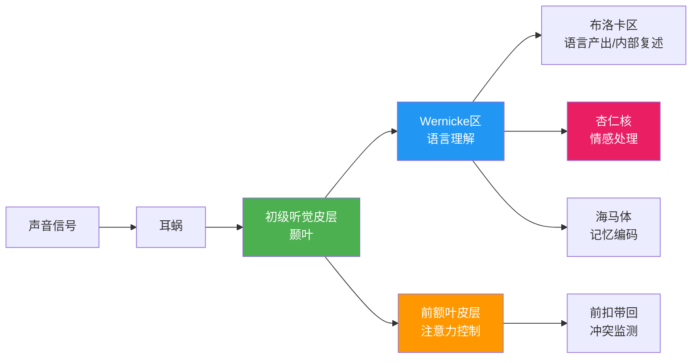
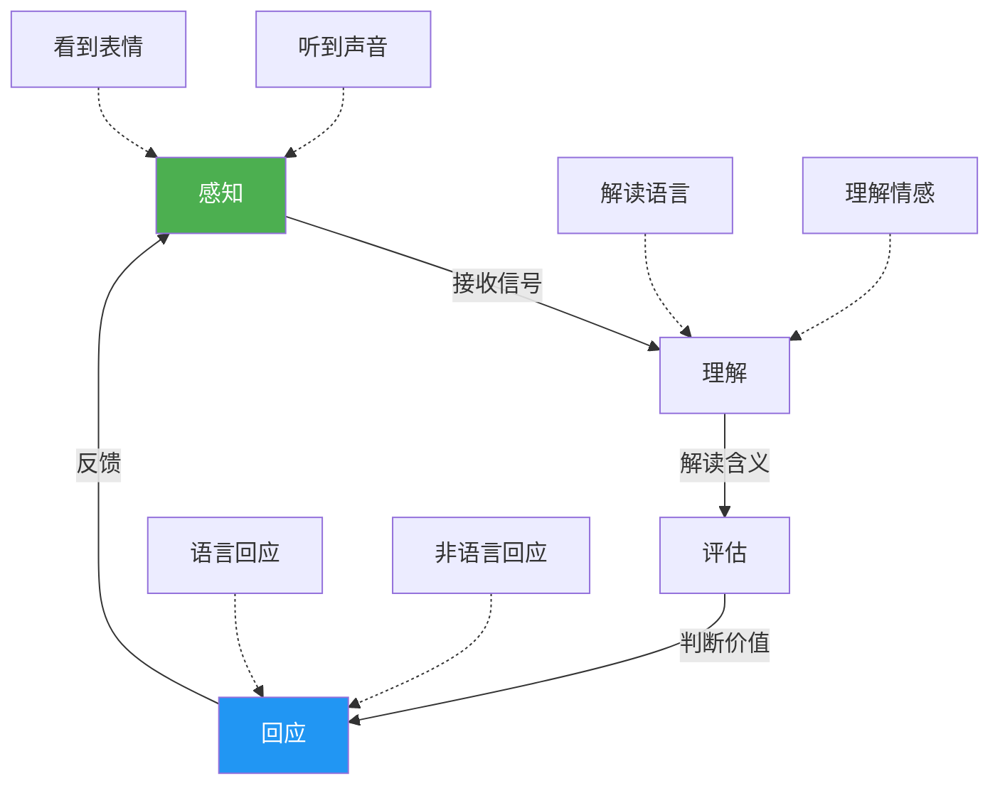

## 一、倾听的定义和重要性

倾听是沟通的基石，也是人类社会协作的底层能力。然而，绝大多数人对倾听的理解停留在"认真听别人说话"这个模糊层面——既不清楚倾听与听觉的生理边界在哪里，也不了解倾听背后的心理机制和神经基础，更没有意识到倾听能力的差距可以在职场、医疗、教育等领域造成多大的实际后果。本节将从定义、理论、机制和价值四个维度，为你建立关于倾听的完整认知框架。

### 1.1 "听"与"倾听"的本质区别

在日常用语中，"听"和"倾听"经常被混为一谈，但它们之间存在本质区别——前者是生理反应，后者是认知行为。

**"听"（Hearing）** 是一种被动的生理活动。声波通过空气传播，进入外耳道，振动鼓膜，经由听小骨（锤骨、砧骨、镫骨）传导至耳蜗，耳蜗中的毛细胞将机械振动转化为电信号，通过听觉神经传入大脑的颞叶听觉皮层。这个过程是自动的、无意识的——你不需要"决定"去听，就像你不需要决定去呼吸一样。只要听觉系统功能正常，你就会"听到"环境中的一切声音，无论你是否想听。

**"倾听"（Listening）** 则是一个复杂的主动认知过程。它以"听到"为起点，但远远不止于此。倾听要求你**有意识地**将注意力聚焦于特定声音源，对其进行语言解码、语义理解、情感识别和意义构建，并做出适当的回应。它不是一种本能，而是一种需要训练的技能——就像阅读一样，人类天生有视觉，但阅读能力需要后天习得。

两者的核心差异可以归纳如下：

| 维度 | 听（Hearing） | 倾听（Listening） |
|------|--------------|-------------------|
| 本质 | 生理过程 | 认知-情感-行为综合过程 |
| 意识参与 | 无意识、自动 | 有意识、主动 |
| 注意力 | 不需要 | 必须聚焦 |
| 是否可训练 | 否（器官决定） | 是（技能可提升） |
| 结果 | 产生声音感知 | 产生理解、情感连接和行动 |
| 能量消耗 | 低 | 高（认知负荷大） |
| 持续性 | 持续（清醒时自动运行） | 可中断（注意力衰减） |

一个类比可以帮助理解：听是眼睛"看到"了一本书上的文字，倾听是大脑"读懂"了这本书在说什么。前者是硬件层面的信号接收，后者是软件层面的信息处理。

### 1.2 倾听的学术定义

不同学科对倾听有不同的定义侧重，综合这些定义可以形成更完整的理解。

**国际倾听协会（International Listening Association, ILA）** 的官方定义是：

> "倾听是对口头和非口头信息进行接收、建构意义并做出回应的过程。"

这个定义包含三个关键要素：

- **接收（Receiving）**：不只是听到声音，还包括接收对方的面部表情、身体姿态、手势、语调、语速等非语言信号。研究表明，在情感信息的传递中，非语言信号占信息总量的 65%-93%（Mehrabian, 1971）。如果你只听到了对方的字面意思而忽略了语气和表情，你遗漏的信息可能比你接收的还多。
- **建构意义（Constructing Meaning）**：在大脑中将接收到的信号与自身经验、知识背景和当前情境相结合，解读对方在表达什么。同一个句子在不同场景下可能意味着完全不同的事情——"好吧"可能是同意，可能是无奈，也可能是愤怒。
- **做出回应（Responding）**：通过语言（"我理解了"、"能详细说说吗"）或非语言方式（点头、眼神接触、身体前倾）让对方知道你在倾听，并确认你的理解是否正确。回应不是"等对方说完轮到我发言"，而是"让对方知道我正在理解他"。

**语言学家 Andrew Wolvin 和 Coakley（1996）** 给出了更学术化的定义：

> "倾听是选择、注意、理解、记忆和评价口头及非口头信息的主动过程。"

这个定义增加了两个重要维度：**记忆**（将信息存储以备后用）和**评价**（对信息进行批判性判断）。它强调倾听不仅仅是"接收"，还包括信息加工的全链条。

**心理学者 Adler 和 Rodman（2003）** 从沟通学的角度定义：

> "倾听是主动赋予声音以意义的过程，涉及对语言和非语言线索的选择性注意、理解和回应。"

综合这些定义，我们可以给出一个完整的操作性定义：

**倾听 = 主动注意 + 多通道接收 + 意义建构 + 情感共鸣 + 适当回应**

这五个环节缺任何一个，都不构成完整的倾听。

### 1.3 经典倾听理论模型

学术界已经发展出多个倾听理论模型，帮助我们理解倾听能力的构成要素和发展路径。

#### （1）Adler 的 HURIER 模型

Judith Adler 提出的 HURIER 模型是目前最广泛使用的倾听能力框架之一，将倾听分解为六个相互关联的步骤：

| 步骤 | 英文 | 含义 | 具体行为 |
|------|------|------|---------|
| H | Hearing | 听到 | 确保听觉通道畅通，注意环境噪音 |
| U | Understanding | 理解 | 解码语言含义，理解逻辑关系 |
| R | Remembering | 记忆 | 将信息编码存入短期和长期记忆 |
| I | Interpreting | 解读 | 识别非语言信号，推断言外之意 |
| E | Evaluating | 评价 | 批判性分析信息的准确性和价值 |
| R | Responding | 回应 | 给出反馈，确认理解，表达态度 |

HURIER 模型的价值在于它将"倾听"这个模糊的能力拆解为六个可独立训练的子技能。当你意识到自己在某个环节薄弱时（比如"我总是记不住对方说了什么"），就可以针对性地强化记忆策略。

#### （2）Brownell 的主动倾听模型

Judi Brownell 在其著作《倾听：态度、原则与技能》中提出了主动倾听模型，强调倾听不是被动接收，而是一种高度主动的行为。模型包含三个核心维度：

- **接收维度**：主动选择注意对象，过滤无关信息
- **处理维度**：整合语言和非语言信息，结合上下文理解
- **回应维度**：给予及时、准确的反馈

Brownell 特别强调，主动倾听需要**意图**——你必须"想要"理解对方，而不仅仅是"等着"对方说完。

#### （3）Steil 的 REAL 倾听模型

Lyman Steil 提出的 REAL 模型侧重于倾听的实践应用：

- **R — Receiving**：积极接收信息
- **E — Evaluating**：评估信息的质量和相关性
- **A — Analyzing**：分析信息的结构和逻辑
- **L — Linking**：将新信息与已有知识建立连接

REAL 模型的优势在于它强调了"连接"——最好的倾听者不仅理解对方在说什么，还能快速将新信息纳入自己的知识框架，从而提出有洞察力的问题和回应。

### 1.4 倾听的神经科学基础

理解倾听如何在大脑中运作，有助于理解为什么倾听如此消耗精力，以及为什么注意力会衰减。

#### （1）大脑中的"倾听网络"

现代神经科学研究表明，倾听不是由大脑的单一区域完成的，而是一个涉及多个脑区的协作网络：

- **初级听觉皮层**（颞叶上回）：负责声音的基本处理——频率、音量、音色
- **Wernicke 区**（颞叶后部）：负责语言理解，将声音信号转化为有意义的词汇和句子
- **前额叶皮层**：负责注意力的分配和维持——决定"我要关注什么"
- **前扣带回**：负责冲突监测——当检测到信息与预期不符时发出警报
- **杏仁核**：负责情感处理——识别对方的情绪状态
- **海马体**：负责将当前信息编码为记忆

关键发现：**前额叶皮层的注意力资源是有限的**。这解释了为什么长时间倾听会导致注意力衰减——就像手机电池一样，认知资源也会"耗尽"，需要休息和恢复。

#### （2）镜像神经元与倾听中的共情

1990 年代，意大利帕尔马大学的研究团队发现了镜像神经元（Mirror Neurons）。这些神经元在你观察他人行动时会自动激活——当你看到别人微笑时，你大脑中负责微笑的区域也会部分激活。

镜像神经元系统是倾听中"共情"的神经基础。当你认真倾听一个悲伤的叙述时，你大脑中处理悲伤的区域会部分被激活，让你"感同身受"。这也解释了为什么倾听别人的痛苦经历会让自己感到疲惫——你的大脑确实在"经历"类似的情感。

#### （3）"鸡尾酒会效应"与选择性注意

心理学家 Colin Cherry 在 1953 年发现了"鸡尾酒会效应"（Cocktail Party Effect）：在嘈杂的环境中，人们能够选择性地关注某个特定的声源（如一个人的说话声），同时过滤掉其他声音。

这个现象揭示了大脑注意力系统的两个重要特征：

- **注意力是有选择的**：你不可能同时认真倾听两个不同的信息源
- **注意力资源是有限的**：你每时每刻都在做"决定"——注意什么，忽略什么

这意味着，当你说"我在同时听两个人说话"时，你的大脑实际上是在快速切换注意力（大约每 2-3 秒切换一次），而不是真正"同时"处理两个信息源。这种切换会造成信息遗漏，且消耗大量认知能量。

### 1.5 倾听过程的四阶段模型

将上述理论和神经机制综合起来，一个完整的倾听过程可以分解为四个阶段：

| 阶段 | 名称 | 对应脑区 | 说明 | 举例 |
|------|------|---------|------|------|
| 第一阶段 | 感知 | 初级听觉皮层 | 接收声音和视觉信号 | 听到同事说"项目延期了"，注意到他语气低沉 |
| 第二阶段 | 理解 | Wernicke区 + 杏仁核 | 解读语言含义和情感 | 理解这意味着截止日期推后，且同事对此感到焦虑 |
| 第三阶段 | 评估 | 前额叶 + 前扣带回 | 判断信息的价值和可靠性 | 考虑延期的原因、对我负责部分的影响、是否需要升级报告 |
| 第四阶段 | 回应 | 布洛卡区 + 运动皮层 | 给出适当的语言和非语言反馈 | 说"我理解了，延期对你来说压力很大吧？我们看看怎么调整计划" |

这四个阶段并非严格的线性关系——在实际倾听中，你会不断循环往复。例如，在回应的同时你也在感知对方对你回应的反应，形成一个持续的反馈回路。

### 1.6 常见认知误区

在深入学习倾听技术之前，有必要先纠正几个常见的错误认知：

**误区一："倾听是一种天赋，要么天生擅长，要么不擅长。"**

事实：倾听是一项可以训练的技能，就像游泳、驾驶或写作一样。研究明确表明，接受过系统倾听训练的人，其倾听效果可提升 25%-50%。2% 的人接受过正式培训（ILA 数据），这意味着绝大多数人还处于"裸奔"状态——你只要稍加训练就能超越绝大多数人。

**误区二："倾听就是不说话，安静地等对方说完。"**

事实：沉默不等于倾听。你可以安静地坐在那里，但脑子里在想午餐吃什么——这不是倾听。倾听需要主动的注意力投入和适当的回应。不说话只是倾听的必要条件之一，远不是充分条件。

**误区三："我理解了字面意思就等于倾听了。"**

事实：字面理解只是倾听的起点。一个说"我没事"的人可能其实在经历巨大的痛苦。完整倾听包括理解字面含义、识别言外之意、感知情感状态和理解深层需求。

**误区四："倾听不需要消耗精力，只是坐着听而已。"**

事实：如前文所述，倾听涉及大脑多个区域的高负荷协作，是极其消耗认知资源的活动。研究表明，持续专注倾听超过 20 分钟后，注意力会显著下降。这就是为什么 1 小时的会议中，人们真正有效倾听的时间可能不到 15 分钟。

**误区五："好的倾听者听什么都好。"**

事实：倾听能力与领域相关。一个在技术讨论中表现出色的倾听者，在面对伴侣的情感倾诉时可能表现糟糕。不同场景需要不同的倾听策略，没有"万能倾听者"。

### 1.7 倾听为何如此重要——七大价值维度

倾听的价值不是抽象的"很重要"，而是可以量化和感知的具体收益。

#### （1）倾听是有效沟通的基石

沟通是双向过程。如果只有表达没有倾听，那就不是沟通，而是独白。Harwell 在 2003 年的研究指出，成年人在清醒时间中有约 45% 的时间用于倾听——远超阅读（16%）、说话（30%）和书写（9%）。可以说，倾听是我们使用最频繁的沟通方式。

一项针对企业高管的调查显示，70% 的管理者认为"倾听不足"是导致工作失误的首要原因。在信息传递链条中，每一次倾听失败都意味着信息的丢失和扭曲——就像传话游戏一样，经过几次"没听清"之后，原始信息可能面目全非。

#### （2）倾听是建立信任的最快途径

当一个人感到自己被认真倾听时，他会自然地对倾听者产生信任和好感。这背后的心理机制是：**倾听满足了人类最基本的心理需求之一——被理解和被重视**。

心理学家 Carl Rogers 在其"以人为中心疗法"中发现，当治疗师真正做到"无条件积极关注"（unconditional positive regard）并深入倾听时，来访者会产生显著的自我接纳和改变动力。这个原理在日常生活中同样适用：你不需要说任何讨好的话，只需要认真听，对方就会觉得"这个人懂我"。

信任的建立遵循一个简单的公式：

**信任 = 一致性 × 时间 × 感知到的理解**

倾听直接提升了"感知到的理解"这个因子。当一个人持续感到被你理解时，信任就会自然积累。

#### （3）倾听是获取高质量信息的最佳方式

在信息时代，你掌握的信息质量决定了你的判断质量。获取信息的方式有很多——阅读、搜索、观察——但倾听有独特的优势：

- **实时性**：你可以即时追问、澄清、深入
- **完整性**：对话中包含的上下文信息远多于文字
- **情感维度**：你能感知信息背后的情感态度和优先级
- **隐含信息**：人们在面对面交流中会透露更多"没有说出口"的信息

德鲁克说："沟通中最重要的，是听出对方没有说出来的话。"这句话精确定义了高阶倾听的核心——不仅听"说了什么"，更听"为什么这么说"和"没说什么"。

#### （4）倾听是解决冲突的前提

几乎所有的冲突都源于误解，而几乎所有的误解都源于倾听不足。这是一个人人都同意但极少人实践的道理。

美国联邦调解与调停服务处（Federal Mediation and Conciliation Service）的实践经验表明，在劳资纠纷调解中，最有效的第一步不是评判谁对谁错，而是让双方各自完整地陈述自己的立场，并确保对方真的听懂了。当一个人感到"对方终于听明白了我在说什么"时，对立情绪会显著降低——因为很多冲突的升级并不是因为利益不可调和，而是因为双方都觉得"对方根本没在听我说话"。

#### （5）倾听是领导力的核心能力

传统领导力强调"决断力"和"表达力"，但现代领导力理论越来越重视"倾听"的价值。

Google 在 2015 年启动的"亚里士多德项目"（Project Aristotle）研究发现，高效团队最重要的特征是**心理安全感**（Psychological Safety）——团队成员敢于表达不同意见而不担心被惩罚。而建立心理安全感的核心手段，就是领导者展现出的**倾听行为**。

具体而言，高效团队的领导者做到了：

- 在会议中先听后说，不急于表达自己的观点
- 对"不好的消息"表现出感谢而非愤怒
- 主动邀请安静的成员发言
- 对不同意见表现出真正的兴趣而非防御

Jack Welch（通用电气前 CEO）说过："在你成为领导者之前，成功是关于你自己的成长；在你成为领导者之后，成功是关于让别人成长。"而倾听正是"让别人成长"的第一步。

#### （6）倾听对医疗安全的直接影响

在医疗领域，倾听不是"软技能"，而是**安全底线**。

世界卫生组织（WHO）的数据显示，全球每年约有 4,210 万例患者安全事件，其中约 65% 与倾听和沟通问题直接相关。这些不是抽象的统计数字——每一个数字背后都是一条生命。

典型的因倾听不足导致的医疗事故包括：

- 患者描述症状时被医生打断，遗漏了关键信息
- 护士交接班时没有认真倾听上一班的警告
- 患者说"我对这个药过敏"但没有被记录
- 患者的真实疼痛程度被低估，因为医生"没有认真听"

约翰·霍普金斯大学的研究估计，美国每年约有 25 万人死于医疗差错——使其成为美国第三大死因。其中大量案例可以追溯到倾听和沟通的失败。

#### （7）倾听对亲密关系的决定性影响

约翰·戈特曼（John Gottman）被誉为"婚姻关系研究的爱因斯坦"。他在西雅图的"爱情实验室"中对超过 3,000 对伴侣进行了长达 40 年的追踪研究，得出了一个关键发现：

> **伴侣之间的倾听质量，可以预测离婚的准确率高达 93.6%。**

戈特曼发现，婚姻中最具破坏性的行为不是争吵，而是"蔑视"（contempt）——而蔑视最常见的表现形式就是：不听、不回应、不关心对方在说什么。

相反，幸福婚姻中的伴侣展现了一种被戈特曼称为"转向"（turning towards）的行为——当伴侣发出情感信号（哪怕是一个小小的感叹或分享）时，另一方会"转向"对方，给予倾听和回应。戈特曼的研究发现，离婚的伴侣平均只有 33% 的时间会对对方的情感信号做出"转向"回应，而幸福婚姻的伴侣这个比例是 86%。

这个发现同样适用于亲子关系、友谊等各类人际关系。孩子是否愿意跟你分享他的烦恼，朋友是否把你当作"知心人"，同事是否愿意跟你合作——这些都取决于你是否是一个好的倾听者。

### 1.8 关于倾听的数据画像

以下数据来自多个权威来源，从不同角度展示了倾听能力的现状和影响：

**记忆衰减数据：**

| 时间节点 | 信息保留率 | 说明 |
|---------|-----------|------|
| 听完即刻 | ~50% | 10 分钟演讲后仅能记住一半 |
| 1 天后 | ~30% | 大部分细节已经丢失 |
| 2 天后 | ~25% | 只能回忆起核心观点 |
| 1 周后 | ~10-15% | 只剩下模糊的印象 |

这意味着，如果你在周一的会议上没有做笔记也没有复述确认，到了周五你可能只记得"好像开了个会"。

**经济影响数据：**

- 企业中因倾听不当造成的经济损失，平均占企业年收入的 7%（Barker & Watson, 2000）。对于一家年收入 1 亿元的公司来说，这意味着每年 700 万元的损失——足够再雇 30 个员工。
- 项目经理协会（PMI）的调查显示，项目失败的首要原因是"沟通不足"，占失败项目的 55%。

**培训缺口数据：**

- 只有 2% 的人接受过正式的倾听培训（ILA 调查）。对比一下：人们花大量时间和金钱学习演讲、写作、阅读，但几乎没有人专门学习倾听——而倾听恰恰是占用时间最多的沟通方式。

**医疗安全数据：**

- 约 65% 的医疗差错与倾听和沟通问题直接相关
- 平均每位医生在患者说完之前 18 秒就会打断（Beckman & Frankel, 1984）

**教育领域数据：**

- 学生在学校中约有 50%-60% 的时间用于倾听
- 倾听能力与学业成绩之间存在显著正相关（Wolvin, 1984）

这些数据清楚地表明：倾听能力的提升，无论对个人还是组织，都具有巨大的可量化价值。它不是一项"锦上添花"的软技能，而是影响安全、效率、关系和收入的核心能力。

### 1.9 倾听能力自评清单

在系统学习倾听技术之前，先了解自己的基线水平。以下清单不是标准答案，而是一面镜子——帮助你识别自己的倾听习惯和盲区。

请对以下 10 项陈述，诚实评估自己的行为（1=几乎从不，2=偶尔，3=有时，4=经常，5=几乎总是）：

| 编号 | 陈述 | 自评(1-5) |
|------|------|-----------|
| 1 | 当别人说话时，我能在不打断的情况下听完 | ___ |
| 2 | 我会主动关注对方的非语言信号（表情、语气、姿态） | ___ |
| 3 | 在重要对话后，我能准确回忆对方表达的主要内容 | ___ |
| 4 | 当我不同意对方时，我会先确保理解了他的完整观点再回应 | ___ |
| 5 | 我能识别对方话语背后的情绪状态 | ___ |
| 6 | 别人曾经对我说"和你聊天很舒服"或类似的话 | ___ |
| 7 | 我在对话中不会同时想别的事情或看手机 | ___ |
| 8 | 我会通过复述或提问来确认自己的理解 | ___ |
| 9 | 即使对方的表达很冗长或杂乱，我也会耐心寻找核心信息 | ___ |
| 10 | 在冲突中，我能够先倾听对方的立场而不急于反驳 | ___ |

**评分解读：**

- **40-50 分**：你有很好的倾听基础，后续章节将帮助你从"好"到"卓越"
- **30-39 分**：你的倾听意识不错，但存在一些可以改进的盲区
- **20-29 分**：你有倾听的意愿，但习惯和技术还需要系统提升
- **10-19 分**：不必沮丧——好消息是，既然你能认识到这一点，你已经在进步的路上了

无论你的得分如何，接下来的章节都会为你提供从理论到实践的完整提升路径。

***

> **本节小结**：倾听不是"听"的同义词，而是一个涉及注意力、理解、情感识别和回应的主动认知过程。它有坚实的理论基础（HURIER、主动倾听、REAL 模型）、明确的神经机制（听觉-语言-情感-注意力的多脑区协作）、以及可量化的巨大价值（从医疗安全到婚姻幸福）。带着对倾听的这种深层理解，我们将在下一节探讨倾听的不同层次——从"听而不闻"到"全身心倾听"的进阶路径。
