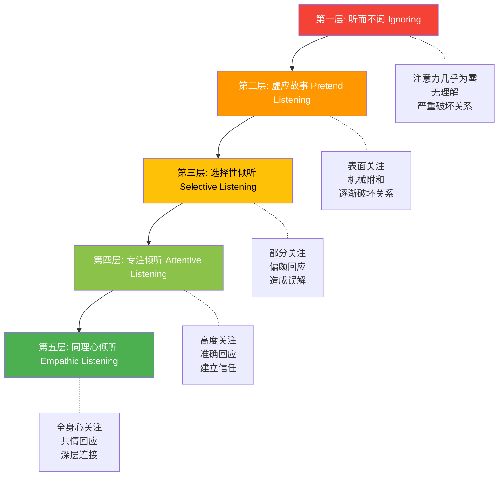
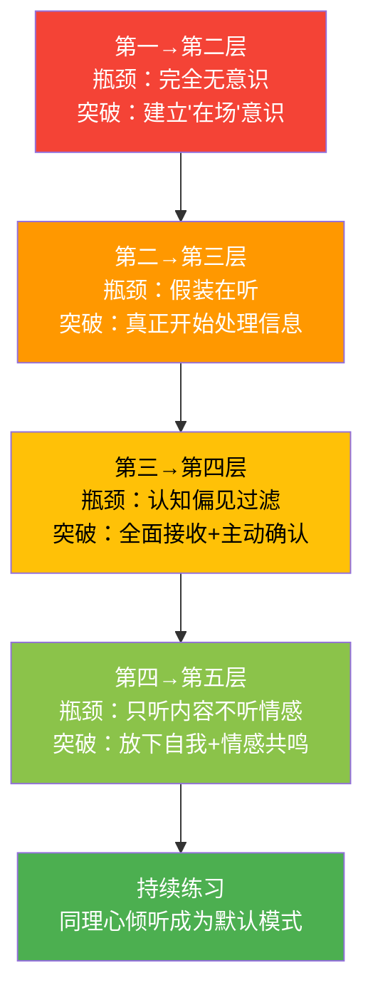

## 二、倾听的层次

上一节我们建立了倾听的完整认知框架——倾听是一个涉及注意力、理解、情感识别和回应的主动认知过程，其神经基础是听觉皮层、Wernicke区、前额叶、杏仁核等多脑区的协作网络。但认知上"知道"倾听是什么，和实践中"做到"倾听，是两件完全不同的事。

在现实中，同样是"在听别人说话"，不同的人表现出的质量天壤之别。有人盯着手机心不在焉，有人频频点头却答非所问，有人听到了每一个字但遗漏了情感，有人不仅听懂了内容还读懂了人心。这些差异不是偶然的，而是可以系统归类的。

本节将倾听划分为五个递进的层次，从最低到最高依次是：**听而不闻、虚应故事、选择性倾听、专注倾听、同理心倾听**。每个层次都有其明确的特征、心理机制、典型场景、危害或价值，以及从当前层次向更高层次跃迁的具体路径。

> **为什么是五个层次而不是三个或七个？** 这个五层框架源自沟通学者 Andrew Wolvin 和 Carole Coakley 的研究，并经过后续学者的扩展验证。五个层次恰好覆盖了从"完全不听"到"全身心倾听"的完整光谱，每一层都有可辨识的行为标志和可测量的效果差异。少于五层会合并本质不同的行为模式，多于五层则会制造难以区分的细微差异。

### 2.1 第一层：听而不闻（Ignoring）

**定义**：虽然耳朵接收到了声音信号——声波确实进入了外耳道，振动了鼓膜，电信号确实传入了听觉皮层——但前额叶皮层没有分配任何注意力资源给这些信号。信息在初级听觉皮层就被丢弃了，从未进入Wernicke区进行语义加工。用上一节的四阶段模型来说，倾听在第一阶段"感知"就中断了——信号被接收了，但没有被注意。

**神经机制**：前额叶皮层的注意力资源被完全分配给了其他任务（看手机、想心事、处理眼前的工作）。大脑的"注意力探照灯"没有照向说话者，而是照向了别处。这不是耳朵的问题，而是大脑"选择"不处理这些信号。

**典型表现**：

- 对方在说话时，你盯着手机屏幕，偶尔"嗯"一声作为条件反射
- 别人叫你的名字，你完全没有反应——因为注意力不在此处
- 事后你完全不记得对方刚才说了什么，甚至不记得对方来过
- 你的身体在场，但你的意识完全在另一个世界

**日常场景**：

> **场景一：家庭**
> 妻子："今天公司发生了一件特别气人的事……"
> 丈夫：（盯着手机看新闻）"嗯……"
> 妻子："……所以我觉得特别委屈。"
> 丈夫：（头也不抬）"啊？你说什么？"
>
> **场景二：亲子**
> 孩子兴冲冲跑过来："爸爸你看我画的画！"
> 父亲：（盯着电脑屏幕）"嗯，好看，去玩吧。"
> 孩子低头看了看自己的画，默默走开了。
>
> **场景三：职场**
> 同事走到你工位："关于那个项目，有个重要的变更需要……"
> 你：（盯着代码）"嗯嗯，你说。"
> 同事说完了，你说"好的收到"。三天后你才发现项目变更你完全不知道。

**危害分析**：

听而不闻是所有倾听层次中破坏性最大的。它传递的信号不是"我没听到"，而是**"你不值得我注意"**。对于说话者来说，这种体验比直接被拒绝更具杀伤力——因为至少被拒绝意味着你被看见了，而听而不闻意味着你根本不存在。

在亲密关系中，长期的听而不闻是关系死亡的主要原因之一。约翰·戈特曼（John Gottman）的研究发现，伴侣之间最具预测性的离婚指标之一就是"情感信号被忽视的频率"——当一方反复发出信号而另一方反复不回应时，关系就会逐渐枯萎。

在亲子关系中的伤害更为深远。发展心理学研究表明，儿童在成长过程中反复经历"被忽视"，会导致"不安全依恋"模式，影响其成年后的人际关系和心理健康。

**为什么会陷入这个层次？**

- **数字设备成瘾**：智能手机创造了前所未有的注意力竞争。数据显示，普通成年人每天查看手机96次（Asurion, 2019），平均每10分钟一次。手机通知铃声已经成为一种条件反射触发器——即使你决定不看，大脑已经在处理"可能有什么"的焦虑了。
- **多任务处理的幻觉**：很多人认为自己可以一边看手机一边听对方说话。但神经科学研究明确表明，大脑无法同时处理两个需要注意力的任务——它只是在快速切换，每次切换都有信息损失。
- **慢性注意力疲劳**：现代社会的信息过载导致很多人的注意力系统长期处于疲劳状态，就像一个一直满负荷运转的CPU，已经没有多余的算力分配给倾听。

**自我诊断**：如果你在对话中频繁出现以下任一情况，你很可能经常处于第一层：

- 对方说完后你需要问"你刚才说什么？"
- 你发现自己在对话中频繁走神到其他事情上
- 亲密的人多次抱怨"你根本没在听我说话"
- 你经常事后才知道别人告诉过你某件事

### 2.2 第二层：虚应故事（Pretend Listening）

**定义**：你在表面上装作在听，做出一些"嗯"、"对"、"是的"之类的回应，但你的注意力并不在对方身上。与第一层不同的是，你的社交雷达检测到了"应该表现出在听"的信号——你知道此刻需要回应，但你只是在执行一个社交脚本，而不是真正在加工信息。

**神经机制**：前额叶皮层分配了极少的注意力资源给对方的话语——刚好够产生一些通用的回应词（"嗯嗯"、"对"、"是的"），但远不够进行语义理解和意义建构。你的回应是由"社交习惯"驱动的自动行为，而不是由"理解"驱动的认知行为。

**典型表现**：

- 机械性地点头和附和，节奏固定，像节拍器一样规律
- 回应的内容与对方的话题无关——因为你在回应"对方在说话"这个事实，而不是回应内容
- 眼神空洞或虽然看着对方但焦点不在对方脸上
- 偶尔冒出一句"嗯嗯，你说得对"，但对方其实在说一件令人难过的事
- 当对方突然问"你觉得呢？"时，你会愣住或给出一个模糊的回答

**日常场景**：

> **场景一：社交场合**
> 同事："你知道吗，我上周去了一趟云南，那里的风景真的是……"
> 你：（心想着晚上的安排）"嗯嗯，不错不错。"
> 同事："……然后我就在雪山脚下哭了，因为我想起了我去世的爷爷。"
> 你："嗯嗯，听起来挺好的。"
> （同事的表情瞬间僵住了。）
>
> **场景二：会议**
> 领导在会议上讲解新战略方向，你在"认真"点头，但脑子里在想中午吃什么。
> 领导："小张，你觉得这个方案怎么样？"
> 你：（慌张）"呃……挺好的，我同意。"
> 领导："我刚才说了两个方案，你同意哪一个？"
> 你："……"
>
> **场景三：电话**
> 朋友打电话倾诉感情问题，你一边刷朋友圈一边"嗯嗯嗯"。
> 朋友："你说我该怎么办？"
> 你："嗯……什么怎么办？"

**危害分析**：

虚应故事比听而不闻更危险，因为它制造了一种**虚假的倾听假象**。说话者以为你在听，所以会继续深入分享，直到你做出一个完全不合时宜的回应时，对方会同时经历两种负面感受：**被欺骗**（原来你一直没在听）和**被羞辱**（我说了这么多，你根本不在乎）。

信任一旦被这种"虚假倾听"破坏，修复的难度远高于"你刚才没听到"这种坦诚的失误。因为前者让对方怀疑："你以后是不是也在装？"

**为什么会陷入这个层次？**

- **社交压力**：在某些场合（会议、聚会、长辈谈话），你觉得自己"必须"表现出在听，但内心并不想听或精力不足。
- **话题不感兴趣**：对方在讲你完全不感兴趣的内容，但出于礼貌你不能直接走开。
- **精力耗尽**：在长时间的会议或对话后期，你的注意力资源已经被耗尽，但对话还在继续。
- **习惯性表演**：有些人长期在社交中"表演倾听"，已经形成了一种自动化的社交面具，自己都意识不到自己在假装。

**从第一层到第二层的进步**：至少你在社交层面意识到了"应该在听"，并且做出了回应的姿态。但这是一个**危险的舒适区**——因为它看起来像倾听，容易让你误以为自己的倾听能力没问题。

### 2.3 第三层：选择性倾听（Selective Listening）

**定义**：你确实在听，注意力资源被分配了一部分给对方的话语，但你只处理了信息流中的一部分——你感兴趣的部分、与你预期一致的部分、或者最先进入你耳朵的部分。其他信息被你的认知过滤器自动丢弃了。

**神经机制**：前额叶皮层分配了中等程度的注意力资源，但注意力的"聚光灯"覆盖范围有限，且受到确认偏见（Confirmation Bias）的影响——大脑倾向于优先处理与已有信念一致的信息，而忽略不一致的信息。用HURIER模型来说，"Hearing"和"Understanding"环节都部分完成了，但"Interpreting"（解读）和"Evaluating"（评价）环节受到了偏见的扭曲。

**典型表现**：

- 对方说了10个要点，你只记住了其中1-2个
- 你只关注事实信息，忽略情感表达（或者反过来，只关注情绪，忽略事实）
- 你只听自己想听的，过滤掉不符合预期的内容
- 你会不自觉地把对方的话往自己熟悉的方向解读
- 当对方的观点与你不同时，你在对方说话的同时就在心里组织反驳
- 你对某些人的话格外上心，对另一些人的话自动打折

**日常场景**：

> **场景一：职场信息遗漏**
> 老板："这个项目有三个关键点：第一，时间要抓紧；第二，质量不能放松；第三，预算要控制。另外，团队的士气也很重要。"
> 员工：（只记住了"时间要抓紧"）"好的，我会加班赶进度的。"
> 老板：（心想：我明明说了质量不能放松啊……）
>
> **场景二：伴侣沟通**
> 妻子："我希望你以后能早点回家。不是说你不能加班，但是我一个人带孩子真的很累，而且你答应过周末带我们去公园的……"
> 丈夫：（只听到了"你不能加班"）"我不加班谁赚钱？你就知道抱怨。"
> 妻子：（崩溃）你到底有没有在听我说什么？
>
> **场景三：医患沟通**
> 医生："你的血压偏高，需要注意三件事：第一，减少盐的摄入；第二，每天运动30分钟；第三，减少精神压力，保持心情愉快。"
> 患者：（只记住了"少吃盐"）回家后只在饮食上做了调整，其他一概没变。

**危害分析**：

选择性倾听是日常沟通中最常见的倾听缺陷，也是最难以察觉的——因为**你确实觉得自己在听**。你没有走神，没有假装，你认真地处理了对方话语的一部分内容。问题在于，你遗漏的那部分可能恰恰是最关键的。

在工作场景中，选择性倾听是信息遗漏和工作失误的重要来源。项目管理协会（PMI）的调查显示，55%的项目失败与沟通不足有关，而"沟通不足"中有很大比例不是"没有沟通"，而是"沟通了但没有完整接收"——这正是选择性倾听的后果。

在亲密关系中，选择性倾听会让伴侣反复感到"说了也没用"，最终导致对方不再表达——这比吵架更危险，因为沉默意味着对方已经放弃了沟通的希望。

**常见的选择性过滤器**：

| 过滤器类型 | 表现 | 典型内心独白 |
|-----------|------|-------------|
| 利益过滤 | 只听与自己利益相关的部分 | "这跟我有什么关系？" |
| 立场过滤 | 只听支持自己观点的部分 | "看，他果然同意我的看法" |
| 情感过滤 | 只关注情绪，忽略事实 | "他好生气啊"（但没听到具体诉求） |
| 专业过滤 | 只关注自己领域的信息 | "我是做技术的，商业部分不重要" |
| 首因过滤 | 只记住开头，忽略后面 | "他说了三个点？我只记得第一个" |
| 权威过滤 | 对权威人士更上心，对普通同事打折 | "领导说的肯定重要，同事说的随便听听" |

**为什么会陷入这个层次？**

- **认知经济原则**：大脑天然倾向于节省认知资源，自动过滤"不重要"的信息是一种效率策略。问题在于，大脑的"重要性判断"往往基于过去的经验和偏见，而不是当前的客观需求。
- **确认偏见**：心理学中最稳健的发现之一——人们倾向于注意和记住与已有信念一致的信息。在倾听中，这意味着你可能不知不觉地构建了一个"对方同意我"的错觉。
- **信息过载防御**：当信息量超出处理能力时，大脑会自动启动"降采样"模式，只保留它认为重要的部分。这是一种自我保护机制，但在需要全面理解的场合会造成严重遗漏。

### 2.4 第四层：专注倾听（Attentive Listening）

**定义**：你全神贯注地关注对方，认真理解对方话语的字面含义和逻辑结构。你不仅听到了对方说了什么，还能准确复述对方的要点，提出有针对性的问题。注意力资源被充分且稳定地分配给了倾听任务，HURIER模型中的六个步骤——听到、理解、记忆、解读、评价、回应——都基本完成了。

**神经机制**：前额叶皮层的注意力"聚光灯"稳定地照在说话者身上，Wernicke区在高效运转进行语义加工，海马体在积极编码记忆。认知资源没有被分散到其他任务上，整个倾听网络处于协同工作状态。

**典型表现**：

- 眼神专注地看着对方，身体微微前倾
- 通过点头、"我明白"、"请继续"等方式给予适时的语言和非语言回应
- 能够准确复述对方的主要观点和关键细节
- 会提出相关的问题来加深理解和澄清疑惑
- 能够抓住对方的逻辑线索，跟上复杂的论述
- 在对方说完后，能给出结构化的回应（"你刚才说了三点，我的理解是……"）

**日常场景**：

> **场景一：商务沟通**
> 客户："我们需要在下个月15号之前完成这个项目，预算大概在50万左右，质量标准是通过ISO认证。"
> 你：（放下手中的笔，认真看着对方）"我确认一下：截止日期是下月15号，预算约50万，质量标准是ISO认证，对吗？另外，关于ISO认证的具体条款，你们有偏好指向哪个版本的标准？还有其他要求吗？"
>
> **场景二：技术支持**
> 用户："我每次打开软件都会弹出一个错误提示，大概是从上周更新之后开始的，只有在打开大文件的时候才会出现。"
> 你："我理解一下：第一，问题是最近才出现的，跟上周的更新有关；第二，不是所有文件都会触发，只针对大文件。请问'大文件'大概是多大的？错误提示的内容你能描述一下吗？"
>
> **场景三：家庭沟通**
> 配偶："这个周末我妈要来住两天，她最近身体不太好，我想带她去检查一下。你能帮忙照顾一下孩子吗？"
> 你："好的。你妈具体是哪里不舒服？需不需要我提前预约医院？孩子这边没问题，周六上午我带他去上兴趣班，下午我们一起去接你妈。"

**为什么专注倾听已经很好，但还不够？**

专注倾听是一个很高的水平，能应对绝大多数日常沟通场景。在职场中，做到专注倾听你已经超越了90%的人——因为绝大多数人连第三层都达不到。

但专注倾听有一个根本性的局限：**它主要处理的是"内容"层面的信息，而不是"情感"层面的信息**。你可以精确地复述对方说了什么，但你可能没有感受到对方在说这些话时的情绪状态、未说出口的需求，以及话语背后的真正含义。

一个经典的例子：

> 妻子："你能不能把袜子放到洗衣篮里？"
> 专注倾听的丈夫："好的，以后我会把袜子放到洗衣篮里。"
> （问题似乎解决了，但妻子下次还会因为同样的事情生气。）

如果用同理心倾听，丈夫可能会意识到：妻子说的不是"袜子"，而是**"我觉得这个家里只有我在收拾，我不被重视"**。

### 2.5 第五层：同理心倾听（Empathic Listening）

**定义**：你不仅理解了对方话语的字面含义，还感受到了对方的情感状态，理解了对方未说出口的需求和意图。你暂时放下了自己的立场和观点，完全进入对方的世界去感受。你不是在"听"对方说话，而是在"体验"对方的处境。

**神经机制**：除了专注倾听涉及的所有脑区都被高度激活外，同理心倾听还额外激活了**镜像神经元系统**（前运动皮层和顶叶的特定区域）和**脑岛**（负责内感受和共情的脑区）。当你感受到对方的痛苦时，你大脑中处理痛苦的区域也会被部分激活——你的大脑确实在"经历"类似的情感体验。这也解释了为什么深度的同理心倾听如此消耗精力——它不是纯粹的认知活动，而是认知和情感的双重负荷。

**与专注倾听的关键区别**：

| 维度 | 专注倾听 | 同理心倾听 |
|------|---------|-----------|
| 关注焦点 | "对方说了什么" | "对方感受到了什么，为什么这么说" |
| 信息处理 | 语言内容 + 逻辑结构 | 语言内容 + 情感状态 + 未说出口的需求 |
| 回应方式 | 准确复述、澄清、结构化回应 | 情感命名、需求确认、共情表达 |
| 大脑活动 | 主要激活语言和注意力网络 | 额外激活镜像神经元、脑岛等共情网络 |
| 心理距离 | 保持一定客观距离 | 暂时"进入"对方的世界 |
| 适用场景 | 信息传递、问题解决 | 情感支持、关系建设、冲突化解 |

**典型表现**：

- 你能感知到对方话语背后的情绪（委屈、焦虑、兴奋、恐惧、无助……），即使对方没有明确说出来
- 你能理解对方为什么会有这种感受——不是用你自己的逻辑，而是用对方的经历和处境
- 你不会急于评判或给建议，而是先让对方感到被理解
- 你的回应既包含了对内容的理解，也包含了对情感的共鸣
- 你能识别对方的"言外之意"——那些想说但没说出口的话
- 你能感知到对方的身体语言、语气变化、呼吸节奏等非语言信号的含义

**日常场景**：

> **场景一：朋友倾诉**
> 朋友："我最近工作特别累，每天加班到10点，感觉身体快撑不住了。但是又不敢辞职，因为还有房贷要还……"
> 你：（放下手中的事，认真看着对方，声音温和）"听起来你现在压力真的很大。一方面身体在发出警告信号，另一方面又不得不为了房贷继续撑着。这种进退两难的感觉确实很煎熬。你现在的感受是什么样的？"
>
> **场景二：孩子受挫**
> 孩子：（闷闷不乐）"今天运动会我跑了最后一名……"
> 你：（蹲下来，和孩子平视）"跑了最后一名，你是不是觉得很丢脸？（孩子点头）你是不是也觉得之前练了那么久好像白费了？（孩子眼眶红了）嗯，这种感觉确实不好受。你愿意跟我说说比赛的时候是什么感觉吗？"
>
> **场景三：冲突化解**
> 同事愤怒地冲过来："你们部门每次都把最烂的项目甩给我们，出了问题就让我们背锅！"
> 你：（没有立刻反驳，而是先接住情绪）"我能感觉到你现在非常愤怒。你觉得我们部门把不公平的负担推给了你们，而且出了问题还要你们承担后果，这让你觉得不被尊重。我说的对吗？"
> （同事的怒气明显降了一级，因为他的情绪被"看到"了。）

**为什么同理心倾听如此困难？**

同理心倾听是倾听的最高境界，也是最难持续做到的。它不仅需要技巧，更需要勇气——因为你需要暂时放下自己的世界，进入一个可能和你完全不同的视角。具体来说，它面临以下挑战：

**挑战一：需要放下自我。** 当朋友在抱怨工作压力时，你的第一反应可能是"我的压力比你还大"或者"你应该这样做"。同理心倾听要求你暂停这些自我中心的反应，先去理解对方的世界。这对于所有人来说都是反本能的。

**挑战二：情感负荷大。** 深度共情会激活你自己的情感系统，让你"感受"到对方的痛苦。长期高强度的同理心倾听会导致"共情疲劳"（Compassion Fatigue），这在心理咨询师、医护人员、社会工作者中尤为常见。

**挑战三：需要精准的情感识别能力。** 如果你自己的情感词汇有限（只能区分"高兴"和"不高兴"），你就很难精准地识别和回应对方复杂的情感状态。

**挑战四：容易越界。** 过度的同理心可能让你"失去自我"——你太沉浸在对方的世界中，以至于失去了客观判断能力。心理咨询中称之为"过度认同"（Over-identification），是专业工作者需要警惕的风险。

### 2.6 层次间的跃迁路径

了解五个层次只是第一步，更重要的是知道如何从低层次向高层次跃迁。每一个跃迁都有其特定的瓶颈和突破方法。

**第一层 → 第二层：建立"在场"意识**

这一步的核心是**觉察**——意识到自己此刻没有在听。很多人在第一层停留多年而不自知，因为走神是如此自然，以至于他们认为"走着神也能听"是真的。

突破方法：
- 当别人对你说话时，做一个物理动作——放下手机、转过身体、看着对方。这个动作本身会触发大脑的注意力切换。
- 如果你发现自己走神了，坦诚说"抱歉，我刚才走神了，能再说一遍吗？"——承认比假装更有价值。
- 建立"对话优先"的规则：在重要的人对你说话时，把手机屏幕朝下放在桌上。

**第二层 → 第三层：从表演到参与**

这一步的核心是**投入**——不是假装在听，而是真正开始处理信息。你需要让大脑从"社交脚本模式"切换到"信息处理模式"。

突破方法：
- 给自己一个具体的任务：在对方说话时，试着在心里默默总结"他到目前为止说了什么？"
- 如果你对当前话题实在不感兴趣，诚实但温和地表达："我现在精力不太好，能换个时间再聊吗？"——这比假装在听要好得多。
- 练习"主动提问"——当你开始提问时，你的大脑就被迫开始处理对方的信息了。

**第三层 → 第四层：全面接收，减少过滤**

这一步的核心是**开放**——有意识地抵抗自己的认知偏见，全面接收对方的信息，而不是只听自己想听的。

突破方法：
- 在每次重要对话后，自问："我是否遗漏了什么？对方说了哪些我不太认同但我需要考虑的？"
- 练习"复述确认"：对方说完后，用自己的话复述一遍，让对方确认你的理解是否准确。
- 有意识地提醒自己：当我在心里组织反驳时，我可能正在错过对方的核心论点。
- 使用上一节介绍的HURIER模型，逐个检查自己在每个步骤是否做到了位。

**第四层 → 第五层：放下自我，进入对方的世界**

这一步是最难的跃迁，因为它要求你暂时放下自己的参照框架，用对方的参照框架来理解世界。

突破方法：
- 在回应之前，先问自己："对方此刻的感受是什么？他真正需要的是什么？"
- 练习"情感命名"：不只是说"我理解"，而是具体说出你感知到的情感——"你是不是觉得很委屈？""听起来你很焦虑。"
- 暂时搁置你的判断和建议。记住：大多数人需要的不是解决方案，而是被理解。
- 阅读小说和传记——研究表明，经常阅读文学作品的人，共情能力显著高于不阅读的人（Kidd & Castano, 2013, *Science*）。因为阅读小说本身就是一种"进入他人世界"的练习。

### 2.7 层次对比总结

| 层次 | 注意力 | 理解深度 | 回应质量 | 对关系的影响 | 典型内心状态 |
|------|--------|----------|----------|-------------|-------------|
| 听而不闻 | 几乎为零 | 无理解 | 无回应或无关回应 | 严重破坏 | "我在想别的事" |
| 虚应故事 | 表面关注 | 表面理解 | 机械附和 | 逐渐破坏 | "我得装出在听的样子" |
| 选择性倾听 | 部分关注 | 部分理解 | 偏颇回应 | 造成误解 | "我只听重要的部分" |
| 专注倾听 | 高度关注 | 内容理解 | 准确回应 | 建立信任 | "我认真在听你说什么" |
| 同理心倾听 | 全身心关注 | 内容+情感理解 | 共情回应 | 深层连接 | "我在感受你的感受" |

### 2.8 不同场景下的层次选择

一个常被忽略的事实是：**并非所有场景都需要第五层倾听**。在某些场景中，专注倾听就足够了；在另一些场景中，低于第四层就会造成严重后果。学会根据场景选择合适的倾听层次，本身就是一种高级能力。

| 场景 | 推荐最低层次 | 原因 | 如果低于此层次 |
|------|------------|------|-------------|
| 领导布置工作任务 | 第四层（专注倾听） | 信息遗漏直接导致工作失误 | 遗漏关键要求，执行出错 |
| 伴侣表达不满 | 第五层（同理心倾听） | 对方要的不是信息接收而是情感被看见 | 对方感到不被理解，冲突升级 |
| 朋友分享好消息 | 第四层（专注倾听） | 对方希望与你分享喜悦 | 对方觉得你不关心他 |
| 朋友深夜倾诉 | 第五层（同理心倾听） | 对方正处于情感脆弱状态 | 对方感到孤独，关系受损 |
| 客户投诉 | 第五层→第四层 | 先同理情感，再专注解决问题 | 客户觉得你不重视，投诉升级 |
| 会议信息传递 | 第四层（专注倾听） | 准确获取信息即可 | 信息遗漏，执行偏差 |
| 孩子讲述学校的事 | 第五层（同理心倾听） | 孩子需要被"看到" | 孩子不再愿意跟你分享 |
| 上级批评你 | 第四层（专注倾听） | 需要准确理解批评内容，不能被情绪左右 | 遗漏建设性部分，只记住被攻击感 |

**关键原则**：在涉及情感的场景中，层次越高越好；在纯信息传递的场景中，第四层是最优选择——因为第五层的情感投入在纯信息场景中反而可能降低效率。

### 2.9 常见误区

**误区一："同理心倾听就是同意对方。"**

事实：同理心倾听不等于认同。你可以说"我能理解你为什么这么生气"，同时在内心认为对方的愤怒并不合理。同理心是对情感的理解，不是对立场的认同。混淆这两者会导致你在需要保持立场的场景（如谈判、纪律处分）中不敢使用同理心倾听。

**误区二："我应该随时随地保持第五层倾听。"**

事实：同理心倾听消耗大量认知资源，不可能持续一整天。在低风险、低情感需求的日常对话中（点餐、问路、闲聊），第三层甚至第二层就够了。把第五层留给真正重要的时刻——亲密关系中的深度对话、朋友的情感倾诉、关键的商务谈判。**倾听层次的智慧不在于永远站在第五层，而在于知道什么时候该在第几层。**

**误区三："倾听层次是固定的人格特质。"**

事实：同一个人在不同场景、不同时间、面对不同对象时，会处于不同的倾听层次。你可能在和伴侣说话时处于第五层，在开无聊的会议时处于第二层。倾听层次不是你"是什么人"的标签，而是你在"此刻这个场景中"的状态。好消息是，通过有意识的练习，你可以让你的"默认层次"逐渐提高。

**误区四："倾听层次越高，越不需要技巧。"**

事实：恰恰相反。第五层同理心倾听需要的技巧最多——情感识别、情感命名、共情表达、自我觉察、情绪边界管理等。它之所以看起来"自然"，是因为高手把技巧内化为了习惯。就像顶级钢琴家的演奏看起来毫不费力，但背后是数千小时的刻意练习。

**误区五："只有面对面才能做到高层次倾听。"**

事实：虽然面对面沟通提供了最丰富的非语言信号，但高层次倾听在电话、视频会议甚至文字消息中都可以做到。在文字沟通中，你需要更仔细地分析对方的措辞选择、标点使用、回复速度和消息长度等线索。在电话中，你需要更专注于语气、语速和停顿。媒介改变了线索的形式，但倾听的本质不变。

### 2.10 实操练习

#### 练习一：倾听层次日记（建议持续一周）

每天记录3次对话，每次对话后回顾：

1. 对话对象和场景是什么？
2. 我在这次对话中主要处于哪个倾听层次？
3. 有哪些信号表明我降到了更低的层次？（走神、不记得内容、回应不恰当……）
4. 如果重来一次，我可以做什么来提升一个层次？

这个练习的价值不在于"评判自己"，而在于**建立对自己倾听状态的觉察能力**。觉察是改变的第一步。

#### 练习二：逐层升级训练

选择一个日常对话场景（如和伴侣的晚餐对话、和同事的午餐闲聊），有意识地逐层练习：

- **第一天**：专注于"不走神"——在整个对话过程中保持注意力在对方身上（从第一层到第二/三层）。
- **第三天**：在不走神的基础上，练习复述确认——用自己的话总结对方说的要点（从第三层到第四层）。
- **第五天**：在准确理解的基础上，练习感知对方的情感——"你刚才说这件事的时候，我感觉你好像挺失望的？"（从第四层到第五层）。

#### 练习三：情感词汇扩展

同理心倾听的瓶颈往往不是"不想共情"，而是"不知道该用什么词来描述对方的情感"。以下练习可以帮助你扩展情感词汇：

每天花5分钟，在以下情感词汇表中选3个词，回忆一个自己经历过的相关场景，尝试用一句话描述那种感受：

| 基础情感 | 细分情感 |
|---------|---------|
| 愤怒 | 恼怒、愤慨、暴怒、怨恨、烦躁、恼火、委屈、憋屈 |
| 悲伤 | 沮丧、失落、心碎、孤独、无助、绝望、惆怅、哀伤 |
| 恐惧 | 焦虑、不安、紧张、恐慌、心虚、畏惧、提心吊胆 |
| 快乐 | 兴奋、满足、欣慰、感动、自豪、释然、心花怒放 |
| 厌恶 | 反感、排斥、不屑、鄙视、失望、心寒 |
| 惊讶 | 震惊、意外、难以置信、恍然大悟、措手不及 |

当你的情感词汇越丰富，你在倾听中就越能精准地识别和回应对方的情感。

#### 练习四："不下判断"倾听挑战

选择一次与你意见不同的对话场景，给自己一个约束：**在对方说完之前，不允许自己做出任何评判性回应**（包括"但是"、"不过"、"你有没有想过"等）。

你唯一能做的回应是：
- 复述确认："你的意思是……"
- 情感回应："听起来你觉得……"
- 澄清提问："能多说说……吗？"
- 简单鼓励："我在听，请继续。"

这个练习的目的是让你体验一下"真正听完对方再说"是什么感觉。很多人在练习后会惊讶地发现：当他们真的听完了对方的完整论述后，自己的观点也发生了微妙的变化。

### 2.11 进阶视角：动态层次切换

成熟的倾听者不会死守某一个层次，而是在对话中动态切换。以下是一个典型的动态切换模式：

**步骤解读**：

1. 同事带着强烈的情绪来抱怨，如果直接进入第四层"专注倾听问题"，对方会觉得"你只关心事情不关心我"。所以先用第五层接住情绪。
2. 当对方的情绪被接纳、开始平静下来后，自然切换到第四层，专注地了解具体发生了什么。
3. 在理解了全貌后，可以切换到第三层的"选择性倾听"——聚焦于关键信息和可行动的部分，忽略情绪性的重复内容。
4. 基于这些信息，共同寻找解决方案。

这种动态切换能力，才是倾听层次模型的最高应用——不是追求"永远在第五层"，而是**在正确的时刻使用正确的层次**。

### 2.12 本节小结

倾听不是一种单一的行为，而是一个从低到高的连续光谱。五个层次——听而不闻、虚应故事、选择性倾听、专注倾听、同理心倾听——代表了注意力投入程度和理解深度的递进。

关键要点：

- **前三个层次（听而不闻、虚应故事、选择性倾听）是倾听的"陷阱区"**——大多数人大多数时间处于这三个层次而不自知。
- **第四层（专注倾听）是一个优秀的基准线**——做到这一层，你已经超越了绝大多数人。
- **第五层（同理心倾听）是倾听的最高境界**——它不仅理解内容，还感受情感；不仅听到说了什么，还听到没说什么。
- **层次不是固定的标签，而是可以跃迁的状态**——通过觉察、练习和刻意训练，你的默认倾听层次可以持续提升。
- **真正的高手不追求永远在第五层，而追求在正确的时刻使用正确的层次**。

带着对倾听层次的清晰认知，我们将在下一节深入探讨倾听背后的心理学机制——理解了"为什么"我们会在不同层次之间波动，才能更有效地控制自己的倾听状态。

***
