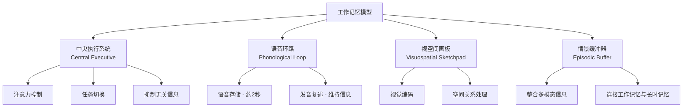
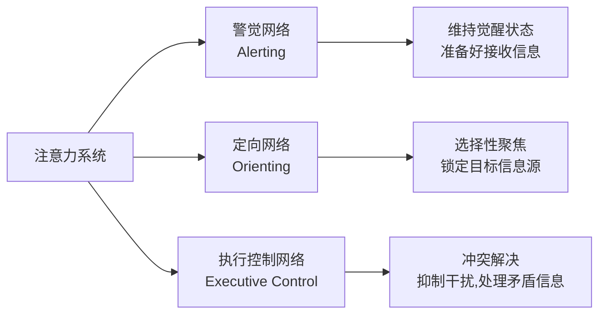
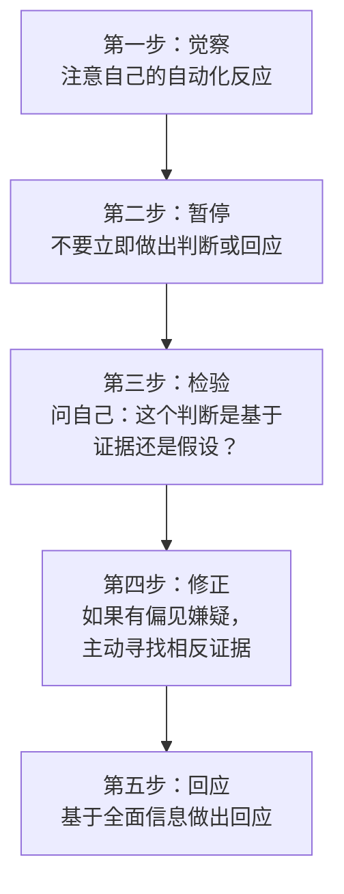
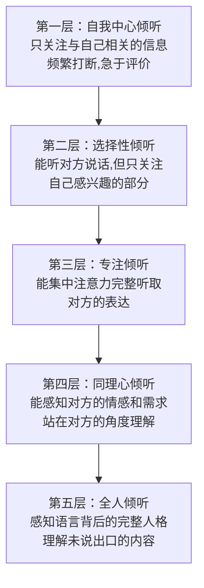
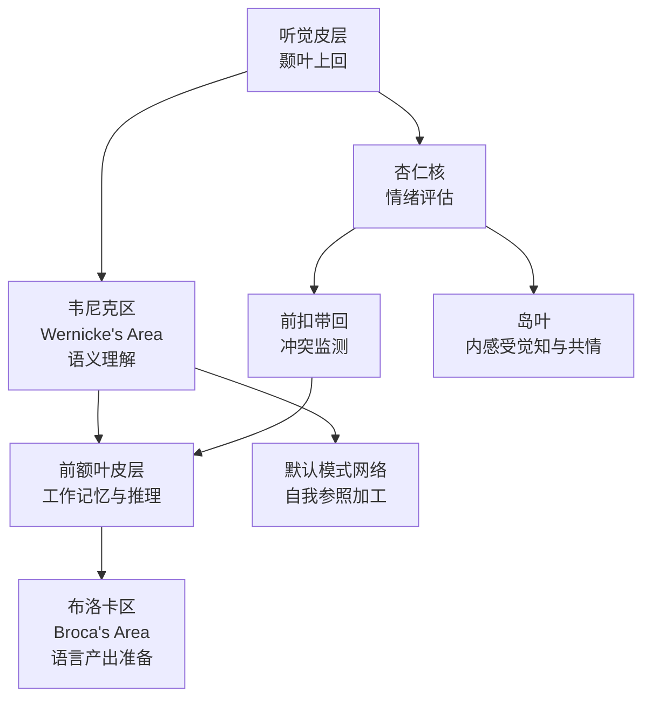
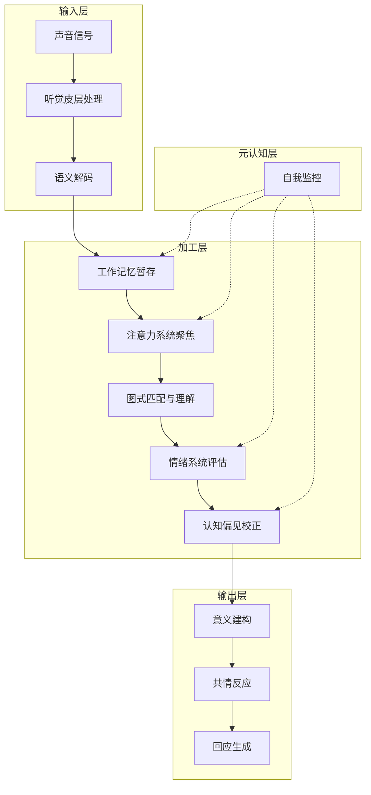

## 三、倾听的心理学基础

倾听不是一种简单的"听到声音"的生理行为，而是一系列复杂心理过程的协同运作。从声音波传入耳蜗，到大脑皮层完成语义理解、情感共鸣和意义建构，整个过程涉及工作记忆、注意力系统、情绪调节、认知偏见校正、社会认知等多个心理学模块。理解这些底层机制，不是为了变成心理学家，而是为了在倾听时能"看见"自己的思维过程——当你知道陷阱在哪里，才能有意识地绕开它。

本节从七个维度拆解倾听的心理学基础：认知加工系统、注意力机制、认知偏见、情绪系统、自我中心倾向、社会认知能力、以及双加工思维模式。每个维度都包含理论原理、对倾听的具体影响、常见误区和实操校正方法。

### 3.1 认知加工系统与倾听

#### 3.1.1 工作记忆：倾听的"临时工作台"

工作记忆（Working Memory）是人类信息加工系统的核心组件。1974年，Baddeley和Hitch提出了经典的工作记忆模型，后经Baddeley于2000年修订，包含四个子系统：

**工作记忆的核心特性及其对倾听的影响：**

| 特性 | 科学数据 | 对倾听的影响 | 应对策略 |
|------|----------|-------------|---------|
| 容量有限 | Miller (1956): 7±2个信息块；Cowan (2001): 4±1个信息块 | 对方连续表达超过4个要点时，后面的信息极易丢失 | 每听3-4个要点就做一次内部总结 |
| 持续时间短 | 不经复述的信息在15-30秒内衰退（Peterson & Peterson, 1959） | 如果不主动加工，刚听完的内容很快模糊 | 即时复述关键词或做简要笔记 |
| 易受干扰 | 任何分心刺激占用加工资源 | 手机通知、环境噪音、自己的思绪都在"抢"工作记忆容量 | 主动消除干扰源 |
| 编码方式 | 以语音编码为主（Conrad, 1964） | 听到的信息主要以"声音形式"暂存，语义加工需要额外认知资源 | 用"意义"而非"原话"来记忆 |

**语音环路在倾听中的核心作用：** 当你听到对方说话时，语音环路负责暂时存储语音信息，并通过"内部复述"维持这些信息不衰退。如果对方语速过快、信息密度过高，语音环路就会"过载"——这就像往一个容量有限的杯子里倒水，水溢出来就浪费了。这就是为什么在重要对话中，适当控制信息流速（说话者的责任）和主动做笔记（倾听者的责任）同等重要。

**情景缓冲器的整合功能：** 情景缓冲器负责将来自不同"通道"的信息整合成连贯的场景。在倾听中，它帮助你把对方的语言内容、语调情绪、面部表情、肢体动作整合成一个完整的理解。如果你只关注文字内容而忽略非语言信号，情景缓冲器得到的素材就不完整，理解自然会打折扣。

#### 3.1.2 认知负荷理论：倾听的"带宽管理"

Sweller (1988) 提出的认知负荷理论（Cognitive Load Theory）原本用于教学设计，但其原理完全适用于倾听：

- **内在认知负荷**（Intrinsic Load）：由信息本身的复杂度决定。对方在讨论一个你完全陌生的专业领域时，内在负荷极高。
- **外在认知负荷**（Extraneous Load）：由信息呈现方式造成。对方逻辑混乱、表述冗余、跳跃性表达，都会增加外在负荷。
- **关联认知负荷**（Germane Load）：用于构建理解和形成图式的认知资源。这是"有效"的负荷——你把信息整合进自己的知识体系的过程。

**倾听者的带宽公式：** 总认知容量 = 内在负荷 + 外在负荷 + 关联认知负荷。当前两者耗尽了你的带宽，你就没有剩余资源去做深度理解（关联负荷）。这就是为什么面对一个逻辑混乱的演讲者，即使内容很重要，你也很难听进去——不是你不想听，是你的认知带宽被"浪费"在了处理混乱的表达方式上。

**实操策略——主动降低认知负荷：**

1. **降低外在负荷**：如果对方表达混乱，用提问帮助结构化——"你说的第一个点是X，第二个点是Y，对吗？"
2. **管理内在负荷**：遇到陌生领域，先请求建立基本框架——"在你展开细节之前，能先给我一个整体的画面吗？"
3. **最大化关联负荷**：在理解的基础上，主动与已有知识关联——"这个跟我之前了解的X有什么联系？"

#### 3.1.3 图式理论：倾听的"知识框架"

图式（Schema）是存储在长时记忆中的知识结构，它决定了你如何解读新信息。Bartlett (1932) 最早提出这一概念，后来被Rumelhart (1980) 等人进一步发展。

**图式如何影响倾听：**

- **自上而下加工**（Top-Down Processing）：你用已有的知识框架来"预测"和"补全"对方的话。如果对方说"我去医院……"，你的"医院"图式会自动激活，你可能自动假设对方是去看病，但实际可能是去探望朋友。
- **图式激活的双面性**：正确的图式帮助你快速理解（听到"航班延误"你的旅行图式自动提供背景知识），错误的图式导致误解（你对某个群体的刻板印象图式被激活，影响了你的客观判断）。
- **图式不一致时的处理**：当对方说的内容与你的图式冲突时，你有两个选择——修正图式或拒绝信息。好的倾听者选择前者，差的倾听者选择后者。

**实操建议：** 在倾听时，有意识地觉察自己的图式被激活的时刻。当你发现自己在"自动补全"对方的话时，暂停一下，问自己："我是在听他说的，还是在听我以为他会说的？"

### 3.2 注意力系统与倾听

#### 3.2.1 注意力的三个子系统

根据Posner和Petersen (1990)的注意力网络理论，注意力包含三个功能独立的子系统：

**各子系统在倾听中的作用：**

**警觉网络**负责维持"准备倾听"的状态。当你疲劳、困倦或处于低能量状态时，警觉网络效率下降，你会发现自己"听着听着就走神了"。这不是态度问题，而是神经生理状态的直接表现。咖啡因能短期提升警觉性（Adan et al., 2012），但最好的策略是保证充足睡眠和在精力高峰期安排重要对话。

**定向网络**负责将注意力"对准"信息源。在嘈杂环境中，定向网络帮助你锁定说话者的声音（这就是"鸡尾酒会效应"的神经基础——Cherry, 1953）。但定向网络也容易被"劫持"——突然的响声、手机亮屏、有人走过，都会触发定向反射，将你的注意力从说话者身上拉走。

**执行控制网络**是最高级的注意力子系统，负责在冲突情境下做出选择。当对方说的内容与你的观点矛盾时，执行控制网络需要抑制你的反驳冲动，维持倾听状态。这是最消耗认知资源的子系统，也是"刻意倾听"的神经基础。

#### 3.2.2 注意力的持续时间与恢复

**注意力的自然节律：**

研究显示，成年人在听讲时的注意力呈现周期性波动（Wilson & Korn, 2007）：

- **初始期**（0-5分钟）：注意力高度集中，信息编码效率最高
- **稳定期**（5-15分钟）：注意力维持在较高水平
- **衰退期**（15-20分钟）：注意力开始波动，走神频率增加
- **低谷期**（20分钟以后）：如不主动干预，注意力大幅下降

这并不意味着20分钟后就"听不进去了"，而是需要主动的"注意力复位"。有效的方法包括：

1. **主动总结**：在心里或笔记上快速梳理刚听到的要点
2. **提出问题**：向对方提一个澄清性问题，激活参与感
3. **变换姿势**：轻微的身体活动能唤醒警觉网络
4. **短暂分心**：允许自己几秒钟的"注意力休息"，然后重新聚焦

#### 3.2.3 注意力残留效应

Leroy (2009) 的研究揭示了一个重要现象——**注意力残留**（Attention Residue）：当你从任务A切换到任务B时，你的注意力不会完全转移，一部分仍"残留"在任务A上。

**对倾听的直接影响：** 如果你在接电话前正在处理一封紧急邮件，通话的前几分钟你的注意力实际上还在那封邮件上。这就是为什么"好的倾听从开始之前就开始了"——你需要一个"过渡缓冲"，在进入重要对话前给自己1-2分钟清空注意力残留。

**实操方法——注意力过渡仪式：**

1. 在重要对话开始前，花60秒做以下准备：
   - 关闭或翻转手机
   - 关闭电脑屏幕上无关的窗口
   - 做3次深呼吸（激活副交感神经，降低焦虑）
   - 默念一句意图设定："接下来的X分钟，我将全心倾听对方"
2. 这个仪式不是"矫情"，而是神经科学支持的注意力切换策略

### 3.3 认知偏见与倾听

认知偏见是大脑在进化过程中形成的"快速判断"捷径。这些捷径在远古环境中帮助我们快速识别危险、做出生存决策，但在现代复杂沟通中，它们往往导致系统性的判断错误。

#### 3.3.1 影响倾听的核心认知偏见

| 偏见名称 | 定义 | 在倾听中的表现 | 识别信号 | 校正方法 |
|---------|------|--------------|---------|---------|
| 确认偏见 Confirmation Bias | 倾向于寻找、解释和记住支持已有信念的信息 | 只听到支持自己观点的部分，忽略或贬低相反信息 | "他说的正好证明了我的想法" | 刻意寻找对方论点中与你观点不一致的部分 |
| 投射偏见 Projection Bias | 假设他人与自己有相同的想法、感受和偏好 | "如果我是他，我肯定不会在意这件事" | "这有什么好生气的？" | 用提问代替假设："这件事对你来说意味着什么？" |
| 首因效应 Primacy Effect | 第一印象对后续判断产生持续影响 | 第一次觉得某人不专业，后续一直低估其发言价值 | "他上次就说错了" | 有意识地将"这个人"和"他说的内容"分开评估 |
| 光环效应 Halo Effect | 对某人的整体印象影响对其具体能力的判断 | 因为某人在某领域成功，就认为他说什么都对 | "他可是专家，肯定没错" | 对所有观点保持同等标准的批判性评估 |
| 负面偏见 Negativity Bias | 对负面信息的敏感度高于正面信息（约3-5倍） | 过度关注对方话语中的消极内容，忽略积极部分 | 只记得批评，忘了表扬 | 有意识地寻找并标记正面信息 |
| 框架效应 Framing Effect | 同一信息的不同表述方式导致不同判断 | "成功率80%"和"失败率20%"让你产生不同反应 | 对同一事实因措辞不同而反应不同 | 将信息转化为中性表述后再评估 |
| 可得性偏见 Availability Bias | 用容易想到的案例来评估事件概率 | 因为最近听了一个失败案例，就觉得某方案风险很大 | "我上次见过一个人这样做就失败了" | 寻求系统性数据，而非依赖个别案例 |
| 锚定效应 Anchoring Effect | 过度依赖最先接收到的信息做判断 | 对方先报了一个很高的价格，后续谈判围绕这个锚点展开 | "第一次他说的是X，所以Y已经不错了" | 有意识地重新设定参照点 |

#### 3.3.2 偏见的觉察与校正流程

识别偏见只是第一步，更重要的是建立一套校正流程。以下是基于认知行为疗法（CBT）原理的"偏见觉察四步法"：

**实操练习——偏见日记：**

在每天的重要对话后，花2分钟回顾：
1. 我对这个人有没有先入为主的判断？
2. 我有没有只关注了支持我观点的信息？
3. 我有没有因为对方的某个特征（外貌、职位、口音）而影响了对其内容的评估？
4. 如果换一个人说同样的话，我的反应会不同吗？

坚持记录一周，你会对自己的偏见模式有清晰的认识。

#### 3.3.3 群体偏见与倾听

除了个人层面的认知偏见，群体层面的社会偏见同样深刻影响倾听质量：

- **内群体偏见**（Ingroup Bias）：你更容易信任和认真倾听来自"自己群体"的人（同事vs外人、同乡vs外地人、同行业vs跨行业）。这导致你在面对"圈外人"时，不自觉地降低了倾听投入。
- **权威偏见**（Authority Bias）：来自权威人士的信息被过度信任，来自普通人的信息被低估。在倾听中，这可能让你对领导的话过度认真，对下属的话敷衍了事。
- **群体极化**（Group Polarization）：在群体讨论中，你可能因为从众压力而放弃自己的倾听判断——当大多数人表示赞同某观点时，你也会倾向于"听到"支持该观点的论据。

**校正策略：** 在重要决策讨论中，采用"盲听"思维实验——假设你不知道说话者的身份、地位、与你的关系，你还会对这段话有同样的反应吗？

### 3.4 情绪系统与倾听

#### 3.4.1 情绪对认知加工的影响机制

情绪不是倾听的"背景音乐"，而是直接影响认知加工质量的核心变量。根据Damasio (1994) 的躯体标记假说（Somatic Marker Hypothesis），情绪为认知过程提供"标记"，帮助我们快速评估信息的重要性。但这种标记机制也容易"失准"。

**不同情绪状态对倾听能力的具体影响：**

| 情绪状态 | 对注意力的影响 | 对记忆的影响 | 对理解的影响 | 对回应的影响 | 恢复策略 |
|---------|-------------|------------|------------|------------|---------|
| 愤怒 | 注意力窄化，聚焦于"威胁源" | 选择性记住攻击性内容 | 倾向于将中性信息解读为敌意 | 反应性增强，倾向于攻击性回应 | 暂停对话，物理离开，做高强度运动释放肾上腺素 |
| 焦虑 | 注意力分散，过度扫描环境 | 工作记忆容量被焦虑思绪占用 | 过度解读负面信号 | 回避或过度防御 | 深呼吸（4-7-8法则），接地技术（5-4-3-2-1感官法） |
| 悲伤 | 注意力内转，关注自身感受 | 偏好回忆消极记忆 | 认知灵活性下降，难以接受新视角 | 回应消极，倾向同意悲观表述 | 允许情绪存在但设定边界，如"我注意到我现在很悲伤，但我仍然可以认真听你说" |
| 兴奋/开心 | 注意力发散，易跳转话题 | 高估正面信息的重要性 | 低估风险和困难 | 急于分享自己的想法 | 提醒自己"对方还在说"，用笔记锚定注意力 |
| 厌恶 | 强烈回避倾向 | 对引发厌恶的信息记忆深刻 | 抵触对方的核心论点 | 冷淡或敷衍 | 将"人"和"观点"分离，专注于信息本身 |
| 恐惧 | 注意力过度集中于不确定因素 | 灾难化记忆倾向 | 将可能性误读为必然性 | 逃避或僵化反应 | 评估实际风险概率，区分"可能"和"很可能" |

#### 3.4.2 情绪传染：倾听中的"情绪同步"

Hatfield, Cacioppo和Rapson (1993) 的研究表明，人类有一种自动的、无意识的情绪传染机制——当你看到对方的表情、听到对方的语调时，你的情绪状态会自动向对方靠拢。这种机制的神经基础是**镜像神经元系统**（Mirror Neuron System，Rizzolatti & Craighero, 2004），它让你在观察他人行为时，自己的大脑中对应的运动和情感区域也会激活。

**情绪传染在倾听中的双重作用：**

**正面作用——共情的基础：** 适度的情绪传染是同理心的神经基础。当朋友向你倾诉痛苦时，你感受到的那丝难过正是你能够"理解"他的基础。没有情绪传染，倾听就变成了冷冰冰的信息处理。

**负面作用——情绪劫持：** 当对方情绪过于强烈时，你可能被"情绪劫持"——你的情绪被对方完全控制，失去了客观判断能力。这在以下场景特别危险：
- 对方极度愤怒时，你也变得愤怒，对话升级为争吵
- 对方极度焦虑时，你也开始焦虑，无法提供冷静的分析
- 对方极度悲伤时，你也被悲伤淹没，无法提供理性支持

**情绪传染的觉察与管理——"温度计技术"：**

在倾听过程中，定期"扫描"自己的情绪温度：
1. **0-3分**（冷静区）：你的情绪稳定，能客观倾听——理想状态
2. **4-6分**（升温区）：你开始感受到对方情绪的感染——需要觉察
3. **7-8分**（预警区）：你的情绪开始影响判断——需要主动调节
4. **9-10分**（失控区）：你已经被情绪劫持——应当暂停对话

**调节方法：** 当温度计达到6分以上时，使用"锚定技术"——双脚踩实地面，感受身体与椅子的接触，注意自己的呼吸。这种"回到身体"的方法能快速降低情绪强度（基于正念减压疗法MBSR的原理，Kabat-Zinn, 1990）。

#### 3.4.3 情绪粒度：区分情绪的能力

Barrett (2017) 提出的**情绪粒度**（Emotional Granularity）概念对倾听有深远意义。情绪粒度是指你精确识别和区分不同情绪的能力——你能区分"失望"和"沮丧"吗？能区分"焦虑"和"恐惧"吗？

**高情绪粒度的倾听者**能精确识别对方的情绪状态，做出精准回应：
- 对方说"我觉得很失望"——你回应"你对这个结果感到失望，是因为它没有达到你的预期吗？"
- 对方说"我很焦虑"——你回应"你是在担心未来会发生什么具体的事情吗？"

**低情绪粒度的倾听者**只能识别模糊的"好坏"，回应笼统：
- 对方说"我觉得很失望"——你回应"别难过了"
- 对方说"我很焦虑"——你回应"没什么好担心的"

**提升情绪粒度的方法：**
1. 学习更丰富的情绪词汇（不只是"开心/难过/生气"）
2. 练习精确标注自己的情绪状态
3. 在倾听时，尝试为对方的情绪"命名"——"你现在的感觉，更像是失望、沮丧、还是委屈？"

### 3.5 自我中心倾向与倾听

#### 3.5.1 发展心理学视角：自我中心的认知根源

Piaget (1926) 最早提出"自我中心"（Egocentrism）概念——儿童天然地从自己的视角看世界，难以理解他人有不同的观点和感受。虽然成年人在认知上具备了"去中心化"的能力，但在压力、疲劳或情绪激动时，我们常常"退化"到自我中心状态。

**自我中心在倾听中的五种典型表现：**

**1. 抢话冲动（Response Preparation）**
大脑在对方还在说话时就已经开始准备自己的回应——这不是你在故意不尊重对方，而是大脑的语言产出系统在听到输入信号时自动启动了（Levelt, 1989）。问题在于，当你专注于准备回应时，你用于加工对方剩余话语的认知资源就减少了。

**2. 经验投射（Experiential Projection）**
"我经历过类似的事，我懂你的感受。"——但你真的懂吗？每个人的体验都是由独特的个人历史、性格特质、当下处境共同塑造的。你的"类似经历"可能让你产生虚假的理解感，反而阻碍了你去真正了解对方的独特体验。

**3. 评价冲动（Evaluative Listening）**
对方话还没说完，你心里已经在做判断："这个想法不行"、"他说得不对"、"这也太离谱了"。评价冲动让倾听变成了"审判"——你不是在理解对方，而是在给对方打分。

**4. 建议冲动（Fix-It Reflex）**
对方一说出问题，你大脑里的"解决方案搜索器"就自动启动了。但在你急着给建议之前，有没有想过：对方需要的是解决方案，还是被理解的感觉？研究表明，过早给建议会让倾诉者觉得自己"被教育"而非"被理解"（Rogers, 1951）。

**5. 联想跳跃（Associative Hijacking）**
对方说的某个关键词触发了你的个人联想，你的思绪就"跳"到了自己的经历上。"你说到旅行，我想起我上次去……"——注意，这时你已经不是在倾听对方了，而是在等待对方说完好讲自己的故事。

#### 3.5.2 从自我中心到同理心：倾听的进阶路径

Rogers (1975) 在《论人的成长》中描述了从自我中心到同理心的发展路径，可以视为倾听能力的进阶阶梯：

**每一层的特征和进阶方法：**

| 层级 | 核心特征 | 典型表现 | 进阶练习 |
|------|---------|---------|---------|
| 第一层 | 自我中心 | "你说的让我想起我自己……" | 每次对话前设定意图："这次我要听完再说话" |
| 第二层 | 选择性 | 只听自己感兴趣的部分 | 练习在不感兴趣的话题上维持注意力3分钟 |
| 第三层 | 专注 | 能完整听完并复述 | 练习听完后用自己的话总结对方的要点 |
| 第四层 | 同理心 | 能感知对方的情感需求 | 练习在回应前先标注对方的情绪 |
| 第五层 | 全人 | 感知语言之外的信息 | 练习觉察对方的停顿、犹豫、言外之意 |

### 3.6 社会认知与倾听

#### 3.6.1 心智理论：理解"他人心智"的能力

心智理论（Theory of Mind, Premack & Woodruff, 1978）是指理解他人具有独立于自己的信念、意图、欲望和知识的能力。这是高级倾听的认知基础——你不仅要听到对方说了什么，还要推测对方为什么这样说、想达到什么目的、还有什么没说出来。

**心智理论在倾听中的三个层次：**

1. **一级心智**：我知道你知道X——"他告诉我这个信息，是因为他觉得我不知道"
2. **二级心智**：我知道你知道我知道X——"他知道我已经了解这个情况，他重提此事可能是为了强调重要性"
3. **三级心智**：嵌套更深的社会推理——"他当着老板的面提起这件事，可能是想借老板的权威来支持自己的观点"

**心智理论缺陷对倾听的影响：**
- 自闭症谱系个体在心智理论方面存在困难，导致他们在倾听时难以推断对方的隐含意图（Baron-Cohen et al., 1985）
- 普通人在疲劳或认知负荷过高时，心智理论能力也会下降——这就是为什么你疲惫时更容易误解别人

#### 3.6.2 归因理论：如何解读对方的行为和言语

Heider (1958) 和后来的Weiner (1985) 提出的归因理论揭示了人们如何解释行为的原因。在倾听中，你对对方言语的"归因"直接影响你的倾听态度：

- **内部归因**（归因于人的特质）："他说这话是因为他就是个消极的人"——导致你不认真对待他的内容
- **外部归因**（归因于环境因素）："他说这话是因为他最近确实遇到了很大的压力"——促使你更加理解和关注

**基本归因错误**（Ross, 1977）：人们倾向于对他人的行为做内部归因（是这个人的特质），对自己的行为做外部归因（是环境造成的）。在倾听中，这意味着你更容易"怪罪"说话者而不是理解他们的处境。

**校正方法：** 当你发现自己在对对方做负面归因时，强迫自己想至少两个外部原因——"他可能是因为……才这样说的"。

#### 3.6.3 镜像神经元与共情倾听

1996年，Rizzolatti等人在猕猴大脑中发现了镜像神经元——当猴子观察另一个个体执行某个动作时，其大脑中与执行该动作相同的神经元也会放电。后续研究表明，人类拥有更复杂的镜像神经元系统，它不仅对动作"镜像"，也对情绪和意图"镜像"。

**镜像神经元是共情倾听的神经基础：** 当你看到对方面露痛苦表情时，你大脑中与痛苦相关的区域也会部分激活——这就是"感同身受"的生物学机制。Gallese (2003) 将这种机制称为"具身模拟"（Embodied Simulation）——你在用自己的身体来"模拟"对方的体验。

**镜像神经元的工作条件：**
- 需要面对面互动（视频优于电话，电话优于文字）
- 需要你主动关注对方的非语言信号
- 镜像精度随熟悉度提高——你越了解一个人，你的"镜像"越准确
- 压力和焦虑会抑制镜像神经元的功能——紧张的倾听者共情能力下降

### 3.7 双加工理论与倾听

#### 3.7.1 系统1与系统2：两种思维模式

Kahneman (2011) 在《思考，快与慢》中提出了影响深远的双加工理论：

| 特征 | 系统1（快思考） | 系统2（慢思考） |
|------|---------------|---------------|
| 速度 | 自动、快速 | 刻意、缓慢 |
| 努力程度 | 几乎不费力 | 需要认知努力 |
| 意识程度 | 无意识或前意识 | 有意识 |
| 容量 | 并行处理 | 串行处理 |
| 在倾听中的表现 | 自动理解熟悉语言、直觉判断对方情绪 | 仔细分析复杂论点、评估证据质量 |
| 可靠性 | 对常规情况高效，对复杂情况易出错 | 更准确但更消耗资源 |

**系统1在倾听中的常见"陷阱"：**

1. **自动补全**：对方话说到一半，系统1就根据上下文"预测"了结论，你可能因此错过对方真正想说的转折——"但是……"后面的内容往往才是重点
2. **刻板印象激活**：看到对方的外貌、穿着、年龄，系统1自动调用刻板印象来"预判"对方会说什么
3. **情感启发式**：用"我对这个人的感觉"来判断"他说的话是否有价值"——喜欢这个人就认真听，不喜欢就敷衍
4. **流畅性偏见**：对方表达流利就认为内容可靠，表达磕巴就认为内容不可靠——实际上，表达能力和内容质量是两回事

**激活系统2的实操方法：**

当你意识到系统1在主导你的倾听时，可以用以下方法"切换"到系统2：
1. **暂停3秒**：在对方说完后，不要立即回应，给自己3秒时间——这3秒足以让系统2介入
2. **要求证据**：在心里问"他说的有什么证据支持？"——这个问题强制激活系统2的分析功能
3. **写下来**：把对方的核心论点写下来——书写本身就是一种系统2活动
4. **反向思考**：问自己"如果相反的观点是对的呢？"——这能打破系统1的自动化

#### 3.7.2 元认知：思考"自己在如何思考"

元认知（Metacognition, Flavell, 1979）是最高级的认知能力——你不仅在思考，而且知道自己在如何思考。在倾听中，元认知让你能够"跳出"倾听过程，观察自己的倾听状态。

**元认知在倾听中的应用——实时自我监控：**

在重要对话中，定期（每3-5分钟）在内心做一次快速"元认知检查"：
- "我现在是在真正理解对方，还是在准备反驳？"
- "我的注意力是在对方身上，还是在飘到别处？"
- "我有没有因为对这个人的感觉而影响了我对内容的判断？"
- "对方的情绪是否在影响我的判断？"

这种实时监控不需要打断对话，可以在对方说话的间隙快速完成。初学者可能觉得这很"分裂"，但熟练后会变成自动化的习惯。

### 3.8 神经科学视角：倾听时大脑在做什么

#### 3.8.1 倾听的神经通路

fMRI研究揭示了倾听涉及的大脑区域网络：

**关键发现：**
- **左半球优势**：语言理解主要依赖左半球的韦尼克区和颞叶区域
- **右半球贡献**：语调、韵律、隐喻和幽默的理解主要依赖右半球（Beeman & Chiarello, 1998）
- **前额叶的关键作用**：前额叶皮层负责维持注意力、抑制冲动、整合信息——它是"高级倾听"的神经指挥中心
- **默认模式网络的竞争**：当默认模式网络（与自我参照、走神相关）过度活跃时，倾听质量下降——这就是走神的神经机制

#### 3.8.2 神经可塑性：倾听能力可以训练

神经科学研究表明，大脑具有终身可塑性（Neuroplasticity, Pascual-Leone et al., 2005）。这意味着倾听能力不是固定不变的——通过有针对性的训练，你可以增强与倾听相关的神经通路。

**支持倾听能力提升的神经可塑性证据：**
- 冥想练习者的大脑前额叶皮层更厚，注意力控制能力更强（Lazar et al., 2005）
- 同理心训练可以增强岛叶和前扣带回的活动（Klimecki et al., 2013）
- 语言专家在处理语义信息时，韦尼克区的激活效率更高

**基于神经科学的倾听训练建议：**
1. **正念冥想**：每天10分钟，训练注意力的稳定性和灵活性
2. **同理心冥想**（Loving-Kindness Meditation）：增强情感共鸣的神经回路
3. **复述练习**：听完一段话后复述，强化工作记忆和语义加工通路
4. **情绪标注练习**：精确命名自己的情绪，增强情绪粒度

### 3.9 心理学基础的综合模型

将以上七个维度整合为一个完整的"倾听心理模型"：

**模型的核心洞见：**

倾听是一个多系统协同工作的过程，任何一个环节出现问题都会影响最终的理解质量：
- 工作记忆过载 → 信息丢失
- 注意力不足 → 遗漏关键信息
- 图式错误 → 误解
- 情绪干扰 → 判断失准
- 认知偏见 → 选择性接收
- 元认知缺失 → 无法自我校正

### 3.10 常见误区与纠正

**误区一："倾听是天生的能力，不需要学"**
真相：倾听能力存在显著的个体差异，且与训练高度相关。多项研究表明，经过系统训练的倾听者，其理解准确率和共情反应质量显著高于未训练者（Weger et al., 2014）。

**误区二："只要集中注意力就能听好"**
真相：注意力只是倾听的一个维度。即使你全神贯注，认知偏见、情绪干扰、图式错误仍然可能导致理解偏差。高效倾听需要注意力、元认知、情绪调节、偏见觉察的协同运作。

**误区三："同理心就是同意对方"**
真相：同理心是理解对方的感受和立场，不等于同意对方的观点。你可以在完全理解对方的同时持有不同意见——"我理解你为什么这样想，但我有另一个看法"就是同理心与独立思考的结合。

**误区四："记笔记会分散注意力"**
真相：研究表明，适当的手写笔记反而能提升理解质量（Mueller & Oppenheimer, 2014），因为书写过程本身是一种深度加工。关键是记"关键词和关系"，而非逐字记录。

**误区五："好倾听者就是不说话"**
真相：被动沉默不是好倾听。积极倾听需要适时的反馈——总结、提问、确认、情感回应。沉默可以是尊重，也可以是敷衍，区别在于你的思维是否在积极参与。

### 3.11 自我评估：你的倾听心理状态

用以下清单评估自己在每个心理维度上的状态，1分（很少如此）到5分（总是如此）：

**工作记忆管理：**
- [ ] 我会在对话中定期总结对方的要点（___/5）
- [ ] 当信息量大时，我会做笔记辅助记忆（___/5）

**注意力管理：**
- [ ] 重要对话前，我会清除干扰源（___/5）
- [ ] 我能在长对话中维持注意力，走神后能快速回来（___/5）

**偏见觉察：**
- [ ] 我会检查自己是否在选择性地听（___/5）
- [ ] 对不喜欢的人，我也能公正评估其观点（___/5）

**情绪管理：**
- [ ] 我能区分对方的情绪和自己的情绪（___/5）
- [ ] 情绪激动时，我能暂停而非立即反应（___/5）

**自我中心控制：**
- [ ] 我能在对方说完前克制自己的表达冲动（___/5）
- [ ] 我会先理解对方的需求，再决定是否给建议（___/5）

**社会认知：**
- [ ] 我能感知对方话语背后的意图和需求（___/5）
- [ ] 我能觉察对方未说出口的内容（___/5）

**元认知能力：**
- [ ] 我能在对话中观察自己的倾听状态（___/5）
- [ ] 我能意识到自己的认知偏见何时在起作用（___/5）

**评分解读：**
- **28-35分**：倾听心理基础扎实，继续保持并精进
- **21-27分**：基础良好，有明确的提升空间
- **14-20分**：需要系统性地训练薄弱环节
- **7-13分**：建议从基本的注意力管理和工作记忆训练开始
