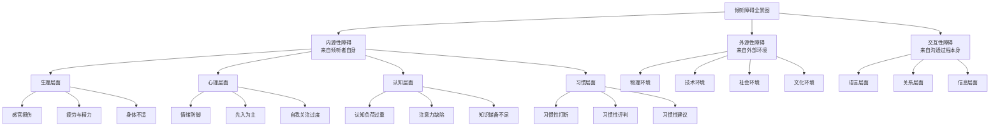
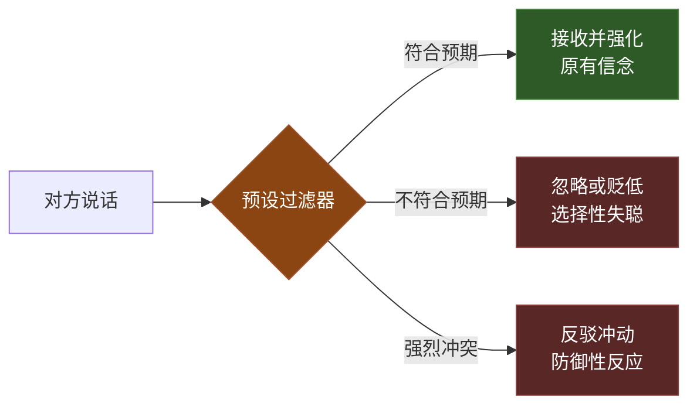
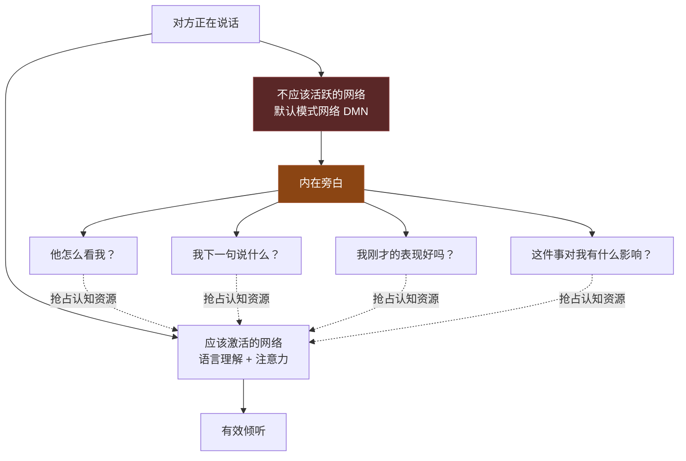
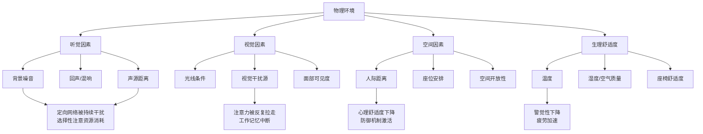
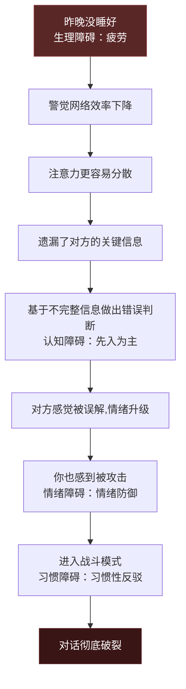
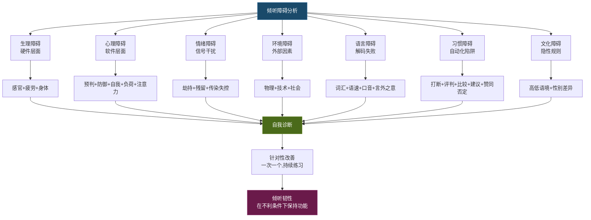

## 四、倾听障碍分析

上一节我们拆解了倾听的心理学底层机制——工作记忆、注意力系统、认知偏见、情绪系统、自我中心倾向、社会认知和双加工思维。知道了"机器是怎么运转的"，现在我们要回答一个更实际的问题：**这台机器在哪些环节会出故障？**

倾听障碍不是随机发生的"意外"，而是有规律可循的"系统故障"。每一种障碍都能追溯到某个具体的认知或生理环节出了问题。本节的目标是帮你建立一套完整的"故障诊断图谱"——当你在倾听中遇到困难时，能快速定位问题出在哪个环节，然后对症下药。

### 4.1 倾听障碍的全景分类框架

倾听障碍可以从两个维度进行分类：**来源维度**（障碍从哪里来）和**机制维度**（障碍如何影响倾听过程）。



**与上一节心理学基础的对应关系：** 每一种障碍都不是凭空出现的，而是某个心理机制"失灵"的具体表现。下表展示了这种映射关系：

| 障碍类型 | 对应的心理机制 | 失灵表现 |
|---------|-------------|---------|
| 认知负荷过重 | 工作记忆容量有限（Miller, 1956） | 信息超过4±1个信息块时开始丢失 |
| 注意力分散 | 注意力的定向网络被"劫持" | 环境刺激抢占了选择性注意资源 |
| 先入为主 | 确认偏见 + 图式自上而下加工 | 用已有框架"过滤"新信息 |
| 情绪防御 | 杏仁核劫持前额叶控制 | 战斗-逃跑反应取代倾听模式 |
| 习惯性打断 | 系统1的语言产出自动启动 | Levelt (1989) 的回应准备机制 |
| 评价冲动 | 系统1的快速判断捷径 | 双加工理论中的快思考主导 |

理解这种对应关系非常重要——它意味着**克服障碍的本质是修复或绕过特定的心理机制故障**。

### 4.2 生理障碍：倾听的"硬件故障"

生理障碍是最容易被忽视、但影响最直接的一类障碍。如果说心理机制是倾听的"软件"，那么生理状态就是"硬件"——软件再好，硬件出了问题也跑不动。

#### 4.2.1 感官功能损伤

**听力损伤的分级与影响：**

听力损伤不仅仅是"听不清"，它对倾听的影响是全方位的：

| 损伤程度 | 听力阈值 | 对倾听的具体影响 | 常见场景 |
|---------|---------|----------------|---------|
| 轻度损伤 | 26-40 dB | 在噪音环境中理解困难，容易遗漏辅音（如s、f、th） | 老年人在餐厅聊天时频繁要求对方重复 |
| 中度损伤 | 41-60 dB | 正常音量对话需要对方重复，电话沟通困难 | 长期暴露于高噪音环境的工人 |
| 重度损伤 | 61-80 dB | 只能听到大声说话，大部分日常对话无法完整接收 | 未佩戴助听设备的听力障碍者 |
| 极重度损伤 | >80 dB | 依赖唇语、手语或文字辅助 | 需要综合沟通辅助方案 |

**容易被忽视的听力问题：**

- **高频听力下降**：这是最常见的早期听力问题，尤其在长期使用耳机的人群中。高频听力下降导致你"听得见声音但听不清内容"——因为汉语中的声母（如z、c、s、zh、ch、sh）主要分布在高频区域。你可能以为是对方"说话不清楚"，实际上是你的高频听力在退化。
- **听觉处理障碍**（Auditory Processing Disorder）：听力测试正常，但大脑处理声音信号的能力受损。表现为"听得见但听不懂"，尤其在嘈杂环境中。这不是耳朵的问题，而是听觉神经通路的问题。
- **耳鸣干扰**：持续的耳鸣（嗡嗡声、嘶嘶声）会占用工作记忆容量，降低倾听的信息处理带宽。耳鸣患者在安静环境中倾听时反而更困难，因为没有外部声音来"掩盖"耳鸣。

**实操建议：** 如果你经常出现"听不清"、"需要对方重复"、"在嘈杂环境中理解困难"等情况，建议到正规医院耳鼻喉科做一次纯音测听和言语识别率测试。早期发现、早期干预（助听器、听觉训练）能显著改善倾听质量。

#### 4.2.2 疲劳与精力管理

疲劳对倾听的影响不是线性下降，而是阶梯式恶化。根据Warm, Parasuraman和Matthews (2008) 对警觉性衰退（Vigilance Decrement）的研究：


**注意：** 上图的百分比是近似值，用于说明趋势。实际衰减速度受个体差异、任务复杂度、睡眠质量等多种因素影响。

**疲劳对倾听各环节的具体影响：**

| 倾听环节 | 疲劳时的表现 | 神经机制 |
|---------|------------|---------|
| 警觉维持 | 听着听着就走神，眼皮沉重 | 警觉网络（Alerting Network）效率下降 |
| 选择性注意 | 难以锁定说话者的声音，容易被干扰 | 定向网络（Orienting Network）敏感度降低 |
| 工作记忆 | 听了后面忘了前面，无法跟踪复杂论证 | 前额叶皮层活动降低，语音环路容量缩小 |
| 语义理解 | 对复杂句子的理解延迟，需要对方重复 | 韦尼克区加工效率下降 |
| 情绪感知 | 对对方的情绪信号不敏感 | 镜像神经元系统活性降低 |
| 元认知监控 | 无法意识到自己在走神 | 前扣带回冲突监测功能减弱 |

**"黄金倾听时段"策略：** 每个人一天中有精力最旺盛的时段（通常是上午9-11点和下午3-5点），将最重要的沟通安排在这些时段。如果你知道下午2点会有重要的会议，午饭不要吃太饱（餐后嗜睡效应），提前15分钟做轻度活动唤醒身体。

#### 4.2.3 身体不适与疼痛

慢性疼痛或急性不适对倾听的影响被严重低估。Eccleston和Crombez (1999) 的研究指出，疼痛会持续占用注意力资源——即使你"忍着痛"试图集中注意力，疼痛信号仍在后台不断抢占认知带宽。

**实操策略：**
- **短期不适**（头痛、胃痛）：如果不是紧急沟通，坦诚告知对方"我今天身体不太舒服，能否改个时间？"比硬撑着效率低、还容易出错要好。
- **慢性不适**：在重要对话前做好疼痛管理（按医嘱服药、调整坐姿、使用热敷等）。
- **作为倾听者的觉察**：如果你注意到对方频繁变换坐姿、表情紧绷、注意力似乎不集中，除了考虑"他不认真"之外，也想想"他可能身体不舒服"——这就是归因理论中避免基本归因错误的应用。

### 4.3 心理障碍：倾听的"软件冲突"

心理障碍是所有倾听障碍中种类最多、影响最深、也最难自我识别的一类。因为心理障碍的本质是**你的心理防御机制在保护你**——它不是"故障"，而是"功能"，只不过这个功能在倾听场景中产生了副作用。

#### 4.3.1 先入为主的判断：倾听通道的"预设过滤器"

**心理机制深度解析：**

先入为主（Pre-judgment）的本质是图式理论中的**自上而下加工**在起作用。你的大脑不是一张白纸，而是带着大量的先验知识、信念和期望来处理新信息。这些先验框架就像一个"预设过滤器"——信息进来之前就已经被分类、标签化了。



**先入为主的三种来源：**

**来源一：声誉预判。** 你在见到某人之前，已经从别人那里听说了关于他的评价。这些评价像一副"有色眼镜"，从一开始就扭曲了你的接收通道。

> **场景还原：** 张三入职新公司，同事私下告诉他"李四这个人特别爱出风头，开会的时候总抢话"。于是在接下来的部门会议上，张三每次李四发言时都在寻找"抢话"的证据。但客观来看，李四可能只是正常地参与讨论，提出了一些有价值的技术建议——这些都被张三的预设过滤器自动"降级"了。

**来源二：经验预判。** 你基于自己的过往经历，对某个话题或某类人形成了固定的看法。

> **场景还原：** 一位资深程序员听到产品经理说"我们想加一个新功能"时，内心立刻涌起一股抗拒——"又要改需求，上次就是因为频繁改需求导致项目延期"。但他没有听到的是：这次产品经理说的"新功能"是基于用户调研数据提出的，有充分的优先级论证。

**来源三：身份预判。** 你基于对方的身份标签（年龄、学历、职业、外貌）对其发言质量做出预判。

> **场景还原：** 在一场技术评审会上，一位年轻的工程师提出了一个架构方案。资深架构师的第一反应是"年轻人懂什么架构"，下意识地降低了对方案的关注度。但如果这位年轻工程师在前一家公司已经主导过三个大型项目的架构设计呢？

**校正方法——"白板练习"：**

在每次重要对话开始前，花10秒钟做一个心理练习：想象你面前有一块白板，上面什么都没有。对方接下来说的每一个字，都将写在这块白板上——没有任何预设的标题、标签和评分。这不是假装没有偏见（你无法真正消除先验知识），而是**有意识地将先验判断从"自动执行"切换到"手动审查"模式**。

#### 4.3.2 情绪防御：当倾听触发了你的"警报系统"

**心理机制深度解析：**

情绪防御是大脑对感知到的"心理威胁"的自动保护反应。当对方的话语触及你的自尊、能力感、归属感或安全感时，杏仁核会在200毫秒内发出"威胁信号"——这个速度远快于前额叶皮层的理性分析（需要600-800毫秒）。结果就是：**你的情绪反应先于理性判断到达**。

这就是Damasio (1994) 躯体标记假说的现实体现——在你还没来得及"想清楚"之前，你的身体已经做出了反应：心跳加速、肌肉紧张、呼吸变浅。这些生理变化会进一步影响你的认知加工能力。

**情绪防御的五种倾听表现：**

| 防御类型 | 触发情境 | 内心独白 | 倾听行为 | 对方感受 |
|---------|---------|---------|---------|---------|
| 辩解型 | 被批评或质疑 | "这不是我的错" | 急于打断，给出解释 | "他根本没在听我说" |
| 攻击型 | 被否定或忽视 | "你凭什么这么说" | 反驳、挑刺、翻旧账 | "他在跟我吵架" |
| 退缩型 | 感到被压制或不公 | "说了也没用" | 沉默、敷衍、心不在焉 | "他完全不在乎" |
| 转移型 | 话题触及敏感区 | "赶紧换个话题" | 生硬地转移注意力 | "他在回避问题" |
| 理智化型 | 情感话题让人不适 | "我们来理性分析" | 用逻辑取代情感回应 | "他不理解我的感受" |

**校正方法——"情绪暂停三步法"：**

1. **觉察（0.5秒）**：注意到自己的身体变化——心跳加速、呼吸变浅、肌肉紧绷。这些是情绪防御启动的"早期预警信号"。
2. **标记（1秒）**：在心里对自己说"我正在感到被威胁/被攻击/被否定"。情绪标注（Affect Labeling）本身就能降低杏仁核的激活强度（Lieberman et al., 2007）。
3. **选择（2秒）**：对自己说"我现在可以选择防御，也可以选择继续倾听。我选择先听完再回应。"这个有意识的选择能激活前额叶皮层的控制功能，夺回被杏仁核"劫持"的注意力资源。

这三步加起来只需要3-4秒，但足以让你从"自动驾驶"模式切换到"手动控制"模式。

#### 4.3.3 自我关注过度：当你的"内在旁白"太大声

**心理机制深度解析：**

自我关注过度的本质是**默认模式网络**（Default Mode Network, DMN）的过度活跃。DMN是大脑在"休息"时自动激活的网络，负责自我参照加工——思考"我"、反思"我"、担忧"我"。问题是，当你在倾听对方说话时，DMN不应该高度活跃——但它经常"抢跑"。



**自我关注过度的典型场景：**

- **面试中**：满脑子想"我该怎么回答才能显得聪明"，完全没听懂面试官真正想考察的能力。
- **汇报中**：领导在给反馈，你却在想"我这个PPT做得够不够好"。
- **约会中**：对方在分享自己的故事，你却在准备"下一个有趣的话题"。
- **冲突中**：对方在表达受伤的感受，你却在组织"自卫的论据"。

**校正方法——"外聚焦练习"：**

当你的注意力向内转时，有意识地将它向外拉。具体方法：在对方说话时，注意观察对方的一个外部特征——他的手势、他眉毛的微动、他说话时头部的节奏。这种"向外看"的动作能激活定向网络（Orienting Network），抑制DMN的过度活跃。注意：这是"观察对方"而非"审视对方"——目的是将注意力锚定在外部，而非评价对方。

#### 4.3.4 认知负荷过重：信息处理带宽的"交通堵塞"

**心理机制深度解析：**

认知负荷过重是工作记忆容量限制（Cowan, 2001: 4±1个信息块）的直接后果。当对方输出的信息量、复杂度或速度超过了你的信息处理带宽时，系统就会"过载"——新信息无法被有效编码，已有的部分信息被"挤出"工作记忆。

**认知负荷过重的信号识别：**

你需要学会识别自己"即将过载"的早期信号，而不是等到完全"宕机"才意识到：

| 过载阶段 | 身体信号 | 思维信号 | 行为信号 |
|---------|---------|---------|---------|
| 轻度过载 | 无明显变化 | 开始走神，思绪偶尔飘走 | 眼神偶尔失焦 |
| 中度过载 | 眉头微皱，轻微不适感 | "他说的是什么意思？"的困惑感增加 | 开始频繁点头（假装在听） |
| 重度过载 | 头部有压力感，想揉太阳穴 | 完全跟不上，放弃理解的努力 | 目光呆滞，或开始看手机/手表 |
| 完全过载 | 头痛、烦躁 | 脑子一片空白 | 直接说"我不听了"或走开 |

**校正方法——"主动降负策略"：**

| 策略 | 具体做法 | 原理 |
|------|---------|------|
| 请求框架 | "在展开细节之前，能先给我一个整体的结构吗？" | 用框架降低内在认知负荷（Sweller, 1988） |
| 请求分段 | "你说的前两点我理解了，第三点能再说一次吗？" | 将大信息块拆分为小信息块，适配工作记忆容量 |
| 外部化 | "我记一下，你继续说" | 将部分信息从工作记忆"卸载"到外部存储（笔记） |
| 可视化 | "我画个图看看是不是你说的这个关系？" | 利用视空间画板分担语音环路的负荷 |
| 确认理解 | "我理解的是……对吗？" | 通过复述巩固已编码的信息，同时给大脑喘息时间 |

#### 4.3.5 注意力缺陷：当"聚光灯"无法聚焦

**区分"注意力不好"和"注意力障碍"：**

大多数人的注意力问题是**情境性的**——在疲劳、无聊、焦虑等特定状态下注意力下降。但有一部分人存在**特质性的**注意力困难，其中最常见的是注意缺陷多动障碍（ADHD）。

| 维度 | 情境性注意力下降 | ADHD相关的注意力困难 |
|------|--------------|-------------------|
| 持续时间 | 偶尔发生，与特定状态相关 | 长期、跨场景存在 |
| 可控性 | 通过休息、调整可以恢复 | 难以通过意志力克服 |
| 影响范围 | 特定场景下受影响 | 工作、学习、社交、生活全面受影响 |
| 典型表现 | "昨晚没睡好，今天开会走神了" | "我从小到大都无法认真听完一节课" |
| 建议 | 改善状态（睡眠、精力管理） | 建议到精神科/心理科做专业评估 |

**不论是否为ADHD，以下策略都对改善倾听中的注意力有帮助：**

1. **身体参与**：在倾听时保持适度的身体活动——坐直、微微前倾、偶尔变换姿势。身体活动能唤醒警觉网络。
2. **笔记锚定**：用笔记录关键词。手写动作本身是一种"微任务"，能防止注意力完全飘走。
3. **提问策略**：在心里不断提出与对方话语相关的问题——"他接下来会说什么？""这个数据的来源是什么？"这种主动的认知参与比被动接收更能维持注意力。
4. **环境优化**：减少视觉干扰（坐在面对墙壁而非门口的位置）、减少听觉干扰（使用降噪耳机）、减少数字干扰（手机静音并放到看不见的地方）。

#### 4.3.6 深层心理障碍：不安全依恋与信任缺失

除了上述常见的心理障碍，还有一些更深层的心理因素会影响倾听能力——它们通常与个人的成长经历和依恋模式有关。

**依恋风格对倾听的影响（Bowlby, 1969; Ainsworth, 1978）：**

| 依恋风格 | 在倾听中的表现 | 核心困难 | 改善方向 |
|---------|-------------|---------|---------|
| 安全型 | 能自在地倾听和被倾听，能接受批评也能表达不同意见 | — | 持续精进即可 |
| 焦虑型 | 过度解读对方的语气和表情，担心"对方是不是生气了" | 对关系安全性的持续不确信 | 练习"就事论事"，区分"事实"和"我的解读" |
| 回避型 | 对方表达强烈情感时感到不适，倾向于"冷处理" | 对亲密情感接触的抗拒 | 练习在情感话题上"多停留30秒" |
| 混乱型 | 在倾听中忽而过度投入忽而突然抽离 | 内心同时渴望和恐惧亲密连接 | 在安全的关系中练习稳定的倾听投入 |

**信任缺失对倾听的影响：** 当你不信任对方时，你的倾听模式会自动切换到"威胁扫描"模式——你不是在理解对方说了什么，而是在寻找对方"话里有话"的证据。这种模式在职场政治、亲子关系冲突、伴侣信任危机中尤为常见。

**校正方向：** 信任修复是一个长期过程，不是通过几个倾听技巧能解决的。但在信任尚未完全建立的情况下，你可以采用"验证性倾听"策略——先完整听完，然后用"你的意思是……对吗？"来确认你的理解，而不是基于不信任直接做出负面解读。

### 4.4 情绪障碍：倾听的"信号干扰"

情绪障碍与心理障碍有交集，但值得单独拿出来讨论，因为情绪障碍的特点是**即时性强、爆发性高、对倾听质量的破坏往往是瞬间的**。

#### 4.4.1 情绪劫持：从"我在听"到"我在战斗"

**神经机制：** 当强烈情绪被触发时，杏仁核的激活会抑制前额叶皮层的功能——这就是LeDoux (1996) 所说的"情绪劫持"（Emotional Hijacking）。在劫持状态下，你的大脑从"倾听模式"切换到了"生存模式"——你的目标不再是理解对方，而是保护自己。

**情绪劫持在倾听中的完整生命周期：**

```mermaid
graph TD
    A[触发事件<br/>对方说了某句话] --> B[杏仁核激活<br/>200ms内完成威胁评估]
    B --> C[肾上腺素释放<br/>心跳加速,肌肉紧张]
    C --> D[前额叶抑制<br/>理性分析能力下降]
    D --> E[情绪劫持状态<br/>进入战斗/逃跑/僵住模式]
    E --> F[倾听中断<br/>无法有效接收新信息]
    F --> G{选择}
    G -->|战斗| H[反驳,攻击,争吵]
    G -->|逃跑| I[沉默,回避,转移话题]
    G -->|僵住| J[表面在听,实际断连]

    H --> K[对话质量严重下降]
    I --> K
    J --> K

    K --> L[事后回顾<br/>"我当时为什么那样反应？"]
```

**从E到G的三个出口，每一个都对倾听有害：**
- **战斗**：你在准备反驳的论据，完全停止了接收
- **逃跑**：你在心理上或物理上离开了对话
- **僵住**：你表面上在听，但内心已经"断线"了

**紧急干预方法——"TIPP技术"（来自辩证行为疗法DBT）：**

当你意识到自己已经被情绪劫持时，以下方法可以在2-5分钟内降低情绪强度：

1. **T - Temperature（温度）**：用冷水洗脸或握冰块。冷刺激能激活迷走神经，快速降低心率和情绪强度。
2. **I - Intense Exercise（高强度运动）**：如果条件允许，做30秒的高强度运动（快速上下楼梯、原地高抬腿）。运动能消耗掉血液中多余的肾上腺素。
3. **P - Paced Breathing（节律呼吸）**：吸气4秒，屏息7秒，呼气8秒（4-7-8呼吸法）。延长呼气能激活副交感神经。
4. **P - Progressive Muscle Relaxation（渐进式肌肉放松）**：从脚趾开始，依次绷紧再放松全身各部位的肌肉群。

**在对话中无法使用TIPP时的替代方案：** 如果你无法离开对话现场（比如正在开会），使用"微暂停"技术——喝一口水（物理动作打断情绪回路）、调整坐姿（身体动作重置神经状态）、在纸上写下一个关键词（认知重定向）。

#### 4.4.2 情绪残留：上一段对话的"情绪行李"

**心理机制：** 注意力残留效应（Leroy, 2009）不仅适用于认知任务，也适用于情绪——你在上一段对话中积累的情绪不会随着对话结束而消失，它会"残留"到下一段对话中。

> **场景还原：** 你刚和客户通完一个非常不愉快的电话，客户无理取闹、态度恶劣。挂断电话后，你立刻去参加团队周会。表面上你在"听"同事的汇报，但实际上你的注意力还停留在刚才和客户的冲突上——愤怒、委屈、挫败感占据了你大部分的认知带宽。结果你对同事汇报中的关键数据完全没有印象。

**校正方法——"情绪清理仪式"：**

在两段重要对话之间，花2-3分钟做以下清理：
1. **物理变化**：站起来走几步、喝杯水、去趟洗手间。物理环境的变化能帮助心理"场景切换"。
2. **情绪命名**：对自己说"我刚才感到愤怒和委屈，这是正常的。但现在是新的对话，我需要清空自己来倾听。"
3. **意图重设**：默念"接下来的X分钟，我将全心倾听[对方的名字]"。
4. **身体重置**：做3次深呼吸，感受双脚踩在地上的感觉。

#### 4.4.3 情绪传染的"失控版本"

上一节我们讨论了情绪传染的正常机制和"温度计技术"。这里我们关注的是情绪传染**失控**的场景——当你被对方的强烈情绪"感染"后，不是共情，而是被卷入。

**共情 vs 情绪感染失控：**

| 维度 | 健康共情 | 情绪感染失控 |
|------|---------|------------|
| 情绪状态 | 感受到对方的情绪，但保持自己的情绪边界 | 被对方的情绪淹没，失去了自我 |
| 认知状态 | 能分析"他为什么这样感受" | 只能感受到"我也好难受" |
| 行为表现 | 能提供有建设性的回应 | 要么跟着哭/生气，要么急于"修复"对方的情绪 |
| 事后感受 | "我理解了他的处境" | "我被他搞得精疲力竭" |
| 对方感受 | "他理解我了" | "他跟我一起陷进去了，但他帮不了我" |

**校正方法——"观察者视角"：** 当你感到被对方的情绪淹没时，在心里想象自己"后退一步"，从"参与者"变成"观察者"。你可以想象自己坐在一间透明的玻璃房里——你能清楚地看到和感受到对方的情绪，但有一层玻璃在保护你不被"卷入"。这个视觉化的心理练习能帮助你保持情绪边界，同时不关闭共情通道。

### 4.5 环境障碍：倾听的"外部干扰"

环境障碍虽然来自外部，但通过影响内部心理机制来发挥作用。环境障碍的关键特点是**持续性**——它们不是一次性事件，而是在整个对话过程中不断消耗你的认知资源。

#### 4.5.1 物理环境的系统性分析

物理环境对倾听的影响不是单一的，而是多种因素的**叠加效应**：



**各物理因素的详细分析与优化方案：**

**噪音干扰的分级应对：**

| 噪音类型 | 干扰机制 | 典型场景 | 应对方案 |
|---------|---------|---------|---------|
| 稳态噪音（空调声、风扇声） | 降低信噪比，但大脑可以适应 | 办公室、会议室 | 基本可忽略，必要时关闭噪音源 |
| 人声干扰（他人交谈） | 鸡尾酒会效应消耗注意力资源 | 开放式办公室、咖啡厅 | 换到安静的地方，或使用降噪耳机 |
| 突发噪音（电话铃、门响） | 触发定向反射，注意力瞬间被拉走 | 任何公共场所 | 手机静音，选择远离门口的位置 |
| 间歇性噪音（施工声、装修声） | 每次噪音都造成注意力中断 | 附近有工地的办公室 | 尽量避开施工时段安排重要对话 |

**座位安排的心理学：**

座位安排不只是"坐哪里"的问题，它直接影响心理距离和沟通质量：

- **面对面（180度）**：最适合正式的信息传递，但可能产生对抗感——在敏感话题中容易让人产生"被审问"的感觉。
- **L型（90度）**：最佳的倾听角度——既保持了眼神接触的便利性，又降低了面对面的对抗感。很多心理咨询师采用这种座位安排。
- **并排（0度）**：适合共同面对一个任务（如一起看电脑屏幕），但不便于观察对方表情。
- **斜对角**：心理距离最远，不利于深度沟通。

#### 4.5.2 技术环境的隐藏成本

远程办公时代，技术环境成为影响倾听质量的重要变量。这些影响往往是**隐性的**——你可能感觉"还行"，但实际效率已经打了折扣。

**不同沟通媒介的信息保真度对比：**

| 媒介 | 语言信息 | 语调信息 | 面部表情 | 肢体语言 | 环境线索 | 综合保真度 |
|------|---------|---------|---------|---------|---------|----------|
| 面对面 | 100% | 100% | 100% | 100% | 100% | ★★★★★ |
| 视频通话 | 95% | 90% | 70% | 40% | 20% | ★★★☆☆ |
| 电话 | 95% | 85% | 0% | 0% | 0% | ★★★☆☆ |
| 语音消息 | 90% | 80% | 0% | 0% | 0% | ★★☆☆☆ |
| 文字消息 | 80% | 0% | 0% | 0% | 0% | ★☆☆☆☆ |

**视频会议特有的倾听障碍：**

1. **"Zoom疲劳"**（Bailenson, 2021）：斯坦福大学的研究发现，视频会议导致过度的眼神接触（你盯着屏幕，感觉每个人都在看你）、认知负荷增加（需要同时处理画面和声音）、自我审视压力（看到自己的脸持续出现在屏幕上）、活动范围受限（必须保持在摄像头画面内）。这些因素叠加起来，导致视频会议中的倾听质量显著低于面对面沟通。

2. **延迟效应**：即使是120毫秒的音频延迟（在视频会议中很常见），也会显著降低对话的自然流畅度和参与者的信任感（Bos et al., 2002）。你可能没有意识到延迟的存在，但你的大脑在持续处理"不自然"的对话节奏。

3. **多任务诱惑**：在视频会议中，你面前就是电脑屏幕，邮件、微信、网页都在"触手可及"的地方。研究显示，在虚拟会议中，超过60%的参与者承认在做与会议无关的事情（Vyopta, 2021）。

**优化建议：**
- 重要对话优先选择面对面，其次电话（反而比视频好，因为去除了视觉干扰），再次视频，最后文字。
- 视频会议时使用"演讲者视图"而非"画廊视图"，减少视觉干扰。
- 将视频会议窗口最大化，其他窗口最小化，减少多任务诱惑。
- 如果可能，使用外接摄像头和麦克风，提升音视频质量。

#### 4.5.3 社会环境的隐性压力

社会环境对倾听的影响比物理环境更隐蔽，因为它作用于心理层面而非感官层面。

**第三方在场效应：**

当对话有第三方在场时，说话者和倾听者的行为都会发生改变：

- **说话者**：可能不会完全坦诚，因为要考虑第三方的反应。比如，员工在有同事在场时，不会对领导说"我觉得这个方案有问题"。
- **倾听者**：会同时关注"说话者在说什么"和"第三方在怎么看"——这分散了注意力。同时，倾听者可能会因为"要在第三方面前表现好"而做出非自然的反应（过度赞同、过度认真、或过度冷静）。

**权力不对等效应：**

在权力差距大的关系中（如员工与CEO、学生与教授），地位较低的一方往往会出现以下倾听障碍：

| 表现 | 内在机制 | 具体影响 |
|------|---------|---------|
| 过度服从 | 权威偏见（Milgram, 1963） | 不敢质疑对方的错误观点，将所有话都当作"正确"来接收 |
| 过度紧张 | 社会评价焦虑 | 认知资源被焦虑占用，工作记忆容量缩小 |
| 过度迎合 | 印象管理动机 | 关注"我该怎么回应才能让对方满意"，而非"对方到底想说什么" |
| 表达受阻 | 自我审查 | 有想法不敢说，导致信息反馈中断，对方无法知道你的真实理解程度 |

**时间压力效应：**

当你感觉"没有时间了"，你的倾听模式会自动切换到"效率优先"模式——跳过细节、忽略情感、急于结论。这种模式在某些场景下是合理的（如紧急决策），但在大多数日常沟通中，它会严重损害理解质量和关系质量。

### 4.6 语言障碍：倾听的"解码失败"

语言障碍发生在信息的编码-传输-解码链条中的任何一个环节。它们的特点是**可识别性高**——你通常能意识到"我听不懂"，但不一定知道问题出在哪里。

#### 4.6.1 词汇层面的障碍

**专业术语壁垒：**

专业术语不是"故意为难人"——它是领域内部高效沟通的工具。但当沟通双方的知识背景不同时，专业术语就变成了障碍。

**关键区分：** 问题不在于对方使用了专业术语，而在于**对方没有意识到你需要解释**。很多专业人士有一种"知识的诅咒"（Curse of Knowledge, Camerer et al., 1989）——一旦你知道了某个概念，你就很难想象不知道它是什么感觉。

**校正方法：**
- **主动请求解释**："你提到的'信息熵'能用一个简单的例子解释一下吗？"这不是暴露无知，而是展示学习意愿。
- **建立共同词汇**：在长期合作中，主动和对方建立一套"我们之间的术语表"——用双方都理解的方式来表达专业概念。
- **记录与回查**：遇到不懂的术语，先记下来，对话结束后查资料，下次遇到时就理解了。

**隐晦表达与言外之意：**

中国文化中的沟通风格偏高语境（Hall, 1976），很多重要信息不在字面上，而在言外之意中。这对倾听者提出了更高的要求——你不仅要"听到"，还要"听懂"。

| 表达类型 | 字面意思 | 可能的真实含义 | 如何判断 |
|---------|---------|-------------|---------|
| "这个方案挺有想法的" | 肯定 | 可能是"太天马行空，不切实际"的委婉说法 | 结合语调、表情和后续讨论 |
| "我再考虑考虑" | 需要时间 | 很可能是委婉拒绝 | 如果多次"考虑"没有下文，大概率是否定 |
| "你自己看着办吧" | 授权 | 可能是不满但不想直接表达 | 结合之前的对话情绪和上下文 |
| "这个问题很有意思" | 觉得有趣 | 可能是"你这个问题问得不合适" | 观察对方的微表情和回应态度 |
| "原则上同意" | 同意 | 实际上可能在"但是……"后面有很多保留 | 仔细听"但是""不过""只是"后面的内容 |

**校正方法——"确认三问"：** 当你感觉到"字面意思和真实意思不太一样"时，用三个递进的问题来确认：
1. **事实确认**："你说的是……这个意思对吗？"（确认字面信息）
2. **态度确认**："你对这件事整体上是支持的还是有一些顾虑？"（确认立场）
3. **深层确认**："你觉得还有什么是我应该知道但还没提到的吗？"（挖掘言外之意）

#### 4.6.2 语速与信息密度

**语速对倾听理解的影响：**

正常中文语速约为每分钟200-250字。当语速超过这个范围时，理解率开始显著下降：

| 语速（字/分钟） | 理解率 | 典型场景 |
|--------------|-------|---------|
| 150-200 | 95%+ | 正式演讲、教学 |
| 200-250 | 90%+ | 正常对话 |
| 250-300 | 80% | 语速偏快的人 |
| 300-350 | 60% | 紧张或兴奋时的语速 |
| 350+ | <40% | 极快语速，如吵架或极度焦虑时 |

**信息密度的影响：** 语速只是一方面，信息密度同样重要。一个人语速不快，但每句话都包含大量新概念和新数据，同样会导致认知负荷过载。

**校正方法：**
- 当对方语速过快时，可以通过自己的语速来"引导"——你用稍慢的语速回应，对方往往会不自觉地放慢。
- 使用"复述策略"来控制节奏："你说的第一点是A，第二点是B——我理解得对吗？"这自然地让对方放慢速度。
- 对于信息密度高的内容，请求对方"分步骤"讲解。

#### 4.6.3 口音与方言

口音差异造成的倾听障碍在中国尤为突出——全国有数百种方言和地方口音，相互之间的差异有时大到完全无法理解。

**口音障碍的层次：**

- **轻度**：个别字词发音不同，但整体可理解（如南方人说"四"和"十"区分不清）
- **中度**：部分词汇和语法结构不同，需要偶尔确认（如粤语和普通话的词汇差异）
- **重度**：完全不同的语音系统，如同听外语（如温州话对北方人来说）

**校正策略：**
- 轻度口音：保持耐心，不因为个别词听不懂就放弃整段话的理解。用上下文来推测。
- 中度口音：坦诚告知"我对你的口音不太熟悉，有些词没听清，能说得慢一点吗？"——大多数人会理解并配合。
- 重度口音：如果条件允许，改为文字沟通；如果必须口头沟通，请求对方用标准普通话表达，或使用翻译工具辅助。

### 4.7 习惯障碍：倾听的"自动化陷阱"

习惯障碍是最"隐蔽"的倾听障碍——因为习惯是自动化的，你往往**意识不到自己在做**。打破习惯障碍的第一步是觉察，第二步是替代，第三步是重新习惯化。

#### 4.7.1 五种核心倾听坏习惯的深度分析

**习惯一：习惯性打断**

**心理机制：** Levelt (1989) 的语言产出模型指出，人类大脑在接收语言输入的同时，会自动启动语言产出系统——你在听的同时，大脑已经在准备"我要说什么了"。当准备完成的冲动超过了抑制能力时，打断就发生了。

**打断的三种类型及其影响：**

| 打断类型 | 动机 | 表现 | 对方感受 | 对话影响 |
|---------|------|------|---------|---------|
| 协作性打断 | 帮对方补充、表达赞同 | "对对对，就是这个意思！" | 中性或正面 | 通常无害，但可能打断对方思路 |
| 竞争性打断 | 抢话语权、表达不同意见 | "不是，你听我说……" | 负面——感到不被尊重 | 阻断对方完整表达，信息损失 |
| 冲动性打断 | 想到什么就说什么，无明确目的 | "哦！我想起来了……" | 负面——感到对方不重视 | 对话主题被带偏 |

**校正练习——"等待两秒"规则：** 在对方说完后，默数两秒再开口。这两秒的作用是：(1) 确认对方真的说完了；(2) 给系统2介入的时间；(3) 让对方感到"你听完了吗才回应"。

**习惯二：习惯性评判**

**心理机制：** 系统1的快速判断机制——Kahneman (2011) 称之为"WYSIATI"（What You See Is All There Is，你看到的就是全部）。系统1在获取有限信息后就会快速做出判断，而不会等待完整信息。

**评判的层次：**

1. **内容评判**："他说的不对"——对信息正确性的即时判断
2. **能力评判**："他水平不行"——对说话者能力的即时判断
3. **动机评判**："他就是想推卸责任"——对说话者意图的即时判断
4. **价值评判**："这种小事不值得讨论"——对话题价值的即时判断

**每一层评判都在关闭倾听通道。** 当你已经在心里给对方"打了分"，你接下来说"我在听"就变成了纯粹的形式。

**校正练习——"好奇心替代评判"：** 当评判冲动出现时，用好奇心来替代。把"他说的不对"换成"他为什么会这样想？他的依据是什么？"把"他水平不行"换成"他在这件事上的经验是什么？"好奇心和评判在认知上是互斥的——你无法同时好奇和评判。

**习惯三：习惯性比较**

**心理机制：** 对方的叙述触发了你的联想网络中的相关节点——你自己类似的经历被激活，你的注意力就从"对方的故事"转向了"我的故事"。

**典型表现：**
- 对方："我最近工作压力好大……" 你内心："我比你还大呢！"
- 对方："我去了趟日本旅行……" 你内心："我也去过！我那次……"
- 对方："我孩子最近考试没考好……" 你内心："我家孩子也是……"

**危害：** 习惯性比较让对话变成了"比惨"或"比经历"的竞赛，对方的独特体验被你的"我也经历过"覆盖了——你不是在理解对方，而是在等对方讲完好讲自己的。

**校正练习——"故事之后再分享"：** 当你想要分享自己的类似经历时，先克制住，问自己："我现在分享这个，是为了更好地理解对方，还是为了把注意力拉回自己身上？"如果是后者，先搁置。如果确实有相关经历可以帮到对方，在对方完整表达之后再分享，并明确连接："你说的这个让我想到一个可能有帮助的经历……"

**习惯四：习惯性建议**

**心理机制：** "问题→解决方案"是大脑的默认处理模式。当对方描述一个问题时，你的问题解决系统会自动启动——这不是你故意要"教别人做事"，而是大脑的认知架构就是这样运作的。

**为什么过早给建议是有害的：**

1. **信息不足**：你只听到了问题的表面，没有了解完整背景就给建议，大概率是不靠谱的。
2. **情感忽视**：很多时候对方需要的是"被理解"，不是"被解决"。Rogers (1951) 指出，过早给建议会让倾诉者觉得自己"被教育"而非"被理解"。
3. **责任转移**：你给了建议，对方就有了"甩锅"的对象——"是你说的这样做"。而真正有效的帮助是帮对方自己找到答案。

**校正练习——"三个回应"原则：** 在对方表达完后，强制自己先给出三个非建议性回应（情感回应、总结确认、开放性问题），然后再考虑是否需要给建议。

- 情感回应："听起来你真的很沮丧。"
- 总结确认："你面临的主要困难是X和Y，对吗？"
- 开放性问题："你觉得理想的解决方案是什么样的？"
- 之后（如果对方确实需要建议）："如果你愿意听的话，我有一些想法……"

**习惯五：习惯性赞同/否定**

**心理机制：** 有些人在倾听时有一个自动化反应——要么无条件赞同（"嗯嗯，对对对"），要么无条件否定（"不对，不是这样的"）。这两种反应的共同问题是：**它们都是评判性的，而非理解性的。**

**校正练习——"理解优先"原则：** 在回应之前，先确保你理解了对方。用以下句式替代直接赞同或否定：
- 替代"对对对" → "我听到了你说的……"
- 替代"不对" → "我的理解跟你有些不同，你是说……吗？"

#### 4.7.2 习惯障碍的改变周期

根据行为心理学的研究，改变一个习惯需要经过以下阶段（Prochaska & DiClemente, 1983）：


**每个阶段所需时间（因人而异）：**
- 前意识期→意识期：可能需要外部反馈（如朋友告诉你"你总是打断别人"）
- 意识期→准备期：通常需要几天到几周的心理准备
- 准备期→行动期：开始第一次有意识的尝试
- 行动期→维持期：通常需要4-12周的持续练习
- 维持期→内化期：通常需要3-6个月

**重要提醒：** 习惯改变不是线性的——你可能会在行动期"倒退"到旧习惯。这不是失败，而是正常的学习过程。每次"倒退"后的觉察和重新开始，都在加强新的神经通路。神经可塑性研究表明（Pascual-Leone et al., 2005），反复的练习最终会让新行为变得比旧行为更"自然"。

### 4.8 社会文化障碍：倾听的"隐性规则"

不同文化背景下的倾听规则存在显著差异，这些差异往往是"隐性的"——你知道自己的规则，但不知道对方的规则不同。

#### 4.8.1 跨文化倾听差异

Edward Hall (1976) 的高低语境文化理论对理解跨文化倾听差异提供了重要框架：

| 维度 | 高语境文化（中国、日本、韩国） | 低语境文化（美国、德国、北欧） |
|------|--------------------------|--------------------------|
| 信息传递方式 | 大量信息在言外之意中 | 信息主要在字面意思中 |
| 倾听重点 | 听"话外音"、读"空气" | 听"说了什么" |
| 沉默的含义 | 可能是尊重、思考、或不同意 | 通常是对话中断，需要填补 |
| 眼神接触 | 过多可能被视为不尊重（尤其是对长辈） | 适度的眼神接触表示专注和诚实 |
| 打断的含义 | 在某些情境下表示参与热情 | 通常被视为不礼貌 |
| 反馈方式 | 间接、委婉 | 直接、明确 |

**跨文化倾听的实操建议：**
1. **不要假设对方的倾听规则和你一样。** 一个美国同事在你说话时频繁点头和说"yeah"，不代表他同意你说的每一句话——在美式沟通中，这只是表示"我在听"。
2. **当你不确定对方的沟通风格时，直接问。** "在你们的文化中，怎样表达是最好的？"大多数人会感激你的尊重和开放。
3. **给对方"翻译"的缓冲。** 如果你知道对方来自不同的文化背景，放慢语速、减少俚语和成语、用更直接的方式表达核心信息。

#### 4.8.2 性别差异与倾听

虽然个体差异远大于性别差异，但研究确实发现了一些统计性的性别模式（Tannen, 1990）：

- **情感表达偏好**：女性在沟通中更倾向于表达情感和寻求情感支持，男性更倾向于表达信息和寻求解决方案。当这两种风格碰撞时，女性可能觉得男性"不够体贴"，男性可能觉得女性"太情绪化"。
- **倾听信号差异**：女性在倾听时倾向于给出更多反馈信号（"嗯""对""然后呢"），男性可能更安静地倾听。女性可能将男性的沉默解读为"不感兴趣"，男性可能将女性的频繁反馈解读为"催促"。

**重要提醒：** 这些是统计趋势，不是绝对规则。每个人都是独特的个体，不要用性别刻板印象来预判任何具体的人。最好的策略是：**关注这个具体的人的沟通风格，而非他/她的性别。**

### 4.9 倾听障碍的自我诊断工具

了解了各种倾听障碍之后，你需要一套系统的方法来诊断"哪些障碍主要影响着你"。以下是一个实用的自我诊断框架：

#### 4.9.1 倾听障碍扫描清单

回顾你最近3次重要对话（工作汇报、亲密关系对话、朋友聊天各一次），对以下每一项进行评分：

**0分 = 从未如此 | 1分 = 偶尔如此 | 2分 = 经常如此 | 3分 = 几乎总是如此**

**生理层面：**
- [ ] 我在对话中感到疲劳或精力不足（___分）
- [ ] 环境噪音或干扰影响了我的倾听（___分）
- [ ] 身体不适分散了我的注意力（___分）

**心理层面：**
- [ ] 我在听之前就对对方或话题有了预判（___分）
- [ ] 对方的话触发了我的情绪防御（___分）
- [ ] 我在对话中过度关注自己的表现（___分）
- [ ] 话题的复杂度超出了我的处理能力（___分）

**环境层面：**
- [ ] 物理环境不利于倾听（噪音、距离、温度等）（___分）
- [ ] 技术媒介降低了沟通质量（视频延迟、文字歧义等）（___分）
- [ ] 社会环境因素影响了我的倾听（第三方在场、权力关系等）（___分）

**语言层面：**
- [ ] 对方的表达方式增加了理解难度（语速、术语、逻辑等）（___分）
- [ ] 我错过了对方的言外之意（___分）

**习惯层面：**
- [ ] 我打断了对方（___分）
- [ ] 我在对方说话时在心里评判（___分）
- [ ] 我急于给建议或分享自己的经历（___分）
- [ ] 我的注意力多次飘走（___分）

#### 4.9.2 诊断结果分析

将每一层面的得分相加，找出你的"高频障碍区"：

| 层面 | 得分范围 | 诊断 | 改善优先级 |
|------|---------|------|----------|
| 生理层面（满分9分） | 0-3 | 生理状态良好 | 低 |
| | 4-6 | 需要关注精力和环境管理 | 中 |
| | 7-9 | 生理因素严重影响倾听，需要优先改善 | 高 |
| 心理层面（满分12分） | 0-4 | 心理基础扎实 | 低 |
| | 5-8 | 存在可改善的心理障碍 | 中 |
| | 9-12 | 心理障碍是主要瓶颈，需要系统训练 | 高 |
| 环境层面（满分9分） | 0-3 | 环境管理良好 | 低 |
| | 4-6 | 环境优化有空间 | 中 |
| | 7-9 | 环境因素严重制约倾听 | 高 |
| 语言层面（满分6分） | 0-2 | 语言障碍可控 | 低 |
| | 3-4 | 需要提升语言解码能力 | 中 |
| | 5-6 | 语言障碍是核心问题 | 高 |
| 习惯层面（满分12分） | 0-4 | 倾听习惯良好 | 低 |
| | 5-8 | 存在需要改变的习惯 | 中 |
| | 9-12 | 习惯障碍是最主要的瓶颈 | 高 |

#### 4.9.3 从诊断到行动

诊断的目的是为了有针对性地改善。根据你的诊断结果，确定**前两个优先改善的层面**，然后回到对应的小节，找到具体的校正方法开始练习。

**改善的黄金原则：一次只改一个。** 试图同时改变所有障碍会导致注意力分散、每个都改不好。选择得分最高的层面，集中练习2-4周，直到该层面的得分明显下降，再转向下一个。

### 4.10 障碍之间的相互作用：为什么倾听困难是"叠加的"

最后一个关键认知：**倾听障碍很少单独出现，它们往往相互叠加、相互强化。**



这个"障碍叠加链"展示了为什么一个看似微小的问题（睡眠不足）能导致一次对话的彻底失败。**关键洞察是：你需要在链条的早期环节就进行干预——越早介入，需要的认知资源越少，效果越好。**

在上面的例子中，如果在A环节就意识到"我今天状态不好"，你可以：
- 推迟非紧急的对话
- 告知对方"我今天可能反应慢一些，请多包涵"
- 更加依赖笔记来补偿工作记忆的下降
- 对自己的情绪反应保持更高的警觉

### 4.11 常见误区与纠正

**误区一："倾听障碍是别人造成的——他说话不清楚、环境太吵、他总是说些我不感兴趣的东西"**

真相：虽然外部因素确实存在，但你对倾听障碍的主要控制点在内部。即使在最理想的环境中，如果你的心理障碍没有解决，倾听质量也不会好。反过来，即使环境不理想，如果内部状态良好，你仍然可以做到有效倾听。**将注意力放在你能控制的事情上（你的反应），而非你不能控制的事情上（对方的表达方式）。**

**误区二："我只要足够努力就能克服所有倾听障碍"**

真相：意志力是有限资源（Baumeister et al., 1998），靠"硬撑"来克服障碍是不可持续的。更好的策略是：(1) 识别和消除障碍的根源（如改善睡眠来解决疲劳问题），而非在障碍存在时硬撑；(2) 建立支持性的习惯和环境（如默认将手机放在另一个房间），减少意志力的消耗。

**误区三："好的倾听者不会受到障碍的影响"**

真相：没有人能完全免疫倾听障碍。好的倾听者和普通倾听者的区别不在于"不会遇到障碍"，而在于**更快地觉察到障碍、更有效地应对障碍**。这就是元认知的价值——它不能消除障碍，但能让你在障碍出现时快速识别并采取行动。

**误区四："倾听障碍是可以一次性解决的"**

真相：倾听障碍的克服是一个持续的过程，而非一次性事件。就像健身不能"练一次就永远强壮"，倾听能力也需要持续的练习和维护。而且，随着生活环境的变化（新工作、新关系、新压力），新的障碍可能会出现。**将倾听能力的维护视为终身实践，而非短期项目。**

**误区五："我只需要关注最大的那个障碍就够了"**

真相：如4.10节所示，障碍是相互叠加的。一个"小"障碍如果持续存在，可能成为"大"障碍的放大器。全面的诊断和系统性的改善策略比"头痛医头"更有效。但同时也不意味着要同时改所有——**按优先级排序，一次聚焦一个，是效率最高的策略。**

### 4.12 进阶内容：从障碍分析到倾听韧性

对于已经掌握了基本障碍识别和应对的读者，以下是一些进阶概念：

#### 4.12.1 倾听韧性（Listening Resilience）

倾听韧性是指在不利条件下仍然能维持有效倾听的能力。它类似于心理学中的"心理韧性"（Psychological Resilience）概念——不是避免逆境，而是在逆境中保持功能。

**倾听韧性的三个维度：**

1. **抗干扰韧性**：在噪音、干扰、分心的环境中维持注意力的能力。可以通过渐进式暴露训练——先在轻微干扰环境中练习倾听，逐步增加干扰强度。
2. **抗情绪韧性**：在对方情绪激烈或话题敏感时维持倾听状态的能力。可以通过情绪调节训练和正念练习来增强。
3. **抗疲劳韧性**：在长时间对话中维持倾听质量的能力。可以通过精力管理、注意力复位技术和阶段性总结来支持。

#### 4.12.2 倾听障碍的"功能性重估"

一个有意思的进阶视角：某些"障碍"在特定情境下实际上具有功能性价值。

- **评判性思维**在倾听中的"坏处"是让你过早下结论，但"好处"是帮助你快速识别明显的错误和风险。
- **自我关注**在倾听中的"坏处"是分散注意力，但"好处"是保护你的心理边界不被对方的情绪完全侵占。
- **打断**在大多数情况下是有害的，但在对方偏离主题太远或时间极度紧迫时，适当的打断是必要的。

**关键不是消除所有"障碍"，而是在正确的时机使用正确的模式。** 高水平的倾听者能够在"开放接收"和"批判分析"之间灵活切换——先完整倾听（关闭评判），再分析评估（开启评判）。这种灵活性是倾听能力的高级形态。

### 4.13 本节总结



**核心要点回顾：**

1. **倾听障碍不是随机的**——每一种障碍都能追溯到特定的认知、生理或环境机制。理解机制是解决问题的前提。
2. **障碍是相互叠加的**——一个小小的生理问题可能触发一系列连锁反应，最终导致对话失败。在链条早期环节干预是最高效的。
3. **觉察是改变的第一步**——你无法改变你意识不到的东西。自我诊断工具和元认知监控是提升觉察能力的关键。
4. **一次改一个**——试图同时改变所有障碍是不现实的。找到你最核心的瓶颈，集中精力突破。
5. **改变需要时间**——习惯改变需要4-12周的持续练习，不要期望立竿见影。每次觉察和重新选择都在强化新的神经通路。
6. **障碍有功能性的一面**——高水平的倾听者不是消除所有"障碍"，而是在正确的时候使用正确的模式。

> **实操建议：** 在继续阅读下一节"核心技巧"之前，建议你先完成4.9节的自我诊断。了解自己的主要障碍后，你在学习技巧时就能更有针对性——知道该用哪个技巧来解决你的哪个问题。
