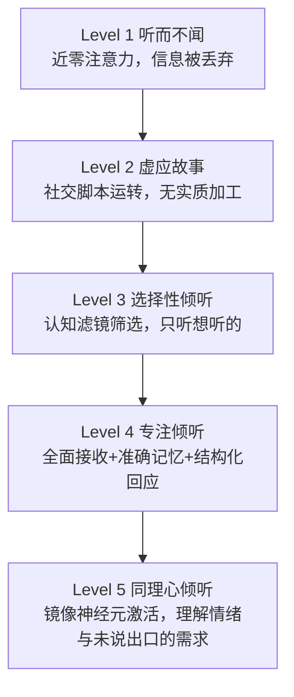
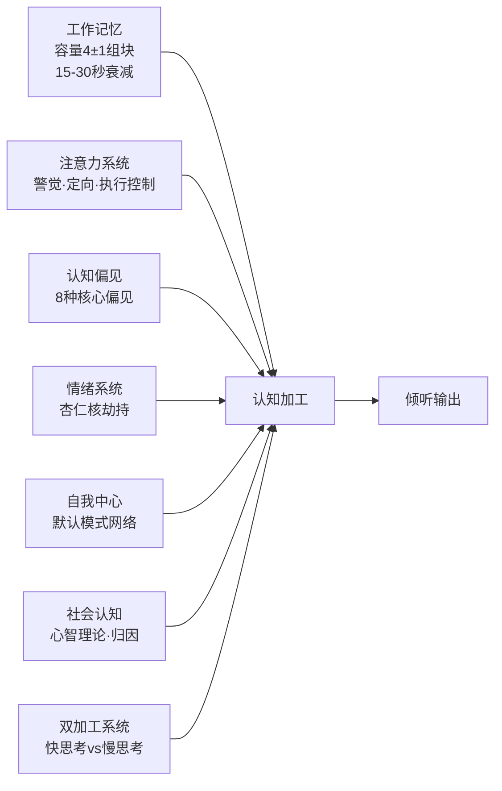
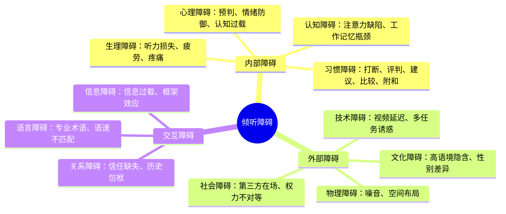
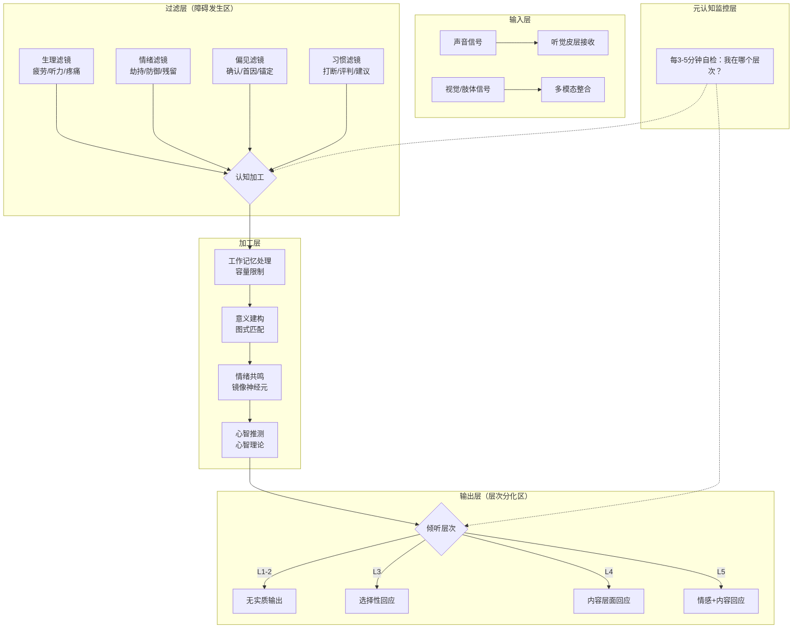

## 本节小结：理论基础全景回顾

走过这一节，你已经完成了一段从"听觉本能"到"倾听认知"的旅程。四个小节分别构建了倾听理论的四大支柱——定义与价值、层次体系、心理机制、障碍图谱——它们共同构成了一张完整的"倾听认知地图"。在进入具体的技巧训练之前，本节将帮你把这些散落的拼图拼合起来，形成一个可以在实战中随时调用的整体框架。

---

### 一、四大知识支柱回顾

#### 1.1 第一支柱：倾听的定义和重要性

**核心收获**：倾听不是被动的"听到"，而是一个主动的认知加工过程。

这一节解决了三个根本问题：

| 问题 | 核心答案 | 关键证据 |
|------|----------|----------|
| 倾听是什么？ | 接收→建构意义→做出回应的完整过程 | HURIER模型、Brownell主动倾听模型 |
| 倾听和"听"有什么区别？ | 听是生理本能，倾听是认知技能 | 7维度对比表（意识、注意力、可训练性等） |
| 为什么要练倾听？ | 信任的基石、信息的渠道、领导力的核心 | Google亚里士多德计划、Gottman 93.6%离婚预测 |

你记住的最重要的一组数据：

- 记忆衰减曲线：听完立刻丢失50%，一周后仅剩10-15%
- 仅2%的人接受过正式倾听训练
- 倾听不善导致的经济损失占收入的7%
- 医生平均18秒打断患者一次

这些数字说明了一个残酷的事实：倾听是最重要的沟通技能，却几乎是所有人的训练盲区。

#### 1.2 第二支柱：倾听的五个层次

**核心收获**：倾听能力不是一个"有或没有"的开关，而是一个从低到高的连续光谱。

五个层次的递进逻辑：

每一层跃迁的关键转折点：

| 跃迁 | 核心障碍 | 突破方法 |
|------|----------|----------|
| L1→L2 | 缺乏意识，不知道自己没在听 | 倾听觉察日记：每天记录3次"走神时刻" |
| L2→L3 | 害怕冲突，用假装回应逃避真实参与 | 从每次对话中选择1个关键信息深入追问 |
| L3→L4 | 认知滤镜太强，自动过滤不符合预期的信息 | "白板练习"：假装第一次听到对方的观点 |
| L4→L5 | 关注内容忽略情绪，难以放下自我 | "情绪温度计"：对话中每3分钟觉察对方情绪 |

一个常被忽略的高阶概念是**动态层次切换**——在同一次对话中，根据对方正在表达的内容类型（事实、情绪、请求）灵活切换倾听层次。这不是"全能"，而是"精准匹配"。

#### 1.3 第三支柱：倾听的心理学基础

**核心收获**：倾听不是单一能力，而是多个心理系统的协同运作。

七大心理系统对倾听的影响链条：

最实用的三个心理学发现：

1. **工作记忆瓶颈**：对方说话速度（150-350字/分钟）远超你的处理速度，走神是生理必然，不是态度问题。对策是建立"记录→复述→确认"的信息缓冲机制。

2. **注意力衰减曲线**：0-5分钟黄金期→5-15分钟稳定期→15-20分钟衰减期→20分钟以上低效期。超过15分钟的对话必须引入结构化策略（如切换话题、要求复述、做笔记）。

3. **情绪劫持的生理机制**：LeDoux的研究表明，情绪信号通过"低路径"直达杏仁核，比经过前额叶皮层的"高路径"快约12毫秒。这意味着在情绪触发的瞬间，你的理性脑还没反应过来，情绪脑已经"接管"了倾听过程。TIPP技术（冷水、剧烈运动、节律呼吸、渐进放松）是打断劫持的应急手段。

#### 1.4 第四支柱：倾听障碍分析

**核心收获**：障碍不是"意外"，而是系统的、可预测的、可分类的。

三大来源、十一个子类：

最重要的认知突破：**障碍叠加效应**。单一障碍通常不会摧毁一次对话，但多个小障碍会像多米诺骨牌一样连锁反应——生理疲劳导致注意力下降，注意力下降导致情绪敏感，情绪敏感导致防御性回应，最终整个沟通崩塌。对策是**早期干预**：在链条的第一环节就介入，而不是等到"牌"已经倒了一半才补救。

---

### 二、四支柱整合：倾听的完整心理过程模型

将四个小节的知识融合在一起，我们可以描绘出倾听的完整心理过程：

这个模型揭示了几个关键洞察：

**洞察一：过滤层决定质量上限**

无论你的加工能力多强，如果输入信号在过滤层就被大量丢失或扭曲，最终输出不可能准确。这就是为什么"消除障碍"的优先级高于"学习技巧"——先确保通道畅通，再提升加工效率。

**洞察二：层次不是能力，而是状态**

同一个人在不同对话中可能处于不同层次。你的目标不是"永远达到L5"，而是根据情境需要灵活匹配——工作汇报需要L4的准确性，伴侣倾诉需要L5的共情深度，日常闲聊L3就够了。

**洞察三：元认知是终极杠杆**

能实时监控自己"正在怎么听"的人，哪怕技巧粗糙，也能通过及时调整不断进步。没有元认知的倾听者，即使技巧精湛，也可能在不自知的情况下持续犯同样的错误。

---

### 三、核心知识图谱：一张表记住全部要点

| 维度 | 核心概念 | 关键模型/数据 | 实操工具 |
|------|----------|---------------|----------|
| 定义 | 倾听≠听；主动认知过程 | HURIER模型、Brownell模型 | 倾听能力自评清单（10项，1-5分） |
| 层次 | 5级递进光谱 | Wolvin & Coakley五层模型 | 倾听层次日记、动态切换策略 |
| 认知 | 工作记忆4±1组块 | Baddeley模型、Sweller认知负荷 | "记录→复述→确认"缓冲机制 |
| 注意 | 黄金15分钟定律 | Posner注意力三子系统 | 过渡仪式、注意力重启策略 |
| 偏见 | 8种核心认知偏见 | WYSIATI、首因效应、锚定效应 | 4步偏觉察纠正流程（CBT） |
| 情绪 | 杏仁核劫持快于理性12ms | LeDoux双通路模型 | TIPP技术、情绪温度计 |
| 自我 | 默认模式网络的干扰 | Rogers 5级自我超越路径 | "向外聚焦"练习 |
| 障碍 | 三大来源十一子类 | 障碍叠加效应 | 16项自检扫描清单 |

---

### 四、自我诊断：你现在在哪里？

在进入技巧训练之前，用下面这个综合评估工具给自己画一张"倾听现状地图"。评估基于本节四个小节的核心维度，每个项目按1-5分评分（1=完全不符合，5=完全符合）。

#### 维度一：倾听意识与层次（5项）

| # | 评估项 | 评分(1-5) |
|---|--------|-----------|
| 1 | 我能清楚区分"听到"和"倾听"的区别 | ___ |
| 2 | 我知道自己在大多数对话中处于哪个倾听层次 | ___ |
| 3 | 我能根据情境需要切换倾听层次 | ___ |
| 4 | 我有意识地练习过专注倾听和同理心倾听 | ___ |
| 5 | 我在对话结束后会回顾自己的倾听表现 | ___ |

#### 维度二：认知管理（4项）

| # | 评估项 | 评分(1-5) |
|---|--------|-----------|
| 6 | 长时间对话中我会使用笔记或复述来缓解工作记忆压力 | ___ |
| 7 | 我了解并能识别自己的常见认知偏见 | ___ |
| 8 | 我能区分"事实"和"我的解读" | ___ |
| 9 | 我能在对话中保持"慢思考"模式，避免过早下结论 | ___ |

#### 维度三：情绪管理（3项）

| # | 评估项 | 评分(1-5) |
|---|--------|-----------|
| 10 | 当对方表达强烈情绪时，我能保持倾听而不被卷入 | ___ |
| 11 | 我能识别自己的情绪触发点 | ___ |
| 12 | 我能区分"对方的情绪"和"我的情绪反应" | ___ |

#### 维度四：障碍识别与应对（4项）

| # | 评估项 | 评分(1-5) |
|---|--------|-----------|
| 13 | 我清楚自己最常出现的倾听障碍是什么 | ___ |
| 14 | 我能识别对话中"障碍叠加"的早期信号 | ___ |
| 15 | 我有一套应对注意力分散的个人策略 | ___ |
| 16 | 我能识别并管理自己的习惯性倾听坏习惯（打断、评判、建议等） | ___ |

**计分方式**：16项总分，满分80分。

| 分数段 | 等级 | 解读 | 建议 |
|--------|------|------|------|
| 64-80 | 优秀 | 你有扎实的倾听理论基础，接下来重点打磨技巧 | 直接进入核心技巧章节，用实战检验理论 |
| 48-63 | 良好 | 基础认知到位，但部分维度存在盲区 | 重点回顾得分最低的1-2个维度对应的小节 |
| 32-47 | 中等 | 对倾听的认知还不够系统，存在明显的知行差距 | 建议重新精读第三小节（心理学基础）和第四小节（障碍分析） |
| 16-31 | 基础 | 倾听能力主要靠直觉，缺乏系统认知 | 建议从第一小节开始重新通读整个理论基础 |

---

### 五、从理论到实践的桥梁

理论学习的价值在于指导行动。以下是本节理论如何直接映射到下一节"核心技巧"的对应关系：

| 理论知识 | 对应技巧 | 技巧解决的问题 |
|----------|----------|----------------|
| 倾听的HURIER模型 | 主动倾听技巧 | 如何从"被动接收"升级为"主动参与" |
| L5同理心倾听 | 同理心倾听技巧 | 如何理解对方的情绪和未说出口的需求 |
| 工作记忆瓶颈 | 反馈式倾听技巧 | 如何用复述、确认、总结弥补记忆衰减 |
| 8种认知偏见 | 所有技巧的元认知组件 | 如何在倾听过程中实时觉察并纠正偏见 |
| 障碍叠加效应 | 练习方法中的系统训练 | 如何建立"识别→中断→调整"的自动反应链 |

一个关键提醒：**技巧不是独立存在的**。下一节的每一种倾听技巧都建立在本节的理论基础之上。如果你跳过理论直接学技巧，你可能能模仿动作，但无法理解"为什么这样做"，遇到变通场景就会手足无措。反过来，如果你已经有扎实的理论认知，学技巧时会事半功倍——因为你已经知道每一步在"解决什么问题"。

---

### 六、5个常见认知陷阱

在结束理论基础之前，警惕这5个在"学完理论后"最容易出现的误区：

**陷阱一："我懂了理论，所以我会倾听了"**

理论认知和行为能力之间隔着巨大的鸿沟。就像你知道游泳的物理学原理（浮力、阻力、推进力），不等于你能游过一条河。理论是地图，不是旅程本身。你需要在下一节的技巧训练和第三节的实战案例中反复练习，才能将认知转化为本能。

**陷阱二："所有对话都要用最高层次倾听"**

这是一个常见但有害的误解。同理心倾听（L5）消耗大量认知资源和情绪能量，如果每次对话都全力投入，你会在一天内耗尽。真正的高手懂得"能量管理"——在重要的对话中投入L5，在日常事务性对话中用L3-L4，偶尔允许自己在低风险场景中"放空"（L1-L2）。

**陷阱三："障碍是可以一次性清除的"**

障碍不是可以"修好"然后遗忘的东西，它们是人类认知系统的固有特征。你不可能消除工作记忆的容量限制，也不可能关闭杏仁核的情绪反应。你能做的是建立**持续的觉察和应对机制**——就像近视的人不会"治好"近视，但可以戴眼镜。倾听障碍的"眼镜"就是本节学到的元认知监控能力。

**陷阱四："心理学知识太抽象，用不上"**

Baddeley的工作记忆模型、LeDoux的情绪双通路、Kahneman的双系统理论——这些看起来"学术"的模型，每一个都对应着你在日常对话中能立即应用的具体策略。比如，工作记忆的4±1组块限制直接告诉你：对方说了超过4个要点时，你就应该开始记笔记了。理论的价值在于"解释为什么策略有效"，这样你在策略不灵时知道如何调整。

**陷阱五："倾听能力是天生的"**

数据已经清楚地否定了这个假设：全球仅2%的人受过正式倾听训练，但几乎所有人都是在训练后获得显著提升。倾听能力更像肌肉——有天然的个体差异，但每个人都能通过正确的训练大幅进步。你的起点不决定你的终点。

---

### 七、下一步行动清单

理论基础已就位，接下来是行动时间：

- [ ] **完成上述自评**：诚实打分，找到最薄弱的1-2个维度
- [ ] **回顾薄弱环节**：回到对应的小节重新精读，重点看"实操工具"部分
- [ ] **开始倾听日记**：每天记录1次对话中的倾听层次和障碍观察（详见第四小节的自检扫描清单）
- [ ] **进入核心技巧章节**：从主动倾听技巧开始，用理论指导实践
- [ ] **设定训练周期**：建议每周专注练习一种技巧，4周完成全部核心技巧的基础训练

> 📝 **终极思考题**：如果让你用一句话向一个从未了解过倾听理论的朋友解释"倾听到底是什么"，你会怎么说？能用最简洁的语言说清楚复杂概念，才说明你真正理解了它。试着写下来，然后在接下来的学习中不断修正它。

---

**理论基础小结**：你已经完成了倾听学习的"认知地图"绘制——你知道倾听是什么（定义）、它有哪些层次（层次）、是什么在背后驱动和限制它（心理学）、以及什么在阻碍它（障碍）。现在，带着这张地图，我们去学习具体的行走方法。
