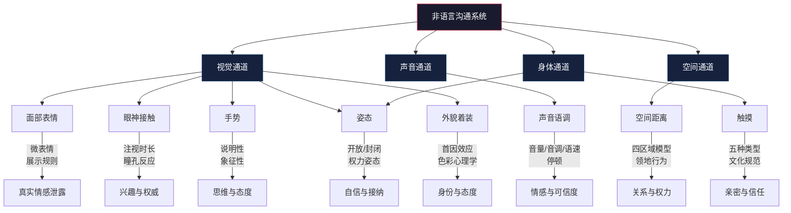
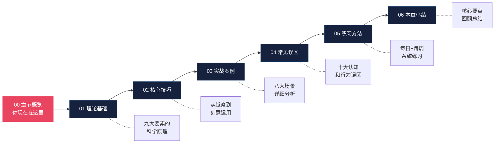

# 第三章 非语言沟通

## 引言：你从未注意过的那 93%

1967 年，加州大学洛杉矶分校心理学教授阿尔伯特·梅拉比安（Albert Mehrabian）发表了一项改变沟通学研究格局的实验。他让受试者判断说话者对听者的态度，发现当语言内容（如"好"）与声音语调或面部表情不一致时，受试者的判断几乎完全由非语言线索主导。由此得出的"7-38-55 法则"——在情感和态度传递中，语言内容占 7%、声音语调占 38%、身体语言占 55%——至今仍被广泛引用。

这个数字常被误读为"沟通中只有 7% 靠语言"。实际上，梅拉比安的研究仅限于**态度和情感的传递**，而非信息量的统计。但它揭示了一个深刻而真实的规律：**当语言与非语言信号发生冲突时，人们几乎总是选择相信非语言信号。**

想象一个场景：你的同事在会议上说"我完全同意这个方案"，但他的双臂交叉、身体后仰、嘴角微微下撇。你相信他的话，还是相信他的身体？绝大多数人会本能地感受到那句话并非真心。这就是非语言沟通的力量——它比语言更古老、更本能、更难伪装。

非语言沟通（Non-verbal Communication）是指除语言文字之外，通过身体动作、面部表情、声音特征、空间距离、外貌着装等方式传递信息和情感的过程。它是人类最原始的沟通系统，先于语言数百万年而存在。进化心理学家认为，在语言尚未出现的远古时代，人类祖先完全依赖非语言信号来协调狩猎、表达威胁、建立联盟和传递情感。这套系统深植于我们的神经系统中，至今仍在无时无刻地运作。

### 本章学习目标

通过本章的系统学习，你将获得以下能力：

1. **理论认知能力**——深入理解非语言沟通的学科渊源、九大核心要素（身体语言、面部表情、眼神接触、手势、姿态、空间距离、触摸、声音语调、外貌着装）的科学原理与神经机制
2. **信号识别能力**——能够解读他人的非语言信号，判断其真实情感状态、意图和态度，识别微表情、基线偏差和信号簇
3. **主动运用能力**——在面试、演讲、谈判、销售、领导、社交等关键场景中，有意识地运用非语言技巧来增强说服力和影响力
4. **误区规避能力**——识别并纠正常见的非语言沟通错误认知（如过度解读单一信号、忽视文化差异、机械模仿等）
5. **持续提升能力**——掌握科学的练习方法，通过日常刻意训练持续优化你的非语言沟通表现

### 非语言沟通的学科谱系

非语言沟通并非单一学科的产物，而是多个学科交叉汇聚的结果。理解这条学科谱系，有助于你建立更完整的知识框架：

| 学科 | 代表人物 | 核心贡献 | 关键概念 |
|------|----------|----------|----------|
| 进化生物学 | 查尔斯·达尔文 | 《人类和动物的表情》（1872）证明面部表情具有进化适应功能 | 表情的普遍性 |
| 人类学 | 爱德华·霍尔 | 创立"空间关系学"，揭示人际距离的文化差异 | 四区域空间模型 |
| 心理学 | 保罗·埃克曼 | 跨文化研究识别出七种基本面部表情，开发 FACS 编码系统 | 微表情、展示规则 |
| 语言学 | 雷·伯德惠斯特尔 | 创立"运动学"，将身体动作视为可分析的符号系统 | 运动素（Kines） |
| 社会心理学 | 罗伯特·罗森塔尔 | 非语言敏感度与人际关系质量的实证研究 | 非语言解码能力 |
| 神经科学 | 埃里克·坎德尔 | 镜像神经元与情感共鸣的神经机制 | 共情的生物学基础 |
| 传播学 | 阿尔伯特·梅拉比安 | 态度传递中非语言信号的主导作用 | 7-38-55 法则 |
| 组织行为学 | 艾米·卡迪 | 姿态对激素水平和心理状态的影响 | 权力姿态 |

### 九大要素速览

在展开详细讨论之前，先建立一个整体认知框架。非语言沟通由九大核心要素构成，它们各自独立运作，又相互交织影响：

每个要素的关键特征和常见误解速查表：

| 要素 | 核心功能 | 可控程度 | 常见误解 |
|------|----------|----------|----------|
| 面部表情 | 传递七种基本情感，泄露微表情 | 中等（可伪装但易露破绽） | "表情是完全可控的" |
| 眼神接触 | 调节对话流、表达情感、建立权威 | 较高 | "越多眼神接触越好" |
| 手势 | 辅助思维、增强说服力、表达态度 | 较高 | "手势只是装饰" |
| 姿态 | 传递自信/封闭、反映权力关系 | 中等 | "姿态只影响别人怎么看我" |
| 空间距离 | 表达关系亲疏、传递权力信号 | 较高 | "距离无所谓" |
| 触摸 | 建立亲密、传递支持、影响合作 | 高 | "触摸总是好的" |
| 声音语调 | 承载情感、影响可信度、控制节奏 | 中等 | "内容比声音重要" |
| 外貌着装 | 塑造首因效应、标识身份与态度 | 完全可控 | "外表不重要" |
| 身体语言 | 上述要素的综合概念 | 因子项而异 | "读懂身体语言就是读心术" |

### 本章结构

本章共分为七个部分，按照**道（理论）→ 法（技巧）→ 术（案例）→ 器（练习）**的逻辑层层递进：

| 序号 | 名称 | 定位 | 核心内容 |
|------|------|------|----------|
| 00 | 章节概览 | 导航图 | 全章框架、学科背景、学习路径 |
| 01 | 理论基础 | 道 | 九大要素的科学原理、研究发现、文化差异 |
| 02 | 核心技巧 | 法 | 自我觉察、信号识别、主动运用、场景适配 |
| 03 | 实战案例 | 术 | 面试、演讲、约会、谈判、销售、领导、社交、服务 |
| 04 | 常见误区 | 避坑 | 十大认知和行为误区的识别与纠正 |
| 05 | 练习方法 | 器 | 每日和每周的系统化刻意练习计划 |
| 06 | 本章小结 | 复盘 | 核心要点回顾、学习收获总结 |

### 为什么非语言沟通如此重要？

非语言沟通的重要性不仅体现在"它存在"，更体现在它对人际关系和职业发展的深层影响上。以下四个维度揭示了它不可替代的价值：

**第一，它传递语言无法传递的真实情感。**

语言可以被精心编排和反复排练，但身体语言往往在不经意间泄露真实想法。神经科学的研究表明，面部表情的产生涉及两条神经通路：一条从大脑皮层出发（有意识的、可控制的），另一条从边缘系统出发（本能的、难以控制的）。当我们试图隐藏真实情感时，皮层通路可以发出"微笑"的指令，但边缘系统可能会在同一时间产生与之矛盾的微表情——那些仅持续 1/25 到 1/5 秒的真实情感泄露。

一个微微皱眉、一次不自然的停顿、一个回避的眼神、指尖无意识的轻敲——这些细节单独看可能毫无意义，但当它们形成信号簇时，便构成了一幅难以伪造的真实图景。

**第二，它建立或摧毁信任基础。**

信任是所有人际关系的基石，而非语言信号是信任建立过程中最重要的信息来源。研究表明，当语言信息与非语言信息一致时，人们会产生认知上的"流畅感"，这种流畅感直接转化为信任和好感。而当两者矛盾时，大脑会进入"认知冲突"状态，产生不适感和怀疑。

更关键的是，在语言与非语言信号冲突时，人们**压倒性地**选择相信非语言信号。这就是为什么一个说"我很高兴见到你"却双臂交叉、身体后仰、眼神游移的人，很难让对方感受到真诚。信任的建立是日积月累的——每一次非语言信号与语言的不一致，都在你的"信任账户"中扣分。

**第三，它显著增强表达效果。**

恰当的非语言信号可以让语言信息的传递效果成倍放大。普林斯顿大学的一项研究发现，当演讲者使用与内容匹配的手势时，听众的理解准确率提高了约 20%。另一项针对政治演讲的分析显示，使用手势的候选人获得的选票比不使用手势的对手高出约 10%。

这不是巧合。人类的认知系统是为处理多通道信息而进化的——当视觉（手势、表情）与听觉（语言、语调）信息一致时，大脑处理信息的速度更快、记忆更深刻、情感反应更强烈。

**第四，它跨越语言和文化障碍。**

微笑是全世界通用的友好信号。点头在大多数文化中表示肯定。紧握的双手传递力量和决心。在跨文化交流中，虽然语言不通，但很多非语言信号能够跨越语言障碍，建立基本的沟通桥梁。

然而，这也是一把双刃剑——某些手势和身体语言在不同文化中有截然不同的含义。一个在美国表示"OK"的手势，在巴西可能是严重的侮辱。理解非语言沟通的文化维度，是全球化时代每个人的必修课。

### 在数字时代的演变

在远程工作和数字沟通成为常态的今天，非语言沟通的规则正在发生深刻变化：

- **视频会议**：摄像头只传递上半身信息，手势和姿态的表达空间被压缩；同时，人们在视频中更容易观察到自己的表情（"Zoom 疲劳"的重要来源之一）
- **文字消息**：表情符号（emoji）和标点符号成为替代身体语言的"数字非语言"——一个句号的冷淡、一个感叹号的热情、一个微笑表情的微妙含义
- **语音通话**：失去了视觉通道后，声音语调承载了全部非语言信息，语速、音调、停顿变得更加关键
- **社交媒体**：精心策划的照片和视频成为新的"外貌着装"，滤镜和编辑工具模糊了真实与修饰的边界

这些变化意味着，非语言沟通的核心原理依然成立，但其表达形式和解读规则需要与时俱进。

### 阅读前的自我评估

在开始系统学习之前，花两分钟完成以下快速自测。回答"是"或"否"，不要过多思考——你的第一反应最接近你的真实习惯：

**觉察维度：**
1. 你是否清楚自己在紧张时会出现什么小动作？
2. 你是否知道自己说话时的默认语速？
3. 你是否意识到自己的"默认面部表情"是什么？

**识别维度：**
4. 你能在对话中察觉对方的情绪变化吗？
5. 你能分辨一个人的微笑是否真诚吗？
6. 你注意过不同人对空间距离的偏好差异吗？

**运用维度：**
7. 你在重要场合会有意识地调整自己的身体语言吗？
8. 你知道怎样的姿态最适合自己吗？
9. 你能在演讲中自然地使用手势吗？

**文化维度：**
10. 你了解至少三种不同文化在眼神接触方面的差异吗？

**评分参考：**
- 8-10 个"是"：你的非语言沟通基础扎实，可以直接进入核心技巧和实战部分
- 5-7 个"是"：你有一定的觉察力，建议从理论基础开始系统梳理
- 0-4 个"是"：好消息——这意味着你的提升空间最大，本章将为你打开一扇全新的门

### 本章导读建议

为了最大化学习效果，建议你按照以下方式阅读本章：

**第一步：建立框架（本文件）**

通读本概览，建立对非语言沟通的整体认知框架。理解九大要素是什么、为什么重要、它们之间如何关联。

**第二步：夯实理论（01-理论基础）**

系统学习每个要素的科学原理。不要急于跳过理论部分——理解"为什么"比记住"怎么做"更重要。知其然更知其所以然，才能在复杂场景中灵活应变。

**第三步：掌握技巧（02-核心技巧）**

从自我觉察开始，逐步学习信号识别、主动运用和场景适配。每个技巧都要结合自身情况进行练习。

**第四步：场景实战（03-实战案例）**

阅读八大场景的详细案例分析。建议选择与你当前最相关的 2-3 个场景重点研读，其余作为扩展阅读。

**第五步：排查误区（04-常见误区）**

逐条对照自己的习惯，识别可能存在的误区。误区的认知往往比技巧的学习更能带来立竿见影的改善。

**第六步：持续练习（05-练习方法）**

制定个人练习计划。非语言沟通是一种技能，和骑车、游泳一样，只有通过反复练习才能内化为本能。

**通用建议：**

- **带着觉察阅读**：随时观察自己的非语言习惯，对照理论进行自我诊断
- **结合实际场景**：每读完一个部分，回想自己在类似场景中的表现
- **循序渐进练习**：不要试图一次性改变所有非语言习惯，从一个要素开始，逐步扩展
- **保持开放心态**：某些非语言习惯可能根深蒂固，改变需要时间和耐心
- **记录变化**：用日记或手机备忘录记录你的观察和进步，可视化你的成长

准备好了吗？让我们一起进入非语言沟通的精彩世界，发现那些你从未注意过的力量。

***

> **核心概念速览：** 非语言沟通涵盖身体语言、面部表情、眼神接触、手势、姿态、空间距离（proxemics）、触摸（haptics）、声音语调（paralanguage）和外貌着装九大要素。它先于语言而存在，深植于人类神经系统，在情感传递和信任建立中具有压倒性的主导作用。本章将按照"道（理论）→ 法（技巧）→ 术（案例）→ 器（练习）"的结构，带你系统掌握这门无声的语言。
