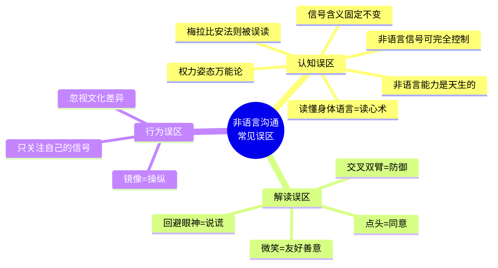
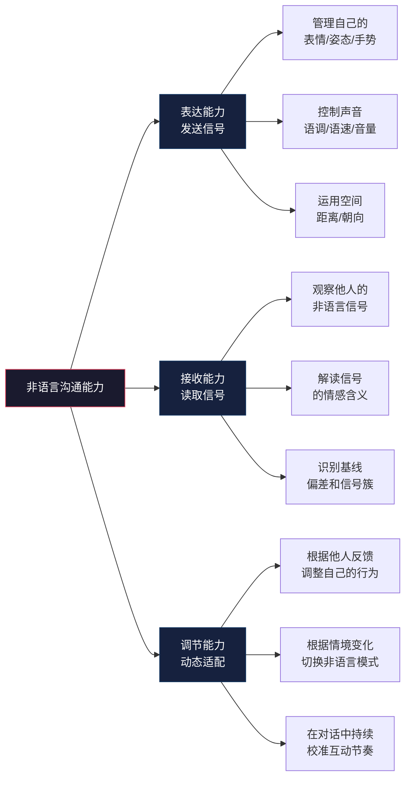

# 第三章 非语言沟通 —— 常见误区

## 引言：那些"看起来对"的错误

非语言沟通领域充满了似是而非的观点和广泛的误解。这些误区的来源多种多样：有人将学术研究过度简化后传播，有人将流行心理学中的猜测当作定论，有人忽略了文化差异和个体差异的复杂性，还有人被影视作品中"微表情读心术"的戏剧化呈现误导。

识别并纠正这些误区，意义远不止"少犯错"。**错误的非语言解读会导致严重的人际后果**——你可能因为误判对方的防御姿态而放弃一次本该深入的谈话，可能因为错误地认为"回避眼神=说谎"而冤枉一个诚实的人，也可能因为过度迷信"权力姿态"而忽视了真正需要提升的核心能力。

本节梳理了非语言沟通领域中最常见的十二个误区，按照**认知误区**（对非语言沟通本质的错误理解）、**解读误区**（对信号含义的错误推断）、**行为误区**（在运用中的错误做法）三大类进行组织。每个误区都包含误解内容、科学澄清、真实案例和纠正方法四个部分，确保你不仅知道"什么是错的"，更知道"为什么错"以及"怎样做对"。

***

## 第一部分：认知误区——对非语言沟通本质的错误理解

认知误区是最深层的误区。如果你对非语言沟通的基本原理理解有偏差，那么所有的解读和运用都会建立在错误的地基上。

### 误区一：梅拉比安法则意味着"语言内容不重要"

#### 误解内容

"根据梅拉比安的研究，沟通中只有7%来自语言内容，所以说什么不重要，怎么说才重要。"

这是传播最广、危害最大的误区之一。无数培训课程、自媒体文章甚至部分教材都在引用这个"7-38-55法则"来论证"内容不重要"。

#### 科学澄清

阿尔伯特·梅拉比安（Albert Mehrabian）本人在多个场合明确表示，这个数字被严重曲解了。原始研究有三个严格的前提条件，缺一不可：

**前提一：研究对象仅限于情感和态度的传递。** 梅拉比安的实验让受试者判断说话者对听者的态度（喜欢/不喜欢），而不是传递事实性信息。当你问路时，对方告诉你"左转再右转"，这个信息的传递100%依赖语言内容——你不可能通过对方的语调和表情猜出路线。

**前提二：实验使用的是矛盾信息。** 比如用愤怒的声音说"我爱你"，或者用冷淡的表情说"你真棒"。在这种语言与非语言完全矛盾的极端情况下，人们确实更倾向于相信非语言信号。但在正常的一致性沟通中，语言内容的权重远超7%。

**前提三：样本量有限且实验设计有特定约束。** 原始研究的被试人数较少，且全部为美国大学生，其跨文化普适性从未得到验证。后续研究者对其方法论提出了多项质疑。

| 条件 | 7-38-55法则适用 | 日常沟通典型情况 |
|------|:---:|:---:|
| 信息类型 | 情感态度 | 事实+情感混合 |
| 信息一致性 | 语言与非语言矛盾 | 大致一致 |
| 沟通渠道 | 仅面部+声音 | 多通道（含手势、姿态、空间） |
| 文化背景 | 美国大学生 | 多元文化 |
| 语言内容权重 | 约7% | 远高于7%（视内容类型而定） |

#### 真实案例

一位产品经理在需求评审会上，过度关注自己的"自信语调"和"开放姿态"，却对需求文档的逻辑漏洞准备不足。结果工程师们很快发现了数据矛盾，无论他语调多自信都无法掩盖内容的缺陷。相反，另一位产品经理虽然语调平淡，但因为需求文档逻辑严密、数据扎实，依然获得了团队的认可。

#### 纠正方法

- **建立正确的权重模型**：语言内容在信息传递中占据核心地位，非语言信号的作用是"增强、补充和调节"，而非"替代"
- **区分场景**：传递事实信息时，内容为王；传递情感态度时，非语言信号权重上升；两者矛盾时，非语言信号胜出
- **回到原著**：梅拉比安的两本书《无声的信息》（*Silent Messages*）和《关于他人的隐含信息》（*Implicit Messages*）清楚界定了研究的适用范围

***

### 误区二：非语言沟通能力是天生的，无法后天培养

#### 误解内容

"有些人天生就善于非语言沟通，这是性格决定的，后天改变不了。我就是不善表达的人，没办法。"

#### 科学澄清

这个误区混淆了"天赋"和"技能"。确实，个体在非语言敏感度上存在先天差异——有些人天生更容易察觉他人的微表情，有些人天生更善于控制自己的表情。但大量实证研究表明，非语言沟通能力的核心组成部分**都是可以学习和提升的**：

- **公众演讲培训**：加州大学洛杉矶分校的一项研究发现，经过12周的系统培训，演讲者的肢体语言运用能力平均提升40%，听众对其"可信度"的评分提高25%
- **社交焦虑干预**：认知行为疗法（CBT）中的社交技能培训已被证明可以显著改善社交焦虑者的非语言行为，包括眼神接触频率、微笑自然度和姿态开放性
- **演员训练**：专业演员通过系统训练（如斯坦尼斯拉夫斯基体系、迈斯纳技巧）可以精确控制面部表情和身体语言，这证明了非语言行为的可控性远超常人想象
- **谈判培训**：哈佛商学院的谈判课程中，经过非语言模块训练的学员在模拟谈判中获得的让步幅度比未受训组高出15-20%

神经科学的解释是**神经可塑性**（neuroplasticity）。大脑的运动皮层和镜像神经元系统具有持续的重塑能力。当你反复练习某种非语言行为时，相关的神经通路会被强化，最终形成新的自动化模式。

#### 纠正方法

- **将非语言沟通视为技能而非天赋**：像学习任何技能一样，投入时间练习就能进步
- **从自我觉察开始**：用手机录制自己在日常对话中的表现，观察自己的默认非语言模式
- **设置渐进目标**：不要试图一次改变所有习惯，先从一个要素（如眼神接触或手势）开始
- **寻求反馈**：请信任的朋友或同事观察你的非语言行为并给出诚实反馈
- **记录进步**：用日记记录你的练习和变化，可视化你的成长轨迹

***

### 误区三：非语言信号的含义是固定不变的

#### 误解内容

"某个特定的非语言动作有固定的含义，可以像查字典一样解读。摸鼻子就是说谎，双臂交叉就是防御，脚尖朝向门口就是想离开。"

#### 科学澄清

这种"非语言信号字典化"的思维方式是危险的。非语言信号的含义受到至少五个维度的影响：

**情境维度**：同样的动作在不同情境中意义完全不同。一个人在会议室里双臂交叉可能表示不满，但在寒冷的空调房里可能只是保暖。一个人在面试中摸鼻子可能是紧张，而在花粉季节可能只是鼻子痒。

**文化维度**：同一个手势在不同文化中可能意义完全相反。"竖大拇指"在多数西方国家表示"好的"，但在中东某些地区具有侮辱性含义。"摇头"在保加利亚表示"是"，在印度表示"理解了"。

**个体差异维度**：每个人有自己的非语言"方言"。有些人天生说话时手势丰富，有些人习惯安静地坐着。一个习惯性交叉双臂的人，交叉双臂并不代表防御——这是他的舒适区。

**关系维度**：同样的距离和接触在不同关系中有完全不同的含义。朋友之间的拍肩是支持，陌生人之间的拍肩可能是冒犯。上司靠近下属是关心，下属靠近上司可能被解读为越界。

**信号组合维度**：单一信号的含义需要结合信号簇（signal cluster）来解读。一个人同时出现回避眼神+身体后倾+双手插兜+语速加快，比单独出现任何一个信号都更值得关注。

#### 真实案例

一位外企经理注意到中国团队成员在汇报时经常回避与他的眼神接触，他最初认为这是不自信或隐瞒信息的表现。后来通过文化培训了解到，在东亚文化中，下属避免长时间直视上级是尊重的表现，而非心虚或不诚实。这个认知转变帮助他重新评估了团队成员的能力。

#### 纠正方法

- **抛弃"信号字典"思维**：永远不要将单一信号与特定含义画等号
- **建立基线**：先观察对方在放松状态下的默认非语言模式，再判断后续行为的偏离程度
- **寻找信号簇**：至少观察3个以上一致的信号后，再形成初步判断
- **考虑全部上下文**：将情境、文化、关系和个体差异都纳入解读框架
- **保持谦逊**：承认非语言信号解读存在不确定性，用提问而非猜测来验证你的判断

***

### 误区四：高权力姿态可以快速改变你的荷尔蒙和自信水平

#### 误解内容

"做2分钟的高权力姿态（如双手叉腰、扩展身体）就能显著改变你的荷尔蒙水平（睾酮升高、皮质醇降低），让你变得更自信。"

#### 科学澄清

这个误区源于艾米·卡迪（Amy Cuddy）2010年在TED演讲中提出的观点，该演讲获得了超过7000万次观看，使"权力姿态"成为全球流行概念。然而，后续的科学验证过程揭示了严重问题：

**原始研究**：卡迪等人（2010）发表在《心理科学》上的研究声称，摆出2分钟高权力姿态后，参与者的睾酮水平上升约20%，皮质醇水平下降约25%，并表现出更高的风险偏好。

**重复失败**：2015年，一项由伊格尔等人（Eagle et al.）进行的大规模重复研究（样本量是原始研究的数倍）**未能复制**原始结果。随后的多项元分析发现，权力姿态对荷尔蒙的效应量很小甚至接近零。

**卡迪本人的修正**：卡迪后来在访谈中承认，原始研究中关于荷尔蒙变化的结论"可能过于强烈"，她更多强调的是权力姿态对主观感受（"感觉自己更强大"）的影响。

**更准确的理解**：权力姿态的真正价值在于**心理暗示效应**——当你摆出自信的姿态时，你可能会**感觉**更自信，这与"假装直到你成功"（fake it till you make it）的心理机制一致。但这种效应的强度和持久性远不如最初的宣传。

#### 纠正方法

- **区分科学事实和流行说法**：权力姿态作为一种"热身技巧"有实用价值，但不要期望它能神奇地改变你的生理指标
- **聚焦真正的自信来源**：真正的自信来自能力、准备和经验，而非2分钟的身体姿态
- **将姿态调整视为辅助工具**：在重要场合前，可以用扩展姿态作为一种心理准备手段，但不能替代实质性的准备

***

### 误区五：读懂身体语言就是"读心术"

#### 误解内容

"学会非语言沟通就能知道别人在想什么，就像拥有读心术一样。"

#### 科学澄清

这个误区的来源很复杂——一部分来自畅销书的过度营销（如《FBI教你读心术》），一部分来自影视作品的戏剧化呈现（如美剧《Lie to Me》中主角几乎100%准确判断谎言的能力），还有一部分来自人们对于"确定性"的心理需求。

现实是，非语言信号的解读远比"读心术"复杂和不确定：

| 维度 | 流行说法 | 科学事实 |
|------|----------|----------|
| 准确率 | "可以精准读取意图" | 专业人员判断谎言的准确率仅约54%（略高于随机的50%） |
| 信息量 | "身体语言暴露一切想法" | 非语言信号主要传递情感状态和态度倾向，而非具体想法 |
| 确定性 | "某个动作=某个含义" | 同一动作在不同情境中可能有完全不同的含义 |
| 可训练性 | "短期培训就能成为专家" | 需要长期系统训练和大量实践经验 |
| 普适性 | "规则放之四海皆准" | 文化、个体差异显著影响信号含义 |

心理学家蒂姆·莱文（Tim Levine）的"真话默认理论"（Truth-Default Theory）指出，人类在沟通中有一个默认假设——对方说的是真话。这个进化形成的倾向在日常生活中是有益的（如果对每句话都怀疑，社会无法运转），但在判断谎言时会成为系统性偏差。

#### 纠正方法

- **接受不确定性**：非语言沟通不是精确科学，而是一门需要持续学习的"解读艺术"
- **用概率思维替代确定性判断**：将非语言信号视为"可能性指标"而非"确定性结论"
- **用提问验证假设**：当你从非语言信号中获得某种解读时，用开放性问题来验证，而不是直接下结论
- **警惕确认偏误**：一旦你形成了某种判断，你可能会不自觉地只关注支持该判断的信号，忽略反对的信号

***

### 误区六：非语言信号可以完全控制

#### 误解内容

"只要我足够努力，就能完全掌控自己的非语言信号，让别人看到我想让他们看到的一切。"

#### 科学澄清

人类的非语言系统由两套神经系统控制，它们的可控性完全不同：

**皮层通路（有意识控制）**：从大脑皮层出发，负责有意识的、可控的非语言行为。例如，你可以有意识地保持微笑、调整坐姿、控制手势幅度。这些行为经过练习可以变得熟练。

**边缘系统通路（本能反应）**：从边缘系统（特别是杏仁核）出发，负责本能的、难以控制的非语言反应。例如，恐惧时瞳孔放大、惊讶时眉毛上扬、厌恶时鼻翼收缩——这些反应的速度远快于有意识的控制。

关键的矛盾在于：**当皮层通路发出"伪装"指令时，边缘系统可能会在同一时间产生与之矛盾的真实信号**。这就是为什么：

- 假笑通常只涉及嘴角上扬（AU12），缺乏眼角鱼尾纹（AU6）——因为眼轮匝肌的收缩难以被有意识地控制
- 说谎者可能会有意识地保持眼神接触，但会出现不自觉的自我触摸（摸脖子、拉衣领）等安抚行为
- 紧张的人可以强迫自己坐直，但无意识的腿脚抖动、手指敲击等行为很难完全消除

保罗·埃克曼将这种有意识控制失败的瞬间泄露称为**微表情**（microexpression），持续时间仅为1/25到1/5秒。研究表明，普通人很难察觉微表情，但经过系统训练后识别准确率可以显著提高。

#### 纠正方法

- **不要追求"完美控制"**：试图完全隐藏真实情感不仅困难，而且消耗大量认知资源，反而可能让你在其他方面表现不佳
- **专注于"一致性"**：与其伪装，不如让你的语言和非语言信号保持一致。真诚一致的表达比精心伪装更有说服力
- **管理情绪源头**：如果紧张导致你的非语言信号不理想，与其控制信号，不如从源头管理情绪（深呼吸、充分准备、认知重构）
- **理解泄露的积极意义**：适度的非语言"泄露"反而让你显得更真实、更有亲和力——一个永远完美控制表情的人，会让人觉得"不真实"

***

## 第二部分：解读误区——对信号含义的错误推断

解读误区直接影响你对他人的判断。错误的解读可能导致人际误判、关系损伤，甚至在关键场合做出错误决策。

### 误区七：双臂交叉一定表示防御或拒绝

#### 误解内容

"如果对方双臂交叉，就说明他在防御、不同意或者不感兴趣。这是最基本的身体语言常识。"

#### 科学澄清

双臂交叉是被误解最严重的非语言信号之一。传播学教授大卫·吉文斯（David Givens）在其著作《无声的信号》（*Love Signals*）中指出，交叉双臂的含义至少有以下六种：

| 可能含义 | 典型情境 | 伴随信号 |
|----------|----------|----------|
| 舒适习惯 | 任何情境 | 面部放松，语调自然，参与对话 |
| 温度调节 | 空调房、冬天 | 可能伴有轻微发抖或搓手 |
| 自我安慰 | 压力情境 | 表情紧张，语速可能加快 |
| 深度思考 | 处理复杂信息时 | 眼神向上或向下，语速变慢 |
| 防御/排斥 | 受到威胁或反对时 | 身体后倾，回避眼神，语调变硬 |
| 随意站姿 | 等待、站立时 | 身体放松，可能重心在一条腿上 |

关键在于**信号簇**的判断：当交叉双臂与身体后倾、回避眼神、语调变硬、下巴收紧等信号同时出现时，防御的可能性才较高。单独的交叉双臂不能说明任何问题。

英国赫特福德郡大学的理查德·怀斯曼（Richard Wiseman）进行了一项大规模研究，让参与者在不同文化背景下摆出交叉双臂的姿势，然后报告他们的感受。结果发现，大多数人报告的是"舒适"或"习惯"，而非"防御"。

#### 纠正方法

- **观察信号簇**：交叉双臂+身体后倾+回避眼神=值得关注；交叉双臂+面部放松+积极对话=无需在意
- **建立基线**：如果对方在对话开始时就交叉双臂，这更可能是他的默认姿态；如果在某个话题出现后突然交叉双臂，值得进一步观察
- **用语言验证**：如果你怀疑对方有防御心理，可以问"你觉得这个方案怎么样？"来引导对方表达，而非仅凭非语言信号做判断

***

### 误区八：说谎时一定会避免眼神接触

#### 误解内容

"如果一个人说话时避免眼神接触，就说明他在说谎。"

#### 科学澄清

这个误区如此深入人心，以至于很多人都将其作为判断谎言的主要依据。但科学研究的结论恰恰相反：

**发现一：说谎者可能增加眼神接触。** 迪堡大学（DePauw University）的研究者发现，当被试知道"回避眼神=说谎"这一常识后，他们在说谎时会有意识地**增加**眼神接触，试图表现得"诚实"。这意味着，一个保持坚定眼神接触的人，可能恰恰是在刻意表演诚实。

**发现二：眼神接触存在巨大的个体差异。** 内向者、社交焦虑者、自闭症谱系人群天生就较少进行眼神接触，这与诚实或谎言完全无关。某些文化中（如部分东亚和原住民文化），避免眼神接触是尊重的表现。

**发现三：回避眼神的原因多种多样。** 除了说谎，回避眼神还可能是因为羞耻、尴尬、悲伤、思考、注意力分散或单纯的个人习惯。

**发现四：专业人员的判断准确率惊人地低。** 保罗·埃克曼的综述研究显示，即使是经验丰富的执法人员、海关官员和心理学家，仅通过非语言信号判断谎言的准确率也仅在54%左右——仅比随机猜测高4个百分点。

| 流行说法 | 科学事实 |
|----------|----------|
| 回避眼神=说谎 | 回避眼神可能有十几种原因 |
| 保持眼神接触=诚实 | 有经验的说谎者会刻意增加眼神接触 |
| 专家可以准确识别谎言 | 专家准确率仅约54% |
| 单一信号可以判断谎言 | 判断谎言需要综合多个维度的基线偏差 |

#### 纠正方法

- **放弃"单一指标"判断法**：没有哪个单独的非语言信号能够可靠地指示谎言
- **使用基线对比法**：先观察对方在正常状态下的眼神接触模式，再判断是否有异常偏离
- **关注信号簇的一致性**：当多个不一致的信号同时出现时（如语言犹豫+自我触摸增加+微表情泄露+声音变化），才值得提高警惕
- **用提问策略替代"读心"**：认知负荷理论表明，说谎者在被追问细节时更容易暴露矛盾，这比观察非语言信号更可靠

***

### 误区九：微笑总是表示友好和善意

#### 误解内容

"微笑就是友好的信号，如果对方微笑，说明他对我有好感。"

#### 科学澄清

微笑是人类面部表情中最具欺骗性的信号之一。保罗·埃克曼的研究识别出了至少七种不同类型的微笑，它们的神经机制、肌肉运动模式和真实含义各不相同：

| 微笑类型 | 涉及肌肉 | 真实含义 | 识别要点 |
|----------|----------|----------|----------|
| 杜兴微笑（Duchenne） | AU6+AU12（眼角+嘴角） | 真实的快乐和愉悦 | 眼角出现鱼尾纹，眼周肌肉参与 |
| 社交性微笑 | 仅AU12（嘴角） | 礼貌、客气 | 缺乏眼部参与，嘴角上扬但眼睛"不笑" |
| 紧张性微笑 | AU12+可能伴有咬唇 | 尴尬、不安、焦虑 | 出现在不适当的情境中，持续时间不自然 |
| 掩饰性微笑 | AU12+可能伴有其他表情泄露 | 掩盖悲伤、愤怒或其他负面情绪 | 短暂出现后迅速消失，可能有微表情泄露 |
| 支配性微笑 | AU12+下巴上扬 | 优越感、控制感 | 配合居高临下的姿态，常见于权力关系中 |
| 苦涩的微笑 | AU12+嘴角下拉的混合 | 无奈、接受、自嘲 | 眉毛可能微微上扬，表情复杂 |
| 调情微笑 | AU12+头部倾斜+短暂眼神接触 | 好感、兴趣 | 配合其他调情信号（如头发触摸、身体前倾） |

更复杂的是，在某些文化中，微笑是社交润滑剂——即使在负面情境中也会使用。日本文化中的"建前微笑"（tatemae smile）可能是为了维护表面和谐而非表达真实情感。韩国文化中，微笑有时也用于掩盖不适或尴尬。

#### 纠正方法

- **观察眼部肌肉**：真正的快乐微笑（杜兴微笑）会涉及眼轮匝肌的收缩，导致眼角出现鱼尾纹和眼睑轻微收紧
- **注意微笑的时机和持续时间**：真实微笑通常在情感刺激后约0.5秒出现，持续2-4秒；虚假微笑可能出现时机不自然或持续时间过长或过短
- **结合上下文判断**：在什么情境下出现的微笑？与语言内容是否一致？与对方的整体非语言状态是否匹配？
- **考虑文化因素**：在东亚文化中，微笑的社交润滑功能比在西方文化中更强

***

### 误区十：点头总是表示同意

#### 误解内容

"对方在点头，说明他同意我说的话。"

#### 科学澄清

点头是人类最基本的非语言信号之一，但它的含义远比"同意"丰富得多。在不同文化和情境中，点头至少有以下五种含义：

**含义一：理解，而非同意。** 在许多文化中，点头表示"我在听"或"我理解了你在说什么"，而不是"我同意你的观点"。日语中的"相槌"（aizuchi）文化尤其典型——日本人频繁点头或说"はい"（hai），这表示"我在认真听"，而非"是的，我同意"。许多跨文化商务谈判因此产生误解。

**含义二：鼓励继续。** 当你正在讲话时，对方的点头可能只是在鼓励你继续说下去，是一种倾听的非语言反馈。

**含义三：社交礼节。** 在某些情境中，点头是一种习惯性的社交礼貌行为，没有深层含义。

**含义四：不耐烦的催促。** 快速、连续的点头有时表示"我知道了，快点说重点"，实际上是不耐烦的信号。

**含义五：文化习惯。** 在保加利亚，点头表示"不"，摇头表示"是"——这与世界上大多数文化完全相反。在希腊，轻微的向上仰头（配合"啧"声）表示"不"。

#### 纠正方法

- **区分"理解"和"同意"**：当对方点头时，不要自动假设他同意。可以通过追问确认："你觉得这个方案可行吗？"
- **观察点头的节奏**：缓慢、有节奏的点头通常表示理解和思考；快速、连续的点头可能表示不耐烦
- **注意文化的特殊性**：在跨文化沟通中，提前了解对方文化中点头的含义
- **结合语言反馈**：点头是否配合了"对"、"有道理"等语言回应？还是沉默的点头？两者的含义差异很大

***

## 第三部分：行为误区——在运用中的错误做法

行为误区影响你如何运用非语言沟通。错误的做法不仅无法达成沟通目标，还可能适得其反。

### 误区十一：镜像对方的身体语言就是操纵

#### 误解内容

"刻意模仿对方的身体语言是一种操纵行为，不道德，被发现会很尴尬。"

#### 科学澄清

镜像效应（mirroring）是非语言沟通中最强大的亲和力建立机制之一。神经科学的研究发现，当两个人的行为产生同步时，双方大脑中的镜像神经元系统会被激活，产生一种"共振"效应，从而增强信任感和亲近感。

**关键区分：自然镜像 vs. 刻意镜像**

| 维度 | 自然镜像 | 刻意镜像 | 模仿（不当做法） |
|------|----------|----------|-------------------|
| 意识程度 | 无意识 | 有意识但自然 | 刻意且明显 |
| 时机 | 即时 | 延迟2-3秒 | 即时或过度延迟 |
| 幅度 | 微妙 | 微妙 | 明显 |
| 对方感知 | 无感但产生好感 | 无感或产生好感 | 不适或反感 |
| 效果 | 建立自然连接 | 建立专业亲和力 | 破坏关系 |

社会心理学家威廉·麦达克斯（William Maddux）在INSEAD商学院的实验中发现，适度镜像谈判对手的非语言行为的参与者，获得的谈判结果比未镜像组高出约15%，而且对方报告了更高的满意度——没有人意识到自己被镜像了。

镜像的本质不是"假装和对方一样"，而是**通过行为同步来传递"我和你同频"的信号**。当你的镜像是出于真诚地希望建立连接时，它是一种有效的沟通工具；当你的目的是欺骗或操纵时，它就是不道德的。

#### 纠正方法

- **从"意图"出发审视自己**：你镜像对方的目的是建立真诚的连接，还是为了单方面获利？
- **保持微妙和自然**：延迟2-3秒，选择对方的一个显著动作进行呼应，不要复制每一个动作
- **镜像情感而非动作**：与其镜像对方的具体动作，不如镜像对方的情感节奏——如果对方说话沉稳，你也放慢语速；如果对方充满能量，你也适度提升热情
- **避免镜像负面信号**：如果对方表现出不适或封闭的姿态，不要镜像这些负面信号，而是用你的开放姿态来引导氛围变化
- **不要强求**：如果镜像让你感到不自然或不舒服，就不要勉强。不自然的镜像比没有镜像更糟糕

***

### 误区十二：只需要关注自己的非语言信号就够了

#### 误解内容

"非语言沟通就是管理好自己的表情、姿态和手势，让别人觉得我好就行了。"

#### 科学澄清

这个误区将非语言沟通从"双向互动"简化为"单向表演"。事实上，完整的非语言沟通能力包括三个维度：

罗伯特·罗森塔尔（Robert Rosenthal）开发的"非语言解码能力测试"（PONS, Profile of Nonverbal Sensitivity）表明，非语言接收能力存在显著的个体差异，而且这种差异与人际关系质量、领导效能和心理健康水平高度相关。

**接收能力的价值举例**：

- 在销售场景中，能够察觉客户在听到价格时的微小犹豫（眼神闪避、嘴角收紧），意味着你可以及时回应疑虑而不是继续推进
- 在领导场景中，能够感知团队成员在会议中的不安（频繁看手机、坐立不安），意味着你可以调整节奏或休会
- 在亲密关系中，能够识别伴侣的非语言暗示（语气变化、距离变化），意味着你可以在问题积累之前及时沟通

#### 纠正方法

- **分配注意力**：在对话中，将大约50%的注意力放在"读取对方"上，而不是100%关注"我该怎么表现"
- **练习"无声观察"**：定期在咖啡厅、地铁等公共场合练习观察陌生人的非语言互动
- **养成"检入"习惯**：在重要对话中，每隔几分钟问自己"对方现在的状态如何？我需要调整吗？"
- **建立反馈循环**：注意观察你的非语言行为对方的反应——如果你靠近一步，对方是也靠近还是后退？

***

## 误区自检清单

为了帮助你系统地排查自己的非语言沟通误区，以下提供一份自检清单。对每个问题回答"是"或"否"，然后对照解读进行自我评估。

| 序号 | 自检问题 | 你的回答 | 如果你选了"是" |
|------|----------|----------|----------------|
| 1 | 你是否曾在重要场合过度关注语调/姿态而忽略了内容准备？ | 是/否 | 参照误区一，重新平衡内容与非语言的投入 |
| 2 | 你是否认为自己的非语言能力"就这样了"？ | 是/否 | 参照误区二，开始系统练习 |
| 3 | 你是否曾经仅凭一个非语言信号就对他人下了判断？ | 是/否 | 参照误区三和误区七，学习信号簇分析 |
| 4 | 你是否相信"摆个pose就能变自信"？ | 是/否 | 参照误区四，建立基于能力的真实自信 |
| 5 | 你是否觉得自己能"看穿"别人在想什么？ | 是/否 | 参照误区五，接受不确定性 |
| 6 | 你是否试图在重要场合完全控制自己的表情？ | 是/否 | 参照误区六，专注于一致性而非完美控制 |
| 7 | 你是否认为对方交叉双臂就一定有敌意？ | 是/否 | 参照误区七，学习信号簇判断 |
| 8 | 你是否把"回避眼神"当作判断说谎的关键指标？ | 是/否 | 参照误区八，放弃单一指标法 |
| 9 | 你是否认为微笑必然代表友好？ | 是/否 | 参照误区九，学会区分微笑类型 |
| 10 | 你是否认为点头等于同意？ | 是/否 | 参照误区十，用语言确认对方的真实态度 |
| 11 | 你是否认为镜像别人就是不道德的操纵？ | 是/否 | 参照误区十一，理解镜像的正当运用 |
| 12 | 你是否只关注自己的非语言表达而忽略了对方的信号？ | 是/否 | 参照误区十二，平衡表达和接收 |

**评分参考**：

- **0-2个"是"**：你的非语言沟通认知基础扎实，本节内容可作为巩固复习
- **3-5个"是"**：你存在一些常见误区，建议逐条对照本节内容进行纠正
- **6-9个"是"**：你的误区较多，建议从最常见的三个开始（误区一、三、七），然后逐步扩展
- **10-12个"是"**：好消息——这意味着你的提升空间最大，系统学习本章内容后你的进步会非常显著

***

## 总结：超越误区，科学运用

非语言沟通误区的核心本质可以归结为三个字：**过度简化**。

人类的大脑天生喜欢简单规则——"交叉双臂=防御"比"交叉双臂可能有六种含义，需要结合信号簇、情境、文化和个体差异来综合判断"好记得多。但简单规则在复杂系统中往往导致误判。

以下是超越误区的五个核心原则：

**第一，拒绝信号字典化。** 没有任何单一的非语言信号有固定的、普适的含义。将"某个动作=某个含义"的思维模式替换为"某个信号簇+特定情境+文化背景+个体基线=某种可能性"的概率思维模式。

**第二，情境是一切解读的基础。** 同样的动作在不同情境中可能有完全相反的含义。在做任何判断之前，先问自己："在这个特定的情境中，这个信号最可能的含义是什么？"

**第三，文化差异不可忽视。** 在全球化时代，跨文化沟通已经成为常态。提前了解对方文化中的非语言规范，不是"锦上添花"，而是"基本素养"。

**第四，综合判断优于单一指标。** 观察至少三个以上的一致信号后再形成判断。当不同信号指向矛盾的结论时，保持开放心态，用语言提问来验证。

**第五，保持认知谦逊。** 非语言信号的解读存在固有的不确定性。即使是最有经验的专家，也会犯解读错误。承认这种不确定性，反而会让你的判断更审慎、更准确。

掌握这些正确认知，你将能够在非语言沟通中避免常见陷阱，更加科学、审慎、有效地运用非语言沟通技巧。正如保罗·埃克曼所说："了解非语言沟通的最大价值，不在于让你成为读心者，而在于让你成为一个更好的倾听者和观察者。"
