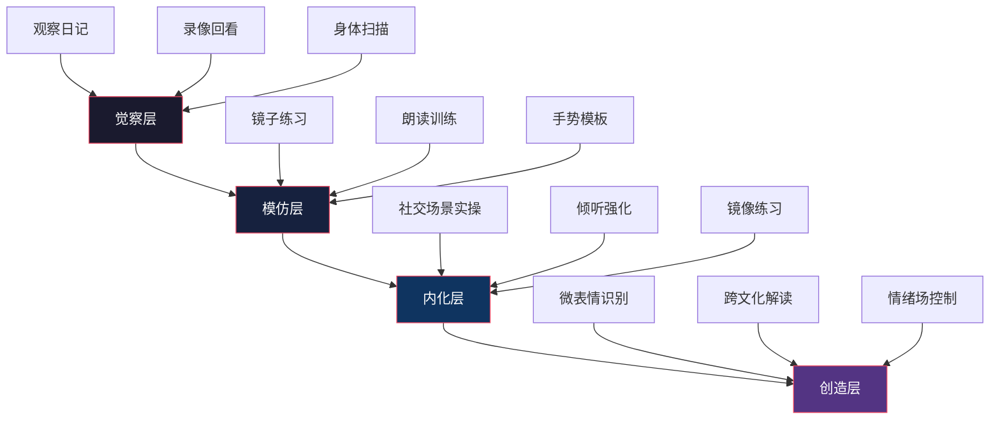

# 第三章 非语言沟通 —— 练习方法

## 引言：刻意练习的力量

非语言沟通能力的提升不是靠"知道"，而是靠"做到"。神经科学研究表明，非语言行为的自动化加工依赖于基底神经节（basal ganglia）和小脑（cerebellum）的程序性记忆系统——这套系统只能通过反复的行为演练来训练，仅靠阅读或思考无法触及。换句话说，你可以读完所有关于手势的书，但如果你从来没有在真实对话中刻意使用过"掌心向上"的接纳手势，你的大脑就不会在需要时自动调用它。

本节基于 Anders Ericsson 的刻意练习理论（Deliberate Practice）构建完整训练体系。刻意练习的四个核心要素是：**明确的改进目标**、**专注的重复练习**、**即时的反馈机制**、以及**逐步提升的难度**。缺失任何一个要素，练习就会退化为无效的重复。

### 练习体系总览

四个层级对应的典型训练周期：

| 层级 | 核心能力 | 训练周期 | 每日投入 | 典型标志 |
|------|----------|----------|----------|----------|
| 觉察层 | 能识别自己和他人的非语言信号 | 第1-4周 | 15-20分钟 | 录像回看时能准确描述自己的习惯 |
| 模仿层 | 能刻意使用特定的非语言行为 | 第5-12周 | 20-30分钟 | 能在镜子前流畅执行10种核心手势 |
| 内化层 | 在真实社交中自然运用技巧 | 第13-24周 | 15分钟（维护） | 紧张时仍能保持开放姿态 |
| 创造层 | 根据情境灵活组合、创新表达 | 第25周起 | 按需 | 能用非语言手段主动塑造对话氛围 |

---

## 一、觉察层练习：看见"看不见的"

觉察是非语言沟通训练的起点。多数人对自己的非语言行为处于"无意识无能"状态——既不知道自己在做什么，也不知道这样做有什么影响。觉察层练习的目标是将你推进到"有意识无能"阶段：你能看到问题了，虽然还改不了，但改变已经开始发生。

### 1.1 非语言观察日记

**练习目的**：训练"非语言注意力"——把大脑从"只听内容"切换到"同时观察信号"。

**科学原理**：人类大脑存在"语言优势效应"（verbal overshadowing），即语言信息会压制非语言信息的加工。观察日记的作用是通过刻意练习逆转这种效应，让非语言通道成为你注意力的默认配置之一。

**练习频率**：每天1次，每次10分钟。

**练习方法**：

选择一个观察场景（地铁上的陌生人、咖啡厅里的同事、电视访谈节目），放下手机，进行纯观察。按照以下框架记录：

**观察框架——MESA模型**：

| 维度 | 英文 | 观察内容 | 示例 |
|------|------|----------|------|
| M — 动作 | Movement | 姿态、手势、头部动作、身体朝向 | "说话时身体微微后仰，双手交叉在胸前" |
| E — 表情 | Expression | 面部表情、眼神方向、眉毛状态 | "嘴角上扬但眼轮匝肌未收缩（社交微笑）" |
| S — 声音 | Sound | 语速、音量、音调、停顿、填充词 | "回答问题时语速加快，音调升高半个八度" |
| A — 空间 | Area | 人际距离、身体接触、空间占据 | "始终与对方保持约1.2米距离，未有任何触碰" |

**记录模板**：

日期：____  时间：____  场景：____
观察对象：____（关系/身份：____）

M（动作）：_____________________________________________________
E（表情）：_____________________________________________________
S（声音）：_____________________________________________________
A（空间）：_____________________________________________________

综合解读：我认为这个人的真实状态是__________，因为__________
（至少给出3个信号支持你的解读）

事后验证（如果可能）：___________________________________________

**进阶要求**：

- **第1-2周**：只观察陌生人，降低社交压力
- **第3-4周**：观察认识的人，事后验证解读准确率
- **第5-8周**：开始关注"信号簇"（cluster）而非单一信号，比如"皱眉+后仰+交叉手臂"比单一的"皱眉"更有说服力
- **第9周起**：尝试在对话进行中实时读取对方的非语言信号（这比旁观难得多）

**常见错误**：

| 错误 | 为什么是错的 | 纠正方法 |
|------|-------------|----------|
| 只看表情不看身体 | 身体比面部更难伪装，信息更可靠 | 强迫自己先从脚/手开始观察，最后才看脸 |
| 单一信号定结论 | 任何单一信号都可能有多种解释 | 坚持"至少3个一致信号才下结论"原则 |
| 用"我觉得"代替观察 | 混淆了观察和投射 | 严格区分"我看到"和"我认为"两栏 |
| 记录太笼统 | "他看起来很紧张"不是有效记录 | 必须写具体行为："右手无名指反复摩擦拇指" |

### 1.2 "无声电视"练习

**练习目的**：在剥离语言内容的条件下，强制你的大脑只用非语言通道解码人际互动。

**练习频率**：每周2-3次，每次15-20分钟。

**练习方法**：

1. 选择内容类型（难度递增）：
   - **入门**：脱口秀/访谈节目（情绪外露，容易读取）
   - **进阶**：职场剧/商战剧（涉及权力动态和隐藏情绪）
   - **高级**：纪录片/新闻辩论（需要区分表演性和真实性）
2. 静音观看5-10分钟片段
3. 暂停，用MESA模型记录每个关键人物的非语言状态
4. 对每个人物写下你的判断：
   - 他们之间的关系是什么？（亲密/疏远/对抗/合作）
   - 谁更自信？谁更紧张？
   - 有没有"言行不一致"的时刻？
5. 回放有声版本验证

**评分标准**：

| 准确度 | 判定 |
|--------|------|
| 关系判断正确 + 情绪判断正确 + 至少1个言行不一致被发现 | 优秀 |
| 关系判断正确 + 情绪判断基本正确 | 良好 |
| 关系判断正确，情绪判断偏差较大 | 及格 |
| 关系和情绪判断均偏差较大 | 需继续练习 |

**跨文化版本**：选择不同国家的影视作品，注意以下文化差异点：

- **眼神接触**：东亚文化中长时间直视可能被视为冒犯，而北欧文化中则被视为真诚
- **空间距离**：拉丁美洲和中东文化的人际距离明显小于北欧和东亚
- **触碰规范**：同性朋友之间的肢体接触在不同文化中有截然不同的含义
- **手势**：同一个手势在不同文化中可能意味着完全不同的事情（如竖起大拇指在中东部分地区是冒犯性的）

### 1.3 "情绪快照"练习

**练习目的**：训练快速捕捉和命名非语言信号的能力——这是实时社交中必须具备的速度。

**练习频率**：每天3-5次，每次30秒。

**练习方法**：

在日常生活中，每当你和一个人开始互动时，在最初的3秒内做一次"情绪快照"——快速扫描并回答三个问题：

1. **TA的面部整体能量是高还是低？**（高=活跃/兴奋，低=疲惫/低落）
2. **TA的身体是开放的还是封闭的？**（开放=朝向你、手臂展开，封闭=侧身、交叉手臂）
3. **TA的声音温度是热还是冷？**（热=音调高、语速快、有起伏，冷=音调低、语速慢、平坦）

这三个维度分别对应心理学家 Albert Mehrabian 提出的情感传递三要素的简版：表情、体态、声音。3秒判断虽然粗略，但在真实社交中，你没有时间做精细分析——你需要一个快速的"第一读数"，然后在对话过程中不断修正。

---

## 二、模仿层练习：用身体"编程"大脑

模仿层的核心逻辑是：先学会"做对"，再学会"做自然"。这个阶段你会感觉不自在、做作、像在演戏——这完全正常。大脑的运动皮层正在建立新的神经通路，就像学骑自行车时一开始需要刻意思考每一个动作。

### 2.1 录像回看练习

**练习目的**：建立客观的"自我非语言画像"——你对自己的印象和实际情况之间往往存在显著偏差。

**练习频率**：每周1次，每次20-30分钟。

**为什么必须录像而不是照镜子**：镜子中的你是实时的、可调整的，你会不自觉地修正自己的表情和姿态。录像是"冻结的时间切片"，它暴露的是你不知道自己在做的那些事——咬嘴唇、频繁眨眼、用手指敲桌子、说话时头不自觉地偏向一侧。

**练习方法**：

用手机录制以下4个场景（每个2-3分钟）：

**场景A：模拟自我介绍**
- 假设你在行业聚会上向一个新认识的人介绍自己
- 保持自然，不要刻意表演

**场景B：解释一个你熟悉的复杂概念**
- 向"完全不懂的人"解释（如向父母解释你的工作）
- 这会暴露你在压力下的非语言习惯

**场景C：模拟一次不同意的表达**
- 想象你在会议上反对一个提案
- 愤怒/不同意是很难伪装的情绪，最能暴露真实习惯

**场景D：自然对话**
- 和朋友视频通话时征得同意后录制
- 这是"最低伪装"的场景

**三遍观看法**：

| 轮次 | 关闭什么 | 关注什么 | 记录要点 |
|------|----------|----------|----------|
| 第1遍 | 关声音，只看画面 | 姿态、手势、面部表情、小动作 | 我的默认姿态是什么？有什么重复出现的小动作？ |
| 第2遍 | 遮画面，只听声音 | 语速、音量、音调变化、停顿、填充词 | 我的填充词频率是多少？语速是否均匀？ |
| 第3遍 | 音画同看 | 语言和非语言的同步性 | 我在说什么的时候非语言信号会变化？有没有言行矛盾？ |

**自我评估表**：

| 评估维度 | 1分（差） | 3分（中等） | 5分（优秀） | 我的评分 |
|----------|-----------|-------------|-------------|----------|
| 眼神接触 | 几乎不看镜头/对方 | 有规律但不自然 | 稳定、温暖、自然 | __ |
| 姿态 | 驼背/僵硬/晃动 | 基本端正但偶尔松懈 | 挺拔而放松 | __ |
| 手势 | 没有或过多/杂乱 | 有但不精准 | 自然、清晰、与内容配合 | __ |
| 面部表情 | 僵硬或表情单一 | 有变化但不够丰富 | 生动、真实、与内容同步 | __ |
| 声音 | 平板/太快/太慢/含糊 | 基本清晰但缺少变化 | 富有节奏感、重点突出 | __ |
| 填充词 | 每句都有"嗯""啊" | 偶尔出现 | 几乎没有或用停顿替代 | __ |
| 整体一致性 | 言行明显矛盾 | 基本一致 | 高度一致、互相增强 | __ |

总分在7-14分之间：觉察层还没完成，先继续做观察练习。
总分在15-24分之间：模仿层的核心训练对象，重点关注最低分项目。
总分在25-35分之间：可以进入内化层，在真实社交中检验。

### 2.2 镜子练习系统

镜子练习的优势是"即时反馈"——你可以同时做动作和观察，实时调整。

**每日基础版（5分钟）**：

| 时间 | 练习内容 | 具体要求 |
|------|----------|----------|
| 第1分钟 | 默认表情检查 | 观察自己不做任何表情时的"脸"。大多数人以为自己面无表情，实际上可能眉头微皱、嘴角下垂。你的默认表情就是你与世界互动的"默认设置"。 |
| 第2分钟 | 微笑校准 | 练习3种微笑：社交微笑（嘴角上扬，礼貌但浅）、真诚微笑（眼轮匝肌参与，眼角出现鱼尾纹）、温暖微笑（嘴角微张，带有邀请感）。注意区分它们在镜中的样子。 |
| 第3分钟 | 眼神质感 | 练习3种眼神：自信的（稳定的直视，下巴微抬）、关切的（微微倾斜头部，眉毛轻抬）、认真的（目光聚焦，略微眯眼）。 |
| 第4分钟 | 姿态重置 | 深吸一口气，肩膀向后向下沉，下巴微收，感受脊柱自然挺直。呼气后保持这个姿态。 |
| 第5分钟 | 动态表情 | 对着镜子讲一段话（如今天计划），观察自己的表情是否"活"——是否随着内容自然变化。 |

**重要场合前置版（额外5分钟）**：

在面试、演讲、重要会面前，用镜子预演你最可能用到的非语言场景：
- 进入房间时的姿态和表情
- 握手时的眼神和微笑
- 被提问时的"思考姿态"（微微仰头、手托下巴）
- 说"我不同意"时的表情管理

### 2.3 身体扫描与紧张释放

**练习目的**：识别并消除习惯性身体紧张——这些紧张会通过非语言信号传递焦虑和防御感。

**科学原理**：身体的慢性紧张模式与情绪记忆密切相关。长期压力会导致特定肌肉群（如斜方肌、咬肌、胸锁乳突肌）形成"默认收缩"状态，这种状态会在沟通中不自觉地传递紧张信号。

**练习频率**：每天1次，每次5-10分钟（睡前最佳）。

**标准流程**：

第1步：平躺或坐姿，闭眼，3次深呼吸
第2步：从头顶开始，逐区域扫描（每个区域停留15-30秒）：

  头部区域：
  ├── 额头 → 是否有横向皱纹？（焦虑信号）
  ├── 眉间 → 是否有竖纹？（紧皱眉头 = 不满/困惑）
  ├── 眼睛周围 → 是否紧绷？（紧张/不信任）
  ├── 下颚 → 是否咬紧？（压抑愤怒/焦虑）
  └── 舌头 → 是否顶住上颚？（潜意识的自我抑制）

  躯干区域：
  ├── 肩膀 → 是否耸起？（防御/压力）
  ├── 胸腔 → 呼吸是否浅？（焦虑/紧张）
  ├── 腹部 → 是否紧绷？（核心紧张 = 整体不安）
  └── 后背 → 是否僵硬？（控制欲/不安全感）

  四肢区域：
  ├── 双手 → 是否握拳或手指交缠？（焦虑/紧张）
  ├── 腿部 → 是否交叉或僵硬？（防御/不自在）
  └── 脚部 → 是否抓地？（不安/想逃离）

第3步：对每个紧张区域，想象呼气时该区域"融化"
第4步：全身感受一次完整的放松状态

**进阶应用**：在重要对话前做"快速扫描版"（30秒）——闭眼2秒，从头到脚快速过一遍，找到最紧张的部位，做3次针对那个部位的放松呼吸。这个习惯可以在高压场景中显著改善你的非语言表现。

### 2.4 声音基础训练

声音是非语言沟通中最容易被忽视、但改变最快（通常2-4周即可见效）的维度。

**腹式呼吸训练**：

声音的质量取决于气息的支撑。大多数人使用胸式呼吸（浅而快），导致声音不稳定、容易紧张时声音发颤。

| 练习步骤 | 说明 |
|----------|------|
| 感受呼吸 | 一只手放胸口，一只手放腹部。吸气时只有腹部的手应该上升。 |
| 4-7-8呼吸法 | 吸气4秒 → 屏息7秒 → 呼气8秒。重复4次。 |
| "嘶"字延长 | 深吸一口气，用"嘶——"音均匀缓慢地呼出，目标持续20秒以上。 |
| 数数练习 | 一口气数"1、2、3……"，目标一次数到30以上不中断。 |

**语速控制训练**：

| 语速 | 适用场景 | 练习方法 |
|------|----------|----------|
| 快（180-200字/分钟） | 激励、煽动、故事高潮 | 朗读新闻播报稿件，配合节拍器 |
| 中（140-160字/分钟） | 日常对话、一般叙述 | 正常朗读文章，用手机计时 |
| 慢（100-120字/分钟） | 重要观点、情感表达、权威陈述 | 刻意放慢，每个字都清晰发音 |

**音调起伏训练**：

选一段50字左右的陈述句，用以下方式各朗读一遍：

1. **平调版**：从头到尾一个音调，感受"机器人"效果
2. **夸张版**：在关键词上大幅提高或降低音调，感受"演说家"效果
3. **自然版**：在关键信息上适度变化，找到你自己的舒适区间

**填充词消除训练**：

"嗯""啊""那个""就是说"等填充词是大脑在搜索下一个词时的"占位符"。消除它们的核心方法不是"不要说"，而是用"停顿"替代。

| 阶段 | 方法 | 时长 |
|------|------|------|
| 意识阶段 | 请朋友在你使用填充词时敲桌子/举牌 | 1周 |
| 替代阶段 | 每次想说"嗯"时闭嘴2秒 | 2周 |
| 巩固阶段 | 录音自己的日常对话，统计填充词频率 | 持续 |
| 目标 | 每分钟对话中填充词不超过1个 | — |

### 2.5 核心手势库

手势是语言的"视觉伴奏"。研究显示，使用手势的演讲者被认为比不使用手势的演讲者更有说服力、更热情、更自信（Hostetter, 2011）。但手势不是越多越好——关键在于精准和时机。

**10种核心手势及其功能**：

| 编号 | 手势名称 | 动作描述 | 使用场景 | 注意事项 |
|------|----------|----------|----------|----------|
| 1 | 列举手势 | 伸出手指逐个计数 | "有三个原因……" | 手指从食指开始，不是大拇指 |
| 2 | 比较手势 | 双手分别代表两个选项 | "A方案和B方案的区别" | 双手保持在同一水平线 |
| 3 | 大小手势 | 双手间距表示程度 | "非常大的差距" | 间距与描述的夸张程度匹配 |
| 4 | 排斥手势 | 掌心向外，双手前推 | "这不可能""拒绝" | 慎用——容易被解读为敌意 |
| 5 | 接纳手势 | 掌心向上，双手微张 | "欢迎""请说""我很乐意" | 这是最友好的手势之一 |
| 6 | 强调手势 | 握拳或单手有力下压 | "这一点至关重要" | 不要频繁使用——每次演讲2-3次即可 |
| 7 | 指引手势 | 整个手掌朝向某方向 | "请看这里""请往那边走" | 永远不用食指指——掌心朝上引导 |
| 8 | 连接手势 | 双手指尖相触或合十 | "让我解释这两者的关系" | 轻触即可，不要用力挤压 |
| 9 | 时间手势 | 手掌水平移动表示时间线 | "过去……现在……未来" | 从左到右（符合多数文化的时间方向） |
| 10 | 框架手势 | 双手在空中"画框" | "关键问题是这个" | 用于聚焦注意力，不常用但效果强 |

**手势练习流程**：

1. **镜子初练**（第1周）：对镜子逐一练习10种手势，每种10次
2. **配合语言**（第2周）：选择一段3分钟的演讲内容，在需要的位置标记手势，对着镜子练习
3. **录像检验**（第3周）：录像后观察手势是否自然、时机是否准确、是否有多余动作
4. **场景实操**（第4周）：在真实对话中尝试使用2-3种手势

**常见手势误区**：

| 误区 | 为什么是错的 | 正确做法 |
|------|-------------|----------|
| 双手插兜 | 传递"我不在意"或"我在隐藏什么" | 至少一只手放在可见位置 |
| 说话时指指点点 | 食指指人是攻击性手势，全球通用 | 用整个手掌引导方向 |
| 手势低于腰部 | 对方看不见，效果为零 | 手势保持在腰部到肩部之间 |
| 手势过快过碎 | 让人眼花缭乱，分散注意力 | 每个手势停留1-2秒再收回 |
| 双手背后 | 传递距离感和权威感（适合巡检，不适合社交） | 双手自然垂放或使用手势 |

---

## 三、内化层练习：在真实世界中"裸奔"

从镜子前到真实社交，就像从游泳池到大海——水是一样的，但环境完全不同。内化层练习的目标是：在无法控制的社交环境中，仍然能自然运用非语言技巧。

### 3.1 眼神接触系统训练

眼神接触是非语言沟通中最强大、也最容易出错的单一要素。过多的眼神接触让人感到被凝视（aggressive），过少让人感到被忽视（dismissive）。

**三角扫描法**：

不要死盯着对方的瞳子——在对方的左眼、右眼、嘴巴之间形成的三角区域内缓慢移动视线。这个技巧让你的眼神看起来是"关注"而不是"凝视"。

| 参数 | 建议值 | 说明 |
|------|--------|------|
| 每次注视时长 | 3-5秒 | 低于3秒显得闪躲，超过7秒变成凝视 |
| 视线移动速度 | 缓慢、自然 | 快速游移传递焦虑 |
| 倾听时 vs 说话时 | 倾听时70%，说话时50% | 人在思考下一句话时自然会减少眼神接触 |
| 三角区域 | 左眼→右眼→嘴→左眼 | 循环但不规律——规律的机械运动会暴露 |

**分级练习计划**：

| 周次 | 练习对象 | 目标 |
|------|----------|------|
| 第1-2周 | 镜子中的自己 | 感受"舒服的注视时长"是几秒 |
| 第3-4周 | 家人/亲密朋友 | 在日常对话中刻意保持三角扫描 |
| 第5-6周 | 同事/一般熟人 | 在工作场景中保持适度眼神接触 |
| 第7-8周 | 陌生人（店员、快递员） | 在短暂互动中自然保持眼神 |
| 第9周起 | 所有人 | 在压力场景（面试、争论）中保持 |

**群体场景——"灯塔法"**：

在面对多人讲话时（会议发言、小组讨论），用"灯塔法"分配眼神：

1. 把听众想象成钟面上的刻度
2. 均匀地"扫过"不同区域
3. 在每个人脸上停留2-3秒
4. 关键：当某人正在回应你的话时，给予他/她更多的眼神接触

**练习场景**：每周在至少一次小组会议中练习灯塔法，会后记录反馈。

### 3.2 姿态与能量管理

你的姿态不仅影响别人对你的看法，还反过来影响你自己的心理状态——这就是"具身认知"（Embodied Cognition）效应。

**高能量姿态练习**：

Amy Cuddy 在哈佛大学的研究显示，保持2分钟的"扩展性姿态"（expansive posture）可以提高睾酮水平（与自信相关）约20%，降低皮质醇水平（与压力相关）约25%。

**5种高能量姿态**：

| 姿态 | 描述 | 适用场景 |
|------|------|----------|
| 超人站姿 | 双脚与肩同宽，双手叉腰，下巴微抬 | 演讲前、面试前 |
| 胜利V字 | 双臂向上举成V字，面朝天空 | 完成一个里程碑后 |
| 门框撑 | 双手撑在门框两侧，身体前倾 | 会议前进门之前 |
| 扩展坐姿 | 坐下时手臂搭在旁边椅背上，双腿不交叉 | 等待面试时 |
| 演讲者姿态 | 双脚稳定站立，双手自然展开 | 任何需要表达权威的时刻 |

**练习方法**：每天早起后选1种高能量姿态保持2分钟。重要场合前找私密空间做2分钟。

**日常姿态基准线**：

| 场景 | 标准姿态 | 常见错误 |
|------|----------|----------|
| 站立 | 后脑勺、肩胛骨、臀部、脚后跟四点一线 | 骨盆前倾（腹部前突）或驼背 |
| 坐着 | 臀部坐满椅背，双脚平放地面 | 瘫在椅子里或只坐椅面边缘 |
| 走路 | 抬头、目视前方、肩膀下沉、手臂自然摆动 | 看手机低头走路、肩膀耸起 |
| 倾听 | 身体正面朝向对方，微微前倾 | 侧身对着对方（传递"我想离开"） |

**靠墙校准练习**（每天1次，1分钟）：

背靠墙站立，确保后脑勺、肩胛骨、臀部、小腿肚、脚后跟全部接触墙面。保持30秒，感受这个"挺直"的身体感觉。然后离开墙壁，尽量保持同样的身体感觉走动。这个练习建立的是你身体对"正确姿态"的肌肉记忆。

### 3.3 社交场景实战

#### 3.3.1 "电梯社交"——快速第一印象

**练习频率**：每周3-5次（任何短暂社交场合）。

**练习方法**：

在电梯、咖啡厅排队、出租车后座等场景中，向陌生人发起10-30秒的微对话。重点不是对话内容，而是练习你的非语言"开场"：

| 阶段 | 时间 | 非语言要点 |
|------|------|------------|
| 进入 | 0-2秒 | 微笑 + 眼神接触 + 微微点头 |
| 开口 | 2-5秒 | 开放姿态（手臂不要交叉）、身体朝向对方 |
| 交流 | 5-20秒 | 保持适度眼神接触、语调温暖、表情配合 |
| 结束 | 20-30秒 | 微笑 + "谢谢/再见" + 自然转身离开 |

**进阶目标**：能从对方最初的3秒非语言反应判断他们是"愿意聊"还是"不想被打扰"，并据此调整。

#### 3.3.2 "倾听强化"——SOLER模型

Michael Egan 提出的 SOLER 模型是倾听中非语言反馈的黄金框架：

| 字母 | 全称 | 含义 | 练习要点 |
|------|------|------|----------|
| S | Squarely | 正面朝向对方 | 身体正面（不是肩膀，是肚脐方向）对准说话者 |
| O | Open | 开放姿态 | 不交叉手臂和腿，双手放在可见位置 |
| L | Lean | 适度前倾 | 前倾10-15度，传递"我在认真听" |
| E | Eye Contact | 保持眼神接触 | 倾听时保持70%以上的眼神接触 |
| R | Relax | 放松自然 | 不要僵硬，保持自然的放松状态 |

**每日练习**：在每次超过5分钟的对话中，刻意检查自己是否满足SOLER的5个要素。用手机备忘录做简单的打卡记录。

**进阶练习——"等待2秒"规则**：

在对方说完一句话后，等2秒再回应。这2秒的停顿产生三个效果：
1. 确保对方真的说完了（避免打断）
2. 让对方感到你真的在思考他说的话
3. 给你的回应更多思考时间，质量更高

#### 3.3.3 "镜像"练习——建立默契的隐形桥梁

**科学原理**：镜像神经元（mirror neurons）是大脑中一类特殊的神经细胞，当你看到别人做一个动作时，它们会像你自己在做这个动作一样激活。当两个人的非语言行为趋于同步时，双方都会感到更强的信任感和连接感。

**练习方法**：

| 阶段 | 操作 | 注意 |
|------|------|------|
| 观察（持续） | 注意对方的：姿态重心、手势频率、语速语调、呼吸节奏 | 不要盯着看——用余光和偶尔的扫视 |
| 匹配（延迟2-3秒） | 自然地调整自己的行为使其与对方趋同 | 延迟很重要——同步太明显会让人不舒服 |
| 引导（建立匹配后） | 小幅改变自己的状态，观察对方是否跟随 | 如果对方跟随了你，说明镜像已建立 |
| 验证 | 整体对话的舒适度和信任感是否有提升 | 这是一个长期技能，需要2-3个月才能自然化 |

**镜像的禁区**：

- **不要复制明显的习惯动作**：如果对方摸鼻子，你也摸鼻子——这太明显了
- **不要在冲突场景中使用**：镜像是建立信任的工具，不是操控手段
- **不要在对方情绪低落时镜像低能量**：你应该适度提升能量来帮助对方

#### 3.3.4 "破冰行动"——主动社交挑战

**练习频率**：每周1次。

**练习方法**：

1. 选择一个社交场景：行业聚会、兴趣小组、社区活动、朋友的朋友聚会
2. 设定具体目标（根据你的水平）：
   - 初级：和3个陌生人进行30秒以上的交流
   - 中级：和3个人进行3分钟以上的对话
   - 高级：和1个人进行15分钟以上的深入对话
3. 实战中重点练习：
   - 加入对话小组的非语言技巧：先站到小组边缘，保持微笑和倾听姿态，等一个自然的间隙加入
   - 主动微笑和眼神接触
   - 适时的点头和表情反馈
4. 事后复盘（当天晚上完成）：

破冰行动复盘记录
日期：____  场景：____

成功时刻：_______________________________________________
  非语言因素是什么：_____________________________________

失败时刻：_______________________________________________
  非语言因素是什么：_____________________________________

对方给我印象最深的非语言信号：_____________________________
下次可以改进的点：_______________________________________

---

## 四、高级练习：读懂"水面下的冰山"

### 4.1 微表情识别训练

**什么是微表情**：微表情是持续时间仅为 1/25 到 1/5 秒的极短暂面部表情，通常在人试图隐藏真实情绪时出现。Paul Ekman 的研究确认了7种跨文化的微表情：快乐、悲伤、恐惧、愤怒、惊讶、厌恶、轻蔑。

**训练工具**：

| 工具 | 类型 | 说明 |
|------|------|------|
| Micro Expression Training Tool (METT) | 付费软件 | Paul Ekman Group 出品，公认最权威 |
| Subtle Expression Training Tool (SETT) | 付费软件 | 训练识别微弱（非极端）表情变化 |
| Humintell | 网站/APP | 提供在线微表情训练课程 |
| 电视辩论/真人秀 | 免费 | 实战素材——政客和谈判者最常出现微表情 |

**练习流程**：

1. **基础训练**（第1-2周）：每天15分钟，使用METT学习识别7种基本微表情
2. **速度训练**（第3-4周）：将识别时间缩短——看到面部的瞬间就能判断
3. **实战应用**（第5周起）：在真实对话中尝试识别微表情
4. **综合解读**（第8周起）：将微表情与语境、其他非语言信号结合解读

**重要提醒**：微表情识别不是"读心术"。单个微表情只能告诉你这个人"在某个瞬间有一种情绪闪现"，不能告诉你原因，也不能作为判断人的依据。它是需要和其他信号一起解读的数据点，不是结论。

### 4.2 "情绪场"控制练习

**练习目的**：学会用自身的非语言能量主动影响周围人的情绪状态。

**科学原理**：情绪传染（emotional contagion）是一种自动化的、无意识的过程——人们会不自觉地模仿周围人的面部表情、身体姿态和声音特质，进而"感染"对方的情绪（Hatfield et al., 1993）。这意味着你可以通过控制自己的非语言输出来影响整个社交场景的氛围。

**实验一：正向能量场**

1. 选择一个日常场景（办公室、家庭晚餐、朋友聚会）
2. 在进入场景前，用2分钟调整自己的状态：
   - 微笑（真诚微笑，嘴角+眼睛都参与）
   - 开放姿态
   - 语调温暖、音量适中偏高
3. 进入场景后，保持这种状态15分钟
4. 观察周围人的变化：是否有人开始微笑？对话的氛围是否有变化？
5. 记录观察

**实验二：能量同步与引导**

1. 在对话中，先将自己的能量水平降低到对方的水平（镜像）
2. 保持1-2分钟建立同步
3. 然后逐步提升你的能量（微笑增加、语速略微加快、音调略微提高）
4. 观察对方是否跟随你的能量变化
5. 这个技巧在以下场景特别有用：
   - 安慰一个低落的朋友（先降到他的能量，再慢慢拉高）
   - 激励一个消极的团队成员
   - 缓解紧张的会议气氛

**实验三：场景氛围塑造**

1. 选择一个你有影响力的场景（如你主持的会议）
2. 设定你想要的氛围基调：轻松活跃 / 严肃认真 / 创意开放
3. 通过以下维度塑造氛围：

| 目标氛围 | 姿态 | 表情 | 声音 | 空间使用 |
|----------|------|------|------|----------|
| 轻松活跃 | 靠后、偶尔走动 | 频繁微笑 | 语速中偏快、音调有起伏 | 在房间内移动，缩短距离 |
| 严肃认真 | 身体前倾、稳定 | 表情克制 | 语速慢、停顿多、低音量 | 固定位置，保持距离 |
| 创意开放 | 手势丰富、姿态多变 | 兴奋/好奇的表情 | 语速变化大、常用问句 | 随意走动，有时靠近 |

### 4.3 跨文化非语言沟通

在全球化工作环境中，非语言沟通的文化差异可以导致严重的误解。

**关键文化维度对比**：

| 维度 | 高语境文化（东亚、中东、拉美） | 低语境文化（北美、北欧、德语区） |
|------|------|------|
| 眼神接触 | 适度即可，长时间直视可能冒犯 | 直接、稳定的眼神接触=真诚和自信 |
| 人际距离 | 较近（0.5-1米） | 较远（1-1.5米） |
| 身体触碰 | 同性之间较频繁 | 较少，握手即可 |
| 手势幅度 | 较小、含蓄 | 较大、外放 |
| 情感表达 | 内敛、含蓄 | 直接、外露 |
| 点头 | 可能只是"我在听"，不是"我同意" | 通常意味着同意 |

**练习方法**：

1. 观看来自目标文化的影视作品，注意以上维度
2. 与来自该文化的朋友交流，直接询问："在你们文化中，如果我做XX，会被怎么理解？"
3. 在跨文化场景中，遵循一条铁律：**当不确定时，选择更保守的非语言行为**（更少的身体接触、更远的距离、更克制的表情），然后观察对方的反应来调整。

---

## 五、练习计划与进度管理

### 5.1 每日练习计划（15-20分钟）

| 时段 | 练习内容 | 时长 | 阶段适用 |
|------|----------|------|----------|
| 早间 | 镜子微笑和表情练习 | 2分钟 | 全阶段 |
| 早间 | 高能量姿态 | 2分钟 | 全阶段 |
| 早间 | 身体扫描快速版 | 1分钟 | 全阶段 |
| 日间 | SOLER倾听 + 情绪快照 | 持续 | 内化层起 |
| 日间 | 三角扫描眼神接触 | 持续 | 模仿层起 |
| 晚间 | 非语言观察日记 | 5分钟 | 觉察层 |
| 晚间 | 声音朗读练习 | 5分钟 | 模仿层 |
| 晚间 | 当日复盘记录 | 3分钟 | 全阶段 |

### 5.2 每周练习计划

| 日期 | 主题 | 练习项目 | 时长 |
|------|------|----------|------|
| 周一 | 自我觉察 | 录像回看练习 + 自评打分 | 25分钟 |
| 周二 | 眼神与表情 | 镜子眼神练习 + 微表情训练 | 15分钟 |
| 周三 | 姿态与手势 | 靠墙校准 + 镜子手势库练习 | 15分钟 |
| 周四 | 声音 | 腹式呼吸 + 朗读+语调变化 | 15分钟 |
| 周五 | 社交实践 | 电梯社交 + 倾听强化 | 全天融入 |
| 周六 | 综合应用 | 破冰行动 / 社交活动实战 | 1-2小时 |
| 周日 | 反思复盘 | 回顾本周记录、评估进步、制定下周计划 | 20分钟 |

### 5.3 进度追踪表

建议用一个简单的电子表格或纸质笔记追踪以下指标：

第____周  日期：____至____

本周聚焦技能：______________________________________________

练习完成率：____%（实际完成天数 / 计划天数）

录像自评总分变化：上周____分 → 本周____分

填充词频率估计：上周____次/分钟 → 本周____次/分钟

社交实战次数：____次

最成功的一次非语言互动：_____________________________________

需要改进的方面：_____________________________________________

下周重点：__________________________________________________

### 5.4 预期进度里程碑

| 时间节点 | 你应该能达到的水平 |
|----------|-------------------|
| 第2周 | 能在录像回看中准确识别自己的非语言习惯 |
| 第4周 | 在镜子前能流畅使用5种以上核心手势 |
| 第8周 | 在真实对话中能保持SOLER模型的5个要素 |
| 第12周 | 填充词频率降至每分钟1个以下 |
| 第16周 | 能在社交场景中自然运用镜像技巧 |
| 第20周 | 能通过微表情初步判断他人真实情绪 |
| 第24周 | 非语言沟通从"刻意练习"变成"自然习惯" |

**重要**：以上时间节点是基于每天15-20分钟持续练习的估计。跳过练习、三天打鱼两天晒网会显著拉长时间线。

---

## 六、常见问题与排错

### Q1：练习了但感觉越来越不自然怎么办？

这是"能力退化曲线"的正常现象——学习新技能时，你会先经历一个"比以前更差"的阶段，因为你打破了旧的自动化模式，但新的模式还没建立。

**解决方案**：
- 不要同时练习超过2个技能
- 接受"做作感"，继续练习
- 回看你的进步记录，看到趋势是向上的

### Q2：在真实社交中一紧张就忘了所有技巧

**解决方案**：
- 只在紧张时记住一个锚点技巧——建议选择"深呼吸+肩膀下沉"
- 这一个动作就能启动你的放松反应，让其他技巧逐渐回来
- 压力场景前做2分钟高能量姿态预热

### Q3：家人/朋友说我在"表演"

**解决方案**：
- 确认你练习的技巧是否过度——手势太多、微笑太频繁、眼神太强烈
- 减少幅度30%，直到对方不再注意到你在刻意做
- 最终目标是"自然到别人注意不到"，而不是"明显到别人觉得你在表演"

### Q4：练习2个月了看不到效果

**解决方案**：
- 你可能在"觉察层"停留太久而没有进入"模仿层"——每天只写观察日记而不练习具体技能
- 调整计划：减少观察时间，增加练习时间
- 录像对比第1周和第8周的自己——变化可能在你没注意的地方

### Q5：不同场景需要不同的非语言风格，怎么区分？

**解决方案**：
- 建立3个"非语言配置"：
  - **专业模式**：正式姿态、稳定眼神、中等语速、克制表情
  - **社交模式**：放松姿态、温暖眼神、灵活语速、丰富表情
  - **亲密模式**：前倾姿态、深情眼神、低语速、真诚表情
- 每个模式用镜子练习3次，然后在对应场景中切换使用

---

## 本节小结

非语言沟通能力的训练是一个从"无意识无能"到"无意识胜任"的渐进过程，需要经历觉察→模仿→内化→创造四个阶段，典型的全程训练周期为3-6个月。

**关键行动清单**：

1. **今天开始**：做第一次录像回看练习，建立你的"非语言基准线"
2. **第一周**：每天完成早间3项（镜子、高能量姿态、身体扫描）+ 晚间观察日记
3. **第一个月**：完成觉察层全部练习，进入模仿层
4. **第三个月**：能自然运用SOLER模型和至少5种核心手势
5. **第六个月**：非语言沟通成为你的本能反应，无需刻意回忆

记住：练习的目标不是让你变成一个完美的"表演者"，而是让你拥有更丰富的表达工具，更准确地理解他人，最终成为一个更有效、更真诚的沟通者。
