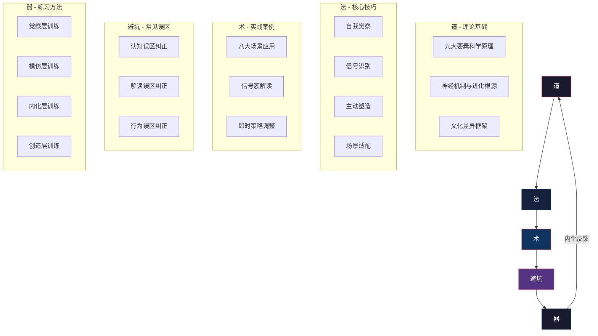
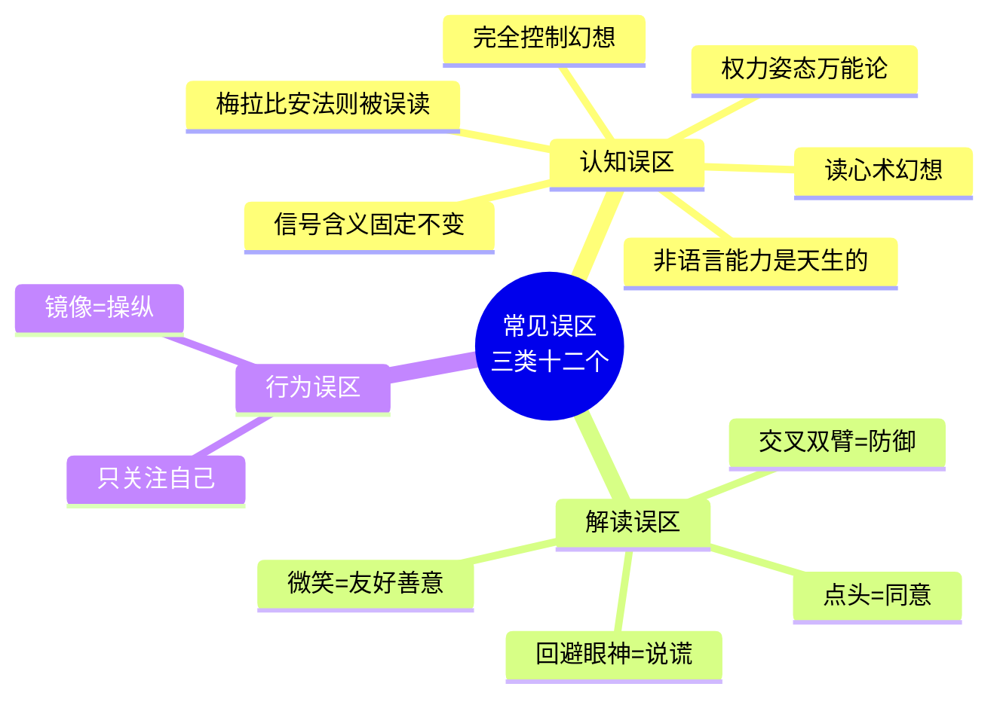

# 第三章 非语言沟通 —— 本章小结

## 引言：从碎片到体系

非语言沟通的学习不应止步于"知道了几个技巧"。本章小结的核心目标，是将你在理论基础、核心技巧、实战案例、常见误区和练习方法五个模块中获得的碎片化知识，整合为一套可迁移、可迭代、可验证的完整能力体系。

如果你只记住本小结的一句话，记住这句：**非语言沟通不是"读心术"，而是一套基于科学观察、情境理解和真诚表达的系统性沟通能力。**

***

## 一、理论基础回顾：九大要素的科学逻辑

### 1.1 为什么是"九大"而非更多或更少

非语言沟通的九大要素——身体语言、面部表情、眼神接触、手势、姿态、空间距离、触摸、声音语调、外貌着装——并非随意划分，而是基于信息传递通道的物理属性来分类的。每个要素对应一种独特的感知通道和神经加工路径：

| 要素 | 感知通道 | 主要脑区 | 可控程度 | 信息泄露风险 |
|------|----------|----------|----------|--------------|
| 面部表情 | 视觉 | 梭状回面孔区（FFA）+ 杏仁核 | 中等（皮层可伪装，边缘系统会泄露） | 高——微表情持续仅1/25~1/5秒 |
| 眼神接触 | 视觉 | 上丘 + 杏仁核 | 较高 | 低——但瞳孔反应不可控 |
| 手势 | 视觉 | 运动皮层 + 布洛卡区 | 高 | 低——手势是高度可控的 |
| 姿态 | 视觉 | 前运动皮层 | 中等 | 中——慢性紧张模式难以隐藏 |
| 空间距离 | 视觉 + 本体感觉 | 前庭系统 + 海马旁回 | 高 | 低——距离调整是有意识的 |
| 触摸 | 触觉 | 体感皮层 + 后岛叶 | 高 | 低——但触摸类型会泄露关系意图 |
| 声音语调 | 听觉 | 颞上回 + 杏仁核 | 中等 | 高——声音比面部更难控制 |
| 外貌着装 | 视觉 | 梭状回 + 纹状体 | 完全可控 | 低——但刻意修饰可能适得其反 |
| 身体语言（综合） | 多通道 | 全脑协同 | 因子项而异 | 因子项而异 |

理解这张表的关键信息是：**越是原始的、本能的信号（面部微表情、声音颤抖、瞳孔放大），越难以有意识控制，因此越能泄露真实情感；越是高级的、社会化的信号（手势、着装、空间距离），越容易有意识管理，因此越适合主动塑造。**

### 1.2 两大神经通路的冲突

贯穿整个非语言沟通体系的核心矛盾，是人类大脑中两套神经系统的博弈：

**皮层通路（有意识控制）**——从大脑皮层出发，负责计划性、策略性的非语言行为。你可以有意识地保持微笑、调整坐姿、使用特定手势。这条通路的优势是可控性强，劣势是需要消耗认知资源，且在高压状态下容易"掉线"。

**边缘系统通路（本能反应）**——从杏仁核出发，负责快速的、自动化的非语言反应。恐惧时瞳孔放大、惊讶时眉毛上扬、厌恶时鼻翼收缩——这些反应的速度（约200毫秒）远快于有意识的控制（约500毫秒以上）。这条通路的优势是速度快且难以伪装，劣势是可能在不恰当的场合泄露真实情感。

**实际影响**：当一个人试图隐藏真实情感时，皮层通路发出"伪装"指令，但边缘系统可能在同一时间产生矛盾的真实信号——这就是微表情的来源。保罗·埃克曼的研究表明，普通人很难察觉微表情，但经过系统训练后识别准确率可以显著提高。

### 1.3 文化维度的不可忽视性

九大要素中，受文化影响最大的三个维度是：

- **空间距离**：接触文化（拉丁美洲、阿拉伯世界）的人际距离显著小于非接触文化（北欧、东亚），差异可达50%以上
- **眼神接触**：在东亚文化中，下属避免长时间直视上级是尊重的表现；在北欧文化中，直接的眼神接触被视为真诚和坦率
- **触摸规范**：同性朋友之间的肢体接触在中东和南欧文化中是常态，在东亚和北美文化中则可能引发不适

**核心原则**：在跨文化场景中，没有"放之四海而皆准"的非语言规则。提前了解对方文化中的非语言规范，是全球化时代的基本素养。

***

## 二、核心技巧回顾：从觉察到运用的四层进阶

### 2.1 自我觉察——一切改变的起点

自我觉察是非语言沟通能力提升的地基。没有觉察，所有技巧都是空中楼阁。

**为什么觉察如此困难？** 因为人类大脑存在"语言优势效应"（verbal overshadowing）——语言信息会压制非语言信息的加工。你在对话中80%的注意力可能都在"听对方说什么"和"想自己要说什么"上，而非语言信号被大脑自动归类为"背景噪音"。

**觉察的核心工具**：

| 工具 | 频率 | 目的 | 关键操作 |
|------|------|------|----------|
| MESA观察日记 | 每日1次，10分钟 | 训练"非语言注意力" | 观察陌生人，记录动作(M)、表情(E)、声音(S)、空间(A) |
| 录像回看 | 每周1次，20-30分钟 | 建立"自我非语言画像" | 录制4个场景，三遍观看法（静音看画面→遮画面听声音→音画同看） |
| 情绪快照 | 每日3-5次，30秒 | 训练快速捕捉能力 | 3秒内回答：面部能量高低？身体开放封闭？声音温度冷热？ |
| 身体扫描 | 每日1次，5-10分钟 | 识别习惯性紧张 | 从头到脚逐区域扫描，找到"默认收缩"的肌肉群 |

**觉察的四个阶段**：

大多数人的非语言行为停留在"无意识无能"阶段——不知道自己在紧张时会频繁摸脖子，不知道自己的默认表情看起来像在生气。觉察练习的目标是将你推进到"有意识无能"阶段：你能看到问题了，虽然还改不了，但改变已经开始发生。

### 2.2 信号识别——读懂他人的真实状态

信号识别的核心原则是**信号簇分析**，而非单一信号解读：

| 维度 | 错误做法 | 正确做法 |
|------|----------|----------|
| 信号数量 | 看到一个信号就下结论 | 至少观察3个一致信号后再形成判断 |
| 基线对比 | 忽略个体差异 | 先观察对方放松状态下的默认模式，再判断偏离程度 |
| 情境考量 | 脱离情境解读 | 将温度、文化、关系、个体差异全部纳入框架 |
| 确定性 | 100%确信自己的判断 | 用概率思维，用提问验证假设 |

**快速信号簇识别框架**——当你观察到以下信号同时出现时，值得高度关注：

- **防御信号簇**：双臂交叉 + 身体后倾 + 回避眼神 + 语调变硬 + 下巴收紧
- **紧张信号簇**：频繁自我触摸 + 坐立不安 + 语速加快 + 填充词增多 + 手脚小动作
- **兴趣信号簇**：身体前倾 + 瞳孔放大 + 频繁点头 + 脚尖朝向你 + 主动缩短距离
- **欺骗信号簇**（仅作参考，准确率约54%）：语言犹豫 + 微表情泄露 + 声音变化 + 自我触摸增加 + 言行不一致

### 2.3 主动塑造——有意识地管理你的非语言形象

主动塑造不是"表演"，而是**让你的内在状态通过最优的非语言通道表达出来**。

**声音维度**——改变最快（2-4周即可见效），效果最显著的维度：

| 参数 | 日常对话 | 权威陈述 | 情感连接 |
|------|----------|----------|----------|
| 语速 | 140-160字/分钟 | 100-120字/分钟 | 根据情感节奏变化 |
| 音量 | 中等，自然 | 略低，沉稳 | 随情感起伏 |
| 音调 | 自然起伏 | 低沉，变化少 | 丰富变化 |
| 停顿 | 自然的语法停顿 | 关键观点前后停顿2-3秒 | 情感停顿，给对方反应空间 |

**姿态维度**——通过具身认知效应影响心理状态：

- **高能量姿态**（演讲前、面试前）：双脚与肩同宽，双手叉腰，下巴微抬，保持2分钟
- **倾听姿态**（SOLER模型）：正面朝向(S)、开放姿态(O)、适度前倾(L)、保持眼神(E)、放松自然(R)
- **权威姿态**（会议发言）：稳定站立，双手自然展开在腰部以上区域，手势保持1-2秒

**手势维度**——10种核心手势构成你的"视觉伴奏库"：

| 手势 | 功能 | 最佳使用时机 |
|------|------|--------------|
| 列举手势（伸出手指） | 组织信息，帮助记忆 | "有三个原因……" |
| 比较手势（双手分列） | 对比两个选项 | "A和B的区别在于……" |
| 接纳手势（掌心向上） | 传递友好和开放 | "请说""我很乐意" |
| 强调手势（握拳/下压） | 突出关键信息 | "这一点至关重要" |
| 框架手势（空中画框） | 聚焦注意力 | "关键问题是这个" |

### 2.4 场景适配——没有万能公式

非语言沟通的核心挑战在于：同样的动作在不同场景中可能有完全相反的含义。场景适配的框架如下：

| 场景类型 | 核心非语言策略 | 关键禁忌 |
|----------|----------------|----------|
| 正式商务 | 挺拔姿态、稳定眼神、低频手势、控制语速 | 过度随意、频繁自我触摸 |
| 亲密关系 | 渐进缩短距离、温暖微笑、适度触碰、丰富表情 | 刻意的"表演感"、忽视对方的舒适度信号 |
| 冲突场景 | 保持距离、控制音量、减少攻击性手势、使用停顿 | 身体前倾过近、用手指指人、语速过快 |
| 公开演讲 | 空间移动、灯塔式眼神、手势框架、停顿的力量 | 双手插兜、频繁看稿、背对观众 |
| 跨文化交流 | 提前了解规范、降低信号强度、观察对方反应、保持谦逊 | 假设自己的规则是通用的 |

***

## 三、实战场景回顾：八大领域的关键洞察

### 3.1 场景应用速查表

| 场景 | 核心非语言挑战 | 最关键的1-2个技巧 | 最常见的错误 |
|------|----------------|-------------------|--------------|
| 求职面试 | 7秒内建立第一印象 | 开放姿态 + 稳定眼神接触 | 过度紧张导致小动作爆发 |
| 公开演讲 | 控场力与感染力 | 空间移动 + 停顿的力量 | 手势低于腰部或过于碎乱 |
| 约会社交 | 渐进建立亲密感 | 距离缩短的节奏感 + 真诚微笑 | 进攻过快或过于被动 |
| 商务谈判 | 解读真实立场 | 沉默的力量 + 信号簇分析 | 被表面的友善信号迷惑 |
| 销售场景 | 识别购买信号 | 并排策略 + 触觉体验 | 只关注自己的表达而忽略客户反应 |
| 领导力 | 情绪传染与稳定 | 危机时的沉着 + 日常非语言认可 | 在压力下泄露焦虑信号 |
| 社交场景 | 优雅加入群体 | 开放姿态 + 关注平衡 | 侧身对着想加入的群体 |
| 服务场景 | 引导客户情绪 | "慢"和"低"的声音策略 | 急于解释而忽视倾听 |

### 3.2 跨场景的五大普适原则

从八大场景中提炼出的五个核心原则，适用于任何非语言沟通情境：

**原则一：一致性。** 所有非语言信号应该与语言内容和情感基调保持一致。当你说"我很高兴"时，你的表情、声音和身体都应该传递"高兴"。一致性产生信任感，不一致性产生怀疑感。

**原则二：适应性。** 没有放之四海而皆准的非语言规则。你需要根据场景的正式程度、情感基调、文化背景和关系深度灵活调整。正式场合的非语言策略与亲密关系中的策略截然不同。

**原则三：觉察性。** 不仅要管理自己的非语言信号，还要持续读取对方的非语言反馈。在对话中，将大约50%的注意力放在"读取对方"上，而不是100%关注"我该怎么表现"。

**原则四：渐进性。** 空间距离的缩短、身体接触的增加、情感深度的递进都应该循序渐进。突然的距离缩短会让对方感到被侵犯，突然的亲密举动会让对方感到不适。

**原则五：真诚性。** 所有技巧都应建立在真诚的基础上。非语言沟通的最终目标不是"表演"，而是更好地表达和理解。虚假的非语言信号比没有更糟糕——因为一旦被识破，信任的损失远大于技巧的收益。

***

## 四、误区回顾：三个层次的认知纠偏

### 4.1 误区分类框架

### 4.2 十大误区速查与纠正

| 序号 | 误区 | 科学真相 | 纠正方法 |
|------|------|----------|----------|
| 1 | 7-38-55法则说明内容不重要 | 原研究仅限情感传递且在矛盾条件下 | 区分场景：传递事实时内容为王，传递情感时非语言权重上升 |
| 2 | 双臂交叉一定表示防御 | 可能是舒适、保暖、深度思考或习惯 | 观察信号簇，建立基线，用语言验证 |
| 3 | 回避眼神等于说谎 | 有经验的说谎者会增加眼神接触 | 放弃单一指标法，关注基线偏差 |
| 4 | 非语言能力是天生的 | 神经可塑性证明后天可以大幅提升 | 从自我觉察开始，设置渐进目标 |
| 5 | 微笑一定表示友好 | 至少7种微笑类型，含义各不相同 | 观察眼部肌肉（AU6），注意时机和持续时间 |
| 6 | 眼神接触越多越好 | 过多变成凝视，文化差异显著 | 倾听时70%，说话时50%，使用三角扫描法 |
| 7 | 镜像就是操纵 | 自然镜像建立信任，刻意模仿才适得其反 | 延迟2-3秒，镜像情感而非动作 |
| 8 | 信号含义固定不变 | 受情境、文化、个体、关系、信号组合五个维度影响 | 抛弃信号字典思维，用概率思维替代 |
| 9 | 权力姿态可以改变荷尔蒙 | 后续研究未能复制，效应被过度夸大 | 作为心理热身工具使用，不替代真正的能力准备 |
| 10 | 只关注自己的信号就够 | 完整能力=表达+接收+调节 | 分配50%注意力给读取对方 |

### 4.3 误区的本质：过度简化

所有误区的共同根源是**过度简化**。人类大脑天生喜欢简单规则——"交叉双臂=防御"比"交叉双臂可能有六种含义，需要结合信号簇、情境、文化和个体差异来综合判断"好记得多。但简单规则在复杂系统中必然导致误判。

超越误区的核心方法是**概率思维**：将非语言信号视为"可能性指标"而非"确定性结论"。当你看到一个信号时，问自己"在当前情境下，这个信号最可能的含义是什么？还有哪些其他可能性？"——而不是直接套用字典式的解读。

***

## 五、练习方法回顾：四层训练体系

### 5.1 训练层级与周期

| 层级 | 核心能力 | 训练周期 | 每日投入 | 典型标志 |
|------|----------|----------|----------|----------|
| 觉察层 | 能识别自己和他人的非语言信号 | 第1-4周 | 15-20分钟 | 录像回看时能准确描述自己的习惯 |
| 模仿层 | 能刻意使用特定的非语言行为 | 第5-12周 | 20-30分钟 | 能在镜子前流畅执行10种核心手势 |
| 内化层 | 在真实社交中自然运用技巧 | 第13-24周 | 15分钟（维护） | 紧张时仍能保持开放姿态 |
| 创造层 | 根据情境灵活组合、创新表达 | 第25周起 | 按需 | 能用非语言手段主动塑造对话氛围 |

### 5.2 关键练习工具一览

| 练习工具 | 层级 | 频率 | 核心价值 |
|----------|------|------|----------|
| MESA观察日记 | 觉察 | 每日1次 | 训练非语言注意力 |
| 无声电视练习 | 觉察 | 每周2-3次 | 剥离语言，强制用非语言通道解码 |
| 情绪快照 | 觉察 | 每日3-5次 | 训练3秒快速捕捉能力 |
| 录像回看（三遍观看法） | 模仿 | 每周1次 | 建立客观的自我非语言画像 |
| 镜子练习（5分钟基础版） | 模仿 | 每日1次 | 即时反馈的表情和姿态校准 |
| 身体扫描 | 模仿 | 每日1次 | 识别并消除习惯性紧张 |
| 声音基础训练 | 模仿 | 每日5分钟 | 腹式呼吸+语速控制+填充词消除 |
| 眼神三角扫描法 | 内化 | 每日实操 | 在真实对话中保持适度眼神接触 |
| SOLER倾听模型 | 内化 | 每次对话 | 正面朝向+开放姿态+前倾+眼神+放松 |
| 镜像练习 | 内化 | 每周实操 | 通过行为同步建立信任感 |

### 5.3 练习的五大原则

1. **一次只练一个**——不要试图同时改变所有非语言习惯。选择当前最薄弱的一个维度，集中精力练习2-4周，直到它变得相对自然后，再切换到下一个。

2. **从小场景开始**——不要一开始就挑战最难的场景。先在镜子前练习，再在家人面前练习，再在同事面前练习，最后在陌生人和高压场景中运用。

3. **接受不完美**——改变非语言习惯需要时间。在练习初期，你会感到不自在、做作、像在演戏。这完全正常——大脑的运动皮层正在建立新的神经通路，就像学骑自行车时一开始需要刻意思考每一个动作。

4. **寻求反馈**——请信任的朋友或同事观察你的非语言行为并给出诚实反馈。你对自己的感知和别人对你的感知之间往往存在显著偏差。

5. **保持真诚**——所有技巧的最终目的不是让你"看起来更好"，而是让你的内在状态通过更有效的非语言通道表达出来。如果你内心感到紧张，与其假装自信，不如从源头管理紧张（深呼吸、充分准备、认知重构）。

***

## 六、三个贯穿全章的核心原则

### 原则一：一致性——言行合一是信任的基石

所有非语言信号应该传递一致的信息。当你的面部表情、身体语言、声音语调和语言内容指向同一个方向时，你的沟通才最有力量。

**神经科学的解释**：当语言与非语言信息一致时，大脑处理信息的速度更快、记忆更深刻、情感反应更强烈——这被称为"多通道整合效应"。普林斯顿大学的研究发现，当演讲者使用与内容匹配的手势时，听众的理解准确率提高了约20%。

**不一致的代价**：当语言与非语言信号矛盾时，大脑进入"认知冲突"状态，产生不适感和怀疑。在语言与非语言信号冲突时，人们压倒性地选择相信非语言信号。这就是为什么一个说"我很高兴见到你"却双臂交叉、身体后仰、眼神游移的人，很难让对方感受到真诚。

### 原则二：适应性——没有万能的非语言公式

没有放之四海而皆准的非语言规则。你需要根据以下四个维度灵活调整：

- **场景维度**：正式商务 vs. 亲密关系 vs. 冲突场景 vs. 公开演讲
- **文化维度**：接触文化 vs. 非接触文化，高语境 vs. 低语境
- **关系维度**：上级 vs. 下级，熟人 vs. 陌生人，亲密 vs. 疏远
- **个体维度**：内向 vs. 外向，高能量 vs. 低能量，习惯性模式 vs. 情境反应

适应性的核心是**观察-判断-调整**的循环：先观察对方的非语言状态，判断当前场景需要什么样的非语言策略，然后调整自己的行为。这个循环在对话中是持续进行的。

### 原则三：真诚性——技巧是手段，不是目的

所有技巧都应建立在真诚的基础上。非语言沟通的最终目标不是"表演"，而是更好地表达和理解。

**为什么真诚如此重要？** 因为人类的边缘系统对虚假信号有本能的警觉。当你试图完全控制自己的非语言信号时，你不仅消耗大量认知资源（导致其他方面表现下降），还可能在不经意间泄露微表情——那些仅持续1/25到1/5秒的真实情感泄露。被识破的伪装比没有伪装更糟糕，因为它直接摧毁信任。

**真诚的正确打开方式**：不是放弃所有技巧，而是让技巧服务于真实的表达。如果你感到紧张，与其假装自信，不如承认紧张并用深呼吸来管理它。如果你不同意对方的观点，与其假装赞同，不如用尊重的方式表达分歧。真诚的非语言信号，即使不完美，也比精心伪装的完美表演更有力量。

***

## 七、知识整合：从"知道"到"做到"的完整路径

### 7.1 学习路径图

非语言沟通的学习遵循一个清晰的六阶段路径：

觉察 → 理解 → 练习 → 应用 → 反思 → 内化

- **觉察**：通过观察日记、录像回看和身体扫描，认识到自己的非语言习惯和盲区
- **理解**：掌握九大要素的科学原理、信号簇分析方法和场景适配框架
- **练习**：通过镜子练习、声音训练、眼神接触训练等刻意练习建立新的神经通路
- **应用**：在真实场景（面试、演讲、社交）中运用所学技巧
- **反思**：通过录像回看、他人反馈和自我评估发现改进空间
- **内化**：让非语言沟通成为自然的"第二本能"，无需刻意思考就能自如运用

通过本章的系统学习，你已经完成了前两个阶段（觉察和理解）。接下来的旅程，需要你通过持续的练习和应用来完成。

### 7.2 自我评估：你现在在哪里？

在结束本章之前，花两分钟完成以下快速自测。回答"是"或"否"，不要过多思考——你的第一反应最接近你的真实习惯：

**觉察维度：**
1. 你是否清楚自己在紧张时会出现什么小动作？
2. 你是否知道自己说话时的默认语速？
3. 你是否意识到自己的"默认面部表情"是什么？

**识别维度：**
4. 你能在对话中察觉对方的情绪变化吗？
5. 你能分辨一个人的微笑是否真诚吗？（是否知道AU6？）
6. 你是否会在判断前先观察对方的基线行为？

**运用维度：**
7. 你在重要场合会有意识地调整自己的身体语言吗？
8. 你能在演讲中自然地使用手势吗？
9. 你是否知道SOLER模型并尝试过运用？

**误区维度：**
10. 你是否仍然认为"读懂身体语言=读心术"？
11. 你是否仅凭单一信号（如回避眼神）就判断对方说谎？
12. 你是否认为非语言能力是天生的、无法后天培养？

**评分参考：**
- **10-12个"是"**：你的非语言沟通基础扎实，可以直接进入高级练习和跨文化拓展
- **7-9个"是"**：你有一定基础，建议重点加强薄弱维度的刻意练习
- **4-6个"是"**：你处于觉察阶段，建议从MESA观察日记和录像回看开始
- **0-3个"是"**：好消息——这意味着你的提升空间最大，系统练习后进步会非常显著

### 7.3 快速启动指南：明天就能做的三件事

如果你只做三件事，做这三件：

**第一件：录一段视频。** 用手机录制3分钟的自我介绍视频，然后用"三遍观看法"回看——第一遍关声音只看画面，第二遍遮画面只听声音，第三遍音画同看。你会发现自己从未注意到的非语言习惯。

**第二件：做一次MESA观察。** 今天在地铁上或咖啡厅里，选择一个陌生人，用10分钟观察并记录：他的动作(M)是什么？表情(E)是什么？声音(S)有什么特征？空间(A)距离如何？综合解读他可能的真实状态。

**第三件：检查你的默认姿态。** 现在就注意一下：你的肩膀是耸起还是下沉？你的下巴是前突还是微收？你的双手在哪里？你的呼吸是浅还是深？这个简单的"身体检入"就是觉察的开始。

***

## 八、展望：非语言沟通与更广阔的沟通世界

非语言沟通是沟通能力的重要组成部分，但它不是全部。在后续章节中，我们将继续探讨倾听、说服、冲突管理等其他核心沟通能力。当你将非语言沟通与这些能力结合运用时，你的整体沟通能力将实现质的飞跃。

非语言沟通在数字时代也面临新的挑战和机遇：视频会议压缩了手势和姿态的表达空间，文字消息催生了表情符号作为"数字非语言"，语音通话让声音语调承载了全部非语言信息。这些变化意味着，非语言沟通的核心原理依然成立，但其表达形式和解读规则需要与时俱进。

**最后的提醒**：非语言沟通的学习是一段持续的旅程，而非一个可以"完成"的课程。即使是最有经验的沟通专家，也在不断观察、练习和调整。保持好奇心，保持觉察，保持真诚——这就是非语言沟通最核心的秘密。

> **记住**：最强大的沟通者不是那些能说会道的人，而是那些能够通过语言和非语言的完美配合，真正触动他人内心的人。而这种能力，不是天赋，是可以通过科学的方法和持续的练习来获得的。
