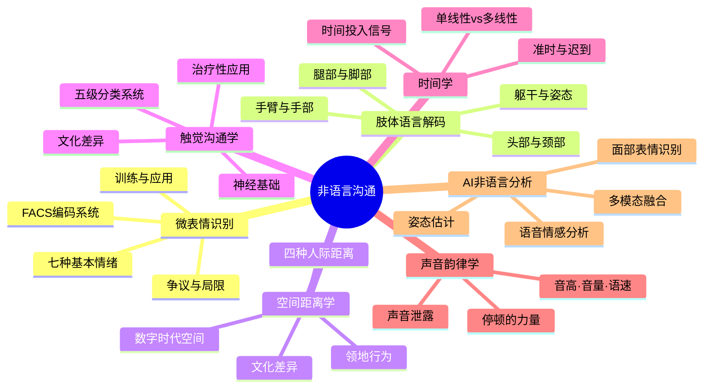
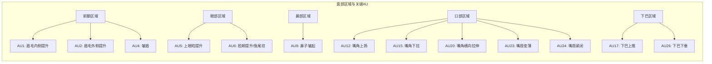
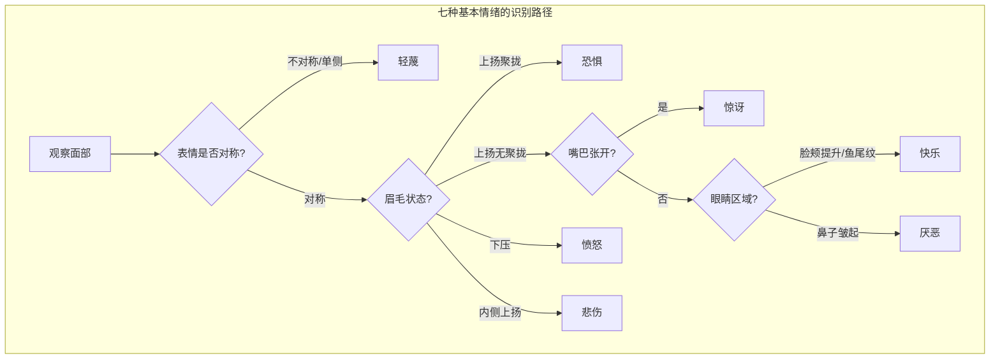
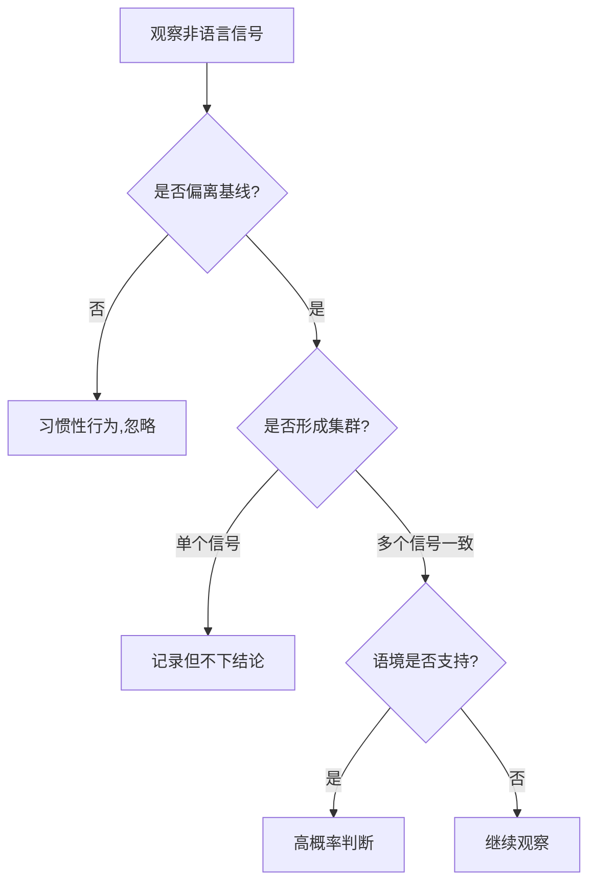
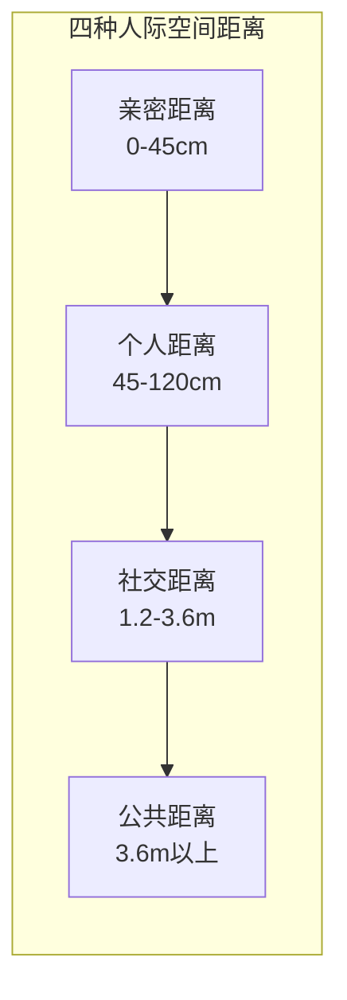
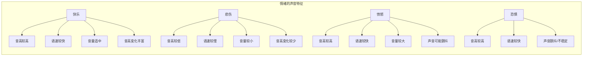
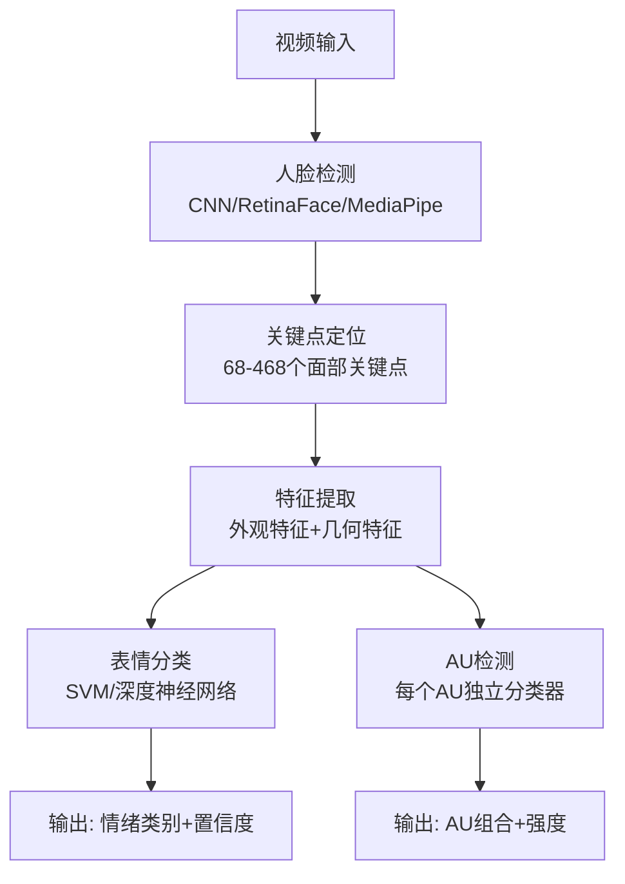
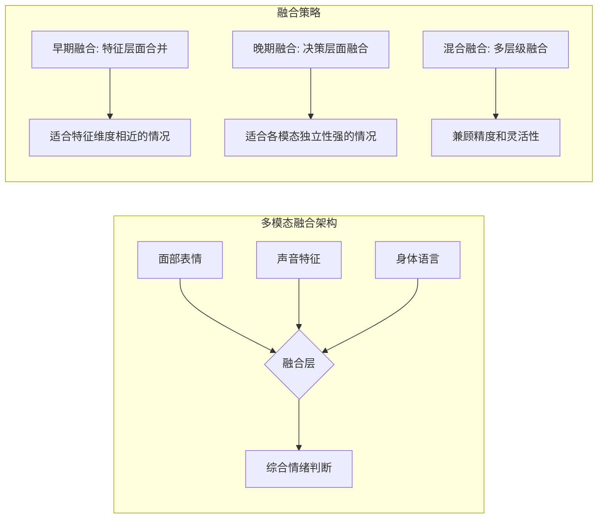

# 非语言沟通：深度拓展

## 引言

非语言沟通是人类交流中最为丰富、最为原始也最为真实的层面。Albert Mehrabian 在 1971 年的经典研究中指出，在面对面的沟通中，语言内容仅占信息传递的 7%，声音特征占 38%，面部表情和肢体语言占 55%。虽然这一比例在后续研究中被修正——具体数字取决于情境——但核心结论从未被推翻：**非语言信号是人类沟通的主导通道**。

本章将从七个专业维度对非语言沟通进行系统性深度探索：微表情识别、肢体语言解码、空间距离学、触觉沟通学、时间学、声音韵律学以及 AI 非语言信号分析。每个维度都将遵循「理论基础→核心方法→实操技巧→常见误区→进阶应用」的结构，确保从入门到精通的读者都能获得实质性的收获。

***

## 一、微表情识别：Paul Ekman 的研究

### 1.1 微表情的科学基础

**什么是微表情**

微表情（microexpressions）是一种持续时间极短（通常为 1/25 秒到 1/5 秒，即 40ms 到 200ms）的面部表情，它们是人类试图隐藏或压抑真实情感时，不由自主地泄露出来的情绪信号。微表情的概念最早由心理学家保罗·艾克曼（Paul Ekman）和华莱士·弗里森（Wallace V. Friesen）在 1960 年代提出。

微表情的核心特征：
- **持续时间极短**：通常不超过 1/5 秒，肉眼难以捕捉
- **不可伪装**：由于涉及面部深层肌肉，无法被有意控制
- **情绪泄露**：是真实情感的"裂缝"，即便一个人在努力隐藏情绪
- **跨文化一致性**：七种基本情绪的微表情在不同文化中表现相似

**面部动作编码系统（FACS）**

为了系统地研究面部表情，Ekman 和 Friesen 开发了面部动作编码系统（Facial Action Coding System, FACS）。FACS 将面部表情分解为基本的肌肉运动单元（Action Units, AUs），通过编码这些运动单元的组合来描述任何可能的面部表情。

FACS 包含大约 46 个基本动作单元，其中最常用的包括：

| AU 编号 | 肌肉名称 | 动作描述 | 对应情绪 |
|---------|----------|----------|----------|
| AU1 | 额肌内侧 | 提升眉毛内侧 | 悲伤、恐惧 |
| AU2 | 额肌外侧 | 提升眉毛外侧 | 惊讶、恐惧 |
| AU4 | 皱眉肌 | 降低眉毛 | 愤怒、悲伤 |
| AU5 | 上睑提肌 | 上眼睑提升 | 恐惧、惊讶 |
| AU6 | 颧大肌 | 胎颊提升 | 真实微笑 |
| AU9 | 鼻肌 | 鼻子皱起 | 厌恶 |
| AU12 | 颧大肌 | 嘴角上扬 | 快乐 |
| AU15 | 降口角肌 | 嘴角下拉 | 悲伤 |
| AU17 | 颏肌 | 下巴上推 | 不确定、担忧 |
| AU20 | 口轮匝肌 | 嘴角横向拉伸 | 恐惧 |
| AU23 | 口轮匝肌 | 嘴唇变薄 | 愤怒 |
| AU24 | 口轮匝肌 | 嘴唇紧闭 | 压抑情绪 |
| AU26 | 翼内肌 | 下巴下垂 | 惊讶 |

### 1.2 七种基本情绪的微表情特征

Ekman 通过跨文化研究（包括对巴布亚新几内亚孤立部落的研究）确认了七种普遍存在的基本情绪，每种情绪都有其独特的面部肌肉运动模式：

**快乐（Happiness）**
- AU编码：AU6（脸颊提升）+ AU12（嘴角上扬）
- 关键特征：真正的快乐微笑（杜兴微笑 Duchenne smile）会同时出现眼角鱼尾纹和嘴角上扬。AU6 是区分真假微笑的核心指标——假笑通常只涉及 AU12（嘴角上扬），缺乏眼角的变化
- 识别要点：观察眼轮匝肌是否收缩。你可以对着镜子尝试只动嘴角不动眼睛——这会立刻让你看出"假笑"的本质

**悲伤（Sadness）**
- AU编码：AU1（眉毛内侧提升）+ AU4（眉毛降低）+ AU15（嘴角下拉）
- 关键特征：内侧眉毛的上扬是悲伤最可靠的指标，这个动作很难被有意模仿。嘴角下拉是辅助信号
- 识别要点：注意眉毛内侧微微上翘——尝试有意识地只提升眉毛内侧，你会发现这非常困难

**愤怒（Anger）**
- AU编码：AU4（眉毛降低）+ AU5（上眼睑提升）+ AU23（嘴唇变薄）+ AU24（嘴唇紧闭）
- 关键特征：眉毛下压并聚拢，眼神直视，嘴唇变薄或紧闭。愤怒是唯一一种"聚焦"而非"打开"的面部表情
- 识别要点：注意下压的眉毛和紧绷的嘴唇。如果同时看到鼻翼扩张，愤怒程度可能很高

**恐惧（Fear）**
- AU编码：AU1 + AU2 + AU4 + AU5 + AU20
- 关键特征：眉毛上扬并聚拢（区别于惊讶的单纯上扬），眼睛睁大，嘴角横向拉伸
- 识别要点：恐惧和惊讶的关键区别在于眉毛——恐惧时眉毛聚拢，惊讶时眉毛自然上扬

**惊讶（Surprise）**
- AU编码：AU1 + AU2 + AU5 + AU26
- 关键特征：眉毛高高扬起（无聚拢），眼睛圆睁，嘴巴自然张开。整个面部瞬间"打开"
- 识别要点：惊讶是最短暂的基本情绪，如果持续超过 1-2 秒，可能是伪装的

**厌恶（Disgust）**
- AU编码：AU9（鼻子皱起）+ AU15（嘴角下拉）+ AU17（下巴上推）
- 关键特征：鼻子皱起，上唇上抬，可能伴随头部微微后倾
- 识别要点：注意鼻子区域的皱缩——这是厌恶最核心的标志。轻蔑和厌恶经常被混淆，但轻蔑只涉及嘴角

**轻蔑（Contempt）**
- AU编码：AU12（嘴角单侧上扬）
- 关键特征：这是七种基本情绪中**唯一不对称**的表情。只有一侧嘴角上扬，形成一个类似"冷笑"的表情
- 识别要点：对称性是关键。如果嘴角两侧都上扬，那是快乐而非轻蔑

### 1.3 微表情识别的训练与应用

**训练方法**

研究表明，微表情识别能力是可以通过系统训练来提升的。Ekman 团队的数据显示，经过 1 小时的训练，识别准确率可从约 40% 提升至 70% 以上。以下是系统化的训练路径：

1. **基础认知阶段**（1-2天）：学习识别七种基本情绪的典型面部运动模式，重点理解每个 AU 的动作
2. **快速识别阶段**（1-2周）：通过 METT（Micro Expression Training Tool）反复练习，在 1/5 秒的时间窗口内准确识别情绪
3. **自然对话阶段**（1-2月）：学习在自然对话中捕捉微表情，同时保持正常的对话参与
4. **综合判断阶段**（持续）：练习区分微表情和其他面部运动（如习惯性抽搐），并结合语境做出判断

**推荐训练工具**
- **METT（Micro Expression Training Tool）**：Ekman 官方开发的基础训练工具
- **SETT（Subtle Expression Training Tool）**：训练识别"微妙表情"（比微表情持续时间更长但更难识别的面部变化）
- **MiX（Microexpression Recognition Training）**：免费在线替代方案
- **日常练习**：观察新闻访谈、真人秀节目中的面部变化（建议关闭声音，专注于面部）

**应用领域**

微表情识别在多个领域有重要应用：

| 领域 | 具体应用 | 实际案例 |
|------|----------|----------|
| 安全与执法 | 机场安检识别可疑人员 | 美国 TSA 的 SPOT 项目使用行为检测技术 |
| 心理治疗 | 帮助治疗师识别来访者隐藏的情感 | 认知行为治疗中的情绪评估 |
| 商业谈判 | 识别对手真实立场 | Chris Voss（FBI 前首席谈判官）的谈判实践中应用 |
| 医疗诊断 | 评估无法自我报告患者的疼痛程度 | 新生儿和认知障碍患者的疼痛评估 |
| 人力资源 | 面试中识别候选人的真实反应 | 结合结构化面试使用 |
| 客户服务 | 识别客户的真实满意度 | 服务改进和投诉预防 |

### 1.4 微表情研究的争议与局限

**方法论争议**

微表情理论在学术界存在显著争议，了解这些争议对于正确使用微表情识别技能至关重要：

- **复制危机**：部分独立研究未能复制 Ekman 关于微表情普遍性的发现。Barrett 等人在 2019 年的综述中指出，情绪与面部表情之间并不存在一对一的对应关系
- **生态效度问题**：实验室环境与自然环境中的微表情表现差异巨大。实验室中人为"压抑"表情产生的微表情，与自然场景中的表现可能完全不同
- **文化差异**：虽然 Ekman 声称基本情绪具有普遍性，但后续研究发现，不同文化对相同面部运动的解读存在差异
- **准确率下降**：在自然条件下，微表情识别的准确率可能远低于实验室条件（有研究显示低至 30%）

**常见误区与纠正**

| 误区 | 事实 |
|------|------|
| "看到单侧嘴角上扬就是轻蔑" | 需要排除习惯性不对称表情，结合语境判断 |
| "微表情 100% 反映真实情绪" | 微表情是概率性的线索，不是确定性的证据 |
| "任何人都可以通过训练成为人肉测谎仪" | 训练能提升识别能力，但无法达到完美准确 |
| "面部表情是情绪的唯一指标" | 必须结合声音、身体语言、语境综合判断 |

**伦理考量**

微表情识别技术的应用引发了重要的伦理争议：
- **情感隐私**：他人是否有权知道我们试图隐藏的情绪？
- **可靠性风险**：基于微表情的判断是否足够可靠，可以用于重要决策？误判的后果可能很严重
- **文化偏见**：不同文化背景的人是否会被系统性地误判？
- **权力不对称**：当只有某些人（如执法人员）拥有微表情识别技能时，会加剧权力不对称

***

## 二、肢体语言解码

### 2.1 躯干与姿态信号

**开放姿态 vs. 封闭姿态**

躯干的姿态是判断一个人心理状态的重要线索，也是日常社交中最容易观察到的非语言信号：

- **开放姿态**：身体面向对方，四肢自然展开，胸膛暴露，肩膀放松。通常表示接纳、信任和舒适。在谈判和社交场合中，开放姿态会让对方感到被尊重和欢迎
- **封闭姿态**：身体侧转或后倾，双臂交叉，肩膀耸起，头部微低。通常表示防御、不适或排斥。但在寒冷环境中，封闭姿态可能只是保暖行为——**必须结合语境判断**

**躯干倾斜的细微差异**

| 倾斜方向 | 常见解读 | 高级解读 |
|----------|----------|----------|
| 前倾 | 兴趣、投入、关注 | 也可能表示争夺话语权（"我要插话"） |
| 后倾 | 放松、厌倦、心理退缩 | 也可能表示在认真思考（需要结合眼神判断） |
| 侧倾 | 不确定、好奇 | 可能表示试图从不同角度观察你 |
| 转向出口 | 想要离开 | 在会议中，这通常意味着"我不同意"或"我有急事" |

**躯干转向的社交含义**

在群体交流中，躯干的朝向往往反映了社交偏好。研究发现，人们通常会将自己的躯干转向他们最信任或最感兴趣的人。Joe Navarro（FBI 前特工）指出，躯干转向是最可靠的"舒适度指标"之一——当一个人对当前话题或在场的人感到不适时，他们的躯干会无意识地转向远离的方向。

### 2.2 手臂和手部信号

**手臂信号**

- **双臂交叉**：最常见的防御性姿态。但需要注意，研究表明约 70% 的人在站立时会自然地交叉双臂，这不一定意味着防御。关键信号是**手臂交叉的紧度**——紧抱通常比随意交叉更有意义
- **双手叉腰**：通常表示自信、准备就绪或权威性。在会议中，双手叉腰的人通常在表达"我准备好了"或"这是我的领地"
- **手臂背后**：可能表示自信、权威或隐藏紧张。皇室成员和军事人员经常使用这种姿态来表达权威

**手部信号——"第二张脸"**

手部是肢体语言中最为灵活和信息丰富的部分。研究显示，有效的沟通者在说话时手部动作的频率是低效沟通者的两倍以上：

- **手掌向上**：通常表示诚实、开放和邀请。古代人类展示空手（无武器）的本能延伸
- **手掌向下**：通常表示权威、确定和压制。领导在下达指令时常用此手势
- **手指尖塔形**（指尖对指尖）：通常表示自信和专业。律师、医生、高管常用此手势
- **搓手**：可能表示期待（搓手速度越快，期待感越强）、紧张或寒冷
- **紧握双手**：可能表示紧张、压抑或自我安慰。紧握位置越高（如下巴前方），紧张程度越大
- **手指交叉**：可能表示希望或（在某些语境中）欺骗

**手势的文化差异——不可忽视的陷阱**

手势的含义在不同文化中可能存在巨大差异，错误的解读可能导致严重的社交事故：

| 手势 | 美国 | 巴西 | 日本 | 中东 |
|------|------|------|------|------|
| "OK"手势（拇指食指成环） | "好的" | 侮辱性手势 | "钱" | 侮辱性含义 |
| 竖起大拇指 | 赞同 | 赞同 | 数字"5" | 侮辱性含义 |
| 召唤手势（手掌向上） | "过来" | "过来" | "过来" | 仅用于召唤动物 |
| 点头 | 同意 | 同意 | 听到了（不一定同意） | 可能表示不同意 |

### 2.3 腿部和脚部信号

**腿部信号**

- **翘二郎腿**：可能表示舒适、自信或防御。关键信号是脚踝是否紧锁——紧锁通常表示紧张或试图控制情绪
- **双腿分开**：通常表示自信、舒适和领地感。在座位有限的环境中，双腿大幅分开可能被视为不礼貌
- **双腿并拢**：可能表示紧张、正式或防御。在正式场合中，这通常是默认姿态
- **脚踝交叉**：可能表示自我约束或试图保持镇定。Navarro 指出，脚踝交叉是"压抑负面情绪"的常见信号

**脚部信号——"最诚实的身体部位"**

许多肢体语言专家认为，脚是身体中最"诚实"的部位，因为人们通常不会刻意控制脚部的非语言信号。Navarro 在其著作中反复强调："如果你想了解一个人的真实想法，看他们的脚。"

- **脚尖朝向**：脚尖通常指向我们想要去的方向或感兴趣的人。在社交场合中，如果某人的脚尖转向门口，说明他们想要离开
- **脚部抖动**：可能表示紧张、不耐烦或兴奋。快乐的抖动和紧张的抖动在节奏上有明显差异——快乐时节奏轻快，紧张时节奏急促
- **脚部交叉**：在坐姿中，脚部的位置和交叉方式可以反映舒适度和态度。双脚缠绕椅腿通常表示紧张

### 2.4 头部和颈部信号

**点头的微妙差异**

- **缓慢点头**：通常表示兴趣和认同。在倾听时缓慢点头，可以鼓励对方继续说
- **快速点头**：可能表示"我明白了，请继续"或不耐烦。结合眼神是否游移可以区分
- **单次点头**：通常表示强调或"说得对"。在谈判中，单次缓慢点头可能是"我正在认真考虑"的信号

**头部倾斜的含义**

- **侧向倾斜**：通常表示兴趣、好奇或困惑。在对话中，微微侧头表示"我在认真听"
- **微微前倾**：表示关注和投入
- **后仰**：可能表示评估、怀疑或退缩。在谈判中，对方后仰可能意味着"我不太同意"

**颈部暴露——信任的本能信号**

在人类和动物界中，暴露颈部是一种表示信任和顺从的行为。在社交互动中，一个人愿意暴露颈部区域（例如仰头大笑、解开衣领），通常表示他们感到安全和放松。相反，用手遮挡颈部（例如触摸项链、拉衣领）可能是紧张或不安的信号。

### 2.5 肢体语言的综合解读原则

**集群原则**

单个肢体语言信号不能作为判断的依据。有效的解读需要观察**信号集群**——当多个独立的非语言信号同时指向同一结论时，判断的可靠性才足够高。

例如：
- 单独的双臂交叉 ≠ 防御（可能只是冷）
- 双臂交叉 + 身体后倾 + 脚尖转向门口 + 避免眼神接触 = 高概率的防御/想要离开

**基线原则**

了解一个人的"基线行为"（baseline behavior）是准确解读肢体语言的前提。每个人都有自己的习惯性姿态和动作，不能用统一标准去衡量。观察一个人在放松、舒适状态下的行为模式，然后注意偏离基线的变化——这些变化才是有意义的信号。

**语境原则**

任何非语言信号都必须在具体语境中解读。同样的动作在不同场景中可能有完全不同的含义。例如，交叉双臂在寒冷的会议室和温暖的谈判桌上有完全不同的含义。

***

## 三、空间距离学（Proxemics）

### 3.1 爱德华·霍尔的空间距离理论

人类学家爱德华·霍尔（Edward T. Hall）是空间距离学的奠基人。他在 1966 年的著作《隐藏的维度》（The Hidden Dimension）中提出了四种基本的人际空间距离。这一理论至今仍是空间距离学的核心框架：

**亲密距离（Intimate Distance）：0-45厘米**
- 适用于最亲密的关系：恋人、家人、亲密朋友
- 感官信息丰富：可以感受到对方的体温、气味、呼吸
- 侵入此空间的陌生人会引起强烈的不适感（心率加快、肌肉紧张）
- 实际应用：在电梯中，陌生人进入亲密距离时，人们通常会僵住、转移视线、减少动作幅度

**个人距离（Personal Distance）：45-120厘米**
- 适用于朋友和熟人之间的日常交流
- 可以进行正常的对话，同时保持一定的个人空间
- 这是最常见的社交距离，也是大多数文化中"舒适"的对话距离
- 实际应用：在社交聚会中，两个人自然站立的距离通常落在这个范围

**社交距离（Social Distance）：1.2-3.6米**
- 适用于正式的社交和商务场合
- 减少了个人化的信息传递，适合保持专业边界
- 适合与不太熟悉的人交往
- 实际应用：面试官和候选人之间、商务会议中的典型距离

**公共距离（Public Distance）：3.6米以上**
- 适用于公开演讲、表演等场合
- 非语言信号主要依赖于大的手势和面部表情
- 个人化的信息传递最少
- 实际应用：演讲者在舞台上需要放大动作和声音以适应这个距离

### 3.2 空间行为的心理学

**领地行为**

人类和动物一样，会通过空间行为来标记和保护自己的领地。在日常生活中，我们可以观察到各种领地行为：

- 在图书馆中，用个人物品"标记"座位（放一本书或一件外套）
- 在会议中，选择特定的座位以确立自己的位置（通常坐在权力位置——长桌两端）
- 在公共交通中，尽量与陌生人保持最大距离（选择角落或边上的座位）
- 在咖啡馆中，用电脑和杯子"圈定"自己的工作区域

**空间入侵与反应**

当他人侵入我们的个人空间时，我们通常会做出一系列可预测的反应：

1. **生理反应**：心率加快、肌肉紧张、出汗、瞳孔扩大
2. **非语言补偿**：身体后倾、手臂交叉、转移视线、减少动作幅度
3. **行为调整**：后退、侧移、寻找屏障（如把包放在两人之间）
4. **心理反应**：不安、焦虑、防御心态

这些反应是自动化的，很难被有意识地控制。理解这些反应有助于你在社交互动中更敏感地察觉对方的舒适度。

### 3.3 文化差异对空间行为的影响

**接触文化与非接触文化**

不同文化对人际空间的偏好存在显著差异，这种差异可能导致跨文化交流中的误解：

| 维度 | 接触文化 | 非接触文化 |
|------|----------|------------|
| 典型代表 | 拉丁美洲、阿拉伯世界、南欧 | 北欧、东亚、北美 |
| 对话距离 | 较近（30-60cm） | 较远（60-120cm） |
| 身体接触 | 频繁（拥抱、拍肩） | 较少（以握手为主） |
| 不适反应 | 对近距离对话较舒适 | 对近距离对话感到压力 |
| 眼神接触 | 频繁且持久 | 适度且短暂 |

**城市环境对空间行为的影响**

研究发现，高密度城市环境中的居民通常发展出更小的人际空间需求。这可能是一种适应性反应——在拥挤的环境中（如东京地铁），保持较大的个人空间是不现实的。城市居民学会了"功能性忽视"——在不得不进入他人亲密距离时，通过避免眼神接触、保持身体静止来降低不适感。

### 3.4 数字时代的空间距离学

**虚拟空间中的距离**

在视频会议和虚拟现实中，空间距离的概念正在被重新定义：

- **摄像头距离**：你与摄像头的距离决定了你在对方屏幕上的"人脸大小"。距离太近会让人感到压迫（如同侵入亲密距离），距离太远会让人觉得疏远。推荐距离约为 60-90 厘米
- **虚拟化身距离**：在 VR 社交平台中，虚拟化身之间的空间距离仍然会影响用户的心理感受，尽管没有物理接触
- **信息距离**：社交媒体中的"亲密距离"变成了信息共享的频率和深度。频繁分享个人生活细节等于"允许他人进入亲密距离"
- **消息回复时间**：在数字沟通中，回复时间成为新的"空间距离"——快速回复表示亲近，延迟回复可能表示疏远

***

## 四、触觉沟通学（Haptics）

### 4.1 触觉在沟通中的作用

**触觉是最原始的沟通方式**

触觉是人类发展过程中最早出现的感觉系统。在子宫中，胎儿的触觉感受器在怀孕第 8 周就开始工作，早于视觉、听觉和味觉系统。触觉也是婴儿与照护者之间的最早沟通桥梁——研究表明，早产儿如果获得更多皮肤接触（袋鼠式护理），体重增长更快，住院时间更短。

**触觉的神经基础**

人类皮肤中分布着数百万种触觉感受器，每种都有其独特的功能：

| 感受器类型 | 感知内容 | 位置 | 传导速度 |
|------------|----------|------|----------|
| 迈斯纳小体 | 轻触、振动 | 皮肤浅层（尤其指尖） | 快（30-70m/s） |
| 帕西尼小体 | 深压、振动 | 皮肤深层、关节 | 很快（40-80m/s） |
| 默克尔细胞 | 持续触觉、形状 | 皮肤浅层 | 中等（5-15m/s） |
| 鲁菲尼小体 | 皮肤拉伸 | 皮肤深层 | 中等 |
| C-触觉传入神经 | 情感性触摸 | 无毛皮肤 | 慢（1m/s） |

**C-触觉传入神经的发现**是触觉研究中最重要的突破之一。这些神经以极慢的速度传导信号，专门响应温柔、缓慢的抚触（速度约 1-10cm/s）。信号到达大脑的后岛叶皮层（与情感处理相关的区域），而不是体感皮层（与触觉感知相关的区域）。这从神经科学层面证明了：**温柔的触摸不仅是一种物理感觉，更是一种情感体验**。

### 4.2 触觉沟通的类型学

**海斯和罗伯茨的触觉分类**

海斯（Heslin）和罗伯茨（Roberts）提出了触觉行为的五级分类系统，从最正式到最亲密：

1. **功能性/职业性触觉**（Functional/Professional Touch）：出于职业目的的触觉，如医生检查患者、理发师触碰头发。社会接受度最高，情感含义最低
2. **社交/礼貌性触觉**（Social/Polite Touch）：社交礼节性的触觉，如握手、轻拍肩膀。是社交润滑剂，帮助建立初步连接
3. **友谊/温暖性触觉**（Friendship/Warmth Touch）：表达友谊的触觉，如拍背、拥抱、挽手臂。标志关系从"认识"到"朋友"的转变
4. **爱情/亲密性触觉**（Love/Intimacy Touch）：表达爱意的触觉，如牵手、亲吻、拥抱。通常限于亲密关系
5. **性/唤起性触觉**（Sexual/Arousal Touch）：性相关触觉。社会接受度最低，仅在特定关系中被接受

**触觉的"权力动态"**

触觉的方向和发起方可以反映和强化权力关系：
- **向下触触**（如拍头）通常由地位较高者发起
- **向上触触**（如触碰手臂）在地位平等者之间更常见
- 研究发现，在职场中，上级触碰下级的频率是下级触碰上级的 3 倍以上

### 4.3 触觉沟通的文化差异

**高接触文化 vs. 低接触文化**

不同文化对触觉沟通的接受程度存在显著差异：

| 维度 | 高接触文化 | 低接触文化 |
|------|------------|------------|
| 代表地区 | 阿拉伯世界、拉丁美洲、南欧 | 东亚、北欧、北美 |
| 问候方式 | 拥抱、亲吻脸颊 | 握手、点头 |
| 对话时触碰 | 频繁触碰手臂、肩膀 | 很少触碰 |
| 同性朋友间 | 牵手、挽臂正常 | 可能引起误解 |
| 个人空间 | 较小 | 较大 |

**触觉的性别差异**

研究表明，在许多文化中，触觉沟通存在显著的性别差异：
- 女性之间的触觉互动通常比男性之间更频繁（在低触觉文化中，女性之间的触觉是被允许的，男性之间的则不然）
- 男性发起的异性间触觉通常被更多地解读为性意图
- 文化规范对不同性别间的触觉行为有不同的期望——在某些文化中，异性之间的任何触觉都可能被解读为浪漫信号

### 4.4 触觉沟通的应用

**治疗性触觉**

在医疗和心理治疗中，触觉被用作重要的治疗工具：
- **按摩治疗**：研究显示，每周 2 次、每次 30 分钟的按摩可以显著降低皮质醇水平（压力激素），提升自然杀伤细胞活性（免疫功能）
- **袋鼠式护理**：早产儿与母亲的皮肤接触被证明可以稳定婴儿心率、改善睡眠质量、促进大脑发育
- **舞蹈/动作治疗**：通过身体运动和触觉互动来促进心理健康，特别适用于创伤后应激障碍（PTSD）患者

**商业环境中的触觉**

研究发现，适度的触觉可以改善商业互动的效果：
- 服务员轻触顾客的手臂可以增加小费金额（研究显示平均增加 36%）
- 图书馆员在借书时轻触读者的手可以增加读者对图书馆的好感度
- 商务握手的力度和持续时间影响第一印象——中等力度、持续 2-3 秒的握手被评为最积极
- 房产经纪人在带看时轻触客户的后背可以增加客户对房产的好感度

**触觉的边界管理**

在使用触觉沟通时，必须注意以下边界：
- **尊重拒绝信号**：如果对方后退、僵硬或交叉手臂，立即停止触碰
- **文化敏感性**：在不熟悉的文化中，默认使用最低限度的触觉（握手）
- **权力关系**：避免在权力不对称的关系中发起触碰（如面试官触碰候选人）
- **个人偏好**：即使在同一文化中，个人对触觉的偏好也存在巨大差异

***

## 五、时间学（Chronemics）

### 5.1 时间感知与沟通

**时间学的定义**

时间学（Chronemics）是研究人们如何感知、使用和结构化时间的学科。时间是非语言沟通中一个重要但常被忽视的维度。你怎么使用时间，往往比你说了什么更能表达你的真实态度。

**单线性时间观 vs. 多线性时间观**

霍尔提出了两种基本的时间取向，这两种时间观深刻影响了跨文化沟通：

| 维度 | 单线性时间观（M-time） | 多线性时间观（P-time） |
|------|------------------------|------------------------|
| 典型代表 | 美国、德国、北欧 | 拉丁美洲、中东、非洲、南欧 |
| 时间本质 | 有限资源，可被"浪费"或"节省" | 流动的，无限的 |
| 计划性 | 强调计划、准时、日程表 | 强调灵活性、人际关系优先 |
| 多任务 | 一次做一件事 | 同时处理多件事 |
| 会议文化 | 准时开始，准时结束 | 可能晚开始，但关系建立更重要 |
| 等待态度 | 等待是不礼貌的 | 等待是正常的 |

### 5.2 时间行为的沟通含义

**准时与迟到**

准时行为在不同文化中传达着截然不同的信息：

- **单线性时间文化**：准时表示尊重和专业，迟到表示不尊重。在德国，即使迟到 5 分钟也可能被视为不礼貌
- **多线性时间文化**：人际互动比时间表更重要，适度的迟到是可以接受的。在拉丁美洲，迟到 30 分钟参加社交聚会是正常的

**迟到的潜台词**

迟到可以传达多种信息，具体取决于语境：
- **权力展示**：让对方等待是一种权力和地位的非语言表达（"我的时间比你的更值钱"）
- **优先级排序**：迟到可能暗示对方在你的时间安排中不是最高优先级
- **文化规范**：在多线性时间文化中，迟到可能只是遵循文化习惯
- **无意识行为**：时间管理能力差也可能导致迟到——这需要结合其他信号判断

**等待时间的权力动态**

让人等待是一种权力和地位的非语言表达。在许多文化中：
- 地位较高的人会让地位较低的人等待（老板让下属等、医生让患者等）
- 反过来则被视为不尊重
- 在约会文化中，故意让对方等待是一种"价值展示"策略

**对话中的时间模式**

| 时间行为 | 可能含义 | 如何回应 |
|----------|----------|----------|
| 语速加快 | 兴奋、紧张、效率、急迫 | 配合对方节奏，或用平稳语速引导 |
| 语速放慢 | 深思、权威、不确定、强调 | 给予耐心，不要打断 |
| 长时间停顿 | 思考、强调、邀请发言 | 不要急于填补沉默 |
| 快速回应 | 高度关注、热情 | 维持互动节奏 |
| 延迟回应 | 低优先级、深思、不满 | 区分情况，不要过度解读 |

### 5.3 时间安排与人际关系

**时间投入作为关系信号**

我们愿意在某人身上投入多少时间，是非语言地表达重视程度的最重要方式之一：

- **快速结束对话**可能表示不感兴趣或不重视——这是最明显的"时间拒绝"信号
- **为某人调整自己的时间表**可能表示高度的重视——例如，取消其他安排来见某人
- **共同度过的时间长度**通常与关系深度正相关——研究表明，友谊的深度与共同活动的时间量高度相关
- **等待回复的时间**在数字沟通中成为关系信号——对重要的人通常回复更快

**时间安排的深层含义**

你如何安排时间，反映了你的价值观和优先级：
- 一个把工作会议安排在家庭时间之前的人，可能在传达工作优先的价值观
- 一个总是在约定时间最后出现的人，可能在传达"我不是最高优先级"的信息
- 一个愿意花大量时间倾听你说话的人，在非语言地表达"你对我很重要"

### 5.4 时间学的实践应用

**职场中的时间策略**

- **面试**：提前 5-10 分钟到达是最佳策略。太早可能给面试官压力，太晚则传达不重视
- **会议**：准时开始和结束传达专业性和对他人时间的尊重
- **谈判**：控制会议节奏——谁决定了何时开始、何时休息、何时结束，谁就掌握了谈判的主动权
- **领导力**：优秀领导者会为团队成员留出"可接近的时间"，这传达了"我重视你"的非语言信号

**日常生活中的时间信号**

- 回复消息的速度：对亲密的人通常更快，对陌生人或不感兴趣的人较慢
- 约会中的准时：准时到达约会传达"我期待见到你"
- 陪伴的质量：在陪伴时是否放下手机，传达了对方在你心中的优先级

***

## 六、声音韵律学（Paralanguage）

### 6.1 声音的非语言维度

**什么是副语言**

副语言（Paralanguage）或声音韵律学研究的是语音中**除语言内容以外**的所有声音特征。Mehrabian 的研究表明，声音特征在情感信息传递中的权重（38%）远超语言内容本身（7%）。这意味着，你怎么说，比你说什么更重要。

副语言的核心要素：

| 要素 | 定义 | 沟通含义 |
|------|------|----------|
| 音高（Pitch） | 声音的高低 | 权威感、情绪状态、紧张程度 |
| 音量（Volume） | 声音的强弱 | 自信程度、情绪强度、空间意识 |
| 语速（Rate） | 说话的速度 | 紧张程度、兴趣程度、自信程度 |
| 音质（Voice Quality） | 声音的质感 | 健康状态、情绪状态、个人特征 |
| 发声特征（Vocalizations） | 笑声、叹息等 | 情绪状态、态度、反应 |
| 停顿（Pauses） | 说话中的沉默 | 思考、强调、情感深度 |

### 6.2 声音特征的心理学含义

**音高与感知**

音高是声音特征中最具心理学含义的维度：

- **低音高**：通常被感知为更有权威、更自信、更性感。研究发现，当选民听到经过音高降低处理的政治家声音时，评价他们更有能力和值得信赖
- **高音高**：通常被感知为更友好、更激动、更紧张。在恐惧或兴奋时，音高会自然上升
- **音高变化**：丰富的音高变化通常被感知为更有活力、更有说服力。研究表明，有效的演讲者音高变化范围是低效演讲者的 2-3 倍
- **单调音高**：缺乏变化的调调可能被感知为无聊、缺乏兴趣或抑郁

**语速与说服力**

语速对信息的说服力有显著影响，但关系并非线性：

| 语速 | 优势 | 劣势 | 最佳使用场景 |
|------|------|------|------------|
| 快速（180+字/分） | 减少反驳时间，增加说服力 | 可能降低可信度，听众难以跟上 | 热情的演讲、快速介绍 |
| 中速（140-170字/分） | 平衡可信度和兴趣 | 无明显劣势 | 日常对话、商务演示 |
| 慢速（100-130字/分） | 更可信、更有权威 | 可能让听众失去兴趣 | 强调重点、表达情感 |

**停顿的力量——副语言中最被低估的工具**

停顿是副语言中最强大但也最常被忽视的元素之一。有效的停顿可以：

- **语法停顿**：帮助组织句子结构，让听众跟上思路
- **逻辑停顿**：强调重要的观点。在关键信息前停顿 1-2 秒，可以让信息的冲击力放大 3 倍以上
- **情感停顿**：传递情感深度。在分享个人故事时，适当的停顿比任何语言都更有力量
- **战略性停顿**：给听众时间思考，制造悬念。在提出关键问题后停顿，可以让全场注意力集中在你身上

**停顿的误区**：许多人害怕停顿，觉得沉默是尴尬的。实际上，自信的停顿传达的是权威感和掌控力。乔布斯的演讲中，平均每分钟有 5-8 秒的停顿——这正是他演讲魅力的关键来源之一。

### 6.3 声音与情绪表达

**情绪的声音标记**

不同情绪状态会在声音特征上留下独特的标记：

**声音的"泄露"**

与面部表情一样，声音也可以"泄露"说话者试图隐藏的情绪。研究表明，声音比面部表情更难控制——因为声音涉及的肌肉群更多、更复杂，意识控制的难度更大。因此，**声音往往是比面部表情更可靠的情绪指标**。

实验证据：
- 在同时分析面部表情和声音特征的情况下，声音特征在识别欺骗方面的准确率比面部表情高出约 20%
- 被要求隐藏情绪的人，其声音特征的变化比面部表情更难控制
- 声音中的"微泄露"（如音高突然上升、语速突然加快）比面部微表情更难被有意压制

### 6.4 声音在不同文化中的含义

**文化特异性的声音规范**

不同文化对"适当"的声音特征有不同的期望：

| 文化 | 声音规范 | 社会期望 |
|------|----------|----------|
| 日本 | 女性使用较高音高 | 表达温柔、有礼 |
| 拉丁文化 | 较大音量和较快语速 | 正常社交互动 |
| 英国 | 低沉、控制的声音 | 上层阶级标志 |
| 美国 | 变化丰富的音调 | 有活力、有说服力 |
| 中国 | 适度的音量和音调变化 | 礼貌、克制 |

**声音规范的性别差异**

声音规范存在显著的性别差异，这些差异正在被现代社交媒体放大：
- 女性通常被期望使用较高的音高和更丰富的语调变化
- 男性通常被期望使用较低的音高和更稳定的语调
- 研究发现，女性在职场中使用较低音高时，通常被感知为更有权威感
- 这些规范正在被挑战——越来越多的声音教练建议"找到你最自然的音高"而非迎合刻板印象

***

## 七、AI 非语言信号分析

### 7.1 计算机视觉与面部表情分析

**自动面部表情识别**

人工智能技术正在使自动化的面部表情识别成为可能。基于深度学习的面部表情识别系统可以：

- 实时检测和跟踪面部关键点（通常 68-468 个关键点）
- 识别基本情绪表情（准确率在受控环境中可达 95%+）
- 分析面部动作单元（AUs），精度接近人类专家水平
- 评估面部表情的强度和持续时间

**技术实现架构**

现代面部表情识别系统的典型技术栈：

**主流开源工具**
- **OpenFace**：卡内基梅隆大学开发，支持 AU 检测和面部动作追踪
- **MediaPipe**：Google 的轻量级解决方案，支持实时面部关键点检测
- **DeepFace**：Facebook 的面部分析框架，支持情绪识别
- **FER（Facial Expression Recognition）**：基于 PyTorch 的开源情绪识别库

### 7.2 声音情感分析

**语音情感识别（SER）**

语音情感识别是 AI 分析非语言沟通信号的另一个重要领域。SER 系统通过分析语音的声学特征来识别说话者的情绪状态，准确率在标准数据集上可达 70-85%。

**声学特征维度**

用于情感识别的主要声学特征包括：

| 特征类别 | 具体特征 | 含义 |
|----------|----------|------|
| 韵律特征 | 基频（F0）、能量、语速 | 情绪的强度和类型 |
| 频谱特征 | MFCCs、频谱质心 | 声音的质感和情绪色彩 |
| 声音质量特征 | 抖动、闪烁、谐波噪声比 | 声音的稳定性和紧张程度 |
| 时序特征 | 停顿模式、语速变化 | 情绪的动态变化 |

**SER 的技术挑战**
- **数据稀缺**：标注情感的语音数据集有限，且标注主观性强
- **个体差异**：不同人的声音基线差异很大
- **混合情感**：现实中的情绪往往是混合的，而非单一的
- **文化差异**：不同文化的情感表达方式不同，模型需要文化适配

### 7.3 身体语言的 AI 分析

**姿态估计**

计算机视觉技术已经能够实时估计人体姿态，追踪身体各部位的位置和运动。这使得 AI 系统能够分析：

- 开放/封闭的身体姿态
- 身体朝向和倾斜角度
- 手势类型和频率
- 身体运动的节奏和模式
- 人际互动中的距离和朝向

**步态分析**

步态（走路的方式）也可以传达丰富的非语言信息：

- **自信步态**：步幅较大、节奏稳定、身体微微前倾
- **紧张步态**：步幅较小、节奏不规律、身体僵硬
- **悲伤步态**：步幅较小、节奏较慢、肩膀下垂、头部低垂
- **AI 应用**：研究表明，AI 系统可以通过分析步态来推断情绪状态，准确率可达 80% 以上，甚至可以用于早期帕金森病筛查

### 7.4 多模态非语言信号融合

**融合方法**

最有效的 AI 非语言分析系统通常采用多模态融合的方法，同时分析面部表情、声音特征和身体语言：

- **早期融合**（Early Fusion）：在特征层面将不同模态的信号合并，然后进行统一分析。优点是能捕捉跨模态关联，缺点是特征维度差异大时效果不佳
- **晚期融合**（Late Fusion）：分别分析每个模态，然后在决策层面融合结果。优点是各模态独立优化，缺点是可能错过跨模态信息
- **混合融合**（Hybrid Fusion）：结合早期和晚期融合的优势，在多个层级进行信息交换。这是目前最先进的方法

### 7.5 AI 非语言分析的实际应用

**市场研究与用户体验**
- 分析消费者在观看广告时的情感反应（通过面部表情和声音变化）
- 评估用户界面设计的情感效果（用户在使用产品时的情绪变化）
- 优化客户服务互动（分析客服对话中的情绪变化）
- **案例**：可口可乐使用面部表情分析技术测试广告效果，优化广告投放策略

**教育领域**
- 分析学生的课堂参与度和情感状态（注意力集中程度、困惑、无聊）
- 帮助教师调整教学策略（哪些内容学生感兴趣，哪些需要换种方式讲解）
- 为有特殊需求的学生提供个性化支持（自闭症学生的社交互动训练）

**医疗健康**
- 辅助诊断与情绪相关的心理健康状况（抑郁症、焦虑症的早期筛查）
- 监测患者在治疗过程中的情绪变化（药物治疗效果评估）
- 评估疼痛程度（新生儿、认知障碍患者、无法自我报告的患者）
- **案例**：英国 NHS 试点使用 AI 面部表情分析辅助抑郁症筛查

**安全与监控**
- 在公共场所识别潜在的安全威胁（异常情绪状态检测）
- 分析可疑行为模式（结合步态、姿态和面部表情）

### 7.6 伦理挑战与隐私保护

**主要伦理关切**

AI 非语言信号分析技术的发展引发了严重的伦理关切：

1. **隐私侵犯**：自动分析人们的情感状态是否侵犯了他们的情感隐私？情感是最私密的个人数据
2. **知情同意**：人们是否知道自己的非语言信号正在被分析？在公共场所的监控系统中，知情同意几乎不可能实现
3. **准确性与误判**：AI 系统的误判可能导致严重的后果，特别是在执法和安全领域。研究表明，某些情绪识别 AI 对不同种族和性别的准确率存在显著差异
4. **算法偏见**：AI 系统可能继承训练数据中的偏见，对不同群体产生不同的准确率。例如，某些面部表情识别系统对深色皮肤人群的准确率明显低于浅色皮肤人群
5. **情感监控**：大规模的情感监控可能导致社会控制和自我审查——当人们知道自己时刻被"读心"时，行为会发生扭曲

**保护措施建议**

为了负责任地发展和应用 AI 非语言分析技术，建议采取以下措施：

- 建立明确的法律框架来规范非语言信号的收集和分析（欧盟 AI Act 已将情感识别系统列为"高风险"）
- 要求透明的知情同意程序（在商业应用中明确告知用户）
- 定期审计 AI 系统的准确性和公平性（第三方独立审计）
- 确保个人对自己非语言数据的控制权（数据可删除、可拒绝）
- 禁止某些高风险的应用（如未经同意的情感监控、工作场所情绪监测）

***

## 本章小结

通过以上七个维度的深度探索，我们可以得出关于非语言沟通的核心结论：

1. **非语言沟通是多维度的系统**：它包括面部表情、肢体语言、空间行为、触觉、时间、声音等多个维度，每个维度都承载着丰富的沟通信息。有效的沟通者需要同时关注多个维度
2. **非语言信号具有普遍性和文化特异性**：某些基本情绪的面部表情可能具有普遍性，但手势、空间行为、触觉规范等方面存在显著的文化差异。跨文化沟通能力需要对这些差异保持敏感
3. **非语言信号比语言更难控制**：由于非语言行为的自发性，它们通常比语言更真实地反映一个人的心理状态。声音泄露比面部泄露更难控制，脚部泄露比手部更难控制
4. **AI 技术正在改变非语言沟通的格局**：自动化的情感识别和行为分析为多个领域提供了新的可能性，但也带来了重要的伦理挑战。技术发展必须与伦理框架同步
5. **非语言沟通能力需要系统训练**：通过学习微表情识别、肢体语言解读、空间行为等知识，并进行持续的实践和反思，我们可以显著提高对非语言信号的敏感度和理解力

**实践行动清单**

- 每天花 10 分钟观察身边人的非语言信号（建议从脚部和手部开始）
- 在重要对话前，花 1 分钟观察对方的"基线行为"
- 在跨文化交流中，默认假设对方的空间和触觉偏好可能与你不同
- 在演讲或演示中，有意识地使用停顿和语速变化
- 在视频会议中，注意自己的摄像头距离和面部表情
- 在不确定时，用集群原则而非单个信号做判断

***

## 延伸阅读

1. Ekman, P.《情绪的解析》（Telling Lies）——微表情研究的经典之作，包含大量实操案例
2. Hall, E. T.《隐藏的维度》（The Hidden Dimension）——空间距离学的奠基之作
3. Navarro, J.《FBI教你读心术》（What Every BODY is Saying）——肢体语言解码的实用指南，FBI 实战经验
4. Mehrabian, A.《无声的信息》（Silent Messages）——非语言沟通的早期重要研究，提出了 7-38-55 法则
5. Knapp, M. L., Hall, J. A. & Horgan, T. G.《非语言沟通》（Nonverbal Communication in Human Interaction）——非语言沟通的综合教科书
6. Burgoon, J. K., Guerrero, L. K. & Floyd, K.《非语言沟通》（Nonverbal Communication）——非语言沟通理论的现代综合
7. Matsumoto, D., Frank, M. G. & Hwang, H. S.《非语言沟通的科学》（Nonverbal Communication: Science and Applications）——将科学发现应用于实践
