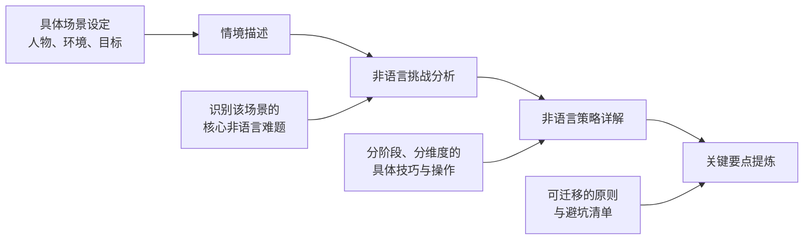
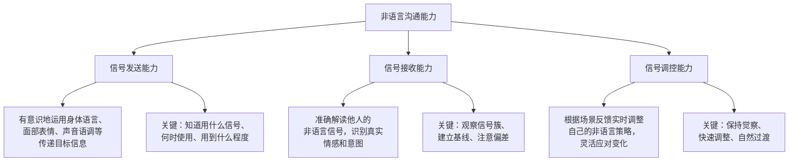

## 引言：场景化应用——从"知道"到"做到"的跨越

### 为什么需要场景化学习？

在前两节中，我们系统地建立了非语言沟通的理论框架——九大核心要素的科学原理，以及从自我觉察到主动运用的核心技巧。但一个现实问题是：**知识储备和实际运用之间，往往隔着一条巨大的鸿沟。**

你可能已经熟记了"7-38-55法则"，能准确列举七种基本面部表情，甚至可以流畅地解释霍尔的四区域空间理论。但当你真正走进一间面试室、站上一个演讲台、坐在谈判桌前时，这些知识点能否在几秒钟内被你调用、组合、并恰当地运用？

这就是场景化学习存在的意义。认知心理学的研究表明，人类的长期记忆更擅长存储**情境化的知识**而非孤立的碎片信息。当知识与具体的场景绑定后，大脑在面对类似场景时能更快、更准确地提取和调用这些知识。这正是教育学中"情境学习理论"（Situated Learning Theory）的核心观点——知识是在特定情境中建构的，脱离情境的知识很难被迁移和应用。

### 八大场景的选择逻辑

本节选取的八个实战场景并非随意罗列，而是基于三个维度的系统筛选：

**第一，覆盖人生核心场景。** 从个人生活到职业发展，这八个场景几乎涵盖了一个人在社会交往中最重要的场景类型：

| 场景 | 核心特征 | 关键非语言挑战 |
|------|----------|----------------|
| 求职面试 | 高压、短时间、单向评估 | 第一印象管理、紧张控制、自信展示 |
| 公开演讲 | 高曝光、一对多、舞台效应 | 空间掌控、声音管理、全场注意力维持 |
| 约会 | 高敏感、双向试探、情感驱动 | 亲密信号传递、舒适感营造、吸引力表达 |
| 商务谈判 | 高博弈、利益对抗、策略性 | 威慑与亲和的平衡、微表情识别、压力施加 |
| 销售场景 | 以说服为核心、关系导向 | 信任建立、需求洞察、购买信号识别 |
| 领导力场景 | 权威与亲和并重、团队影响 | 权威感塑造、激励性信号、危机镇定 |
| 社交场景 | 低结构、关系拓展、群体互动 | 快速亲和、群体融入、社交货币传递 |
| 服务场景 | 客户导向、情绪管理、专业性 | 同理心表达、安抚技巧、专业形象维护 |

**第二，场景间形成难度梯度。** 从相对可控的面试场景（一对一、有明确框架），到复杂的社交场景（多人群体、无固定框架），难度逐步递增。这种设计让你可以在相对简单的场景中打好基础，再逐步挑战更复杂的场景。

**第三，场景间存在可迁移的共性。** 虽然每个场景的具体策略不同，但底层的非语言原则是共通的——一致性、适应性、觉察性、渐进性、真诚性。通过多个场景的反复锤炼，这些原则会内化为你的直觉反应。

### 本节的学习方法论

每个场景案例都遵循统一的分析框架，确保你不仅看到"怎么做"，更理解"为什么这么做"：

**情境描述**为你建立场景画面感——人物是谁、环境如何、目标是什么、有哪些约束条件。这部分看似简单，实则至关重要，因为非语言策略必须嵌入具体情境才有意义。同样是微笑，在面试中传递自信，在约会中传递好感，在服务场景中传递专业——同样的动作在不同情境中承载完全不同的信息。

**非语言挑战分析**帮助你理解该场景的独特难题。每个场景都有其特有的非语言困境：面试中如何在紧张时仍然展现自信？演讲中如何在500人的会场里制造"一对一"的亲密感？谈判中如何用非语言手段施压而不激化冲突？识别挑战是制定策略的前提。

**非语言策略详解**是每个案例的核心——按照场景的时间线（如面试的"进入-就座-问答-结束"），逐阶段、逐维度地展开具体策略。每一个策略都会说明：用什么非语言动作、在什么时机使用、传递什么信号、预期产生什么效果。

**关键要点提炼**将具体策略升华为可迁移的原则，帮助你在其他类似场景中灵活运用。

### 阅读建议：如何最大化学习效果

仅仅阅读案例分析是不够的。要真正将这些知识内化为能力，建议你采用以下学习策略：

**第一遍：通读理解。** 快速阅读所有八个场景的案例，建立整体认知框架。这一遍的重点是理解每个场景的核心挑战和总体策略思路。

**第二遍：深度代入。** 选择与你当前最相关的1-2个场景，逐字逐句精读。阅读时不断问自己："如果是我，我会怎么做？"然后对照案例中的策略，找出差距。

**第三遍：模拟演练。** 针对你选择的场景，进行角色扮演或录像模拟。可以找朋友扮演面试官、谈判对手或约会对象，在真实互动中尝试运用案例中的技巧。事后回看录像，分析自己的非语言表现。

**持续练习：刻意重复。** 选择一个你觉得最有挑战性的非语言要素（如眼神接触、手势、声音控制），在日常生活中有意识地练习一周。记录每天的练习情况和感受，观察变化。

### 跨场景的非语言能力模型

在进入具体案例之前，有必要先建立一个跨场景的非语言能力模型。无论具体场景如何变化，非语言能力都可以拆解为三个核心维度：

**信号发送能力**是你主动"表达"的能力。面试时展示自信的微笑、演讲时运用有力的手势、谈判时保持沉稳的语调——这些都属于信号发送。很多人误以为非语言沟通就是"表演"，其实它更接近于"让内在状态通过正确的外在形式表达出来"。如果你内心充满自信但身体语言却在传递紧张，问题不在技巧层面，而在内在状态和外在表达之间存在断层。

**信号接收能力**是你"阅读"他人的能力。在面试中判断面试官的真实反应、在谈判中捕捉对手的微妙变化、在约会中感知对方的兴趣程度——这些都依赖于信号接收能力。这个维度常被忽略，但它是有效互动的基础。一个只关注自己表现而忽视对方非语言信号的人，就像一个只顾发球而从不看对手站位的网球选手。

**信号调控能力**是你"调整"的能力。当你发现自己的手势过于夸张、语速过快或距离过近时，能够实时察觉并做出调整；当你读到对方的不耐烦或困惑信号时，能够灵活切换策略。这是一种高级的元认知能力，需要在大量实践中逐步培养。

### 从案例到能力：非语言学习的三个阶段

掌握非语言沟通技能通常经历三个阶段，理解这个过程可以帮助你合理设定期望，避免因初期的笨拙感而放弃：

**第一阶段：有意识的笨拙（Conscious Incompetence）。** 当你刚开始学习非语言技巧时，你会发现自己在刻意控制身体语言时反而变得不自然。这是完全正常的——就像学开车时，你必须有意识地关注每一个操作，手脚显得僵硬笨拙。这个阶段的关键是**坚持练习，不要放弃**。

**第二阶段：有意识的流畅（Conscious Competence）。** 经过反复练习后，你可以在需要时主动调用正确的非语言技巧，虽然仍需要刻意关注，但已经不再僵硬。这个阶段的你可以在重要场合（如面试、演讲）前进行"预热"，有意识地进入最佳状态。

**第三阶段：无意识的流畅（Unconscious Competence）。** 当技巧充分内化后，你不再需要刻意思考——正确的非语言反应已经变成你的自然习惯。面对不同场景，你的身体会自动做出恰当的调整。这是非语言沟通能力的最高境界，也是我们追求的终极目标。

下面的八大场景案例，就是帮助你从第一阶段迈向第三阶段的实践桥梁。

### 本节案例索引

| 序号 | 场景 | 核心技能 | 推荐人群 |
|------|------|----------|----------|
| 1 | 求职面试 | 第一印象、紧张控制、自信展示 | 求职者、职场新人 |
| 2 | 公开演讲 | 空间掌控、声音管理、全场互动 | 管理者、创业者、教师 |
| 3 | 约会 | 亲密信号、吸引力表达、舒适感营造 | 所有成年人 |
| 4 | 商务谈判 | 威慑与亲和平衡、微表情解读 | 商务人士、销售、管理者 |
| 5 | 销售场景 | 信任建立、购买信号识别、需求洞察 | 销售人员、创业者 |
| 6 | 领导力场景 | 权威塑造、激励表达、危机镇定 | 管理者、团队领导 |
| 7 | 社交场景 | 快速亲和、群体融入、社交破冰 | 所有人群 |
| 8 | 服务场景 | 同理心表达、安抚技巧、专业形象 | 服务行业从业者 |

建议你根据自己的实际需求选择优先阅读的场景。但如果有时间，完整阅读所有八个场景会帮助你建立更全面的非语言沟通视角——因为不同场景之间的策略往往存在互补关系。例如，在谈判中学到的微表情识别技巧，在面试和销售场景中同样适用；在演讲中学到的声音控制技巧，在领导力场景中同样有效。

让我们进入第一个场景——求职面试，开始从理论到实践的转化之旅。

***
