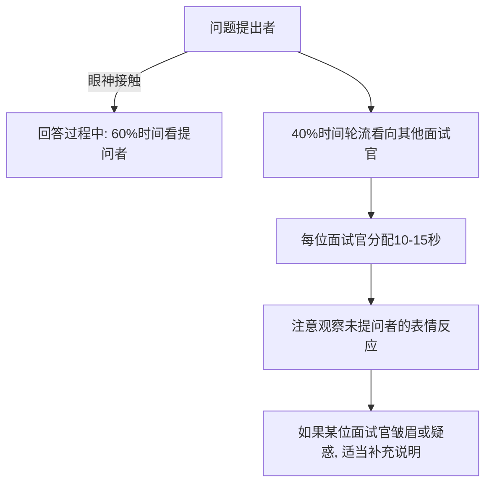
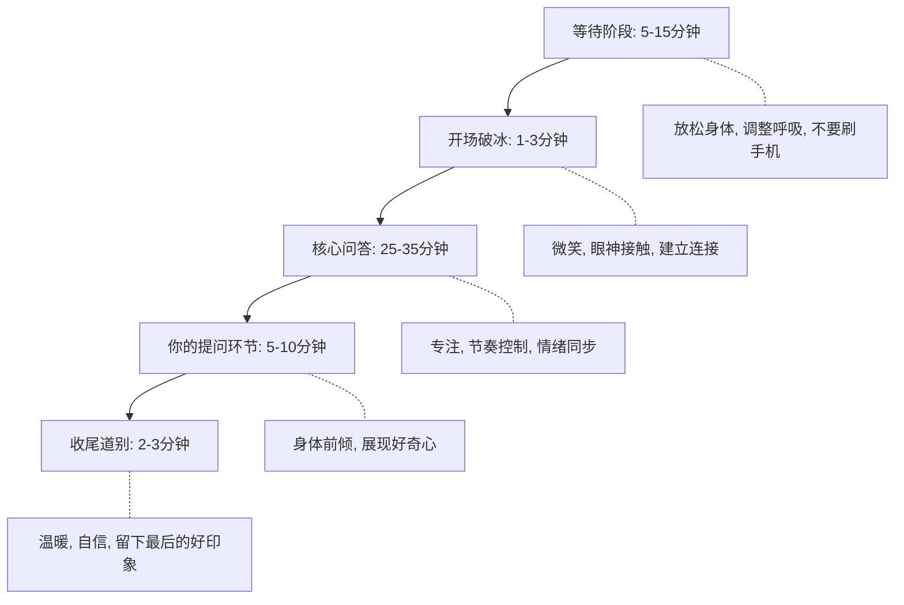

## 场景一：求职面试

求职面试是检验非语言沟通能力最集中的场景——30到60分钟内，你要同时管理视觉信号、听觉信号、空间距离和时间节奏，而面试官正在用一套进化了数百万年的本能系统对你进行快速评估。理解这套评估机制的工作原理，才能有的放矢地调校自己的非语言输出。

### 面试官的评估机制：为什么非语言比你想的更重要

面试官的判断并非完全理性。认知心理学中的**首因效应（Primacy Effect）**和**确认偏误（Confirmation Bias）**共同构成了一个"先入为主→选择性验证"的闭环：


普林斯顿大学Janine Willis和Alexander Todorov的研究表明，人们在100毫秒内就能对陌生人的可信度、能力和亲和力做出判断，而延长接触时间并不会显著改变这些判断——只是增强了信心。纽约大学的后续研究进一步发现，这种快速判断与实际能力之间的相关性约为0.3，说明首因效应虽然不可靠，却极其顽固。

这意味着一个残酷的事实：你精心准备的专业回答，如果伴随着紧张的肢体语言和不自信的语调，面试官的大脑会在你开口之前就已经"投了反对票"。后续的优秀表现只能部分修正这个初始判断，而不能彻底推翻它。

**面试官评估的三重通道：**

| 通道 | 评估内容 | 占比（估算） | 可控性 |
|------|----------|-------------|--------|
| 视觉通道 | 姿态、表情、手势、着装、眼神 | 55% | 高——可通过刻意练习改善 |
| 听觉通道 | 语速、语调、音量、停顿、填充词 | 38% | 中——需要录音回听才能察觉 |
| 语言通道 | 逻辑性、专业性、用词精准度 | 7% | 高——可通过准备直接提升 |

这三个数字来自Albert Mehrabian的经典研究，虽然原始实验场景与面试不完全相同，但其揭示的核心规律——**非语言信号在第一印象形成中的权重远超语言内容**——在面试场景中被反复验证。

### 不同面试形式的非语言策略差异

面试形式不同，非语言沟通的挑战截然不同。下面按场景逐一拆解。

#### 现场一对一面试

这是最经典的面试形式，非语言信息密度最高，面试官能捕捉到你的一切细节。

**进入面试间的前7秒——建立第一印象的关键窗口：**

1. **敲门与等待**：用指关节敲两下，力度适中（不要用掌心拍门，显得粗鲁），等待1-2秒后再开门。如果面试官正在看电脑或翻资料，不要急于开口，先站在门口等对方抬头
2. **步伐与姿态**：走向座位时步幅适中（约60-70厘米），步速稳定（每秒1.2-1.5步）。驼背会传递缺乏自信，过度挺胸则显得紧绷——保持脊柱自然直立即可
3. **微笑的时机**：在面试官看到你的瞬间露出微笑，不要一进门就笑（显得讨好），也不要坐下后才笑（太迟）。微笑持续1-2秒后自然收回，不要全程保持"营业式微笑"
4. **握手的细节**：等面试官先伸手，你的手主动迎上去（不要等对方的手伸到面前才被动地抬手）。握手时虎口对虎口，力度与对方相当，持续2-3秒。手心出汗的人可以在进门前用纸巾擦拭，或在口袋里放一小块干燥的布
5. **等待指示再就座**：不要自行坐下。面试官说"请坐"后，轻微点头致谢，然后平稳坐下

**就座后的姿态管理：**

坐姿是面试中最持久的非语言信号，贯穿整个面试过程。

- **身体角度**：身体微微前倾5-15度，传递专注和兴趣。后仰显得傲慢或不感兴趣，前倾过度则显得有攻击性
- **双手位置**：自然放在桌面上，手指交叉或轻握。不要交叉双臂（防御姿态），不要托腮（显得无聊），不要双手抱头（过度放松）。讲述重要观点时可以配合适度的手势强调，但手势范围控制在身体两侧的"信任三角"内——即从锁骨到腰部、两肩宽度的范围
- **双脚位置**：平放在地面，与肩同宽。抖腿是最常见的紧张信号，一旦发现自己在抖，立即将双脚用力踩向地面，这个物理动作能打断抖腿的神经回路
- **头部位置**：保持头部正直或微微侧倾。面试官说话时微微侧头表示关注，但不要过度侧倾（显得不自信）

**回答问题时的非语言节奏：**

不同类型的问题需要不同的非语言节奏配合：

| 问题类型 | 思考停顿 | 语速 | 语调 | 眼神 |
|----------|----------|------|------|------|
| 自我介绍 | 不需要 | 中速偏慢 | 平稳有力 | 直视面试官 |
| 行为问题（STAR） | 2-3秒 | 中速 | 叙事起伏 | 讲述时偶尔看向斜上方回忆 |
| 技术/专业问题 | 3-5秒 | 中速偏快 | 清晰准确 | 看着面试官或白板 |
| 压力测试问题 | 1-2秒 | 稍慢 | 平稳不慌 | 稳定直视面试官 |
| 情景模拟题 | 3-5秒 | 中速 | 有代入感 | 可适当使用手势配合 |

遇到不会的问题时的处理：停顿2秒，深呼吸一次（不要让面试官察觉），然后说"让我梳理一下思路"。这个停顿同时完成了两件事——争取了思考时间，以及向面试官展示你在压力下仍能保持冷静。

**倾听面试官时的反馈信号：**

面试不仅是"说"的考试，更是"听"的展示。好的倾听者会给出持续的非语言反馈：

- **点头**：面试官每说完一个完整观点，点头一次（不要连续点头像啄米）。点头的时机和频率要匹配对方的语速
- **眼神接触**：保持60-70%的时间注视对方，30-40%的时间自然移开（看对方的鼻梁或眉心位置，效果等同于直视眼睛但压力更小）。面试官说话时可以增加到70-80%的注视时间
- **面部表情的同步**：面试官描述挑战时，你的表情应该认真专注；面试官提到团队成就时，你应该露出赞赏的微笑。这种"情绪同步"是建立人际连接的核心机制——镜像神经元的作用

#### 现场多对一（Panel）面试

多位面试官同时面试，非语言管理的复杂度成倍增加。

**核心挑战：** 你需要同时管理多条视觉通道，不能只盯着一个人说话。

**应对策略：**



- **分配注意力**：回答问题时，先看向提问的面试官说前半段，然后转向其他面试官说后半段。确保每位面试官都感受到被"关注"，不要忽略角落里不怎么说话的那位——他可能才是最终决策者
- **身体朝向**：身体整体朝向提问者，但可以微微转向其他面试官。不要只转动头部而不转动身体（像网球观众一样来回摆头会显得很累）
- **应对追问题**：当另一位面试官追问时，身体整体转向他，传递"我现在完全关注你"的信号

#### 视频面试

视频面试将非语言信息压缩到一个屏幕大小的窗口中，许多在面对面场景中有效的信号会失效或变形。

**摄像头管理——最容易被忽视的细节：**

- **摄像头位置**：摄像头应该与眼睛齐平或略高。位置过低会暴露双下巴和鼻孔（俯视视角让面试官产生被俯视的不适感），位置过高则显得你像在低头工作
- **视线模拟**：说话时看着摄像头而不是屏幕上的面试官。这个习惯需要刻意练习——看着摄像头时，面试官看到的是你直视他的画面；看着屏幕上的面试官时，面试官看到的是你在向下看
- **面部光线**：光源应该在你的正前方或斜前方45度。背光会导致面部变成剪影，顶光会产生浓重的眼部阴影。最简单的方法是面对窗户坐，或在显示器后方放一盏台灯

**手势的限制与调整：**

- 屏幕裁切通常只显示肩膀以上，传统的大范围手势完全不可见
- 将手势范围缩小到胸部以上的"小窗口"，用手腕和手指的动作代替手臂的动作
- 如果需要强调某个观点，可以配合上半身的微微前倾，而不仅是手势

**视频面试特有问题——技术延迟的影响：**

视频通话通常有100-300毫秒的延迟，这会打乱自然的对话节奏。应对方法：

- 每次开始说话前多等0.5秒，确认对方已经说完
- 用更明确的点头和微笑代替轻声的"嗯""对"——因为这些轻声在延迟环境下容易被当作打断

#### 电话面试

电话面试剥离了所有视觉通道，只剩下声音。这反而让听觉信号的管理成为唯一的杠杆。

**声音的五个维度管理：**

| 维度 | 目标 | 具体做法 |
|------|------|----------|
| 音量 | 中等偏高，清晰 | 坐直身体，打开胸腔。不要躺着说话——姿势会直接影响音量和音色 |
| 语速 | 每分钟150-170字 | 比日常说话稍慢，给对方反应时间（电话没有视觉辅助，语速过快更难理解） |
| 语调 | 有起伏，避免平调 | 关键词加重语气，重要观点前停顿1秒 |
| 音质 | 清晰，不带鼻音 | 嘴唇微张，下巴放松。紧张时下巴会不自觉收紧，导致声音发闷 |
| 填充词 | 最小化 | 用沉默代替"嗯""啊""那个"。停顿不会显得你无知，填充词才会 |

**关键技巧：** 电话面试时站起来说话。站立状态下横膈膜活动更充分，声音更有力，而且肢体动作（即使是看不见的）能激活大脑的自信回路，让语调自然更积极。

### 面试着装的非语言信号

着装是面试官在你开口之前接收到的最强视觉信号。它传递的不是"你穿了什么"，而是"你认为这个场合应该是什么规格"——这种判断力本身就是面试评估的一部分。

**着装匹配的三个层级：**

| 层级 | 目标 | 具体建议 |
|------|------|----------|
| 行业匹配 | 了解行业着装规范 | 金融/法律：正式西装；科技/互联网：商务休闲（Polo衫+休闲西裤）；创意/广告：可以更有个性 |
| 公司匹配 | 研究目标公司的文化 | 看公司官网团队照片、社交媒体、Glassdoor评价。有员工朋友的话直接问 |
| 岗位匹配 | 比岗位日常着装高半级 | 你穿得比未来的同事稍微正式一点，传递"我重视这次机会" |

**着装的微表情影响：**

不合身的衣服会产生一系列紧张的小动作——拉扯衣角、调整领口、整理袖口——这些动作在面试官眼中全部被归类为"焦虑信号"。因此，合身比昂贵重要得多。面试前一天穿上整套衣服在镜子前走动10分钟，确保没有任何让你不舒服的地方。

**色彩心理学在面试中的应用：**

- **深蓝色**：传递可靠、专业、值得信赖。是面试中最安全的颜色选择
- **灰色**：传递理性、沉稳。适合技术岗位或需要展现分析能力的职位
- **白色**：传递简洁、高效。适合作为内搭，避免全身白色（显得单薄）
- **黑色**：传递权威感。适合管理层岗位，但对应届生来说可能显得过于严肃
- **避免大面积亮色**：红色在面试中过于强势，大面积橙色/黄色显得不够成熟。可以用小面积配饰（领带、丝巾）作为点缀

### 面试全流程的时间线管理

面试不是一个均匀的过程，不同阶段的非语言管理重点不同。



**等待阶段的细节：**

很多人在等待室就开始松懈——刷手机、翘二郎腿、靠在椅子上。但面试官可能已经在观察你了（前台的反馈、路过时的瞥见都会成为信息来源）。正确的做法：

- 坐直，双脚平放，双手放在膝盖上或包上
- 可以翻看准备的资料（这传递"认真准备"的信号）
- 不要打电话或大声说话
- 前台工作人员倒水时微笑道谢——面试官事后可能会问前台对你的印象

**收尾道别的重要性：**

面试的**近因效应（Recency Effect）**意味着最后一印象和第一印象一样会被优先记住。道别时要：

- 起立的动作要自然利落（不要椅子推得太响或碰倒东西）
- 再次握手，力度和开场一致
- 说一句有温度的收尾语："今天的交流让我对这个方向有了更深的理解，非常感谢您的时间"
- 离开时步伐稳健，不要回头。走出房间后再松一口气

### 常见非语言失误与纠正方法

以下是面试中最高频的非语言错误，按"杀伤力"排序：

**1. 眼神闪躲——被解读为不自信或不诚实**

错误表现：说话时频繁看向地板、天花板或角落。回答行为问题时眼神飘忽（面试官会误认为你在编造故事）。

纠正方法：练习"三角注视法"——看对方的左眼→右眼→鼻梁，每3-5秒轮换一次。这个技巧比直视瞳孔更自然，不会让你产生被"盯"的压迫感。

**2. 抖腿/转笔/摸头发——被解读为焦虑或不耐烦**

错误表现：无意识地重复性小动作。这些动作的频率往往随着紧张程度上升而加快，形成一个"越紧张→越多小动作→越紧张"的恶性循环。

纠正方法：双手自然交叠放在桌上，双脚平踩地面。如果手实在控制不住，可以握住一支笔（但不要转它）。面试前做5分钟的渐进式肌肉放松——从脚趾开始，依次紧绷→放松每个肌肉群。

**3. 语速失控——越紧张越快**

错误表现：回答问题时语速越来越快，像赶着把话说完。面试官来不及消化你的内容，同时把你归类为"抗压能力差"。

纠正方法：在面试官问完问题后，先说一句过渡语（"这是个很好的问题"或"让我想想"），用这2-3秒让大脑和嘴巴同步。遇到压力面试问题时，有意识地把语速放慢20%——你的"慢速"在面试官听来才是正常的。

**4. 微笑僵硬或缺失——被解读为冷漠或防御**

错误表现：全程面无表情（扑克脸），或保持一个固定角度的微笑不变（营业笑）。两种都会让面试官觉得你不可亲近。

纠正方法：微笑应该是"回应式"的——面试官说了有趣的事，你自然笑；面试官提出严肃的问题，你认真思考的表情。不需要全程微笑，但需要全程"有表情"。

**5. 坐姿坍塌——被解读为缺乏职业素养**

错误表现：面试进行到中段，身体逐渐后仰，瘫在椅子上，或习惯性地靠在椅子一侧。

纠正方法：每隔10分钟有意识地检查自己的坐姿。一个实用的标记物——保持后背与椅背有一拳的距离，这个距离能确保你的身体是坐直的但不是僵硬的。

**6. 声音单调——被解读为缺乏热情**

错误表现：全程用同一个音调说话，像在念稿。即使内容很好，面试官也会觉得你对这个机会不感兴趣。

纠正方法：在关键结论处提高音调，在重要数据处放慢语速并加音量。录音回听自己的一段回答，如果听起来像催眠，就需要增加语调的动态范围。

### 文化差异：跨国面试的非语言陷阱

如果你在面试外资企业、海外公司，或面试官来自不同文化背景，以下差异必须了解：

**眼神接触的文化光谱：**

- **欧美文化（美、德、英）**：直接的眼神接触传递自信和诚实。面试时应保持较高比例（60-70%）
- **东亚文化（日、韩）**：过长时间的直视可能被视为不礼貌或有攻击性。面试时可适当降低到40-50%，特别是在对方是年长者时
- **中东文化**：同性之间的眼神接触较强烈，异性之间则需更谨慎

**握手的文化差异：**

- **美国**：坚定有力的握手，持续2-3秒
- **日本**：握手逐渐被接受，但传统问候是鞠躬。如果你不确定，等对方先决定握手还是鞠躬
- **印度**：握手较轻柔，不要过于用力
- **法国**：握手较短，可能伴随轻微的贴面礼（商务场合通常不需要）

**个人空间的距离：**

- **北欧、北美**：偏好较大的个人空间（1.2米以上）
- **南欧、拉丁美洲**：个人空间较小（0.6-0.9米），面试中站得近不会让对方不舒服
- **东亚**：中等偏大，面试中保持适度距离

### 面试后的非语言复盘

面试结束后24小时内进行一次系统性复盘，这比多做5次模拟面试更有价值。

**复盘清单：**

```text
1. 入场阶段
   □ 我的步伐是否稳健自然？
   □ 微笑的时机是否恰当（在对方看到我时）？
   □ 握手的力度和时长是否合适？

2. 坐姿与姿态
   □ 我是否全程保持了开放姿态？
   □ 有没有出现抖腿、交叉双臂等防御信号？
   □ 身体前倾的角度是否传递了兴趣？

3. 眼神与表情
   □ 眼神接触的比例是否在60-70%之间？
   □ 表情是否与面试官的话题同步？
   □ 遇到困难问题时是否保持了镇定的表情？

4. 声音管理
   □ 语速是否稳定，有没有越说越快？
   □ 语调是否有起伏，避免了单调？
   □ 填充词（嗯、啊、那个）的使用频率如何？

5. 节奏控制
   □ 回答问题前是否有适当的思考停顿？
   □ 是否在倾听时给出了足够的反馈信号（点头、表情）？
   □ 道别环节是否自然温暖？
```

如果可能，找一个朋友坐在对面模拟面试场景，让他记录你出现的所有小动作。自己是察觉不到大部分无意识行为的——只有外部观察者才能给你真实的反馈。

### 高阶技巧：面试中的非语言博弈

当你已经掌握了基础的非语言管理，以下进阶技巧能帮你从"不出错"提升到"出彩"。

**1. 镜像技术（Mirroring）**

人的本能会倾向于喜欢与自己相似的人。在面试中，你可以有意识地"镜像"面试官的部分非语言行为：

- 面试官身体前倾时，你在3-5秒后也微微前倾
- 面试官说话速度较快时，你适当加快语速
- 面试官使用手势时，你也在回答中加入适度手势

**注意：** 镜像是"微妙的同步"，不是"模仿"。如果面试官摸了一下鼻子你立刻也摸一下，那不是镜像，那是讽刺。

**2. 占据空间（Power Posing）**

哈佛商学院Amy Cuddy的研究表明，面试前在私密空间中保持2分钟的"高权力姿态"（双手叉腰、双脚分开与肩同宽、抬头挺胸）可以提高睾酮水平、降低皮质醇水平，从而提升自信感和抗压能力。虽然学术界对生理效果仍有争议，但其心理效果——你在面试前"感觉自己更自信"——是真实的。

**3. 战略性停顿**

大多数面试者害怕沉默，会急于填满每一个空隙。但适度的停顿反而能传递控制力和思考深度：

- 在面试官抛出难题后，停顿3-5秒再开口。这个停顿在面试官看来是"他在认真思考"，而不是"他不会"
- 在回答的关键结论前，停顿1秒。这个停顿创造了"期待感"，让你的结论更有冲击力

**4. 情绪锚定（Emotional Anchoring）**

在面试前回忆一次你最有成就感的经历，让那种自豪和自信的情绪充满全身。然后带着这种情绪走进面试间。这不是自我欺骗——你在调用真实的情绪记忆来校准你的非语言输出，让你的肢体语言自然地传递自信，而不是"表演"自信。

---

求职面试中的非语言沟通，本质上是**在高压环境下维持信号一致性**的练习——你的表情、声音、姿态和语言必须传递同一个故事。面试官的大脑是一个高精度的"不一致检测器"，任何微小的矛盾都会触发怀疑。与其追求"表演完美"，不如追求"内外一致"——当你真正相信自己适合这个岗位时，你的非语言信号会自然校准到正确的位置。
