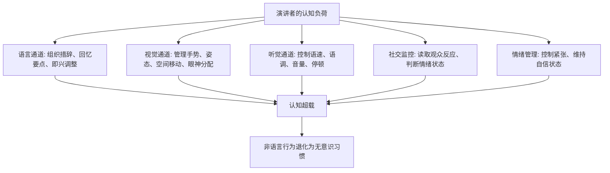
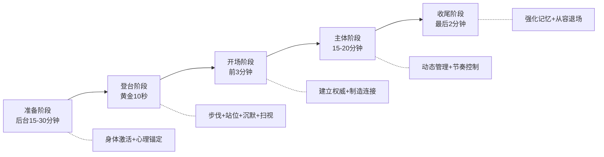
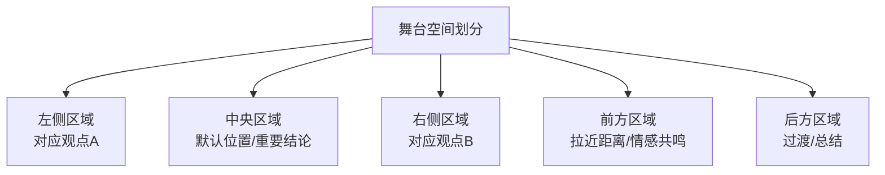
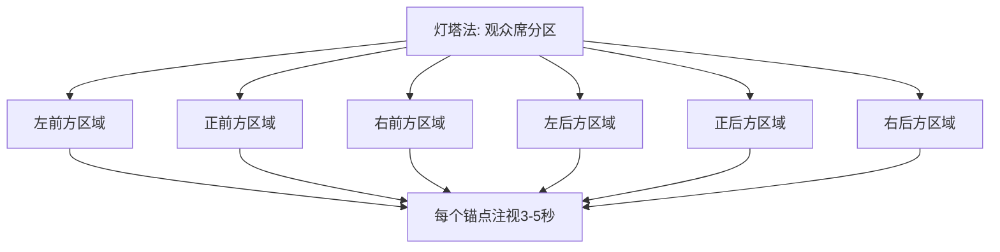
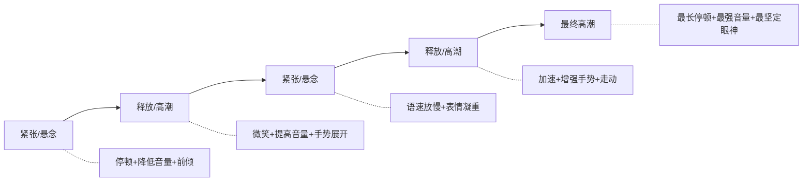

## 场景二：公开演讲

张薇是一位创业公司的CEO，需要在一场行业峰会上进行20分钟的主题演讲，听众约500人，包括投资人、行业专家和媒体。这不是一场普通的分享——台下坐着她下一轮融资的潜在投资人，也坐着她竞争对手的高管。她的每一句话、每一个手势、每一秒停顿，都可能被解读、被记录、被传播。

公开演讲是非语言沟通的"放大镜"——在日常对话中可以被忽略的微小信号，一旦放到舞台上，就会被数百双眼睛同时捕捉、同步解读。一个不经意的抖腿，在会议室里只有邻座能看见；在舞台上，它会让全场500人同时接收到"这个人很紧张"的信号。反过来说，一个精心设计的停顿，在一对一对话中只是普通的沉默；在舞台上，它能制造出让全场屏息的戏剧张力。

这就是公开演讲的独特之处：**非语言信号的影响力被观众数量线性放大，而纠错空间被压缩到接近零。** 你没有机会说"刚才那个手势不太对，让我重来一遍"——每一个瞬间都是终局。

### 演讲者的认知负荷：为什么非语言管理在舞台上更难

在日常对话中，你的大脑可以自动处理大部分非语言信号——微笑、点头、手势，这些都是在无意识中完成的。但在公开演讲中，情况完全不同。

**认知负荷理论（Cognitive Load Theory）** 告诉我们，工作记忆的容量是有限的。当你同时处理以下任务时，认知资源会被迅速耗尽：



这就是为什么很多人"准备得很充分，一上台全忘了"——他们的认知资源全部被语言通道占用，非语言通道退化为无意识的紧张习惯（抖腿、语速加快、眼神闪躲）。

**解决方案不是"记住所有技巧"，而是通过反复练习让非语言技能自动化。** 就像学开车——刚学的时候你需要有意识地控制方向盘、油门、刹车、后视镜，但开了5000公里之后，这些操作变成了自动化的程序性记忆，不再占用认知资源。演讲中的非语言技巧也是如此：只有当手势、眼神、移动成为"肌肉记忆"时，你才能在舞台上自然地运用它们，而不是一边想内容一边想"我现在该看哪里"。

### 演讲全流程的非语言管理框架

一场演讲不是从"开口说话"开始的，而是从"走上舞台"之前就已经开始了。下面按照时间线，将演讲拆解为五个阶段，每个阶段的非语言管理重点不同。



#### 第一阶段：后台准备（登台前15-30分钟）

后台准备是被大多数演讲者忽视的环节，但它直接决定了你"踏上舞台的第一秒"是什么状态。

**身体激活——唤醒你的"表演身体"：**

演讲是一项身体活动，不仅仅是脑力活动。你的声音需要胸腔共鸣，你的手势需要肩膀和手臂的肌肉配合，你的站姿需要核心肌群的支撑。如果你从办公桌前直接走到舞台上，你的身体处于"坐了一下午"的低能量状态，这会直接拖垮你的非语言输出。

具体做法：

1. **胜利者姿态（Power Pose）**：找一个私密空间，双脚分开与肩同宽，双手叉腰，下巴微抬，保持2分钟。哈佛商学院Amy Cuddy的研究表明，这种姿态可以提高睾酮水平约20%、降低皮质醇水平约25%，从而提升自信感和抗压能力。虽然学术界对生理效果的持久性仍有争议，但其心理效果——你在登台前"感觉自己更自信"——是可重复验证的

2. **渐进式肌肉放松**：从脚趾开始，依次紧绷→放松每个肌肉群（脚趾→小腿→大腿→腹部→胸部→肩膀→手臂→手指→面部）。这个过程持续3-5分钟，可以显著降低肌肉紧张度，让你的手势和姿态更自然

3. **声音热身**：轻声哼唱从低音到高音的滑音，持续1分钟；然后朗读你的开场白3遍，每次用不同的音量（小声→正常→大声）。声音热身的目的是激活声带和共鸣腔，避免开场时声音干涩或发紧

4. **呼吸校准**：采用"4-7-8呼吸法"——吸气4秒，屏气7秒，呼气8秒，重复5次。这种呼吸模式能激活副交感神经系统，降低心率，让你从"战斗或逃跑"的应激状态切换到"冷静专注"的状态

**心理锚定——建立内在状态：**

回忆一次你最有成就感的演讲或汇报经历。不是回忆内容，而是回忆那种"全场安静听我说，我说完后掌声雷动"的身体感受。让那种自信、掌控、满足的情绪充满全身。然后带着这种状态走向舞台。

这不是自我欺骗——你在调用真实的情绪记忆来校准你的生理状态。运动员在比赛前也会使用类似的技术，被称为"意象训练（Mental Imagery）"，已被大量运动心理学研究证实有效。

#### 第二阶段：登台的"黄金10秒"

观众对演讲者的判断在最初10秒内就已基本形成。普林斯顿大学Janine Willis和Alexander Todorov的研究表明，人们在100毫秒内就能对陌生人的可信度、能力和亲和力做出判断，而延长接触时间并不会显著改变这些判断——只是增强了信心。

这意味着你走上舞台的那几步路，比你精心准备的前5分钟内容更重要。

**登台的非语言时间线：**

| 时间节点 | 动作 | 非语言信号 | 传递的信息 |
|----------|------|------------|------------|
| 0-3秒 | 从侧面稳步走上台 | 步幅适中（约70厘米），步速稳定（每秒1.2步） | "我自信从容，不紧张" |
| 3-5秒 | 走到舞台中央站定 | 双脚与肩同宽，重心均匀分布，双手自然下垂 | "我扎根于此，掌控全场" |
| 5-8秒 | 环顾全场，面带微笑 | 灯塔式扫视——从左到右，从前到后，缓慢移动视线 | "我看到你们每一个人，我欢迎你们" |
| 8-10秒 | 停顿2-3秒，然后开口 | 深呼吸一次，声音有力地发出第一句话 | "我的第一句话经过准备，值得你们听" |

**步伐的细节：**

- **不要从正中间走上台**——从侧面走上台，走到中央站定。这给了你一个"抵达"的过程，让观众的视线跟着你移动，自然地将注意力集中到你身上
- **不要走得太快**——快步走上台传递焦虑。想象你是在走向一个老朋友，从容不迫
- **不要走得过慢**——过慢显得矫情或犹豫。每秒1.2步是自然的行走节奏
- **上台时不要低头看台阶**——提前确认台阶的位置和数量，上台时抬头看观众。低头看路传递的是"我需要照顾自己"，抬头看观众传递的是"我准备好了照顾你们"

**站定后的沉默：**

这是最被低估的演讲技巧。大多数人一上台就急于开口——因为沉默让他们不舒服。但恰恰是这2-3秒的沉默，给了观众从"等待"切换到"倾听"的时间。没有这个停顿，你的前几句话会"打在空气上"，因为观众的注意力还没到位。

具体操作：站定后，深呼吸一次（用鼻子吸气，用嘴缓慢呼出），同时用灯塔式扫视覆盖全场。这个动作同时完成了三件事——给你的呼吸系统注入氧气、给观众的注意力系统发出"开始了"的信号、给你自己争取了2-3秒的适应时间。

#### 第三阶段：开场的前3分钟

开场的前3分钟是建立**权威感（Authority）**和**连接感（Connection）**的关键窗口。权威感来自你的站姿、声音和眼神，连接感来自你的微笑、表情和情绪同步。

**权威感的非语言构建：**

| 非语言维度 | 建立权威感的做法 | 传递的信号 |
|------------|------------------|------------|
| 站姿 | 脊柱直立，肩膀下沉放松，双脚与肩同宽 | "我稳定、可靠、不紧张" |
| 声音 | 第一句话音量适中偏高，语速稍慢 | "我说的每个字都经过准备，值得听" |
| 眼神 | 开场时先看全场中间偏后的位置 | "我面向所有人，不只是前排" |
| 手势 | 第一个手势用"框架式"——双手从胸前向两侧展开 | "我向你们打开一个话题/一个世界" |
| 面部表情 | 自信但不傲慢的微笑，嘴角上扬但不露齿 | "我很高兴在这里，我对这个话题充满热情" |

**连接感的非语言构建：**

权威感让你"值得听"，连接感让你"想要听"。两者缺一不可——只有权威感没有连接感，你显得高高在上；只有连接感没有权威感，你显得不够专业。

连接感的核心机制是**镜像神经元（Mirror Neurons）**。当你在台上讲到一个有趣的故事并自然地微笑时，观众大脑中的镜像神经元会被激活，让他们也产生微笑的冲动——这就是"感染力"的神经学基础。当你讲到紧张的经历时微微皱眉，观众也会跟着皱眉。你在"传递"情绪，而不是在"描述"情绪。

具体做法：

- 讲到积极内容时，让微笑自然浮现——不是"表演微笑"，而是真的觉得有趣时的自然反应
- 讲到自己的失败经历时，用自嘲的微笑配合微微摇头——这传递了"我犯过错，但我从中成长了"的信号，比严肃的忏悔更有说服力
- 与听众互动时（比如问一个问题），露出温暖和期待的表情——微微前倾、眼睛略微睁大、嘴角上扬

#### 第四阶段：主体演讲的动态管理

主体阶段是演讲中最长的部分，也是非语言管理最容易"崩塌"的部分。前3分钟你可能还在刻意管理自己的非语言行为，但到了第10分钟，认知资源消耗殆尽，你会不自觉地退回到无意识的习惯模式——如果你的默认习惯是"站在原地不动+语速越来越快"，那后半段的演讲效果会断崖式下降。

**空间移动策略：**

舞台是你的"领土"，有意识地使用空间是高水平演讲者的核心标志。



空间锚定法（Spatial Anchoring）的原理：人类的空间记忆与内容记忆是关联的。当你在舞台左侧讲观点A、在右侧讲观点B时，观众不仅记住了内容，还记住了"这个内容来自那个位置"。当你说"回到刚才的第一个观点"并走回左侧时，观众的大脑会自动调用之前在那个位置建立的记忆，回忆效率大幅提升。

具体操作：

- **每个主要观点对应一个空间位置**：将舞台划分为2-3个区域，每个观点在一个区域讲述。观点之间的过渡就是你从一个区域走到另一个区域的过程
- **移动的时机**：在观点之间的过渡句时移动，不要在观点讲述过程中随意移动。过渡移动本身就是一个非语言信号——"我们要换一个话题了"
- **移动的方向**：从观众视角看，从左到右的移动（你的右到左）对应"时间推进"或"逻辑递进"，从右到左对应"回溯"或"对比"
- **移动的速度**：中等速度，每步约0.8秒。过快显得焦虑，过慢显得做作
- **移动时面向观众**：永远不要背对观众移动。如果需要走到舞台另一侧，可以侧身走或面向观众斜着走

**手势的黄金法则：**

手势是演讲中最具表现力的非语言元素，但也是最容易出错的。

**手势的"黄金区域"**：腰部以上、肩膀以下、身体两侧各45度的范围。这个区域被称为"手势舒适区"，在该范围内的手势看起来自然、有力。低于腰部的手势显得不确定，高于肩膀的手势显得过于夸张。

**六种核心手势及其对应场景：**

| 手势 | 做法 | 适用场景 | 注意事项 |
|------|------|----------|----------|
| 计数手势 | 伸出手指逐个计数 | "我今天讲三个要点" | 手指要清晰有力，不要软绵绵地弯曲 |
| 框架手势 | 双手从胸前向两侧展开 | 引入一个话题或概念 | 展开幅度与重要性成正比 |
| 强调手势 | 双手握拳或单手向下切 | 强调关键结论 | 配合语调的加重，不要单独使用 |
| 比例手势 | 双手比划大小/高低 | "这个数字增长了3倍" | 比例要大致准确，夸张会适得其反 |
| 指向手势 | 手掌向上指向某处 | 引导观众看向屏幕或某个方向 | 用整个手掌，不要用食指单独指——食指指人有攻击性 |
| 自我指涉 | 手放在胸前 | "我个人认为" | 传递真诚和谦逊 |

**必须避免的七种手势错误：**

1. **双手插兜**：传递"我不在乎"或"我很紧张在隐藏手的颤抖"
2. **双手交叉抱胸**：经典的防御姿态，传递"我在保护自己"或"我不认同"
3. **双手背后**：显得过于正式或军事化，同时失去了手势的表达力
4. **反复摸脸/摸头发**：焦虑信号，观众会无意识地归类为"不确定"
5. **手在身体两侧下垂不动**：像木偶一样僵硬，传递"我很紧张不敢动"
6. **过度的手势**：每个词都配一个手势，像在指挥交响乐，让观众眼花缭乱
7. **自相矛盾的手势**：说"我很确定"时却双手摊开向上（不确定的手势）

**眼神的灯塔法：**

在500人的会场中，你不可能与每个人都有眼神接触。灯塔法的核心是：将观众席划分为几个区域，每个区域选一个"锚点"（通常是某个人的脸），轮流注视每个锚点。



具体操作：

- 将观众席想象成一个时钟表盘，你站在6点钟位置，观众分布在7点到5点之间
- 每3-5秒切换一个锚点，按照"左前→正前→右前→右中→正后→左中→左前"的顺序，形成一个"Z"字形或"S"形的扫描路径
- 在每个锚点停留的3-5秒内，要真正"看到"那个人——而不是看那个人头顶的空气。真正的"看到"和"看过去"在观众眼中是完全不同的信号
- 不要忽略后排和角落——后排观众往往是最安静的，但也是最容易感到被忽视的。当你的眼神扫到后排时，他们会产生"他看到了我"的惊喜感
- 不要只看前排——前排通常是VIP或熟人，只看前排会传递"我只在乎他们"的信号

**声音的动态控制：**

声音是演讲中最强大的非语言工具，因为它直接作用于观众的神经系统。音量的突然变化会触发惊觉反应（Startle Response），语速的加快会提升兴奋度，语速的放慢会提升专注度，而沉默则会制造紧张感和期待感。

**声音的五个维度及其动态运用：**

| 维度 | 平淡用法 | 动态用法 | 效果差异 |
|------|----------|----------|----------|
| 音量 | 全程一个音量 | 关键词加大音量，过渡句降低音量 | 动态音量让观众本能地集中注意力 |
| 语速 | 全程匀速 | 重要观点放慢20%，故事性内容加快10% | 变化语速创造"节奏感"，像音乐的快慢 |
| 语调 | 全程平调 | 提问时升调，结论时降调，疑问时曲调 | 语调变化是情绪的载体 |
| 停顿 | 很少停顿或只有"嗯""啊" | 关键信息前后停顿2-3秒 | 停顿是最有力的"标点符号" |
| 音色 | 全程用口腔发声 | 重要观点用胸腔共鸣，情感内容用头腔共鸣 | 音色变化传递不同的"厚度" |

**停顿的三种用法及其效果：**

1. **标点停顿**：在关键信息之前停顿1-2秒。这个停顿创造了"期待感"，让观众的大脑从"被动接收"切换到"主动期待"。当你的关键信息紧随其后时，接收效率会显著提升。例如："这个项目的成果——（停顿1秒）——让我们的用户增长了300%。"

2. **呼吸停顿**：在一个完整观点讲完之后停顿3-5秒。这个停顿给了观众消化和吸收的时间。没有这个停顿，你的下一个观点会"追尾"上一个观点，观众来不及处理。就像开车——你不能在前车还没通过路口时就猛踩油门

3. **戏剧停顿**：在故事的高潮前停顿5-8秒。这种长停顿在日常对话中会显得尴尬，但在舞台上会产生强大的戏剧张力——全场观众屏住呼吸，等待你的下一句话。使用戏剧停顿的前提是你已经建立了足够的权威感和连接感，否则停顿过长会让观众觉得你忘词了

#### 第五阶段：收尾与退场

演讲的结尾拥有与开场同等重要的地位——**近因效应（Recency Effect）**意味着最后的信息会被优先记住。你精心准备了20分钟的内容，如果最后30秒草草收场，观众记住的不是你精彩的中间部分，而是你仓促的结尾。

**收尾的非语言节奏：**

1. **减速信号**：在最后一个重要观点讲完后，语速放慢20-30%，音量降低10-15%。这种"减速"是一个非语言信号——"我要说最后的话了"。观众会本能地从"浏览模式"切换到"记住模式"

2. **总结性手势**：用双手从两侧向中间合拢，配合总结语——"所以，回到我今天最想说的一句话"。这个手势在视觉上对应了"收拢"的概念

3. **最后的停顿**：说完最后一句话后，停顿2-3秒。不要急于说"谢谢"或"我的分享到此结束"——这个停顿给了观众消化你的最后一句话的时间，也给了掌声自然涌现的机会

4. **致谢与退场**：微笑、点头（一次，不要连续点头），然后说"谢谢大家"。说完后再次停顿1秒，然后从容地转身走向出口。步伐与登台时一致——不急不缓。不要在说完"谢谢"后立刻低头看手机或快步跑下台

**退场的细节：**

- 走下舞台时保持直立的姿态，直到完全离开观众视线。很多演讲者在转身的瞬间就"卸下"了表演状态——驼背、低头、长出一口气——但观众可能还能看到你
- 如果有台阶，提前记住台阶位置，下台时不要低头看路
- 如果有主持人上台衔接，与主持人握手或点头致意后再退场

### 不同演讲类型的非语言策略差异

并非所有演讲都适合同一套非语言策略。演讲的目的、场合和听众不同，非语言管理的侧重点也不同。

#### TED风格演讲（18分钟，无讲台，聚光灯）

TED演讲的核心特征是"讲故事"——用个人经历引导观众理解一个观点。这种形式对非语言沟通的要求是最高的，因为你没有讲台可以"躲"，没有PPT可以"靠"，你的一切都暴露在聚光灯下。

**关键非语言策略：**

- **空间移动要"有理由"**：每走一步都应该有叙事目的。"当我第一次走进那个实验室"——走到舞台左侧。"三年后，我发现了一个完全不同的答案"——走到舞台右侧。移动的每一步都在帮助观众理解你的故事
- **手势要大、要清晰**：TED舞台通常很大，坐在后排的观众需要通过手势来"看到"你在说什么。手势的幅度比日常演讲大30-50%
- **声音的戏剧性要更强**：TED的麦克风通常是领夹式，拾音范围有限。你需要用更大的音量动态范围来创造戏剧效果
- **面部表情要"可读"**：因为有摄像机，你的面部表情会被特写放大。适度的表情变化会被屏幕放大成自然的表情，但过度的表情会被放大成滑稽的表情

#### 工作汇报演讲（30分钟，有讲台，有PPT）

工作汇报的核心是"说服"——用数据和逻辑让决策者采纳你的方案。这种形式的非语言管理重心不在"表演性"，而在"可信度"。

**关键非语言策略：**

- **站姿要稳**：双脚扎根于地面，不要来回移动。工作汇报中的频繁移动会被解读为"不确定"或"急于讨好"
- **手势要克制**：手势幅度控制在"信任三角"内——锁骨到腰部、两肩宽度。工作场合的过度手势会显得不够专业
- **PPT切换时的过渡**：翻PPT时不要背对观众念PPT。正确的做法是：先用一句话预告"下一页我们来看数据"，翻页后转身面对观众，然后用手指向屏幕上的关键数据点，再用语言展开解释
- **眼神的分配**：汇报时主要看决策者（通常是主位），但不要忽略其他参与者。每说30秒，用5秒扫视其他听众

#### 即兴演讲（3-5分钟，突发场合）

即兴演讲没有准备时间，非语言管理的难度最大。但正因为没有精心准备的内容，非语言信号反而成为观众判断你"是否值得听"的主要依据。

**关键非语言策略：**

- **开场不要道歉**：不要说"我没准备""我随便说两句"——这些语言内容加上紧张的非语言信号，会让观众在你开口之前就降低了期待值。正确的做法：站定、微笑、深呼吸，然后直接切入主题
- **用"框架手势"开场**：双手从胸前向两侧展开——这个手势在视觉上向观众宣告"我要开始讲一个完整的观点了"，即使你还没有完全想好要说什么
- **善用过渡句给自己争取时间**："这个问题可以从三个角度来看"——说出这句话的同时，你的大脑在快速组织接下来的内容。配合计数手势（伸出三个手指），给自己争取了3-5秒的思考时间
- **结束要果断**：即兴演讲最忌讳"拖"——说完要点后立刻收尾，不要"嗯……那个……我就说这些"。一个果断的结尾配合坚定的眼神，比冗长的铺垫更有力量

### 演讲中的常见非语言失误与纠正

以下是公开演讲中最高频的非语言错误，每一种都有明确的识别标志和纠正方法。

**1. 语速失控——越紧张越快**

识别标志：开场时语速正常，随着紧张感积累，语速越来越快，到后半段几乎是"赶着把话说完"。观众来不及消化内容，同时把演讲者归类为"抗压能力差"。

纠正方法：
- 在每张PPT切换时，强制自己停顿2秒。把"PPT切换"当作一个"节奏复位点"
- 在讲台或手卡上标记"慢"字，每隔3分钟看一眼提醒自己
- 练习时用节拍器控制语速，目标是每分钟140-160字（中文演讲的舒适区间）
- 在关键数据和结论前，有意识地把语速放慢30%——你的"慢速"在观众听来才是"清晰"

**2. 眼神飘忽——看天花板、地板或PPT**

识别标志：不看观众，而是看天花板的角落（回忆内容）、看地板（焦虑）、看PPT（依赖稿子）。观众会解读为"不自信"或"在背稿"。

纠正方法：
- 不要逐字逐句地背稿——背稿的人一旦忘词就会眼神飘忽去"找词"。改为记住"观点框架+关键词"，用自然语言填充
- 在讲台两侧放提示卡片（不是完整的稿子），需要时瞥一眼即可
- 练习时对着真实的观众（哪怕只有3个人）而不是对着镜子或墙壁

**3. "电报式"站姿——站着不动**

识别标志：从头到尾站在同一个位置，双脚像钉在地上一样。观众的视觉系统很快就会对一个固定画面产生"习惯化"——注意力开始涣散。

纠正方法：
- 在准备阶段就把空间移动计划写进稿子。每个主要观点对应一个位置变化
- 移动的时机是观点之间的过渡——"好，我们来看下一个方面"（边说边走）
- 不需要大幅度移动——从舞台中央走到左侧（2-3步）就够了
- 如果空间不允许移动（比如狭小的会议室），至少在切换观点时改变身体朝向

**4. "自摸"习惯——摸脸、摸头发、摸领带**

识别标志：无意识地反复触摸面部、头发或衣物。这些动作在日常对话中几乎不可见，但在舞台上会被摄像机特写放大，成为最抢眼的"信号"。

纠正方法：
- 演讲时手里握一支翻页笔或一个小物件——让手有事做，减少"自摸"的冲动
- 如果发现自己开始摸脸，立刻将手放到讲台上或做出一个有意识的手势
- 录一段自己演讲的视频，快进观看——你只会注意到反复出现的动作模式，这就是你需要消除的

**5. 面部表情"冻住"——全程扑克脸**

识别标志：紧张时面部肌肉僵硬，无论讲什么内容都没有表情变化。观众会解读为"这个人对自己讲的内容不感兴趣"或"这个人很冷漠"。

纠正方法：
- 练习时对着摄像头录一段，回放时把声音关掉——只看面部。如果你的表情没有变化，说明你的表情管理需要加强
- 在稿子上标记"微笑""严肃""惊讶""期待"等表情提示词，练习时强制执行
- 讲故事时，回忆故事发生时你的真实情绪——面部表情会自然跟随情绪变化

**6. "PPT依赖症"——转身看屏幕念PPT**

识别标志：频繁转身看PPT，对着屏幕念文字。这是演讲中最常见的错误之一，它同时破坏了三个非语言通道——眼神接触中断、背对观众破坏空间连接、念PPT的语调通常是单调的。

纠正方法：
- 永远不要在PPT上放完整的句子——只放关键词、数据或图片。PPT是给观众看的，不是给你自己看的
- 如果需要看PPT上的内容，用以下顺序：先面对观众说一句过渡语→转身用手指向PPT上的关键点→转身回来面对观众展开解释
- 在PPT下方的讲台上放一份与PPT对应的提示卡，需要时低头看提示卡而不是转身看屏幕

**7. 忽略观众的"信号回馈"——自说自话**

识别标志：全程沉浸在自己的内容中，不观察观众的反应。观众开始看手机、交头接耳、眼神涣散时，演讲者完全察觉不到，继续按原计划推进。

纠正方法：
- 每讲2-3分钟，花5秒扫视全场，快速评估观众的状态——坐姿前倾表示专注，坐姿后仰+看手机表示走神
- 如果发现观众注意力下降，立刻启动"注意力召回策略"——提高音量说一句关键结论、走下舞台靠近观众、问一个举手投票的问题、讲一个短故事
- 把"观察观众"写进稿子的固定位置——比如每张PPT切换时，先看一眼观众状态再开始讲

### 演讲焦虑的非语言管理

演讲焦虑（Glossophobia）是最常见的社交恐惧之一，研究表明约75%的人在不同程度上害怕公开演讲。焦虑不仅影响心理状态，更会直接"写"在你的非语言信号上——颤抖的声音、发红的面部、僵硬的手势、加速的语速。

**焦虑的非语言外泄信号及其对冲策略：**

| 焦虑信号 | 观众的解读 | 对冲策略 |
|----------|------------|----------|
| 声音颤抖 | "他很紧张" | 开口前深呼吸一次，用胸腔共鸣发声（比用喉咙发声更稳定） |
| 面部发红 | "他很尴尬" | 无法完全控制，但可以通过降低室温、穿浅色衣物减轻 |
| 手心出汗 | "他很焦虑" | 口袋里放一小块干布，上台前擦拭。握手时用左手代替右手（如果右手已出汗） |
| 双腿发软 | "他快撑不住了" | 双脚用力踩地面，激活腿部肌肉。微微前倾重心到前脚掌 |
| 语速加快 | "他想快点结束" | 强制停顿。每讲完一个要点，停顿2秒 |
| 手势僵硬 | "他很不自然" | 做一个大的框架手势——双手从胸前向两侧展开。大幅度动作能"解锁"僵硬的肌肉 |

**最重要的心态转换：**

焦虑的根源是"观众在评判我"的心态。将这个心态转换为"观众需要我"——你不是在被审视，你是在提供价值。当你走上舞台时，你是全场唯一知道你接下来要说什么的人——你掌握着信息的主导权。这个视角的转换会从根本上改变你的非语言输出——从"防御性的紧张"变为"分享性的自信"。

### 高阶技巧：舞台上的非语言博弈

当你已经掌握了基础的非语言管理，以下进阶技巧能帮你从"不出错"的演讲者提升到"令人难忘"的演讲者。

**1. 全场情绪的"指挥"**

高水平的演讲者像交响乐指挥一样控制全场的情绪节奏。他们知道什么时候让观众紧张（停顿+降低音量+前倾），什么时候让观众放松（微笑+加快语速+幽默），什么时候让观众感动（放慢语速+降低音量+真诚的眼神）。

情绪节奏的设计原则：**紧张-释放-紧张-释放**。一场全程高亢的演讲会让观众疲惫，一场全程平淡的演讲会让观众走神。交替使用"张力构建"和"张力释放"，才能让观众的情绪像坐过山车一样起伏。



**2. 利用"意外"创造记忆点**

人类大脑对意外事件的记忆强度是常规事件的3-5倍（这就是为什么你记得昨天打翻咖啡但不记得吃了什么早餐）。在演讲中，一个精心设计的"意外"非语言动作可以创造持久的记忆点。

例如：
- 在讲到一个关键数据时，突然走下舞台，走到观众中间——这打破了"台上台下"的空间预期，观众的注意力会瞬间拉满
- 在讲到一个关键结论前，突然沉默5秒——这打破了"说话-停顿-说话"的节奏预期，全场屏息等待
- 在讲到一个严肃话题时，突然用耳语的音量说话——这打破了"大声=重要"的声音预期，观众会本能地前倾去听

**3. 谢幕的"最后一帧"**

观众记住的不是你整场演讲的平均值，而是你给他们留下的"最后一帧画面"。这个画面应该是你站在舞台上，自信地微笑，眼神坚定地看着全场——而不是你慌慌张张地翻PPT找"谢谢"那一页。

具体操作：
- 提前在心里排练你的"最后10秒"：说完最后一句话→停顿→微笑→点头→"谢谢大家"→停顿→从容转身
- 不要用"以上就是我的分享""我的演讲到此结束"这类空洞的收尾语——用一句有力量的总结或一个发人深省的问题作为最后一句话
- 转身后不要回头，不要回头看PPT，不要回来拿忘在讲台上的手机。从容地走到幕后

### 文化差异与特殊场合

**跨文化演讲的非语言注意事项：**

- **欧美受众**：更习惯直接的眼神接触、大幅度手势、高能量的舞台移动。声音可以更有戏剧性，语速可以更快
- **东亚受众**：更习惯温和的眼神接触（不要长时间直视前排的某一个人）、适度的手势、稳重的站姿。声音应该更有层次而非更大的音量
- **混合文化场合**：采用"中性策略"——手势适中、眼神接触适中、移动频率适中。宁可显得稍显保守，也不要因为文化差异而造成误解

**线上演讲的非语言调整：**

线上演讲将舞台压缩到一个摄像头窗口中，许多线下有效的非语言技巧需要重新校准：

- **手势范围缩小**：屏幕裁切通常只显示胸部以上，传统的大范围手势完全不可见。将手势范围缩小到胸部以上的"小窗口"，用手腕和手指的动作代替手臂的动作
- **眼神接触改为"看镜头"**：看屏幕上观众的头像，观众看到的是你在向下看。看摄像头，观众看到的是你在直视他们。这个习惯需要刻意练习
- **面部表情需要"放大"**：摄像头会"压平"你的表情层次。在线下看起来自然的微笑，在屏幕上看起来像面无表情。适度放大你的面部表情变化——微笑更明显一些、皱眉更清晰一些
- **能量水平需要"提高"**：屏幕会吸收你的能量。线下演讲的70分能量，在屏幕上看起来只有50分。有意识地提高你的整体能量水平——音量稍大、语调起伏更明显、手势更活跃

### 演讲后的非语言复盘

每次公开演讲后24小时内进行一次系统性复盘。这比多做3次模拟演讲更有价值。

**复盘清单：**

```text
1. 登台阶段
   □ 步伐是否稳健自然？有没有走得太快或太慢？
   □ 站定后是否停顿了足够的时间再开口？
   □ 第一句话的音量和语速是否稳定？

2. 空间管理
   □ 是否使用了空间移动？移动是否有叙事目的？
   □ 移动时是否面向观众？
   □ 有没有在某个位置停留过久（超过3分钟不动）？

3. 手势运用
   □ 手势是否在"黄金区域"内？
   □ 有没有出现无意识的"自摸"动作？
   □ 手势与语言内容是否匹配？

4. 眼神分配
   □ 是否覆盖了全场（包括后排和角落）？
   □ 在每个锚点的停留时间是否足够（3-5秒）？
   □ 有没有长时间盯着PPT或某个区域？

5. 声音管理
   □ 语速是否有变化？有没有越讲越快？
   □ 是否使用了停顿？停顿的时机是否有效？
   □ 音量的动态范围是否足够？

6. 表情管理
   □ 面部表情是否与内容匹配？
   □ 有没有出现"表情冻住"的情况？
   □ 微笑是否自然而非刻意？

7. 收尾阶段
   □ 最后一句话是否有力？
   □ 退场的节奏是否从容？
   □ "最后一帧"是否是一个自信的画面？
```

最有效的复盘方式是回看自己的演讲录像（如果有的话），把声音关掉只看画面——你会立刻发现自己的非语言习惯模式。然后把画面关掉只听声音——你会发现自己语速和语调的变化规律。最后同时看画面和声音，检查两者是否一致——如果你说"我非常确定"时却在摇头，那就是一个需要修复的非语言矛盾。

---

公开演讲中的非语言沟通，本质上是**在高压环境下将内在信念转化为外在信号**的系统工程。你不是在"表演自信"——你是在通过管理身体、声音和空间，让观众真实地感受到你对自己所讲内容的信念。当你的非语言信号与你的语言内容高度一致时，观众不仅会"听到"你的话，还会"相信"你的话。这种信服力不是靠技巧"装"出来的，而是通过反复练习、自我觉察和持续优化，让身体成为思想的忠实翻译器。
