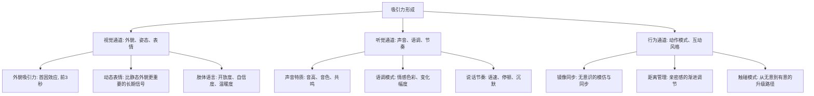
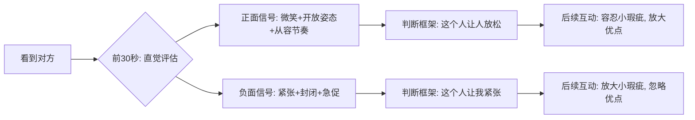
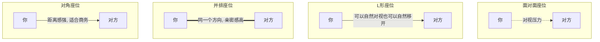
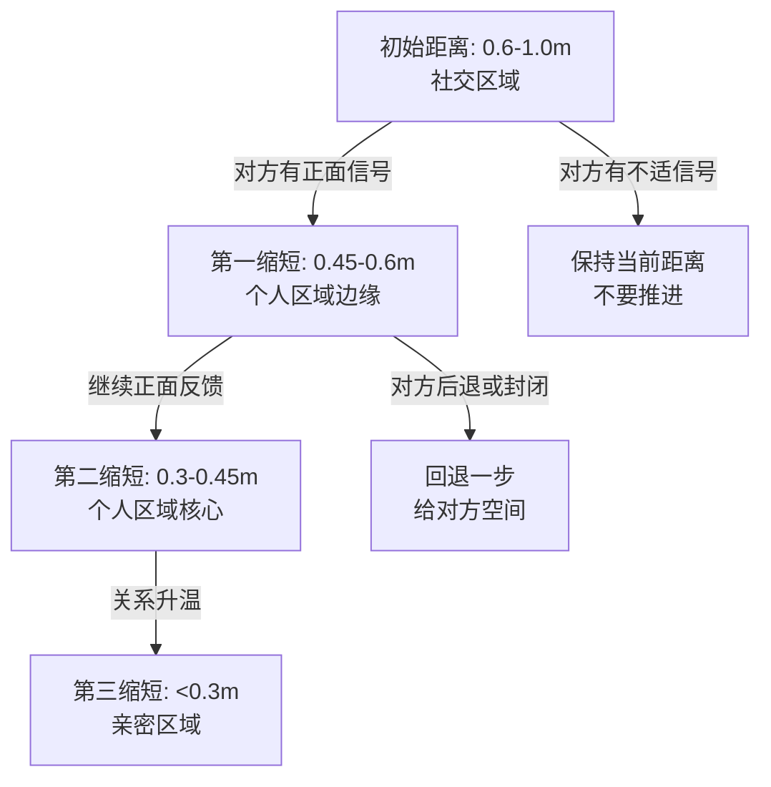
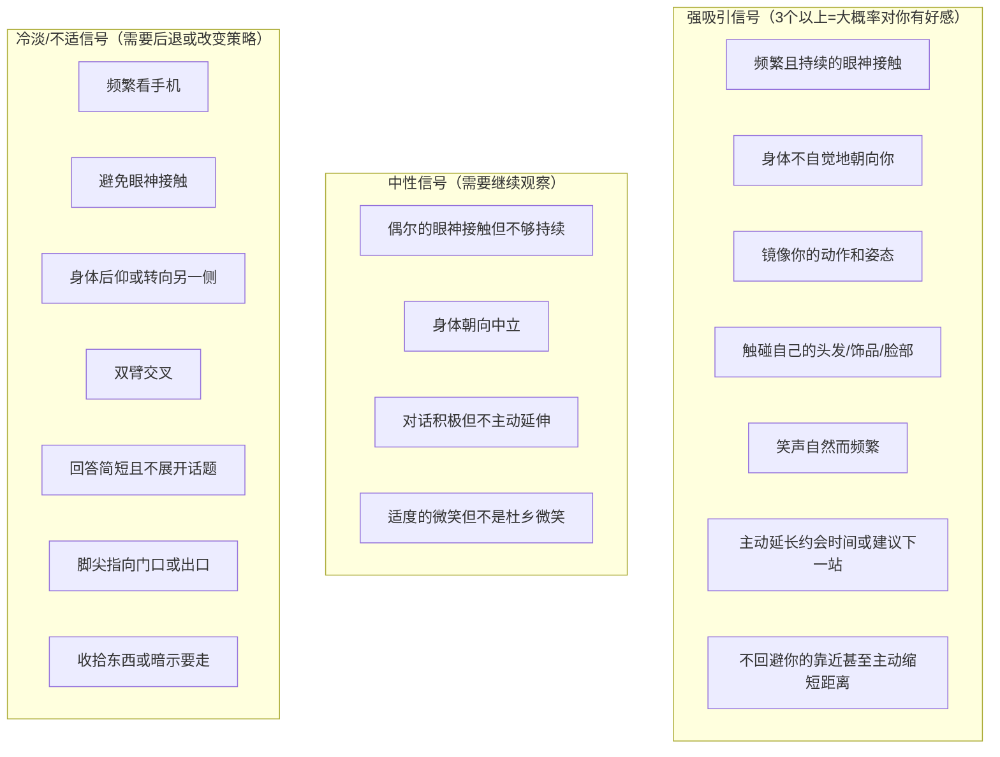

## 场景三：约会

### 情境描述

王浩通过社交软件认识了一位女生小美，两人在微信上聊了一周后，决定周末下午在一家咖啡厅进行第一次线下见面。王浩对这次约会既期待又紧张——他知道文字聊天和面对面完全是两回事，但不知道具体该怎么做。

### 约会场景的非语言本质

约会是所有社交场景中非语言信息密度最高的一种。不同于面试的单向评估或谈判的利益博弈，约会是**双向的吸引力试探与情感连接建立**。双方都在同时做两件事：向外发送"我是谁"的信号，以及向内解读"对方对我感觉如何"的信号。

**约会与面试的非语言对比：**

| 维度 | 求职面试 | 约会 |
|------|----------|------|
| 核心目标 | 证明能力 | 建立情感连接 |
| 关系类型 | 不对等（评估者vs被评估者） | 对等（双向选择） |
| 信号基调 | 专业、自信 | 温暖、真诚、有趣 |
| 距离变化 | 基本固定 | 随关系升温逐渐缩短 |
| 触碰 | 几乎没有 | 循序渐进，从无意到有意 |
| 失败代价 | 错过一份工作 | 错过一段关系 |
| 情感卷入度 | 低 | 高——直接影响自信和自我认知 |

约会的特殊性在于：**对方不是在评估你"够不够格"，而是在感受"和你在一起舒不舒服"**。这意味着你在面试场景中学会的"展示实力"策略，在约会中反而是有害的——过度展示会变成炫耀，过度自信会变成压迫。

### 约会中吸引力的非语言机制

#### 吸引力的心理学基础

吸引力不是"感觉对了"那么简单，它有清晰的心理学机制。理解这些机制，你才能知道自己的每个非语言动作在"做什么"。

**吸引力的三重通道模型：**



进化心理学的研究揭示了一个有趣的性别差异：女性在择偶时对非语言信号的敏感度显著高于男性。David Buss在37个文化中的跨文化研究表明，女性更看重男性的"社会地位信号"（通过自信的姿态、稳定的声音、从容的节奏来传递），而男性更看重女性的"生育力信号"（通过微笑、眼神接触、适度的身体展示来传递）。这并不是说"男性应该强势、女性应该温柔"——而是说，理解对方在"读"什么信号，你才能更有效地传递正确的信息。

#### 第一印象的形成机制

与面试场景一样，约会的第一印象也有一个"7秒窗口"。但约会的第一印象构成与面试截然不同：

**约会第一印象的权重分配：**

| 信号类别 | 权重（估算） | 具体内容 |
|----------|-------------|----------|
| 整体视觉印象 | 40% | 穿着打扮、体态、精神面貌 |
| 面部表情与眼神 | 25% | 微笑、眼神接触、面部放松度 |
| 声音特质 | 20% | 打招呼的声音、语调、音量 |
| 空间行为 | 10% | 走路姿态、站立姿态、就座方式 |
| 气味 | 5% | 体味、香水、口腔卫生 |

5%的气味权重看起来很小，但它是**一票否决项**——糟糕的气味可以在瞬间摧毁所有其他正面信号。同时，这5%也是最容易"白捡"的分数：干净的衣物、清新的口气、淡雅的香水，就能确保不会在这个维度失分。

### 约会全流程非语言策略

#### 第一阶段：约会前的准备（出发前2小时）

非语言管理不是从见到对方开始的，而是从出门前就开始了。你的身体状态、情绪状态和装备状态，都会直接影响你见面时的非语言输出。

**外在准备清单：**

```text
□ 着装
  - 选择符合场景的穿着（咖啡厅：商务休闲到休闲均可）
  - 合身是第一要义——不舒服的衣服会产生大量紧张小动作
  - 提前试穿完整行头，在镜子前走动5分钟检查
  - 颜色选择：蓝色系传递信任感和温暖，避免全黑（距离感）或大面积亮色（压迫感）

□ 个人卫生
  - 洗澡、洗头、修剪指甲（指甲长度不超过指尖）
  - 口腔清洁：刷牙+牙线+漱口水，约会前嚼一片薄荷糖
  - 男性：修剪鼻毛、胡须整理（留胡须要修型，不留要刮干净）
  - 女性：妆容自然为主，避免浓妆（第一次约会的"自然感"比精致感更重要）

□ 气味管理
  - 香水/古龙水：喷1-2下即可，涂在手腕内侧和耳后
  - 判断标准：站在你身旁30厘米处能隐约闻到为最佳
  - 绝对不要在密闭空间（如车内）大量喷洒

□ 细节检查
  - 牙齿上没有食物残渣
  - 衣领上没有头屑
  - 鞋子干净（对方会看你的鞋）
  - 手机调为静音
```

**内在准备清单：**

```text
□ 情绪校准
  - 回忆一次你最放松、最开心的社交经历，调用那种情绪状态
  - 做3-5次深呼吸（4秒吸气-4秒屏住-6秒呼气），降低皮质醇水平
  - 告诉自己："这不是考试，是两个人互相了解的过程"

□ 心态设定
  - 目标不是"让对方喜欢我"，而是"看看我们是否合得来"
  - 这个心态转换至关重要——它把你的角色从"表演者"变成了"探索者"
  - 探索者的非语言信号是自然、放松、好奇的
  - 表演者的非语言信号是紧张、刻意、讨好的

□ 话题准备（虽然不直接是非语言，但会影响你的自信度）
  - 准备3-5个轻松的话题方向（旅行、美食、爱好、最近看的电影/书）
  - 不要准备"脚本"——有大纲就够了，脚本会让你在偏离时更紧张
  - 准备2-3个关于对方的问题（开放式，不是查户口）
```

**提前到场的时间管理：**

比约定时间早到5-10分钟。这个时间窗口的管理很重要：

- **早到15分钟以上**：你在位置上等太久会产生焦虑，当对方到达时你可能已经消耗了一部分社交能量
- **早到5-10分钟**：刚好有时间熟悉环境、找到好座位、调整状态
- **准时到达**：风险是可能需要对方等你，第一印象直接减分
- **迟到**：除非有不可抗力，否则迟到传递的是"我不够重视你"。如果真的迟到，必须提前通知并真诚道歉，到达时的非语言信号要传递歉意（加快步伐、先道歉再寒暄）

#### 第二阶段：初次见面（前3分钟）

这是整个约会中最关键的3分钟。**对方的大脑正在这3分钟内形成一个关于你的"基本判断框架"**，后续的所有互动都会被这个框架过滤和解释——确认偏误会让她倾向于寻找支持初始判断的证据。



**见面瞬间的非语言清单：**

**1. 微笑——最重要的单一信号**

微笑是约会场景中权重最高的单一非语言信号。但不是所有微笑都有效——

- **有效微笑**：杜乡微笑（Duchenne smile）——嘴角上扬的同时，眼角出现鱼尾纹，眼睛"眯起来"。这种微笑调动了眼轮匝肌，是无法伪装的，大脑一眼就能识别出它是否真诚
- **无效微笑**：嘴角上扬但眼睛不动——这是"社交微笑"或"营业微笑"，在服务行业很常见，但在约会中会被解读为"不够真诚"
- **练习方法**：对着镜子练习微笑，观察自己是否有鱼尾纹。如果很难自然产生，试着在微笑时想一件真正让你开心的事——情绪会自然地通过面部肌肉表达出来

**2. 眼神接触——建立连接的桥梁**

- 第一眼看到对方时，眼神应该是**温暖的、带着笑意的**，而不是"扫描式的"或"评估式的"
- 打招呼时保持3-5秒的稳定眼神接触，传递"我很高兴见到你"
- 不要上下打量对方——即使你忍不住想看对方的穿着和身材，也要控制住。上下打量在潜意识中是"评估"信号，会让对方产生被审视的不适感
- 正确做法：看对方的眼睛和面部三角区（两眼到嘴巴的区域），余光自然地感知对方的整体形象

**3. 身体朝向与姿态**

- 身体朝向对方，传递"我的注意力在你身上"
- 双脚指向对方——脚尖方向是潜意识兴趣的可靠指标，因为大多数人不会刻意控制脚的方向
- 肩膀放松，不要耸肩（紧张信号）
- 如果你在座位上等待对方到来，在看到对方时站起来——这个动作传递尊重和重视

**4. 第一句打招呼**

- 声音清晰、音量适中、语调上扬（传递积极情绪）
- 内容简洁温暖即可："嗨，小美？我是王浩，很高兴见到你"
- 配合微笑和眼神接触
- 不要说"你比照片上好看"——虽然是夸奖，但在第一次见面的前3秒说出来，可能让对方觉得你在"评估"她的外貌。如果想夸，可以在聊了几分钟后的自然时刻说出来

**5. 问候的身体接触边界**

- 中国社交文化中，第一次见面通常不需要握手或拥抱
- 自然地点头微笑即可
- 如果对方主动伸手，你自然地回应
- 不要主动去握手——在约会场景中，过于正式的握手反而增加距离感

#### 第三阶段：就座选择（前5分钟）

座位选择是约会中最被低估的非语言策略。它直接决定了你们接下来几个小时的空间关系和互动模式。

**座位布局的心理学分析：**



| 座位类型 | 适用性 | 心理效果 | 推荐度 |
|----------|--------|----------|--------|
| L形（90度角） | 最佳选择 | 可以自然对视也可以移开视线，压力最低；肩膀靠近，便于后续距离缩短 | ★★★★★ |
| 并排（同一侧） | 初次约会可选 | 亲密感强，但缺乏眼神交流，可能过早侵入个人空间 | ★★★☆☆ |
| 面对面 | 常见但不理想 | 对视压力大，"面试感"强，容易产生对立感 | ★★☆☆☆ |
| 对角（斜对面） | 不推荐 | 距离感太强，像商务会面 | ★☆☆☆☆ |

**具体操作：**

1. 到达后先观察环境，找到L形座位（如沙发+单人椅的组合，或L形卡座）
2. 如果只有面对面的桌子，选择后背有墙壁或角落的位置——背后有支撑的座位在进化心理学中被称为"安全位置"，能降低无意识的防御感
3. 坐下后可以稍微偏转椅子角度，形成一个近似L形的布局
4. 不要选择中央位置——角落或靠墙的位置更私密，周围人的走动和噪音更少，有助于专注对话
5. 如果咖啡厅有室外座位且天气好，室外座位往往更好——开阔的空间天然降低压迫感，阳光和新鲜空气让双方更放松

**入座时的非语言细节：**

- 如果你先到，已经坐在位置上，对方来时你站起来迎接，然后等对方坐下你再坐下
- 坐下的动作要自然平稳——不要猛地坐下（紧张或粗鲁），也不要小心翼翼地坐下（不自信）
- 坐下后不要立刻翘二郎腿——先保持双脚平放的开放姿势，等关系稍微熟络后再自然调整

#### 第四阶段：对话中的非语言技巧（核心阶段）

对话是约会的主要内容，也是非语言信息密度最高的阶段。以下是按维度分解的具体策略。

##### 眼神运用的精细管理

眼神是约会中"连接感"的第一来源。它传递的信息量远超语言——一个眼神可以在瞬间传递"我对你感兴趣""你说的很有趣""我觉得你很可爱"等多种含义。

**约会眼神接触的节奏控制：**

```text
日常社交场景：    |—看—|—移开—|—看—|—移开—|
                  50-60%的看，40-50%的移开

约会场景：        |——看——|—移开—|——看——|—移开—|
                  70-80%的看，20-30%的移开

对方说话时：      |———看———|移|———看———|移|
                  80-90%的看，10-20%的移开
```

**不同情境下的眼神模式：**

| 情境 | 眼神模式 | 目的 |
|------|----------|------|
| 对方在讲自己的故事 | 持续注视，偶尔微微点头 | 传递"我在认真听你说话" |
| 你在讲一个有趣的事 | 时而看对方，时而看向斜上方回忆 | 传递自然和真诚，不是在"表演" |
| 对方说了好笑的事 | 先看对方的眼睛，然后自然地笑出来 | 让对方感受到"我的笑是给你的" |
| 说到比较私密的话题 | 眼神接触更深、更久，微微侧头 | 传递亲密感和信任 |
| 需要思考对方的问题 | 短暂地看向上方或旁边 | 传递"我在认真思考"而不是"我不想看你" |
| 感受到吸引力 | 瞳孔放大（无意识），眼睛微眯 | 这些信号无法伪装，大脑会自动识别 |

**眼神接触的进阶技巧——三角注视法：**

不要一直盯着对方的瞳孔（这会产生"凝视"的压迫感）。采用三角注视法——在对方的左眼、右眼和嘴巴之间自然轮换：

```text
        左眼 ──── 右眼
          \       /
           \     /
            嘴巴

每3-5秒自然轮换，节奏要慢、要自然
```

这个方法在初次约会中特别有效——它让你的眼神接触看起来更"丰富"而不是"死盯"。

**避免的眼神错误：**

- **长时间直视不移开**：超过10秒的不间断凝视，除非你们已经非常亲密，否则会让人不适
- **频繁看手机**：这是约会中最具破坏性的非语言行为，传递的信息是"你不如我的手机重要"
- **偷看其他地方**：在咖啡厅里，不要看路过的其他人，即使只是一瞬间——对方的余光会捕捉到
- **眼神游移不定**：频繁切换视线方向传递焦虑和不自信

##### 身体语言的系统管理

**开放姿态 vs 封闭姿态：**

```text
开放姿态（传递"我欢迎你"）：
┌─────────────┐
│    ○        │   头部正直或微微侧倾
│   /|\       │   肩膀放松，手臂自然放置
│    |        │   身体微微前倾
│   / \       │   双脚平放或自然交叉
└─────────────┘

封闭姿态（传递"别靠近我"）：
┌─────────────┐
│    ○        │   头部低垂或后仰
│   ╳╳╳       │   双臂交叉抱胸
│    |        │   身体后仰或转向一侧
│   ╳   ╳     │   二郎腿（远离对方的方向）
└─────────────┘
```

**身体前倾的微妙艺术：**

- 身体微微前倾5-15度，传递"我对你的话感兴趣"
- 前倾是一个渐进过程——约会开始时前倾角度较小，随着对话深入逐渐增加
- 过度前倾（超过20度）会传递"侵入感"和"急切感"
- 当对方说到让你真正感兴趣的内容时，自然地前倾——这个动作会比刻意的前倾更有说服力

**镜像同步（Mirroring）——约会中最强大的非语言连接技术：**

镜像同步是指你的身体动作、姿态和节奏无意识地与对方同步。当两个人处于"连接"状态时，镜像会自然发生——但你也可以有意识地促进它。

**镜像的正确方法：**

| 动作 | 正确镜像 | 错误镜像（模仿） |
|------|----------|-----------------|
| 对方端起咖啡杯 | 3-5秒后你也端起你的杯子 | 对方端起杯子你立刻端起 |
| 对方身体前倾 | 几秒后你也微微前倾 | 对方前倾你立刻前倾 |
| 对方说话速度快 | 逐渐调整到接近的语速 | 突然加快语速 |
| 对方用手势强调 | 你也在回答中加入适度手势 | 复制对方的具体手势 |
| 对方翘二郎腿 | 你也换个坐姿 | 立刻翘起同方向的腿 |

**镜像的关键原则：**

- **延迟3-5秒**：自然的镜像有延迟，即时模仿会被察觉
- **只镜像大类，不镜像细节**：对方摸头发你也摸头发不是镜像，是模仿
- **身体姿态>手势>面部表情**：优先镜像身体大动作，手势和表情的镜像要更微妙
- **不要100%镜像**：保持30-40%的差异，完全同步会让人感到诡异

**镜像失败的信号：** 如果你发现自己在努力镜像对方，但对方始终没有回镜你——她没有在你前倾时也前倾，没有在你微笑时也微笑——这可能意味着她还没有与你建立"连接感"。不要加倍努力去镜像，而是退一步，给对方更多空间。

##### 声音语调的情感传递

声音是约会中被严重低估的吸引力通道。研究表明，女性在排卵期对男性低沉声音的偏好会显著增加，而男性普遍偏好音调稍高的女性声音。但在第一次约会中，你不需要改变自己的天然音高——你需要管理的是**声音中传递的情感色彩**。

**约会声音管理的五个维度：**

| 维度 | 目标值 | 具体说明 | 常见错误 |
|------|--------|----------|----------|
| 音量 | 中等偏轻 | 比日常对话稍微轻一点，创造亲密感。咖啡厅的环境噪音通常是60-70分贝，你的音量控制在55-65分贝 | 声音太小听不清（不自信），声音太大压过环境（强势/粗鲁） |
| 语速 | 比平时慢10-15% | 放慢的语速传递从容和专注。目标：每分钟150-170字 | 紧张时语速加快，对方来不及消化你的话 |
| 语调 | 有起伏，有温度 | 关键词加重语气，开心的事语调上扬，认真的事语调下沉。声音中"带着微笑" | 全程平调（无聊），或者全程高亢（紧张） |
| 停顿 | 善用停顿 | 对方说完后停顿1秒再回应，传递"我在消化你说的话"。重要的话之前停顿0.5秒，创造期待感 | 害怕沉默，急于填满每一个空隙 |
| 回应声 | 自然、多样 | "嗯嗯""是吗""哇""真的吗"——这些回应声是对话的"润滑剂"，传递"我在听、我感兴趣" | 全程沉默地听（冷漠），或者回应声过于机械（敷衍） |

**声音中的微笑——最容易学会也最容易忽视的技巧：**

即使你没有笑出声，你的声音也可以"带着微笑"。方法：在说话时微微上扬嘴角。这个面部动作会改变你的口腔共鸣和声带张力，让你的声音听起来更温暖、更亲切。对方可能说不清为什么，但会觉得"你的声音很好听"。

**关于沉默的深度讨论：**

很多人害怕约会中的沉默，觉得"没话说了很尴尬"。但适度的沉默在约会中是有价值的——

- **舒适的沉默**：你们各自喝一口咖啡，看看窗外，然后自然地继续聊。这种沉默传递的是"我们在一起很放松，不需要用话语填满每一秒"
- **紧张的沉默**：你急着找话题，对方也急着找话题，双方都在填补空隙。这种沉默传递的是"我们之间没有默契"
- **创造舒适沉默的方法**：当对话自然停顿时，不要急着开口。微笑，端起杯子喝一口，自然地看一眼周围，然后再开启新话题。这个"缓冲区"让双方都有喘息的空间

##### 距离管理的渐进策略

人类学家Edward T. Hall提出的**空间距离理论（Proxemics）**将人际距离分为四个区域：

```text
|← 0 →|← 0.45m →|← 1.2m →|← 3.6m →|
  亲密    个人      社交      公开
  区域    区域      区域      区域

第一次约会的目标距离：0.45m - 1.2m（个人区域到社交区域的边界）
```

第一次约会的起点距离通常在0.6-1.0米之间——这是"个人区域"的外缘和"社交区域"的内缘的交界处。你的目标是通过约会的进程，自然地将距离缩短到"个人区域"内（0.45米以内），但这个过程必须是**渐进的**，而且必须伴随对方的正面反馈信号。

**距离缩短的升级路径：**



**缩短距离的自然方法：**

1. **展示型缩短**：给对方看手机上的照片、菜单上的推荐，自然地靠近
2. **倾听型缩短**：对方说话时微微倾身，传递"我听得很认真"
3. **环境型缩短**：选择一个需要并排坐的场景（如吧台座位），自然缩短物理距离
4. **话题型缩短**：聊到比较私密或有趣的话题时，自然地压低声音、靠近一些

**判断对方对距离的舒适度：**

- **对方没有移动**：她对你当前的距离是舒适的，可以维持
- **对方微微后退**：你的推进太快了，退回到上一个距离
- **对方也向前靠近**：她在邀请你更近一步，可以继续缩短
- **对方完全不调整**：可能有两种情况——她很舒适，或者她不确定该怎么办。观察其他信号（眼神、表情）来综合判断

##### 触碰的升级路径

触碰是约会中最强的亲密感信号，但也是最容易"越界"的非语言行为。正确的触碰可以让关系快速升温，错误的触碰可以直接终结约会。

**触碰的层级递进模型：**

```text
层级0：无触碰
  ↓ （对方有正面信号时升级）
层级1：无意触碰
  - 递东西时手指短暂接触
  - 并排走路时手臂偶尔碰到
  ↓ （对方没有退缩）
层级2：社交触碰
  - 轻拍对方上臂（强调某个好笑的事）
  - 过马路时轻触对方后背指引方向
  ↓ （对方有正面回应）
层级3：友伴触碰
  - 对方手冷时"握手取暖"
  - 看到有趣的东西轻拉对方手臂"快看"
  ↓ （关系已明显升温）
层级4：亲密触碰
  - 自然地牵手
  - 告别时的拥抱
```

**触碰的三个关键原则：**

1. **短触碰优于长触碰**：第一次触碰应该在1-2秒内自然结束。短触碰传递"这是自然发生的"，长触碰传递"我是故意的"
2. **公开部位优于私密部位**：上臂、肩膀、手背是安全的触碰区域；腰部、大腿、脸部是越界的触碰区域（第一次约会）
3. **功能性优于情感性**：递东西时的接触、指路时的后背轻触，比"找借口摸对方的手"自然得多

**触碰后的反馈解读：**

| 对方反应 | 含义 | 你的下一步 |
|----------|------|-----------|
| 没有退缩，继续对话 | 接受当前触碰层级 | 维持当前水平，等下一个自然时机 |
| 也回触你（如也拍你的手臂） | 积极欢迎 | 可以在后续适当升级 |
| 微微僵硬但没有退缩 | 不确定或有点紧张 | 暂时停止触碰，用其他方式（眼神、语言）建立更多舒适感 |
| 明显后退或闪避 | 拒绝触碰 | 立即停止，不要道歉（道歉反而放大尴尬），自然地继续对话 |
| 完全没有反应（僵住） | 可能不舒服 | 暂停触碰，观察其他信号 |

**触碰的自然时机：**

- **幽默时刻**：对方说了好笑的事，你笑着轻拍她手臂——"你也太搞笑了"。这是最自然的触碰时机
- **共鸣时刻**：对方分享了一段经历，你表示理解时轻触她手背——"我完全理解你的感受"
- **指引时刻**：在咖啡厅里指向某个东西，或在走路时指引方向——轻触后背或手臂
- **关怀时刻**：对方冷了，你递上外套——这些"服务性触碰"是非侵略性的，容易被接受

**第一次约会绝对不要做的触碰：**

- 摸头（除非她先表达了亲密感）
- 搂腰（过于亲密，第一次约会不合适）
- 触碰脸部（这是亲密关系中的行为）
- 未经允许就牵手（等关系升温到足够程度）
- 从背后拥抱（会让对方受到惊吓）
- 触碰时间超过5秒（第一次约会的触碰应控制在1-3秒）

#### 第五阶段：解读对方的非语言信号

约会不是单方面的"输出"，更重要的是"输入"——准确解读对方的非语言信号，才能知道自己的策略是否有效，以及应该如何调整。

**吸引力信号系统：**



**头发和饰品触碰的深层解读：**

当女性在对话中频繁触碰自己的头发（拨弄、缠绕、把玩）或摆弄饰品（项链、耳环），这在非语言沟通中通常被解读为**自我修饰行为（preening behavior）**——一种在吸引对象面前无意识地整理外表的行为。但要注意：

- 如果对方一直低头玩手机同时在拨弄头发，那可能只是无聊
- 只有在**与你保持眼神接触和对话的同时**触碰头发，才更有吸引力信号的含义
- 有些人天生就有玩头发的习惯，所以要与其他信号结合判断，不要只凭一个信号下结论

**笑声的分析：**

笑声是约会中最有价值的信号之一，但需要区分类型：

- **自然的笑（真笑）**：声音自然起伏，面部完全参与（眼睛眯起来），可能伴随身体前倾或触碰你。这是最强的正面信号
- **礼貌的笑（社交笑）**：嘴角上扬但眼睛不动，声音较短，身体姿态不变。这不一定是坏信号，但说明对方还没有完全放松
- **紧张的笑**：高频短促的笑声，可能伴随咬嘴唇或眼神闪避。对方可能对你有好感但很紧张，也可能感到了不适。需要结合其他信号判断

**脚的方向——最诚实的非语言信号：**

脚是身体中"最诚实"的部分，因为大多数人不会意识到自己的脚在指向哪里：

- 脚尖指向你 = 对你感兴趣
- 脚尖指向出口或另一侧 = 想离开或注意力不在此
- 脚尖不断变换方向 = 内心不平静或在考虑
- 一只脚指向你、一只脚指向别处 = 犹豫或准备离开

#### 第六阶段：告别与后续信号

约会的结束与开始一样重要——**近因效应**意味着最后一印象会被优先记忆。

**告别时的非语言清单：**

1. **结束信号**：当感觉到对话自然告一段落（不要等到无话可说），你可以说"今天聊得很开心"
2. **站起来的动作**：自然利落，不要急促（显得想逃）也不要犹豫不决
3. **告别距离**：恢复到刚见面时的距离（0.6-1.0米），不要在告别时突然缩短距离
4. **告别触碰**：如果整个约会氛围都很好，一个自然的拥抱是可以的。如果不确定，点头微笑加一句"回去路上注意安全"同样温暖
5. **眼神**：告别时的最后一次眼神接触要温暖——这将是她记忆中关于你的最后一个画面
6. **不要说"到家给我发消息"**——这句话虽然出发点是关心，但在第一次约会中可能让对方感到压力。如果想表达关心，可以说"路上小心"

### 约会中的常见非语言错误

以下按"破坏力"排序——排在前面的错误比后面的更容易直接毁掉约会。

**1. 全程"表演模式"——最致命的错误**

错误表现：你一直在"表演"自己是一个有趣、自信、成功的人。你说的每句话、做的每个动作都经过精心计算。你的非语言信号看起来"完美"但缺乏真实感。

为什么致命：人类的潜意识有一个极其敏锐的"真实性检测系统"——它通过微表情、语调波动、呼吸节奏等数百个微小信号来判断一个人是否"真实"。刻意表演的完美，比自然流露的不完美更让人不安。对方可能说不清哪里不对，但会感到"这个人让我不舒服"。

纠正方法：把目标从"给她留下好印象"切换为"看看我们是否合得来"。当你不是在表演而是在探索时，你的非语言信号会自然地变得真实和放松。

**2. 过度热情——让对方感到压力**

错误表现：见面时过于激动，对话中过度赞美，全程身体前倾几乎要贴到对方身上，告别时要求拥抱，当天晚上就发大量消息。

心理学机制：这触发了对方的"逃跑反应"——当有人对你表达出超出你当前感受程度的热情时，你会本能地想要后退。这不是"不喜欢你"，而是"被你的热情吓到了"。

纠正方法：热情的表达应该与你们当前的关系阶段匹配。第一次约会的热情度应该控制在"友好、温暖、有兴趣"的程度，而不是"热烈、激情、非你不可"。

**3. 手机依赖——无声的拒绝**

错误表现：不时看手机、回消息、刷社交媒体，或者把手机正面朝上放在桌上。

破坏力分析：每一次看手机，你在对方心目中的"重视度"就降低一分。手机正面朝上放在桌上，即使你不看，它也在传递一个信号——"随时可能有人找我，我的注意力随时可能被分散"。

纠正方法：手机静音，放在口袋里或包里。如果必须看手机（比如确认时间），先说"不好意思我确认一下时间"，快速看一眼就收起来。

**4. 紧张性小动作——泄露焦虑的窗口**

错误表现：抖腿、转杯子、撕餐巾纸、不停地摸脸、咬嘴唇、敲桌子、玩餐具。

这些动作的共同特征是**重复性**——一次两次没问题，但高频重复的小动作会强烈传递焦虑信号。对方的大脑会自动将这些信号与"这个人不自信""这个人很紧张"关联。

纠正方法：双手自然地放在桌上或膝盖上，如果手实在控制不住，握住杯子（但不要转）。脚平放在地面上，有意识地检查是否有抖腿。每隔10-15分钟做一次"身体扫描"——从头到脚快速检查自己是否有紧张性小动作。

**5. 眼神管理失当——两种极端都致命**

错误表现A：眼神闪躲——说话时频繁看地板、天花板、周围环境，就是不看对方。传递：不自信、可能在说谎、对话题不感兴趣。

错误表现B：死盯——从头到尾盯着对方的眼睛不移开。传递：有攻击性、让人不适、缺乏社交直觉。

纠正方法：采用"70-80%注视+20-30%自然移开"的节奏。移开视线时，可以看自己的杯子、看一眼窗外、做出思考的表情看向上方——这些自然的移开不会被解读为闪躲。

**6. 空间入侵——不尊重个人边界**

错误表现：没有经过渐进的升级就直接坐得很近、试图牵手、触碰敏感部位。

为什么严重：约会中的个人边界是女性安全感的基础。一旦边界被侵犯，信任感很难恢复。即使对方表面上没有拒绝，内心可能已经给这次约会打了低分。

纠正方法：严格遵循距离和触碰的层级递进模型。每一步升级都等待对方的正面反馈信号。宁可慢一步也不要快一步——如果对方对你有好感，她会给你更明确的信号让你推进。

**7. 对比和炫耀——适得其反的自信展示**

错误表现：不断提到自己的收入、车、房、旅行经历、人脉关系，或者用贬低他人来抬高自己。

心理学机制：真正自信的人不需要用语言来证明自己的价值——他们的非语言信号（从容的姿态、稳定的声音、放松的表情）已经传递了足够的信息。需要用语言"证明"自己的人，反而暴露了内心的不自信。

纠正方法：让非语言信号替你"说话"。一个姿态从容、眼神温暖、声音稳定的人，不需要开口说自己有多少钱——对方已经感受到了你的"气场"。

### 不同约会场景的非语言差异

#### 咖啡厅约会（本案例）

- 环境噪音适中（55-65分贝），声音管理相对容易
- L形或并排座位选择余地大
- 可以通过"看菜单""品咖啡"等动作制造自然的节奏变化
- 时间弹性：可以从1小时延长到3小时，也可以1小时内自然结束

#### 餐厅约会

- 餐桌对面座位更常见，需要更多地管理"对面而坐"的压力
- 吃东西时的非语言信号需要注意：吃相、用餐礼仪、对食物的反应
- 买单时的非语言：自然地买单（不要表演"抢单"），如果对方坚持AA也自然接受
- 酒精的影响：小酌可以放松，但绝不要过量——醉态是约会中最具破坏性的非语言输出

#### 户外活动约会（散步/公园/展览）

- 身体活动降低了"对话压力"，但增加了"并排行走"的非语言管理
- 并排行走时保持步速同步——这是户外约会中的"镜像"形式
- 遇到有趣的景物时自然地指向、分享、讨论，创造互动节奏
- 走路时的距离管理：开始保持一肩宽，随着舒适度增加可以逐渐靠近

#### 电影/演出约会

- 观看期间几乎没有互动机会，非语言管理主要在前后的"开场"和"收尾"
- 黑暗环境降低了眼神交流的重要性，但增加了身体距离和触碰的感知
- 并排坐的距离：开始保持一拳距离，如果氛围好可以自然靠近
- 散场后的讨论是真正的"约会"部分——此时的非语言信号比看电影时更重要

### 文化差异与注意事项

中国约会文化中的非语言规则与西方存在显著差异：

| 维度 | 中国主流文化 | 西方文化 | 你的应对 |
|------|-------------|----------|----------|
| 第一次见面的身体接触 | 通常没有，点头微笑即可 | 可能有拥抱或贴面礼 | 入乡随俗，如果在国内约会，不要突然拥抱 |
| 直接表达"我喜欢你" | 可能被认为太直接，通过行动暗示更常见 | 比较直接的语言表达更被接受 | 第一次约会以行动暗示为主，不要急于语言表白 |
| 买单 | 男性买单更常见 | AA或轮流买单更常见 | 自然地买单，如果对方坚持AA也不必强求 |
| 告别方式 | 比较含蓄，"回去路上注意安全" | 可能直接说"今天很愉快，我们可以再见面" | 保持含蓄但真诚，不必学西方的直白 |

**个体差异比文化差异更重要：** 以上只是大致趋势，每个人的舒适区不同。最好的策略是观察对方的非语言信号，以此为指南调整自己的行为，而不是按照任何"文化规则"行事。

### 约会后的非语言复盘

约会结束后24小时内做一次复盘，这比"多约几次"更能快速提升你的约会能力。

**复盘清单：**

```text
1. 初次见面阶段
   □ 我的微笑是杜乡微笑还是社交微笑？
   □ 眼神接触是否温暖自然？
   □ 第一句话的声音语调如何？
   □ 对方见到我时的第一反应是什么？

2. 就座与环境
   □ 座位选择是否合适？有没有更好的选择？
   □ 入座时的动作是否从容？

3. 对话阶段
   □ 眼神接触的节奏是否在70-80%？
   □ 有没有出现紧张性小动作？（抖腿、转杯子等）
   □ 声音是否稳定？语速有没有越说越快？
   □ 沉默出现时我是如何处理的？舒适还是尴尬？
   □ 我的倾听反馈是否足够？（点头、表情同步、回应声）

4. 距离与触碰
   □ 距离是否有自然的缩短过程？
   □ 触碰是否自然？对方的反馈如何？
   □ 有没有在对方不适时继续推进？

5. 对方信号解读
   □ 对方展示了哪些吸引信号？
   □ 对方有哪些冷淡/不适信号？我是否及时调整？
   □ 整体来看，对方对我的兴趣度如何？

6. 告别阶段
   □ 告别是否自然温暖？
   □ 最后一个眼神接触的质量如何？
```

如果可能，约会后用语音备忘录快速记录自己的感受和观察（趁记忆新鲜），而不是依赖几天后的回忆——大脑会自动美化或扭曲记忆，降低复盘的价值。

### 高阶技巧：从"不出错"到"出彩"

当你已经掌握了上述基础技巧，以下进阶策略能让你的约会非语言沟通从"得体"升级为"有魅力"。

**1. 情绪共振（Emotional Resonance）**

不只是镜像对方的身体动作，更是与对方的**情绪状态同步**。当对方开心时，你也是真的开心（不是"表演开心"）；当对方分享一段低落的经历时，你的眼神和语调自然地变得柔和和关切。

这种情绪共振依赖于**镜像神经元**——当你真正"听到"对方的故事，你的大脑会自动模拟对方的情绪状态。但前提是你真的在听，而不是在想"我接下来要说什么"。

**2. 节奏控制（Pacing）**

约会的节奏应该像一首好歌——有快有慢，有高潮有低谷。

- **开场**：轻松、温暖、节奏稍慢（双方都在适应）
- **热络期**：语速加快，笑声增加，话题变得更深入
- **低谷期**：自然的沉默，各自喝咖啡，看看周围（给双方喘息空间）
- **深入期**：话题变得更私密，声音更轻，距离更近
- **收尾**：回归温暖和轻松，留有余韵

不要试图全程保持"高能状态"——这既不可持续，也会让对方疲劳。

**3. 留白艺术（Strategic Incompleteness）**

第一次约会不要把自己的故事全部讲完。在最精彩的地方停住——"这个故事下次再说"。这创造了两个效果：

- **好奇感**：对方对你有未完成的了解，会想再见到你
- **自我暴露的渐进**：心理学研究表明，自我暴露的渐进性（每次分享多一点）比一次性全盘托出更能建立信任和亲密感

这不只是语言层面的技巧——在非语言层面，你可以在某个话题正深入时自然地转换话题，用一个微笑和"我们下次再聊这个"来创造"留白"。

**4. 临别锚定（Departure Anchoring）**

告别时的最后一个非语言信号会成为对方关于这次约会的"锚定记忆"。

- 在告别前的最后几分钟，聊一个轻松愉快的话题——让对方带着笑容和好心情结束约会
- 最后一个眼神接触要温暖、有深度——传递"和你在一起的时间很愉快"
- 如果你决定拥抱，这个拥抱应该是温暖但短暂的（2-3秒）——短暂的拥抱留下"意犹未尽"的感觉，过长的拥抱可能让人不适

---

约会中的非语言沟通，本质上是一场**真诚的对话**——不是你和对方之间的语言对话，而是你的身体与对方的身体之间的潜意识对话。所有的技巧、策略和框架，最终都服务于一个目标：**让你的真实自我被对方看到**。当你的语言、表情、声音和姿态传递同一个故事——"我是一个温暖、自信、真诚的人"——吸引力就是自然发生的结果，而不是刻意追求的目标。

***
