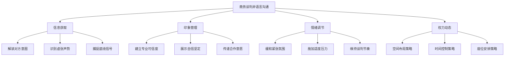

## 场景四：商务谈判

### 情境描述

陈刚是一家制造企业的采购总监，需要与一家供应商就年度采购合同进行谈判。合同金额约2000万元，双方在价格、交货期和付款条件上存在分歧。供应商代表是一位经验丰富的销售副总裁，擅长用高压策略迫使对方让步。陈刚必须在维护长期合作关系的前提下，争取到对公司最有利的合同条款。

这不是一场简单的讨价还价——它是一场信息不对称的心理博弈。双方都在试探对方的底线，都在试图获取更多的信息优势。而在这种博弈中，非语言信号往往比语言本身传递更多的真实信息。

### 为什么商务谈判中的非语言沟通至关重要

哈佛商学院的一项研究表明，商务谈判的最终结果有 **65% 受到非语言因素的影响**——包括双方的肢体语言、语调、空间距离和时间管理策略。阿尔伯特·梅拉比安（Albert Mehrabian）的经典研究进一步指出，在情感和态度的传递中，语言内容仅占 7%，声音语调占 38%，而肢体语言占 55%。

在商务谈判的语境下，这意味着：

| 维度 | 影响方式 | 典型表现 |
|------|---------|---------|
| **信息获取** | 通过观察对方的非语言信号判断其真实意图 | 对方说"这是我们最好的价格"时，身体后仰、避免眼神接触，可能暗示还有让步空间 |
| **印象管理** | 通过控制自己的非语言输出传递专业形象 | 稳定的坐姿、适度的眼神接触、有力的握手，建立可信度 |
| **情绪调节** | 通过非语言策略管理谈判氛围 | 在紧张时刻降低语速、使用开放手势，缓和对抗情绪 |
| **权力动态** | 通过空间、时间和姿态建立心理优势 | 主场优势、控制议程节奏、占据更大的物理空间 |

### 谈判前的非语言准备

大多数人在谈判前只准备语言内容——数据、论点、让步方案。但非语言准备同样重要，甚至更重要。

#### 主场与客场的心理效应

谈判地点的选择是一个被严重低估的非语言策略。

**主场优势**：在自己的办公室或会议室谈判，你会感到更自信、更放松。你的团队成员也更容易配合非语言策略。研究显示，主场谈判者平均获得 **更好的结果高出 15-20%**。

**客场策略**：如果必须在对方的地盘谈判，提前到达——熟悉环境能显著降低焦虑感。提前 15-20 分钟到达，了解座位布局、灯光、温度，让自己适应环境。

**中立场地**：如果双方都不愿意让步，选择中立的第三方场所（如酒店会议室）。中立场地传递的信号是"公平谈判"，有助于降低双方的防御心理。

#### 座位布局的战略选择

座位安排是谈判中最基础也最容易被忽视的非语言策略：

| 座位类型 | 适用场景 | 传递的心理信号 | 具体操作 |
|---------|---------|--------------|---------|
| **圆桌** | 合作型谈判、长期关系维护 | 平等、合作、伙伴 | 双方代表交替落座，避免阵营分明 |
| **L形座位** | 有合作意向但需保护己方利益 | 半合作、有边界 | 主谈人坐在拐角两侧，既面对面又不完全对立 |
| **面对面** | 竞争型谈判、立场明确 | 对抗、博弈 | 双方团队各坐一侧，中间留足够距离（≥1.5米） |
| **斜角座位** | 一对一深度对话 | 亲密但有保留 | 成 90-120 度角，减少正面对抗感 |

**实操建议**：如果对方安排了你不喜欢的座位布局，可以通过"去取水""调整投影仪""叫同事过来"等方式自然地调整位置。

#### 着装的非语言语言

商务谈判中的着装是第一印象的核心组成部分：

- **保守行业（金融、法律、政府）**：深色西装、纯色领带、简洁配饰。传递的信号是"我尊重这场谈判的专业性"
- **创意行业（科技、设计、媒体）**：商务休闲即可，但要比对方稍微正式一点。传递"我认真对待但不刻板"
- **跨文化谈判**：研究对方国家的商务着装规范。日本商务谈判中，深色西装几乎是必须的；而硅谷的谈判中，西装可能传递"过于正式"的信号

**细节决定成败**：袖扣、手表、皮鞋——这些细节在高水平谈判中都会被对方观察。不需要名牌，但需要整洁、得体、一致。

#### 心理状态的自我校准

谈判前 10-15 分钟的心理准备直接影响你的非语言表现：

1. **身体扫描**：从头到脚感受身体状态，释放不必要的紧张。肩膀是否紧绷？下巴是否咬紧？双手是否攥拳？
2. **呼吸调节**：做 5 次深呼吸（4 秒吸气、7 秒屏息、8 秒呼气），将心率降到正常水平
3. **力量姿势（Power Pose）**：Amy Cuddy 的研究显示，谈判前保持 2 分钟扩展性姿势（双手叉腰、抬头挺胸）可以提升睾酮水平、降低皮质醇，增加自信感
4. **预演**：在脑中预演谈判的关键时刻，想象自己用冷静、自信的非语言方式应对

### 开场阶段的非语言策略

谈判的前 3-5 分钟决定了整个谈判的基调。这个阶段的非语言目标是：**建立信任、传递专业、设定氛围**。

#### 握手的艺术

握手是商务谈判中最正式的非语言接触，它在瞬间传递大量信息：

**正确的商务握手**：
- 站起来迎接（如果你坐着，对方的第一印象就是"这个人不太重视"）
- 走向对方，不要隔着桌子伸手
- 全掌相握，不是只握手指
- 力度坚定但不粗暴——想象你在握住一只小鸟：不能让它飞走，也不能捏死它
- 保持 2-3 秒，同时建立眼神接触
- 微笑，说"很高兴见到你"或"感谢您抽出时间"

**握手中的权力信号**：
- **主导型握手**：手心向下，覆盖对方的手——传递"我是主导方"
- **顺从型握手**：手心向上，被对方覆盖——传递"我尊重你的主导地位"
- **平等型握手**：双方手掌垂直——传递"我们是平等的合作伙伴"

**应对棘手的握手**：
- 对方用力握你：保持冷静，不要回以更大力量，微笑应对
- 对方只伸手尖：不要表现出不满，自然地调整握手方式
- 对方双手握你（政客式握手）：可以用另一只手轻拍对方手背回应

#### 开场寒暄的非语言维度

寒暄看似闲聊，实际上是双方互相评估的第一轮非语言博弈：

- **眼神接触**：在寒暄时保持 60-70% 的时间有眼神接触，太少显得不自信，太多显得有攻击性
- **微笑**：保持自然的微笑，不要"面具式微笑"（只有嘴动，眼睛不动）。真实的微笑（杜兴微笑）会带动眼角的鱼尾纹
- **身体朝向**：整个身体面向对方，而不是只转头。传递"我完全在关注你"
- **声音温度**：语速适中、音调温暖、音量适中。寒暄阶段不宜使用过于正式或过于随意的语调
- **空间距离**：保持社交距离（1.2-3.6米），不要一开始就靠得太近

**寒暄的时长控制**：寒暄过短（<2分钟）显得急功近利，寒暄过长（>10分钟）浪费双方时间。5-8 分钟是比较理想的长度，除非对方明显想继续寒暄来建立关系。

### 谈判过程中的非语言策略

#### 传递自信与坚定

自信不是"装出来的强硬"，而是通过一系列协调一致的非语言信号传递出来的稳定感：

**坐姿与姿态**：
- 坐直但不僵硬——脊柱挺直，肩膀放松下垂，双脚平放地面
- 双手自然放在桌上或椅子扶手上，不要交叉抱胸（防御信号）也不要双手合十祈祷状（紧张信号）
- 占据合理的空间——不要缩成一团，也不要"摊开"太多（侵入对方空间）
- 避免"封闭姿势"：交叉双臂、翘二郎腿、身体后仰——这些都会传递防御或傲慢的信号

**声音控制**：
- **语速**：保持稳定的语速（每分钟 120-150 个字），不因对方的压力而加快。当你要强调关键点时，有意识地放慢语速
- **音调**：使用胸腔共鸣的低音调，比尖细的高音调更有权威感。特别在陈述立场时，音调要稳定不颤抖
- **音量**：正常交流时保持适中音量。在表达底线时，音量适当降低——这比大声更有力量。降低声音迫使对方集中注意力，传递"这很重要"的信号
- **停顿**：在关键信息前后加入停顿，给对方时间消化。停顿传递的是"我知道我在说什么，我不需要急着填满沉默"

**手势策略**：
- **下压手势**（手掌向下）：用于强调立场和底线，传递控制感
- **切割手势**（手掌垂直）：用于列举要点和分步骤陈述，传递条理性
- **展示手势**（双手展开）：用于呈现数据和方案，传递开放性
- **避免**：手指指人（攻击性）、双手紧握在身后（紧张）、频繁摸脸/鼻子（不自信）、敲桌子（急躁）

**眼神运用**：
- 陈述立场时保持稳定的眼神接触（5-7 秒），传递"我对此有信心"
- 提出要求后保持眼神接触，不要先移开视线——先移开的一方往往处于心理弱势
- 思考时可以将目光稍微上移（表示在整理思路），但不要看向地面（表示不自信或在编造）

#### 传递开放与合作

商务谈判不是战场——即使在竞争激烈的谈判中，也需要保持合作的基本信号，否则谈判会陷入僵局甚至破裂：

**倾听的姿态**：
- 身体微微前倾（10-15度），传递"我在认真听你说"
- 适度点头——频率不要太快（不耐烦），也不要太慢（心不在焉）。每 15-20 秒点一次头，频率与对方的语速匹配
- 使用接纳手势（掌心向上）表示愿意倾听和考虑
- 在对方说话时发出"嗯""对""我理解"等简短回应，配合点头

**微笑的策略性使用**：
- 不要全程保持微笑——这会显得不真诚或不在意
- 在以下时机微笑：开场寒暄时、对方讲到轻松话题时、双方达成一致时、缓解紧张氛围时
- 在以下时机收起微笑：讨论严肃条款时、表达立场时、对方提出不合理要求时

**声音温度的调节**：
- 在讨论常规条款时使用温暖、轻松的语调
- 在讨论关键利益时切换到严肃、专业的语调
- 在需要缓和氛围时，语调可以稍微上扬，增加亲和力

#### 解读对方的非语言信号

商务谈判中，解读对方的非语言信号是一项关键能力。以下是经过研究和实践验证的信号模式：

**识别虚张声势**：

虚张声势（bluffing）是商务谈判中最常见的策略之一。当对方"说硬话"但内心缺乏底气时，通常会泄露以下非语言信号：

- 语言与非语言不一致：嘴上说"这是我们最终的报价"，但身体微微后仰、眼神飘移
- 过度强调：语调突然升高、手势幅度变大、反复重复同一句话——真正有底气的人不需要这么"用力"
- 防御性姿态：交叉双臂、身体后仰、下巴微收
- 微表情泄露：嘴角快速下撇（轻蔑或不确定）、眉毛快速上扬（意外或心虚）、频繁眨眼（焦虑）
- 紧张性小动作：手指轻敲桌面、脚踝交叉摩擦、频繁调整领带或袖口

**识别真实意愿**：

当对方确实有诚意达成交易时，非语言信号通常是一致的、自然的：

- 语言与非语言同步：嘴上说"我们很重视这次合作"，身体前倾、眼神真诚
- 开放姿态：双手自然放置、身体面向你、手掌偶尔向上展示
- 主动互动：主动提问、做笔记、点头回应你的观点
- 镜像行为：不自觉地模仿你的姿势和动作（镜像效应是亲和力的自然表现）
- 放松但专注：呼吸平稳、表情自然、反应不急不缓

**识别对方接近底线**：

这是谈判中最关键的信号——它告诉你何时停止施压、开始寻找共识：

- **语速突然变化**：要么明显加快（焦虑），要么明显放慢（在仔细斟酌每一个字）
- **出现紧张性小动作**：搓手、摸脖子、整理文件、喝水频率增加
- **反复重复同一立场**：用不同的话反复说同一件事——"我理解你的意思，但是……""这个……确实……但是……"
- **寻求团队确认**：频繁看同事、与团队成员交换眼神、要求"我们内部讨论一下"
- **表情更加严肃**：面部肌肉紧绷、下巴收紧、嘴角平直
- **声音变化**：音调升高、声音变紧、出现"嗯……""呃……"等犹豫填充词

**识别对方想要结束谈判**：

- 频繁看手表或手机
- 开始整理桌面文件和物品
- 身体后仰、重心转向出口方向
- 语速变慢、回应变短
- 总结性语言增多："那么总的来说……""如果大方向没问题的话……"
- 开始讨论与谈判无关的话题（试图"软着陆"）

### 关键时刻的非语言技巧

#### 沉默的力量

沉默是商务谈判中最被低估的非语言工具。

**为什么沉默有效**：人类天生对沉默感到不适——平均只需 **4 秒的沉默** 就会让人产生焦虑感并试图填补这个空白。在谈判中，这意味着当你保持沉默时，对方往往会主动解释、让步或暴露更多信息。

**如何正确使用沉默**：

1. **对方提出条件后**：不要急于回应。保持沉默 3-5 秒，看着对方（表情中性，不带攻击性）。大多数情况下，对方会主动解释或补充，甚至直接让步
2. **你在陈述立场后**：说完你的立场后，停下来。不要因为心虚而继续解释、加理由、做铺垫。"我们的价格是每吨 8500 元。"然后闭嘴。每一次额外的解释都在削弱你的立场
3. **对方反驳你之后**：对方说"这个价格太高了"。不要急于辩护。沉默 3-5 秒，然后问："您期望的价格是多少？"——把球踢回去

**配合沉默的非语言信号**：
- 眼神保持接触，表情中性（不要皱眉也不要微笑）
- 身体姿态稳定，不要开始摆弄东西
- 如果沉默持续超过 10 秒，可以缓慢点头，示意"我在思考"

#### 惊讶反应（The Flinch）

**原理**：当你对对方的条件表现出"惊讶"——即使是假装的——你向对方传递了一个信号："这个条件超出了我能接受的范围。"这会让对方重新评估自己的立场，甚至主动修改条件。

**正确的惊讶反应**：
- 微微皱眉（不要太夸张）
- 身体微微后仰
- 嘴巴微张（"真的？"）
- 停顿 2-3 秒后说："这个数字……嗯……比我们预期的要高/低不少"
- 可以配合摇头（幅度不要太大）

**常见的错误**：
- 反应过度（太戏剧化，对方一眼看穿）
- 反应不足（太微弱，对方没有注意到）
- 反应时机不对（在对方还没说完时就开始反应）

**什么时候使用**：适用于谈判初期的报价阶段，特别是当对方第一次出价时。但要慎用——如果每次报价你都"惊讶"，对方会认为你在表演。

#### 为难表演（The Nibble）

**原理**：在考虑对方条件时，表现出"为难"——搓下巴、深呼吸、看向远处思考——向对方传递一个信号："接受这个条件对我来说是很困难的。"这为后续要求对方做出补偿性让步创造了心理基础。

**具体操作**：
1. 听完对方的条件后，暂停 3-5 秒
2. 做出"为难"的非语言信号：搓下巴、深吸一口气、微微摇头、看手中的资料
3. 然后用缓慢的语速说："这个条件……我需要认真考虑一下……"
4. 如果可能，提出一个你需要的补偿条件："如果价格是这样的话，交货期能不能缩短到 30 天？"

**进阶用法**：把"为难"和"沉默"结合——在为难的沉默中，让对方主动提出补偿方案。

#### 记录与确认

**为什么记录有效**：当你在对方提出条件时认真做记录，你传递了两个信号：
1. "我认真对待你说的每一句话"（尊重）
2. "我会仔细核实和考虑"（不急于做决定）

**具体操作**：
- 准备一个专业的笔记本（不是手机——手机会让人觉得你在刷微信）
- 在对方陈述要点时，有节奏地做记录
- 偶尔抬头确认："您刚才提到交货期是 45 天，对吗？"
- 记录的同时给自己争取思考时间——对方不会打断正在记录的人

#### 战略性喝水

喝水是一个简单但有效的非语言管理工具：

- **争取思考时间**：对方提出棘手问题时，拿起水杯慢慢喝一口，给自己 3-5 秒思考时间
- **缓解紧张**：当你感到紧张时，喝水可以短暂打断焦虑循环
- **调节节奏**：在谈判节奏过快时，通过喝水自然地降速

### 跨文化谈判中的非语言差异

在全球化的商务环境中，跨文化非语言沟通能力是一项必备技能。不同文化对同一个非语言信号可能有完全不同的解读：

#### 空间距离的文化差异

| 文化类型 | 典型代表 | 谈判中的舒适距离 | 特点 |
|---------|---------|----------------|------|
| **接触型文化** | 中东、拉丁美洲、南欧 | 0.5-1米 | 靠近、触碰、目光接触频繁 |
| **中等距离文化** | 中国、日本、韩国 | 1-1.5米 | 适度靠近，避免过度触碰 |
| **非接触型文化** | 北欧、德国、英国 | 1.5-2.5米 | 保持距离，触碰很少 |

#### 眼神接触的文化含义

- **东亚文化（中日韩）**：过长时间的直接眼神接触被视为不尊重，尤其是对上级或年长者。适当的眼神接触是可以的，但要配合偶尔的视线转移
- **中东文化**：同性之间强烈的眼神接触是信任的标志；异性之间则需要更加克制
- **欧美文化**：稳定的眼神接触被视为自信和诚实的标志；避免眼神接触则被视为不自信或有所隐瞒
- **南亚文化**：下级对上级避免直接眼神接触是尊重的表现

#### 时间观念的文化差异

- **单一时间文化（Monochronic）**：美国、德国、北欧——准时开始、按议程推进、尽快达成结论。迟到被视为不尊重
- **多维时间文化（Polychronic）**：中东、拉丁美洲、南亚——关系优先于议程，灵活的时间安排是正常的。急于推进谈判被视为不尊重关系
- **中国文化的特殊性**：中国商务谈判兼具两种特征——正式场合偏向单一时间（准时），但关系建设阶段偏向多维时间（寒暄、饭局可能很长）

#### 鞠躬与身体接触

- **日本**：鞠躬是核心礼节。鞠躬角度传递地位信息（15度=日常问候，30度=正式致敬，45度=最高敬意）。在商务谈判中，对方鞠躬时你也应该鞠躬，角度不要超过对方
- **东南亚**：避免用左手递文件或名片（左手被视为不洁）
- **欧美**：拥抱、贴面礼在商务场合越来越常见，但首次谈判通常从握手开始

#### 点头与摇头的文化陷阱

- **保加利亚和印度部分地区**：左右摇头表示"是"，上下点头表示"不"——与中国完全相反
- **日本**：点头不一定表示同意，很多时候只是表示"我在听"
- **中国**：注意区分"理解性点头"和"同意性点头"——不要因为对方频繁点头就认为他们同意了你的条件

### 线上谈判的非语言策略

疫情后，越来越多的商务谈判通过视频会议进行。线上环境对非语言沟通提出了新的挑战和要求。

#### 视频谈判的独特挑战

- **信号丢失**：摄像头只能捕捉上半身，大量肢体语言信息丢失
- **延迟干扰**：网络延迟导致非语言信号不同步，增加误解风险
- **疲劳效应**：视频谈判中的"Zoom疲劳"会降低双方的注意力和判断力
- **多任务诱惑**：对方可能在同时做其他事，非语言信号（如视线偏移）可能不是针对你的

#### 视频谈判的非语言优化

**镜头管理**：
- 摄像头放在与眼睛齐平的位置（不要从下往上拍——显得不专业；也不要从上往下拍——显得俯视）
- 镜头内只露出胸部以上，保持"社交距离"的画面比例
- 眼睛看向镜头而不是屏幕上的对方画面——这是视频谈判中最容易犯的错误
- 背景保持简洁专业（或使用真实但整洁的办公背景）

**灯光与画面**：
- 光源从正面来（不要背光——你的脸会变成黑影）
- 使用柔光灯或自然光，避免强烈顶光
- 穿纯色衣服（避免条纹和复杂图案——摄像头会"花屏"）

**声音控制**：
- 使用外接麦克风或耳机，提升音质
- 在说话前停顿半秒（补偿网络延迟）
- 语速比面对面谈判略慢——视频中的信息传递效率更低

**手势放大**：由于摄像头只拍到上半身，手势需要比面对面时更明显。但幅度不要太大——太大在镜头里会显得夸张。

### 谈判僵局的非语言破冰

当谈判陷入僵局——双方都不愿让步——非语言策略往往是打破僵局的关键。

#### 改变物理环境

- **"休息一下"**：提出休息 10-15 分钟。离开谈判桌，走到窗边或走廊。物理位置的改变会重置双方的心理状态
- **"换一个地方"**：如果双方在会议室僵持，提议"我们去咖啡厅继续聊？"环境的改变传递"我们需要换一种方式"的信号
- **"一起吃个饭"**：中国商务文化中，饭局是非正式谈判的核心场所。从谈判桌转移到饭桌，意味着从"对抗模式"切换到"关系模式"

#### 非语言的"示弱"

适时的"示弱"不是软弱，而是一种高级策略：

- **声音变化**：从坚定的语气切换到更柔和、更真诚的语气
- **身体语言**：从"谈判姿态"切换到"对话姿态"——身体微微前倾、双手摊开、眼神更柔和
- **节奏变化**：放慢语速、增加停顿、减少争论性的手势
- **示弱话术配合**："我理解你的立场。从我的角度，如果接受这个条件，我回去确实很难向董事会交代。"

#### 引入第三方信号

- **"我们需要请示领导"**：通过电话或消息向上级"请示"——即使是事先安排好的——可以打破僵局。这个动作本身传递"这不是我能单独决定的事"，为双方都创造了台阶
- **"我的团队需要讨论一下"**：与同事低声讨论，传递"我们内部有不同意见"，暗示对方还有机会

### 不同谈判阶段的非语言重点

#### 开场阶段（前 10 分钟）

核心目标：建立信任、设定基调

| 非语言维度 | 具体做法 | 避免的做法 |
|-----------|---------|-----------|
| 眼神 | 60-70% 接触，自然移开 | 全程盯着看或完全不看 |
| 姿态 | 坐直、开放、面向对方 | 后仰、交叉双臂、侧身 |
| 声音 | 温暖、适中、自然 | 太强势或太随意 |
| 微笑 | 自然、适度 | 全程微笑或完全不笑 |
| 空间 | 社交距离（1.2-1.5米） | 靠得太近或坐得太远 |

#### 中场博弈（核心谈判阶段）

核心目标：传递力量、解读信号、管理节奏

| 非语言维度 | 具体做法 | 避免的做法 |
|-----------|---------|-----------|
| 眼神 | 表达立场时保持 5-7 秒接触 | 争论时移开视线 |
| 姿态 | 稳定、占据合理空间 | 紧张性小动作 |
| 声音 | 放慢语速强调关键点 | 因紧张而加快语速 |
| 沉默 | 对方报价后沉默 3-5 秒 | 急于回应 |
| 手势 | 下压手势强调立场 | 手指指人或摆弄物品 |

#### 收尾阶段

核心目标：推动决策、巩固共识

| 非语言维度 | 具体做法 | 避免的做法 |
|-----------|---------|-----------|
| 眼神 | 更多的接触，传递真诚 | 闪烁不定 |
| 姻态 | 身体前倾，表示紧迫性 | 后仰，显得无所谓 |
| 声音 | 稳定、坚定但不强硬 | 催促的语气 |
| 微笑 | 在达成共识时真诚微笑 | 过早庆祝 |

### 常见非语言错误及纠正

#### 错误一：过度表演

**表现**：刻意使用每一个非语言技巧，动作生硬、不自然，对方一看就知道你在"表演"。

**纠正**：非语言策略应该是自然流露的，不是机械执行的。在日常沟通中有意识地练习这些技巧，直到它们成为你的自然习惯。谈判中只需在关键时刻有意识地调整，不要全程"演戏"。

#### 错误二：只关注自己的非语言输出

**表现**：过于关注自己的姿态、手势、眼神，忽略了观察对方的非语言信号。

**纠正**：分配注意力——70% 关注对方，30% 关注自己。你的非语言策略应该基于对对方信号的实时解读来调整，而不是按预设剧本执行。

#### 错误三：忽视非语言信号的一致性

**表现**：嘴上说"我们很灵活"，但身体僵硬、表情严肃、语调强硬。对方会相信非语言信号，而不是语言内容。

**纠正**：确保你的语言内容、声音语调和肢体语言传递一致的信息。如果你要表达灵活性，声音和身体也要相应地"软"下来。

#### 错误四：在关键时刻失去非语言控制

**表现**：当对方提出苛刻条件或使用高压策略时，情绪失控——脸色变红、语速加快、手势激动。

**纠正**：在感到压力时，有意识地做"非语言暂停"：深呼吸一次、喝口水、低头看笔记——给自己 3-5 秒恢复情绪控制。记住：在谈判中失去情绪控制的一方，通常会做出更大的让步。

#### 错误五：忽视文化差异

**表现**：在中国商务谈判中使用过于西方化的非语言策略（如过度直接的眼神接触、过于夸张的惊讶反应），或者在国际谈判中使用中国式的非语言习惯。

**纠正**：谈判前了解对方的文化背景，调整自己的非语言策略。不确定时，选择保守、尊重的方式。

#### 错误六：忽略线上谈判的非语言规则

**表现**：视频谈判中看屏幕而不是镜头、背景杂乱、灯光昏暗、频繁低头看手机。

**纠正**：线上谈判前做一次完整的设备和环境检查。记住：视频中你的眼神、表情和声音比面对面时更重要，因为其他信号被过滤掉了。

### 进阶：非语言博弈的高级应用

#### 识别与应对谈判"演员"

有些谈判对手是受过专业训练的，他们会有意识地使用非语言策略来误导你。以下是识别和应对的方法：

**识别策略性非语言行为**：
- 真正的情绪是自发的、短暂的（微表情持续 0.04-0.5 秒），而"表演"的情绪往往持续更长时间
- 真正的情绪会同时体现在面部、声音和身体上，而"表演"往往只体现在一个维度
- 真正的情绪变化有自然的过渡，而"表演"的情绪变化往往是突然的

**应对方法**：
- 不要只依赖单个非语言信号做判断——寻找至少 3 个一致的信号再下结论
- 使用"试探性回应"——当你不确定对方是否在表演时，用温和的方式回应，观察对方的后续反应
- 建立基线——在谈判初期（寒暄阶段）观察对方的正常行为模式，之后的偏差才有判断价值

#### 时间压力的非语言管理

时间是谈判中最强大的非语言工具之一：

- **制造紧迫感**：在谈判后期，可以通过看手表、整理文件、提到"我们今天下午还有一个会"来传递"时间不多了"的信号
- **消除时间压力**：如果对方试图用时间压力逼你做决定，有意识地放慢节奏——慢慢喝水、慢慢翻看文件、慢慢提问。传递"我不着急"的信号
- **利用最后期限**：真正的最后期限是最好的非语言施压工具。如果你确实有一个硬性截止日期，在谈判初期就以非语言方式传递（如将截止日期写在白板上、在桌上放一个有日期的文件）

#### 群体谈判中的非语言配合

当你的团队有多人参与谈判时，非语言配合就变得至关重要：

- **角色分工**：主谈人负责正面交锋，副手负责观察对方的非语言信号，记录员负责记录和确认
- **暗号系统**：事先与团队约定简单的非语言暗号——摸耳朵（需要休息）、手指敲桌面（我有话要说）、交叉双臂（停止讨论这个话题）
- **镜像策略**：团队成员之间保持一致的非语言基调——不要一个人很强势另一个人很温和，这会传递"内部不统一"的信号
- **观察分工**：不同成员观察不同的人——一人看主谈人，一人看对方团队中的"意见领袖"，一人看对方的"沉默者"（沉默者往往是最有权力或最有判断力的人）

### 实战模拟：陈刚的谈判复盘

让我们回到开篇的案例，分析陈刚如何运用非语言策略：

**开场阶段**：陈刚提前 20 分钟到达会议室，选择了一个 L 形的座位安排，让双方不至于完全对立。握手时他使用了平等型握手（手掌垂直），传递"我们是合作伙伴而非对手"的信号。寒暄阶段他保持了自然的微笑和适度的眼神接触，聊了对方公司最近的一个成功项目，建立了良好的开场氛围。

**中场博弈**：当供应商报出高于预期 20% 的价格时，陈刚使用了"惊讶反应"——微微皱眉、身体后仰、沉默了 5 秒。这迫使对方主动解释定价理由。在陈述自己立场时，他使用了下压手势和稳定的低音调，传递"这不是讨价还价，这是我们的底线"。当对方出现频繁喝水、语速变化的"接近底线"信号时，他适时放慢了谈判节奏，给双方都留出空间。

**关键时刻**：在付款条件的讨论中，双方僵持不下。陈刚提出"休息 10 分钟"，离开会议室与同事低声讨论。回到会议室后，他用更柔和的语气和开放的手势提出了一个折中方案，对方感受到氛围的变化，最终接受了折中方案。

**结果**：陈刚不仅争取到了有利的价格和付款条件，更重要的是，整个谈判过程始终保持着合作的基调，为后续的长期合作奠定了基础。

### 谈判前后的非语言检查清单

**谈判前检查**：

- [ ] 着装是否符合行业规范和对方文化
- [ ] 座位布局是否经过策略性安排
- [ ] 提前到达并熟悉环境
- [ ] 做了 5 分钟的心理准备（呼吸、力量姿势、预演）
- [ ] 与团队确认了非语言暗号
- [ ] 了解了对方的文化背景和非语言习惯

**谈判中检查**：

- [ ] 姿态保持开放和稳定
- [ ] 语速和音调保持控制
- [ ] 有意识地使用沉默
- [ ] 持续观察对方的非语言信号
- [ ] 在关键时刻使用"惊讶""为难"等策略
- [ ] 避免紧张性小动作
- [ ] 确保非语言信号与语言内容一致

**谈判后检查**：

- [ ] 复盘双方的非语言信号，验证你的判断是否准确
- [ ] 记录对方的非语言行为模式，为下次谈判积累经验
- [ ] 反思自己的非语言表现，哪些做得好，哪些需要改进
- [ ] 如果是系列谈判，根据这次的经验调整下次的非语言策略

### 核心要点

- 商务谈判中 65% 的结果受非语言因素影响，非语言准备和语言准备同等重要
- 沉默、惊讶反应和为难表演是最有效的三种谈判非语言工具
- 识别对方的非语言信号（虚张声势、真实意愿、接近底线）比控制自己的输出更重要
- 跨文化谈判必须调整非语言策略——同一个信号在不同文化中有完全不同的含义
- 线上谈判中，镜头管理、声音控制和眼神方向比面对面时更加关键
- 非语言策略的核心是一致性和自然——过度表演比不表演更糟糕
- 群体谈判需要团队配合，事先约定暗号和角色分工
- 谈判前的心理准备（呼吸、力量姿势、预演）直接影响非语言表现的质量

***
