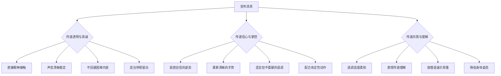
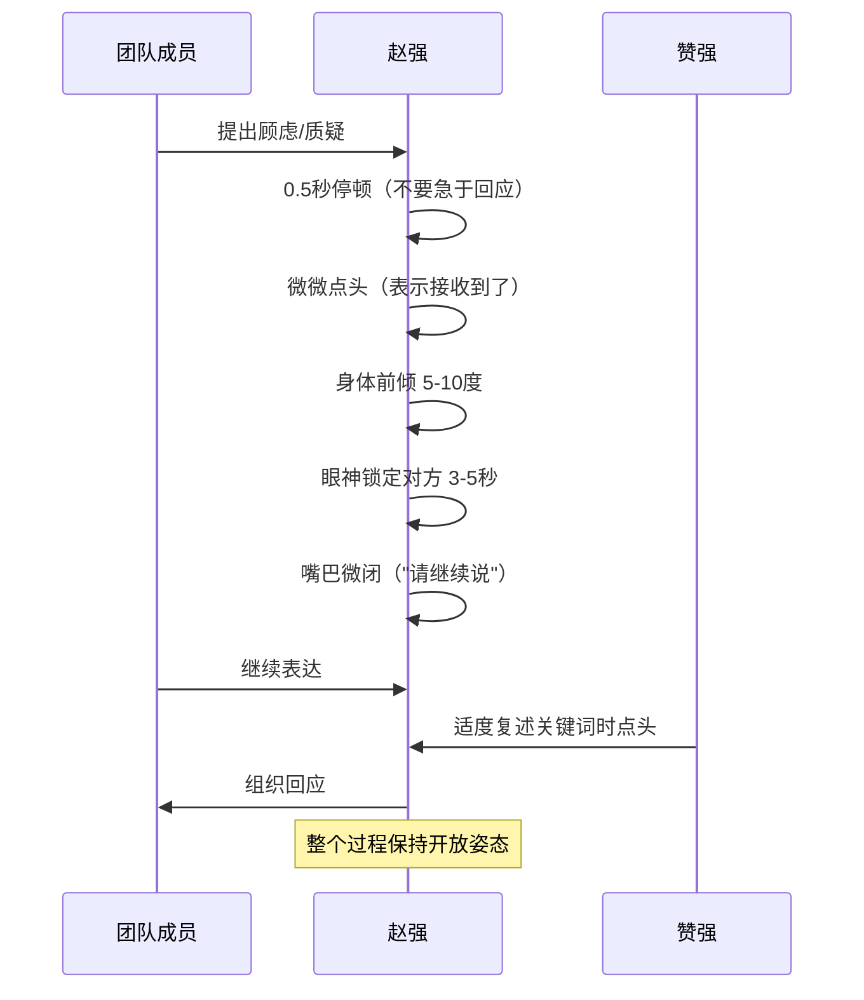

## 场景六：领导力场景

领导力的核心不是发号施令，而是影响——影响他人的认知、情绪和行为。而这种影响力的最大载体，不是你说了什么，而是你怎么说、怎么站、怎么看、怎么听。哈佛商学院教授 Amy Cuddy 的研究指出，人们对领导者的判断在见面的前 7 秒内就已形成，其中 93% 的判断来自非语言信号（55% 来自身体语言，38% 来自声音特质，仅 7% 来自语言内容本身）。在团队管理中，领导者的每一个眼神、每一次停顿、每一个站位选择，都在无声地定义团队的文化、士气和执行力。

本节以一位科技公司总监的团队管理场景为主线，系统拆解领导力场景中的非语言沟通策略，涵盖从日常管理到危机沟通、从一对一辅导到大型团队会议的全流程。

### 情境描述

赵强是一家科技公司的部门总监，管理着一个 20 人的产品研发团队。公司刚刚经历了一次战略调整，要求赵强的团队在不增加人手的情况下，将一个核心项目的交付时间从 6 个月压缩到 4 个月，同时新增两项功能需求。赵强需要在周一早会上向团队宣布这个消息。

这个情境的复杂性在于：消息本身是负面的（更少的时间、更多的工作），但赵强需要在传递信息的同时维持团队士气和信心。团队中有不同类型的人——有刚入职两年、冲劲十足的年轻工程师，有经验丰富的老员工（可能对"加活不加人"感到不满），还有几位核心技术骨干（他们的态度将直接影响整个团队的反应）。赵强不仅要"说对的话"，更要"用对的方式"——非语言信号在这一刻比语言内容更重要。

### 领导力中非语言沟通的心理学基础

在进入具体策略之前，理解领导力场景中非语言沟通的心理机制至关重要。

**情绪传染理论。** 神经科学家 Giacomo Rizzolati 发现的镜像神经元系统，解释了为什么领导者的情绪会"传染"给整个团队。当赵强走进会议室时，团队成员的大脑会自动"镜像"他的情绪状态——如果他面带紧张、步伐急促，团队会不自觉地感到焦虑；如果他沉稳自信、目光坚定，团队会自然地感到安心。这种传染是毫秒级的、无意识的，无法通过语言来抵消。这就是为什么"管理好自己的状态"是一切领导力非语言沟通的起点。

**权力姿势与心理状态。** Amy Cuddy 的研究证明，身体姿势不仅影响他人对你的感知，还反过来影响你自己的心理状态。"高权力姿势"（挺胸、双肩展开、占据更多空间）会让体内的睾酮（与自信相关）上升 20%，皮质醇（与压力相关）下降 25%。对于赵强来说，走进会议室前的 2 分钟"权力姿势准备"不仅会让团队看到一个自信的领导者，还会让他自己真正变得更加自信和从容。

**峰终定律。** 诺贝尔奖得主 Daniel Kahneman 的研究表明，人们对一段经历的记忆主要由"峰值时刻"（最强烈的体验）和"结束时刻"决定，而不是由整体平均体验决定。在团队会议中，这意味着你宣布消息的方式和你结束会议的方式，比中间的论述内容更能影响团队事后对这次会议的记忆。赵强需要在"峰值"（宣布调整的核心时刻）和"终值"（会议结束时）投入最大的非语言设计。

**社会认同理论。** 心理学家 Robert Cialdini 的研究表明，人们在不确定时会观察他人的行为来决定自己的反应。在团队会议中，核心技术骨干的非语言反应会成为其他成员的"参考锚点"。如果他们点头、前倾、表情积极，其他成员更倾向于接受；如果他们交叉双臂、面露不悦，负面情绪会迅速蔓延。赵强需要在会议前就与关键人物建立共识，让他们的非语言信号成为正面锚点。

### 非语言挑战分析

领导力场景的非语言挑战与销售、谈判等场景有本质区别——它不是一次性的说服，而是长期的、系统性的影响力建设。

**"信息传递 + 声气管理"的双重压力。** 当赵强宣布项目调整时，他需要同时完成两个任务：准确传递信息（时间压缩、新增需求），以及管理团队的情绪反应（防止恐慌、维持信心）。这两个任务对非语言信号的要求是矛盾的——准确传递负面信息需要表情严肃、语气坦诚，而维持信心需要表情坚定、语调积极。如何在同一个句子中平衡这两种信号，是领导力非语言沟通的核心挑战。

**多人场景中的信号放大效应。** 在 20 人的会议室中，你的一举一动都在被 20 双眼睛同时"解码"。一个微小的犹豫、一次不自觉的叹气、一个短暂的眼神回避，都会被放大解读为"领导自己都没信心"。团队规模越大，对非语言信号的精准控制要求越高。

**权威与亲和的动态平衡。** 过于威严会压制团队的开放沟通，过于亲和又会削弱决策的执行力。在宣布调整时，赵强需要展现足够的权威（让团队认真对待），同时保持足够的亲和（让团队敢于提问和表达困难）。这种平衡不是通过语言，而是通过眼神、语调、距离和身体姿态的微调来实现。

**长期一致性挑战。** 领导力的非语言沟通不是一次会议的事，而是日复一日的积累。团队成员会记住你"平时怎么走路、怎么听人说话、怎么在走廊里打招呼"，这些日常的非语言模式构成了他们对你"真实面目"的判断。一个在危机时刻表现完美的领导者，如果在日常管理中冷漠疏远，团队会认为危机时的表现是"表演"。

### 全流程非语言策略

#### 第一阶段：会前自我准备（会议前 30 分钟至 2 小时）

领导力非语言沟通的第一步不是"管理别人"，而是"管理自己"。你的状态直接决定你传递给团队的非语言信号质量。

**能量状态调整。** 赵强在会议前需要确保自己的身心状态处于最佳水平：

| 调整维度 | 具体做法 | 原理 |
|---------|---------|------|
| 身体状态 | 前一晚充分睡眠（7-8 小时），会议前做 5 分钟轻度运动（快走、爬楼梯） | 睡眠不足会导致面部肌肉松弛、眼神呆滞，运动能提升血液含氧量，让眼神更亮、声音更有力 |
| 心理状态 | 找一个安静的空间，闭眼做 4-7-8 呼吸法（吸气 4 秒、屏息 7 秒、呼气 8 秒），重复 3 次 | 激活副交感神经系统，降低皮质醇水平，让表情和语调更加平稳 |
| 姿态准备 | 站立做 2 分钟"高权力姿势"——双脚分开与肩同宽，双手叉腰或高举过头 | 触发睾酮上升、皮质醇下降，建立内在自信感 |
| 内容预演 | 在脑中模拟会议场景，重点预演宣布消息时的眼神、语调和停顿 | 肌肉记忆会让预演过的非语言模式在实际场景中自然流露 |

**情绪预设。** 在进入会议室前，花 2 分钟明确自己想要传递的核心情感基调。对于这个场景，基调应该是："坦诚但坚定——我知道这个消息不容易，但我对团队有信心。"在心中默念这个基调，让身体自然调频到这个状态。不要试图"压下"自己的紧张——适度的紧张反而会让大脑更加敏锐，关键是不让紧张"主导"你的非语言信号。

**关键人物预沟通。** 在正式会议前，与 2-3 位核心技术骨干进行一对一的简短沟通。目的有两个：第一，提前了解他们对调整的可能反应，为会议中的非语言应对做准备；第二，让他们提前消化消息，在会议中展现积极的非语言信号（如点头、前倾），成为团队的正面锚点。

#### 第二阶段：进入会议室（会议开始前 1-3 分钟）

从你推开会议室门的那一刻起，会议就已经开始了。你的进场方式会设定整个会议的"情感基调"。

**入场节奏。** 步伐从容、步幅适中（每步约 60-70 厘米），不要急促（传递焦虑），也不要过于缓慢（传递犹豫）。走进会议室时微微抬头，目光平视前方——这个姿态传递"我掌控局面"的信号。如果手中拿着笔记本或文件，自然地持握在身体一侧，不要紧紧抱在胸前（防御信号）。

**空间占据。** 走到会议室的主位或前方位置，但不要立刻坐下。先站在那里 10-15 秒，环顾全场，与不同的团队成员建立短暂的眼神接触（每人 1-2 秒）。这个"占据空间"的动作传递两个信号：一、我是这个空间的主导者；二、我关注在场的每一个人。

**开场的身体语言。** 在正式开场前，给出一个沉稳的微笑（不是灿烂的大笑，而是"我准备好面对这个挑战"的微笑）。这个微笑应该持续 2-3 秒，足以让人看到但不过于持久。然后做一个轻微的点头——这个动作同时表示"向大家问好"和"让我们开始"。

#### 第三阶段：宣布调整（会议核心 10-15 分钟）

这是整个会议最关键的部分，也是非语言信号影响最大的部分。

**传递透明和真诚。** 在宣布调整时，你需要让团队感到"领导没有隐瞒任何事"。非语言策略如下：

- **眼神管理。** 用"三角扫描法"覆盖全场——目光在会议室中选取左、中、右三个锚点，以 3-5 秒为周期轮流注视。在说关键信息时（如"交付时间调整为 4 个月"），将目光锁定在一个小群体上（3-4 人），保持 2-3 秒的直接眼神接触。这种"分组注视"比快速扫视更有穿透力。
- **声音控制。** 语速保持在每分钟 140-160 字（比日常语速略慢），音调保持中等偏低（低音调传递权威感和可信度）。在宣布关键数字时（如"4 个月"、"新增两项功能"），用略微加重的语气和 0.5 秒的停顿来强调——这个停顿让信息有时间"沉入"听众的意识。
- **避免"安慰性动作"。** 在宣布困难消息时，很多人会不自觉地做出安慰自己的动作——摸脸、搓手、整理衣领、来回踱步。这些动作会泄露你的焦虑，让团队感到"领导自己都不确定"。保持双手自然垂放在身体两侧或轻放在桌面上，减少不必要的手部动作。

**传递信心和掌控感。** 团队需要从你身上感受到"这个调整是经过深思熟虑的，我们有能力应对"。

- **姿态基调。** 站立时双脚与肩同宽，重心均匀分布，挺胸但不僵硬。身体可以有 5 度左右的前倾——这个微妙的前倾传递"我在认真面对这个挑战"的信号。不要靠墙或靠桌子（依赖性姿态削弱权威感）。
- **手势策略。** 在解释调整方案时，使用"结构化手势"——用左手和右手分别表示不同的部分（如"一方面……另一方面"），用手掌的上下移动表示时间线（如"从现在到交付"）。这些手势帮助团队可视化你的思考结构，同时传递"一切都有条理"的掌控感。在说"我们能够应对这个挑战"时，配合一个有力的掌心向下按压的手势——这个手势在非语言学中代表"确定性"和"稳定"。
- **语调的力量曲线。** 不要全程使用单一语调。在宣布消息时使用"阶梯式语调"——开头平稳（建立基调），中段略微上升（传递"这不是世界末日"的信号），在表达信心时上扬并加强（"这个调整也意味着我们有机会证明自己"）。在结束宣布时，语调回归平稳和坚定（"这是我们要走的路"）。

**传递共情和理解。** 一味地强调信心会让人觉得你"不理解团队的压力"。在传达困难消息后，你需要切换到"共情模式"。

- **降低身体姿态。** 在说"我知道这对大家来说不容易"时，可以微微降低身体重心（不是弯腰，而是膝盖微曲），或者坐在桌边。降低姿态在非语言学中传递"我和你们在一起"的信号，拉近心理距离。
- **语调转换。** 从坚定语调切换到温暖语调——音调略微提高、语速略微放慢、音量略微降低。这个变化让团队感知到"领导在认真对待我们的感受"。
- **面部表情的微调。** 在表达理解时，让眉毛微微上抬（表示关切）、嘴角略微收紧（表示认真对待）。避免微笑——在这个时刻微笑会被解读为"不当回事"。
- **沉默的共情力。** 在说完"我知道这对大家来说不容易"之后，停顿 3-4 秒。这个沉默比任何语言都有力量——它给团队时间消化情绪，同时传递"我愿意承受这个沉默的尴尬，因为我真的在意"。

#### 第四阶段：倾听反馈（会议中段 10-20 分钟）

宣布消息后，进入互动阶段。这个阶段的非语言信号决定了团队是否敢于说真话。

**创建安全的倾听空间。** 当有人提出问题或表达不满时，你的第一反应（非语言的）比你的回答更重要。

**"全力倾听"姿态。** 当团队成员发言时，将整个身体转向发言者（不仅仅是转头），这个"全面转向"传递"你的声音很重要"的强烈信号。保持 70%-80% 时间的眼神接触，其余时间可以看向地面或笔记本（表示你在思考他们说的话）。微微点头，但不要太频繁——每 5-8 秒点一次，每次持续 1 秒，表示"我在跟"而非"我同意"。

**管理自己的防御反应。** 当听到尖锐的问题（如"为什么不招人？""领导层有没有考虑过我们的感受？"）时，你的身体会本能地想要防御——肩膀收紧、下巴微抬、眼神回避。这些反应是杏仁核"战斗或逃跑"反应的一部分。你需要在 1-2 秒内识别并覆盖这些反应：深吸一口气，让肩膀自然放松，保持目光接触，微微点头。记住，团队不是在攻击你，他们是在表达合理的关切。

**非语言鼓励机制。** 很多时候团队成员想发言但犹豫不决。你需要用非语言信号鼓励他们：将目光投向犹豫的人，微微抬眉（表示"你想说什么？"），身体略微前倾。如果对方还是犹豫，可以微微张嘴但不出声——这个"准备说话"的面部表情会暗示"该你了"。

**记录的仪式感。** 当团队成员提出重要问题或建议时，拿起笔在笔记本上记录。这个动作本身就是一种非语言肯定——"你的想法值得被记录下来"。记录时保持身体前倾的姿态和专注的表情，不要边记边看电脑或手机。

#### 第五阶段：结束会议（最后 3-5 分钟）

根据峰终定律，会议的最后几分钟对团队的整体记忆影响最大。你需要用非语言信号创造一个"有力量的结尾"。

**站起身来。** 如果之前是坐着的，现在站起来。站立姿态传递"这是总结性的、重要的话语"的信号。

**目光扫全场。** 在做最后总结时，用缓慢的、有目的的目光扫过全场每一个人。这个"每个人被看到"的感觉会增强归属感和团队凝聚力。

**语调从温暖回归坚定。** 结尾的核心信息应该配合坚定的语调和有力的手势。赵强可以这样说——"我知道前方有挑战，但我选择相信在座的每一个人。这个项目会成为我们团队的标杆。"在这段话中，语调应该从平缓逐步上升到坚定，在"标杆"这个词上达到语气的顶点，同时配合一个肯定的点头。

**有力的收尾停顿。** 说完最后一句话后，不要立刻问"还有问题吗"——先保持 3-4 秒的沉默和眼神接触，让最后的话"沉入"团队的意识。这个沉默传递"我对刚才说的话是认真的"的信号。然后用一个简短的微笑和点头结束："好，我们开始吧。"

### 日常管理中的非语言领导力

领导力的非语言沟通不仅在重要会议上发挥作用，更体现在每天的日常互动中。这些看似微小的日常信号，长期积累起来构成了团队对领导者的"底层判断"。

**巡视式管理。** 赵强应该每天花 15-20 分钟走到团队的工作区域，非正式地了解进展。巡视时的关键非语言原则：

| 行为 | 正确做法 | 错误做法 |
|------|---------|---------|
| 接近方式 | 从侧面接近，自然放慢脚步 | 从背后接近（会惊吓到人），快步走来（传递检查/监督信号） |
| 姿态 | 微微弯腰或蹲下，让自己的视线与坐着的员工平齐 | 站着俯视坐着的员工（权力姿态，让人感到被审视） |
| 目光 | 先看他们正在做的工作，再看他们的脸 | 直接盯着人看（过于聚焦个人而非工作） |
| 询问方式 | "这个看起来很有意思，能给我讲讲吗？" | "进度怎么样了？什么时候能完成？"（考核语气） |
| 离开方式 | 自然地继续走到下一位，不要在一个人身边停留太久 | 长时间站在一个人身后（造成压力） |

**走廊互动。** 在走廊、电梯、食堂等非正式场合遇到团队成员时，你的非语言信号传递着"你对我重要吗"的信息。关键原则：主动微笑并点头——这个动作耗时不到 1 秒，但传递的信息是"我看到了你"。如果时间允许，停下脚步、面向对方、简短寒暄。不要一边走一边回头说话（传递"我有更重要的事"的信号）。

**认可的非语言表达。** 对团队成员的认可如果只停留在语言层面（"做得好"），效果远不如配合非语言信号：

- **赞许点头。** 缓慢的、有节奏的点头（每秒约 1 次），持续 2-3 秒。这种"深度点头"比快速点头更有分量。
- **掌心朝上的手势。** 在说"你的方案很出色"时，配合掌心朝上的手势指向对方——这个手势在非语言学中表示"这个功劳是你的"。
- **轻拍肩膀。** 在西方文化中，轻拍肩膀是标准的认可信号。在中国职场中，需要根据关系亲密度谨慎使用——对关系较近的下属可以使用，对关系一般的下属，一个赞许的微笑和点头更为得体。
- **空间信号。** 在团队成员的工位旁边拉一把椅子坐下来聊天——这个"降低自己高度"的动作传递"我重视和你面对面交流"的信号，比站在旁边居高临下地表扬有效得多。

**危机时刻的沉着。** 当团队遇到紧急问题（如线上事故、客户投诉、进度严重滞后）时，团队成员首先观察的不是问题本身，而是领导者的反应。赵强需要做到：

- **控制呼吸节奏。** 深而缓慢的呼吸会让声音和动作保持平稳，急促的呼吸会让语速加快、动作慌乱。
- **降低说话音量。** 在危机时刻，低声说话比大声喊叫更有力量——它传递"我冷静、我在思考、我有办法"。
- **放慢动作节奏。** 刻意放慢自己的动作——慢慢站起来、慢慢走到白板前、慢慢拿起笔。这种"可控的慢"传递的是"局面在我掌控之中"的信号。
- **避免"冻结"反应。** 有些领导者在危机时会"定住"——一动不动、面无表情、长时间沉默。这会被团队解读为"领导也懵了"。保持适度的肢体动作（如在白板前走动、用手势勾画方案），传递"我在积极思考"的信号。

### 一对一沟通中的非语言策略

团队会议之外，赵强与下属的一对一沟通是非语言领导力的另一个核心场景。

**辅导谈话的空间安排。** 在进行绩效反馈或职业辅导时，空间安排本身就是一种非语言信号。不要隔着办公桌面对面坐——桌子会成为"物理屏障"，强化上下级的权力差异，抑制开放交流。理想的方式是：两人呈 90 度角坐在沙发或休闲区，或者并排坐在桌子同一侧一起看电脑屏幕。这种"并排"或"L 形"的座位安排传递"我与你并肩"的合作信号。

**反馈中的非语言节奏。** 在给出负面反馈（如"你的代码质量需要提升"）时，非语言节奏至关重要：

1. **开场。** 先用 1-2 句中性的、正面的话建立连接（"你最近在项目上投入了很多"），配合温和的微笑和眼神接触。
2. **过渡。** 在转向负面反馈前，停顿 1 秒，身体微微前倾，语调从温暖切换到认真。这个非语言"转折"让对方的大脑准备好接收困难信息。
3. **传递反馈。** 语速放慢（比平时慢 20%），音调保持平稳（不要上升——上升的语调暗示"我在问你意见"，平稳的语调暗示"这是一个确定的观察"）。眼神保持 70% 接触，不要回避——回避会被解读为"你自己都不好意思说"。
4. **给予空间。** 说完反馈后，停顿 5-8 秒，给对方时间消化。在这个沉默中保持耐心的姿态——身体放松、表情中性偏温和、目光柔和。不要用"你觉得呢？"来填补沉默——这个沉默是你有意创造的思考空间。
5. **转向支持。** 在对方回应后，用积极的非语言信号传递"我不是来批评你的，我是来帮你的"——身体前倾、掌心朝上的手势、温暖的语调。

**处理情绪化反应。** 当下属在一对一沟通中情绪激动（眼眶发红、声音颤抖、愤怒爆发）时，你的非语言反应决定这段关系的走向：

- **不要递纸巾。** 这个动作虽然是好意，但它传递的信号是"你的情绪需要被擦掉"。正确做法是安静等待，让对方自己平复。
- **同步呼吸。** 当对方哭泣时，将自己的呼吸节奏放到与对方接近的速度，然后逐渐放慢——镜像神经元会让对方无意识地跟随你的节奏，自然平复。
- **降低姿态。** 如果对方坐着，你也坐着（不要站起来，这会传递"我要离开了"的信号）。可以微微前倾，但不要太近——给对方情绪空间。
- **避免"修复"姿态。** 不要在对方还没说完时就交叉双臂、皱眉思考解决方案——这个姿态传递"我已经在解决问题了，不用再说你的感受了"。先完成倾听，再进入解决模式。

### 不同领导风格的非语言特征

领导者的非语言风格不是一成不变的，需要根据情境和目标进行调整。

| 领导风格 | 身体语言特征 | 声音特征 | 适用场景 | 风险提示 |
|---------|------------|---------|---------|---------|
| **权威型** | 挺拔站姿、占据中心位置、有力手势、直接眼神 | 低音调、中等语速、果断停顿 | 危机时刻、战略宣布、需要快速决策时 | 长期使用会压制团队主动性 |
| **亲和型** | 开放姿态、微笑、并排站位、适度触碰 | 温暖音调、稍快语速、多用疑问语调 | 团队士气低落、冲突调解、一对一辅导时 | 过度使用会削弱决策执行力 |
| **教练型** | 前倾姿态、倾听点头、手势引导（而非指示） | 询问式语调、适当沉默、回声式复述 | 培养下属、激发创新、解决问题时 | 对需要快速指令的场景不适用 |
| **民主型** | 环顾全场、均匀分配目光、邀请性手势 | 适中音调、多用"我们"、开放式问题 | 团队讨论、方案评审、头脑风暴时 | 紧急情况下会显得优柔寡断 |

赵强在这个场景中需要灵活切换——在宣布消息时使用权威型（传递确定性），在倾听反馈时切换到亲和型（建立安全感），在讨论解决方案时使用民主型（激发参与感）。

### 跨文化领导力中的非语言差异

如果赵强的团队有不同文化背景的成员，他需要注意非语言信号的文化差异：

**眼神接触。** 在中国文化中，对上级的长时间直接注视可能被视为"不服从"；而在西方文化中，回避眼神会被解读为"不自信"或"有所隐瞒"。如果团队是混合文化，赵强应该保持中等强度的眼神接触（约 50%-60% 的时间），并在一对一场景中根据对方的文化习惯进行调整。

**肢体接触。** 轻拍肩膀在西方职场是标准的认可动作，但在中国职场（尤其上下级之间）需要更加谨慎。在东亚文化中，认可更多通过语言（"辛苦了"）和空间信号（亲自走到对方工位而不是叫对方来办公室）来表达。

**沉默的含义。** 在日本和中国文化中，沉默可以表示"我在认真思考"或"我尊重你的发言权"；在巴西和以色列文化中，沉默可能被解读为"不满"或"不同意"。赵强需要根据团队的文化构成来调整自己使用沉默的策略。

**手势的含义。** "OK"手势在大多数东亚国家是正面的，但在巴西可能被视为侮辱性的。竖大拇指在西方是肯定信号，但在中东某些地区有负面含义。在多元文化团队中，使用语言中性的认可方式（点头、微笑）最为安全。

### 常见非语言失误与纠正

**失误一：虚假的乐观。** 表现：在宣布坏消息时全程保持灿烂的笑容和过于积极的语调，试图"用乐观对冲负面消息"。后果：团队成员会立刻识别出"领导在演戏"，信任感瞬间崩塌。团队会开始猜测："消息是不是比他说的还严重？"纠正：先坦诚地传递消息（表情严肃、语调平稳），再逐步过渡到信心传递（表情坚定、语调上扬）。从"我知道这很难"到"但我们能行"的过渡应该是自然的、渐进的，而非突兀的跳转。

**失误二：肢体泄露焦虑。** 表现：宣布消息时不停走动、双手反复交叉又放下、频繁推眼镜或摸鼻子、声音时高时低。后果：团队不会记住你说了什么，但会记住"他看起来很慌"。这种焦虑的非语言信号会在团队中引发情绪传染，放大恐慌。纠正：会议前做"高权力姿势"练习，会议中保持"脚钉地面"——双脚稳固站立，减少不必要的移动。

**失误三：忽视"房间里的大象"。** 表现：在有人明显不满（双臂交叉、面露不悦、叹气）时，假装没看到，继续按照既定议程推进。后果：未被回应的不满不会消失，而是会在会后以"小道消息""私下抱怨"的形式蔓延。纠正：当捕捉到不满的非语言信号时，主动回应——用目光接触和邀请性手势表示"我注意到了，你的感受很重要"，或者直接点名："小李，我看到你好像有想法，你来说说？"

**失误四：过度使用权威姿态。** 表现：全程站在高处、双手叉腰、目光扫视、语调强硬——试图用"绝对权威"来压制质疑。后果：团队表面上服从，但内心产生抵触。长期使用权威姿态会导致团队成员在会议上沉默，在私下里反抗。纠正：权威姿态只用于宣布核心决策的 2-3 分钟，在其余时间切换到亲和或民主风格。

**失误五：结束时的"泄气"。** 表现：在宣布消息和讨论方案时表现完美，但在会议结束时表情松弛、语调随意、匆匆走出会议室。后果：团队记忆的"终值"是领导急着离开——这暗示"领导也不想待在这里面对这些问题"。纠正：像重视开场一样重视结尾。在最后 2 分钟投入最大的非语言能量——坚定的眼神、温暖的微笑、有力的结束语。

### 进阶：领导力非语言的长期修炼

**视频自我观察。** 最有效的非语言修炼方法是录像。在获得团队同意的前提下，录制 2-3 次团队会议的视频，然后回看——关注自己的手势频率、眼神分配、语调变化、姿态切换。很多领导者在回看时才发现自己有不自觉的小动作（如频繁清喉咙、用手遮嘴说话），这些信号在潜意识中削弱了他们的领导力。

**镜像练习。** 每天花 5 分钟对着镜子练习不同的"领导表情"——宣布好消息时的微笑和眼神、宣布坏消息时的严肃和坚定、倾听反馈时的专注和温和。这不是"表演"，而是通过反复练习让这些表情成为你的"肌肉记忆"，在关键时刻自然流露。

**领导力的"非语言仪表盘"。** 建立一个简单的自我检查框架，在每次重要沟通前快速审视：

| 检查维度 | 问题 | 调整方法 |
|---------|------|---------|
| 能量状态 | 我现在的精力水平如何？ | 深呼吸、轻度运动、调整姿势 |
| 情感基调 | 我想传递的核心情感是什么？ | 在心中默念基调，让身体调频 |
| 面部表情 | 我的面部肌肉是否紧绷？ | 轻微活动面部肌肉、微笑 3 秒 |
| 声音状态 | 我的嗓音是否清晰有力？ | 清嗓、哼音阶、喝温水 |
| 身体姿态 | 我是否挺拔而放松？ | 做 30 秒高权力姿势 |

**向他人寻求反馈。** 请一位你信任的同事或导师在会议后给你"非语言反馈"——"我刚才宣布消息时，看起来紧张吗？""我的语调有没有变化过大？"外人的视角能看到你自己无法觉察的非语言模式。

### 关键要点

- 领导者的非语言信号直接影响团队的士气和信心，93% 的第一印象来自非语言信号
- 会前的自我准备（身体状态、心理状态、关键人物预沟通）是非语言领导力的基础
- 宣布困难消息时，先坦诚再坚定——从"我知道这很难"自然过渡到"我们能行"
- 倾听反馈时，全力倾听的姿态（身体转向、眼神锁定、主动停顿）比任何语言都有力量
- 峰终定律决定了会议记忆：像重视开场一样重视结尾
- 日常的巡视、走廊互动和认可信号是领导力信任的长期积累
- 一对一辅导中的空间安排（并排或 L 形）和反馈节奏（中性→停顿→反馈→沉默→支持）是关键
- 虚假的乐观比坦诚的困难更危险——团队的镜像神经元能立刻识别出"表演"
- 危机时刻的"可控的慢"比慌乱的快更有力量——低声说话、放慢动作、深呼吸

***
