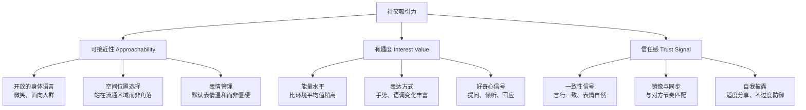
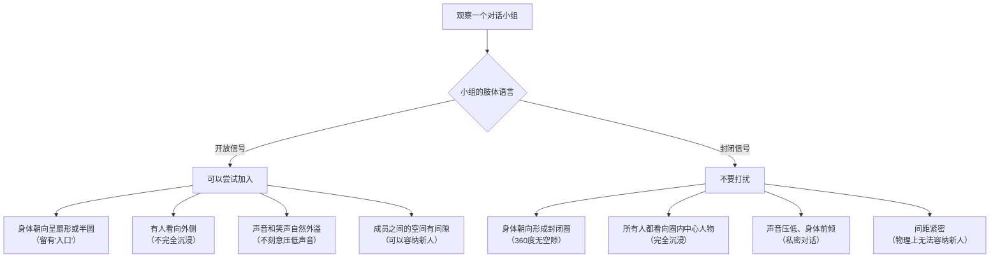

## 场景七：社交场景

### 情境描述

林雨是一名互联网公司的产品经理，入行三年，技术能力扎实但社交圈子一直局限在自己的小团队里。最近她的直属领导跳槽了，新领导在一次一对一谈话中直言："你的业务能力没问题，但你的人脉网络太窄了。这个行业的很多机会和信息，都是在社交场合流动的。"这句话刺痛了她。林雨决定改变——她报名参加了一场行业社交活动，50到80人的规模，在一家酒店的多功能厅举行，形式是自由交流加几位嘉宾的简短分享。

林雨面临的核心困境不是"不知道该说什么"，而是**非语言层面的一系列挑战**：走进一个满是陌生人的房间时身体本能的僵硬、不知道如何用身体语言自然地加入别人的对话圈、在多人交流中不知道眼神该看向谁、不确定什么时候从群体闲聊转入一对一深度交流、更不知道如何用非语言信号判断谁值得深入结交。

这些问题，没有一个能靠"想好说什么"来解决。

### 社交场景的非语言本质

社交场景与前面所有实战场景的根本区别在于它的**开放性和多向性**。面试是"你被评估"，演讲是"你输出"，谈判是"你和对手博弈"，约会是"你和一个人建立连接"——但社交场景是：**你同时面对一个流动的群体，需要在多个对象之间灵活切换，自己决定跟谁建立连接、建立多深的连接、以及何时切换目标。**

这要求你在非语言层面同时做四件事：

| 维度 | 具体挑战 | 难度来源 |
|------|----------|----------|
| **自我呈现** | 在陌生人面前保持自然、开放、有吸引力的状态 | 社交焦虑导致身体僵硬、表情紧绷 |
| **群体感知** | 读懂房间里的社交动态——谁和谁是一伙的、哪个圈子开放接纳新人 | 信号分散在多人身上，信息量大 |
| **关系建立** | 用非语言信号快速拉近距离，让对方愿意跟你聊 | 从零到信任的时间窗口极短（通常3-5分钟） |
| **资源分配** | 在有限时间内识别高价值连接并深化，同时优雅地退出低效交流 | 需要持续的"读人"和"决策"能力 |

**社交场景与约会场景的对比：**

```text
                        约会                社交活动
对象数量：              1人                 30-80人
关系建立目标：          深度情感连接        广度人脉+选择性深度
时间分配：              集中在一个人身上    在多人之间灵活切换
非语言核心技能：        温暖与亲密信号      开放与识别能力
退出策略：              整场约会围绕一个人  需要频繁且优雅地切换
焦虑来源：              "ta喜欢我吗"       "我能融入吗"
```

这种多向性意味着：你不能用"表演"的心态对待社交场景——你不是在台上对所有人展示，而是在一个流动的社交网络中寻找和建立真实的连接。**那些在社交场合真正如鱼得水的人，靠的不是"八面玲珑"的表演技巧，而是让每个跟他们交谈的人都感受到"这个人真的对我感兴趣"。**

### 社交场景中的吸引力心理学

在深入具体策略之前，需要先理解一个核心问题：**为什么有些人一走进社交场合就能成为"社交磁石"，而有些人则沦为角落里的透明人？**

#### 社交吸引力的三个维度



**维度一：可接近性——让人"敢"走近你**

这是社交场合中最基础也最重要的维度。可接近性传递的信号是："跟我聊天是安全的、轻松的。"在嘈杂的社交场合中，人们不会花时间去深入了解一个看起来很难接近的人——他们会在3秒内根据你的非语言信号做出"走近还是绕开"的决定。

**可接近性的非语言构成：**

| 信号 | 高可接近性表现 | 低可接近性表现 | 影响权重 |
|------|---------------|---------------|---------|
| 微笑 | 自然的杜兴微笑，嘴角上扬+眼角鱼尾纹 | 面无表情、假笑、嘴角下垂 | 30% |
| 身体朝向 | 面向人群或流通区域 | 面向墙壁、角落、手机屏幕 | 20% |
| 手臂位置 | 自然下垂或手持饮料/物品 | 双臂交叉、紧握手机 | 15% |
| 眼神 | 自然地扫视环境、与人短暂对视 | 盯着地面、手机、天花板 | 15% |
| 空间位置 | 站在入口附近、食物区、通道旁 | 躲在最远的角落、靠墙站立 | 10% |
| 姿态高度 | 挺直但不僵硬，肩膀放松 | 驼背、缩肩、身体蜷缩 | 10% |

**维度二：有趣度——让人"想"跟你聊**

可接近性解决了"敢不敢"的问题，有趣度解决的是"想不想"的问题。这里有一个关键的认知纠偏：**有趣度不等于你有多幽默或多博学，而是你让对方感到被关注、被回应的程度。**

社交场合中最有"趣"的人，往往不是那个讲笑话最多的人，而是那个最善于倾听和回应的人。你的眼神专注、你的点头回应、你追问"然后呢？"时身体前倾——这些非语言信号共同传递的是："你刚才说的对我很重要。"

**维度三：信任感——让人"愿意"深入**

信任感决定了你能否从"点头之交"升级为"值得深交的人"。信任感的核心是非语言信号的一致性——你的微笑是真诚的、你的回应是自然的、你的表达和你的状态是匹配的。当一个人嘴上说"很高兴认识你"但眼神飘忽、身体转向别处时，对方的大脑会立刻标记"这个人不真诚"。

### 社交全流程非语言策略

#### 第一阶段：入场前的准备（出发前1小时）

社交场景的成功率，有一半取决于你走进那个房间之前的状态。

**外在准备：**

```text
□ 着装策略——"穿高半级"原则
  - 研究活动的正式程度：行业峰会偏商务，技术meetup偏休闲，创业活动偏smart casual
  - "穿高半级"：比活动的平均正式度高一点点，但不超过一个级别
  - 为什么不能穿太随意：在社交场合中，着装是你的"第一层名片"——对方在你开口之前就通过着装判断你的专业度和重视程度
  - 为什么不能穿太正式：过度正式传递"我是来谈生意的"，增加距离感
  - 关键细节：鞋子要干净（很多人忽略但别人会注意）、配饰简洁不夸张

□ 气味管理
  - 淡香水/古龙水：1-2下，涂在手腕内侧——社交场合人与人的距离比约会近，气味会被放大
  - 判断标准：30cm距离隐约可闻
  - 绝对避免：浓烈香水、烟味、大蒜等重口气味

□ 随身物品
  - 名片（如果活动适合交换名片）：放在容易取出的位置，不要翻遍口袋
  - 手机充满电：社交场合中手机是工具（加微信、展示作品），不是安慰物
  - 一杯饮料的预算：进入场地后手里拿着饮料是重要的"道具"（后续详述）
```

**内在准备——情绪校准是核心：**

```text
□ 社交焦虑的神经科学理解
  - 社交焦虑的根源是大脑的"威胁检测系统"——杏仁核将陌生社交环境标记为潜在威胁
  - 这导致一系列生理反应：心跳加速、手心出汗、肌肉紧绷、思维变窄
  - 关键认知：这些反应是进化遗产，不是你"不行"的证据。原始部落中被群体排斥意味着死亡，所以大脑对社交威胁极度敏感

□ 生理层面的调节
  - 深呼吸：4秒吸气→4秒屏住→7秒呼气，做5次。延长呼气激活副交感神经系统，直接降低皮质醇
  - 身体预热：到达场地前找个安静的地方做2分钟"高能量姿势"（双手叉腰、挺胸抬头）。Amy Cuddy的研究表明这可以降低皮质醇、提升睾酮
  - 面部预热：对着手机前置摄像头做大笑→放松→微笑的循环3次，让面部肌肉进入"社交就绪"状态

□ 心态框架设定
  - 目标不是"让所有人喜欢我"，而是"找到3个聊得来的人"
  - "3个人"这个数字很关键——它让你从"要在所有人面前表现好"的巨大压力中释放出来
  - 心态从"表演者"转为"探索者"：我不是来展示的，我是来看看这些人里有没有有趣的人
  - 探索者的非语言信号是放松的、好奇的；表演者的非语言信号是紧绷的、刻意的

□ 提前准备"非语言锚点"
  - 想一个你最自信、最放松的社交时刻——那次同学聚会、那次跟朋友的火锅局——回忆那个场景中你身体的感觉
  - 这个感觉就是你的"社交锚点"。当你在社交场合中感到紧张时，有意识地调用这个身体记忆
```

#### 第二阶段：入场与环境扫描（前5分钟）

**走进房间的非语言清单：**

你走进房间的前30秒，已经在向所有人广播你的"社交频率"。这个阶段的目标不是找人聊天，而是**向整个房间发送"我是可接近的"信号**。

**1. 入场节奏——慢下来**

```text
错误模式：
  门 → 快步走 → 找角落站定 → 掏手机 → 等别人来找你
  （传递的信号：紧张、封闭、不想被打扰）

正确模式：
  门 → 缓慢走 → 中途停下观察 → 看看食物/饮料区 → 走向一个自然停靠点
  （传递的信号：从容、开放、自信）
```

走路速度是一个极其重要但几乎没有人讨论的非语言信号。在社交场合中，**走得太快传递焦虑和不安全感**，走得太慢则传递犹豫不决。理想的速度是：比你平时走路慢15-20%。这个速度传递的是"我不急，我有时间，我在这里很自在"。

**2. 环境扫描——用眼睛读懂房间**

到达场地后，不要急着找人聊天。花1-2分钟进行"社交雷达扫描"：

```text
扫描清单：
  ┌──────────────────────────────────────────────────────────────┐
  │  第一圈扫描（15秒）：整体布局                                │
  │  - 入口/出口在哪里？                                         │
  │  - 食物/饮料区在哪里？（社交热点区域）                       │
  │  - 哪些区域人多、哪些人少？                                  │
  │  - 有没有明显的"社交枢纽人物"？（被多人围绕的人）           │
  ├──────────────────────────────────────────────────────────────┤
  │  第二圈扫描（30秒）：社交结构                               │
  │  - 有哪些对话小组已经形成？（2人、3-4人、5人以上）          │
  │  - 哪些小组的肢体语言是开放的？（身体朝外，有空间接纳新人） │
  │  - 哪些小组是封闭的？（身体朝内形成封闭圈，难以加入）       │
  │  - 有没有像你一样单独站着的人？（潜在的"搭话伙伴"）        │
  ├──────────────────────────────────────────────────────────────┤
  │  第三圈扫描（15秒）：个人锁定                               │
  │  - 有没有看起来特别友善/有趣的人？                           │
  │  - 有没有你提前了解要来的人？                                │
  │  - 确定你的"第一步目标"——先跟谁搭话                        │
  └──────────────────────────────────────────────────────────────┘
```

**3. 找到你的"社交锚点"位置**

不要站在角落里。不要站在入口正前方（会挡住人流）。最佳的初始位置是：

```text
              入口
               │
    ┌──────────┼──────────┐
    │          │          │
    │    ★ 食物/饮料区    │  ← 你的第一个停靠点
    │          │          │     理由：
    │          │          │     1. 拿饮料是自然行为，不尴尬
    │          │          │     2. 人流量大，搭话机会多
    │          │          │     3. 手里有东西拿着，减少紧张小动作
    │          │          │
    │   ┌──────┤          │
    │   │ 通道 │          │  ← 你的第二个位置（拿了饮料后）
    │   │      │          │     理由：
    │   │  ★   │          │     1. 人经过时目光会自然落到你身上
    │   │      │          │     2. 不是死角，你可以观察全场
    │   └──────┤          │     3. 别人拿饮料时会经过你，搭话自然
    │          │          │
    └─────────────────────┘
```

**4. 手中的"社交道具"——饮料的妙用**

手里拿着一杯饮料（不需要是酒，水或果汁都可以）在社交场合中具有多重非语言功能：

- **减少紧张小动作**：空着的手容易不自觉地搓、摸脸、抱胸——拿杯饮料就自然地占用了手
- **提供自然的停顿机制**：不知道说什么时，喝一口饮料是自然的"思考缓冲"
- **制造搭话契机**："这个饮料不错，你试过吗？"是最低门槛的开场
- **调整社交距离**：用单手持杯，另一只手可以自然地做手势

**不要做的**：不要两手紧握杯子（紧张信号）、不要不停地喝（焦虑信号）、不要把杯子举到胸前当"盾牌"。

#### 第三阶段：发起连接（第5-15分钟）

这是社交场景中最关键的阶段——你如何从"独自站着"变成"加入对话"。

**策略一：从"低门槛目标"开始热身**

不要一开始就试图接近全场最厉害的人。先找一个"低门槛目标"热身：

```text
低门槛目标的特征：
  - 也是独自站着的人（跟你处境相同，搭话成本最低）
  - 站在食物/饮料区的人（"这个xx好吃吗"是天然的开场白）
  - 刚结束一段对话、正在四顾的人（他也在找人聊）
  - 看起来友善、放松的人（微笑、开放姿态）

高门槛目标的特征（等你热身后再挑战）：
  - 被多人围绕的"社交中心人物"
  - 深度交谈中的两人组
  - 明显不希望被打扰的人（封闭姿态、看手机）
```

**第一个搭话的非语言策略：**

```text
步骤分解：

1. 接近（2-3秒）
   - 走向对方，步态从容，不要犹豫
   - 在距离对方1-1.2米处停下（社交距离的内缘）
   - 身体朝向对方，双脚指向对方

2. 建立眼神接触（1秒）
   - 在开口之前先看对方的眼睛
   - 自然地微笑——不需要夸张，微微上扬嘴角+眼睛微眯即可
   - 如果对方也看你并回以微笑，信号灯变绿，继续
   - 如果对方看了你一眼就移开视线，或者皱眉，不要硬搭话，找下一个目标

3. 开口（3-5秒）
   - 声音清晰，音量比环境噪音稍低一点（让对方微微侧耳来听，这本身就创造了亲近感）
   - 最简单的开场白，配合适度的手势：
     "嗨，我是林雨，第一次来参加这种活动。你呢？"
   - 或者基于环境的自然搭话：
     "这个xx看起来不错，你试过吗？"
     "你是做哪个方向的？"

4. 等待回应时的非语言
   - 保持眼神接触和微笑
   - 身体微微前倾（5度即可）
   - 不要交叉手臂
   - 对方开口时微微点头，传递"我在听"
```

**"社交场景开场白"的本质：**

这里有一个关键认知：**社交场景中的开场白不需要"高明"。** 那些在社交场合游刃有余的人，用的往往是最平淡的开场白——"你好""你是做什么的""第一次来吗"。因为社交场景中，**开场白的价值不在于内容本身，而在于它引发的后续互动**。一个自信的微笑和一句"嗨"，比一个精心设计但说出来磕磕巴巴的"聪明"开场白有效十倍。

非语言信号才是真正的"破冰工具"：你的微笑让对方放松，你的眼神让对方感受到被关注，你的开放姿态让对方觉得跟你聊天是安全的。

#### 第四阶段：加入已有的对话小组（核心技能）

在社交场合中，最有价值的对话往往发生在3-4人的小组中。加入这些小组是一项需要精确非语言配合的技能。

**判断一个小组是否"可加入"：**



**加入小组的四步法——"渐进式融入"：**

```text
错误方式：
  直接走到小组中间 → 打断说话的人 → "嘿，你们在聊什么？"
  → 所有人看向你，气氛瞬间尴尬

正确方式（渐进式融入）：

第1步：在外缘站定（10-20秒）
  ┌───────────────────────────────────────┐
  │                                       │
  │     人A ←────→ 人B ←────→ 人C        │
  │                                       │
  │              人D（你）                │  ← 站在小组外缘
  │                                       │     距离0.8-1米
  │                                       │     面向说话的人
  └───────────────────────────────────────┘
  - 不说话，只是站在那里
  - 身体朝向小组中正在说话的人
  - 面部表情是"倾听模式"：微笑、适度点头
  - 这个姿态传递的是"我在听你们聊，不打扰"

第2步：用回应性动作参与（30-60秒）
  - 当小组中有人说了一个好笑的事，你自然地微笑或轻笑
  - 当有人说了一个有见地的观点，你微微点头
  - 不要笑得太大声——你的回应应该是小组气氛的"和声"，不是"主旋律"
  - 这些回应性动作是一种"无声的自我介绍"——它们在说"我听懂了你们在聊什么，而且我也感兴趣"

第3步：等到自然的间歇开口（30秒-2分钟）
  - 在两种时机开口最容易被接纳：
    a. 话题告一段落的自然停顿（有人说完，大家在消化）
    b. 有人提问但没人立刻回答时
  - 开口内容要与小组正在讨论的话题相关：
    "不好意思，我刚才听到你们在聊XX，我刚好也关注这个领域——"
    "这个话题很有意思，我能加入吗？我是做XX的。"
  - 开口时的非语言：
    - 看向小组中看起来最友善的人（不是"主导者"——主导者可能不欢迎被打断）
    - 微笑
    - 声音比小组中正在说话的人稍微轻一点（表示"我不是来抢话筒的"）

第4步：融入后的站位调整（30秒）
  - 开口被接纳后，自然地向前走一步，缩短与小组的距离
  - 调整站位使自己成为小组"圆弧"的一部分
  - 不要站在任何人的正后方（这会让人不舒服）
  - 理想位置：与小组成员形成45-60度的扇形
```

**被拒绝的应对：**

不是每个小组都欢迎你——这很正常。如果你站在外缘时，小组成员没有任何向你开放的信号（没有眼神接触、身体更加收紧、声音变小），礼貌地离开就好。不需要尴尬，因为你只是"路过"——没有人知道你本来打算加入。

#### 第五阶段：小组中的非语言管理

成功加入一个对话小组后，你的非语言管理进入一个更复杂的阶段——你需要同时管理与多个人的非语言互动。

**眼神分配——"三角扫描法"：**

```text
在3-4人的小组中，你的眼神分配应该是：

                    人A
                   /    \
                  /      \
                 /   你    \
                /    ⊙     \
               /    / \     \
              /    /   \     \
             人B ──────── 人C

  - 当人A说话时：你的眼神70%看向A，15%看B，15%看C
  - 当你说话时：你的眼神均匀覆盖所有成员，每人2-3秒轮换
  - 当B说了好笑的事：先看B（笑），然后看A和C（分享这个笑）
  - 关键：不要只盯着一个人——这会传递"我只对你感兴趣"，
    让其他成员感到被排斥

眼神分配的比例参考：
  ┌──────────────────────────────────────────────┐
  │ 说话人    │  听者    │  其他成员  │           │
  │ 接收眼神：│  眼神   │  眼神     │  含义      │
  ├──────────────────────────────────────────────┤
  │  70-80%   │  10-15%  │  10-15%   │  尊重说话人 │
  │  30-40%   │  30-40%  │  20-30%   │  你在发言时  │
  └──────────────────────────────────────────────┘
```

**身体朝向的微妙信号：**

在小组中，你的身体朝向传递着"我想跟谁建立更深的连接"的信号：

```text
场景：你在一个人A、B、C、D的四人小组中，你对B最感兴趣

- 完全面向B，背对D：
  ✗ 错误——粗鲁，让D感到被排斥

- 面向小组中心，但微微偏向B：
  ✓ 正确——保持对所有人的开放，但B会感受到你的倾向性

具体操作：
  1. 你的肩膀连线是你的"信号天线"
  2. 想象你面前有一个时钟，小组中心在12点方向
  3. 将你的肩膀从"11-5点连线"调整为"10-4点连线"
  4. 这个微小的角度偏移（15-20度）足够传递兴趣信号，
     但不至于让其他人觉得你"偏心"
```

**回应性非语言——"我在听"的信号系统：**

在小组对话中，你不需要说很多话，但你需要持续地用非语言信号传递"我在参与"：

| 对方说了什么 | 你的非语言回应 | 传递的信号 |
|-------------|---------------|-----------|
| 一个观点 | 微微点头（2-3次，不要太快） | "我听到了，有道理" |
| 一个好笑的事 | 先微笑，再自然地笑出声 | "我get到了，确实好笑" |
| 一个困难的经历 | 眉毛微皱、嘴角微微下垂、缓慢点头 | "我理解你的感受" |
| 一个令人惊讶的事实 | 眉毛上扬、眼睛微微睁大 | "哇，真的吗？" |
| 一个技术性话题 | 侧头（思考姿态）、眼神聚焦 | "我在认真理解" |
| 你不认同的观点 | 保持中性表情、轻微侧头 | "我在思考"而不是"我反对" |

**一个被严重低估的技巧——"连接性回应"：**

在小组中，最容易建立个人连接的时刻不是你说话的时候，而是**你对别人说话做出回应的时刻**。当A说完一段话后，你先看A，给他一个认同的点头或微笑，然后看向B——这个"先看说话人→再看他人"的眼神流转，实际上是在说："A说得很好，你觉得呢？"这种回应把A和B都连接到了你身上。

#### 第六阶段：从群体到一对一的自然过渡

在小组中活动了一段时间后，你可能发现某个特定的人跟你特别投缘。如何从群体社交自然地过渡到一对一深入交流？

**识别"投缘信号"——对方也在找你：**

```mermaid
graph TD
    A[小组互动中观察对方] --> B{信号判断}

    B -->|"强连接信号（3个以上）"| C[可以考虑一对一]
    B -->|"中性信号"| D[继续在小组中互动]
    B -->|"低兴趣信号"| E[保持小组互动，不强行]

    C --> C1["频繁与你眼神接触<br/>（在小组中花更多时间看你）"]
    C --> C2["对你的话回应最积极<br/>（笑声最大、点头最多）"]
    C --> C3["身体朝向偏向你<br/>（即使在小组中）"]
    C --> C4["主动向你提问<br/>（而不只是回应你的问题）"]
    C --> C5["镜像你的动作<br/>（你喝水他也喝水）"]
    C --> C6["提到\"我们一会儿再聊\"<br/>（直接表达意愿）"]
```

**过渡的非语言策略——"自然撤退"：**

```text
不要这样做：
  "大家先聊，我跟这位朋友单独聊聊" ← 太突兀，让其他人觉得你们在搞小圈子

正确方法——"引力撤退"：

方法1：话题自然延续法
  在小组聊到某个话题时，对方表达了跟你非常相近的观点或经历
  → 你自然地说："真的吗？我也有类似的经历，细节还挺有意思的——"
  → 然后看向对方，微微侧头："我们找个安静的地方聊？"
  → 对方向小组点头示意，你们一起走向食物区或旁边的空位
  → 过程中身体自然地并排移动，保持0.8-1米的距离

方法2：饮料续杯法
  "不好意思，我去续个杯——你也要来一杯吗？"
  → 对方如果接受邀请，你们自然地一起走向食物/饮料区
  → 在去的路上自然地继续刚才的话题
  → 拿完饮料后，找个安静的角落继续聊，而不是回到原来的小组

方法3：名片/微信交换法
  在小组对话的间歇，自然地对对方说：
  "跟你聊得很投机，方便加个微信吗？"
  → 加完微信后自然地说："活动结束后我们再详细聊聊？"
  → 如果对方回应积极，可以自然地从加微信过渡到一对一交流
```

**过渡到一对一后的非语言调整：**

从群体模式切换到一对一模式时，你的非语言信号需要同步调整：

```text
                     群体模式                一对一模式
眼神接触比例：       60-70%                  70-80%
空间距离：           0.8-1.2米               0.5-0.8米
身体前倾角度：       5度                     10-15度
音量：               中等（覆盖小组）         稍低（只面对一人）
手势幅度：           较大（吸引注意力）       较小（保持亲密感）
表情变化频率：       中等                    增加（更多微笑、更多回应）
```

#### 第七阶段：一对一深度交流的非语言管理

这是社交场合中建立真正有价值的连接的阶段。你已经从茫茫人海中找到了一个值得深入了解的人，现在的目标是：**让对方感到"跟这个人聊天是一种享受"。**

**空间距离的精确定位：**

```text
社交场合的一对一交流，最佳距离是0.5-0.8米。

  0.5米 ←───────────→ 0.8米

  0.5米：适合已经聊了几分钟、气氛热络的情况
         这个距离可以压低声音说话，创造"只有我们两个"的私密感
         对方如果觉得太近，会自然地后退到0.6-0.7米

  0.8米：适合刚开始一对一交流、还在试探的阶段
         这个距离既有亲近感，又不会让对方感到压迫

  警告线：低于0.4米属于亲密区域，在社交场合中除非对方主动靠近，
         否则不要主动进入这个距离
```

**镜像同步——在一对一中的强化运用：**

在群体中，镜像只能是微妙的背景操作。但在一对一中，你可以更积极地运用镜像来建立连接感：

```text
镜像升级路径（按时间递进）：

第1分钟：姿态镜像
  - 对方身体前倾，你也前倾
  - 对方双手交叉放在桌上，你也调整手的位置
  - 延迟：3-5秒

第3-5分钟：节奏镜像
  - 匹配对方的语速（对方慢你也慢，对方快你也快一点）
  - 匹配对方的音量
  - 匹配对方的笑点（对方微笑你就微笑，对方大笑你也大笑）
  - 延迟：1-3秒

第5-10分钟：深层镜像
  - 对方用手势强调时，你也在下一句话中加入手势
  - 对方喝饮料时，你也自然地拿起杯子
  - 对方身体微微转向一侧，你也调整角度
  - 延迟：依然保持2-3秒，不要同步

关键：如果对方也在镜像你——说明连接已经建立。
检查方法：你微微前倾，观察对方是否在几秒后也前倾。
如果"是"，恭喜，你们已经建立了双向连接。
```

**倾听时的身体语言——"深度倾听"姿态：**

社交场合中最让人感到"被重视"的非语言信号，是倾听时的身体语言。很多人在社交场合中犯的最大错误是：**一边听一边想着自己接下来要说什么，身体语言暴露了心思不在这里。**

```text
深度倾听的身体语言清单：

┌─────────────────────────────────────────────────────────────┐
│  头部                                                        │
│  - 微微侧倾15度（"我在认真听"的经典信号）                  │
│  - 适度点头（不是持续点头，是在关键信息点上缓慢点1-2次）   │
│  - 眉毛微微上扬（表示"有意思，继续说"）                    │
├─────────────────────────────────────────────────────────────┤
│  眼神                                                        │
│  - 注视对方眼睛区域70-80%的时间                            │
│  - 在左眼-右眼-嘴巴之间自然三角移动                       │
│  - 对方说到关键内容时，眼神更聚焦、不移开                  │
│  - 对方说完后，保持0.5-1秒的眼神接触再回应                 │
│    （这0.5秒的停顿传递"我在消化你说的话"）                │
├─────────────────────────────────────────────────────────────┤
│  身体                                                        │
│  - 前倾10-15度                                             │
│  - 手臂开放，不要交叉                                      │
│  - 如果坐着，双手放在桌上或膝盖上，不要摸脸、摸头发       │
│  - 脚尖指向对方                                            │
├─────────────────────────────────────────────────────────────┤
│  声音                                                        │
│  - 定期发出回应声："嗯""是""真的吗""然后呢"              │
│  - 这些回应声的语调要自然变化，不要机械重复               │
│  - 对方说完后，停顿0.5-1秒再开口（不抢话）               │
└─────────────────────────────────────────────────────────────┘
```

**分享时的非语言——让对方感受到你的真诚：**

一对一交流是双向的。当你分享自己的经历和观点时，非语言信号的作用是让对方感受到"你不是在背简历，而是在真诚地跟一个人分享你的故事"：

- **语速适当放慢**：讲到重要经历时放慢语速，传递"这件事对我很重要"
- **眼神从对方身上短暂移开**：回忆细节时自然地看向斜上方（思考姿态），然后再回到对方眼睛——这个动作传递"我在回忆真实经历，而不是编故事"
- **表情要跟内容匹配**：讲到开心的事嘴角上扬，讲到挑战的事表情认真——不要全程面带微笑地讲严肃话题
- **适当使用手势**：描述空间关系、时间线、情绪变化时，用手势辅助表达——这不仅帮助对方理解，也传递你对这段分享的投入度

#### 第八阶段：识别人群中的"高价值连接"

社交场合的时间有限，你需要快速判断哪些人值得投入更多时间。这个判断过程，有80%是通过非语言信号完成的。

**高价值连接的非语言特征：**

```mermaid
graph TD
    A["识别人群中的<br/>高价值连接"] --> B["能量匹配信号"]
    A --> C["开放性信号"]
    A --> D["互惠性信号"]
    A --> E["深度信号"]

    B --> B1["对方的能量水平跟你相近<br/>（不高不低、不过分热情也不冷淡）"]
    B --> B2["对话节奏自然流畅<br/>（不需要你费力维持）"]

    C --> C1["身体语言开放<br/>（手臂不交叉、身体朝向你）"]
    C --> C2["自我披露适度开放<br/>（不仅问你问题，也分享自己的信息）"]
    C --> C3["表情自然丰富<br/>（不是全程社交微笑）"]

    D --> D1["主动提问<br/>（不只是回答你的问题）"]
    D --> D2["回镜你的非语言信号<br/>（你前倾他也前倾）"]
    D --> D3["寻找共同点<br/>（"我也是""我也喜欢"）"]

    E --> E1["从表面话题自然深入<br/>（从"做什么工作"到"为什么选这个行业"）"]
    E --> E2["分享个人化的信息<br/>（不只是名片上的内容）"]
    E --> E3["对话中出现自然的沉默<br/>（不害怕停顿，说明双方都舒适）"]
```

**低价值连接的非语言警示信号：**

```text
警示信号组合（出现2个以上要考虑退出）：

□ 眼神信号
  - 持续扫视房间而不是看你（他在找更重要的人）
  - 回答你问题时频繁看手机（你不是他的优先级）

□ 身体信号
  - 身体侧转或后仰（想要离开）
  - 脚尖指向别处（潜意识中已经在"走"了）
  - 手臂交叉或紧握手机（防御/不投入）

□ 互动信号
  - 只回答不提问（单向信息流，他对你不感兴趣）
  - 回答简短不展开（"嗯""是""对"）（不想维持对话）
  - 从不主动接话题或延伸（你在拉车，他不推）

□ 声音信号
  - 语调平淡无变化（情感不投入）
  - 经常性叹气或清嗓子（想要结束的前兆）
```

#### 第九阶段：优雅地退出对话

在社交场合中，**如何结束一段对话跟如何开始一段对话一样重要**。很多人的社交焦虑不是来自"不知道怎么开口"，而是来自"不知道怎么走"。一个笨拙的退出会抹杀你之前建立的所有好感。

**退出的时机判断：**

```text
最佳退出时机（在高峰之后退出，而不是等到无话可说）：

  峰终定律：人们对一段体验的记忆取决于"最高峰"和"结尾"。
  所以，最好的退出时机是对话到达一个小高峰之后——
  你们刚聊完一个有趣的话题、一起笑了一阵、分享了一个有意思的经历。

  这个时刻退出，对方记住的最后印象是"跟这个人聊天很愉快"。

错误时机：
  ✗ 对话出现沉默时退出——对方会觉得"他是因为没话说了才走的"
  ✗ 对方正在说话时退出——极度不礼貌
  ✗ 你自己讲完一个长故事后立刻退出——像是"我说完了，拜拜"

正确时机：
  ✓ 双方一起笑完之后
  ✓ 对方说完一个完整的故事之后
  ✓ 你做了一个回应，对方也认同之后
  ✓ 话题自然告一段落的间歇
```

**退出的非语言配合——"温暖告别"仪式：**

```text
完整退出流程（5-8秒）：

1. 语言信号（2秒）
   "跟你聊天特别开心。我得去打个招呼/续个杯/认识一下其他朋友。"
   - 语气温暖但坚定，不要犹豫
   - 给出一个具体的理由（而不是"我先走了"）
   - "跟你聊天特别开心"——先肯定对方

2. 身体信号同步（2秒）
   - 说的同时身体微微后撤5-10厘米（启动"离开"的物理信号）
   - 但上半身保持面向对方（不完全转开）
   - 面部保持微笑

3. 连接确认（2秒）
   "方便加个微信吗？后续我们可以深聊。"
   - 递出手机或拿出名片
   - 这个动作既是实际的连接建立，也是"我重视这次交流"的信号

4. 最后告别（2秒）
   - 握手（如果场合合适）或点头微笑
   - "很高兴认识你，（重复对方名字）"
   - 记住并在告别时使用对方的名字——这是心理学中最强的"被重视"信号之一
   - 转身离开时步伐从容，不要急促（急促的离开像是"逃离"）
```

**"名字的力量"——一个社交心理学的深度技巧：**

在告别的最后一刻说出对方的名字（"很高兴认识你，张伟"），其心理效果远超你的想象。心理学研究表明：

- 听到自己的名字会激活大脑的"自我参照网络"（medial prefrontal cortex），产生积极的情感反应
- 在告别时使用名字，会在对方的记忆中创造一个"个性化"的锚点——他不会记住"有个人跟我聊得不错"，而是"林雨跟我聊得不错"
- 这个技巧的关键是在告别时用，而不是对话中反复用（反复用会显得刻意）

#### 第十阶段：后续连接的维持——"社交场后半场"

社交活动结束后24小时内是维持新建立连接的黄金窗口。虽然这部分不属于"非语言沟通"的传统范畴，但在数字化社交中，你发送的第一条消息的"非语言信号"（文字的表情、语气、时机）同样重要。

```text
活动后24小时内的"第一消息"模板：

  ✓ 正确示范：
  "张伟你好，我是昨晚在XX活动上跟你聊产品策略的林雨。
  你提到的关于B端产品用户增长的那几个观点我印象很深，
  回去后想了很久。有空的话可以约个咖啡深聊？"

  ✗ 错误示范：
  "嗨，记得我吗？昨天活动上认识的。"

区别在哪里？
  - 正确版提供了"回忆锚点"（活动名+聊的话题+对方的观点）
  - 正确版传递了"我回去后还在想你说的话"（对方感到被重视）
  - 正确版有具体的后续行动建议（不是空泛的"有空出来"）
  - 错误版太模糊——对方可能参加了很多活动，不记得你是谁
```

### 高级技巧：社交场合中的"暗语"系统

当你在社交场合中达到了一定的熟练度，以下高级技巧可以帮助你进一步提升效率。

#### "社交三角"策略

不要试图跟所有人建立一对一连接。在社交场合中，最高效的策略是建立"社交三角"——找到一个社交能力很强的"连接者"（Connector），通过他来认识更多人。

```text
识别"连接者"的非语言特征：
  - 在场地中自如地移动，而不是固定在一个位置
  - 跟很多人都有简短的互动（不只跟一两个人深聊）
  - 经常扮演"介绍人"的角色（"你应该认识一下XX"）
  - 身体语言自信但不强势，微笑频繁且自然
  - 记忆力好——能记住别人的名字和背景

与"连接者"建立连接的方法：
  - 在他独处的间隙主动搭话
  - 表达真诚的兴趣："你好像认识很多人，你是这个圈子的老朋友了？"
  - 直接但不功利地表达你的社交需求：
    "我刚入行不久，想多认识一些同行。如果你方便的话，有合适的人可以帮我介绍一下？"
  - 大多数"连接者"享受介绍人的角色——这让他们感到被需要和有价值
```

#### "能量管理"——社交场合的隐藏技能

社交是一件消耗能量的事——尤其对内向者来说。你的非语言信号质量与你的能量水平直接相关：能量高时你的微笑是自然的、你的眼神是专注的、你的回应是灵活的；能量低时你的微笑变成"营业笑"、你的眼神开始涣散、你的回应变得机械。

```text
能量管理策略：

┌──────────────────────────────────────────────────────┐
│  能量电池模型                                        │
│                                                      │
│  ████████████████████████████████  100% 入场前       │
│  ██████████████████████████        80%  第一轮社交后 │
│  ████████████████████              60%  深度交流后    │
│  ██████████████                    45%  能量警戒线    │
│  ████████                          25%  需要撤退了    │
│                                                      │
│  能量充电方法：                                      │
│  1. 去洗手间独处2分钟（深呼吸+自我对话）            │
│  2. 去食物区慢慢挑选食物（低社交密度区域）          │
│  3. 找到一个"安全的人"（已经建立连接的人）短暂交谈 │
│  4. 去室外透气2分钟                                  │
│                                                      │
│  能量监控的非语言指标：                              │
│  - 你的微笑是否需要努力维持？                        │
│  - 你是否开始频繁看手机或时钟？                      │
│  - 你对别人说的话是否开始走神？                      │
│  - 你的回应声是否变得机械（"嗯嗯嗯"）？             │
│  如果有2个以上是"是"，你需要充电了                  │
└──────────────────────────────────────────────────────┘
```

#### 不同社交场合的差异化策略

并非所有社交场合的非语言规则都相同。以下是几种常见社交子场景的差异化要点：

| 场合类型 | 正式度 | 着装 | 空间距离 | 身体接触 | 核心策略 |
|---------|--------|------|---------|---------|---------|
| 行业峰会/论坛 | 高 | 商务正装 | 0.8-1.2米 | 仅握手 | 展示专业度，用行业术语搭话 |
| 技术Meetup | 中低 | Smart Casual | 0.6-1.0米 | 可无 | 展示好奇心，多提问少展示 |
| 创业路演/孵化器 | 中 | 时尚休闲 | 0.6-1.0米 | 可无 | 展示激情，用故事搭话 |
| 同学/校友聚会 | 低 | 休闲 | 0.4-0.8米 | 可拥抱/拍肩 | 展示亲切感，回忆共同经历 |
| 朋友带朋友的聚会 | 低 | 随意 | 0.4-0.8米 | 自然 | 通过共同朋友做桥梁 |
| 跨文化社交活动 | 变化大 | 观察为主 | 0.8-1.2米 | 对方先 | 观察并镜像对方的文化规范 |

### 社交场景中的常见非语言错误

#### 错误一：社交焦虑引发的"过度补偿"

```text
典型表现：
  - 紧张时说话音量不自觉地增大
  - 用手势过度强调每句话
  - 笑得太大声、太频繁（假笑）
  - 语速加快，像是怕对方走掉

心理机制：
  焦虑让你觉得"必须表现得有趣才能留住对方的注意力"，
  所以你不自觉地加大了所有输出信号的"音量"。

纠正方法：
  - 有意识地将音量降低10-15%
  - 放慢语速（在心里默数1-2再开口）
  - 减少手势幅度
  - 记住：社交场合中，安静的自信比喧闹的热情更有吸引力
```

#### 错误二：手机依赖——数字时代的社交杀手

```text
典型表现：
  - 站在角落里刷手机等别人来找你
  - 对话中手机亮了立刻看一眼
  - 用看手机来逃避社交焦虑的时刻

为什么这是最严重的社交错误：
  - 在社交场合中掏出手机，等于在你身上挂了一块"请勿打扰"的牌子
  - 即使你只是看了1秒钟，对方也会捕捉到这个信号
  - 这传递的信息优先级：手机 > 跟你聊天

纠正方法：
  - 入场前将手机调为静音
  - 将手机放在口袋或包里，不要拿在手上
  - 如果需要使用手机（查信息、加微信），先说一声"我查个东西"
  - 如果你真的需要处理紧急消息，说"不好意思，有个紧急的事，给我30秒"
```

#### 错误三：空间位置选择错误

```text
典型表现：
  - 整晚站在同一个角落
  - 站在入口正中间挡路
  - 站在人群的最外缘，远离所有人

为什么位置如此重要：
  社交场合中的"流量分布"是不均匀的。
  食物区、饮料区、通道、入口附近是人流量最大的区域——
  站在这些区域，搭话的机会是角落的5-10倍。

纠正方法：
  - 每20-30分钟换一个位置
  - 始终保持在"社交热点"附近
  - 移动时步伐要慢——边走边观察，而不是快速穿过
```

#### 错误四：退出对话时的"鬼魂消失"

```text
典型表现：
  - 趁对方转身拿东西时悄悄溜走
  - 对话进行到一半说"我去那边看看"然后消失
  - 加了微信后就再也不回来了

为什么这比"糟糕的对话"更伤人脉：
  - 被"鬼魂"的人不会记住你们聊了什么，只会记住"这个人突然消失了"
  - 社交圈子很小——不礼貌的退出方式会被传播

纠正方法：
  - 永远正面告别，即使对话很无聊
  - 使用前面介绍的"温暖告别"四步法
  - 如果对方是"话痨"收不住，用具体的时间锚点退出：
    "不好意思，我5分钟后约了一个人，先走一步。跟你聊天很开心！"
```

#### 错误五：只聊不听——"单向广播"模式

```text
典型表现：
  - 不停地说自己的事，不给对方说话的机会
  - 对方说话时你在准备自己的下一段话
  - 对方的回应没有被你接住——你直接切换到新话题

为什么倾听比表达更重要：
  社交心理学中有一个"出错效应"（Pratfall Effect）：
  人们喜欢的不是"完美无缺"的人，而是"真诚且关注我"的人。
  一个善于倾听的人比一个口才出众的人更容易建立深度连接。

非语言层面的纠正：
  - 对方说话时身体前倾、眼神聚焦、定期点头
  - 对方说完后停顿1秒再回应（而不是立刻接话）
  - 你的第一个回应应该是对对方说的内容的回应，而不是引出你自己的故事
  - 如果你发现自己已经连续说了3分钟而对方没有机会插话，立刻停下来问一个问题
```

### 内向者的社交非语言策略

林雨的故事代表了一大类人群：不是不想社交，而是社交真的很消耗能量。如果你是内向者，以下策略专门为你设计。

**核心认知：内向者在社交场合中有一个被忽视的优势——深度连接能力。**

外向者擅长广度社交（跟很多人聊几句），内向者擅长深度社交（跟少数人建立真实的连接）。社交场合中最有价值的往往不是跟20个人各聊2分钟，而是跟3-4个人各聊15分钟。

**内向者的非语言优化策略：**

```text
1. 选择"小而精"的社交场合
   - 30人以下的沙龙 > 100人以上的大型活动
   - 有主题的分享会 > 完全自由的社交派对
   - 小场合中你的深度倾听能力是核心竞争力

2. 利用"倾听者优势"
   - 在社交场合中，大多数人想说而不想听
   - 你只需要做一件事：成为一个专注的倾听者
   - 非语言配合：眼神接触70%+、适度点头、身体前倾、微笑
   - 对方会因为"终于遇到了一个愿意听我说话的人"而记住你

3. "充电-放电"节奏管理
   - 每20-30分钟的社交后，给自己5分钟的"独处充电时间"
   - 充电方法：去洗手间、去室外透气、找个安静角落看手机（限时）
   - 不要等到能量耗尽才充电——那时候你的非语言信号已经全面下滑

4. 提前准备"退出脚本"
   - 内向者最大的焦虑之一是"不知道怎么结束对话"
   - 提前准备3-5句自然的退出话术，排练到自然流畅：
     "跟你聊天收获很大，我先去认识一下其他朋友，回头再深聊！"
     "我得去续个杯了——你还要来一杯吗？（如果对方说不用：）那我先去，待会儿见！"
   - 有了这些"安全网"，你会在对话中更放松

5. 利用"共同活动"减少对话压力
   - 如果社交场合有互动环节（小组讨论、工作坊、游戏），积极参与
   - 共同活动可以让你在不依赖持续对话的情况下建立连接
   - 活动中的非语言互动（一起笑、一起思考、交换眼神）本身就是连接
```

### 关键要点回顾

```text
社交场景的非语言核心法则：

  1. 可接近性第一
     在开口之前，你的身体语言已经决定了别人是否愿意走近你。
     开放姿态+微笑+站在正确的位置=半场胜利。

  2. 倾听胜过表达
     社交场合中最有吸引力的人不是最会说话的人，
     而是最能让别人感到被倾听和被重视的人。
     你的眼神、点头、前倾比你的口才重要三倍。

  3. 渐进式融入
     加入一个对话小组不要"突入"，要"渗入"。
     外缘站定→回应性参与→等待间隙→自然开口。

  4. 在高峰处退出
     对话到达愉快的顶点时退出，而不是等到无话可说。
     对方记住的永远是"最后的感觉"。

  5. 能量管理是隐形竞争力
     你的非语言信号质量=你的能量水平。
     学会监控和管理自己的社交能量，比任何技巧都重要。

  6. 深度胜过广度
     不需要跟所有人都建立连接。
     找到3个值得深入交流的人，比收集20张名片有价值得多。
```

***
