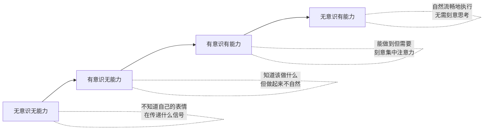

## 场景八：服务场景

服务场景是非语言沟通最密集、最复杂的实战环境之一。在服务过程中，客户不仅在评估你解决了什么问题，更在持续感受你"怎么"解决——你的表情、语调、姿态、节奏，每一个非语言细节都在构建或摧毁信任。研究表明，客户对服务体验的评价中，高达 **93%** 来源于非语言层面（梅拉比安沟通模型在服务领域的延伸应用），仅有 7% 取决于你实际说了什么话。

### 一、服务场景的非语言理论基础

#### 1.1 情绪感染理论（Emotional Contagion）

情绪感染是服务场景中最核心的心理机制。1993 年，心理学家 Elaine Hatfield 在《Emotional Contagion》一书中系统阐述了这一现象：人类会在毫秒级别自动模仿他人的面部表情、声音语调和身体姿态，进而"感染"对方的情绪状态。

在服务场景中，这意味着两个方向：

- **正向感染**：服务人员的温暖微笑、平稳语调、从容姿态会"传染"给客户，帮助焦虑或愤怒的客户平静下来
- **负向感染**：服务人员的紧张、防御、不耐烦同样会被客户捕捉到，加剧冲突升级

关键机制是**镜像神经元（Mirror Neurons）**系统。当客户看到你真诚关切的表情时，大脑中的镜像神经元会自动激活，让客户"体验"到你的关切感。这就是为什么非语言信号比语言承诺更有说服力——大脑在意识层面还没来得及分析你说了什么，情绪层面已经"接收"了你的非语言信息。

#### 1.2 服务补救悖论（Service Recovery Paradox）

服务管理学中有一个重要发现：经历了服务失败但得到了出色补救的客户，其忠诚度反而**高于**从未经历服务失败的客户。这就是服务补救悖论。

这个理论对非语言沟通的启示是：投诉处理不是"止损"，而是"增值"的机会。当你的非语言信号传递出"我高度重视你的问题，我会全力以赴解决"时，客户的体验会从"失望"反转为"被重视"，这种情绪落差创造的记忆锚点比平顺的服务体验更深刻。

#### 1.3 情绪劳动与表层/深层表演

社会学家 Arlie Hochschild 在 1983 年提出"情绪劳动（Emotional Labor）"概念。服务人员需要管理自己的情绪表达，这分为两种策略：

| 策略 | 定义 | 效果 | 持续性 |
|------|------|------|--------|
| 表层表演（Surface Acting） | 压抑真实情绪，"装"出专业表情 | 客户能感知到不真诚，效果有限 | 短期可行，长期导致倦怠 |
| 深层表演（Deep Acting） | 主动调用共情能力，真正"进入"客户视角 | 表达自然真诚，客户感受到真实关怀 | 需要训练，但可持续 |

优秀的服务人员不是"演技更好"的人，而是能在短时间内真正切换到客户视角、产生真实共情的人。这种深层表演能力是非语言沟通的高级形态。

### 二、服务场景的完整非语言框架

#### 2.1 接待阶段：第一印象的 7 秒窗口

客户走近服务台的前 7 秒，大脑已经形成了对你的基本判断。这个判断一旦形成，后续需要大量相反证据才能修正。

**姿态准备：**

- 在客户进入视线范围时（约 3-5 米），开始调整姿态——放下手中物品，身体转向客户方向
- 站立时双脚与肩同宽，重心稳定，传递"准备好了"的信号
- 避免"靠在柜台上""低头看手机""与同事聊天"这三种最常见的负面第一印象

**表情校准：**

- **"三步微笑法"**：客户走近约 3 步（约 1.5 米）时开始自然微笑。微笑太早显得机械，太晚显得冷淡
- 微笑的"真诚度检测"：眼角是否有轻微的鱼尾纹（杜兴微笑的标志）？嘴角是否对称上扬？单纯的嘴角上扬（社交微笑）会被客户无意识地识别为"不真诚"
- 眼神接触：与客户目光相遇时保持 1-2 秒的稳定注视，然后自然转移，再回来——避免死盯（压迫感）或完全不看（冷漠感）

**声音预热：**

- 在开口之前，先用一个微笑和点头建立视觉连接
- 第一句话的语调比内容更重要——"您好，请问有什么可以帮您？"用上扬的语调说，传递积极主动；用平淡的语调说，传递例行公事

#### 2.2 倾听阶段：让客户"被看见"

当客户表达不满时，他们最核心的心理需求不是"问题被解决"，而是"情绪被看见"。神经科学研究表明，当一个人感受到"被理解"时，大脑中与疼痛相关的区域（前扣带回皮层）活动会显著降低。换句话说，真诚的倾听本身就是一种"止痛药"。

**身体语言：**

- **前倾角度**：身体微微前倾约 10-15 度，传递"我在认真听"。前倾过度会显得侵入性，后仰会显得不在乎
- **双手位置**：双手自然放在身前（可以轻握或放在桌面上），不要背在身后（距离感）、插在口袋里（随意感）或交叉在胸前（防御感）
- **点头节奏**：与客户的叙述节奏保持同步。客户说一句重点时轻点一次头，频率约每 3-5 秒一次。过快的点头显得敷衍，不点头显得没在听
- **记录动作**：拿出笔记本或平板，当着客户的面记录关键信息。这个动作传递"你的问题值得被正式记录"的信号，远比口头说"我记下了"更有说服力

**眼神管理：**

- 保持 60-70% 的时间注视客户（服务场景中可以比社交场景略高，因为你在传达"专注"）
- 注视区域：以客户的眉心到鼻尖的三角区为主，偶尔移到嘴部（客户在说话时）
- 当客户情绪激动、声音提高时，不要回避眼神——此时的眼神接触传递"我没有被你的情绪吓到，我能处理这个情况"

**面部表情同步（Emotional Mirroring）：**

- 客户说"太让我失望了"时，你的表情应该同步展示理解和歉意——眉头微皱、嘴角微收，而不是面无表情或职业微笑
- 同步的幅度应该是客户的 60-70%，而不是完全复制。完全复制会显得模仿甚至嘲笑
- 当客户开始平静下来时，你的表情也应该逐渐放松，展示"情绪在好转"的轨迹

**沉默的力量：**

- 当客户停顿时，不要急于填补沉默。等 2-3 秒再回应，给客户充分的表达空间
- 在客户说完后，先停顿 1 秒，再说"我理解了"——这个短暂的停顿传递"我在认真消化你说的话"，比立即回应更有分量

#### 2.3 回应阶段：用非语言强化语言

回应阶段的核心原则是**言行一致性（Verbal-Nonverbal Congruence）**。当你的语言和非语言信号一致时，信息的可信度倍增；当两者矛盾时，大脑会自动相信非语言信号（因为它更难伪装）。

**声音语调策略：**

- **降速法**：语速比客户慢 20-30%。当客户语速加快（焦虑/愤怒的标志），你刻意放慢语速，利用情绪感染效应引导客户节奏放缓
- **降调法**：音量比客户低 10-20%。客户大声投诉时，你用平稳、略低的音量回应，大脑会下意识跟随你的音量调整
- **停顿法**：在关键承诺前停顿半秒——"我 [停顿] 马上为您处理"。停顿创造了一种"我在郑重承诺"的心理锚定

**语句与非语言的配合模板：**

| 语言内容 | 非语言配合 | 效果 |
|----------|-----------|------|
| "非常抱歉给您带来不便" | 轻微点头 + 诚恳表情 + 前倾姿态 | 传递真诚歉意而非敷衍 |
| "我完全理解您的感受" | 表情同步客户情绪 + 2 秒停顿 | 让客户感到"被看见" |
| "这个问题确实不应该发生" | 眉头微皱 + 直视客户 | 传递"我站在你这边" |
| "我马上为您处理" | 利落动作 + 果断语调 | 传递效率和行动力 |
| "请您稍等片刻" | 指向舒适的等待区 + 双手递上饮品 | 让等待变成关怀 |

**绝对要避免的非语言信号：**

- 双臂交叉：防御姿态，传递"我不想听"
- 眼神回避：让客户觉得你心虚或在隐瞒
- 频繁看手表/屏幕：传递"你的时间不值得"
- 叹气/翻白眼：最直接的"我不尊重你"信号
- 手指指向客户：攻击性姿态，即使是无意的
- 低头整理物品：用行动说"你不如我手头的事重要"
- 嘴角不对称上扬：被解读为轻蔑或嘲讽
- 身体转向侧面：随时准备"逃走"的姿态

#### 2.4 解决阶段：用行动展示专业

**效率的非语言表达：**

- 动作要快，但不要慌。快速但有条不紊地处理问题，传递"我有经验处理这类情况"
- 保持与客户的沟通——每处理一个步骤，用简短的语言同步进度："已经为您联系了工程部""新的房间正在准备中"
- 如果需要打电话或操作电脑，保持身体朝向客户的部分角度，而不是完全转身背对

**空间距离管理：**

- 处理过程中如果需要客户配合（比如查看证件、确认信息），先用语言告知再伸手——"麻烦您出示一下预订确认函"然后等待客户主动递出
- 递送物品（房卡、文件、饮品）用双手，身体微微前倾，这是东亚服务文化中表达尊重的标准动作
- 不要在客户和出口之间站位——留出"逃生通道"，让客户感到自由而非被围困

**等待管理：**

- 如果必须让客户等待，提供具体的等待时间——"大约需要 5 分钟"比"请您稍等"好得多
- 等待期间提供舒适的环境：引导到沙发区、递上茶水、告知 Wi-Fi 密码
- 每 2-3 分钟主动向客户更新一次进度，即使没有实质性进展——"还在为您协调中，大约还需要 3 分钟"

#### 2.5 收尾阶段：最后一印象决定记忆

心理学中的**峰终定律（Peak-End Rule）**表明，人们对一段体验的记忆主要取决于"峰值时刻"和"结束时刻"。即使过程中有波折，一个温暖专业的结束能大幅提升客户对整个体验的评价。

- 微笑但不过度——此时的微笑应该是"问题解决后的释然微笑"，而非"服务开始时的职业微笑"
- 站立姿态挺拔但放松，传递"一切安排妥当"的确定感
- 目送客户离开，保持注视直到客户走出视线范围（或 5 米以上）
- 如果场景允许，可以在客户离开时轻声说"祝您入住愉快"或"期待再次见到您"

### 三、不同服务子场景的非语言策略

#### 3.1 餐饮服务场景

餐饮服务的非语言挑战在于：你需要在有限的空间和时间内同时服务多桌客人，每桌客人的状态不同（刚入座、等餐中、用餐中、结账中）。

**点餐时的非语言配合：**

- 站在客人侧后方（约 45 度角），而非正对面。正对面站立会造成压迫感，侧后方既能看清菜单又保持舒适距离
- 当客人犹豫时，保持耐心的微笑和放松的姿态，不要流露出"等不及"的暗示
- 记录菜品时用笔在纸上写，而不是用手机——手写传递更正式的尊重

**上菜时的非语言规范：**

- 从客人左侧上菜（西餐规范）或右侧上菜（中餐规范），提前用语言提示"打扰一下"
- 上菜时身体微弯，但头部保持抬起面向客人——弯腰低头显得卑微，挺直身体又显得不礼貌
- 报菜名时目光从菜品移到客人面部，传递"这是为您准备的"

**敏感时刻的非语言处理：**

- 客人吃出异物时：不要表现出惊慌或嫌恶，立即用平静的表情和诚恳的语气道歉，双手接过问题菜品（而非用两根手指夹起来）
- 客人醉酒时：降低自己的声音和动作幅度，用平稳的节奏引导，避免任何可能被解读为"嘲笑"的表情

#### 3.2 零售服务场景

零售服务的独特之处在于：客户可能只是"逛逛"，你需要在"提供帮助"和"给客户空间"之间找到平衡。

**主动接近的信号判定：**

- 客户抬头环顾、目光搜寻——需要帮助的信号，可以主动接近
- 客户低头看商品、翻看标签——正在浏览，保持 2 米以上的距离，用眼神微笑示意即可
- 客户在某一区域停留超过 30 秒并反复拿起同一商品——犹豫信号，此时可以自然走近并说"这款是我们今年的畅销品"

**销售推荐时的非语言技巧：**

- 展示商品时双手递给客户，同时后退半步——递送是"给予"，后退是"给你空间决定"，两者配合传递"我为你服务但不施压"
- 当客户翻看商品时，保持安静但不要离开——在旁边 1.5 米处自然站立，准备随时回答问题
- 如果客户说"我再看看"，用微笑和点头回应，然后自然移开，不要流露出失望的表情

#### 3.3 医疗服务场景

医疗服务中的非语言沟通具有特殊重要性，因为患者处于焦虑和脆弱的状态。

**问诊时的非语言要点：**

- 与患者保持平视——如果患者坐着，你也坐下。站着俯视坐着的患者会加剧其不安感
- 触诊前先用语言告知"我现在需要检查一下您的腹部"，然后等待患者的点头同意
- 倾听患者描述症状时，保持专注的面部表情和适度的点头，不要频繁看电脑屏幕
- 当患者表达担忧时，用缓慢、平稳的语调回应，语速比正常对话慢 30%

**传递坏消息时的非语言策略：**

- 先坐下，与患者保持 1 米左右的距离（近社交距离的内侧）
- 降低音量，放慢语速，在关键信息前后都留出停顿
- 面部表情保持严肃但温暖——不是面无表情（冷漠），也不是微笑（不合时宜），而是"我理解这很难，但我会陪着你"的表情
- 给患者反应时间，不要急于补充解释。当患者沉默或哭泣时，安静陪伴就是最好的非语言回应

#### 3.4 远程/电话服务场景

远程服务（电话、视频、在线客服）剥离了大部分非语言渠道，但保留下来的部分变得更加重要。

**电话服务中可用的非语言工具：**

- **声音微笑**：微笑时说话，声带的振动频率会改变，听者能感知到"微笑的声音"。训练方法：对着镜子微笑的同时说话，让微笑成为声音的一部分
- **呼吸节奏**：平稳、深沉的呼吸会让声音更稳定、更有信任感。当客户在电话里情绪激动时，刻意放慢自己的呼吸，客户会在无意识中跟随
- **语速控制**：电话中语速应比面对面慢 15-20%，因为电话缺少视觉信息辅助，过快的语速会让客户错过关键信息
- **"嗯""对""明白"等回应词**：在客户说话时定期用这些词语回应，代替面对面时的点头和眼神接触

**视频客服的非语言优化：**

- 摄像头位置与眼睛平齐，避免俯拍（显得居高临下）或仰拍（显得不专业）
- 看镜头而不是看屏幕——看镜头等同于眼神接触，看屏幕等同于"不看客户"
- 背景简洁干净，光线从正面打来，避免逆光产生的"剪影效果"
- 手势幅度缩小到面对面的 50%，因为视频画面有限，过大的手势会显得不协调

#### 3.5 高压投诉场景的非语言降级策略

当客户情绪已经到达爆发点（大声吼叫、拍桌子、使用侮辱性语言）时，标准的服务非语言策略可能不够用。这时需要专门的"情绪降级"技术。

**第一步：锚定（Anchoring）——稳住自己**

在回应客户之前，用 2 秒完成自我锚定：

1. 双脚踩实地面，感受脚底与地板的接触
2. 缓慢深呼吸一次（吸 4 秒，停 2 秒，呼 6 秒）
3. 放松肩膀——肩膀是情绪紧张时最先"锁紧"的部位

这个过程客户几乎感知不到，但它能让你从"被客户情绪冲击"中恢复到"主动管理局面"的状态。

**第二步：身体语言降级（De-escalation Body Language）**

- 双手自然放在身体两侧或桌面上，掌心微微朝上——掌心朝上是人类最古老的"无威胁"信号
- 身体微微侧转（约 15-20 度），不要正面对峙。正面直对在冲突场景中被大脑解读为"对抗姿态"
- 降低重心——坐下（如果可以）或微微屈膝。降低重心在动物行为学中是"缓和冲突"的本能信号
- 保持稳定的注视但不瞪视——目光柔和，偶尔短暂移开再回来

**第三步：节奏引导（Pacing and Leading）**

这是情绪感染理论的高级应用：

1. **匹配（Pacing）**：先短暂匹配客户的语速和音量（约 30 秒），让客户感到"你跟我在同一个频率上"
2. **引导（Leading）**：逐渐降低自己的语速和音量，每次降低 5-10%。如果客户跟随你的节奏，说明降级成功
3. **如果客户不跟随**：回到匹配阶段，再尝试引导。通常需要 2-3 轮匹配-引导循环

**第四步：物理空间调整**

- 如果客户站得很近（侵入个人空间），不要后退（会被解读为"你在示弱"），而是侧移一步——侧面站位既保持了距离又没有退缩
- 如果可能，引导客户从站立区移到坐谈区——"请您到这边坐，我们好好聊聊"。坐下的动作本身就能降低肾上腺素水平
- 递上一杯水——"您先喝口水"。喝水的动作会中断情绪的持续升级（人不能同时喝水和大声吼叫）

### 四、跨文化服务中的非语言差异

在全球化服务环境中，同一非语言信号在不同文化中可能有截然不同的含义。

#### 4.1 眼神接触的文化差异

| 文化背景 | 眼神接触规范 | 服务中的调整 |
|----------|-------------|-------------|
| 东亚（中日韩） | 过度直视被视为不礼貌或挑衅 | 注视频率降低到 40-50%，更多用倾听时的点头代替眼神接触 |
| 中东 | 同性间强烈眼神接触表示信任 | 同性服务时可以增加注视强度和时长 |
| 北欧 | 眼神接触温和但真诚 | 保持自然，不需要刻意增加或减少 |
| 南亚 | 下级对上级避免长时间直视 | 如果服务对象是年长者或地位高的人，适当减少直接注视 |
| 北美 | 眼神接触被期待且被解读为自信 | 保持 60-70% 的注视时间，这是"专业自信"的信号 |

#### 4.2 身体接触的文化差异

- **握手**：欧美、东亚商务场景中握手是标准礼仪；中东同性间握手可能持续很久（不要急于抽手）；日本以鞠躬为主，握手是可选的
- **递送物品**：东亚文化中双手递送表示尊重；在印度和中东，用左手递送被视为不礼貌（左手在伊斯兰和印度教文化中被认为是不洁的）
- **身体距离**：南美和中东客户习惯更近的社交距离（0.5-1 米），北欧和东亚客户偏好更远的距离（1-1.5 米）

#### 4.3 微笑的文化含义

微笑并非在所有文化中都表示友好：

- 在美国和东南亚，服务场景中微笑几乎是强制性的
- 在德国和北欧，过度微笑（尤其是对陌生人）可能被视为不专业或不可信
- 在日本，微笑可能用来掩盖尴尬或不悦（"礼仪微笑"），不代表真正开心
- 在中国，服务场景中微笑是基本要求，但"假笑"会被迅速识别并产生负面效果

### 五、服务团队的非语言训练体系

#### 5.1 训练方法：从意识到自动化

非语言技能的训练分为四个阶段：

**阶段一：觉察训练（1-2 周）**

- 让员工两两配对，一人扮演客户、一人扮演服务人员，全程录像
- 回看录像，让旁观者指出服务人员的非语言信号——"你在客户说失望时笑了""你一直在交叉手臂"
- 目标：让员工意识到自己的无意识非语言习惯

**阶段二：模仿训练（2-4 周）**

- 播放优秀的服务场景视频，让员工逐帧模仿表情、姿态、语调
- 使用镜子练习微笑——找到"杜兴微笑"的感觉（眼角有皱纹的真诚微笑）
- 声音训练：录音后回放，练习语速控制和音量调节

**阶段三：场景模拟（4-8 周）**

- 设计 10-15 个典型投诉场景，从"简单不满"到"极端暴怒"
- 每周进行 2-3 次模拟演练，每次录像并集体复盘
- 引入"意外变量"——比如客户的文化背景不同、客户突然改变情绪、旁边有其他客户围观

**阶段四：实战巩固（持续）**

- 在真实服务中使用"影子教练"——资深员工在旁边观察新员工的非语言表现
- 每月进行一次"神秘顾客"检测，专门评估非语言指标
- 建立"非语言反馈卡"——同事之间匿名分享观察到的非语言改进点

#### 5.2 团队非语言同步

优秀的服务团队不是一群独立的优秀个体，而是一支非语言信号"同频"的队伍。

**统一的非语言标准：**

- 微笑标准：露出 6-8 颗牙齿的自然微笑（服务行业常见培训指标）
- 站姿标准：双脚与肩同宽，双手自然交叠于身前
- 引导手势：统一用"请"的手势（五指并拢、掌心朝上、手臂伸展 45 度）
- 鞠躬角度：15 度（日常问候）、30 度（感谢和歉意）、45 度（正式场合）

**交接时的非语言配合：**

- 当一位服务人员需要将客户交接给另一位时，双方的非语言信号必须一致
- 交接者应先向客户介绍接替者，并用身体语言（轻拍接替者肩膀、引导手势）传递"这个人同样值得信任"
- 接替者应在交接者完成介绍后立即展示专注的表情和准备好的姿态，不要有"刚被叫过来"的茫然感

### 六、服务非语言的常见误区与纠正

#### 误区一："微笑就能解决一切"

**错误表现**：面对愤怒的客户，始终保持微笑，认为微笑能安抚客户情绪。

**问题分析**：当客户情绪激动时，不恰当的微笑会被解读为"你在嘲笑我""你根本不在乎我的问题"。在情绪高涨时，客户需要的是"被理解"，而不是"被微笑面对"。

**纠正方法**：使用**表情同步策略**——先匹配客户的情绪表情（展示理解和关切），在客户情绪开始下降后再逐渐引入微笑。

#### 误区二："道歉越多次越好"

**错误表现**：在客户投诉过程中反复说"对不起"，每次都说得很快、很轻。

**问题分析**：频繁的口头道歉如果没有配合非语言的真诚信号（停顿、前倾、表情同步），会被解读为"敷衍了事""机械应答"。道歉的质量远比数量重要。

**纠正方法**：每次道歉时配合一个"暂停动作"——说完"对不起"后停顿 1 秒，看着客户，让道歉有"重量感"。一个有分量的道歉胜过十个轻飘飘的"对不起"。

#### 误区三："专业就是面无表情"

**错误表现**：认为专业服务就是不带个人情感，用平静、不带情绪的面孔面对客户。

**问题分析**：面无表情在客户眼中等同于"冷漠"。人类大脑对面部表情的敏感度极高，一个"面瘫"式的服务人员会让客户感到被忽视和不被尊重。

**纠正方法**：专业不等于"没有表情"，而是"恰当的表情"。在客户表达失望时展示理解，在客户表示满意时展示开心——关键在于表情与情境的匹配度。

#### 误区四："身体前倾就是好的"

**错误表现**：全程保持前倾姿态，认为这样传递"我在认真听"。

**问题分析**：过度前倾（尤其是前倾超过 30 度）在客户眼中是"侵入性姿态"，传递的是压迫感而非关注。在客户需要"空间"的时候，过度前倾反而加剧紧张。

**纠正方法**：使用**动态姿态**——客户在倾诉时前倾 10-15 度，在你回应时回到正直姿态，在思考解决方案时微微后仰。身体的自然动态比固定的"标准姿势"更有信任感。

#### 误区五："快速解决问题是最重要的"

**错误表现**：急于修复问题，快速跳过倾听环节，直接给出解决方案。

**问题分析**：客户的核心需求往往不是"最快的解决方案"，而是"先被理解，再被解决"。跳过倾听直接行动会让客户觉得"你只是在完成任务，不是在关心我"。

**纠正方法**：遵循**"先情绪、后事实、再行动"**的顺序——先用非语言信号和倾听回应客户的情绪（2-3 分钟），再确认问题的事实细节（1-2 分钟），最后展示解决方案的行动力。研究表明，花 3 分钟在倾听上的服务人员，其客户满意度比"立即行动"的服务人员高出 40%。

### 七、高级技巧：非语言信号的预判与主动管理

#### 7.1 微表情识别

服务人员可以通过学习微表情识别（基于 Paul Ekman 的 FACS 面部动作编码系统），在客户情绪"爆发"之前就捕捉到预警信号：

- **眉毛内侧上扬**：忧虑/不安的信号——客户可能对某个信息感到担心
- **嘴角单侧下拉**：不满/轻蔑的信号——客户可能对服务或产品有异议
- **鼻翼扩张**：愤怒的早期信号——客户正在压抑怒气
- **频繁眨眼**：焦虑/压力的信号——客户可能对等待或流程感到不安
- **嘴唇紧闭成一条线**：压抑情绪的信号——客户正在"忍耐"

当你捕捉到这些微表情信号时，可以在客户情绪升级之前主动调整策略——比如提前道歉、加快处理速度、增加关怀动作。

#### 7.2 非语言的"预承诺"技术

在可能引起不满的操作之前，先用非语言信号做好"情绪铺垫"：

- 在告知需要等待之前，先展示歉意的表情并微微前倾——"真的很抱歉"（非语言先行）
- 在传递坏消息之前，先降低音量和语速——客户在听到内容之前就已经感受到"可能不是好消息"，给了大脑一个缓冲时间
- 在请求客户提供额外信息之前，先展示感谢的姿态——"麻烦您了"配合微笑和轻微的鞠躬

#### 7.3 非语言记忆管理

根据峰终定律，你可以战略性地管理客户对服务体验的记忆：

- **创造"峰值"**：在解决问题后，提供一个小小的"超出预期"的关怀——比如为投诉的客人免费升级房型、为等待过久的客人送一份甜点。这个"惊喜时刻"会成为客户记忆中的峰值
- **管理"终值"**：客户的最后印象比第一印象更影响记忆。确保离开时的非语言信号是温暖、专业、真诚的
- **"最后一句话"策略**：在客户转身离开时，追加一句真诚的"感谢您的理解"——这句话客户的听觉记忆中会占据特殊位置

### 八、实战案例：完整的服务场景模拟

#### 案例：五星级酒店前台投诉处理

**背景**：周华是一家五星级酒店的前台经理。一位 VIP 客人（刘先生）在入住后发现预订的豪华套房存在三个问题：空调噪音大、浴室热水不稳定、窗外有施工噪音。刘先生怒气冲冲地来到前台投诉。

**错误示范 vs 正确示范对比：**

**错误示范：**

刘先生走近前台时，周华正在低头看电脑屏幕。

刘先生："你们这是什么五星级酒店？房间空调像拖拉机一样响，洗澡水忽冷忽热，外面还在施工！"

周华（抬头，职业微笑）："非常抱歉给您带来不便，我马上帮您处理。"（说话时已经在操作电脑换房）

刘先生："你就这样处理？你连我说了什么问题都没记下来！"

周华（笑容僵住）："抱歉抱歉，我已经记下来了……"

**问题分析**：周华虽然在"解决问题"，但整个过程中非语言信号是失败的——初始注意力不在客户身上（低头看电脑）、表情与情境不匹配（职业微笑面对愤怒）、跳过倾听直接行动、道歉缺乏真诚感。

**正确示范：**

刘先生走近前台时，周华在 3 米外就注意到了他（视线从电脑移开，身体转向客户方向）。

刘先生："你们这是什么五星级酒店？房间空调像拖拉机一样响，洗澡水忽冷忽热，外面还在施工！"

周华（立即站起，身体前倾约 15 度，双手自然放在身前，表情同步展示关切和歉意）："刘先生，非常抱歉。"（停顿 1 秒，看着刘先生的眼睛）"请您详细告诉我具体情况，我马上记录下来。"（拿出笔记本）

刘先生："空调噪音大得根本睡不着，浴室热水不稳定忽冷忽热，而且窗户外面一直在施工！我花这个价钱住五星级，就得到这样的体验？"

周华（保持前倾姿态，一边记录一边在每句话后轻点一次头。当刘先生说"根本睡不着"时，周华的表情同步展示出理解和歉意——眉头微皱、嘴角微收）："我完全理解，这确实是不应该发生的情况。"（停顿 1 秒）"刘先生，您入住到现在还没有休息好，这是我们的责任。"

周华（语速比刘先生慢 20%，语调平稳温和）："我现在为您做三件事：第一，为您安排最高层的行政套房，远离施工区域；第二，工程部会立即检查空调和热水系统；第三，今晚的住宿费用我们全额承担。"

（处理过程中，周华始终保持身体朝向刘先生的 45 度角，每处理一个步骤就口头同步进度。15 分钟后，新房间准备完毕。）

周华（双手递上新房卡，微微鞠躬约 15 度）："刘先生，您的新房间在 28 楼行政层，这是房卡。我们已经确认空调和热水全部正常，窗外是安静的花园景观。"（微笑，但不是职业微笑，而是"问题解决后的真诚释然"）

刘先生（情绪已经完全平复）："谢谢，你的处理我很满意。"

周华（起身目送，保持注视直到刘先生走进电梯）："感谢您的理解和耐心，祝您入住愉快。如有任何需要，请随时联系我。"

**对比分析：**

| 维度 | 错误示范 | 正确示范 |
|------|---------|---------|
| 初始注意力 | 低头看电脑 | 3 米外主动关注 |
| 倾听表现 | 跳过倾听直接行动 | 记录、点头、表情同步 |
| 情绪管理 | 职业微笑面对愤怒 | 先同步情绪再引入微笑 |
| 语速语调 | 正常语速 | 降速 20%，降调 |
| 解决方案 | 只有行动没有同步 | 每步口头同步进度 |
| 收尾 | 敷衍道歉 | 释然微笑 + 目送 |

### 九、自我检测清单

服务人员可以定期用以下清单自评非语言沟通水平：

**接待阶段：**

- [ ] 客户进入视线范围时，我能在 3 秒内完成姿态调整
- [ ] 我的微笑是真诚的杜兴微笑（眼角有皱纹），而非仅嘴角上扬
- [ ] 第一句话的语调上扬，传递积极主动

**倾听阶段：**

- [ ] 客户表达不满时，我的身体前倾约 10-15 度
- [ ] 我的手自然放在身前，没有交叉手臂或插口袋
- [ ] 我的点头频率与客户叙述节奏同步
- [ ] 当客户情绪激动时，我的面部表情同步展示了理解
- [ ] 客户说完后，我停顿 1 秒再回应

**回应阶段：**

- [ ] 我的语速比客户慢 20-30%
- [ ] 我的音量比客户低 10-20%
- [ ] 道歉时配合了诚恳的表情和前倾姿态
- [ ] 承诺时配合了果断的语气和利落的动作

**收尾阶段：**

- [ ] 问题解决后，我的微笑是"释然型"而非"开场型"
- [ ] 我目送客户离开并保持注视
- [ ] 最后一句话真诚且有温度

### 十、关键要点回顾

- 服务场景中 93% 的客户感知来自非语言层面，语言内容仅占 7%
- 情绪感染是双向的——你的非语言信号在主动塑造客户的情绪状态
- 先情绪、后事实、再行动——用 2-3 分钟倾听创造的情绪价值，比 10 分钟的高效行动更有说服力
- 服务补救悖论证明：出色的投诉处理是创造超预期忠诚度的机会
- 表层表演（装出来的专业）会被客户识别；深层表演（真正的共情）才是可持续的服务能力
- 峰终定律决定了客户的长期记忆——战略性管理"峰值时刻"和"结束时刻"
- 跨文化服务中，同一非语言信号可能有完全相反的含义——了解目标客户群体的文化背景是基础功
- 非语言技能从意识到自动化需要经历四个阶段，持续训练和反馈是关键

***
