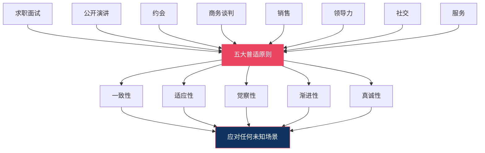
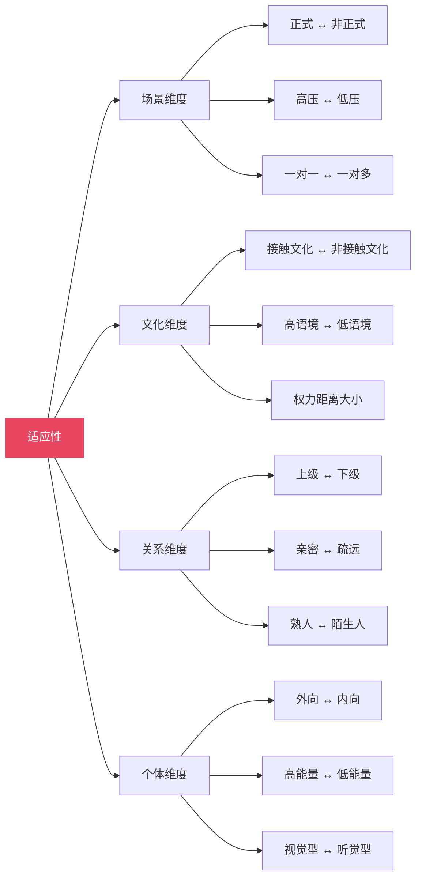
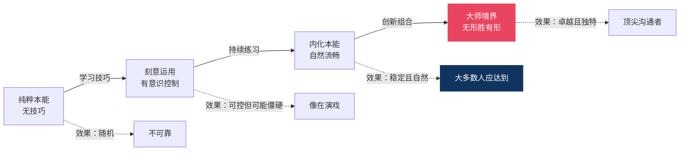
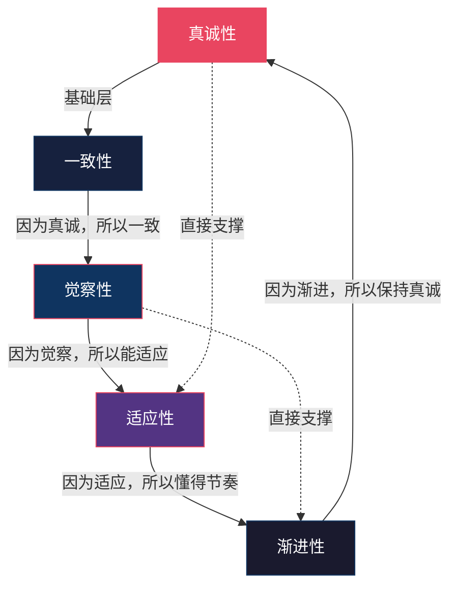

## 场景总结：非语言沟通的普适原则

前八个场景——求职面试、公开演讲、约会、商务谈判、销售、领导力、社交、服务——覆盖了人生中最关键的非语言沟通情境。每个场景有独特的挑战和技巧，但当我们把目光从单一场景抽离，站在更高维度俯瞰全局时，会发现所有成功的非语言沟通都遵循着相同的底层规律。

本节的目标不是简单重复前文内容，而是**从八个场景中蒸馏出可跨场景迁移的元能力**。掌握了这些普适原则，即使面对一个从未遇到过的全新场景——比如第一次见岳父母、第一次参加葬礼、第一次在异国谈判——你也能快速构建出得体的非语言策略。



---

### 一、一致性原则：言行合一是一切信任的根基

#### 1.1 什么是一致性

一致性是指你的语言内容、面部表情、声音语调、身体姿态、手势动作和空间行为传递**相同方向的信息**。当你说"我很期待这次合作"时，你的微笑应该是真诚的（眼部肌肉参与的杜兴微笑），声音应该是温暖上扬的，身体应该是微微前倾的，而不是双臂交叉、语调平板、眼神游移。

梅拉比安的研究之所以引起轰动，正是因为它揭示了一个残酷的事实：**当语言与非语言信号冲突时，人们几乎无条件地相信非语言信号。** 这不是偏好，而是神经机制决定的——人类大脑的边缘系统处理非语言信号的速度比皮层处理语言内容快约300毫秒，且非语言信号更难伪装，因此被进化赋予了更高的可信度权重。

#### 1.2 一致性在八个场景中的体现

| 场景 | 一致性成功案例 | 不一致的灾难后果 |
|------|---------------|-----------------|
| 面试 | 说"我对这个职位充满热情"时，眼神明亮、身体前倾、语调上扬——面试官感受到真诚 | 说同样的话却低头看简历、声音平板——面试官直觉判断为"背台词" |
| 演讲 | 说"这个数据令人震惊"时，停顿、降低音量、用双手框住关键数字——全场屏息 | 说同样的话却语速飞快、手势碎乱、继续翻PPT——观众无动于衷 |
| 约会 | 表达"和你聊天很开心"时，杜兴微笑、身体转向对方、声音变柔——对方感受到吸引力 | 说同样的话却频繁看手机、身体朝向出口——对方感到被敷衍 |
| 谈判 | 说"这是我们的底线"时，语速放慢、眼神稳定、双手平放桌面——对方相信 | 说同样的话却身体后仰、声音颤抖、不自觉摸鼻子——对方嗅到让步空间 |
| 销售 | 说"这款产品确实适合您"时，真诚微笑、并排指向产品、语调平和——客户信任 | 说同样的话却眼神闪烁、过度热情、急于递合同——客户本能警觉 |
| 领导力 | 在危机中说"我们能处理好"时，声音沉稳、步伐放慢、表情平静——团队安心 | 说同样的话却来回踱步、声音发紧、频繁擦汗——团队恐慌加倍 |
| 社交 | 说"很高兴认识你"时，杜兴微笑、握手有力、眼神接触3秒——对方放松 | 说同样的话却眼神飘忽、握手无力、身体后倾——对方感到不被重视 |
| 服务 | 说"非常抱歉给您带来不便"时，眉头微蹙、身体前倾、语调低沉——客户感到被重视 | 说同样的话却面无表情、语速飞快、边说边操作电脑——客户更加愤怒 |

#### 1.3 不一致的心理机制

为什么不一致的信号如此具有破坏力？神经科学给出了三层解释：

**第一层：认知冲突。** 当大脑同时接收到矛盾的信息（语言说"开心"，表情说"不开心"），前扣带皮层会被激活，产生不适感。这种不适感会被无意识地归因于"这个人不可信"，即使你无法明确指出问题出在哪里。

**第二层：能量消耗。** 处理矛盾信息比处理一致信息消耗更多认知资源。在面试官、客户或听众的认知资源有限的情况下，不一致的信号让他们更累，而"让对方累"本身就是一种负面体验。

**第三层：进化警觉。** 在远古环境中，言行不一的个体可能是危险的（伪装友好实则敌意）。我们的神经系统对不一致信号保持着本能的警觉——这是一种生存机制。

#### 1.4 实操：如何确保一致性

**核心方法：由内而外，而非由外而内。**

大多数非语言不一致的根源是"试图表演一种自己没有的情感"。与其学习如何"看起来自信"，不如从源头管理自己的内在状态：

| 层级 | 方法 | 操作 |
|------|------|------|
| 源头管理 | 情绪预设 | 进入场景前，用2分钟回忆一段与目标情感匹配的记忆（如回忆一次成功经历来激活自信） |
| 源头管理 | 生理调节 | 4-7-8呼吸法（吸气4秒、屏息7秒、呼气8秒）降低皮质醇水平 |
| 信号校准 | 录像回看 | 每周录制一次模拟场景，用三遍观看法检查言行是否一致 |
| 信号校准 | 信任伙伴 | 请一位朋友在你说话时观察，指出任何"看起来不对劲"的瞬间 |
| 即时修正 | 身体先行 | 如果你感到紧张但需要表现镇定，先调整身体（深呼吸、放慢语速、打开姿态），内在状态会跟随身体改变 |

**关键区分：一致性 ≠ 完美表演。** 一致性意味着你的非语言信号诚实地反映你的真实状态。如果你确实紧张，说"我有点紧张，但我很期待这次机会"配合适度的微笑和开放姿态，比假装完全不紧张更有力量。因为前者的言行是**一致的**，而后者很容易被识破。

---

### 二、适应性原则：没有放之四海而皆准的非语言公式

#### 2.1 什么是适应性

适应性是指根据场景的正式程度、情感基调、文化背景、关系深度和对方的个性特征，灵活调整你的非语言策略。一个在亲密朋友间自然的拍肩动作，放在初次商务会面中就可能造成冒犯；一个在北欧文化中被视为真诚的眼神接触，在东亚文化中可能被解读为挑衅。

适应性不是"圆滑"或"见人说人话"，而是**对沟通情境的精准感知和恰当回应**。

#### 2.2 四维适应框架

从八个场景中可以提取出四个核心适应维度：



**场景维度的适应：**

| 正式程度 | 姿态要求 | 眼神策略 | 声音策略 | 手势策略 | 空间策略 |
|----------|----------|----------|----------|----------|----------|
| 高度正式（面试、谈判） | 挺拔，减少晃动 | 稳定但不凝视，三角扫描 | 语速稍慢，音量适中，减少填充词 | 低频、大框架、在腰部以上 | 保持社交距离（1.2-2m） |
| 中度正式（商务社交、演讲） | 自然挺拔，允许适度移动 | 扩大扫描范围，灯塔法 | 适度变化音调和语速 | 中频，辅助说明 | 社交距离到个人距离（0.8-1.5m） |
| 低度正式（朋友聚会、约会） | 放松，允许自然动作 | 温暖注视，增加口部三角 | 丰富变化，匹配情感 | 高频，自然流露 | 渐进缩短至亲密距离 |

**文化维度的适应：**

| 文化特征 | 代表地区 | 眼神接触 | 空间距离 | 触摸规范 | 手势含义 |
|----------|----------|----------|----------|----------|----------|
| 接触型、高语境 | 中东、南美、南欧 | 较多，表达热情 | 较近（<60cm） | 同性间频繁 | "OK"手势在巴西是侮辱 |
| 中间型 | 北美、中国城市 | 中等，真诚坦率 | 中等（60-120cm） | 有限，握手为主 | 上下点头=同意（全球多数） |
| 非接触型、低语境 | 北欧、日本 | 适度，过长=冒犯 | 较远（>120cm） | 极少，避免 | 鞠躬深度反映尊重程度 |

**关键原则：在跨文化场景中，宁可保守也不要冒进。** 如果你不确定某种非语言行为在对方文化中的含义，选择更正式、更克制的方式总是更安全的。

#### 2.3 适应性的实操方法：观察—判断—调整循环

适应性不是一次性决策，而是在对话过程中**持续运转的实时循环**：

**第一步：观察（Observe）。** 进入场景的前30秒，快速扫描对方的非语言基线：他们的默认姿态是开放还是封闭？语速是快是慢？眼神接触的频率如何？这建立了一个"参照点"。

**第二步：判断（Assess）。** 基于观察到的基线和对场景的认知，判断当前需要什么类型的非语言策略。例如：对方语速很快且身体前倾——这是一个快节奏、高能量的场景，你需要匹配这个节奏而非刻意放慢。

**第三步：调整（Adjust）。** 将你的非语言行为向场景需求的方向微调。调整的幅度要小——每次改变一两个变量，观察对方的反应，再决定是否继续调整。

**第四步：验证（Verify）。** 调整后观察对方的非语言反馈。如果对方也向你靠近、表情放松、语调变暖——说明你的调整方向正确。如果对方身体后倾、交叉双臂、减少眼神接触——你需要回退或改变策略。

#### 2.4 八场景的适应性速查表

| 从→到 | 最需要调整的非语言维度 | 调整方向 |
|-------|----------------------|----------|
| 面试→演讲 | 眼神从一对一变为一对多（灯塔法）；手势从低频变为高频；空间从坐姿变为站姿移动 | 放大一切信号，因为观众规模放大了非语言的影响 |
| 演讲→约会 | 从"表演模式"切换为"对话模式"；减少权威感，增加温暖感；声音从宏亮变为柔和 | 温暖 > 权威，倾听 > 表达 |
| 谈判→销售 | 从"防守解读"切换为"信任建立"；空间从对面变为并排；从沉默策略切换为主动引导 | 合作 > 对抗，引导 > 解读 |
| 领导力→社交 | 从"情绪管理"切换为"好奇心驱动"；降低权威姿态，增加平等信号 | 探索 > 展示，平等 > 层级 |
| 服务→约会 | 从"情绪劳动"切换为"真实表达"；允许更多个人情感流露 | 真诚 > 专业，个人 > 角色 |

---

### 三、觉察性原则：双向感知是非语言沟通的核心引擎

#### 3.1 什么是觉察性

觉察性包含两个方向：

- **向外觉察**：持续读取对方的非语言信号，理解其真实情感状态、意图和态度变化
- **向内觉察**：时刻感知自己的非语言行为，确保它与自己的意图一致

大多数人只关注其中一个方向——要么过度关注"我该怎么表现"而忽略了对方的反馈，要么过度关注"对方在想什么"而忘记管理自己的信号。真正有效的非语言沟通需要**双向同时运转**。

#### 3.2 注意力分配模型

根据场景类型不同，向外和向内的注意力分配比例应该动态调整：

| 场景 | 向外觉察（读取对方） | 向内觉察（管理自己） | 原因 |
|------|---------------------|---------------------|------|
| 面试 | 40% | 60% | 你是被评估方，需要更多管理自己的输出 |
| 演讲 | 30%（观众反馈） | 70%（表演质量） | 一对多场景，表演的可控性更重要 |
| 约会 | 60% | 40% | 读懂对方的兴趣和舒适度信号是核心任务 |
| 谈判 | 70% | 30% | 读懂对方真实立场比管理自己更重要 |
| 销售 | 60% | 40% | 识别购买信号比自己的销售话术更关键 |
| 领导力 | 50% | 50% | 需要平衡情绪传染管理和团队信号读取 |
| 社交 | 60% | 40% | 读懂群体动态、找到加入时机是核心 |
| 服务 | 60% | 40% | 读懂客户情绪状态以选择恰当回应策略 |

#### 3.3 向外觉察：信号簇分析的系统方法

向外觉察的核心技能是**信号簇分析**——不要根据单一信号下结论，而是观察多个信号是否指向同一方向。

**信号簇的四个层级：**

| 层级 | 说明 | 可靠度 | 示例 |
|------|------|--------|------|
| 单一信号 | 一个非语言行为 | 低（约30-40%） | 对方交叉双臂 |
| 信号组合 | 2-3个方向一致的信号 | 中等（约50-60%） | 交叉双臂 + 身体后倾 + 回避眼神 |
| 信号簇 | 4个以上方向一致的信号 | 较高（约70-80%） | 以上 + 语调变硬 + 下巴收紧 + 脚尖朝向出口 |
| 信号簇+基线偏差 | 信号簇 + 明显偏离对方的默认行为 | 高（约80-90%） | 以上 + 对方在对话前半段一直保持开放姿态 |

**快速信号簇识别清单：**

| 信号簇类型 | 组成信号 | 通常含义 | 应对策略 |
|-----------|---------|---------|---------|
| 防御信号簇 | 双臂交叉 + 身体后倾 + 回避眼神 + 语调变硬 + 下巴收紧 | 感到威胁、不同意、不信任 | 后退一步，降低威胁感，用开放式提问探查原因 |
| 紧张信号簇 | 频繁自我触摸 + 坐立不安 + 语速加快 + 填充词增多 + 手脚小动作 | 焦虑、不确定、压力大 | 放慢节奏，给予肯定，降低场景的威胁性 |
| 兴趣信号簇 | 身体前倾 + 瞳孔放大 + 频繁点头 + 脚尖朝向你 + 主动缩短距离 | 感兴趣、被吸引、认同 | 加强当前正在做的事情，对方正在给正反馈 |
| 厌倦信号簇 | 身体后仰 + 眼神飘散 + 频繁看时间/手机 + 减少回应 + 叹气 | 失去兴趣、想结束 | 切换话题、缩短内容、或主动结束对话 |
| 说谎信号簇（仅参考） | 语言犹豫 + 微表情泄露 + 声音变化 + 自我触摸增加 + 言行不一致 | 可能在隐瞒（准确率仅54%） | 不要直接指控，用开放式问题交叉验证 |

#### 3.4 向内觉察：自我监控的日常练习

向内觉察的目标是建立一个"内在观察者"——在你参与对话的同时，有一个后台进程在监控你的非语言行为。

**三种训练方法：**

**方法一：身体扫描快照。** 在对话的自然停顿点（如对方说话时），用3秒快速扫描自己的身体状态：肩膀是耸起还是下沉？呼吸是浅还是深？双手在哪里？面部肌肉是紧绷还是放松？这个练习的目标不是在对话中调整自己，而是**积累觉察数据**——知道你在不同情绪状态下身体的默认反应模式。

**方法二：录像回看。** 每周录制一次你在真实或模拟场景中的表现，用三遍观看法回看。重点关注你之前完全没有意识到的行为——大多数人会惊讶地发现自己有3-5个从未注意到的非语言习惯（如频繁摸耳朵、说话时闭眼、紧张时咬嘴唇内侧）。

**方法三：信任伙伴反馈。** 请一位你信任的朋友或同事，在一次真实互动后给你非语言反馈。具体问题："我刚才有没有什么小动作让你觉得不舒服或分心？""我的眼神接触频率你觉得合适吗？""我的语调有没有在某些地方让你觉得不自然？"

#### 3.5 八场景中的觉察性关键点

| 场景 | 最需要向外觉察的信号 | 最需要向内觉察的信号 |
|------|-------------------|-------------------|
| 面试 | 面试官的点头频率和表情变化（判断你的回答是否有效） | 自己的小动作（腿抖、转笔、摸脸） |
| 演讲 | 观众的眼神方向和身体姿态（前倾=投入，后仰=走神） | 语速是否过快、手势是否低于腰部 |
| 约会 | 对方的脚尖方向和距离变化（兴趣的核心指标） | 是否过于急切地缩短距离、声音是否过于紧张 |
| 谈判 | 对方说"不"时的非语言强度（真正的拒绝 vs. 策略性拒绝） | 自己是否在压力下泄露了焦虑信号 |
| 销售 | 客户的购买信号簇（前倾、触摸产品、点头、配偶交换眼神） | 是否因过度热情而让客户感到压力 |
| 领导力 | 团队的情绪传染状态（一人焦虑是否在扩散） | 自己的焦虑是否在无意中传染给团队 |
| 社交 | 群体的开放程度（身体朝向、笑声频率、空间是否为你打开） | 是否因社交焦虑而身体僵硬、笑容僵硬 |
| 服务 | 客户情绪的早期预警信号（眉头微蹙、鼻翼扩张、嘴唇紧抿） | 是否因情绪劳动而出现"表面微笑"（嘴角动但眼睛不动） |

---

### 四、渐进性原则：节奏感决定一切

#### 4.1 什么是渐进性

渐进性是指非语言信号的变化——无论是空间距离的缩短、身体接触的增加、情感深度的递进，还是权威感的建立——都应该**循序渐进**，而非突变。人类的神经系统对渐变有极强的适应能力，但对突变会产生强烈的防御反应。

这一原则在约会场景中最为明显，但它其实适用于所有场景：面试中你不会一上来就问薪资，演讲中你不会一开始就讲最核心的论点，谈判中你不会开场就亮底牌——非语言策略同样需要铺垫和节奏。

#### 4.2 渐进性的三层结构

```mermaid
graph TB
    subgraph 第一层：空间渐进
        A1[公共距离<br/>3.6m+] --> A2[社交距离<br/>1.2-3.6m]
        A2 --> A3[个人距离<br/>0.5-1.2m]
        A3 --> A4[亲密距离<br/><0.5m]
    end

    subgraph 第二层：接触渐进
        B1[无意接触<br/>擦肩而过] --> B2[社交接触<br/>握手、拍肩]
        B2 --> B3[友好接触<br/>手臂轻触、拥抱]
        B3 --> B4[亲密接触<br/>手、腰、面部]
    end

    subgraph 第三层：情感渐进
        C1[表面话题<br/>天气、工作] --> C2[个人话题<br/>兴趣、经历]
        C2 --> C3[深层话题<br/>价值观、情感]
        C3 --> C4[脆弱话题<br/>恐惧、创伤]
    end

    style A1 fill:#1a1a2e,stroke:#0f3460,color:#fff
    style A4 fill:#e94560,stroke:#e94560,color:#fff
    style B1 fill:#1a1a2e,stroke:#0f3460,color:#fff
    style B4 fill:#e94560,stroke:#e94560,color:#fff
    style C1 fill:#1a1a2e,stroke:#0f3460,color:#fff
    style C4 fill:#e94560,stroke:#e94560,color:#fff
```

#### 4.3 八场景中的渐进性模式

| 场景 | 渐进的核心维度 | 典型阶段 | 突变的后果 |
|------|--------------|---------|-----------|
| 面试 | 从正式到适度轻松 | 开场：标准问候和姿态 → 中段：适度微笑和前倾 → 尾声：轻松话题和自然手势 | 一上来就过于随意，面试官觉得你不够重视 |
| 演讲 | 从建立信任到传递核心信息 | 开场：稳重站定和灯塔扫描 → 中段：加入手势和空间移动 → 高潮：全信号满载 | 一上台就激情四射，观众觉得"表演痕迹太重" |
| 约会 | 从社交距离到亲密距离 | 第一次：L型座位、社交距离 → 第二三次：缩短至个人距离 → 之后：渐进接触 | 第一次见面就坐得太近、频繁触碰，对方感到被侵犯 |
| 谈判 | 从试探到亮牌 | 开场：中性信号、观察基线 → 中段：测试性策略（沉默、微表情） → 后段：根据读到的信息调整强度 | 一上来就咄咄逼人，对方启动全面防御 |
| 销售 | 从建立信任到引导决策 | 进入：3步微笑和45度接近 → 了解：并排站位和倾听姿态 → 体验：邀请触摸和身体记忆 → 成交：沉默和空间退后 | 一上来就热情推荐，客户本能后退 |
| 领导力 | 从观察到影响 | 观察团队基线 → 日常积累非语言信任 → 在关键时刻注入情绪引导 | 新任领导第一天就用权威姿态训话，团队产生抵触 |
| 社交 | 从边缘到核心 | 站在边缘观察10-20秒 → 非语言回应30-60秒 → 自然插入发言 → 调整位置进入弧形 | 直接走到群体中心插话，所有人感到不适 |
| 服务 | 从专业到共情 | 标准问候和微笑 → 识别客户情绪 → 60-70%强度的共情镜像 → 逐步引导解决方案 | 一上来就过度共情，客户觉得"假"或被侵犯隐私 |

#### 4.4 渐进性的核心机制：舒适度阈值

为什么突变会产生防御反应？心理学的解释是**舒适度阈值（comfort threshold）**：每个人对不同类型的非语言行为都有一个心理上的"安全边界"。当他人跨越这个边界时，杏仁核会被激活，触发"战斗或逃跑"反应。

渐进性的作用是**逐步扩展对方的舒适区**。当你在对方的舒适区边缘轻轻试探（缩短一点距离、增加一点眼神接触），而对方没有产生防御反应时，舒适区就会微微扩大。反复这个过程，原本不可能的亲密距离就变得自然了。

**关键信号：如何判断对方是否舒适？**

| 舒适信号 | 不适信号 |
|----------|---------|
| 身体没有后倾或远离 | 身体后倾、侧转或后退 |
| 保持或增加眼神接触 | 减少眼神接触、看向别处 |
| 微笑或放松的面部表情 | 面部紧绷、假笑或无表情 |
| 姿态开放（手臂不交叉） | 双臂交叉、双手插兜 |
| 脚尖朝向你 | 脚尖朝向出口 |
| 主动回应你的信号（如也靠近一点） | 不回应或反向移动 |

**核心规则：渐进的节奏由对方的舒适度信号决定，而不是由你的时间表决定。** 如果对方的不适信号出现，立即回退一步，给对方空间。

---

### 五、真诚性原则：技巧是手段，不是目的

#### 5.1 什么是真诚性

真诚性是指所有非语言技巧都应建立在**真实表达**的基础上，而非表演或伪装。非语言沟通的终极目标不是"让别人看到你想让他们看到的样子"，而是"让你的真实状态以最有效的方式传达出来"。

这听起来像是一个矛盾：既然要真诚，为什么还要学技巧？答案是：**大多数人的非语言信号不是"太假"，而是"太乱"**——他们的内心确实有真诚的情感，但由于紧张、习惯或缺乏觉察，非语言通道传递的是一个扭曲的版本。技巧的作用是消除这些噪音，让真实的信号更清晰地传达。

#### 5.2 为什么虚假信号注定失败

人类的边缘系统对虚假信号有极强的探测能力。以下是科学解释：

**微表情泄露。** 当你试图伪装情感时，大脑皮层可以控制大部分面部肌肉，但边缘系统会在1/25到1/5秒的时间窗口内产生真实情感的微表情。这些微表情速度快到大多数人无法有意识地察觉，但大脑会在无意识层面捕获它们——产生一种"说不清哪里不对，但就是感觉不真诚"的直觉。

**声音泄露。** 声音语调比面部表情更难控制。当你假装自信时，声带的紧张会导致音调微微升高、音量略微不稳、语速可能略微加快。专业训练的演员可以控制这些，但普通人在高压场景下几乎不可能。

**信号簇暴露。** 伪装一个信号容易，伪装一整个信号簇极难。你可以控制嘴角做出微笑，但很难同时让眼部肌肉（AU6：眼轮匝肌外侧收缩）、声音温度、身体姿态和距离行为都保持一致的"开心"状态。而对方的大脑会无意识地扫描整个信号簇——不一致会立即被捕捉。

#### 5.3 真诚性的正确打开方式

**策略一：由内而外（Inside-Out）。** 不是先控制外部信号再调整内心状态，而是先调整内心状态，让外部信号自然流出。

| 不真诚的做法 | 真诚的做法 |
|-------------|-----------|
| 假装不紧张（但内心紧张） | 承认紧张，用深呼吸和积极自我对话来真正降低紧张 |
| 假装对客户感兴趣（但内心无聊） | 找到客户身上真正让你好奇的点，将注意力放在那里 |
| 假装自信（但内心不自信） | 充分准备 + 回忆过去的成功经验，让自信从内部生长 |
| 假装共情（但内心冷漠） | 想象自己或亲人处于相同处境，激活真实的共情回路 |

**策略二：透明化（Radical Transparency）。** 在适当场景下，直接承认自己的非语言状态，反而能增强信任：

- "我有点紧张，因为这个机会对我很重要"——在面试中说这句话配以真诚的微笑，面试官感受到的不是弱点，而是真诚和勇气
- "我需要一点时间思考这个问题"——在谈判中说完后保持沉默，比假装胸有成竹更有力量
- "我其实不太擅长在这么多人面前讲话"——在演讲开场说这句话，观众反而会更放松、更支持你

**策略三：减法优于加法。** 对于大多数人来说，提升真诚性不是"增加更多正确的信号"，而是"减少不自然的干扰信号"。以下减法操作立竿见影：

- 减少多余的自我触摸（摸脸、摸头发、摸脖子）
- 减少填充词（"嗯""那个""就是说"）
- 减少不必要的微笑（在严肃话题上保持与内容匹配的表情）
- 减少过度的手势（让手势自然服务于内容，而非独立表演）

#### 5.4 真诚性与技巧的平衡点



从"纯粹本能"到"大师境界"的旅程中，真诚性的含义在变化：

- **初学者的真诚**：承认自己的不足，不伪装成高手——"我还在学习非语言沟通，如果有做得不好的地方请多包涵"
- **中级者的真诚**：让技巧服务于真实表达——用开放姿态来传递你确实想了解对方的真诚意图，而非用开放姿态来"制造"信任假象
- **高级者的真诚**：技巧已经内化为本能，你不再思考"该怎么做"，而是自然地做——就像一个母语者不再思考语法规则

---

### 六、五原则的协同运作模型

#### 6.1 原则之间的关系

五个原则不是独立的清单，而是一个**相互支撑的系统**：



**真诚性是一切的地基。** 没有真诚，一致性变成表演，适应性变成操纵，渐进性变成算计。但仅有真诚而没有其他原则，你的信号虽然真实却可能无效——你可能真诚地紧张（缺乏觉察），真诚地冒犯（缺乏适应性），或真诚地过快推进（缺乏渐进性）。

#### 6.2 场景应用综合矩阵

将五大原则应用到八大场景中的综合策略：

| 场景 | 一致性重点 | 适应性重点 | 觉察性重点 | 渐进性重点 | 真诚性重点 |
|------|-----------|-----------|-----------|-----------|-----------|
| 面试 | 热情语言配温暖表情和声音 | 根据面试官风格调整正式程度 | 关注面试官的反馈信号 | 从正式逐步到适度轻松 | 承认不足比伪装完美更有力量 |
| 演讲 | 核心论点配最强非语言信号 | 根据场地和观众规模调整 | 持续扫描观众投入度 | 从稳重开场逐步到激情高潮 | 偶尔的"不完美"比完美表演更可信 |
| 约会 | 好感配温暖的眼神和微笑 | 根据对方回应调整亲近速度 | 持续关注舒适度信号 | 距离和接触由对方节奏决定 | 真实的好奇比精心设计的套路更有吸引力 |
| 谈判 | 坚定立场配沉稳信号 | 根据对手风格选择对抗或合作 | 70%精力用于读取对方 | 从试探逐步到亮牌 | "我需要考虑"比假装无所谓更有力 |
| 销售 | 产品信心配真诚推荐 | 根据客户类型调整风格 | 关注购买信号簇 | 从信任建立逐步到引导决策 | 真实的产品信念比销售话术更有说服力 |
| 领导力 | 稳定情绪配沉着行为 | 根据团队状态调整管理风格 | 感知团队情绪传染 | 从观察逐步到施加影响 | 承认不确定性比假装全能更能凝聚团队 |
| 社交 | 友好语言配开放姿态 | 根据群体氛围调整参与度 | 读懂群体动态和加入时机 | 从边缘逐步到核心 | 真正的好奇心比社交技巧更能建立连接 |
| 服务 | 道歉配真诚共情信号 | 根据客户情绪调整策略 | 持续监测情绪变化 | 从专业逐步到共情 | 真诚的关心比标准话术更能化解冲突 |

#### 6.3 新场景的快速策略构建法

面对一个从未遇到过的场景，用以下五步法快速构建非语言策略：

**第一步：定义场景参数。** 用30秒回答：正式程度（1-10）？一对一还是一对多？情感基调（严肃/轻松/紧张/温暖）？文化背景？关系深度？

**第二步：确定核心目标。** 这个场景中，你最需要达成的非语言目标是什么？建立信任？传递权威？表达共情？引导决策？

**第三步：选择基线策略。** 基于场景参数，从前面的速查表中选择最接近的场景策略作为起点。

**第四步：设置觉察锚点。** 决定在这个场景中，你最需要向外觉察的1-2个信号和向内觉察的1-2个习惯。

**第五步：启动渐进计划。** 确定开场的非语言策略（通常是更正式、更克制的版本），以及如果一切顺利，后续可以逐步调整的方向。

---

### 七、常见陷阱与纠正

即使是理解了五大原则的人，仍然可能落入以下陷阱：

| 陷阱 | 表现 | 根源 | 纠正方法 |
|------|------|------|---------|
| 机械执行 | 像机器人一样按照"规则"行动，如每3秒做一次眼神接触 | 把原则当成公式而非指南 | 记住：原则是方向，不是精确参数。放松对数字的执念 |
| 过度自信 | 学了几个技巧就觉得自己能"读懂人心" | 把概率指标当成确定性结论 | 永远用"可能"而非"一定"来描述你的判断 |
| 操纵心态 | 将非语言技巧视为操控他人的武器 | 混淆了"影响"和"操纵" | 影响的目的是双赢，操纵的目的是单赢。前者可持续，后者终将反噬 |
| 忽视内容 | 过度关注非语言信号而忽视了语言内容的质量 | 矫枉过正 | 非语言是"放大器"——它放大的是内容本身。内容为零时，放大一百倍还是零 |
| 忽视个体差异 | 用"标准"来衡量所有人的非语言行为 | 低估了个体基线的差异 | 内向者的"正常"眼神接触频率可能只有外向者的一半，这不代表不真诚 |
| 即时满足 | 期待学了技巧就能立刻改变 | 低估了习惯改变的时间成本 | 神经通路的重建需要6-12周持续练习，耐心比技巧更重要 |

---

### 八、总结：从场景技巧到元能力

八个场景、九大要素、五大原则——这三层知识结构构成了非语言沟通的完整框架。但最终，你需要超越所有这些框架，达到一种"无招胜有招"的状态。

这种状态不是不学技巧，而是**技巧已经内化为直觉**。就像一个经验丰富的爵士乐手不需要在演奏时思考乐理，一个非语言沟通的大师不需要在对话中思考"我现在应该用什么眼神策略"——他们只是自然地在对的时间做对的事，因为无数次的练习已经将正确的模式写入了他们的神经系统。

通往这个境界的路径只有一条：**在真实场景中反复练习，保持觉察，保持真诚，保持耐心。**


最后，将五大原则浓缩为一句话：

> **在真实的基础上，看清对方，看清自己，尊重节奏，灵活应变——这就是非语言沟通的全部秘密。**
