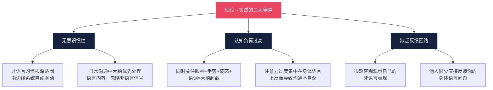
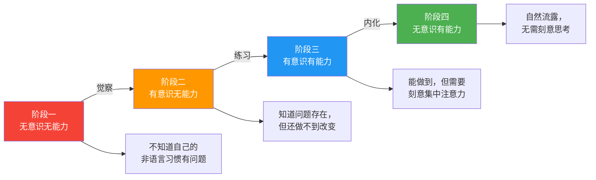
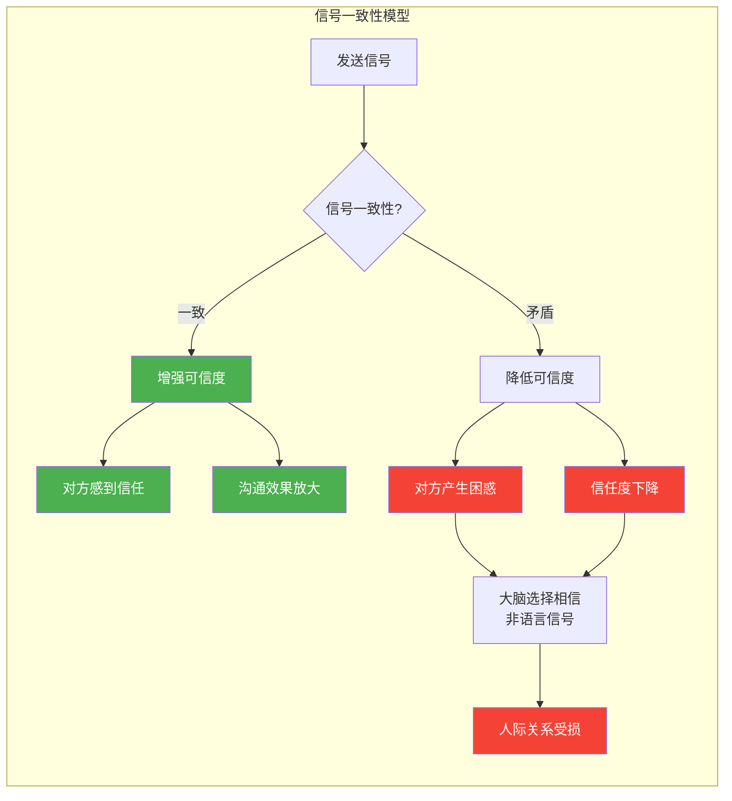
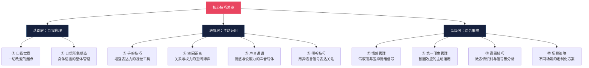
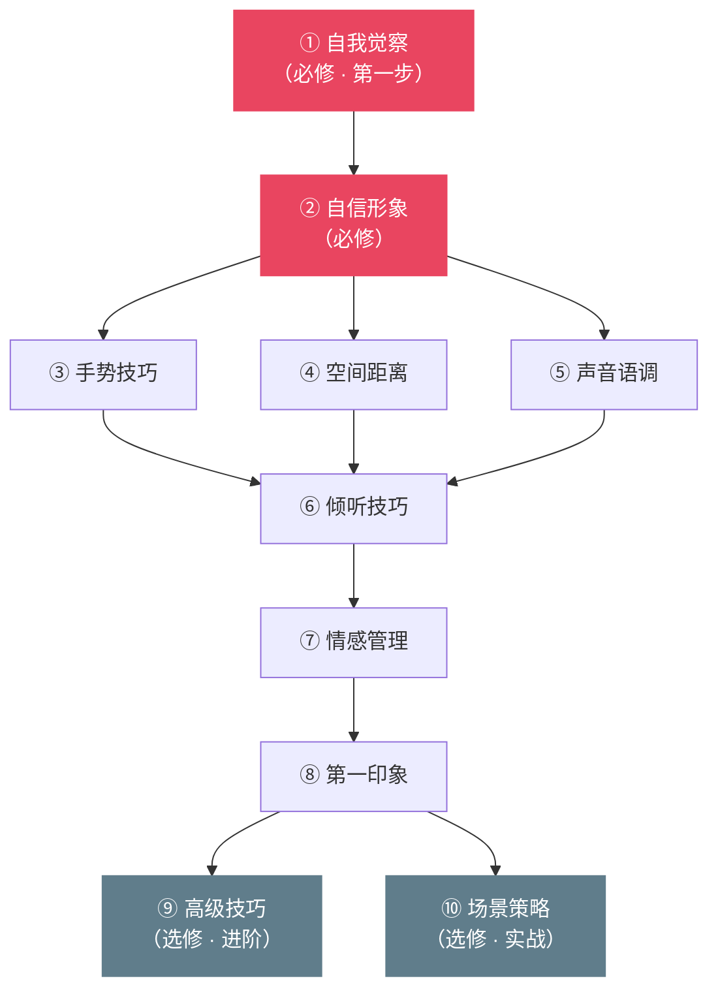

## 引言：从理论到实践

在"理论基础"部分，我们系统地学习了非语言沟通的九大要素——身体语言、面部表情、眼神接触、手势、姿态、空间距离、触摸、声音语调和外貌着装——各自的科学原理、神经机制和文化差异。你已经知道微表情为什么会泄露真实情感，知道了镜像神经元如何驱动共情反应，知道了霍尔的四区域空间模型如何描述人际距离的文化差异。

但理论知识和实际运用之间，存在一条巨大的鸿沟。

### 知道不等于做到：理论与实践的鸿沟

想象你读完了一本关于游泳的教科书。你理解了浮力原理、掌握了四种泳姿的力学分析、能背出每个动作的标准角度。但当你第一次跳进泳池时，你依然会呛水。非语言沟通也是如此——**认知层面的"知道"和行为层面的"做到"之间，隔着一条需要用刻意练习才能跨越的鸿沟。**

这条鸿沟的本质是什么？三个核心障碍：

**第一个障碍：无意识惯性。** 你的非语言习惯——比如紧张时交叉双臂、说谎时摸鼻子、无聊时身体后仰——是在数十年的社交互动中被无意识地塑造的。它们由大脑的边缘系统（特别是杏仁核和基底神经节）自动驱动，就像呼吸和心跳一样，不需要你的意识参与。要改变这些习惯，你需要把它们从"自动驾驶"模式切换到"手动控制"模式——这正是"自我觉察"要解决的问题。

**第二个障碍：认知负荷过高。** 如果你试图在一次对话中同时控制眼神接触、手势幅度、身体朝向、语速音调、面部表情和空间距离，你的大脑会迅速超载。研究表明，工作记忆的容量限制在 4±1 个信息组块（Cowan, 2001）。试图同时管理 6-7 个非语言通道，不仅不可能，而且会适得其反——你会变得僵硬、不自然，反而给对方传递出"紧张""做作"的负面信号。

解决方案是什么？**分阶段、分要素地刻意练习，直到每个技巧内化为自动化习惯，然后才能腾出认知资源去关注下一个要素。** 这就像学开车：新手需要同时关注方向盘、油门、刹车、后视镜、路标，手忙脚乱；但当你开了几千公里之后，这些操作变成了肌肉记忆，你甚至可以一边开车一边聊天。

**第三个障碍：缺乏反馈回路。** 你能听到自己说的话，但你看不到自己说话时的表情。你能感受到自己的紧张，但你不知道紧张在别人眼中是什么样子。这种"盲区"使得非语言沟通的自我改进格外困难。你必须借助外部工具（录像、镜子）和外部反馈（信任的朋友、专业教练）来打破这个盲区。

### 从觉察到内化的四阶段模型

非语言沟通能力的提升不是一蹴而就的，它遵循一个从刻意控制到自然流露的渐进过程。心理学家将这种技能习得过程称为"从无意识无能力到无意识有能力"的四阶段模型（源自 Noel Burch 的"意识能力四阶段"理论）：

| 阶段 | 状态 | 典型体验 | 建议策略 |
|------|------|----------|----------|
| 无意识无能力 | 不知道自己有问题 | "我觉得我挺正常的啊" | 录像回看、寻求反馈 |
| 有意识无能力 | 看到问题但改不了 | "我知道我总驼背，但就是改不过来" | 聚焦单一要素，持续小量练习 |
| 有意识有能力 | 能做到但需要专注 | "我提醒自己注意了，这次做到了" | 在真实场景中反复应用 |
| 无意识有能力 | 自然流露无需思考 | "我已经不记得自己是什么时候学会的" | 保持觉察，持续精进 |

大多数人停留在"无意识无能力"阶段——他们根本不知道自己的非语言习惯正在传递什么样的信号。读完理论基础部分，你已经进入了"有意识无能力"阶段：你知道了问题的存在，但还不知道如何系统地改变。本节的全部使命，就是带你从"有意识无能力"出发，经过"有意识有能力"，最终抵达"无意识有能力"——让优秀的非语言沟通成为你的本能。

### 信号一致性：贯穿所有技巧的元原则

在展开具体技巧之前，有一个"元原则"必须先建立起来，因为它贯穿本节的每一个技巧：**信号一致性原则**。

非语言沟通不是九个独立的频道，而是一个交响乐团。当所有乐器演奏同一个旋律时，音乐是和谐的、动人的、有说服力的。但当小提琴拉 A 调、长笛吹 B 调、定音鼓敲 C 调时，听众只会感到刺耳的噪音。

非语言信号也是如此。如果你的语言说"我很自信"，但你的声音在发抖、你的双手在交叉、你的眼神在躲避——对方接收到的不是"自信"，而是一团混乱的、不可信的信号。心理学研究将这种现象称为**"非语言泄漏"（nonverbal leakage）**：当一个人的真实情感与表达意图不一致时，真实情感会通过各种非语言通道"泄漏"出来。

信号一致性包含三个维度：

1. **跨通道一致性**——你的眼神、表情、手势、姿态、语调传递的是同一个信息吗？
2. **语言-非语言一致性**——你说的话和你的身体语言匹配吗？
3. **时间一致性**——你现在的信号和前一分钟的信号一致吗？还是突然出现了不合理的转变？

保持一致性不是要求你每时每刻都完美控制所有通道。实际上，刻意追求"所有通道同步"反而会导致僵硬和不自然。真正的目标是：**确保你的真实情感和你的沟通意图一致，这样你的非语言信号就会自然而然地与你的语言保持同步。**

这也是为什么"自我觉察"被放在所有技巧之前——只有当你清楚地知道自己在传递什么信号时，你才有能力去管理这些信号的一致性。

### 本节内容导航：十大核心技巧的逻辑架构

本节共包含十个核心技巧模块，它们按照**从内到外、从基础到高级**的逻辑层层递进：

下面是每个模块的简要介绍，帮助你在进入详细学习之前建立整体认知：

**模块一：自我觉察——一切改变的起点**

这是整个技巧体系的地基。你无法改变你看不到的东西。这个模块教你如何建立自己的"非语言档案"——通过录像回看、系统化自我观察清单和外部反馈，全面了解自己的非语言习惯模式。你将学会识别自己的"基线行为"（正常状态下的默认模式），这是后续所有信号识别和管理的前提。没有自我觉察，所有其他技巧都只是空中楼阁。

**模块二：塑造自信的非语言形象**

自信不是一种感觉，而是一套可以被观察和测量的非语言信号。这个模块聚焦于身体语言的整体管理——从站姿、坐姿到行走方式，从开放性姿态到权力姿态。你将学到艾米·卡迪（Amy Cuddy）关于"姿势影响心理状态"的研究成果，以及如何通过调整身体姿态来同时影响自己的内在感受和他人的外在印象。这不是"假装自信"，而是"通过身体触发心理状态的真实改变"。

**模块三：增强表达力的手势技巧**

手势是人类最古老的语言。在语言出现之前，我们的祖先就用手势来描述猎物的位置、表达威胁的等级、协调集体行动。这个模块将教你三类核心手势：说明性手势（帮助听众理解抽象概念）、象征性手势（传递特定文化含义）和调节性手势（控制对话节奏）。你将学到手势使用的"黄金区域"（肚脐到肩膀之间的空间）、手势与语言的同步时机，以及如何避免分散注意力的无意义手势。

**模块四：空间距离的策略性运用**

爱德华·霍尔在 1966 年提出的"空间关系学"揭示了一个深刻的事实：你与他人之间的物理距离，本身就是一种强大的沟通信号。这个模块将深入讲解霍尔的四区域模型（亲密距离、个人距离、社交距离、公共距离），以及如何策略性地运用空间距离来建立亲密感、传递权威、表达尊重或设定边界。你还将学到"领地行为"在职场和社交中的微妙运用。

**模块五：声音语调的精妙运用**

梅拉比安的研究表明，在情感和态度传递中，声音语调的影响力是语言内容的五倍以上。这个模块将教你如何有意识地控制声音的四大维度：音量（传递自信或亲密）、音调（传递情感或权威）、语速（传递紧迫或从容）、停顿（传递深思或强调）。你将学到为什么在关键信息前加入 2 秒停顿能让信息的记忆率提高 40%，以及如何通过"声音下沉"来传递权威感。

**模块六：倾听中的非语言技巧**

大多数人认为沟通的重点是"怎么说"，但研究表明，高效的沟通者把更多精力放在"怎么听"上。这个模块聚焦于倾听时的非语言信号——点头的时机和频率、身体前倾的角度、眼神接触的节奏、表情的同步反应。你将学到"积极倾听"的非语言编码系统，以及如何通过镜像神经元机制来建立情感共鸣。这些技巧不仅让你成为更好的倾听者，也让你在对话中获得更多有价值的信息。

**模块七：情感管理的非语言策略**

情绪不是你的敌人，但失控的情绪信号可能是。这个模块教你如何识别、接纳和策略性地管理自己的情感表达——不是压抑情绪（压抑会导致更多的非语言泄漏），而是通过认知重评、呼吸调节和身体姿态调整来"驾驭"情绪。你还将学到在高压场景（冲突、批评、危机）中保持非语言镇定的具体技术，以及如何用非语言信号来缓和紧张气氛。

**模块八：第一印象管理**

人们在初次见面的前 7 秒内就会形成对你的基本判断，而这个判断有 80% 以上基于非语言信号。这个模块将教你首因效应（primacy effect）的心理学机制，以及如何在握手、微笑、眼神接触、站姿和着装等关键节点上塑造积极的第一印象。你还将学到"薄片判断"（thin-slicing）理论——为什么极短时间内的非语言信号就能做出相当准确的人格推断，以及如何利用这一规律来优化你的初次亮相。

**模块九：非语言沟通的高级技巧**

这是为已经掌握基础技巧的进阶学习者准备的模块。你将学到微表情识别（保罗·埃克曼的 FACS 系统的实用版本）、信号簇分析（如何通过多个信号的组合模式来判断真实意图）、基线偏差检测（如何建立对方的"正常行为基线"并识别偏离）、以及"冷读术"中的非语言观察技巧。这些技巧不是"读心术"，而是基于行为科学的系统化观察方法。

**模块十：不同场景的非语言策略**

不同的沟通场景需要不同的非语言策略。在求职面试中，你需要传递自信和能力；在商务谈判中，你需要同时传递合作意愿和坚定立场；在亲密关系中，你需要传递温暖和安全感；在跨文化场景中，你需要避免非语言禁忌。这个模块将为你提供一套"场景适配"框架，教你在每种关键场景中如何调整你的非语言策略。

### 学习路径建议

这十个模块不是孤立的，而是一个有机的整体。建议你按照以下路径学习：

**必修路径（按顺序）：** ①→②→③/④/⑤（可并行）→⑥→⑦→⑧

这是非语言沟通能力的主干道。自我觉察是地基，自信形象是框架，手势/空间/声音是三个核心技能支柱，倾听是互动中的应用，情感管理是高级控制，第一印象是综合产出。

**进阶选修（可按需选择）：** ⑨和⑩

高级技巧适合已经熟练掌握基础模块的学习者；场景策略则适合有特定应用场景需求的读者（比如即将参加重要面试、即将进行商业谈判等）。

**一个重要提醒：** 不要试图一次性学完所有模块然后一次性改变所有习惯。认知科学的研究反复证明，**聚焦单一目标的分散练习（每天练习一个技巧，持续 21 天）远比同时追求多个目标的集中突击更有效。** 选择一个你最需要提升的模块开始，让它变成你的肌肉记忆，然后再进入下一个。

### 准备好开始了吗？

从下一节"自我觉察：一切改变的起点"开始，你将正式踏上从理论到实践的转化之旅。记住这三句话：

1. **觉察先于改变**——你无法改变你看不到的东西，所以第一步永远是"看到自己"
2. **一致性胜过完美**——与其在每个维度上都做到 60 分，不如先在一个维度上做到 90 分
3. **练习创造本能**——所有看起来"天生自信"的人，都经历过无数次有意识的练习

让我们开始。

***
