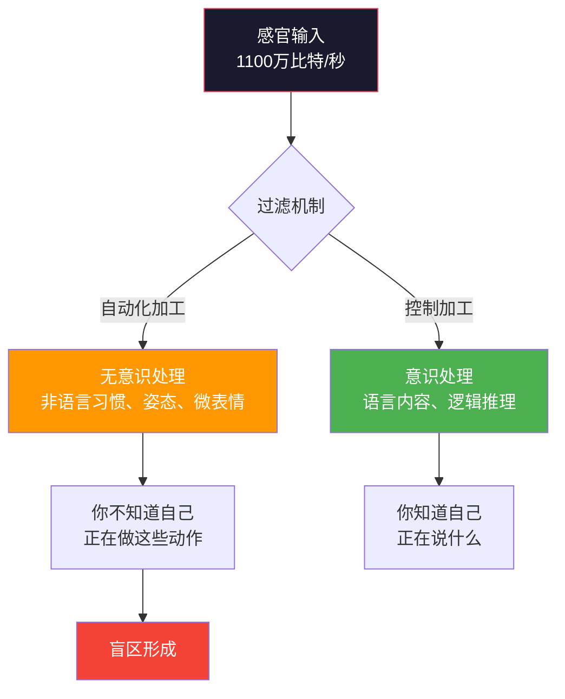
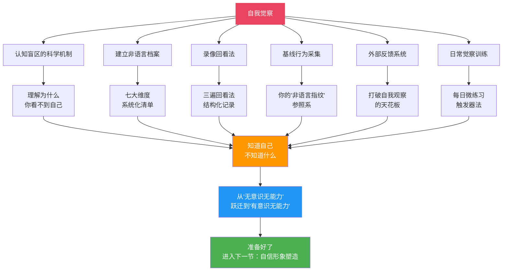

## 一、自我觉察：一切改变的起点

> "未经审视的人生不值得过。" ——苏格拉底
>
> 这句话放在非语言沟通领域同样成立：**未经觉察的身体语言，是你最大的隐形负债。** 你以为自己在传递"自信"，对方接收到的却是"紧张"；你以为自己在表达"友善"，对方感受到的却是"疏远"。这种认知偏差的根源只有一个——你从未真正"看见"过自己。

自我觉察是整个非语言沟通技巧体系的地基。在"引言"中我们讲过四阶段模型——从"无意识无能力"到"无意识有能力"——而自我觉察正是从第一阶段跃迁到第二阶段的那一步。你无法改变你看不到的东西。在学习任何具体技巧（手势、眼神、空间距离）之前，你必须先建立一份关于自己的精确"地图"。

本节将从心理学理论出发，建立自我觉察的完整方法论，包括：为什么觉察如此困难（认知盲区的科学机制）、如何系统化地建立"非语言档案"、如何利用工具突破自我观察的局限、以及如何设计一个可持续的觉察练习系统。

### 1.1 为什么自我觉察如此困难？——认知盲区的科学机制

在展开方法之前，必须先理解一个关键问题：**为什么我们对自己的非语言行为如此缺乏觉察？** 这不是因为懒惰或粗心，而是由大脑的运作机制决定的。

#### 1.1.1 无意识自动化的神经机制

人类大脑每秒接收约 1100 万比特的感官信息，但意识层面只能处理约 50 比特（Zimmerman, 1989）。为了应对这种巨大的信息不对称，大脑将大量行为模式"编译"为无意识的自动程序——心理学称之为**"自动化加工"（automatic processing）**。

你的非语言习惯就属于这种自动化加工。你不需要刻意思考"现在我要抬起左眉毛""现在我要交叉双臂"，这些动作由大脑的基底神经节（basal ganglia）自动执行，就像你不需要思考"现在我要迈左脚"一样。问题是：**正因为这些行为是自动的，你几乎意识不到它们的存在。**

#### 1.1.2 "非语言盲"现象

心理学家将这种对自身非语言行为缺乏觉察的状态称为**"非语言盲"（nonverbal blindness）**。研究发现：

- **约 70% 的人无法准确描述自己在对话中的眼神接触模式**——他们要么高估（"我一直看着对方"），要么低估（"我很少看对方"），与录像回放的实际数据偏差超过 40%
- **人们对自己语速的感知误差平均在 30% 左右**——觉得自己说得"正常"的人，实际语速可能偏快或偏慢 20-30%
- **超过 80% 的人不知道自己的"默认面部表情"是什么**——他们以为自己面无表情，实际上可能微微皱眉（这被称为"静息面部表情"或 resting face）

这不是个人缺陷，而是人类认知的普遍局限。就像你听不到自己的口音一样，你的大脑自动"编辑"了对自身行为的感知，只保留了一个高度简化的、常常失真的"自我概念"。

#### 1.1.3 达克效应在非语言沟通中的表现

心理学中的**达克效应（Dunning-Kruger Effect）** 在非语言沟通领域同样存在：非语言能力最差的人，往往对自己的能力评价最高。原因在于，判断"什么是好的非语言沟通"本身就需要一定的专业知识——如果你不知道什么是"真诚的微笑"（杜兴微笑），你就无法判断自己的微笑是否真诚。

这意味着：**"我觉得我没什么问题"恰恰可能是最需要自我觉察的信号。**

### 1.2 建立你的"非语言档案"

提升非语言沟通的第一步是全面了解自己。你需要建立一份关于自己非语言习惯的系统化"档案"——这不是随便想想就行的，而是需要结构化、可记录、可追踪的完整画像。

#### 1.2.1 自我观察清单（七大维度）

以下清单覆盖了非语言沟通的核心维度。逐一回答，不要跳过任何一项——每一项都对应一个可能被你忽略的信号通道。

**维度一：身体姿态**

| 观察项 | 自我评估 | 录像验证 |
|--------|----------|----------|
| 站立时，我习惯性地驼背、挺直还是微微后仰？ | | |
| 坐着时，我的双腿怎么放？交叉、并拢还是分开？ | | |
| 我坐着时是否经常交叉双臂？在什么情境下？ | | |
| 我的身体重心通常偏向哪一侧？ | | |
| 在对话中，我的身体朝向对方还是偏向一侧？ | | |
| 我坐着时是否习惯占据较多空间（如展开手臂）？ | | |

**维度二：手势习惯**

| 观察项 | 自我评估 | 录像验证 |
|--------|----------|----------|
| 我说话时常用哪些手势？（列举 3-5 个） | | |
| 我有没有无意识的小动作？（摸鼻子、摆弄笔、摸耳朵、搓手指） | | |
| 我的手势主要在哪个区域活动？（腰部以下/腰部到肩膀/肩膀以上） | | |
| 我的手势幅度是偏大还是偏小？ | | |
| 我在紧张时手会放在哪里？ | | |
| 我说话时手势与语言是否同步？ | | |

**维度三：眼神模式**

| 观察项 | 自我评估 | 录像验证 |
|--------|----------|----------|
| 我在对话中保持眼神接触的比例大约是多少？ | | |
| 我习惯看对方的哪个部位？（左眼/右眼/嘴巴/额头/其他） | | |
| 当我说话时和倾听时，眼神接触的频率是否不同？ | | |
| 我在思考时眼神会移开吗？移向哪个方向？ | | |
| 面对权威人物时，我的眼神接触是否减少？ | | |
| 我在群体场景中如何分配目光？ | | |

**维度四：面部表情**

| 观察项 | 自我评估 | 录像验证 |
|--------|----------|----------|
| 我的"默认表情"（静息表情）是什么？微笑/面无表情/微皱眉？ | | |
| 当我不同意对方观点时，面部会有什么反应？ | | |
| 我在倾听时的表情是专注、困惑还是无聊？ | | |
| 我的微笑是"杜兴微笑"（眼角有鱼尾纹）还是"社交微笑"（只有嘴角）？ | | |
| 当我紧张或不适时，面部会出现什么微表情？ | | |

**维度五：声音特征**

| 观察项 | 自我评估 | 录像验证 |
|--------|----------|----------|
| 我的语速是快、中还是慢？ | | |
| 我的音量是偏大还是偏小？ | | |
| 我的音调是偏高还是偏低？在紧张时会变化吗？ | | |
| 我是否频繁使用填充词（"嗯""啊""那个""就是"）？ | | |
| 我在句尾是否习惯性升调（让陈述句听起来像疑问句）？ | | |
| 我的停顿习惯如何？是频繁停顿还是很少停顿？ | | |

**维度六：空间距离**

| 观察项 | 自我评估 | 录像验证 |
|--------|----------|----------|
| 我与陌生人交谈时通常保持多远的距离？ | | |
| 面对不同关系的人（同事/朋友/亲密伴侣），我的距离是否有调整？ | | |
| 当别人靠近我时，我是否会本能地后退？ | | |
| 我在社交场合中是否倾向于靠近墙壁/角落？ | | |

**维度七：着装与外貌**

| 观察项 | 自我评估 | 录像验证 |
|--------|----------|----------|
| 我的日常着装传递什么样的信息？ | | |
| 我的着装是否与我的沟通目标一致？ | | |
| 我是否根据场合调整着装？ | | |

#### 1.2.2 如何使用这份清单

这份清单的使用分为三个阶段：

**阶段一：直觉填写（15 分钟）。** 凭第一感觉快速填写"自我评估"列。不要花太多时间思考——你的直觉反映的是你的"自我概念"，这本身就是一个重要的数据点。

**阶段二：录像验证（30-60 分钟）。** 按照 1.3 节的方法录制视频，然后回看填写"录像验证"列。重点关注自我评估与录像观察之间的差异——**这些差异就是你的盲区所在。**

**阶段三：差异分析。** 对比两列数据，识别出偏差最大的项目。这些项目就是你最需要优先改善的方向。例如，如果你以为自己"一直看着对方"，但录像显示你有 60% 的时间在看桌面，那眼神接触就是你的首要改善目标。

### 1.3 录像回看法：最强大的自我觉察工具

录像回看是自我觉察的"金标准"工具。原因很简单：**摄像机没有认知偏差。** 它不会美化你的行为，不会给你的小动作找借口，它只是忠实地记录你的一举一动。

#### 1.3.1 录制前的准备

**设备：** 一部手机即可。将手机固定在支架上（不要手持），确保画面能包含你的上半身（腰部以上）。横屏录制效果更好。

**场景设计：** 录制三种典型场景，每种 3-5 分钟：

| 场景 | 目的 | 具体做法 |
|------|------|----------|
| 模拟演讲 | 观察你在"主动输出"时的非语言表现 | 准备一个 3 分钟的话题，面对镜头进行一段完整表达 |
| 模拟面试 | 观察你在"高压应对"时的非语言表现 | 请朋友或家人扮演面试官，提 3-5 个常见面试问题 |
| 日常对话 | 观察你在"自然互动"时的非语言表现 | 与朋友进行一次 5 分钟的普通聊天，提前征得对方同意录制 |

**关键提醒：** 不要因为知道在被录制就刻意调整行为。目标是看到"真实的你"，而不是"表演的你"。如果第一次录制时你很不自然，隔天再录一次——大多数人第二次就会放松下来。

#### 1.3.2 三遍回看法

录制完成后，不要只看一遍。**每一遍聚焦不同的维度**，这样才能全面、深入地觉察：

**第一遍：关掉声音，只看画面。** 这一遍专门观察视觉通道的非语言信号。

观察要点清单：

- 你的整体姿态是什么样的？开放（身体展开）还是封闭（身体收缩）？
- 你的手势在哪里活动？幅度如何？频率如何？
- 你的眼神接触模式如何？多久看一次对方/镜头？每次持续多长时间？
- 你的面部表情是什么？有无无意识的微表情（皱眉、撇嘴、眨眼频率）？
- 你的身体是否有无意识的摆动、摇晃或小动作？
- 你紧张时出现了什么特定的身体反应？

**第二遍：闭上画面（或遮住屏幕），只听声音。** 这一遍专门听觉通道的非语言信号。

观察要点清单：

- 你的语速在整段对话中是否均匀？有没有在某些地方突然加快或放慢？
- 你的音量变化如何？有没有某些词明显更大声或更小声？
- 你的音调（pitch）变化范围如何？是单调还是有起伏？
- 你使用了多少填充词？在哪些情境下更容易出现？
- 你的停顿模式如何？是句间停顿还是句中停顿？停顿时长是否合适？
- 你的呼吸声是否能被听到？（这通常是语速过快或紧张的信号）

**第三遍：音画同步，综合观看。** 这一遍关注语言和非语言信号的一致性。

观察要点清单：

- 你的语言内容和你的面部表情是否匹配？（比如说"很高兴"时脸上有没有笑意？）
- 你的手势和你的语言节奏是否同步？（手势是在关键词之前、同时还是之后出现？）
- 你在说到重要信息时，身体语言有没有变化？（前倾、强调手势、音量提升？）
- 你的整体形象是否传达出你想要传达的信息？

#### 1.3.3 录像分析记录表

每次回看后，使用以下模板进行结构化记录：

【录像分析记录】
日期：___________ 场景：___________ 时长：___________

【视觉通道（第一遍）】
整体印象（一句话）：________________________
最突出的优点：________________________
最需要改进的点：________________________
具体问题1：________________________
具体问题2：________________________
具体问题3：________________________

【声音通道（第二遍）】
整体印象（一句话）：________________________
语速评估：□偏快 □适中 □偏慢
音量评估：□偏大 □适中 □偏小
填充词频率：□频繁 □偶尔 □几乎没有
最需要改进的点：________________________

【一致性分析（第三遍）】
语言-表情一致性：□高度一致 □基本一致 □有矛盾
语言-手势同步性：□高度同步 □基本同步 □不同步
语言-语调匹配度：□高度匹配 □基本匹配 □不匹配
最突出的不一致点：________________________

【行动计划】
下周重点改善的1个点：________________________
具体改善方法：________________________

### 1.4 基线行为：你的"非语言指纹"

在后续的高级技巧（如微表情识别、信号簇分析）中，你会频繁用到一个核心概念——**"基线行为"（baseline behavior）**。这个概念不仅适用于观察他人，更始于观察自己。

#### 1.4.1 什么是基线行为？

基线行为是指一个人在**放松、自然、无压力**状态下的非语言行为模式。它是这个人的"默认设置"——每个人的基线行为都不同，就像指纹一样独特。

举例说明：

- A 君在放松时语速偏慢、手势少、眼神接触频率中等——这是他的基线
- B 君在放松时语速偏快、手势丰富、眼神接触频繁——这是她的基线

如果某天 A 君突然变得语速飞快、手势增多，这不是因为他"学了新技巧"，而很可能是因为他处于压力、兴奋或焦虑状态——他的行为偏离了基线。**只有建立基线，你才能识别偏离。**

#### 1.4.2 如何建立自己的基线档案

基线采集的关键条件是**放松和自然**。以下是推荐的采集方法：

**方法一：独处录制法。** 一个人在家中，录下自己随意打电话、自言自语整理思路、或者和家人轻松聊天的片段。这些场景下你最放松，行为最接近基线。

**方法二：高频日常观察法。** 连续一周，每天选择 3 个无压力的日常互动（如和同事闲聊、点咖啡、和朋友发语音），事后回忆并记录自己在这些互动中的非语言行为。

**方法三：信任他人协助法。** 请一位你信任的、经常和你互动的人（伴侣、密友、长期同事），用以下问卷描述你在放松状态下的行为：

【他人视角：基线行为问卷】

当TA放松、自然地说话时，请描述：

1. TA的语速通常是：□偏快 □中等 □偏慢
2. TA的手势通常是：□很多 □适中 □很少
3. TA的眼神接触通常是：□频繁 □适中 □较少
4. TA的坐姿/站姿通常是：□前倾 □直立 □后仰
5. TA的默认面部表情像是：□微笑 □平静 □严肃
6. TA在放松时有没有什么习惯性小动作？
   ________________________________
7. TA的声音特点（音调高低、音量大小、语调起伏）：
   ________________________________

将这些信息汇总后，你就拥有了一份初步的基线档案。它的格式不重要，重要的是你开始有了一个"参照系"——你知道了"正常的我"是什么样的，才能在后续觉察到"异常的我"。

### 1.5 寻求外部反馈：打破自我观察的天花板

自我观察存在天然的局限。无论你的录像回看法多么系统，你都缺少一个关键维度：**你的非语言信号在别人眼中是什么效果？** 你以为自己在传递"从容"，对方可能接收到的是"冷淡"。这种"接收端"的信息，只有通过外部反馈才能获得。

#### 1.5.1 三种外部反馈来源

| 反馈来源 | 优势 | 局限 | 适用场景 |
|----------|------|------|----------|
| 信任的朋友/家人 | 了解你的真实习惯，反馈直接 | 可能因为关系好而不够客观 | 日常习惯的初步觉察 |
| 专业沟通教练 | 专业评估，能指出你意识不到的问题 | 需要经济投入 | 重要场合前的专项提升（演讲、面试） |
| 同伴学习小组 | 多角度反馈，互相促进 | 需要组建和维护 | 持续性的系统提升 |

#### 1.5.2 如何有效地请求反馈

大多数人即使被问到"我有什么非语言习惯？"，也只会说"没有啊""挺好的"。这不是因为他们不真诚，而是因为他们不知道该怎么观察和描述。你需要给反馈者提供**结构化的观察框架**：

**给朋友的反馈请求模板：**

我想请你帮我观察一件事。下次我们聊天的时候（大约10-15分钟），
请你特别注意以下几个方面，然后告诉我你的观察：

1. 【眼神】我有没有一直看着你？还是经常看别处？大概多少比例的时间在看你？
2. 【表情】我的表情看起来是什么感觉？友好？严肃？面无表情？
3. 【姿态】我坐着/站着的时候给你什么感觉？放松？紧绷？有距离感？
4. 【手势】我说话时手在干什么？有没有什么反复出现的小动作？
5. 【声音】我说话给你什么感觉？语速快还是慢？音量合适吗？有没有什么口头禅？
6. 【距离】我跟你之间的距离感觉合适吗？太近还是太远？
7. 【总体印象】如果用三个词来形容我刚才的非语言表现，你会用哪三个词？

请尽量如实告诉我，不用客气。我是在做自我提升练习，你的坦诚对我最有帮助。

这个模板的关键在于：**它把模糊的"你觉得我怎么样"变成了具体的观察任务，让反馈者知道看什么、怎么说。**

#### 1.5.3 如何处理反馈

收到反馈后，遵循以下原则：

**原则一：先接收，后评估。** 不要在别人反馈时立刻解释或辩护——"我不是那样的""是因为今天太累了"。先完整地听完，记录下来，之后再分析。

**原则二：关注模式，而非单点。** 如果一个人说你"有时会皱眉"，这可能是偶然。如果三个人都说你"经常皱眉"，这就是一个需要关注的模式。

**原则三：区分内容和感受。** 反馈有两种类型——"你做了什么"（内容）和"你让我感觉如何"（感受）。两者都有价值，但后者往往更有信息量。"你交叉双臂"是内容，"你让我觉得你不太想聊天"是感受。后者告诉你的是你的非语言信号实际产生的**效果**。

**原则四：建立反馈追踪表。** 将不同时期、不同来源的反馈汇总到一张表中，追踪你的改善进度。

【反馈追踪表】
日期：_________ 反馈者：_________ 场景：_________

收到的反馈要点：
1. ________________________________
2. ________________________________
3. ________________________________

与上次反馈对比的变化：
________________________________
________________________________

下一步改善方向：
________________________________

### 1.6 日常觉察训练系统

录像回看和外部反馈是"重型"觉察工具，适合每周使用一次。但自我觉察真正产生质变，靠的是**日常的微练习**——把觉察变成一种习惯，而不是一次性的活动。

#### 1.6.1 "每日一觉"微练习

每天选择一个"觉察锚点"（当天关注的非语言维度），在日常互动中有意识地观察自己。以下是 7 天的示范计划：

| 天数 | 觉察锚点 | 具体任务 |
|------|----------|----------|
| 第 1 天 | 眼神接触 | 今天的每次对话中，注意自己看对方的时间占比 |
| 第 2 天 | 手势 | 今天的对话中，观察自己说话时双手在做什么 |
| 第 3 天 | 姿态 | 今天开会/上课时，每隔 15 分钟扫描一次自己的坐姿 |
| 第 4 天 | 声音 | 今天录下一段自己打的电话（或发的语音消息），回听一次 |
| 第 5 天 | 表情 | 今天在镜子前进行日常对话练习，观察自己的面部反应 |
| 第 6 天 | 距离 | 今天注意自己与不同人交谈时的距离变化 |
| 第 7 天 | 综合 | 今天进行一次完整的"三通道扫描"——视觉、声音、空间 |

**每次觉察只需 30 秒到 1 分钟，关键是每天坚持。** 21 天后，你会发现自己对自身非语言行为的感知力显著提升。

#### 1.6.2 "触发器"觉察法

在你的日常环境中设置几个"触发器"，每次看到它们就自动进行一次非语言扫描：

- **手机解锁时**——扫描自己当前的姿态：是驼背还是挺直？
- **推开任何一扇门之前**——调整自己的面部表情：是紧绷还是放松？
- **每次坐下时**——检查自己的身体语言：是开放还是封闭？
- **每次站起来时**——感受自己的整体状态：是紧绷还是舒展？

这些触发器的作用是将觉察"嵌入"你的日常流程中，让你不需要额外花时间，就能持续积累自我认知。

#### 1.6.3 "对比观察"进阶练习

当你对基础觉察已经比较熟练之后，可以进行更高阶的对比观察练习：

**练习一：同一个你，不同场景。** 观察自己在不同场景中的非语言行为差异——和老板聊天 vs 和朋友聊天，正式会议 vs 闲聊。这些差异揭示了你的"场景适应模式"，也暴露了你在某些场景下的不适应。

**练习二：同一个场景，不同时期。** 每月进行一次相同场景的录像（如每月录一次 3 分钟的模拟演讲），对比前后的变化。这是追踪进步最客观的方式。

**练习三：意图 vs 效果。** 在一次对话结束后，记录你的"意图"（"我刚才想表达热情/自信/关心"），然后请对方描述他接收到的感受。对比两者的差异，这就是你需要弥合的"意图-效果鸿沟"。

### 1.7 常见的觉察误区

在自我觉察的过程中，有几个常见的陷阱会阻碍你的进步：

#### 误区一：觉察等于自我批评

很多人在回看自己的录像时，第一反应是"天哪，我怎么这么差"。这种自我批评不仅无益，而且有害——它会让你产生焦虑，而焦虑本身就是非语言泄漏的主要来源之一。

**正确做法：** 把觉察当作"科学研究"而非"道德审判"。你是在收集数据，不是在判刑。客观记录"我在这个时段有 4 次皱眉"，而不是"我怎么老皱眉，太糟糕了"。

#### 误区二：一次性觉察就够了

有些人录了一次像、做了一次清单、问了一次朋友，就认为"我已经了解自己了"。但人的非语言行为是**动态变化的**——它受情绪状态、场景、对话对象、身体状况等多种因素影响。一次观察只能看到一个"快照"，无法代表全貌。

**正确做法：** 把觉察当作持续的过程。至少每月进行一次录像回看，每周进行一次反馈收集（可以是简单的"今天我表现如何"的一句话确认）。

#### 误区三：试图同时改变所有问题

当你发现自己有十几个需要改善的非语言习惯时，很容易产生"全面整改"的冲动。但正如"引言"中所说，工作记忆的容量限制在 4±1 个信息组块——试图同时关注所有方面，只会让你变得僵硬和不自然。

**正确做法：** 每次只聚焦一个改善目标。给自己 2-3 周的时间让它成为习惯，然后再转向下一个。**优先级排序的标准是"信号影响力"**——哪个习惯在社交中造成的负面影响最大，就先改哪个。

#### 误区四：忽视情境因素

"我总是驼背"和"我在老板面前总是驼背"是两个不同的问题。前者是习惯问题，后者是情境引发的状态问题（可能是紧张、不自信或权力距离的体现）。混淆这两者会导致你用错误的方法去解决。

**正确做法：** 在觉察时标注情境。不仅记录"我做了什么"，还要记录"在什么情境下做的"。这样你才能区分"无处不在的习惯"和"特定情境的反应"。

### 1.8 从觉察到改变：本节小结与下一步

**本节核心要点回顾：**

1. **你对自己的非语言行为存在系统性盲区**——这不是个人缺陷，而是大脑自动化加工机制的必然结果
2. **建立"非语言档案"**是打破盲区的第一步——使用七大维度的系统化清单，配合录像验证
3. **录像回看法**是最强大的觉察工具——三遍回看（画面→声音→综合），每次都用结构化记录表
4. **基线行为**是你的"非语言指纹"——先建立参照系，才能识别偏离
5. **外部反馈**突破自我观察的天花板——用结构化模板请求反馈，关注模式而非单点
6. **日常觉察训练**让觉察成为习惯——"每日一觉"微练习 + 触发器法 + 对比观察
7. **每次只聚焦一个改善目标**——避免认知超载，让改变可持续

**下一步行动：**

完成本节的读者，已经从"无意识无能力"跃迁到了"有意识无能力"阶段——你知道了自己的非语言习惯是什么样的，知道了哪些需要改善。下一节"塑造自信的非语言形象"将教你第一个具体的改善方向：如何通过身体语言的整体管理，塑造出自信、开放、有影响力的非语言形象。

在进入下一节之前，建议你完成以下作业：

1. ✅ 完成七大维度的自我观察清单（直觉填写 + 录像验证）
2. ✅ 录制至少一段视频并进行三遍回看
3. ✅ 请一位信任的人填写基线行为问卷
4. ✅ 确定你最需要优先改善的一个非语言维度

不要跳过这些练习。**知道和做到之间的鸿沟，只能用行动来跨越。**

***
