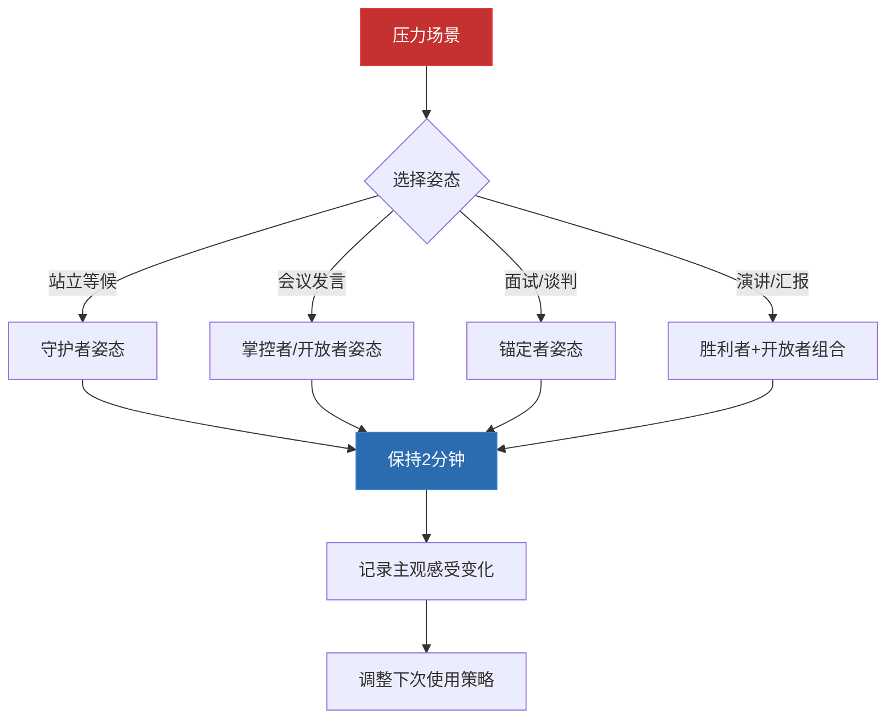
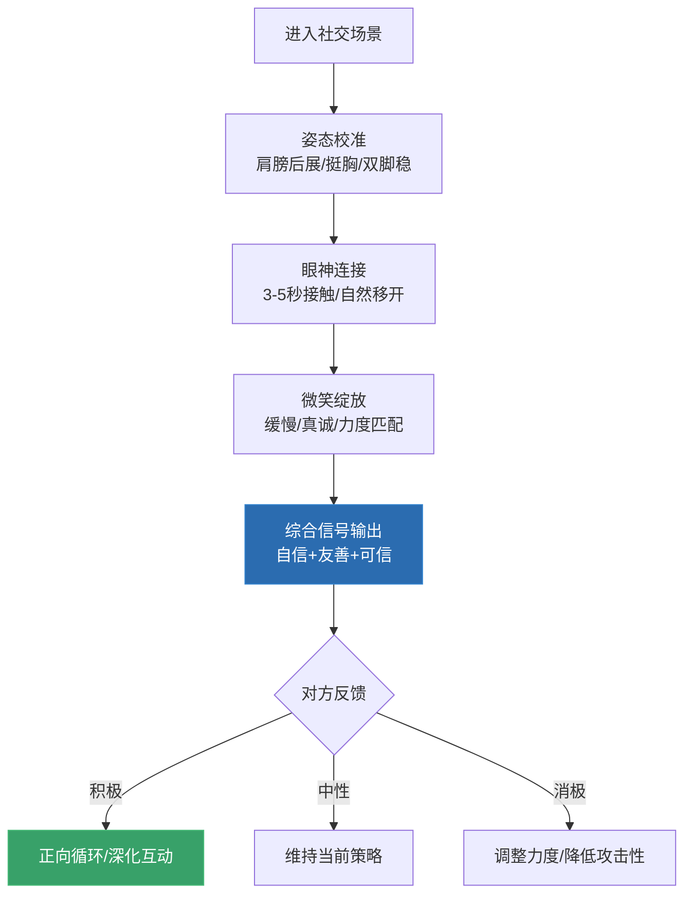

## 二、塑造自信的非语言形象

> "你的身体会改变你的思维，你的思维会改变你的行为，你的行为会改变你的结果。" ——威廉·詹姆斯

自信不是一种性格特质，而是一种**可以被设计和练习的非语言系统**。当你走进一个房间，还没开口说一个字，别人已经通过你的姿态、眼神和面部表情形成了对你的判断——这个判断在100毫秒内完成（Willis & Todorov, 2006），并且在后续接触中极难改变。

本节将从身体姿态、眼神接触和微笑三个维度，构建一个完整的"自信非语言形象"训练体系。这三个维度是日常社交中最频繁使用、影响最大的非语言通道——掌握它们，你就掌握了自信形象的核心骨架。

### 2.1 身体姿态：从"能量泄漏"到"能量封存"

姿态是非语言沟通中最基础、也最容易被忽视的维度。一个含胸驼背的人，即使内心充满自信，外界接收到的信号也是"退缩"和"低地位"。原因很简单：**大脑通过身体反馈来校准情绪状态**（embodied cognition，具身认知理论）。

#### 2.1.1 具身认知的科学基础

传统观点认为情绪决定姿态——你开心时会挺胸抬头，焦虑时会缩成一团。但20世纪90年代以来的研究揭示了一个反向路径：**姿态同样能改变情绪和激素水平**。

关键研究里程碑：

| 年份 | 研究者 | 发现 | 影响 |
|------|--------|------|------|
| 1988 | Laird | 要求被试做出微笑表情时，他们报告感到更快乐 | 具身认知的早期证据 |
| 2003 | Stepper & Strack | 坐直的被试比弯腰的被试对自己的工作更满意 | 姿态影响自我评价 |
| 2010 | Carney, Cuddy & Yap | "扩展姿态"（expansive posture）2分钟后，睾酮上升、皮质醇下降 | "权力姿势"概念的诞生 |
| 2015 | Ranehill et al. | 大样本复制研究未能重现激素变化 | 学术争议，但主观感受效应仍存在 |
| 2018 | Cuddy | 在后续回应中强调：主观"感觉强大"的效应是稳健的 | 区分生理机制和主观体验 |

**核心结论**：关于"权力姿势"是否真的改变激素水平，学术界仍有争议。但有一点是确定的——**扩展性姿态确实能让主观感受到的自信显著提升**。这意味着：即使生理机制不完全如最初研究所言，"调整姿态→感觉更好→表现更佳"这条路径依然成立。

#### 2.1.2 五种高能量姿态（详解版）

以下五种姿态经过系统整理，覆盖站姿、坐姿和动态场景。每种姿态都附带了关键要点和适用场景，而非简单罗列。

**姿态一："胜利者"姿态（The Victory Pose）**

- **动作**：双臂向上展开呈V字形，下巴微微抬起，像运动员赢得比赛后的庆祝姿势
- **要点**：手臂要完全伸展，不要半伸不伸——半伸的手臂传递的是"不确定"而非"胜利"
- **适用场景**：重要演讲前、比赛前、面试等候时。在私密空间练习2分钟
- **科学依据**：这个姿态是人类跨文化共有的"胜利"表达（Tracy & Matsumoto, 2008），先天失明的运动员在获胜后也会做出同样的动作，说明它是进化预设的

**姿态二："守护者"姿态（The Guardian / Wonder Woman）**

- **动作**：双脚分开与肩同宽，双手叉腰，挺胸抬头，目光平视
- **要点**：双脚间距不要过宽（超过肩宽会显得攻击性），双手叉腰时手肘自然外展，不要刻意夹紧
- **适用场景**：站着等候、团队站会、需要快速建立存在感的场合
- **为什么有效**：双脚分开的姿态增加了身体的支撑面积，大脑将这种稳定感解读为"安全"和"掌控"，从而降低焦虑反应

**姿态三："掌控者"姿态（The CEO / The Steeple）**

- **动作**：坐在椅子上，双手指尖对指尖形成"尖塔"状放在身前，或双手交叉放在脑后靠在椅背上
- **要点**：尖塔手势（fingertip steeple）是非语言研究中公认的"高自信"信号（Pease & Pease, 2004）。但注意：双手放在脑后的姿态在对方面前可能显得傲慢，仅适合平等或非正式场合
- **适用场景**：会议中、一对一谈话、需要展现专业自信的场景
- **重要提醒**：在跨文化场景中，双脚搭在桌上在东亚文化中被认为是极度不礼貌的行为——仅在完全私密的空间使用

**姿态四："开放者"姿态（The Orator）**

- **动作**：双臂向两侧展开，手掌向上或向外，占据更多空间
- **要点**：手掌向上是"接纳"和"坦诚"的信号（Mehrabian, 1972）。配合身体微微前倾，效果更强
- **适用场景**：演讲、汇报、需要说服他人的场景
- **常见错误**：手臂展开幅度过大、持续时间过长会显得夸张和不自然。正确做法是"脉冲式"展开——在强调重点时展开，自然收回到中性姿态

**姿态五："锚定者"姿态（The Scholar）**

- **动作**：一只手撑在桌面或讲台上，身体微微前倾，重心稳定
- **要点**：前倾的角度控制在15-20度——超过30度会显得急切，不足10度则看不出区别
- **适用场景**：会议桌前、谈判场景、需要展现从容和沉稳的场合
- **心理机制**：物理接触（手撑桌面）提供了"锚定"效应，大脑将物理稳定感映射为情绪稳定感

#### 2.1.3 日常姿态校准系统

单次练习效果有限，真正的改变来自持续的姿态校准。以下是基于行为设计理论的日常训练系统：

**第一步：基线记录（第1-3天）**

用手机在三个场景中各录一段30秒的视频：
1. 与同事聊天时
2. 打电话时（只录上半身）
3. 独自在办公室/房间时

回放时记录以下指标：

| 指标 | 差的表现 | 好的表现 |
|------|----------|----------|
| 肩膀位置 | 前倾内扣 | 自然向后打开 |
| 头部位置 | 前伸（"乌龟脖"） | 耳朵与肩膀垂直对齐 |
| 手臂位置 | 交叉抱胸或插兜 | 自然垂放或有目的地使用手势 |
| 脚的位置 | 并拢或内收 | 与肩同宽，稳定支撑 |
| 身体朝向 | 侧向或背对 | 正面对话者 |

**第二步：锚点习惯（第4-14天）**

选择一个高频触发事件作为"锚点"，每次触发时执行一次姿态校准。推荐锚点：

- **手机振动时**：收到消息的瞬间，先检查肩膀是否前倾，如有则向后打开
- **坐下时**：每次坐下后，先将臀部推到椅背，让脊柱自然挺直
- **进门时**：通过任何门框时，想象头顶有一根线向上拉，自动挺胸抬头
- **等待时**：排队或等候时，双脚与肩同宽，双手自然垂放

**第三步：压力测试（第15-21天）**

在有压力的场景中刻意使用高能量姿态：

### 2.2 眼神接触：连接的桥梁

眼神接触是所有非语言信号中**信息密度最高**的通道。在所有感官中，人类对眼睛方向的敏感度远超其他面部特征——这是进化赋予我们的"心灵理论"（Theory of Mind）能力的物理基础（Emery, 2000）。

研究显示：在对话中保持适度眼神接触的人，被认为更可信（Droney & Cooper, 1990）、更有能力（Kleinke, 1986）、更有说服力（Mehrabian & Williams, 1969）。但关键在"适度"——过少显得心虚，过多则产生威胁感。

#### 2.2.1 眼神接触的"黄金区间"

| 文化背景 | 最佳时长 | 超过此值的负面效果 |
|----------|----------|-------------------|
| 西方文化（北美/西欧） | 3-5秒 | >7秒感到压迫 |
| 东亚文化（中/日/韩） | 2-3秒 | >5秒感到不适 |
| 中东文化 | 4-6秒 | 几乎不设上限（同性之间） |
| 跨文化通用 | 2-3秒 | 保守策略，适用于所有场景 |

#### 2.2.2 四种核心技巧（详解版）

**技巧一：三角扫描法**

在对话中，你的眼神自然地在对方的**左眼—右眼—嘴巴**之间形成的三角区域内缓慢移动。这个三角区域的面积约为15平方厘米，足以提供"你在看我"的感觉，同时避免了直勾勾盯着一只眼睛的压迫感。

操作要点：
- 移动要**缓慢**，不要快速来回扫——快速扫描传递的是"紧张"和"想逃"
- 当对方说到重要内容时，将目光固定在三角区域内（不要移开），传递"我在认真听"
- 三角扫描适合一对一的近距离对话（1米以内）

**技巧二：3-5秒法则**

每次眼神接触保持3-5秒，然后**自然地短暂移开**（向下或向侧面，不要向上看——向上看传递的是"在编造"的信号），再回来继续眼神交流。

操作要点：
- 移开时保持面部朝向对方，只移开眼睛方向——这表明"我在思考你说的话"而非"我不想看你"
- 移开的时间控制在1-2秒，然后回到眼神接触
- 对方说话时：80%时间保持眼神接触，20%时间自然移开
- 你说话时：60%时间保持眼神接触，40%时间自然移开（说话时需要更多内部思考，自然减少眼神接触是正常的）

**技巧三：群体场景中的"灯塔法"**

在面对群体说话时，将你的目光像灯塔的光束一样**扫过整个群体**，在不同的听众脸上短暂停留2-3秒。

操作要点：
- 将听众区分为左、中、右三个区域，轮流覆盖
- 不要只看领导或最友善的面孔——忽略某个区域会让该区域的听众感到被忽视
- 当说到关键观点时，选择一位看起来最投入的听众，与他对视说完这句话——这会产生"一对一说服"的效果
- 避免扫视天花板、地板或后墙——这传递的是"我在背稿"

**技巧四：点头配合眼神**

在倾听时，保持眼神接触的同时配合适度的点头。

操作要点：
- 点头的频率：缓慢的点头（每3-5秒一次）传递"我在认真听，请继续"；快速的点头（连续3次以上）传递"我同意，我理解"
- 不要一直点头——变成"点头娃娃"会显得不真诚
- 眼神+点头+微笑的组合是最强的"积极倾听"信号
- 在对方停顿时，保持1秒的沉默并维持眼神接触，再开始你的回应——这1秒的"暂停"传递的是"我在消化你说的话"

#### 2.2.3 眼神接触的常见错误

| 错误行为 | 对方感知 | 纠正方法 |
|----------|----------|----------|
| 一直盯着不移开 | 威胁感、控制欲 | 遵循3-5秒法则，自然移开 |
| 完全回避眼神 | 不自信、不诚实 | 从鼻梁位置开始练习，逐步提升到眼睛 |
| 频繁看向手机/手表 | 不感兴趣、不尊重 | 将手机面朝下放入口袋 |
| 只看一个人 | 忽略其他人 | 使用灯塔法覆盖全场 |
| 眼神飘忽不定 | 紧张、不可靠 | 固定三角区域，放慢移动速度 |
| 翻白眼/斜视 | 轻蔑、不认同 | 觉察后立即纠正，保持中性或积极表情 |

### 2.3 微笑：最强大的非语言信号

微笑是非语言沟通中**性价比最高的技巧**——不需要任何道具，不需要特殊场地，随时随地都可以使用，但效果极其显著。研究显示，微笑的陌生人被评价为更可信（Todorov et al., 2005）、更友善（Ruben et al., 2018）、更有能力（Kraus & Chen, 2013）。

#### 2.3.1 微笑的科学：为什么一个表情能改变一切

微笑触发了一条双向的神经路径：

**关键实验**：Strack, Martin & Stepper（1988）的经典实验要求被试用嘴唇含住铅笔（强制"微笑"肌肉激活）或用牙齿咬住铅笔（抑制微笑），结果发现"强制微笑"组评价漫画更好笑。虽然后续的大规模复制研究（Wagenmakers et al., 2016）未能重现这一结果，但后续元分析表明，当实验条件更严格地控制时，面部反馈效应是存在的，只是效应量比最初报告的要小。

**实际意义**：微笑对情绪的提升效果是确定的，但不能期望它像魔法一样瞬间改变极端情绪。它的真正价值在于**日常的微调**——在中性情绪基础上，一个微笑可以让你更快地进入积极状态。

#### 2.3.2 杜兴微笑 vs. 社交微笑：识别与练习

并非所有微笑都传递相同的信号。心理学家将微笑分为两种基本类型：

| 特征 | 杜兴微笑（Duchenne Smile） | 社交微笑（Social Smile） |
|------|---------------------------|-------------------------|
| 涉及肌肉 | 颧大肌 + 眼轮匝肌 | 仅颧大肌 |
| 眼部变化 | 眼角出现鱼尾纹，眼睛微微眯起 | 眼部无变化，"嘴巴在笑但眼睛没笑" |
| 感知效果 | 真诚、温暖、可信赖 | 礼貌、疏远、可能虚伪 |
| 出现场景 | 由真实愉悦情绪触发 | 社交应酬、被迫场景 |
| 能否训练 | 可以通过特定练习激活 | 不需要训练 |

**杜兴微笑的训练方法：**

1. **"眼睛先行"练习**：不要从嘴巴开始微笑，而是先眯起眼睛（像在看一个可爱的小动物），然后让嘴角自然上扬。这个顺序更容易激活眼轮匝肌
2. **"回忆-激活"法**：闭眼回忆一个让你真正开心的场景——某个特别好笑的笑话、某次意外的惊喜、某个温暖的瞬间。保持这个画面5秒钟，然后睁开眼微笑。反复练习后，你可以不需要回忆也能激活同样的肌肉组合
3. **镜子反馈**：面对镜子练习，观察眼角是否有轻微的收缩。初期需要刻意，但2-3周后会变成自然反应
4. **"缓慢微笑"技巧**：微笑时不要瞬间展开，而是让微笑用1-2秒的时间缓慢地"绽放"。缓慢展开的微笑被认为比瞬间展开的微笑更真诚、更有吸引力（Mehrabian, 1972）

#### 2.3.3 微笑的战略性使用时机

不是所有场合都适合微笑。**微笑的时机和力度需要根据场景精确调整**：

**必须微笑的时刻：**

- **初次见面**：第一次眼神接触时微笑，能立即将对方从"警惕模式"切换到"友好模式"
- **握手时**：握手+眼神接触+微笑的"三件套"是建立第一印象的最强组合
- **进入房间时**：无论心情如何，走进有其他人的房间时微笑，传递的是"我欢迎这次互动"
- **表达感谢时**：微笑的"谢谢"比面无表情的"谢谢"多传递约40%的诚意感
- **对方分享好消息时**：同步微笑（mirror smile）是共情最直接的非语言表达
- **化解尴尬时**：轻微的自嘲微笑能迅速降低紧张气氛

**不应微笑的时刻：**

- **对方讲述痛苦经历时**：微笑会被解读为"你不重视我的感受"
- **严肃的纪律/批评场景**：微笑会削弱你的权威性和严肃性
- **文化禁忌场景**：在某些东亚和北欧文化中，不适当的微笑可能被解读为不真诚或不尊重
- **传递坏消息时**：微笑与坏消息的不匹配会产生强烈的认知失调，降低可信度

#### 2.3.4 微笑的力度梯度

不是所有微笑都要露出八颗牙齿。掌握微笑的力度梯度，才能做到收放自如：

| 力度 | 表情描述 | 适用场景 | 持续时间 |
|------|----------|----------|----------|
| 1级：嘴角微扬 | 嘴角轻微上扬，几乎不可见 | 会议中表示"我在听" | 持续性 |
| 2级：温和微笑 | 嘴角明显上扬，嘴唇微合 | 日常问候、工作交流 | 2-3秒 |
| 3级：开放微笑 | 嘴角上扬，嘴唇微开，露出部分牙齿 | 社交互动、表示善意 | 3-5秒 |
| 4级：灿烂微笑 | 完全张开，露出上排牙齿，眼角收缩 | 欢迎、庆祝、真诚感谢 | 2-4秒 |
| 5级：大笑 | 嘴巴完全张开，伴随笑声，全身参与 | 分享幽默、极度开心 | 自然结束 |

**关键原则**：微笑的力度要与场景匹配。在严肃的商务会议中使用4级微笑会显得不专业；在朋友聚会中只用1级微笑会显得冷漠。**情境匹配**是微笑使用的核心。

### 2.4 三位一体：姿态+眼神+微笑的协同效应

上述三个维度不是独立运作的。当你同时优化姿态、眼神和微笑时，会产生**1+1+1>3的协同效应**。以下是一个整合训练方案：

### 2.5 常见误区与纠正

**误区一："我需要一直保持高能量姿态"**

真相：持续的高能量姿态会让周围人感到压迫。正确的做法是**"脉冲式"使用**——在需要建立存在感时切换到高能量姿态，在日常互动中保持中性姿态。就像说话不会一直用最大音量一样，姿态也需要有起伏。

**误区二："练习眼神接触就是要一直盯着对方"**

真相：过度的眼神接触（超过7秒不间断）在任何文化中都会触发威胁感。眼神接触的精髓是**"有节奏的连接"**——接触、移开、再接触，就像呼吸一样自然。

**误区三："微笑就是讨好别人"**

真相：微笑不是示弱，而是**主动设置互动基调**。第一个微笑的人掌握了互动的主动权——因为你决定了这次交流的情绪色彩。自信的人微笑是因为他们有底气，而非因为他们在讨好。

**误区四："自信姿态是装出来的，不真诚"**

真相：所有行为技能在初期都需要"刻意"——你第一次学开车时也觉得不自然，但熟练后就变成了自动化。姿态训练也是一样：初期的"装"只是通向"自然"的必经阶段。研究显示，坚持练习3-6周后，新的姿态模式会开始自动化（Lally et al., 2010）。

**误区五："高能量姿态在所有文化中效果一样"**

真相：不同文化对"占据空间"的接受度差异很大。在东亚文化中，过度的身体扩张可能被视为不礼貌；在北欧文化中，过于外向的姿态可能显得轻浮。**本地化调整**是必须的。

### 2.6 进阶：高阶自信形象的构建

#### 2.6.1 从"技巧"到"状态"的跃迁

初学者依赖**显性技巧**——"现在我要用三角扫描法""现在我要做守护者姿态"。但真正有影响力的人不是在"使用技巧"，而是处于一种**持续的自信状态**，这些非语言信号是状态的自然流露。

从技巧到状态的路径：

1. **刻意练习阶段（1-4周）**：在镜子前、录视频回放、在低风险场景中反复练习
2. **半自动阶段（5-12周）**：在大部分场景中自然使用，偶尔需要提醒自己
3. **自动化阶段（3-6个月）**：自信的非语言模式成为默认状态，只在极端压力场景下需要刻意调整

#### 2.6.2 压力场景的快速校准技巧

当你突然感到紧张或失去自信时（比如被领导叫去谈话、临场被要求发言），以下30秒快速校准程序可以帮你快速恢复：

1. **深呼吸（5秒）**：一次4-7-8呼吸法（吸气4秒，屏息7秒，呼气8秒），激活副交感神经
2. **姿态锚定（5秒）**：双脚踩实地面，感受地面对脚底的支撑，想象双脚像树根一样扎入地面
3. **肩膀重置（5秒）**：耸肩到最高点，保持3秒，然后快速放下——利用肌肉的"后放松效应"（post-relaxation effect）
4. **面部重置（5秒）**：深吸一口气后呼出，嘴角微微上扬
5. **眼神聚焦（10秒）**：找到房间中一个友善的面孔，与他建立3-5秒的眼神接触

#### 2.6.3 身份认同的重塑

最深层的改变不是行为层面的，而是**身份层面**的。不要想"我要表现得自信"，而要想"我是一个自信的人"。这个身份认同的转变会自动调整你的非语言行为——因为自信的人不需要提醒自己挺胸抬头，那是他们自然的状态。

实践方法：每天早起后，面对镜子大声说出："我是一个自信、从容、值得信赖的人。"这不是鸡汤——这是**自我确认（self-affirmation）理论**的实践应用（Steele, 1988），有大量实证支持其对自尊和表现的积极影响。
