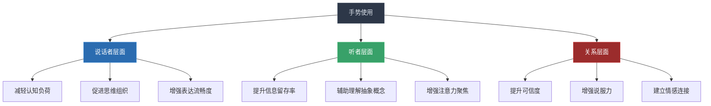
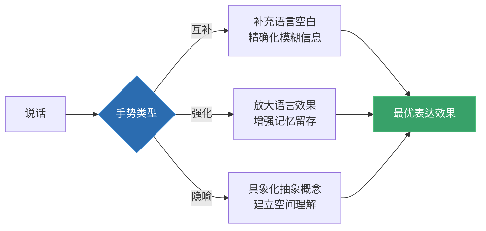
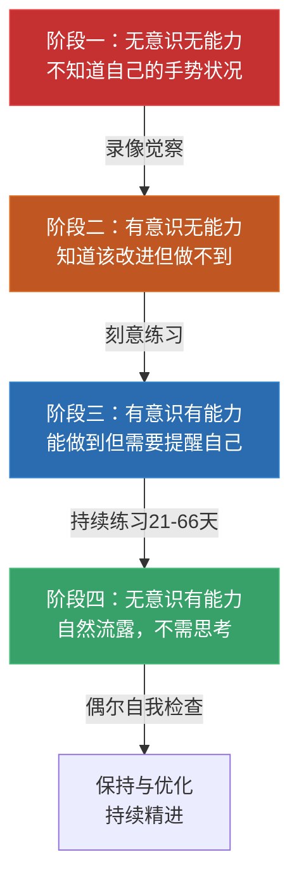

## 三、增强表达力的手势技巧

> "手势是思维的舞蹈——当语言无法到达的地方，手势替你走过去。" ——大卫·麦克尼尔（David McNeill）

在非语言沟通的各个维度中，手势是最容易被忽视却最具实战价值的技能。面部表情受先天因素影响大，空间距离受物理条件限制，声音语调需要长期训练——但手势不同：**它是你可以在任何场景中、立刻开始使用、并且效果立竿见影的非语言工具。**

密歇根大学语言学家大卫·麦克尼尔（David McNeill）在其开创性著作《手势与思想》（*Gesture and Thought*, 2005）中指出：手势不是语言的"附属品"，而是与语言**同步生成**的认知过程。说话者的手势和语言来自同一个思维源头——当你说"这件事很大"时，你双手比划的"大"，不是在翻译语言，而是在**直接表达思维**。

这意味着：训练手势不是在学习"表演技巧"，而是在**疏通思维到表达的通道**。

### 3.1 手势为什么能增强表达力

#### 3.1.1 手势的认知科学基础

手势增强表达力的机制远比"让演讲看起来生动"深刻得多。认知科学的研究揭示了三层递进机制：

**第一层：手势帮助说话者思考**

麦克尼尔团队通过分析数千段对话录像发现，当人们被要求禁止使用手势时，他们的语言表达质量显著下降——语句更短、逻辑更碎、填充词（"嗯""那个"）更多。这说明手势不仅仅是表达工具，更是**思维的脚手架**。

具体机制：

- **空间化思考**：当描述抽象概念时，手势将概念"投射"到物理空间中。比如用左手代表"过去"、右手代表"未来"，建立了一个空间隐喻，帮助说话者和听者同时理解时间关系
- **并行编码**：语言是线性的（一个词接一个词），手势可以同时表达多个维度的信息。你可以说"公司利润增长了"，同时用手势表达增长的速度、幅度和趋势——三路信息并行传输
- **减轻认知负荷**：研究表明（Alibali et al., 2000），当任务涉及空间推理时，允许使用手势的被试表现更好，因为手势分担了一部分认知处理工作

**第二层：手势帮助听者理解**

| 研究 | 发现 | 实际意义 |
|------|------|----------|
| Church et al. (2017) | 儿童从包含手势的教学中学到的数学概念比纯语言教学多30% | 手势是教学的核心工具 |
| Kelly et al. (2010) | 听众回忆包含手势的演讲内容，比纯语言版本多记住20-25% | 手势提升信息留存率 |
| Beattie & Shovelton (1999) | 包含手势的描述让听者能更准确地推断说话者未明确说出的信息 | 手势传递语言未覆盖的信息 |
| Hostetter (2011) | 手势与语言一致时理解度最高；手势与语言矛盾时听者会感到困惑 | 手势的一致性至关重要 |

**第三层：手势增强说话者的可信度**

美国加州大学洛杉矶分校（UCLA）教授约翰·赫特（John Hutterer）团队分析了TED演讲视频后发现：**观看次数最高的TED演讲者平均每分钟使用的手势数量是观看次数最低者的2.2倍**。手势使用频率与观众评分之间的相关系数达到r=0.63——这是一个相当强的正相关。

#### 3.1.2 手势与语言的协同关系

手势和语言之间存在三种协同模式，理解这些模式是高效使用手势的前提：

**模式一：互补关系（Complementary）**

手势提供语言未涵盖的额外信息。例如，你说"我想要一个这么大的蛋糕"——"这么大"在语言中是模糊的，但手势精确地描述了尺寸。这是手势最强大的功能：**填补语言的信息空白**。

**模式二：强化关系（Emphatic）**

手势与语言传递相同信息，起到放大效果。例如，你说"利润大幅增长"的同时，手掌从低处向高处划出一个上升弧线。信息是冗余的，但强化效果显著——听众对信息的信任度和记忆深度都会提升。

**模式三：隐喻关系（Metaphoric）**

手势将抽象概念具象化。例如，谈到"公司的两个发展方向"时，双手分别指向左前方和右前方——把抽象的"方向"概念投射到了物理空间。这种手势尤其适合传达策略、理念、价值观等难以用语言直接描述的内容。

### 3.2 十大核心手势的深度解析

以下是十个经过非语言沟通研究验证的核心手势。每个手势都从动作要领、适用场景、使用时机、常见错误四个维度进行拆解，确保你不仅知道"怎么做"，还知道"为什么做"和"什么时候做"。

#### 3.2.1 列举手势（Counting/Listing）

**动作要领**：说到"第一点""第二点"时，用手指依次伸出。从食指开始（第一点），中指加入（第二点），无名指加入（第三点），以此类推。中国习惯中也可以用大拇指开始。

**为什么有效**：列举手势将线性的语言信息转化为空间排列。听众不仅听到"第一、第二、第三"，还看到了一个视觉序列。认知心理学中的"双重编码理论"（Paivio, 1986）证明：同时通过语言和视觉两个通道编码的信息，记忆留存率提高约40%。

**使用时机**：
- 汇报工作列举关键数据时
- 演讲中列举论据时
- 说明步骤或流程时
- 强调优先级排序时

**进阶用法**：当强调某个特定要点时，可以将对应的手指微微前伸或上挑，与其他手指形成对比。比如说到"第三点是关键"时，将无名指单独突出。

**常见错误**：
- 只伸出一根手指：显得"指责"或"训斥"，缺乏列举感
- 手指伸到对方面前：产生侵略感
- 列举超过五点：人类工作记忆容量为7±2（Miller, 1956），列举超过五点听众会失去跟踪，手势也失去了锚定效果

#### 3.2.2 比较手势（Contrasting）

**动作要领**：双手一高一低（表示程度对比）或一左一右（表示选项对比）。左手代表"A选项"，右手代表"B选项"，分别在身体两侧稍前方的位置展开。

**为什么有效**：比较手势将抽象的"对比"关系映射到了空间维度。人的空间认知极其发达——我们天生能理解"左vs右""高vs低"的对比关系。用空间关系替代抽象逻辑，降低了听者的认知负荷。

**使用时机**：
- 分析利弊时（"一方面……另一方面……"）
- 对比方案时（"方案A是……方案B是……"）
- 解释因果时（"没有这个策略时……有了之后……"）
- 推销或说服时（"竞争对手的做法是……我们的做法是……"）

**操作细节**：
- 左右对比时，与听者的空间保持一致——从听者视角看，你的左手对应他的右侧。为了避免混淆，可以配合语言指明"这一边""那一边"
- 高低对比时，"高"的位置代表更重要/更多/更好的一方，"低"代表次要/更少/更差的一方——这符合人类"好=上、坏=下"的隐喻认知（Lakoff & Johnson, 1980）

**常见错误**：
- 双手位置过于接近，听者看不出对比关系
- 左右方向频繁互换，让听者混淆
- 说到"但是"时手势方向不变，失去了转折的强调效果

#### 3.2.3 大小手势（Sizing）

**动作要领**：双手比划大小——拇指和食指靠近表示"小"，双手张开表示"大"。双手距离越远，表示的程度越强。

**为什么有效**：大小手势利用了人类最基础的感知能力——尺寸感知。当你把抽象的"很大""很小"转化为视觉上可见的尺寸差异时，听者能瞬间理解程度。

**使用时机**：
- 描述规模（"公司从这么小，做到了这么大"）
- 强调程度（"这是一个巨大的机会"）
- 量化关系（"增长了三倍"——用手势展示原大小和新大小）
- 表达感受（"压力非常大"——双手撑开一个大圆）

**进阶用法——渐变手势**：不要直接跳到最终大小，而是让双手从小到大缓慢展开（或从大到小缓慢收缩）。这个渐变过程传递了"增长的过程"或"缩小的趋势"，比静态的手势更生动。同时，渐变的速度可以暗示变化的快慢——快速展开=急剧增长，缓慢展开=稳步增长。

**常见错误**：
- 双手比划的大小与口头描述不一致（比如说"非常大"但手势只比划了一个小圆）
- 手势幅度与场景不匹配（在狭小的会议室里做大幅度的手势）

#### 3.2.4 排斥/阻挡手势（Blocking/Rejection）

**动作要领**：双手掌心向外推出，像在推开一扇门。手臂伸直但不过度僵硬，手掌与地面基本垂直。

**为什么有效**：掌心向外是人类跨文化共有的"停止/拒绝"信号。这个手势的进化根源在于：当原始人类面对危险或不想要的东西时，用双手阻挡是最本能的防御动作。因此，这个手势几乎在所有文化中都能被立即理解。

**使用时机**：
- 否定错误观点时（"这个想法行不通"——掌心推出）
- 表示反对立场时（"我们不能接受这个条件"）
- 设定边界时（"这个话题到此为止"）
- 拒绝邀约或提议时（"谢谢，但我不需要"）

**使用策略**：排斥手势的力度需要精确控制——轻微的掌心前推传递"我不同意"，而用力推出传递"这是绝对不可能的"。初学者常见的问题是力度过猛，把温和的反对变成了强硬的拒绝。在大多数商务和社交场景中，用30%的力度就足够了。

**常见错误**：
- 掌心朝向自己（不构成排斥信号，反而像在"接受"什么）
- 配合微笑使用（在否定时微笑会造成认知失调）
- 用食指指人代替掌心推出（食指指向在多数文化中被视为不礼貌和攻击性行为）

#### 3.2.5 接纳/邀请手势（Open Palm/Invitation）

**动作要领**：双手掌心向上展开，位于身体前方，手指自然伸展。像在托举一个无形的盘子，或向对方展示"我手上什么都没有"。

**为什么有效**：掌心向上在非语言研究中被称为"裸露掌心"（open palm display）。由于手掌是人类最早的"武器"（持有工具和武器的部位），露出掌心等于在说"我没有武器，我没有威胁"。艾伯特·梅拉比安（Albert Mehrabian）的研究表明，掌心向上的手势让说话者被评价为更诚实、更合作。

**使用时机**：
- 邀请他人发言时（"请说说你的看法"——掌心向上指向对方）
- 表示坦诚时（"我对你完全坦白"——双手掌心向上展示）
- 提出请求时（"能请你帮个忙吗"——掌心向上，营造"请求"而非"命令"的氛围）
- 引入话题或嘉宾时（"让我们欢迎XX"——掌心向上引向目标）
- 表示无奈或困惑时（"我也不知道该怎么办"——掌心向上，肩膀微耸）

**与其他手势的配合**：
- 掌心向上 + 身体前倾 = 真诚恳切
- 掌心向上 + 后退一步 = 邀请对方进入
- 掌心向上 + 点头 = 赞同与接纳
- 掌心向上 + 微笑 = 友善邀请

**常见错误**：
- 掌心角度过高（变成"投降"姿势）
- 手指并拢僵硬（显得刻意，不够自然）
- 双手位置过高（超过胸部会显得紧张或防御）

#### 3.2.6 强调手势（Emphatic Beating）

**动作要领**：强调手势有多种形态，包括：
- **向下切掌**：手掌像刀刃一样向下快速切动，在关键论点处"一锤定音"
- **握拳**：自然握拳，用于表达决心、信念或强烈情感
- **指尖敲击**：食指和中指并拢，轻敲桌面或另一只手的掌心，强调节奏

**为什么有效**：强调手势的本质是"给语言标重点"。就像书面语言中的**加粗**和下划线一样，强调手势告诉听者："这句话是重点，你需要注意。"认知心理学中的"标记效应"（von Restorff effect）表明：被标记的信息比未标记的信息记忆留存率高65%。

**三种强调手势的力度对比**：

| 手势类型 | 力度 | 适用场景 | 频率 |
|----------|------|----------|------|
| 向下切掌 | 中等 | 表达观点、做出判断 | 每个重要论点使用一次 |
| 握拳 | 强烈 | 表达决心、激励士气 | 整场演讲/对话1-2次 |
| 指尖敲击 | 轻柔 | 强调细节、逐条陈述 | 每个细节使用一次 |

**使用策略**：强调手势的关键在于**节制**。如果你每个词都"强调"，那就等于没有任何强调。真正的高手在整个演讲中只用3-5次强调手势，每次都精准地落在最关键的观点上——就像电影中只有关键时刻才响起背景音乐一样。

**常见错误**：
- 过度使用（每句话都有强调手势，听众疲劳）
- 力度过猛（握拳时关节发白，切掌时手臂完全伸直，显得攻击性过强）
- 时机不对（在次要信息上使用强调手势，误导听众判断重点）

#### 3.2.7 指引手势（Directing）

**动作要领**：用整个手掌（而非食指）指向某个方向或人。五指并拢，手掌与地面约成45度角，手臂自然伸出。

**为什么有效**：用整个手掌指引而非单独伸出食指，有两个原因。第一，食指指向在许多文化中被视为"指责"或"训斥"的信号——即使你的意图是中性的，对方的情绪反应也可能是负面的。第二，全掌指引在视觉上更柔和、更专业，同时覆盖的指引方向更精确（食指尖端的指向容易因为手腕角度而偏离目标）。

**使用时机**：
- 引导听众注意力时（"请看这张图表"——全掌指向屏幕）
- 介绍在场人物时（"这位是我们的技术总监"——全掌指向对方）
- 指明方向或位置时（"会议室在那边"——全掌指引方向）
- 回应提问时（"这位朋友"——全掌轻抬，示意提问者）

**文化差异警示**：

| 文化区域 | 食指指向 | 拇指指向 | 全掌指引 |
|----------|----------|----------|----------|
| 北美/西欧 | 不礼貌但常见 | 积极（"好"） | 专业礼貌 |
| 东亚 | 不礼貌 | 正常 | 最佳选择 |
| 中东 | 严格禁忌 | 一般 | 最佳选择 |
| 东南亚 | 严格禁忌 | 代替食指指人 | 安全选项 |
| 非洲部分国家 | 不礼貌 | 正常 | 安全选项 |

**全掌指引是跨文化场景中最安全的指引手势。**

**常见错误**：
- 用食指指人（在多数文化中被视为不礼貌甚至侮辱性）
- 指引时没有眼神接触（显得敷衍，对方可能不知道你在指什么）
- 指引距离太远（手臂完全伸直传递"保持距离"的信号）

#### 3.2.8 连接手势（Linking/Bridging）

**动作要领**：双手手指交叉或合拢，或双手在身体前方搭在一起。也可以双手指尖对指尖形成"尖塔"状（steeple gesture）。

**为什么有效**：连接手势传递两种信息——**统一**和**自信**。双手交叉或合拢暗示"两个事物结合在一起"，适合表达联盟、合作、整合等概念。而"尖塔手势"是非语言研究中最公认的自信信号之一（Pease & Pease, 2004）——它出现在法官、律师、高管等高地位人群中显著高于普通人群。

**尖塔手势的两种形态**：

- **正向尖塔**：指尖朝上，双手指尖对指尖。传递"我确信""我很专业"的信号。适合在陈述专业观点、表达信心时使用
- **反向尖塔**：指尖朝下，双手倒扣。传递"我在倾听""我在思考"的信号。适合在听取汇报、评估方案时使用

**使用时机**：
- 强调两个概念的关联性时（"技术和人文必须结合"——双手交叉）
- 表达自信和确定性时（"我对这个方案非常有信心"——正向尖塔）
- 在倾听时展现专业度（听取汇报时自然使用反向尖塔）
- 表示团结或合作时（"我们是一个团队"——双手合拢）

**使用频率控制**：尖塔手势是高浓度的自信信号。如果整场对话一直保持尖塔，反而会显得傲慢或封闭。最佳策略是在关键论点时短暂形成尖塔（3-5秒），然后自然过渡到其他手势或中性姿态。

**常见错误**：
- 尖塔手势配合身体后仰（显得傲慢和高高在上）
- 双手紧握（不是"连接"而是"紧张"——紧握的双手泄露焦虑情绪）
- 在需要表达同理心时使用尖塔（尖塔传递的是"确定"，在对方需要被理解时使用会显得冷漠）

#### 3.2.9 时间线手势（Timeline Gestures）

**动作要领**：用手在空间中"切割"一条时间线。最通用的布局是：
- **过去**：手伸向身体左后方（从听者视角看是右侧）
- **现在**：手位于身体正前方
- **未来**：手伸向身体右前方（从听者视角看是左侧）

**为什么有效**：时间线手势将不可见的时间维度投射到物理空间中，创建了一个**空间-时间隐喻**。这种隐喻是人类理解时间的基础方式——我们说"回顾过去""展望未来""活在当下"，这些语言本身就暗含了空间隐喻。手势将这些隐喻从抽象的语言层面拉到了具体的视觉层面。

认知语言学家乔治·莱考夫（George Lakoff）和马克·约翰逊（Mark Johnson）在《我们赖以生存的隐喻》中指出，人类理解时间的两种基本隐喻是：
- **时间在移动**："时间飞逝""未来在向我们走来"
- **我们在移动**："走过困难时期""回顾过去"

时间线手势激活了第二种隐喻——你在时间轴上"移动"，听者能直观地看到你所指的时间段。

**使用时机**：
- 讲述故事或历史时（"三年前我们还是这样……现在我们已经……未来我们的目标是……"）
- 制定计划时（"第一阶段……第二阶段……第三阶段……"——在空间中依次标出）
- 对比过去和现状时（"以前我们用这种方法，结果是……现在换了一种方式，效果是……"）
- 强调转折点时（"就在那个时刻"——在时间线的某个位置做标记动作）

**进阶用法——多维时间线**：对于复杂的时间叙述，可以在空间中创建多条平行时间线。比如，左手的时间线代表"市场变化"，右手的时间线代表"公司应对"，两条线在某个点"交叉"——这个交叉点就是关键转折。这种多维时间线在商业汇报中极为有效。

**常见错误**：
- 时间方向不一致（有时左边是过去，有时右边是过去，听者混乱）
- 时间线过于模糊（手势不在身体前方固定的空间层面上"划线"，听者看不出时间走向）
- 只用手腕不移动手臂（范围太小，坐在后排的人看不到）

#### 3.2.10 框架手势（Framing）

**动作要领**：用双手的大拇指和食指比划一个"框架"或"取景框"的形状，像摄影师取景一样。也可以用双手四指并拢、拇指展开的方式构建一个更大的框架。

**为什么有效**：框架手势的本质是"聚焦"——你用手在空间中划出一个"画框"，然后把需要听众关注的信息"放"进这个画框里。这个手势利用了人类视觉认知中的"选择性注意力"（selective attention）机制：当我们看到一个框架时，大脑会自动将框架内的内容视为"重要信息"，将框架外的内容视为"背景"。

**使用时机**：
- 强调某个核心观点时（"这才是问题的核心"——用框架"框住"这个观点）
- 聚焦数据或图表时（"请注意这个数字"——框架指向屏幕上的关键数据）
- 创造"画中画"效果时（"想象一下这个场景"——用框架创造一个"画面"）
- 概括总结时（"总结起来就是这些"——框架手势将多个要点"收拢"到一起）

**进阶用法——动态框架**：框架不仅限于固定大小。你可以从一个小框架开始（代表某个具体的细节），然后缓慢扩大框架（代表更宏观的视角）——这个动态过程传达了"从细节到整体"的思维过程。反过来，从大到小的框架传达了"从整体聚焦到关键细节"。

**常见错误**：
- 框架大小不变（始终用同一个尺寸，失去了"聚焦"的层次感）
- 框架位置过低（低于腰部的框架手势，后排听众看不到）
- 框架动作过于夸张（框架太大会显得做作）

### 3.3 日常对话中的手势原则

上一节讨论的是演讲和正式场景中的"策略性手势"。在日常对话中，手势的使用更偏向自然和直觉，但仍有一些核心原则需要遵守：

#### 3.3.1 五大核心原则

**原则一：自然原则**

手势应该自然地配合语言节奏，而不是刻意"表演"。判断标准是：**如果你在想"我现在该做什么手势"，那这个手势就已经不自然了。** 真正自然的手势来自对内容的投入——当你真正理解并相信自己说的话时，手势会自然产生。

训练路径：先"刻意"练习（2-4周）→ 逐渐减少对"做手势"这件事的意识关注（4-8周）→ 手势成为语言的自然延伸（8周以后）。

**原则二：适度原则**

手势不宜过多或过大。判断标准：**如果你的手势在分散自己或他人对内容的注意力，那你就做过头了。** 研究发现（Maricchiolo et al., 2008），中等频率的手势（每分钟8-12次）被认为最具说服力；低于4次显得呆板，高于18次显得焦虑或不专业。

**原则三：清晰原则**

手势的含义应该明确。一个模糊的手势不仅无法增强表达，反而会让听者困惑——他们在试图解读你手势的同时，错过了你语言中的信息。宁可少做一个手势，也不要做一个让人摸不着头脑的手势。

**原则四：一致性原则**

手势应与语言内容和情感基调保持一致。这是最容易违反、也是后果最严重的原则。研究表明（Kelly et al., 2010），当手势与语言矛盾时，听者的大脑会经历"冲突检测"——前扣带回皮层被激活，注意力被从内容转移到"解读矛盾"上。结果是：信息传递效率大幅下降，可信度受损。

| 语言内容 | 矛盾手势 | 听者感受 |
|----------|----------|----------|
| "我非常有信心" | 双手交叉抱胸 | "他其实在害怕" |
| "这个方案很好" | 摊手/耸肩 | "他自己都不信" |
| "我们团结一致" | 各自交叉手臂 | "团队有裂痕" |
| "欢迎你的意见" | 手臂挡在胸前 | "他不想听" |
| "规模很大" | 双手比划一个小圆 | "到底大还是小？" |

**原则五：开放原则**

尽量使用开放性手势——掌心向上、向外、手臂展开。避免封闭性手势——握拳、双手交叉抱胸、双手插兜。开放性手势在几乎所有跨文化研究中都被评价为更友善、更可信、更有说服力。

但要注意：开放手势不等于"无节制地占用空间"。在正式场合，双手展开的宽度应控制在肩宽的1.5倍以内；在亲密对话中，手势幅度应更小更柔和。

#### 3.3.2 日常手势的频率与节奏

手势的使用需要遵循"呼吸式"节奏——有起伏，有停顿，而不是持续不断地运动。

理想的日常对话手势节奏：

关键节奏指标：
- **手势-停顿比**：70%的手势活动时间 + 30%的中性姿态时间
- **新手势间隔**：一个新手势与上一个之间至少间隔2秒，避免"手舞足蹈"
- **手势与词语同步**：手势的"峰值动作"（最大幅度的瞬间）应该落在关键词上，而不是关键词之前或之后

### 3.4 手势的"能量层级"系统

不同场景对手势的幅度、频率和力度有完全不同的要求。将手势能量分为三个层级，可以帮助你在任何场景中快速校准手势的"音量"。

#### 3.4.1 三级能量体系

| 维度 | 高能量场景 | 中能量场景 | 低能量场景 |
|------|-----------|-----------|-----------|
| **典型场景** | 演讲、销售展示、团队激励、大型会议 | 商务会议、客户沟通、项目汇报 | 一对一谈话、安慰他人、亲密对话 |
| **手势幅度** | 大（超过肩宽） | 中等（肩宽以内） | 小（胸部以内） |
| **手势频率** | 15-20次/分钟 | 8-12次/分钟 | 4-8次/分钟 |
| **力度** | 果断、有力 | 清晰、专业 | 柔和、缓慢 |
| **使用区域** | 头顶到腰部的全部空间 | 肩膀到腰部 | 胸部到腰部 |
| **速度** | 快（配合激情的语速） | 中等 | 慢（配合温柔的语速） |
| **与观众距离** | 3米以上 | 1.5-3米 | 1.5米以内 |

#### 3.4.2 能量匹配原则

手势的能量必须与三个要素匹配：

**匹配一：与场景氛围匹配**

在追悼会上使用高能量手势是严重失态；在销售大会上使用低能量手势会显得缺乏热情。**场景决定基调，手势跟随基调。**

**匹配二：与个人风格匹配**

一个天性内敛的人突然在演讲中大开大合，听众不会觉得"他好有激情"，而会觉得"他在装"。最有效的策略是在你的自然风格基础上**适度放大**——如果你天生手势幅度小，放大20%就够了；如果你天生手势幅度大，在正式场合收敛10%反而更专业。

**匹配三：与语言内容匹配**

描述一个激动人心的故事时，手势幅度自然应该大一些；在讨论技术细节时，手势应该精确而克制。**手势的能量随内容的情感强度波动，而不是恒定不变的。**

#### 3.4.3 能量切换的技巧

高手与新手的区别不在于某个单一的手势使用得多好，而在于**能量切换是否流畅自然**。

能量切换有三种模式：

**渐变切换**：从高能量平滑过渡到低能量（或反之）。适合话题从激情转为理性时使用。实现方式是手势幅度和频率在10-15秒内逐渐调整。

**突变切换**：从中性突然跳到高能量。适合需要"惊醒"听众的时刻——突然的大幅度手势配合音量提升，能把走神的听众拉回来。但突变切换每场演讲最多使用1-2次，过多则无效。

**脉冲切换**：在中性基线上"脉冲式"出现高能量手势，然后立即回到基线。适合在平淡叙述中强调某个关键点。脉冲的手势幅度比突变小，但更精准——只在关键词上出现。

### 3.5 跨文化手势指南

手势是跨文化沟通中**最容易引发误解**的非语言要素。同一个手势在不同文化中可能传递完全相反的含义。

#### 3.5.1 高危手势对照表

| 手势 | 西方/中国含义 | 可能的文化冲突 |
|------|-------------|---------------|
| OK手势（拇指+食指成圈） | "好的""没问题" | 巴西：侮辱性含义；法国：表示"零"；土耳其：侮辱性含义 |
| 竖大拇指 | "好""赞" | 中东部分地区：侮辱性含义（类似西方竖中指） |
| V字手势（掌心向外） | "胜利""耶" | 掌心向内在英国/澳大利亚：侮辱性含义 |
| "过来"手势（手指弯曲） | "过来一下" | 菲律宾：只用于叫动物，对人使用是侮辱 |
| 摇头/点头 | 点头=同意，摇头=不同意 | 保加利亚/印度部分地区：点头=不同意，摇头=同意 |
| 左手递物 | 中性 | 中东/南亚/东南亚：左手被视为不洁，递物必须用右手 |
| 拍头部 | 亲昵/鼓励 | 东南亚/佛教文化：头部是灵魂所在，拍头是严重冒犯 |
| 双手合十 | 常见的感谢/祈祷手势 | 日本：仅用于祈祷，日常感谢不适用 |

#### 3.5.2 跨文化手势安全策略

在跨文化场景中，遵循以下策略可以最大限度地避免误解：

1. **首选"全掌"手势**：全掌指引、全掌展示在几乎所有文化中都是安全的
2. **避免用手指指向**：用下巴微抬或眼神方向替代手指指向
3. **使用镜像手势**：观察对方的手势习惯，适度模仿——镜像建立亲和感，同时确保你使用的是对方文化中正面含义的手势
4. **控制幅度**：在不熟悉的文化中，宁可手势幅度小一点，也不要冒犯
5. **注意左右手**：在伊斯兰文化、印度文化中，右手用于社交和进餐，左手用于个人卫生。递物、指路、握手都应使用右手
6. **不确定时，少做**：在完全陌生的文化环境中，减少手势使用是最安全的策略。手势不足只会显得"有点安静"，但手势失当可能造成不可挽回的冒犯

### 3.6 手势的专项训练方法

手势训练遵循"感知→模仿→内化"的三阶段路径。以下是经过验证的训练方法：

#### 3.6.1 阶段一：感知训练（第1-7天）

**目标**：建立对手势的觉察能力，知道自己目前的手势使用状况。

**练习一：录像回放法**

在三个场景中各录一段3-5分钟的视频：
1. 与朋友/同事的日常对话
2. 给别人讲解某个你熟悉的主题
3. 模拟一次工作汇报

回放时关注以下指标：

| 观察维度 | 记录内容 |
|----------|----------|
| 手势频率 | 每分钟大约使用几次手势？ |
| 手势类型 | 你最常用的是哪几种手势？ |
| 手势幅度 | 手势是否清晰可见？还是太小看不见？ |
| 手势时机 | 手势出现在关键词前、中还是后？ |
| 一致性 | 手势与语言内容是否匹配？ |
| 能量层级 | 手势能量是否与场景匹配？ |
| 无意识动作 | 是否有搓手、摸头发、摆弄物品等适应性动作？ |

**练习二：名人观察法**

选择3位你欣赏的公众人物（TED演讲者、政治家、企业家），观看他们演讲的完整视频。注意记录：
- 他们最常用的手势类型
- 手势与语言的配合时机
- 他们如何在不同能量层级之间切换
- 他们的"标志性手势"是什么

推荐观察对象：史蒂夫·乔布斯（产品发布会中的框架手势和大小手势）、奥巴马（政治演讲中的列举手势和连接手势）、董明珠（商业演讲中的强调手势和比较手势）。

#### 3.6.2 阶段二：模仿训练（第8-21天）

**目标**：将观察到的优秀手势模式转化为自己的肌肉记忆。

**练习三：镜前模拟法**

每天对着镜子练习5-10分钟：
1. 选择一段100-200字的文本（可以是你的工作汇报片段）
2. 第一遍：正常朗读，不使用手势——观察自己的中性姿态
3. 第二遍：朗读时加入3-5个预先设计的手势——观察手势是否清晰可见
4. 第三遍：朗读时使用自然产生的手势——观察与第二遍的区别
5. 对比回放，找到"设计"和"自然"之间的平衡点

**练习四：手势库建设**

为你的高频场景（工作汇报、客户沟通、团队会议）各建立一个"手势库"。方法是：
1. 列出你在这类场景中经常表达的5-10个关键观点
2. 为每个观点设计2-3个可能的手势
3. 练习时尝试不同的手势组合
4. 选择最自然、最匹配的组合固定下来

示例手势库（工作汇报场景）：

| 观点类型 | 推荐手势 | 使用时机 |
|----------|----------|----------|
| 列举数据 | 列举手势 | "第一……第二……第三……" |
| 强调关键指标 | 向下切掌 | "这是最关键的数字" |
| 展示增长趋势 | 大小手势（渐变） | "从XX增长到了XX" |
| 对比方案优劣 | 比较手势 | "方案A vs 方案B" |
| 表达信心 | 正向尖塔 | "我对这个方案非常有信心" |
| 邀请反馈 | 接纳手势 | "大家有什么建议？" |
| 强调核心结论 | 框架手势 | "总结起来，核心就一点" |

#### 3.6.3 阶段三：内化训练（第22-42天）

**目标**：让手势成为思维的自然延伸，无需刻意"设计"。

**练习五：即兴演讲法**

1. 随机选择一个话题（可以用随机词汇生成器）
2. 准备30秒
3. 即兴演讲2分钟
4. 全程录像

这个练习的关键不是"讲得好"，而是**观察你在没有预先设计手势的情况下，自然会产生什么样的手势**。这些自然产生的手势就是你最应该保留和强化的。

**练习六：场景模拟法**

在真实但低风险的场景中有意识地使用手势：
- 在团队站会中使用列举手势汇报进度
- 在朋友聚餐中使用大小手势讲故事
- 在电话中使用手势（虽然对方看不到，但手势会影响你的语调和表达流畅度——这是被研究证实的：Hostetter et al., 2015）

**练习七：反馈循环法**

在关键场景（演讲、汇报、面试）后，获取对手势的反馈。可以直接询问信任的同事："你觉得我在台上手势使用得怎么样？有没有觉得不自然或过多/过少的地方？"也可以通过录像回放进行自我评估。

持续3-6周后，你的手势使用会从"刻意设计"过渡到"自然流露"——这就是内化完成的标志。

### 3.7 常见误区与纠正

#### 误区一："手势越多越好"

**真相**：过多的手势（超过每分钟20次）会制造"视觉噪音"，分散听众对内容的注意力。研究发现（Hostetter & Alibali, 2007），中等频率的手势（每分钟8-12次）产生最佳的说服效果。手势不是"越多越有感染力"，而是"越精准越有效"。

**纠正方法**：录像回放，计算手势频率。如果超过每分钟15次，有意识地减少到每分钟8-10次——只在关键观点上使用手势，其余时间保持中性姿态。

#### 误区二："手势是即兴发挥，不需要准备"

**真相**：最优秀的演讲者的手势看起来"即兴"，实际上都经过了精心设计。TED演讲教练克里斯·安德森（Chris Anderson）在《TED演讲的秘密》中透露：成功的TED演讲者平均为每10分钟的演讲设计15-20个特定手势。这种设计不是"死板的编排"，而是**对关键节点的预先标记**——知道在哪里使用什么手势，才能在演讲时"看起来自然"。

**纠正方法**：在重要演讲或汇报前，至少花30分钟为你的关键观点设计手势方案。不必设计每一句话的手势——只需要标记出5-8个关键节点，为每个节点设计一个手势。

#### 误区三："我天生不适合用手势"

**真相**：手势能力不像身高或面孔——它是一个**可以通过训练显著提升的技能**。即使是习惯性双手插兜的人，在经过3-6周的系统训练后，也能在演讲中自然使用手势。神经可塑性（neuroplasticity）的研究表明，任何行为模式在持续练习21-66天后都会开始自动化（Lally et al., 2010）。

**纠正方法**：从最简单的一个手势（比如列举手势）开始，在低风险场景中反复练习2周。然后逐步添加新的手势类型。

#### 误区四："手势必须完美同步语言"

**真相**：手势和语言的最优同步关系是"手势略领先语言"——手势在关键词出现前约0.5秒开始，与关键词同步达到峰值。完全同步是理想的，但"稍早"远好于"稍晚"。手势明显落后于语言（你在说"大"的时候手还没有展开），会被解读为"不自然"和"思考过度"。

**纠正方法**：在练习时，有意识地让手势"提前半拍"启动。这个时间差经过练习后会自动调整到最佳状态。

#### 误区五："正式场合应该减少手势"

**真相**：恰恰相反——在正式场合，手势的价值反而更大。原因有三：第一，正式场合的听众期待更高的表达质量，手势是衡量表达力的重要维度；第二，正式场合通常伴随更大的空间（大会议室、礼堂），没有手势辅助，身体语言的"信号强度"会严重不足；第三，正式场合的听众注意力更分散，手势是"抓回注意力"的最有效手段。

**纠正方法**：在正式场合使用中等偏大的手势幅度（肩宽到1.5倍肩宽），手势频率保持在每分钟10-15次，手势类型以列举、比较、强调为主——这些是正式场景中最具"权威感"的手势。

#### 误区六："双手应该对称使用"

**真相**：人类是单手主导的生物——我们的优势手（通常是右手）在手势中承担了更重要的角色。研究表明（Casasanto, 2009），人们倾向于将"好"的事物与优势手关联，将"坏"的事物与非优势手关联。因此：
- 积极的、正面的手势（认可、邀请、列举）用优势手或双手
- 消极的、否定的手势（排除、拒绝）可以用非优势手
- 比较手势中，优势手代表你支持/推荐的选项

**纠正方法**：观察你自然状态下优势手和非优势手的分工，然后有意识地在比较手势中利用这个倾向。

### 3.8 进阶：手势的高级运用

#### 3.8.1 手势与说服力的关系

手势不仅增强表达力，更是说服力的关键组成部分。加州大学洛杉矶分校的沟通学研究团队在分析了数千段说服性演讲后，总结出"手势说服三原则"：

**原则一：用空间锚定论点**

当你说"我们的第一个优势是……第二个优势是……"时，在身体左侧（你的左侧）标记"第一个"，在右侧标记"第二个"。然后在后续的演讲中，每次回到第一个论点时，你的手回到左侧位置；回到第二个论点时，手回到右侧位置。

这个技巧叫做**空间锚定**（spatial anchoring）。它利用了听者的空间记忆——当你的手回到"第一论点"的空间位置时，听者的大脑会自动激活对该论点的记忆，无需你重新复述。

**原则二：用手势"封装"结论**

在表达核心结论之前，做一个短暂的停顿，然后双手同时展开一个框定或强调的手势，在手势的"框架"中说出你的结论。这个技巧叫做"手势封装"——它利用了格式塔心理学中的"图-底关系"，让手势成为结论的"框架"，使结论在听者的记忆中更加突出。

**原则三：用手势"对抗"反对意见**

在预先回应可能的反对意见时，用排斥手势（掌心向外轻轻推出）标示反对意见，然后用接纳手势（掌心向上展开）标示你的回应。这种空间化的"反驳"比纯语言的反驳更有说服力，因为听者在视觉上"看到"了反对意见被推开、正确观点被接纳的过程。

#### 3.8.2 手势在不同媒介中的适配

**面对面沟通**：所有手势类型都可以使用，空间充足，是最理想的手势场景。

**视频会议**：
- 手势幅度缩小30-40%（摄像头通常只能拍到胸部以上）
- 手势位置提高（保持在胸部到脸部之间的可见区域）
- 避免手势超出摄像头画面——手突然"消失"会分散注意力
- 重要手势停顿时间增加0.5-1秒（视频有延迟，停顿更久才能确保对方看到）
- 使用"放大"版的面部表情配合缩小版的手势，弥补视觉信息的损失

**电话沟通**：
- 仍然使用手势——研究表明（Cook & Tanenhaus, 2009），使用手势的人在电话中的语调更丰富、表达更流畅
- 手势幅度可以正常大小（对方看不到）
- 手势频率可以适当增加（弥补视觉通道的缺失）

**大型演讲（礼堂/千人会场）**：
- 手势幅度放大1.5-2倍
- 手势速度放慢30%（后排听众需要更长时间才能"捕捉"到手势）
- 使用更多"大类"手势（大幅度的列举、比较、强调），减少细节手势
- 手势在头顶到腰部的"全区域"范围内使用

#### 3.8.3 手势的"去技术化"——从刻意到自然的终极路径

手势训练的终极目标不是"使用更多手势"，而是**让手势成为思维的自然映射**——你想到什么，手就自然地表达了什么。

到达这个阶段的标志：

1. 你不再"计划"手势——它与语言同时自然产生
2. 你的手势在不同场景中自然调整幅度和频率——不需要提醒自己"这是高能量场景，我要做大手势"
3. 你在情绪激动时，手势自然放大；在平静思考时，手势自然缩小
4. 你偶尔发现自己在独处思考时也会使用手势——这说明手势已经内化为思维的一部分

去技术化的路径：

> 这个四阶段模型来自"意识-能力矩阵"（Conscious-Competence Matrix），最早由管理学Noel Burch在1970年代提出，后被广泛应用于各类行为技能训练。

### 3.9 实战场景中的手势策略速查

为常见实战场景提供即拿即用的手势策略：

**求职面试**：

| 环节 | 推荐手势 | 避免手势 |
|------|----------|----------|
| 自我介绍 | 接纳手势（掌心向上）+ 适度微笑 | 双手交叉抱胸 |
| 描述经验 | 列举手势 + 时间线手势 | 无手势（呆板） |
| 回答问题 | 正向尖塔（自信）+ 比较手势 | 摸鼻子/搓手（紧张信号） |
| 提问环节 | 接纳手势 + 全掌指引 | 食指指向面试官 |

**商务谈判**：

| 环节 | 推荐手势 | 避免手势 |
|------|----------|----------|
| 开场寒暄 | 握手 + 接纳手势 | 过早使用强调手势 |
| 阐述立场 | 正向尖塔 + 比较手势 | 排斥手势（过于对抗） |
| 回应对方提案 | 框架手势（聚焦）+ 倾听姿势 | 摇头 + 交叉手臂 |
| 强调底线 | 向下切掌 + 目光直视 | 握拳（过于攻击性） |
| 达成共识 | 连接手势 + 接纳手势 | 拍手/击掌（过于随意） |

**工作汇报**：

| 环节 | 推荐手势 | 避免手势 |
|------|----------|----------|
| 开场概述 | 大小手势（整体框架）| 双手插兜 |
| 数据展示 | 全掌指引屏幕 + 列举手势 | 指尖戳屏幕 |
| 分析对比 | 比较手势 + 时间线手势 | 无手势朗读PPT |
| 提出建议 | 框架手势 + 正向尖塔 | 摊手/耸肩（不确定感） |
| 总结要点 | 向下切掌（结论）+ 列举手势（回顾）| 匆忙结束，无收束手势 |

***

**本节核心要义**：手势不是演讲的"装饰品"，而是思维表达的核心通道。掌握十大核心手势的使用时机、力度和频率，遵守日常手势的五大原则，在不同场景中校准手势的能量层级，通过3-6周的系统训练将手势从"刻意使用"内化为"自然流露"——你就获得了一个随时可用、立竿见影的表达力倍增器。
