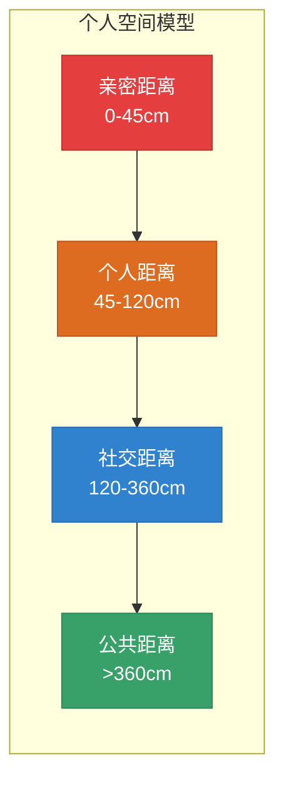
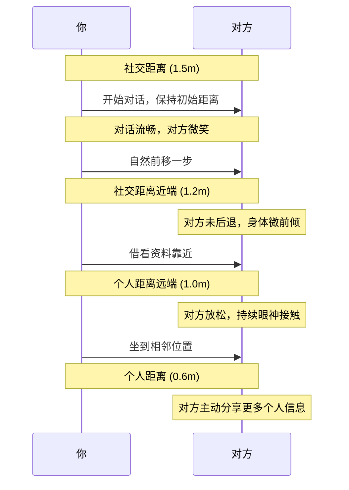

## 四、空间距离的策略性运用

> "人与人之间的距离，不是物理的度量，而是心理的宣言。" ——爱德华·T·霍尔（Edward T. Hall）

空间距离是人类最古老却最容易被忽视的沟通维度。你不需要说一句话，不需要做一个手势，仅仅是**站在某个位置**，就已经在传递大量信息——亲近或疏远、尊重或轻蔑、信任或防御。这种"沉默的语言"（The Silent Language）——正如人类学家霍尔在其1966年经典著作中所命名的——时刻在运作，而大多数人对此毫无觉察。

本节将从空间心理学的理论根基出发，系统讲解四大空间距离的识别与运用、主动管理空间关系的高级策略、跨文化差异的应对方法，以及在职场、社交、销售、亲密关系等典型场景中的实操技巧。

### 4.1 空间距离的科学基础：近体学

#### 4.1.1 霍尔的近体学理论

爱德华·T·霍尔（Edward T. Hall）在20世纪60年代创立了**近体学**（Proxemics），专门研究人类如何使用和感知空间。他的核心发现是：人类像动物一样，围绕自身维持着一圈一圈的"空间气泡"，不同距离的气泡对应不同的关系类型和互动模式。

为什么空间距离会如此深刻地影响沟通效果？认知神经科学给出了三个层面的解释：

**生理层面：杏仁核的空间监测**

人类大脑的杏仁核（amygdala）持续监测着周围空间中的生物体距离。当陌生生物进入某个临界距离时，杏仁核会触发警觉反应——心跳加速、肌肉微紧、注意力聚焦。这个机制源于数百万年的进化：太近的生物体可能是威胁。这就是为什么陌生人突然靠近会让人本能地后退或不适——这不是"不礼貌"的反应，而是**硬编码在神经系统中的生存本能**。

**心理层面：空间即关系隐喻**

心理学研究（Sommer, 1969; Hall, 1966）表明，人与人之间的物理距离被大脑自动映射为心理距离。我们用"亲近"（close）形容亲密关系，用"疏远"（distant）形容冷淡关系——这不是修辞手法，而是**具身认知**（embodied cognition）的真实反映。你调整物理距离，就是在调整心理关系。

**社会层面：空间作为权力语言**

社会学家罗伯特·萨默斯（Robert Sommer）和后来的组织行为学研究者发现，空间占用本身就是一种权力宣示。高管的办公室更大，领袖站的位置更高——空间的"领地性"（territoriality）是社会等级最直觉的信号之一。

#### 4.1.2 四大空间距离带

霍尔定义了四个核心空间距离带，每个距离带都对应特定的关系状态和互动类型。理解这四个距离带，是空间策略运用的基础。

| 距离带 | 范围 | 典型场景 | 关系信号 | 感知通道 |
|--------|------|----------|----------|----------|
| **亲密距离** | 0-45cm | 拥抱、耳语、亲密交谈 | 极高的信任与亲近 | 触觉、体温、气味、呼吸声 |
| **个人距离** | 45-120cm | 朋友聊天、同事协作 | 熟悉与舒适 | 面部表情清晰可见，可闻到香水/口气 |
| **社交距离** | 120-360cm | 商务会议、正式社交 | 礼貌与专业 | 面部表情可辨但细节减弱，声音需要控制 |
| **公共距离** | >360cm | 演讲、课堂教学、公共场合 | 公开与正式 | 需要手势放大，声音需要投射 |

**亲密距离（0-45cm）：信任的终极测试**

这是最敏感的距离。在这个范围内，人能感受到对方的体温、呼吸节奏、皮肤气味——这些都是极度私密的感官信息。未经允许进入这个距离会被感知为**侵犯**。反之，如果一个人允许你进入这个距离而不退缩，说明他对你的信任已经达到了很高的水平。

**个人距离（45-120cm）：日常互动的舒适区**

这是朋友之间、熟悉的同事之间最自然的对话距离。在西方文化中，这大约是一臂之隔——你可以轻松地拍到对方的肩膀，但不会感到被"侵入"。这个距离允许自然的眼神接触和正常的面部表情阅读。

**社交距离（120-360cm）：专业互动的标准区**

商务会面、初次社交、正式讨论通常在这个距离进行。它传递的信号是："我尊重你，但我们之间是专业/正式关系。"在这个距离，你需要更有意识地控制声音和表情，因为细微的非语言信号可能被"稀释"。

**公共距离（>360cm）：权威与舞台**

演讲者、教师、领导者通常在这个距离与受众互动。在这个距离，面部表情的细节已经难以辨认，因此需要更大、更夸张的手势和更清晰的声音投射。这也是为什么舞台表演者会使用比日常对话更大幅度的身体语言。

### 4.2 空间距离的动态管理策略

理解了四个距离带只是起点。真正高级的沟通者，懂得**主动管理和灵活切换**距离带，而不是被动地待在某个固定位置。

#### 4.2.1 策略一：逐步缩短距离法

逐步缩短距离是最基础也最有效的空间策略。其核心原则是：**不要一开始就站在亲密距离，而是通过一系列自然的、可逆的步骤，逐步从远到近。**

**具体操作步骤：**

1. **起始位置**：初次见面时，保持社交距离（1.5-2米）。这个距离传递"我尊重你的空间"的信号
2. **第一次移动**：当对话开始变得流畅（通常在前2-3分钟），自然地向前迈一小步，缩短到社交距离的近端（约1.2米）
3. **观察反应**：对方是否后退？是否身体僵硬？如果对方保持原位或微微前倾，说明缩短距离被接受
4. **第二次移动**：在建立了初步信任后（可能需要5-10分钟的对话），再次自然地缩短到个人距离的远端（约1米）
5. **持续校准**：每一次移动都要观察对方的非语言反馈。如果对方后退或身体转向侧面，说明你走得太快了，退回到上一个舒适距离

**关键原则：每一步移动都要有"借口"**

不要直直地走向对方——这会被感知为逼近。正确的做法是利用自然的动作来实现距离缩短：

- "让我看看你手机上那张照片"——自然地靠近
- 坐下时选择稍近的座位
- 并排看同一个屏幕或文档
- "来，这边安静一些"——引导对方到一个更近的位置

#### 4.2.2 策略二：并排策略（Side-by-Side Technique）

面对面和并排坐/站，传递的是完全不同的心理信号。

**面对面**传递的信息：
- "我们在进行正式互动"
- "我在审视你"或"我在接受你的审视"
- 一种微妙的**对立结构**——即使对话内容是友好的，身体结构暗示着"你在我对面"

**并排**传递的信息：
- "我们是同一边的"
- "我们一起面对同一个方向"
- **合作结构**——肩并肩暗示着"我们共同面对外部世界"

**应用场景：**

| 场景 | 推荐位置 | 原因 |
|------|----------|------|
| 谈判中的联盟建立 | 并排坐 | 减少对抗感，暗示合作 |
| 深度对话/情感支持 | 并排或L形 | 减少"被审视"的压力 |
| 正式商务会谈 | 面对面 | 传递专业和尊重 |
| 头脑风暴 | L形或并排 | 促进协作思维 |
| 面试（面试官） | L形 | 减少压迫感，让候选人更自然 |

**L形座位的妙用：** L形（90度角）是一个被严重低估的座位安排。它既有面对面的互动便利（可以看到对方的表情），又有并排的放松感（没有直接的"面对面压力"）。在咖啡馆或餐厅中，选择角落的L形座位是建立信任的最佳选择。

#### 4.2.3 策略三：环境空间的战略利用

环境不仅是互动的"背景"，更是互动的"参与者"。对环境空间的主动利用，可以极大地增强你的沟通效果。

**角落策略：** 在咖啡厅、餐厅等公共场合，选择角落位置而不是中央位置。角落有三面是墙壁，这意味着：
- 减少了视觉干扰（周围的人流更少）
- 增加了私密感（对方会觉得这个对话更"特别"）
- 降低了对方的防御性（背后没有"威胁"）

**高度策略：** 坐下还是站着？高椅子还是矮椅子？这些选择都在影响权力动态：
- **双方都坐下**：平等对话的信号
- **你站着，对方坐着**：你拥有权力优势（老板走到下属桌前）
- **双方都站着**：快速、临时性的互动
- **你坐着，邀请对方坐下**：你是主人，你控制节奏

**光线策略：** 研究表明，较暗的光线环境会让人更放松、更愿意分享个人信息（Steidle & Werth, 2013）。在需要建立信任的对话中，选择柔和的灯光环境比明亮的荧光灯更有效。

**桌面作为屏障：** 在需要"保护"自己距离的场景中（如初次商务会谈），桌子是一个天然的屏障。但在需要拉近关系时，选择没有桌子的沙发区或吧台座位更有利。

#### 4.2.4 策略四：门槛效应与空间转换

"门槛效应"（Doorway Effect）是认知心理学中一个有趣的发现：人们在通过物理门槛时，大脑会执行一次"事件边界"（event boundary）处理——旧空间的心理状态被"清除"，新空间的心理状态被"加载"。

Radvansky 和 Copeland（2006）的经典实验发现，被试在通过门框后会显著降低对前一个房间中物体信息的记忆准确性。这个现象的原因是大脑把"通过门框"当作一个事件边界，主动对前一个情境进行"封装"。

**实际应用：**

- **进入会议室前**：在门口停顿1-2秒，有意识地"清除"上一个会议或事件的情绪残留，带着新的状态进入
- **空间标记**：用不同的空间区域来标记不同的互动模式——会议室用于正式讨论，休息区用于非正式交流，走廊用于快速同步
- **"新空间，新开始"策略**：如果一个对话变得紧张或僵硬，可以提议"我们换个地方聊"——利用门槛效应重置双方的心理状态
- **谈判中的空间切换**：在复杂谈判中，将不同议题安排在不同房间进行。每次移动到新房间，都是一次心理"重置"

### 4.3 文化差异：空间距离的跨文化地图

空间距离的文化差异是跨文化沟通中最容易"踩雷"的领域。一个在你的文化中完全正常的距离，在另一个文化中可能被感知为冒犯或冷淡。

#### 4.3.1 高接触文化 vs. 低接触文化

人类学家和社会心理学家将不同文化按空间使用习惯分为两大阵营：

| 维度 | 高接触文化 | 低接触文化 |
|------|-----------|-----------|
| **典型对话距离** | 30-50cm | 60-120cm |
| **代表文化** | 拉丁美洲、中东、南欧、东南亚 | 北欧、东亚（中日韩）、北美 |
| **对话中的身体接触** | 频繁触碰手臂、肩膀 | 极少身体接触 |
| **面对面对话距离** | 很近，可能感到"侵入" | 较远，可能感到"冷淡" |
| **排队间距** | 紧密 | 宽松 |

Sorokonska等人（2017）在一项覆盖42个国家的大规模研究中发现，全球人际距离偏好存在显著的地理梯度：从赤道附近的较近距离到高纬度地区的较远距离。这种模式甚至与气温有统计相关性——温暖气候中的人倾向于更近的互动距离。

#### 4.3.2 中国文化的空间特点

中国文化在空间距离上呈现出独特的混合特征：

**正式场合**偏社交距离（1.2-2米），与北欧文化类似。这与中国文化中对"礼"（礼节、秩序）的重视有关——在正式场合保持适当距离是"有教养"的表现。

**非正式场合**偏个人距离近端（45-70cm），且同性之间的空间距离显著小于异性之间的距离。这是中国社交文化中的一个重要特点：**同性好友之间可以很近，但异性之间（尤其在初次见面时）需要保持更大的空间。**

**饭桌文化**的空间逻辑：圆桌座位安排不是随机的。主座面对门口，两侧是最重要的客人——这个空间布局编码了整个权力等级。理解这个空间语言，对于在中国文化中进行社交和商务活动至关重要。

#### 4.3.3 跨文化场景的应对策略

当你不确定对方的文化空间偏好时，遵循以下策略：

1. **以对方的文化标准为起点**：如果你在中国与拉丁美洲客户打交道，观察对方的习惯距离，然后适度调整——不要太近（侵犯对方的舒适区），也不要太远（传递冷淡信号）
2. **使用"试探性靠近"**：以对方文化的社交距离为起点，通过逐步缩短法来探测对方的实际舒适距离
3. **直接沟通**：在跨文化团队中，直接讨论空间偏好不是失礼，而是专业的表现。"我注意到你喜欢比较近的对话距离——请随时告诉我你的舒适区在哪里"
4. **座位安排的国际商务礼仪**：在国际会议中，提前了解各方的文化习惯，选择合适的座位安排（面对面、L形、并排）

### 4.4 典型场景的空间策略实操

#### 4.4.1 职场空间策略

**场景一：向上级汇报**

- **距离**：保持社交距离（1.2-1.5米），除非关系非常亲密
- **位置**：不要坐在上级的"领地"内（如直接坐到他办公桌对面的椅子上），除非被邀请。可以选择门口附近的位置，等对方邀请你"进来坐"
- **方向**：如果上级起身走到你旁边看同一份文件，这是一个强烈的信任和亲近信号——接受这个距离，不要后退
- **会议室**：不要坐到"权力座位"（通常是长桌的一端），除非你是会议主持人

**场景二：团队协作**

- **平等信号**：在团队讨论中，尽量保持所有人的距离大致相等。如果有人被"排挤"到外围，主动调整座位或邀请他靠近
- **白板前的聚集**：当团队围在白板前讨论时，自然形成的距离关系反映了团队内部的信任结构。注意观察谁站得近、谁站得远

**场景三：面试**

- **面试官**：使用L形座位安排，减少候选人的紧张感。保持1.2-1.5米的距离，不要因为"审视"而靠太近
- **候选人**：不要主动缩短距离（这会被感知为"过度热情"），但也不要坐得太远（这会被感知为"缺乏自信"）。等面试官调整距离后再做出响应

#### 4.4.2 社交空间策略

**场景一：派对或社交聚会**

- **进入圈子**：当你想加入一个正在交谈的小群体时，不要直接走到圈内。站在外围，以开放的身体姿态（手臂放松、微微前倾）等待，直到有人做出欢迎的非语言信号（眼神接触、身体转向你、让出空间）
- **"锚定"策略**：在派对中找到一个固定位置（如吧台、食物台附近），让别人来到你的空间——这给你"主人"的优势
- **退出对话的优雅方式**：不需要说"我要走了"。只需逐步增大距离（后退半步 → 转身面向另一个方向 → 自然走开），同时用语言做最后的总结性语句

**场景二：约会**

- **初期**：保持个人距离的远端（约1米），使用并排策略（如坐在咖啡厅相邻的位置而不是面对面）
- **升温信号**：如果你缩短距离时对方没有后退，甚至主动缩短距离——这是一个非常积极的信号
- **关键测试**：并排走路时，手臂偶尔轻碰。如果对方不回避甚至主动靠近，说明亲密距离的进入已被"许可"

#### 4.4.3 销售与谈判空间策略

**销售场景：**

- **产品展示**：使用"共同视角"策略——站在客户旁边（并排），一起面向产品或屏幕。避免站在客户对面（会暗示"我在说服你"）
- **成交阶段**：当客户开始表现出购买意向时，有意识地缩短到个人距离。研究表明（Mehrabian, 1971），较近的距离会增加说服效果——但前提是关系已经建立
- **客户后退怎么办**：如果客户在你靠近时后退，说明他还需要更多时间和信息来建立信任。退回到上一个舒适距离，继续提供价值

**谈判场景：**

- **开局**：坐在对面（正式、对立的结构），保持社交距离。这传递"专业"和"平等"的信号
- **建立共识阶段**：在找到共同点时，可以微微前倾（缩短感知距离），但不要物理移动
- **僵局时**：后仰、增大距离、转头看其他地方——这些空间信号传达"这个方案不吸引我"。对方会读懂这些信号
- **达成协议后**：站起来，走近，握手——用空间从"社交距离"跃迁到"亲密距离的边界"来象征关系的升级

#### 4.4.4 数字时代的空间距离新维度

视频会议的普及创造了全新的空间距离挑战：

**摄像头距离即你的"社交距离"**：
- 靠镜头太近（脸部充满整个屏幕）= 亲密距离入侵，让对方不适
- 离镜头太远（身体在画面中很小）= 公共距离，显得疏远和不投入
- **最佳距离**：头部和肩部占据画面的2/3，大约等同于面对面的个人距离

**屏幕上的空间安排**：
- 在视频会议中，如果你的画面中还有其他人（如并排坐），注意两人的间距——太近会显得拥挤，太远会显得不协调
- 居中对准摄像头，模拟面对面的眼神接触

**虚拟背景的空间心理**：
- 虚拟背景不仅影响美观，还影响感知距离。过于复杂的背景会增加视觉"噪音"，让对方觉得你更远
- 简洁的中性背景（纯色、简单书架）让注意力聚焦在你的面部，模拟更近的个人距离

### 4.5 空间距离的进阶技巧

#### 4.5.1 "空间锚定"（Spatial Anchoring）

空间锚定是一种高级的NLP技巧：将特定的空间位置与特定的心理状态建立关联。

**具体操作：**

1. 在对话中，当对方表达某种强烈的情绪（兴奋、信任、认同）时，观察你和对方的物理位置
2. 后续需要唤起类似情绪时，回到那个物理位置，或引导对方回到那个位置
3. 空间和情绪的关联会自动激活

**应用场景**：在销售演示中，第一个产品在位置A展示时客户表现出了极大的兴趣。在展示后续产品时，可以回到位置A——位置会自动唤起"感兴趣"的心理状态。

#### 4.5.2 "领地标记"（Territorial Marking）

在职场中，空间领地标记是一种无声的权力语言：

- **物品放置**：在公共区域（如会议室桌子）放置个人物品（笔记本、水杯）是在标记临时领地
- **座位习惯**：总坐在同一个位置的人，实际上是在标记一个"默认领地"
- **空间扩张**：在会议上不断在桌上展开文件、设备，是一种领地扩张行为——权力较低的人通常会使用更小的桌面空间

**应对策略**：如果有人通过领地标记压制你（如在公共区域占据过多空间），最有效的方式不是正面冲突，而是**平静地在你的合法空间内保持存在**。在会议上自然地使用你应有的桌面空间，不必退缩也不必反击。

#### 4.5.3 空间距离的"温度计"诊断法

你可以通过观察空间距离来实时诊断一段关系的状态：

| 观察到的现象 | 可能的关系状态 | 建议的应对 |
|-------------|---------------|-----------|
| 对方主动缩短距离 | 信任增加，关系升温 | 接受并适度回应，不要退缩 |
| 对方后退或增大距离 | 感到不适或防御 | 退回到上一个舒适距离 |
| 对方交叉手臂同时后退 | 强烈的防御或不认同 | 停止推进，改变话题或方式 |
| 对方身体转向出口方向 | 想要结束对话 | 优雅地总结并结束互动 |
| 对方身体前倾但保持距离 | 兴趣浓厚但谨慎 | 继续提供价值，等待对方进一步靠近 |
| 对方允许你进入亲密距离 | 极高的信任和亲近 | 这是一个强信号——珍惜和维护这种信任 |

#### 4.5.4 空间策略的伦理边界

空间策略是一把双刃剑。在使用这些技巧时，必须牢记以下伦理原则：

**尊重边界是底线**：所有空间策略的前提是尊重对方的舒适区。如果对方通过后退、身体僵硬、回避眼神等方式表达了不适，立即停止推进，退回到舒适距离。空间策略的目的是**促进更好的沟通**，而不是操控或压迫。

**权力不对等时的克制**：当你的权力高于对方时（如上级对下级、面试官对候选人），空间策略的影响会被放大——对方可能因为你的权力而不敢表达不适。在这种情况下，你需要**更加谨慎**，给对方更多的空间，而不是利用权力来压缩空间。

**文化敏感性**：在跨文化场景中，你的"正常距离"可能对对方是"入侵"。始终保持观察和适应，而不是固守自己的文化习惯。

### 4.6 常见误区与纠正

| 误区 | 问题 | 正确做法 |
|------|------|----------|
| "距离越近越好" | 过快进入亲密距离会触发对方的防御反应 | 遵循逐步缩短法，每一步都要观察反馈 |
| "保持固定距离" | 全程不变的距离让互动显得僵硬 | 根据对话内容和情感强度灵活调整 |
| "面对面是唯一选择" | 面对面不一定是最优座位安排 | 根据场景选择面对面、L形或并排 |
| "忽略了文化差异" | 用自己的文化标准判断对方的空间行为 | 观察并适应对方的实际空间偏好 |
| "只关注自己与对方的距离" | 忽略了群体互动中的空间结构 | 在多人场景中注意整体的空间格局 |
| "用空间来显示权威" | 通过压近距离来"压迫"对方 | 真正的权威来自自信和尊重，不是空间入侵 |
| "视频会议不需要考虑距离" | 摄像头距离和画面构图同样影响感知 | 调整摄像头距离，模拟合适的社交距离 |

### 4.7 本节核心要点

空间距离是人类沟通中最直觉、最本能的非语言维度。它的力量在于：你不需要说任何话，仅仅通过**站在哪里**，就已经在传递关系、态度和意图的信号。

**核心策略回顾：**

1. **逐步缩短法**：从社交距离开始，通过自然的、可逆的步骤逐步靠近，每一步都观察对方的非语言反馈
2. **并排策略**：用并排替代面对面来传递合作信号，用L形座位来平衡亲近与舒适
3. **环境利用**：选择角落位置、合适高度和柔和光线来创造最佳的沟通氛围
4. **门槛效应**：利用通过门框的心理"重置"来切换状态或打破僵局
5. **文化校准**：了解不同文化的距离偏好，以对方的标准为起点进行调整
6. **空间诊断**：通过观察距离变化来实时判断关系状态，做出相应的策略调整

> 记住：空间是沉默的语言。你使用空间的方式，比你说的任何话都更真实地揭示了你与他人的关系。
