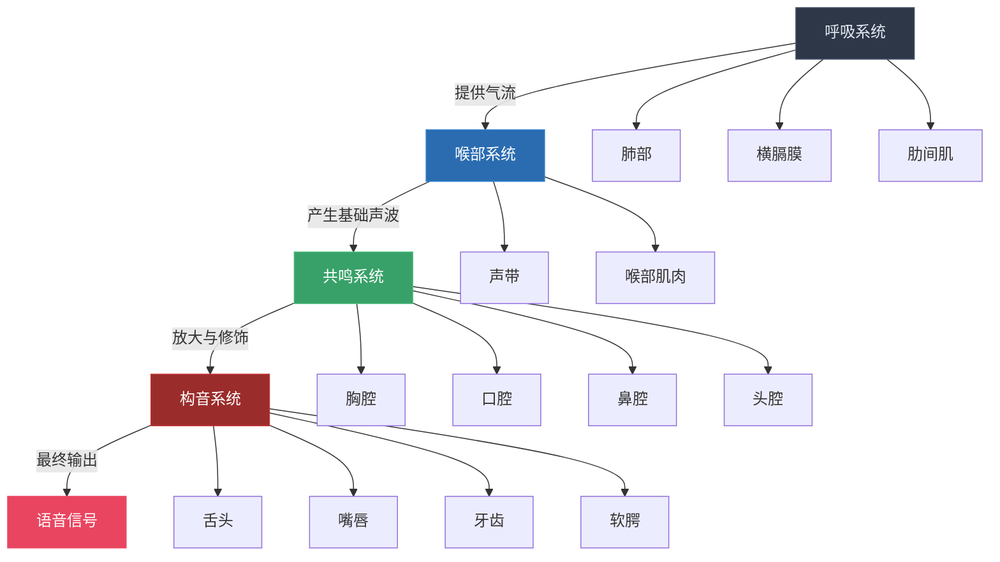
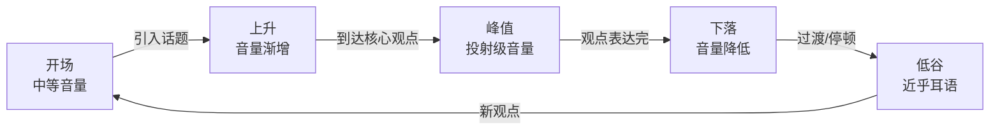
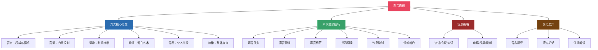

## 五、声音语调的精妙运用

> "声音是灵魂的乐器——同样的音符，不同的触键方式，可以奏出截然不同的乐章。" ——阿尔弗雷德·托马提斯（Alfred Tomatis）

在梅拉比安的"7-38-55法则"中，声音语调占据了情感传递的38%。这个数字常被低估——人们更愿意花时间练习手势和表情，却忽略了声音这个最具穿透力的非语言通道。声音语调（Paralanguage）是指除语言内容之外，由声音本身承载的全部信息：音高、音量、语速、停顿、共鸣、气息、音质以及伴随声音的各种非语言发声。它不仅传递"你在说什么"，更传递"你是谁""你感觉如何""你是否可信"。

本节将从发声的生理基础出发，系统讲解声音语调的六大核心维度、六大高级技巧、跨场景应用策略、常见误区纠正以及科学训练方法，帮助你真正掌控这个占情感传递38%的非语言通道。

### 5.1 声音的生理基础与发声原理

#### 5.1.1 人类发声的解剖学机制

要掌控声音，首先需要理解声音是如何产生的。人类发声涉及四个关键系统：

**第一环节：气流供给（呼吸系统）**

横膈膜收缩→胸腔扩张→空气经气管进入肺部→肺部呼出气流冲击声带。这是发声的动力源。呼吸方式直接决定了声音的稳定性和持久力——胸式呼吸浅而短，声音易抖；腹式呼吸深而稳，声音扎实。

**第二环节：声波产生（喉部系统）**

气流通过声带时，引起声带的快速开合振动（成人男性约110-130Hz，女性约200-250Hz），产生基础声波。声带的张力、厚度和长度共同决定了音高的高低。喉部肌肉控制声带的紧张程度——紧张时音高上升，松弛时音高下降。

**第三环节：共鸣放大（共鸣系统）**

声带产生的基础声波其实很微弱。共鸣系统——包括胸腔、口腔、鼻腔和头腔——将声波放大并赋予其音色特征。不同的共鸣位置产生不同的声音质感：胸腔共鸣产生浑厚低沉的声音，头腔共鸣产生明亮高亢的声音，口腔共鸣则是最常见的日常发声位置。

**第四环节：语音塑形（构音系统）**

舌头、嘴唇、牙齿和软腭的位置变化，将共鸣后的声波塑形为具体语音。但这一步主要影响的是语言内容的清晰度，对声音的情感色彩影响较小——情感色彩主要在前三步决定。

#### 5.1.2 为什么声音暴露一切

声音是最难"伪装"的非语言通道之一。原因在于发声涉及的肌肉群横跨自主和非自主神经系统——你可以刻意控制语速和音量，但气息的微颤、声带的紧张、共鸣位置的偏移，往往在你意识不到的情况下泄露真实情感。

具体而言，声音会泄露以下信息：

| 情感状态 | 声音特征 | 生理机制 |
|----------|----------|----------|
| 紧张/焦虑 | 声音发紧、音高上升、气息不稳 | 交感神经激活导致喉部肌肉紧张、呼吸浅快 |
| 自信/从容 | 音域宽、气息稳、停顿自然 | 副交感神经主导使呼吸深沉、喉部放松 |
| 悲伤/沮丧 | 音量降低、语速放慢、音域变窄 | 能量水平下降导致发声力度减弱 |
| 愤怒/激动 | 音量增大、语速加快、音高上升 | 肾上腺素分泌增加肌肉张力和心率 |
| 撒谎/不确定 | 填充词增多、音高波动异常、微停顿增加 | 认知负荷增大导致语言组织速度变化 |
| 厌倦/敷衍 | 音调平淡、缺乏起伏、共鸣位置单一 | 缺乏情感投入导致发声肌肉缺乏变化 |

这解释了为什么电话客服培训中，声音训练的时间往往超过话术训练——客户通过声音判断态度的速度远快于通过内容判断。

### 5.2 声音语调的六大核心维度

掌控声音不是单一技能，而是六个独立又交织的维度的协调运作。以下逐一深入分析。

#### 5.2.1 音高（Pitch）——声音的纵向空间

**定义**：音高是指声音的高低程度，由声带振动频率决定。人类可感知的音高范围约为80Hz到1100Hz，但日常对话通常集中在100Hz-300Hz之间。

**音高的心理学效应**：

| 音高倾向 | 传递的心理印象 | 典型场景 |
|----------|--------------|----------|
| 偏低沉 | 权威、可信、稳重、成熟 | 领导讲话、新闻播报、商务汇报 |
| 偏高亢 | 热情、兴奋、年轻、活力 | 欢迎致辞、销售推广、朋友聚会 |
| 音域窄 | 单调、无聊、缺乏情感 | 催眠式汇报、敷衍回应 |
| 音域宽 | 生动、有感染力、情感丰富 | 故事讲述、激励演讲、深度对话 |

**音高控制的关键原则**：

**原则一：找到你的"最优音高"。** 每个人都有一个听起来最自然、最舒服的音高区间——既不是你刻意压低的低音，也不是你紧张时的高音，而是你放松状态下自然说话的音高。找到它，用它作为你的默认音高。

练习方法：轻轻哼一段旋律，注意你哼出来的音高。然后用这个音高说"你好，很高兴认识你"。这个音高就是你的自然音高。然后尝试比它低半个音阶——你可能会发现声音立刻变得更有权威感和感染力。

**原则二：用音域宽窄表达情感浓度。** 当你讲述平淡的背景信息时，保持窄音域（±3-5个半音）；当你需要表达强烈情感（激动、震惊、感动）时，将音域扩大（±10-15个半音）。音域的突然扩大会在听者大脑中触发"警觉"信号——他们会本能地意识到"这里有重要的情感信息"。

**原则三：音高变化要与内容匹配。**

- 讲述故事中的对话部分：用不同音高区分不同角色
- 提问时：句尾音高上扬
- 做出判断时：句尾音高下降（传递确定感）
- 列举事物时：用渐变的音高标注顺序（从高到低或从低到高，保持一致性）

**常见错误**：

- **持续高音**：紧张时人的音高不自觉升高，长期高音会让人听起来不专业、不自信。纠正方法：在说话前做一个深呼吸，让横膈膜下沉，喉部自然放松
- **句尾上扬成"疑问调"**：陈述句也用疑问的上扬音高结尾，传递出不确定和不自信的信号。这在年轻职场人中特别常见。纠正方法：刻意练习将陈述句的最后一个字音高下降
- **音域过窄**：长期在一个极窄的音高范围内说话，让声音听起来"死板"。纠正方法：朗读练习时，将每一段第一个句子的音高定高半音，最后一句定低半音，中间自然过渡

#### 5.2.2 音量（Volume）——声音的力量投射

**定义**：音量是声音的强弱程度，由气流冲击声带的力度决定。音量不仅影响信息的物理可达性（是否能被听到），更直接影响说话者的情感表达和权威感。

**音量的四个层级及适用场景**：

| 层级 | 分贝范围（约） | 适用场景 | 情感传递 |
|------|--------------|----------|----------|
| 耳语级 | 30-40dB | 私密分享、亲密对话、戏剧性强调 | 亲密、信任、秘密 |
| 对话级 | 50-60dB | 日常交流、小组讨论、一对一谈话 | 自然、平等、舒适 |
| 投射级 | 65-75dB | 演讲、会议发言、课堂讲授 | 自信、权威、专业 |
| 号令级 | 80dB+ | 体育赛事、大空间演讲、紧急指令 | 激情、力量、紧迫 |

**音量控制的策略性技巧**：

**技巧一：音量的"聚光灯效应"。** 当你需要强调某个关键词时，有两种相反但同样有效的方式——要么突然提高音量（如雷声般轰鸣），要么突然降低音量（如耳语般轻柔）。后者往往更有效：当你在持续正常音量说话时突然降低音量，听者会本能地前倾身体、集中注意力，因为他们害怕错过。这是所有优秀演讲者的秘密武器——**声音的"下坠"比"上扬"更能抓住注意力**。

**技巧二：音量的"呼吸式"节奏。** 不要始终保持同一个音量。像呼吸一样，让音量在舒适范围内自然起伏：

**技巧三：音量的空间适配。** 不同空间需要不同的音量基准：

- 安静的办公室（<3人）：45-55dB即可
- 会议室（5-15人）：55-65dB
- 大型会场（50人+）：需要65-75dB以上，但更关键的是要有麦克风辅助
- 户外：需要额外增加5-10dB以抵消环境噪音

**常见错误**：

- **声嘶力竭**：大声不等于用力挤压喉咙。正确做法是增加气流供给（深呼吸+腹部发力），而不是收紧声带
- **越说越小声**：说话时气息逐渐耗尽，导致句子后半段音量骤降。纠正方法：在每句话前"偷气"（快速深吸一口气）
- **在错误的地方大声**：在别人分享隐私时大声回应，在安静的图书馆大声讨论——音量失控不仅传递错误的情感，还会破坏关系

#### 5.2.3 语速（Tempo/Rhythm）——声音的时间控制

**定义**：语速是单位时间内发音的字词数量。中文正常语速为每分钟150-200字，英文为每分钟130-170词。语速不仅影响信息的可理解性，更直接传递情感状态和说话者的心理特质。

**语速的三层心理学效应**：

**第一层：信息传递效率**

认知心理学研究表明，人类对口语信息的处理速度存在一个"最优区间"：

| 语速类型 | 中文字数/分钟 | 听者感受 | 信息留存率 |
|----------|-------------|----------|-----------|
| 过慢 | <120字 | 拖沓、无聊、缺乏效率 | 中等（注意力下降） |
| 适中 | 130-160字 | 舒适、清晰、值得信赖 | 最高 |
| 快速 | 170-200字 | 紧迫、热情、专业 | 较高（认知负荷增大） |
| 过快 | >210字 | 焦虑、不清晰、难以跟随 | 急剧下降 |

**第二层：情感状态映射**

听者的大脑会无意识地将语速与情感状态进行映射：

- 快速语速→紧迫、兴奋、紧张、热情
- 慢速语速→沉重、悲伤、权威、深思
- 突然加速→发现了重要信息、情绪激动
- 突然减速→即将说出重要的话、强调、警告

**第三层：人格特质推断**

长期的语速习惯会被听者用来推断说话者的人格特质。研究表明（Apple et al., 1979），语速较快的人被认为更聪明、更外向、更有能力，但也更紧张、更不值得信赖；语速较慢的人被认为更诚实、更可靠，但也更不聪明。这个发现的实操意义是：**语速适中是最佳策略**，而有意识的语速变化是进阶技巧。

**语速变化的四大策略**：

**策略一：重点减速。** 在关键词前0.5秒开始减速，将关键词的发音时间拉长2-3倍。比如："这个问题的关键——（减速）——在（拖长）于……" 减速后的关键词会自动被听者标记为"重要信息"。

**策略二：过渡加速。** 在背景信息、铺垫叙述、已知前提上适当加速（但不要超过200字/分钟），这样可以为后面的减速重点留出空间和时间。快慢对比比全程匀速更吸引人。

**策略三：情感加速。** 在讲述激动人心的故事、表达强烈情感时加速，让听者感受到你的情绪浓度。但注意：加速的同时要保持清晰度——如果加速导致发音含混，就过头了。

**策略四：停顿替代减速。** 有时候不需要减速，用一个停顿（0.5-2秒）替代效果更好。停顿比减速更有力量——它创造了真正的"静默"，让听者的大脑完全集中注意力。

#### 5.2.4 停顿（Pause）——声音的留白艺术

**定义**：停顿是指说话过程中有意或无意的沉默间隔。在所有声音技巧中，停顿是最容易被忽视却最具力量的一项——正如音乐中的休止符不是"没有音乐"，而是"音乐的一部分"。

停顿可以按照功能分为五种类型：

| 停顿类型 | 时长 | 功能 | 示例 |
|----------|------|------|------|
| 语法停顿 | 0.3-0.5秒 | 标注句子结构 | 句号、逗号处的自然停顿 |
| 强调停顿 | 1-2秒 | 标记重要信息 | "今天我想说的……（1.5秒）……只有一件事" |
| 悬念停顿 | 2-4秒 | 制造期待感 | "结果出乎所有人的意料……（3秒）……" |
| 消化停顿 | 3-5秒 | 给听者处理时间 | 在给出复杂数据或颠覆性观点后 |
| 情感停顿 | 2-5秒 | 传递尊重或共鸣 | 在对方表达强烈情感后，沉默地注视对方 |

**停顿的进阶使用策略**：

**策略一：停顿前置（Power Pause）。** 在开口说话前先停顿1-2秒。这在以下场景特别有效：

- 被提问后不要立刻回答，先停顿1-2秒再开口。这传递出"我在认真思考你的问题"
- 上台后不要立刻开始说话，先环顾全场、停顿2-3秒。这比"大家好，很高兴……"更有气场
- 在反驳对方前停顿。这比立刻反驳更有力量

**策略二：停顿填充的避免。** 很多人害怕停顿时的沉默，会不自觉地用"嗯""那个""就是""然后"等填充词（filler words）来"覆盖"空白。这是最常见也最有害的声音习惯。填充词不仅削弱了你的表达力，还在大脑中制造噪音，增加听者的认知负荷。

消除填充词的方法：

1. **意识**：让朋友在你说话时记录你的填充词频率
2. **接纳**：允许停顿的存在——告诉自己"沉默是力量，不是尴尬"
3. **替换**：当感觉到要"嗯"的时候，闭嘴（用闭嘴替代"嗯"）
4. **呼吸**：利用停顿的间隙深吸一口气，这样停顿变得有目的（呼吸），而不是空洞

**策略三：沉默的力量。** 最高级的停顿不是"没有说话"，而是"选择不说"。当对方分享了深层情感、当会议中出现了需要消化的信息、当你想要强调某个观点——有时候，什么都不说比说任何话都更有力。

#### 5.2.5 音质（Timbre/Voice Quality）——声音的"指纹"

**定义**：音质是声音的色彩和质感，由共鸣位置、声带振动方式、气息特点等综合决定。音质是声音的"个人签名"——即使两个人说完全相同的话，音质的差异也能让听者轻松分辨。

**音质的六个维度**：

| 维度 | 一端 | 另一端 | 影响因素 |
|------|------|--------|----------|
| 亮度 | 明亮/清脆 | 暗沉/低沉 | 口腔共鸣为主vs胸腔共鸣为主 |
| 温度 | 温暖/柔和 | 冷硬/锐利 | 声带闭合方式、气息量 |
| 厚度 | 浑厚/丰满 | 纤细/单薄 | 声带厚度、共鸣腔大小 |
| 湿度 | 润泽/圆润 | 干涩/沙哑 | 声带润滑度、水分摄入 |
| 清晰度 | 清晰/干净 | 含混/模糊 | 构音准确度、语速控制 |
| 共鸣感 | 共鸣丰富 | 扁平/鼻化 | 多腔共鸣vs单腔共鸣 |

**如何优化音质**：

**优化一：调整共鸣位置。** 大多数人说话只用口腔共鸣，声音扁平。练习以下共鸣层次：

- **胸腔共鸣**：手放在胸口，发"嗯——"的低音，感受胸口的振动。胸腔共鸣让声音更有厚度和权威感
- **口腔共鸣**：发"啊——"，让声音在口腔中"打开"。口腔共鸣是声音清晰度的基础
- **鼻腔共鸣**：发"嗯——"的中音，感受鼻梁处的振动。鼻腔共鸣增加声音的"暖色"
- **头腔共鸣**：发"嗯——"的高音，感受头顶/眉心处的振动。头腔共鸣增加声音的"亮度"

优秀的声音需要多个共鸣腔的协调配合——就像交响乐团需要所有乐器的协调。

**优化二：避免"紧张型"音质。** 喉部紧张是最常见的音质问题，表现为声音"挤""卡""紧"。放松方法：在说话前轻轻打哈欠，感受喉咙的"打开"状态，然后在这个状态下开始说话。

**优化三：保持声带湿润。** 声带干燥会导致声音沙哑、疲惫。实用建议：

- 每天饮水2000-2500ml
- 演讲前30分钟喝温水（不是冰水或热水）
- 避免演讲前喝含咖啡因饮料（咖啡因会使声带脱水）
- 在干燥环境中使用加湿器或薄荷糖（促进唾液分泌）

#### 5.2.6 韵律（Prosody）——声音的整体旋律

**定义**：韵律是音高、音量、语速、停顿和音质的综合运用所形成的声音"旋律"。韵律是声音语调的最高层级——单独的音高、音量或语速只是"音符"，韵律才是把这些音符编排成"乐曲"的总谱。

**韵律的三种基本模式**：

**模式一：陈述型韵律（Declarative Prosody）**

特征：音高逐句下降，语速均匀，停顿规律。传递的信息是"我在陈述事实"。适用于数据汇报、新闻播报、技术说明。

句式示范：音高起始在一个稳定的基线——中间保持平稳——最后一个音节音高下降——完成一个完整的"陈述弧线"。

**模式二：疑问型韵律（Interrogative Prosody）**

特征：句尾音高上升，语速略快，传递"这是一个问题"的信号。但需注意：疑问韵律用于真正的提问时是正常的，但如果在陈述句中也使用疑问韵律（句尾上扬），就会传递不确定、不自信的信号。

**模式三：感叹型韵律（Exclamatory Prosody）**

特征：音高变化幅度大，音量有突然的增减，语速有突然的快慢变化。传递的是强烈情感——惊叹、激动、愤怒、感动。

**韵律的进阶——情感弧线设计**：

高级的韵律运用不是逐句调整声音，而是为整段话设计一条"情感弧线"。就像电影配乐为整个场景设计情绪走向一样，你的声音韵律应该为整段表达设计一条声音的情绪曲线。

以一个5分钟的工作汇报为例：

| 时间段 | 韵律特征 | 目的 |
|--------|----------|------|
| 0:00-0:30 | 中等音量、中等语速、稳定音高 | 建立信任，"一切正常" |
| 0:30-1:30 | 语速渐快、音量渐增、音域展开 | 吸引注意力，"有重要信息" |
| 1:30-2:30 | 减速、停顿增加、音高降低 | 强调核心观点，"这是关键" |
| 2:30-3:30 | 恢复中等、加入对比变化 | 展示分析过程，"证据充分" |
| 3:30-4:30 | 音量渐增、语速适中偏快 | 表达信心，"我的结论是" |
| 4:30-5:00 | 渐慢、音高下降、最后的停顿 | 收尾有力，"期待反馈" |

### 5.3 六大高级声音技巧

掌握六大基础维度后，以下六项高级技巧将帮助你在关键场景中实现声音的策略性运用。

#### 5.3.1 声音锚定（Vocal Anchoring）

**原理**：在特定语速/音高/音量组合下表达特定情感，经过反复练习后形成"声音锚点"——你需要表达某种情感时，只需调用对应的"声音设置"即可。

**训练方法**：

1. 选择一种情感（如自信），设计它的声音配置：中低音高+中等音量+中速偏慢语速+清晰的停顿
2. 用这个配置朗读3-5段不同内容的文字
3. 在3-5个日常场景中使用这个配置
4. 经过2-3周练习后，这个配置会成为"自信"的声音锚点——你需要自信时，只需"调用"它

#### 5.3.2 声音镜像（Vocal Mirroring）

**原理**：适度模仿对方的声音特征（语速、音量、音调倾向），可以建立无意识的亲和感。这与身体语言中的"镜像效应"原理相同——人类倾向于喜欢与自己"相似"的人。

**使用策略**：

- **语速镜像**：如果对方说话较慢，你不要比他快——放慢到接近他的节奏
- **音量镜像**：如果对方声音较轻，降低你的音量至接近他的水平
- **音调镜像**：注意对方的音调倾向（高/低），适度靠拢

**注意**：镜像不是模仿——你不是在学对方说话，而是在30%的范围内向对方靠拢。过度模仿会被察觉并引发反感。

#### 5.3.3 声音标签（Vocal Labelling）

**原理**：为不同类型的内容赋予特定的声音"标签"，让听者通过声音特征即可区分内容类别，无需等到理解语言内容后。

**实用标签系统**：

| 内容类型 | 声音标签 | 效果 |
|----------|----------|------|
| 数据/事实 | 语速适中、音高偏低、停顿清晰 | 传递严谨和权威 |
| 故事/案例 | 语速渐快、音域展开、加入角色音调 | 传递生动和吸引力 |
| 核心观点 | 减速、音量增加、停顿前置 | 传递重要和不可错过 |
| 过渡/连接 | 语速加快、音量降低、减少停顿 | 传递"这部分快速过" |
| 情感表达 | 音域大幅展开、语速变化剧烈 | 传递真诚和投入 |

#### 5.3.4 共鸣切换（Resonance Shifting）

**原理**：通过改变共鸣位置来切换声音的情感色彩，而不需要改变语言内容。

**四种共鸣的情感对应**：

| 共鸣位置 | 声音质感 | 情感色彩 | 适用场景 |
|----------|----------|----------|----------|
| 胸腔共鸣为主 | 浑厚、低沉 | 权威、深沉、可靠 | 领导讲话、发表声明 |
| 口腔共鸣为主 | 清晰、明亮 | 专业、理性、客观 | 工作汇报、技术讲解 |
| 鼻腔共鸣为主 | 温暖、柔和 | 亲切、关怀、共情 | 安慰他人、深度对话 |
| 头腔共鸣为主 | 明亮、锐利 | 激情、兴奋、号召 | 动员讲话、庆祝时刻 |

**实战应用**：在一段讲话中，当内容从"数据陈述"转向"个人故事"时，将共鸣从口腔切换到胸腔/鼻腔——听者会无意识地感受到"这段内容的情感基调变了"，而你甚至不需要用语言说"接下来我想分享一个故事"。

#### 5.3.5 气息控制（Breath Management）

**原理**：气息是声音的"燃料"。气息不足导致声音虚弱、句子断裂、语速失控。气息控制能力是所有声音技巧的基础——没有稳定的气息，任何声音技巧都无从谈起。

**三种核心呼吸方式的对比**：

| 呼吸方式 | 特征 | 优点 | 缺点 | 适用场景 |
|----------|------|------|------|----------|
| 胸式呼吸 | 肩膀上升、胸部扩张 | 吸气快 | 浅、不稳、易疲劳 | 紧急/短句 |
| 腹式呼吸 | 腹部鼓起、肩膀不动 | 深、稳、持久 | 需要练习 | 日常说话、演讲 |
| 胸腹联合呼吸 | 胸腹同时扩张 | 最大气息量 | 技术难度高 | 专业演讲、播音 |

**腹式呼吸练习（基础版）**：

1. 仰卧在平坦表面上，将一本轻薄的书放在腹部
2. 用鼻子缓慢吸气4秒，观察书本上升（腹部鼓起）
3. 用嘴缓慢呼气8秒，观察书本下降（腹部收缩）
4. 重复10次，每天早晚各一组
5. 习惯后改为坐姿练习，再改为站姿练习

**气息延续练习（进阶版）**：

1. 深吸一口气
2. 用"嘶——"（齿缝出气）尽可能长时间地呼气
3. 记录时间。初学者通常为15-20秒，目标是30-40秒
4. 每天练习3次，每周延长2-3秒

#### 5.3.6 声音的情感着色（Emotional Coloring）

**原理**：同一句话在不同情感着色下传递完全不同的信息。掌握情感着色能力，意味着你可以在不改变语言内容的情况下，精确控制传递的情感。

**情感着色对照表**：

| 情感 | 音高 | 音量 | 语速 | 停顿 | 音质 | 共鸣位置 |
|------|------|------|------|------|------|----------|
| 自信 | 中低、稳定 | 中等偏强 | 中等、稳定 | 在关键处 | 清晰、扎实 | 胸腔+口腔 |
| 温暖 | 中等、柔和 | 中等偏轻 | 中等偏慢 | 自然、不催促 | 润泽、圆润 | 鼻腔+口腔 |
| 激情 | 中高、波动大 | 偏大、有起伏 | 偏快、有加速 | 少而精准 | 明亮、有力 | 头腔+口腔 |
| 沉重 | 低、缓慢变化 | 轻 | 慢 | 多而长 | 暗沉、低沉 | 胸腔 |
| 幽默 | 音高变化大 | 中等、有突然变化 | 有快有慢 | 在"笑点"前 | 轻松、上扬 | 口腔+鼻腔 |
| 同理 | 中等、匹配对方 | 匹配对方 | 匹配对方 | 给对方空间 | 柔和、包容 | 鼻腔 |

**练习方法**：选择一句中性的话（如"我们明天下午三点开会"），用上表中6种情感分别说出来。录音回放，检查每种着色是否准确传递了目标情感。如果可以找一个朋友作为"听者"——让他闭眼听你用不同情感说同一句话，然后判断你传达的情感。正确率80%以上说明你已经掌握了基本的情感着色能力。

### 5.4 不同场景的声音策略

声音语调的运用不是"一招鲜"，而是需要根据场景的性质、听众的构成、信息的类型进行策略性调整。

#### 5.4.1 演讲场景

演讲是声音技巧的"终极考场"——你需要在大空间中、面对大量听众、长时间持续说话，同时保持声音的吸引力和感染力。

**演讲的声音检查清单**：

- [ ] 演讲前30分钟进行声音热身（哼鸣、绕口令、深呼吸）
- [ ] 确认场地的音响条件（有无麦克风、回声大小、背景噪音）
- [ ] 设计整场演讲的"情感弧线"（开始、发展、高潮、结尾的韵律变化）
- [ ] 标注演讲稿中需要减速/停顿/提高音量的关键位置
- [ ] 准备至少2个"声音突变"点（突然的音量降低或停顿），用于重新抓住走神听众的注意力
- [ ] 练习呼吸节奏——每5-8句话做一次深呼吸，在自然停顿处完成

#### 5.4.2 会议/汇报场景

**核心要求**：清晰、专业、有节奏感。

- **开头**：用中低音高、稳定音量开始，传递"这是一个专业汇报"的信号
- **数据部分**：减速、清晰发音、在关键数据后停顿1-2秒
- **分析部分**：恢复中等语速，用音调变化区分"事实"和"我的判断"
- **结论部分**：音量略微增加、语速略微加快、音高略微下降——传递"我有信心"的信号

#### 5.4.3 一对一深度对话

**核心要求**：温暖、真诚、有共鸣。

- 音量降低到舒适对话级别（比公开说话低10-15dB）
- 语速匹配对方（如果对方说话慢，不要比他快太多）
- 增加倾听时的"嗯""是的"等回应性声音（但不要过度打断）
- 对方分享情感内容时，降低语速、增加停顿
- 使用鼻腔共鸣为主的音质，传递温暖和关怀

#### 5.4.4 电话/语音通话

**特殊挑战**：失去了视觉通道后，声音语调承载了100%的非语言信息。

- **开头至关重要**：第一声"喂"或"你好"的音质决定了对方对你的第一印象——用微笑时的音调（微微上扬）说话，即使对方看不到你的脸
- **增加声音反馈密度**：因为对方看不到你的点头和表情，需要更频繁地用"嗯嗯""对""明白了"等声音反馈替代视觉反馈
- **注意回声和延迟**：电话/视频的延迟可能打断你的语速节奏——在对方停顿时多等1秒再回应
- **音量适度放大**：电话的麦克风灵敏度不如面对面，音量比面对面增加5-10%

#### 5.4.5 视频会议

**特殊挑战**：视频压缩可能损失声音细节，双讲检测可能截断声音。

- **说前停顿0.5秒**：避免与他人同时开口的"碰撞"
- **音调比面对面略微夸张**：视频压缩会"磨平"微妙的音调变化，需要稍微放大表达幅度
- **靠近麦克风但不要喷麦**：保持与麦克风15-20cm的距离，避免"p""b"等爆破音导致的喷麦
- **确保网络延迟下仍然有停顿**：网络延迟可能让短暂的停顿显得更长——不要因此加速说话

#### 5.4.6 谈判/说服场景

**核心要求**：权威、控制、有说服力的节奏。

- **开场**：用偏低的音高和适度的音量建立权威感
- **陈述立场**：减速、停顿前置、在核心条款上用"强调停顿"
- **回应反对**：先停顿2-3秒（传递"我在认真考虑你的意见"），然后用平稳的语速回应
- **施加压力**：在关键条件上，降低语速到近乎"一个字一个字地说"——这种"咬字感"传递出"我不让步"的信号
- **让步时刻**：音调略微柔和、语速加快——传递"我在做出善意的表示"

### 5.5 声音语调的文化差异

声音语调的解读规则因文化而异。同样的声音特征在不同文化中可能传递截然不同的信息。

#### 5.5.1 音高期望的文化差异

| 文化区域 | 男性音高期望 | 女性音高期望 | 权威声音特征 |
|----------|------------|------------|------------|
| 北美/西欧 | 低沉为佳 | 中等偏低为佳 | 低音高、稳定、缓慢 |
| 东亚（中日韩） | 中等即可 | 不特别追求低音 | 清晰、有条理、不急躁 |
| 中东 | 低沉、有力 | 中等 | 有力量感、坚定 |
| 拉丁美洲 | 中等 | 不特别限制 | 富有感情、有起伏 |

#### 5.5.2 语速期望的文化差异

| 文化区域 | 正常语速感受 | 专业场景语速 | 潜在误解 |
|----------|------------|------------|----------|
| 北美 | 中速偏快 | 偏快（效率=能力） | 过快显得焦虑，过慢显得不聪明 |
| 东亚 | 中速偏慢 | 中速（稳重=专业） | 过快显得不沉稳 |
| 南欧/拉美 | 中速偏快 | 有快有慢 | 过慢显得无精打采 |
| 北欧 | 中速 | 中速偏慢 | 过快显得不理性 |

#### 5.5.3 停顿的文化差异

停顿的解读存在深刻的文化差异，这是跨文化沟通中最容易引发误解的声音特征：

- **北美/西欧**：停顿超过1-2秒可能被解读为"不知道答案""失去思路"或"尴尬"
- **东亚（日本尤为典型）**：停顿是尊重和思考的信号。日语中有"間"（ma）的概念——有意义的沉默比说话更有价值
- **北欧（芬兰、瑞典）**：沉默是舒适的。芬兰有"沉默不是需要填补的空白"的社交规范
- **中东/拉美**：停顿较短，长时间沉默可能被解读为"对方不开心"或"关系出现裂痕"

### 5.6 常见误区与纠正

#### 误区一："声音是天生的，无法改变"

**真相**：声音具有高度可塑性。声带是肌肉，共鸣腔可以通过训练调整，气息可以通过练习强化。播音员、演员、歌手都不是天生就拥有"好声音"——他们通过系统训练获得了理想的声音。普通人通过2-3个月的持续练习，声音质量可以发生显著改变。

#### 误区二："大声说话=有气场"

**真相**：气场来自声音的控制力，不是音量的大小。一个能够在全场安静时用耳语般音量抓住所有人注意力的演讲者，比一个从头到尾大吼大叫的人有气场得多。真正的力量是"我能控制音量的大小，而不是音量在控制我"。

#### 误区三："快语速=高效沟通"

**真相**：快语速≠高效率。研究表明，当语速超过听众的舒适处理速度时，信息留存率急剧下降。最高效的沟通不是说得快，而是在正确的地方快、在正确的地方慢、在正确的地方停。一个关键的2秒停顿，胜过10秒的快速输出。

#### 误区四："填充词（嗯/那个/就是）无所谓"

**真相**：填充词是声音的"杂草"。每一个"嗯"都在做两件事：(1)消耗听者的注意力资源，(2)削弱你的表达力和权威感。研究显示，频繁使用填充词的演讲者被认为更不自信、更不专业。去除填充词是声音提升的第一步，也是投入产出比最高的一步。

#### 误区五："模仿名人的声音就能成功"

**真相**：声音的有效性取决于"真实感"。一个天生声音较高的人试图模仿低沉的"领导腔"，结果不是"有权威感"，而是"在装"。最有效的声音策略是在你自然声音的基础上，有意识地优化关键维度（共鸣、气息、停顿），而不是彻底改变你的声音特征。

#### 误区六："声音训练只需要练'说话'"

**真相**：声音训练50%在练"发声"，50%在练"倾听"。你需要训练自己的耳朵——能够分辨音高、音量、语速的细微差异，能够判断一个声音"哪里有问题"。只有当你能听到问题时，你才能修正它。

### 5.7 科学训练计划

声音训练遵循"感知→基础→应用→内化"的四阶段路径。以下是为期8周的系统训练计划：

#### 第1-2周：感知阶段

**目标**：建立对声音的觉察能力。

| 日练习 | 内容 | 时长 |
|--------|------|------|
| 练习A | 录下自己3分钟的日常对话或朗读，回放分析：音高、音量、语速、停顿、填充词 | 15分钟 |
| 练习B | 听一段播客或演讲，标注演讲者的停顿位置和语速变化 | 10分钟 |
| 练习C | 腹式呼吸练习（仰卧→坐姿→站姿） | 10分钟 |

#### 第3-4周：基础阶段

**目标**：建立正确的声音基础。

| 日练习 | 内容 | 时长 |
|--------|------|------|
| 练习D | 共鸣练习：分别用胸腔、口腔、鼻腔、头腔共鸣发声各1分钟 | 10分钟 |
| 练习E | 音域扩展：从最低音滑到最高音，再滑回来。重复5次 | 5分钟 |
| 练习F | 气息延续：用"嘶——"维持30秒以上 | 5分钟 |
| 练习G | 朗读练习：用不同情感（自信/温暖/激情/沉重）读同一段文字 | 15分钟 |

#### 第5-6周：应用阶段

**目标**：将基础训练应用到实际场景中。

| 日练习 | 内容 | 时长 |
|--------|------|------|
| 练习H | 模拟场景练习：选择一个实际场景（汇报/谈判/闲聊），预设声音策略后执行 | 20分钟 |
| 练习I | 填充词消除：录音一段3分钟的即兴表达，统计填充词数量，目标每分钟<2个 | 10分钟 |
| 练习J | 停顿练习：朗读一篇短文，在所有标注的关键词前加1秒停顿 | 10分钟 |

#### 第7-8周：内化阶段

**目标**：让声音技巧成为本能。

| 日练习 | 内容 | 时长 |
|--------|------|------|
| 练习K | 即兴表达练习：随机选择一个话题，说2分钟。录音回放分析 | 15分钟 |
| 练习L | 真实场景应用：在一次真实对话/会议中，有意识地使用一个声音技巧 | —— |
| 练习M | 周末总结：对比本周和第1周的录音，评估进步 | 20分钟 |

### 5.8 小结：声音语调的核心要点

**五条黄金法则**：

1. **呼吸是声音的基础**——没有稳定的气息，所有声音技巧都是空中楼阁
2. **变化比完美更重要**——一个有起伏的声音比一个"完美但单调"的声音更有感染力
3. **停顿是最有力的声音**——学会沉默，就是学会力量
4. **声音需要与内容一致**——声音是语言的"服装"，它应该合身而不是抢戏
5. **声音是可以训练的**——每天20分钟，8周后你的声音将脱胎换骨

***

> **延伸阅读**：声音语调是"副语言学"（Paralinguistics）的核心研究对象。推荐参考Rodney Jones的《Spoken Discourse》（2012）和John Pittam的《Voice in Social Interaction》（1994）深入了解声音的理论框架。实操训练方面，推荐Voice and Speech Trainers Association（VASTA）的系统训练方法论。
