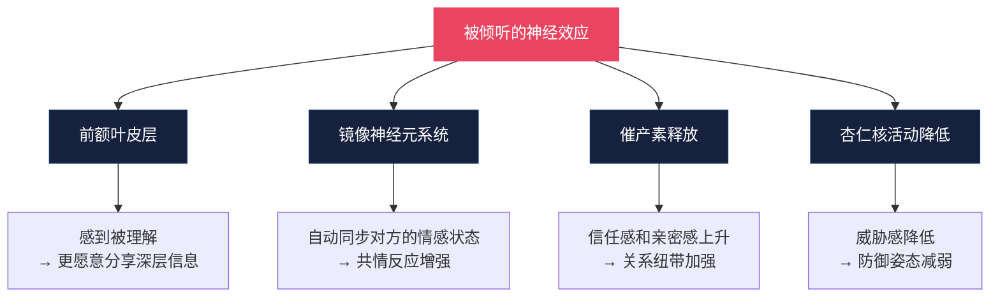
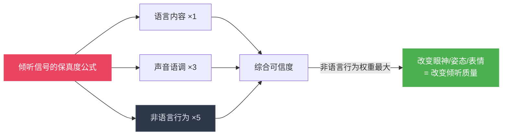
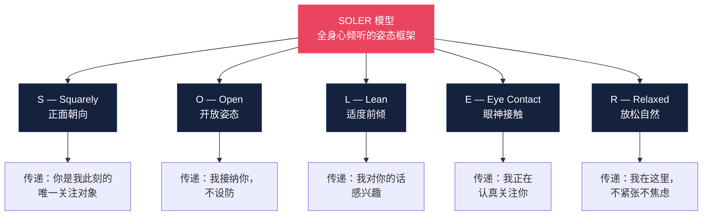
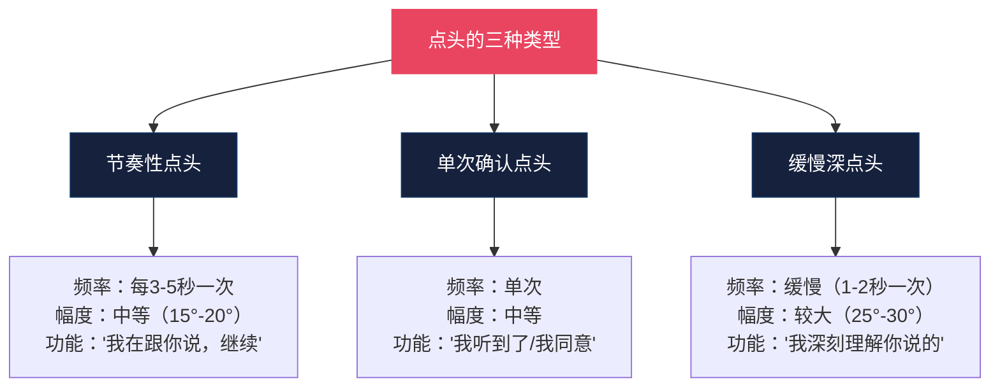

## 六、倾听中的非语言技巧

> "大多数人不是在倾听，而是在等待说话的机会。" ——斯蒂芬·柯维（Stephen R. Covey）

在所有非语言沟通技巧中，倾听是最容易被低估的一项。人们花大量时间练习"怎么说"——手势、表情、语调——却忽略了"怎么听"同样是决定沟通质量的关键变量。拉里·金（Larry King）曾说："我从谈话中学到的东西，永远比我沉默时学到的少。"这句话的反面是：**你在倾听时传递的非语言信号，比你开口说的任何话都更能决定对方是否愿意继续对你敞开心扉。**

本节将从倾听的神经科学基础出发，系统讲解倾听中非语言信号的完整体系——从眼神接触到身体姿态，从反馈性动作到镜像神经元的共情机制，从基础的 SOLER 模型到高级的"情绪频率匹配"技巧——帮助你真正成为那种"让人想对你倾诉"的人。

### 6.1 为什么倾听需要非语言技巧

#### 6.1.1 倾听不只是"听到声音"

人类的听觉系统每秒处理约 30,000 条感官信息，但大脑的意识通道每秒只能处理约 50 条。这意味着，在任何一次对话中，听者有大量的注意力余量可以用于其他任务——这既是倾听的挑战（注意力容易漂移），也是倾听的机会（你可以用多余的注意力来管理自己的非语言信号）。

神经科学研究表明，当一个人感觉自己"被倾听"时，大脑的以下区域会被激活：

这解释了一个关键事实：**"被倾听"本身就会改变一个人的大脑状态。** 当对方感到你真的在听，他的防御会降低、信任会上升、分享的深度会增加。而这一切的前提，不是你听到了多少内容，而是你用非语言信号让对方"感觉到"你在听。

#### 6.1.2 倾听信号的"保真度"问题

心理学家阿尔伯特·梅拉比安（Albert Mehrabian）的研究揭示了一个在倾听场景中尤为重要的现象：当语言信息和非语言信息发生矛盾时，听者会相信非语言信号。应用到倾听上意味着——

如果你嘴上说"我在认真听"，但你的身体后仰、眼神游离、手指在敲桌面，对方的大脑会接收非语言信号并得出结论："他根本没在听。" 这就是为什么倾听中的非语言管理不是"锦上添花"，而是"基础地基"。

#### 6.1.3 倾听的四种层级

并非所有的倾听都相同。根据心理学家迈克尔·尼科尔斯（Michael Nichols）的分类，倾听可以分为四个层级，每个层级对非语言信号的要求不同：

| 层级 | 描述 | 非语言特征 | 效果 |
|------|------|-----------|------|
| 听而不闻 | 名义上在听，注意力完全不在 | 眼神空洞、身体僵硬、无反馈动作 | 对方很快停止分享 |
| 选择性倾听 | 只听自己感兴趣的部分 | 偶尔点头、在"感兴趣"的部分突然身体前倾 | 对方感觉被"挑拣" |
| 专注倾听 | 全程关注对方的语言内容 | 持续的眼神接触、规律点头、适当回应 | 对方感到被尊重 |
| 共情倾听 | 不仅听内容，更感受情感 | 表情同步、身体镜像、呼吸同频 | 对方感到"被理解" |

本节的目标是帮助你从"专注倾听"提升到"共情倾听"——这是通过非语言技巧实现的质的飞跃。

### 6.2 SOLER 模型：倾听姿态的黄金框架

SOLER 模型由英国心理咨询师杰拉德·伊根（Gerard Egan）在《高明的助人者》一书中提出，是心理咨询领域最经典的倾听姿态框架。它的价值在于将抽象的"认真倾听"转化为五个可观察、可练习、可评估的具体行为要素。

#### 6.2.1 S — Squarely（正面对向）

**核心含义**：将身体正面朝向对方，形成一种"你和我面对面"的姿态。

**具体操作**：
- 坐着时，将躯干（不仅是头部）转向对方，形成大约 30°-45° 的夹角（不一定要完全正对——完全正对在某些场景下可能让人感到"被审视"）
- 站着时，将双脚朝向对方的方向（脚尖指向是身体真实朝向最诚实的指标）
- 在多人对话中，将身体正面朝向当前说话的人

**传递的信号**："你是我此刻的全部关注对象，我没有在看别处、没有在准备离开。"

**常见错误**：
- **只转头不转身**：身体朝向门口或屏幕，只有头转向说话者。对方的大脑会本能地解读："他随时准备离开"或"那扇门比我更吸引他"
- **完全正对的"面试姿态"**：过度正对（90°）会营造出"审问"的感觉，让对方感到压力。研究表明（Mehrabian, 1972），30°-45° 的夹角最能传递关注同时又不构成威胁
- **多人场景中的"漏人"**：在小组讨论中，只朝向主要发言者而背对其他成员。解决方案：在不同人发言时微微转向，让每个人都能感受到你的关注

**场景调整**：
- 亲密对话：可以接近完全正对（60°-90°），传递更高程度的专注
- 商务会谈：45° 最佳，既传递专业关注又保持适当距离
- 轻松社交：30° 即可，避免给人"正式采访"的感觉

#### 6.2.2 O — Open（开放姿态）

**核心含义**：保持身体的开放性，避免任何在身体和对方之间形成"屏障"的姿势。

**开放 vs 封闭姿态的对比**：

| 开放姿态 | 封闭姿态 | 对方感受到的信号 |
|----------|----------|-----------------|
| 双手自然放在腿上或桌面 | 双臂交叉在胸前 | 接纳 vs 防御 |
| 手掌朝上或可见 | 握拳或双手插兜 | 真诚 vs 隐藏 |
| 身体朝向对方 | 身体侧转或后靠 | 感兴趣 vs 想离开 |
| 双腿自然分开或平行 | 二郎腿或双腿缠绕 | 放松 vs 紧张 |
| 面部肌肉放松 | 下巴紧绷、眉头皱起 | 平和 vs 不耐烦 |

**"交叉"的双重含义**：需要注意的是，双臂交叉并不总是传递封闭信号。在寒冷的环境中、在对方没有安全感需要"自我安抚"的场景中，交叉双臂可能是一种自然的身体反应。判断的关键不是孤立地看某一个姿势，而是看"信号簇"——如果对方交叉双臂的同时身体前倾、眼神接触、点头，那交叉双臂只是舒适的坐姿而非防御信号。

**双手的处理方式**：
- **最佳**：双手自然放在膝盖上（坐着时）或身体两侧（站着时），手掌微微张开或朝上
- **良好**：双手轻放在桌面上，手指自然交叠（不是"绞手指"）
- **可用**：一手自然放置，另一手轻触下巴或腮帮（传递"我在认真思考"）
- **避免**：双手抱胸、双手插兜、反复摸手机、搓手指

#### 6.2.3 L — Lean（适度前倾）

**核心含义**：身体微微向对方倾斜，传递"我在靠近你说的话"的信号。

**前倾的物理学与心理学**：

从物理学角度看，前倾是一种"趋近行为"——人类本能地向自己感兴趣的事物靠近，远离自己不感兴趣或感到威胁的事物。听者前倾身体时，说话者的大脑会无意识地解读这个信号为"他对我感兴趣"，从而释放更多关于分享意愿的信号。

**前倾角度的分寸感**：

| 前倾角度 | 传递的信号 | 适用场景 |
|----------|-----------|----------|
| 后仰（负前倾） | 不感兴趣、放松、权威 | 非正式闲聊、需要传递权威感时 |
| 直立（0°） | 中性、正式 | 标准社交/商务场景 |
| 微前倾（5°-15°） | 感兴趣、关注 | 大多数倾听场景的最佳选择 |
| 明显前倾（15°-30°） | 强烈兴趣、投入 | 对方分享重要内容时 |
| 大幅前倾（30°+） | 过度热情、可能侵入空间 | 通常不建议，除非是亲密关系 |

**"前倾-回弹"节奏**：

最自然的倾听姿态不是保持一个固定的前倾角度，而是根据内容的重要性和情感浓度，形成一个"前倾-回弹"的自然节奏：
1. 对方开始讲述一个话题 → 你微微回正（0°-5°）
2. 对方说到关键内容 → 你自然前倾（10°-20°）
3. 对方说完一个段落 → 你回正并点头确认
4. 对方进入情感高潮 → 你再次前倾并配合表情同步

这个节奏不是刻板的"三步一前两步一退"，而是像呼吸一样自然——你的身体随对方话语的"呼吸"而起伏。

#### 6.2.4 E — Eye Contact（眼神接触）

**核心含义**：保持自然的、有节奏的眼神接触，传递"我在看你、关注你"的信号。

眼神接触是所有非语言信号中最强烈的"社会参与"信号。神经科学研究表明，眼神接触会激活大脑的"社会脑网络"（social brain network），包括内侧前额叶皮层、颞顶联合区和杏仁核。当两个人进行眼神接触时，两人的大脑活动会出现短暂的"同步"现象（Koike et al., 2016）。

**倾听中眼神接触的"60-70法则"**：

心理学家迈克尔·阿盖尔（Michael Argyle）的研究发现，在西方文化中，倾听时的眼神接触占总时间的 60%-70% 是最理想的。这个比例既传递了关注和信任，又避免了"凝视"带来的压迫感。

| 眼神接触比例 | 对方感受到的信号 |
|-------------|-----------------|
| <30% | 不感兴趣、不信任、想要离开 |
| 30%-50% | 礼貌但缺乏深度关注 |
| 50%-70% | 最佳区间——关注、真诚、舒适 |
| 70%-85% | 强烈兴趣或开始感到"被审视" |
| >85% | 不舒服、有压力、可能感到被威胁 |

**"三角扫视法"**：

避免死盯着对方的眼睛——那会变成"凝视"。自然的眼神接触模式是"三角扫视"：
1. 对方左眼（2-3秒）
2. 对方右眼（2-3秒）
3. 对方鼻梁或嘴部区域（1-2秒）
4. 短暂移开视线（0.5-1秒）
5. 回到眼睛区域

**倾听时视线的"自然漂移"**：

当对方在思考或讲述复杂内容时，你的视线自然地微微上移或偏向一侧是正常的——这表明你也在"内化处理"对方的信息。关键是这种漂移应该是：
- 短暂的（1-3秒内回到对方面部）
- 有方向的（向上或向侧——向下看通常被解读为害羞、不想看、或无聊）
- 有回弹的（漂移后自然地回到眼神接触，形成一个完整的"注视-漂移-回弹"循环）

**文化差异的重要提醒**：
- **东亚文化（中国、日本、韩国）**：倾听时的眼神接触时间通常比西方文化短。长时间直视可能被视为不礼貌或"挑衅"，尤其在面对长辈或权威人物时。建议比例：40%-60%
- **中东文化**：同性之间的眼神接触时间较长且更直接；异性之间则需要更谨慎
- **拉丁美洲**：眼神接触较频繁且热情，是表达亲近的方式
- **北欧**：眼神接触相对克制，但保持诚实

#### 6.2.5 R — Relaxed（放松自然）

**核心含义**：身体保持放松、自然、不紧张的状态。

这是 SOLER 中最容易被忽略却最重要的一环。一个紧张的倾听者——肩膀耸起、呼吸急促、手指不安地敲击——即便做到了 S、O、L、E 的所有要求，也传递出焦虑和不舒适，这会让说话者感到"我的倾诉给他造成了负担"。

**放松状态的三个检查点**：

| 检查点 | 紧张信号 | 放松信号 | 快速调整方法 |
|--------|---------|---------|------------|
| 肩膀 | 耸起、靠近耳朵 | 自然下沉、远离耳朵 | 深吸一口气，呼气时让肩膀自然落下 |
| 下巴 | 紧咬牙关、下巴前伸 | 微微后收、嘴唇微张 | 轻轻打一个哈欠，感受下巴的放松 |
| 双手 | 紧握、反复摩擦、绞手指 | 自然展开、放在舒适位置 | 先用力握拳5秒，然后完全松开 |

**"放松但不松懈"的平衡**：

放松不等于懈怠。一个"瘫"在椅子上的倾听者传递的不是放松而是无聊。放松的姿态应该是：
- 背部自然挺直（不是挺胸收腹的"军人姿态"，也不是弯腰驼背的"沙发土豆"）
- 身体的重量均匀分布（不偏向一侧、不在椅子上"滑"）
- 面部表情平和（不紧绷也不呆滞）

### 6.3 眼神接触的进阶技巧

眼神接触在 6.2.4 中已经介绍了基础框架。本节聚焦于高级运用技巧。

#### 6.3.1 "情感浓度"眼神调整

不同类型的内容需要不同浓度的眼神接触：

| 对方正在讲述 | 眼神接触策略 | 原因 |
|------------|------------|------|
| 事实性信息 | 正常接触（60-70%），可偶尔移开思考 | 不需要过度"情感投入" |
| 个人经历 | 增加接触（70-80%），减少移开 | 传递"你的经历值得我全神关注" |
| 情感表达 | 高度接触（80%+），减少甚至暂停移开 | 情感分享时的"视线断裂"会被解读为逃避 |
| 尴尬/羞耻内容 | 略微减少（50-60%），短暂看向别处 | 给对方"喘息空间"，避免"被审视"感 |
| 复杂/抽象内容 | 减少接触（40-50%），伴随"思考"式上移 | 表明你在"消化"而非走神 |

#### 6.3.2 "情感缓冲"眼神技术

当对方向你倾诉痛苦或尴尬的内容时，持续的直视可能会让对方感到"无处可逃"。"情感缓冲"技术是：在对方说到最痛苦的部分时，将视线短暂移开（看向侧面或下方），保持1-2秒，然后以温暖的目光回到对方。这个短暂的移开传递的是"我理解这很难说出口，我给你一点空间"——但关键是要在移开后"回来"，而不是一直回避。

#### 6.3.3 "听到重点"时的眼神信号

当你听到对方说出重要的、关键的、出乎意料的信息时，用眼神传递"我听到了"的信号：
- 短暂的"瞳孔放大"（感兴趣/惊讶时的自然生理反应）
- 微微抬头（"让我再想想你说的"）
- 凝神注视（在对方说到关键点时，将眼神接触的持续时间延长1-2秒）

### 6.4 倾听中的反馈性动作

反馈性动作是倾听中最核心的"回应通道"——它们告诉说话者"我在听、我理解、请继续"。没有反馈的倾听，对说话者来说就像对着一面墙说话。

#### 6.4.1 点头的科学

点头是最经典、最普遍的倾听反馈动作。但不是所有点头都相同——点头的频率、幅度、时机和上下文决定了它传递的具体信息。

**点头的三种基本类型**：

**点头频率的"黄金节奏"**：
- 太快（每1-2秒一次）：传递"我知道了，快点说完"的急躁信号
- 太慢（每10秒以上一次）：传递"我心不在焉"或"我不太理解"
- 适中（每3-5秒一次）：传递"我在跟你的节奏，继续说"

**点头幅度的含义**：
- 微微点头（5°-10°）：轻度确认，"嗯，我在听"
- 中度点头（15°-20°）：标准反馈，"你说的有道理"
- 大幅度点头（25°-35°）：强烈认同，"完全同意/太对了"

**点头时机的策略性**：
- 在对方说出一个观点的末尾点头 → 表示"我同意"
- 在对方说到中间时点头 → 表示"我在跟随你，请继续"
- 在对方停顿时点头 → 表示"请继续说，我还没听够"
- 在对方询问时点头 → 表示"是的/请告诉我更多"

#### 6.4.2 口头回应词的非语言配合

简短的口头回应词（verbal backchannels）如"嗯""是的""对""明白了""然后呢"是倾听中最常用的信号。但同样的词，配上不同的非语言行为，传递的信息天差地别：

| 口头词 | 正确的非语言配合 | 错误的非语言配合 | 正确传递 | 错误传递 |
|--------|-----------------|-----------------|---------|---------|
| "嗯嗯" | 配合点头、前倾 | 眼神游离、身体后靠 | "我在认真听" | "我在敷衍你" |
| "是的" | 微笑、眼神接触 | 面无表情、看手机 | "我同意/我理解" | "快点结束吧" |
| "我理解" | 表情同步、身体前倾 | 双臂交叉、皱眉 | "我真的感同身受" | "我只是在假装理解" |
| "然后呢" | 身体前倾、表情好奇 | 低头看手表 | "请继续，我很好奇" | "你能不能快点？" |
| "啊……" | 表情惊讶、微微后仰 | 无反应 | "这出乎我的意料" | "随便吧" |

**回应词的密度控制**：
- 太密集（每5秒一个）：让对方感到被打断。对方可能会说"你让我说完"
- 太稀少（30秒以上才回应一次）：让对方感到"他在听吗？"
- 适中（每10-20秒一个简短回应，配合点头）：保持对话的"呼吸感"

#### 6.4.3 表情同步：镜像神经元的倾听运用

表情同步（Emotional Mirroring）是倾听中最强有力的共情信号。当你看到对方微笑时你的嘴角自然上扬、对方皱眉时你的眉头微皱、对方悲伤时你的眼中浮现关切——这种"情感镜像"在神经科学上有明确的机制基础。

**镜像神经元的工作原理**：

1996年，意大利帕尔马大学的研究团队发现了"镜像神经元"——一种在个体执行某个动作和观察他人执行同样动作时都会放电的神经元。在倾听场景中，当你看到对方表达某种情感（悲伤、愤怒、喜悦），你大脑中的镜像神经元会自动"模拟"这种情感，让你在某种程度上"体验"到对方的感受。

但镜像神经元的"自动模拟"并不等同于"有意识的同步"。好的倾听者会将这种自动模拟"外化"为可见的面部表情，让对方看到你正在"感受他所感受的"。

**表情同步的四个层级**：

| 层级 | 表现 | 对方的感受 | 实现难度 |
|------|------|-----------|---------|
| 无同步 | 对方讲笑话你面无表情 | "他不理解我" | — |
| 延迟同步 | 对方已经笑完你才笑 | "他在努力理解我" | 低 |
| 同步 | 对方笑你同时笑 | "他在跟着我的感受" | 中 |
| 领先同步 | 你预感到对方要说什么并提前做出表情 | "他真的懂我" | 高 |

**不同情感的同步方式**：

- **喜悦/兴奋**：微笑、眼睛微微眯起（杜兴微笑的标志）、身体微微后仰（为笑做准备）、轻声笑出
- **悲伤/痛苦**：嘴角微微下垂、眉头微皱、眼神变得柔和、缓慢点头
- **愤怒/不满**：表情变得严肃、眉头紧锁、下巴微收
- **惊讶/意外**：眉毛上扬、嘴巴微张、身体微微后仰
- **恐惧/焦虑**：眼神变得警觉、身体微微前倾、眉头微蹙

**表情同步的注意事项**：

1. **同步不等于夸张**：对方只是微微皱眉，你不需要痛哭流涕。同步应该在30%-70%的幅度上匹配——略微低于对方的情感强度
2. **同步不等于模仿**：你不是在"复制"对方的表情，而是在用你自己的面部表情"回应"对方的情感
3. **延迟1-2秒**：真正的共情反应需要时间——你看到对方悲伤后需要1-2秒来"感受"和"反应"。太快速的同步会显得刻意
4. **自然不造作**：如果你真的在听，表情同步会自然发生。刻意"表演"同步反而会被识破——微表情识别研究表明，假笑（非杜兴微笑）在0.5秒内就能被大多数人无意识地辨别出来

#### 6.4.4 "前倾-后仰"节奏的情感编码

在倾听过程中，身体的前倾和后仰不仅是物理动作，更是一种情感编码系统：

| 动作 | 情感编码 | 时机 |
|------|---------|------|
| 缓慢前倾 | "这个很重要，我靠近来听" | 对方说到关键信息、分享秘密、情感高潮 |
| 突然前倾 | "什么？这出乎意料！" | 对方说出令人惊讶的信息 |
| 微微后仰 | "让我消化一下你刚才说的" | 对方说完一个复杂段落后 |
| 大幅后仰 | "这个观点很大，需要思考" | 对方抛出一个重大观点/决定 |
| 恢复中立 | "继续说" | 过渡阶段、等待对方继续 |

**避免两个极端**：
- **全程前倾不回弹**：会营造持续的"高压"状态，让说话者感到"一直被盯着"
- **全程后仰**：会传递"我不太感兴趣"或"我已经听够了"的信号

### 6.5 倾听中的"等待"技巧

#### 6.5.1 "2秒停顿"法则

在对方说完一句话或一个观点后，不要立刻开始你的回应。保持1-2秒的沉默——这个看似微小的停顿具有多重功能：

1. **给对方"完整性"确认**：对方可能会在你以为的"结尾"后补充重要的信息。研究表明，人们在说完一段话后，有 30%-40% 的概率会补充额外的关键信息
2. **展示你在"消化"**：停顿暗示你在认真思考对方的话，而不是急于输出自己的观点
3. **提升回应质量**：利用这1-2秒组织语言，你的回应会更加深思熟虑
4. **建立信任**：不急于回应暗示"你的话值得我花时间思考"

**"2秒停顿"的正确使用方式**：
- 停顿时保持眼神接触（不是低头看手机）
- 停顿时可以配合"微微点头"（传递"我正在思考你说的"）
- 停顿时不要露出"急于开口"的表情（皱眉、张嘴准备说话）
- 如果停顿超过3秒，对方可能会感到不安，可以用一个"嗯……"来表明你还在思考

#### 6.5.2 "不要急于打断"的深层原因

打断（Interruption）是倾听中最常见也最有害的行为之一。但很多人不理解为什么——他们认为"我只是想补充一个相关的想法"或"我是为了更高效地沟通"。

打断的隐性代价：
- **信息丢失**：对方还没说完的话可能是最重要的部分
- **权力信号**：打断传递的是"我的话比你的重要"的权力信号
- **信任侵蚀**：反复打断会让对方逐渐减少分享的深度和广度
- **情感伤害**：在对方分享情感内容时打断，传递的是"你的情感不重要"

**如何忍住"想插话"的冲动**：
1. 当你感觉到想插话的冲动时，将注意力转移到对方的"非语言信号"上——观察他的表情、手势、身体语言
2. 在心里默默数"1……2……"，大多数冲动会在2秒内消退
3. 如果确实有重要想法，在手上做一个微小的动作（比如手指轻敲一下膝盖）来"记录"这个想法，等对方说完后再提出

#### 6.5.3 "等待沉默"的高级技巧

有些时候，对方说完一段话后会进入沉默。这种沉默有三种可能：

| 沉默类型 | 对方的状态 | 你该做什么 |
|----------|-----------|-----------|
| 思考沉默 | 在组织语言、在犹豫是否继续 | 保持眼神接触、微前倾、耐心等待 |
| 情感沉默 | 被情绪淹没、需要时间消化 | 安静陪伴、温暖注视、不急于填补空白 |
| 结束沉默 | 说完了、等你回应 | 用点头或"嗯"确认，然后开始你的回应 |

如何区分这三种沉默：
- 看眼睛：思考时眼睛会轻微上移或向侧面看；情感沉默时眼睛可能湿润或看向远处；结束沉默时会回到你的眼睛
- 看嘴巴：思考时嘴唇微动（在"排练"要说的话）；情感沉默时嘴角可能轻微颤抖；结束沉默时嘴唇放松
- 看身体：思考时身体可能微前倾；情感沉默时身体可能微微收缩；结束沉默时身体可能放松

**最重要的原则**：面对沉默时，**不要急于填补**。沉默是倾听中最有力的工具之一——它给对方空间去思考、去感受、去决定是否继续深入。你的沉默传递的信息是："我在这里，我在等你，你可以按自己的节奏继续。"

### 6.6 镜像与同步：深层共情的非语言路径

#### 6.6.1 什么是"倾听中的镜像"

镜像（Mirroring）是指无意识或有意识地模仿对方的非语言行为——姿态、手势、呼吸节奏、语速。在倾听场景中，镜像不仅是"技巧"，更是一种进化而来的社交本能：人类的大脑天生倾向于与社交对象"同步"。

**镜像的三层机制**：

| 层级 | 机制 | 倾听中的表现 |
|------|------|------------|
| 神经层 | 镜像神经元自动激活 | 无意识地"感受"对方的情绪 |
| 生理层 | 呼吸和心率的微同步 | 呼吸节奏逐渐与对方接近 |
| 行为层 | 姿态和手势的镜像 | 无意识地模仿对方的坐姿/手势 |

#### 6.6.2 "呼吸同频"：最深层的倾听同步

呼吸是身体最基本的"节拍器"。当两个人的呼吸频率接近时，他们的生理状态会趋向同步——心率、皮肤电导、甚至脑电波都会出现耦合现象。这种"呼吸同频"是人类建立亲密感和信任感的生理基础。

**倾听中的呼吸同频练习**：
1. 在对话开始后的前1-2分钟，注意观察对方呼吸的节奏（看肩膀起伏或听呼吸声）
2. 在保持正常呼吸的同时，将自己的呼气时间逐步调整到与对方接近
3. 不要刻意模仿——目标是"逐渐靠拢"，不是"完全复制"
4. 如果对方明显紧张（呼吸浅快），先放慢自己的呼吸——你的缓慢呼吸会通过镜像效应影响对方，帮助他放松

#### 6.6.3 有节制的镜像：30%法则

镜像是强大的社交工具，但过度使用会适得其反。行为科学研究建议遵守"30%法则"：

- 将镜像的幅度控制在对方动作的 30% 左右
- 延迟 2-3 秒再镜像（避免即时模仿）
- 只镜像"大节奏"（呼吸、整体姿态），不要镜像"小动作"（摸鼻子、抖腿）
- 如果对方注意到了你的镜像并表现不适，立刻停止

### 6.7 不同场景的倾听非语言策略

#### 6.7.1 亲密关系中的倾听

亲密关系中的倾听需要最高程度的"共情同步"和最低程度的"社交距离"：

- **眼神接触**：时间可以更长（70%-80%），因为亲密关系中凝视传递的是爱和关注，而非审视
- **身体距离**：进入亲密距离（0-45cm），可以适当使用触碰（握住对方的手、轻拍肩膀）
- **表情同步**：可以更直接地匹配对方的情感，不需要"30%法则"的克制
- **沉默**：亲密关系中的沉默可以更长（5-10秒甚至更长），因为双方有足够的安全感来承受沉默
- **倾听姿态**：可以使用更放松的姿态（比如靠在一起），不需要严格的 SOLER

#### 6.7.2 职场/专业场景中的倾听

职场中的倾听需要在"关注"和"专业性"之间取得平衡：

- **眼神接触**：保持 60%-70%，既要传递关注，又要避免过度亲近
- **身体距离**：保持社交距离（1.2-3.6米），遵循"社交前倾"（5°-10°）
- **表情同步**：适度克制，保持专业性。点头和"嗯嗯"为主，不要过度情绪化
- **笔记**：在倾听时做简短的笔记传递"我重视你说的内容"的信号，但不要埋头写笔记
- **打断的容忍度**：在职场会议中，适度的"澄清式打断"（"你是指……吗？"）是被接受的

#### 6.7.3 咨询/辅导场景中的倾听

心理咨询师的倾听是最纯粹、最专业的倾听形式：

- **SOLER 的严格应用**：这是 SOLER 模型被设计使用的场景
- **沉默的使用**：咨询中的沉默可以长达 30 秒甚至更长——沉默是来访者整理思绪的空间
- **情感同步的克制**：咨询师需要"共情但不卷入"——可以感受对方的情感，但不能被对方的情感淹没
- **"第三只眼"**：专业倾听者需要同时关注内容、情感和关系三个维度

#### 6.7.4 冲突/对抗场景中的倾听

这是最困难的倾听场景——你需要在对方情绪激动时保持倾听的非语言质量：

- **眼神接触**：保持 50%-60%（比正常偏低，给对方"不被审判"的空间）
- **身体姿态**：保持开放但略微后倾（不要前倾太多，会显得"逼近"）
- **点头**：在对方表达观点时适度点头（不要在对方攻击你时也点头——那会被误解为"认错"）
- **表情**：保持冷静但不冷漠。不要微笑（会被误读为"你觉得他的愤怒很可笑"），但也不要说冷着脸（会显得"你在评判"）
- **最关键的一点**：在对方说完之前，不要做任何"反驳"的非语言准备——不要摇头、不要皱眉、不要身体后仰

### 6.8 倾听中的非语言陷阱：常见错误与纠正

#### 6.8.1 "假装在听"

这是最常见的倾听错误——你的身体语言看起来在听，但你的大脑已经飞到了别处。

**典型表现**：
- 机械性点头（固定频率、固定幅度、与内容无关）
- 标准化回应（"嗯嗯""是的"与内容不匹配）
- 表情滞后（对方已经换了话题，你还在用上一个话题的表情）
- 眼神"空洞"——虽然看着对方，但瞳孔不聚焦

**纠正方法**：
- 当你意识到自己走神时，不要假装继续"听"。做一个诚实的"回归"动作——轻轻摇头、微笑、说"抱歉，刚才想到一个重要的点，你刚才说的XX，能再展开说说吗？"这比假装在听更尊重对方
- 练习"关键词复述"：在心里默默复述对方每句话的关键词，强迫大脑保持在线

#### 6.8.2 "急着组织回应"

当对方还在说话时，你的大脑已经在组织自己的回应。这导致两个问题：你没有听完全文，你的非语言信号开始传递"我在准备说话"而非"我在听你说"。

**典型表现**：
- 身体微微后倾（准备"接手"的姿态）
- 嘴巴微张（准备开口）
- 眼神从对方身上移开（进入"内视"模式——在思考自己的内容）
- 开始轻轻点头加速（催促对方"快点说完"）

**纠正方法**：
- 练习"先听完再想"的纪律：在对方说完后，用2秒停顿来组织你的回应
- 在心里设置一个"开关"：当对方在说话时，你的开关是"接收模式"；只有当对方明确说完后，你才切换到"回应模式"

#### 6.8.3 "选择性倾听"的非语言泄漏

当只对部分内容感兴趣时，你的非语言信号会在"感兴趣"和"不感兴趣"之间剧烈切换——这对说话者来说是非常明显的"泄漏"。

**典型表现**：
- 在"感兴趣"的部分突然前倾、眼神聚焦
- 在"不感兴趣"的部分突然后靠、眼神游离
- 手指开始无意识地敲击、摸手机、整理桌面物品

**纠正方法**：
- 认识到"选择性倾听"是对方能清晰感知到的——你对A话题的热情和对B话题的冷漠之间的对比，比全程冷漠更具伤害性
- 练习"始终如一"的基础倾听状态——即使话题不是你最感兴趣的，也保持基本的 SOLER 姿态

#### 6.8.4 "共情疲劳"的信号

长时间倾听（尤其在咨询、辅导、亲密关系中）会导致"共情疲劳"——你的非语言信号开始从"温暖关注"变为"疲惫应付"。

**早期信号**：
- 眨眼频率增加（疲劳信号）
- 点头变得机械、缺乏与内容的关联
- 表情同步的延迟加大
- 身体开始"下滑"或"后仰"

**应对策略**：
- 意识到共情疲劳是正常的生理反应，不是你"不够关心"
- 如果可能，建议短暂休息（"我去倒杯水，你也喝点？"）
- 调整身体姿态——挺直背部、做一个深呼吸——来"重启"注意力
- 如果你经常需要长时间倾听（如咨询师），建立自己的"情感充电"机制

### 6.9 高级技巧：倾听中的"情绪频率匹配"

#### 6.9.1 "频率匹配"的理论基础

在无线通信中，只有当接收器的频率与发射器匹配时，信号才能被清晰接收。人际沟通中的"倾听"也是同样的原理——**当你的"情绪频率"与对方匹配时，对方会感到"信号畅通"，从而传递更深层、更真实的信息。**

情绪频率包括三个维度：
1. **能量水平**：对方的活力程度（高能量激动 vs 低能量疲惫）
2. **情感色彩**：对方的情感基调（积极 vs 消极 vs 中性）
3. **节奏模式**：对方的心理节奏（快节奏急迫 vs 慢节奏深沉）

#### 6.9.2 "频率匹配"的操作方法

**第一步：快速扫描对方的"情绪频率"**

在对话的前30秒内，通过以下线索判断对方的情绪频率：
- 语速和语调 → 推断能量水平
- 面部表情和眼神 → 推断情感色彩
- 身体动作的速度和幅度 → 推断节奏模式

**第二步：将自己的"频率"调整到接近对方**

- 如果对方能量低沉、声音低沉、动作缓慢 → 你放慢语速、降低音量、减少动作幅度
- 如果对方能量高昂、语速快、手势多 → 你适度提高能量、加快语速
- 如果对方情感消极 → 你不需要也变得消极，但将你的情感色彩调整到"中性偏低"（从快乐调到平和），而不是在对方悲伤时保持兴高采烈

**第三步：在匹配后"微调引导"**

当你与对方建立频率匹配后，你可以逐步微调自己的频率来引导对方——如果对方过于紧张焦虑，你可以逐步放慢自己的呼吸和语速，对方会无意识地跟随你的"频率"向放松的方向移动。

### 6.10 倾听的练习路径

#### 6.10.1 初级练习：建立基础

**练习一：镜子练习**
- 对着镜子与自己对话（可以用手机录制自己与朋友的日常对话）
- 观察自己在倾听时的表情、点头、眼神
- 识别"SOLER"中哪些要素做得好，哪些需要改进

**练习二：刻意练习单个要素**
- 每周聚焦一个要素（本周只练点头、下周只练眼神接触）
- 在每次对话中刻意注意这个要素
- 对话结束后花30秒回顾：做到了吗？自然吗？

#### 6.10.2 中级练习：整合运用

**练习三："3分钟倾听挑战"**
- 在与朋友/同事的对话中，承诺连续3分钟只用非语言信号回应（不说话）
- 练习点头、表情同步、前倾节奏、眼神接触的综合运用
- 3分钟后问对方："你觉得我刚才在认真听吗？"

**练习四：视频分析**
- 录制自己与他人的一段10分钟对话
- 回放时关闭声音，只看自己的非语言行为
- 逐一分析：我的眼神何时游离？我的点头与内容匹配吗？我的表情同步了吗？

#### 6.10.3 高级练习：场景实战

**练习五："高频干扰"环境练习**
- 在嘈杂的咖啡厅或有背景噪音的环境中练习倾听
- 训练自己在"感官干扰"下仍能保持倾听的非语言质量

**练习六："高情绪"场景练习**
- 当朋友向你倾诉强烈情感时，有意识地运用"频率匹配"技巧
- 练习在情感高涨的场景中保持 SOLER 姿态和表情同步

**练习七：跨文化倾听练习**
- 与来自不同文化背景的人对话
- 观察对方对眼神接触、身体距离、沉默的不同反应
- 调整自己的非语言行为以适应对方的文化期待

### 6.11 本节小结

倾听中的非语言技巧是一个完整的体系，从基础的 SOLER 姿态框架到高级的情绪频率匹配，层层递进。核心要点回顾：

| 技巧层级 | 核心内容 | 关键动作 |
|----------|---------|---------|
| 基础层 | SOLER 姿态框架 | 正面朝向、开放姿态、适度前倾、眼神接触、放松自然 |
| 反馈层 | 点头、回应词、表情同步 | 频率适中的点头、匹配内容的表情、及时的口头回应 |
| 等待层 | 2秒停顿法则、忍住不打断 | 等对方说完再回应、面对沉默保持耐心 |
| 共情层 | 镜像与呼吸同频 | 30%镜像法则、呼吸节奏靠拢 |
| 高级层 | 情绪频率匹配 | 能量/情感/节奏三维度同步 |

最终，倾听的非语言技巧不是"表演"——它是一种"练习后的本能"。当你真正关心对方时，这些技巧会自然流露；当你还不够熟练时，刻意练习这些技巧会帮助你成为更好的倾听者，而更好的倾听者会自然地建立更深的人际关系。

记住引言中的四阶段模型：你现在正在从"有意识无能力"向"有意识有能力"过渡。这个过程需要时间和练习——但每一次有意识的倾听，都在重塑你的大脑回路，让优秀的倾听习惯成为你的"无意识有能力"。

***
