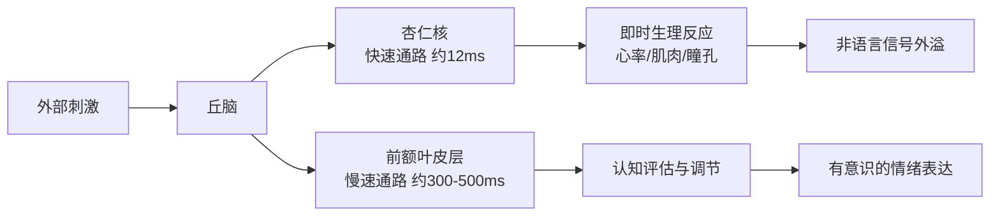
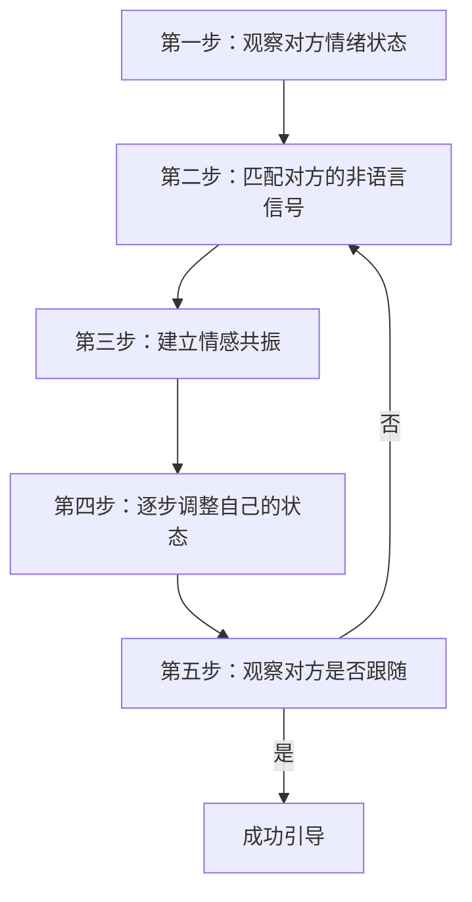
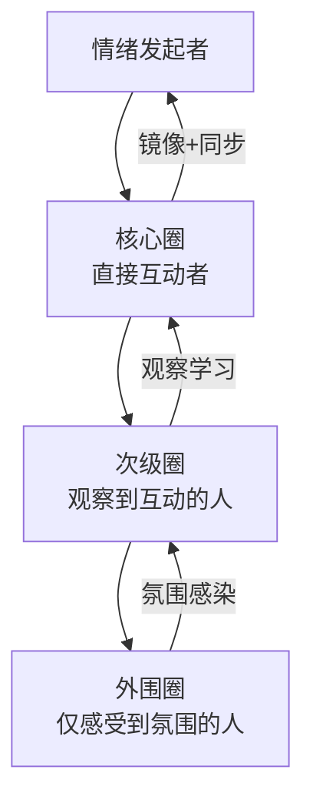

## 七、情感管理的非语言策略

情感是沟通的底色。无论你说出多么精妙的话语，如果非语言信号传递出与之矛盾的情绪，接收方会毫不犹豫地相信非语言信号。心理学家阿尔伯特·梅拉比安（Albert Mehrabian）的研究表明，在涉及情感和态度的沟通中，非语言因素占信息传递总量的93%——其中语调占38%，面部表情和肢体语言占55%，而语言内容本身仅占7%。这意味着，**情感管理的核心战场不在你的措辞上，而在你的身体上**。

本节将从情绪的底层机制出发，系统讲解如何通过非语言策略识别、调节、传递和引导情绪，让你在任何沟通场景中都能掌握情感的主动权。

---

### 7.1 情绪的"外溢"效应：你的身体在替你说话

#### 7.1.1 什么是情绪外溢

情绪外溢（Emotional Leakage）是指个体在试图控制或隐藏某种情绪时，真实情绪仍然通过非语言渠道"泄露"出来的现象。保罗·艾克曼（Paul Ekman）在长达四十年的面部表情研究中发现，人类有七种基本情绪是跨文化一致的：快乐、悲伤、愤怒、恐惧、惊讶、厌恶和轻蔑。这些情绪会在你意识到之前就出现在面部，持续时间通常只有1/5到1/25秒（微表情），但敏锐的观察者能捕捉到它们。

**为什么情绪会外溢？**

从神经科学的角度看，情绪的产生涉及两条通路：

关键点在于：**杏仁核的反应速度远快于前额叶皮层**。在你"决定"表现什么情绪之前，你的身体已经做出了反应。这就是为什么说谎者难以完全控制自己的非语言信号——生理反应总是领先于有意识的控制。

#### 7.1.2 情绪外溢的七大通道

| 通道 | 具体表现 | 识别难度 | 可控程度 |
|------|----------|----------|----------|
| 面部微表情 | 眉毛内收、嘴角下拉、鼻翼扩张 | 高（1/25秒） | 低 |
| 瞳孔变化 | 兴奋时扩大、厌恶时缩小 | 极高（需要近距离） | 极低 |
| 皮肤反应 | 脸红、出汗、鸡皮疙瘩 | 中等 | 低 |
| 声音变化 | 声调升高、语速加快、声音颤抖 | 中等 | 中等 |
| 呼吸模式 | 呼吸急促、屏息、叹气 | 中等 | 中等 |
| 肌肉张力 | 拳头握紧、肩膀耸起、下巴咬合 | 低 | 中等 |
| 微小动作 | 脚尖抖动、手指敲击、身体摇晃 | 低 | 中等 |

#### 7.1.3 情绪外溢的实际影响

**案例：面试场景**

张明参加一场重要的产品经理面试，他对自己的能力很有信心，但内心深处对这次跳槽有些不安。面试官问："你为什么离开上一家公司？"张明微笑着回答："希望寻找更大的发展空间。"但在回答的瞬间，他的左眉微微上挑（恐惧信号），双手不自觉地交叉在胸前（防御姿态），右脚开始轻微抖动（焦虑信号）。面试官未必能明确指出问题所在，但会形成一个模糊的印象："这个回答不太真诚。"

这就是情绪外溢的破坏力——**你的话语在说一件事，你的身体在说另一件事，而对方更相信你的身体**。

---

### 7.2 情绪调节的生理基础：从身体入手管理情绪

#### 7.2.1 身心双向连接：詹姆斯-兰格理论的现代应用

威廉·詹姆斯和卡尔·兰格在19世纪提出了一个反直觉的观点：**不是因为悲伤才哭，而是因为哭了才感到悲伤**。虽然这个理论的极端版本已被修正，但其核心洞见被现代神经科学证实——身体状态会显著影响情绪体验。

哈佛商学院的艾米·卡迪（Amy Cuddy）在2012年的研究中发现，保持"权力姿势"（双手叉腰、挺胸抬头）仅两分钟，就能使睾酮（与自信相关的激素）上升20%，皮质醇（压力激素）下降25%。虽然这项研究后来存在争议，但身体姿态影响心理状态的基本原理已被多个后续研究复制验证。

#### 7.2.2 五种生理调节技术

**技术一：4-7-8呼吸法（即时镇静）**

这是哈佛大学安德鲁·韦尔（Andrew Weil）博士推广的呼吸技术，能在60秒内激活副交感神经系统：

1. **吸气**：用鼻子缓慢吸气，默数4秒
2. **屏息**：保持呼吸，默数7秒
3. **呼气**：用嘴缓慢呼气，发出"呼"声，默数8秒
4. **重复**：循环3-4次

**原理**：延长呼气时间会刺激迷走神经，触发"休息与消化"模式，降低心率和血压。这种变化不仅让你在主观上感觉更平静，还会通过降低肩膀紧张度、放慢手势频率、稳定声音等非语言渠道传递给对方。

**适用场景**：重要演讲前、冲突对话前、高压会议开场前。

**技术二：渐进式肌肉放松（消除紧张外显）**

紧张情绪最常见的外溢信号是肌肉僵硬——肩膀高耸、下巴紧咬、双手握拳。渐进式肌肉放松（Progressive Muscle Relaxation, PMR）由埃德蒙·雅各布森在1938年提出，至今仍是临床心理学中最常用的压力管理技术之一。

**实操步骤**（完整版约15分钟，快速版约3分钟）：

| 肌肉群 | 动作 | 保持时间 | 放松后感受 |
|--------|------|----------|------------|
| 双手与前臂 | 用力握拳 | 5秒 | 手指发麻、温暖 |
| 上臂 | 弯曲手臂收紧肱二头肌 | 5秒 | 手臂沉重 |
| 肩膀 | 耸肩至耳朵 | 5秒 | 肩膀下垂、松弛 |
| 面部 | 皱紧整张脸 | 5秒 | 面部皮肤舒展 |
| 颈部 | 下巴向胸口压 | 5秒 | 颈部活动自如 |
| 胸部 | 深吸气屏住 | 5秒 | 呼吸变深变慢 |
| 腹部 | 收紧腹部肌肉 | 5秒 | 腹部柔软 |
| 双腿 | 伸直双腿绷紧 | 5秒 | 双腿沉重 |
| 双脚 | 脚趾向下卷曲 | 5秒 | 脚部温暖 |

**快速版**（适合会议间隙、洗手间使用）：只做肩膀、面部、双手三个区域，每个区域只需3秒紧张+5秒放松，总耗时不到1分钟。

**技术三：着陆技术（应对急性焦虑）**

当焦虑情绪突然袭来——比如突然被点名发言、发现自己的方案被质疑——"5-4-3-2-1着陆法"能迅速将注意力从内部焦虑转移到外部感知：

- **5**：看到5样东西（天花板的灯、桌上的水杯……）
- **4**：触摸4样东西（桌面的质感、衣服的布料……）
- **3**：听到3种声音（空调声、键盘声、远处的人声……）
- **2**：闻到2种气味（咖啡香、空气清新剂……）
- **1**：尝到1种味道（口中的薄荷味……）

**原理**：焦虑的本质是大脑对想象中威胁的过度反应。感官着陆通过激活大脑的"此时此地"网络（主要是岛叶和前扣带回），将注意力从默认模式网络（负责担忧和反刍）拉回当下。外部表现上，你会发现自己的呼吸变稳、眼神不再游移、身体停止晃动。

**技术四：冷水刺激（快速情绪重置）**

这是辩证行为疗法（DBT）创始人玛莎·莱恩汉推荐的危机应对技术。当情绪极度激动时：

1. 用冰水洗脸，或者将冰块握在手中
2. 或者将脸浸入冷水中保持15-30秒（注意保持呼吸）

**原理**：冷水触发"潜水反射"（Dive Reflex），这是一种哺乳动物共有的原始生理反应。潜水反射会立即降低心率约10-25%，收缩外周血管，将血液重新分配到核心器官。这种剧烈的生理状态变化能在数秒内中断强烈的情绪反应。

**适用场景**：极度愤怒、恐慌发作、即将情绪崩溃的紧急时刻。

**技术五：有节奏的运动（情绪重置）**

有节奏的双侧运动——比如左右交替踏步、双手交替拍打大腿——能激活大脑的双侧加工，类似于眼动脱敏与再加工疗法（EMDR）的原理。

**实操**：站立，左右脚交替踏步，同时用对侧手轻拍大腿，持续2-3分钟。节奏保持在每秒约1次。

**非语言效果**：这类运动后，人的眼神会变得更加稳定，手势更加流畅，身体的左右对称性增加——这些都是自信和平静的非语言信号。

---

### 7.3 情绪锚定：建立可复用的积极状态

#### 7.3.1 什么是情绪锚定

情绪锚定（Emotional Anchoring）源自神经语言程序学（NLP），其核心原理是**经典条件反射**——巴甫洛夫的狗听到铃声就分泌唾液，你也可以通过将特定的身体动作与积极情绪反复配对，最终形成一个"按下即启动"的情绪开关。

虽然NLP的某些主张存在争议，但情绪锚定的底层机制——条件反射和具身认知——是被严格科学验证的。

#### 7.3.2 建立情绪锚定的五步流程

**第一步：选择目标情绪状态**

明确你需要哪种情绪：自信、平静、热情、专注？不同场景需要不同的"锚"。

| 场景 | 需要的情绪 | 典型挑战 |
|------|-----------|----------|
| 公开演讲 | 自信+热情 | 手抖、声音发紧 |
| 薪资谈判 | 冷静+坚定 | 被对方气势压倒 |
| 客户投诉 | 平静+同理心 | 被对方情绪感染 |
| 团队激励 | 热情+感染力 | 自己状态低迷 |
| 冲突调解 | 中立+安全 | 被卷入某一方 |

**第二步：回忆峰值体验**

闭上眼睛，回忆一个你曾强烈体验过该情绪的具体时刻。注意：必须是**第一人称视角**的回忆——不是像看电影一样看自己，而是重新进入那个场景，看到当时看到的、听到当时听到的、感受当时感受的。

关键要素：
- **视觉**：当时你看到了什么？颜色、光线、周围人的表情
- **听觉**：当时你听到了什么？背景音乐、掌声、某个人的话
- **体感**：当时身体什么感觉？胸腔的温暖、手心的微汗、嘴角的上扬
- **情绪强度**：让情绪在0-10分中达到8分以上

**第三步：设置锚点动作**

选择一个**隐蔽且可重复**的身体动作作为"按钮"：

| 锚点动作 | 隐蔽程度 | 适用场景 |
|----------|----------|----------|
| 拇指和中指捏合 | ★★★★★ | 任何面对面场景 |
| 脚趾抓紧 | ★★★★★ | 任何场景（完全隐藏） |
| 右手无名指弯曲 | ★★★★☆ | 手在桌下时 |
| 舌顶上颚 | ★★★★☆ | 任何场景 |
| 深吸一口气 | ★★★☆☆ | 演讲/谈判 |

**第四步：配对强化**

在情绪达到峰值的那一刻（第三步中情绪强度8分以上），执行锚点动作，保持5-10秒，同时保持情绪强度。然后松开，等待10-15秒让情绪消退。然后重复这个过程：**重新激活情绪→峰值时按下锚点→松开→消退**。

**重复次数**：至少7-10次，建议在不同日期重复3-5轮。每次重复都在加强神经连接。

**第五步：测试与强化**

完成后，先做几次无关的思考来打断状态，然后只执行锚点动作（不主动回忆），观察情绪是否自动出现。如果出现程度达到6分以上，说明锚定初步成功。

**维护**：每隔1-2周用同样的方法强化一次，避免锚定效果衰减。

#### 7.3.3 情绪锚定的进阶应用

**叠加锚定（Stacking）**：在同一个锚点动作上叠加多个积极体验。比如，你有三次特别自信的经历，可以在同一个"拇指中指捏合"的锚点上分别激活，让这个锚点的效力越来越强。

**链式锚定（Chaining）**：为一个流程设置多个锚点，按顺序激活。比如，演讲前的准备流程：
1. 拇指捏合→激活"平静"
2. 脚趾抓紧→激活"自信"
3. 舌顶上颚→激活"热情"

三个锚点依次按下，帮助你从平静过渡到自信再进入热情状态，而非一步到位地强撑。

---

### 7.4 情绪传染：从被动接受到主动引导

#### 7.4.1 情绪传染的科学机制

情绪传染（Emotional Contagion）是人类最基本的社会功能之一。印第安纳大学的伊莱恩·哈特菲尔德（Elaine Hatfield）在1993年的开创性研究中将其定义为："自动地模仿他人的面部表情、声音、姿态和动作，并因此趋向于产生相似的情绪体验。"

这个过程主要通过三个机制运作：

**机制一：镜像神经元系统**

1992年，意大利帕尔马大学的贾科莫·里佐拉蒂团队在研究恒河猴时意外发现了镜像神经元。这些神经元不仅在猴子自己执行某个动作时放电，在猴子观察其他个体执行同样动作时也会放电。人类的镜像神经元系统更加复杂，主要分布在前运动皮层和顶下小叶。

当你看到对方皱眉时，你的大脑中负责"皱眉"的神经回路也会被激活——虽然你没有真正皱眉，但你已经在某种程度上"体验"了皱眉对应的情绪。这就是为什么和一个悲伤的人待久了你自己也会感到低落。

**机制二：面部反馈假说**

威廉·詹姆斯提出的面部反馈假说（Facial Feedback Hypothesis）认为，面部表情的变化会反向影响情绪体验。2019年的一项元分析（含138项研究，超过11,000名参与者）确认了这一效应的存在，虽然效应量较小（d=0.20），但统计显著且跨文化一致。

**实际含义**：当你无意识地模仿了对方的面部表情时，你的大脑会根据面部肌肉的状态"推断"你的情绪，从而真的产生相似的情绪。

**机制三：自主神经系统同步**

密歇根大学的斯蒂芬·平克等人发现，互动中的两个人会出现生理同步现象——心率、皮肤电导、呼吸频率趋向一致。这种同步在亲密关系中尤为明显，但也存在于一般的社交互动中。

#### 7.4.2 情绪传染的方向性

情绪传染不是随机的，而是有明确的方向性规律：

| 影响因素 | 高影响力方 | 低影响力方 |
|----------|-----------|-----------|
| 权力地位 | 领导/上级 | 下属/晚辈 |
| 情绪强度 | 更强烈的一方 | 更平淡的一方 |
| 表达能力 | 更善于表达的一方 | 更内敛的一方 |
| 人数 | 多数群体 | 少数个体 |
| 专业权威 | 专家/权威 | 非专业人士 |

**关键洞见**：在一对一沟通中，**情绪更强烈的一方往往会"拉走"另一方的情绪**。这意味着——如果你希望引导对方的情绪，你自己的情绪状态必须比对方更稳定、更有方向性。

#### 7.4.3 利用情绪传染的三大策略

**策略一：情绪调频与引导（Emotional Pacing & Leading）**

这是情绪传染最强大的应用，源自催眠治疗中的"先跟后引"原则。

**步骤**：

**具体操作**：

（1）**匹配阶段**（30秒-2分钟）：如果对方语速快、音量高、手势多，你也相应地加快语速、提高音量、增加手势幅度。如果对方语速慢、音量低、身体后倾，你也放慢节奏、降低音量、后靠身体。

这不是模仿——匹配和模仿有本质区别。模仿是复制对方的具体动作（对方摸鼻子你也摸鼻子），匹配是反映对方的能量水平和节奏模式。模仿会让对方感到被嘲笑，匹配会让对方感到"这个人和我在同一个频道上"。

（2）**建立共振**（30秒-1分钟）：当你成功匹配后，对方会表现出放松的信号——肩膀下沉、呼吸变缓、身体微微前倾。这说明生理同步已经建立。

（3）**引导阶段**（持续）：逐渐将你的非语言信号调整到你希望对方达到的状态。比如，你想让一个焦虑的同事冷静下来，先匹配他快速的呼吸和紧张的姿态，等共振建立后，缓慢地放慢呼吸、放松肩膀、降低语速。如果他开始跟随你的变化，说明引导成功。

**案例：安抚愤怒的客户**

李华是一家SaaS公司的客户成功经理，接到一个愤怒客户的电话："你们的系统又崩了！我已经第三次找你们了！这个月的损失你们赔吗？！"

**错误做法**："先生您先冷静一下，我来帮您处理。"（用理性和冷静去对抗愤怒，会让对方觉得你没有在听，情绪会升级。）

**正确做法**：
1. **匹配**：提高音量和语速，表现出同等程度的紧迫感——"我完全理解您的感受，这确实非常严重。"
2. **共振**：当客户感觉到被理解后，语速会稍有放缓，这是共振信号。
3. **引导**：逐步降低语速和音量——"我来亲自盯这件事，我现在就给您查看具体情况。"（语速已经比开始时慢了20%）
4. **落地**：当客户跟随你进入更平静的状态后，开始讨论解决方案。

**策略二：团队情绪氛围管理**

作为团队领导者，你的情绪传染力远高于普通成员。研究表明，领导者的情绪对团队绩效的影响是普通成员的2-7倍。

**创建积极情绪氛围的非语言方法**：

1. **进入会议室时的能量设定**：你的第一次露面就是信号。挺直身体、步伐有力、面带微笑（真笑——嘴角和眼角同时上扬，即杜兴微笑），这种非语言开场会为整个会议设定基调。

2. **倾听时的全身心投入**：身体微微前倾、频繁点头、保持眼神接触、在对方关键观点时微笑或挑眉。这些信号比任何语言反馈都更能激励团队成员积极表达。

3. **庆祝时的放大效应**：当团队取得成绩时，用明显高于日常水平的非语言信号表达兴奋——鼓掌、起立、大笑。情绪传染的效应量与信号强度正相关，日常状态下的"不错"不如关键时刻的"太棒了！"有感染力。

**策略三：在冲突中成为情绪锚点**

当两个人或两方发生冲突时，第三方的情绪状态会成为冲突走向的关键变量。如果你能保持冷静和安全的非语言信号，你就能成为整个场景的"情绪锚点"。

**具体做法**：
- 身体保持开放姿态（不交叉双臂，手掌向上或可见）
- 呼吸保持深且缓慢（你能控制自己，也能影响他人）
- 语音保持低沉平稳（低频声音触发安全感，这是进化决定的）
- 面部保持中性偏温暖的表情（不是微笑，微笑在冲突中会被解读为不尊重）

---

### 7.5 情绪掩蔽与表达策略

#### 7.5.1 情绪掩蔽的三个层级

在实际沟通中，你未必总是想表达真实情绪。情绪掩蔽不是虚伪，而是一种社交智慧。

| 层级 | 定义 | 场景示例 | 风险 |
|------|------|----------|------|
| 情绪抑制 | 压住不表达 | 收到坏消息时在团队面前保持镇定 | 长期导致心理健康问题 |
| 情绪替换 | 用一种情绪替代另一种 | 收到坏消息后快速切换到"问题解决"模式 | 短期有效，需要练习 |
| 情绪重构 | 改变对事件的解读 | 将"被批评"重构为"获得了改进方向" | 最健康，但需要时间 |

**重要提醒**：长期情绪抑制是有害的。詹姆斯·格罗斯（James Gross）在斯坦福大学的系列研究中发现，习惯性抑制情绪的人免疫力更低、社交关系质量更差、主观幸福感更低。**情绪掩蔽是短期策略，不是长期生活方式**。

#### 7.5.2 可信的情绪表达：为什么"演"会被看穿

你不应该试图完全隐藏情绪，更有效的方式是**选择性地表达和引导**。

原因在于：真实的非语言表达具有高度的内部一致性——面部、声音、身体、呼吸全部指向同一种情绪。而"假装"的表达几乎总会在某个通道出现不一致，而这些不一致会被观察者无意识地捕捉到。

**一致性检测表**（你在表达情绪时的自检清单）：

- 面部表情是否与所说内容匹配？
- 声音音调是否与所表达情绪一致？
- 手势的幅度和频率是否与情绪强度匹配？
- 身体姿态是否反映当前情绪状态？
- 呼吸模式是否与情绪状态一致？
- 语速和停顿是否自然？

如果有两个以上的通道出现不一致，对方很可能觉得"哪里不对劲"。

#### 7.5.3 高效的情绪转换技术

当你需要在短时间内从一种情绪切换到另一种时：

**"盒子呼吸法"快速重置**

美国海豹突击队使用的Box Breathing技术：
1. 吸气4秒
2. 屏息4秒
3. 呼气4秒
4. 屏息4秒
5. 重复4轮

然后迅速回忆一个与目标情绪匹配的记忆画面（3-5秒），让画面带动身体进入新的情绪状态。

**"角色切换"法**

在商业场景中，很多高表现者会为自己建立不同的"角色版本"——谈判中的我、演讲中的我、团队会议中的我。这不是人格分裂，而是一种认知框架切换：当你"成为"某个角色时，相应的非语言行为模式会自然浮现。

**实操**：为每个常用场景设计一个"角色卡片"：
- 这个角色的站姿/坐姿是什么？
- 说话的节奏和音量是怎样的？
- 手势的风格是什么（开放的？稳重的？）？
- 眼神接触的频率和强度是多少？

每次进入相应场景前，花10-15秒在脑中"穿上"这个角色。

---

### 7.6 高级应用：复杂场景中的情感非语言策略

#### 7.6.1 多人场景中的情绪管理

在多人场景中，情绪传染的动态更加复杂。你需要同时管理多个"情绪频道"：

**群体情绪的涟漪模型**：

**实操建议**：
- 先影响核心圈（离你最近、互动最多的人），核心圈会自然向外围扩散
- 群体演讲时，在前排"种下"情绪种子——先与前排建立情感连接，前排的反应会影响全场
- 团队冲突中，找到情绪影响力最大的关键人物（不一定是职位最高的，而是社交网络中心节点），先稳定这个人

#### 7.6.2 跨文化情绪管理

情绪的基本类型是跨文化的，但表达规则是文化特定的。保罗·艾克曼提出的"展示规则"（Display Rules）指出了不同文化在情绪表达上的核心差异：

| 文化类型 | 情绪表达倾向 | 典型误解 |
|----------|------------|----------|
| 高语境文化（中日韩） | 内敛、含蓄、控制外显 | 被低语境文化解读为"冷漠"或"不诚实" |
| 低语境文化（美英德） | 外显、直接、明确表达 | 被高语境文化解读为"粗鲁"或"情绪化" |
| 情感型文化（拉美南欧） | 丰富夸张的面部和手势 | 被中性文化解读为"不专业"或"过度" |
| 中性文化（北欧东亚） | 面部平静、手势少 | 被情感型文化解读为"无动于衷" |

**跨文化情绪管理的核心原则**：
1. 不要将对方的情绪表达方式等同于情绪强度
2. 关注情绪表达的**变化**而非绝对水平（对方从平静变得稍微皱眉，可能等同于你的勃然大怒）
3. 不确定时，选择稍低于对方的表达水平（宁可被觉得保守，也不要被认为失态）

#### 7.6.3 数字化环境中的情感管理

在视频会议和语音通话中，很多非语言通道被截断了，情绪管理变得更加困难也更加重要。

**视频会议中的情感非语言策略**：

1. **镜头即眼神**：看摄像头而非屏幕，这样对方感受到的是你在直视他们。每隔15-20秒看一次屏幕观察反馈，然后回到看摄像头。

2. **手势需要放大**：由于视频画面压缩了空间感，你的手势幅度需要比面对面沟通大30-50%才能被有效感知。

3. **面部表情需要夸张**：同理，微笑的幅度、点头的幅度都需要适度增加。

4. **声音是唯一的全带宽通道**：在纯语音通话中，声音承载了几乎所有的非语言信息。有意识地控制语速、音调、音量和停顿变得至关重要。

---

### 7.7 常见误区与纠正

#### 误区一：控制情绪等于压抑情绪

**错误理解**：情绪管理就是"不要表现出来"。

**正确认识**：真正的情绪管理是**选择性地表达和引导**。你不是要成为没有情绪的机器人，而是要成为能够自主选择何时、如何、以及向谁表达情绪的人。情绪是信息，压抑情绪等于丢弃信息。

#### 误区二：只关注自己的情绪

**错误理解**：情感管理只管好自己就行。

**正确认识**：情感管理是一个双向过程。你不仅要管理自己的情绪输出，还要**持续监测对方的情绪状态**。一个只关注自身表现而忽视对方情绪信号的沟通者，就像一个只看仪表盘不看路况的司机。

#### 误区三：情绪传染只在负面情绪中起作用

**错误理解**：情绪传染只意味着"被别人带坏情绪"。

**正确认识**：情绪传染在所有情绪方向上都有效。你完全可以成为"正面情绪传染源"——通过你的热情、乐观和活力影响整个团队。领导力在很大程度上就是**管理他人情绪状态的能力**。

#### 误区四：一次练习就够了

**错误理解**：学了技术就能随时用出来。

**正确认识**：非语言行为主要由无意识系统控制，改变无意识行为需要**反复的刻意练习**直到形成新的自动化模式。情绪锚定需要反复强化，调频引导需要在低风险场景中反复练习。急躁是最大的敌人。

#### 误区五：所有人对同一种情绪信号的解读都一样

**错误理解**：对方交叉双臂就是防御。

**正确认识**：非语言信号的解读必须结合**基线行为**。一个习惯性交叉双臂的人这么做不代表防御，一个平时从不交叉双臂的人突然这么做才需要关注。永远先建立对方的行为基线，再解读变化。

---

### 7.8 实战练习计划

#### 第一阶段：自我觉察（第1-2周）

| 练习 | 频率 | 目的 |
|------|------|------|
| 情绪日记 | 每天1次，晚上花5分钟 | 记录当天3个关键时刻的情绪状态、身体反应和非语言行为 |
| 身体扫描 | 每天2次（早/晚） | 学习识别情绪在身体中的位置（焦虑在胸口、愤怒在下巴、紧张在肩膀） |
| 情绪标签练习 | 每天随时 | 在情绪出现时，给它一个精确的标签（不是"不舒服"，而是"对被忽视的不满"） |

#### 第二阶段：基础调节（第3-4周）

| 练习 | 频率 | 目的 |
|------|------|------|
| 4-7-8呼吸法 | 每天3次，每次4轮 | 建立即时镇静能力 |
| 快速PMR | 每天2次，重点做肩膀、面部、手 | 消除肌肉紧张的外溢信号 |
| 着陆技术 | 每周2-3次，模拟焦虑场景后使用 | 学会在焦虑中快速稳定 |

#### 第三阶段：高级策略（第5-8周）

| 练习 | 频率 | 目的 |
|------|------|------|
| 情绪锚定 | 每天1次，持续2周建立锚点，之后每周强化 | 建立可复用的情绪触发器 |
| 调频与引导 | 每周3-5次，在低风险对话中练习 | 掌握情绪传染的主动引导 |
| 角色切换 | 为2-3个常用场景建立角色卡片并练习 | 快速进入适宜的情绪模式 |

---

### 7.9 本节核心要点回顾

1. **情绪外溢是不可避免的**——你的身体总是在替你说话，与其试图完全隐藏，不如学会主动引导
2. **从身体入手管理情绪**——呼吸、肌肉放松、姿态调整是最快速的非语言情绪调节手段
3. **情绪锚定让你拥有"一键启动"**——通过条件反射建立隐蔽的情绪触发器，在关键时刻快速切换状态
4. **情绪传染是你的超能力**——掌握调频与引导技术，你就能成为团队和关系中的情绪引导者
5. **一致性是可信度的基础**——面部、声音、身体、呼吸的协调统一是有效情绪表达的前提
6. **跨文化和数字化场景需要额外注意**——信号通道的减少意味着每个可用通道都需要更加精确的控制
7. **持续练习是唯一路径**——无意识行为的改变没有捷径，只有反复的刻意练习才能形成新的自动化模式
