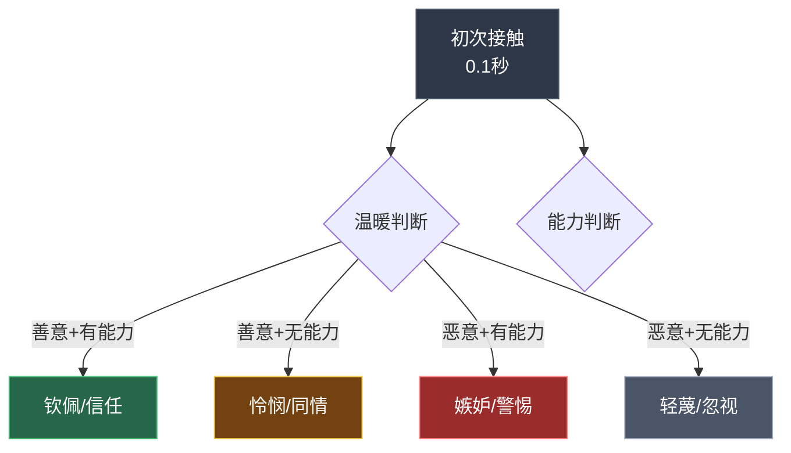
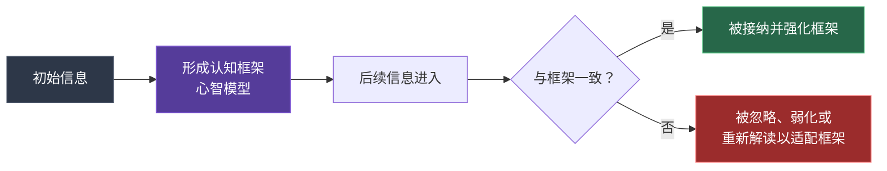
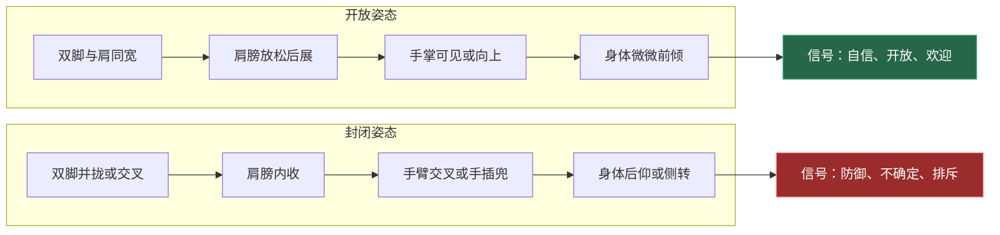
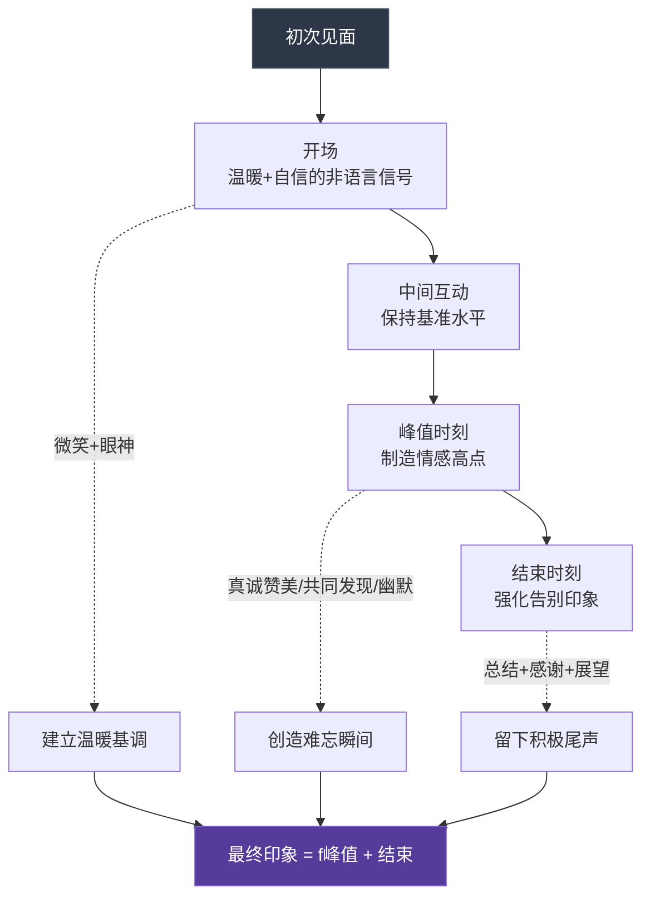
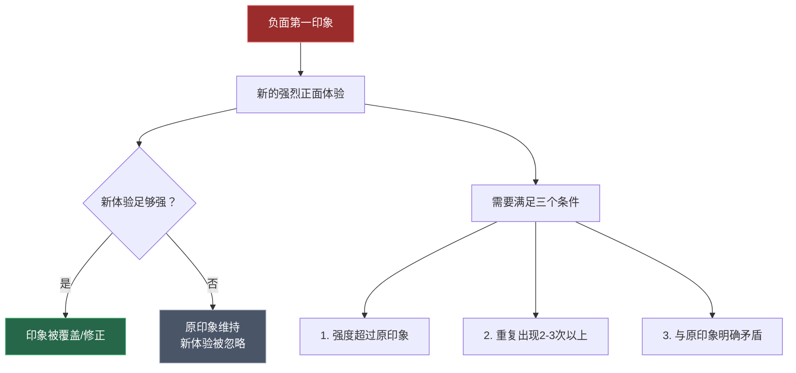

## 八、第一印象管理

第一印象是人际交往的"入场券"。研究表明，人们在初次接触的几秒到几分钟内就会形成对他人的整体判断，这个判断一旦形成，后续信息往往被用来**印证而非推翻**它。这就是心理学中的"首因效应"——先入为主的信息在认知中占据不成比例的权重。

本节将从第一印象的心理学机制出发，系统讲解如何在不同场景下管理你的非语言输出，创造有利的第一印象，以及如何修复已经受损的初始印象。

---

### 8.1 第一印象的形成机制：为什么"第一眼"如此重要

#### 8.1.1 两个维度：你在0.1秒内被"分类"了

普林斯顿大学的亚历克斯·托多罗夫（Alex Todorov）在2006年的突破性研究中发现，人们仅需**100毫秒**（0.1秒）就能从一张面孔中判断出两个核心维度：

| 维度 | 含义 | 进化意义 |
|------|------|----------|
| **温暖（Warmth）** | 这个人的意图是善意还是恶意？ | 威胁评估——决定"战还是逃" |
| **能力（Competence）** | 这个人有能力执行他的意图吗？ | 能力评估——决定"跟随还是忽视" |

这两个维度构成了第一印象的"底层操作系统"。后续所有具体印象——可靠、聪明、友善、强势——都是在这两个维度上的细分。

**关键洞见**：在绝大多数社交场景中，**温暖的优先级高于能力**。人们更愿意信任一个"好但不够聪明"的人，而非一个"聪明但可能有害"的人。这意味着——如果你只能优化一个维度，先优化温暖信号。

#### 8.1.2 "7秒法则"的科学依据与修正

"人们在7秒内形成第一印象"是一个广泛流传的说法。这个说法的科学基础比人们想象的更复杂：

**支持证据**：

- **托多罗夫的研究（2006）**：面孔信任度判断在100毫秒内完成
- **威利斯和托多罗夫的元分析（2006）**：人们在100毫秒内做出的判断，与更长时间接触后做出的判断高度一致（相关系数r≈0.7）
- **巴尔·阿姆拉尼等人（2017）**：第一印象的形成是一个**渐进的贝叶斯更新过程**——最初的100毫秒产生快速直觉判断，随后的几秒到几分钟进行微调

**修正与澄清**：

"7秒"不是一个精确的科学结论，而是一个便于记忆的经验法则。实际的时间窗取决于多个因素：

| 因素 | 对时间窗的影响 | 说明 |
|------|--------------|------|
| 信息丰富度 | 视觉+听觉信息同时出现时，判断更快 | 纯文字（如邮件）的判断时间更长 |
| 个体差异 | 外向型人格形成判断更快 | 内向型人格倾向于花更多时间评估 |
| 文化背景 | 高语境文化（如东亚）判断时间更长 | 低语境文化（如美国）判断更快速 |
| 动机水平 | 高动机时判断更谨慎 | 低动机时更依赖刻板印象 |
| 场合重要性 | 重要场合会触发更深层的加工 | 随意场合下判断更粗糙 |

**实践意义**：与其纠结"到底是7秒还是10秒"，不如理解核心原则——**在对方形成稳定印象之前（通常在最初的30秒到2分钟内），你的非语言输出至关重要**。

#### 8.1.3 首因效应：为什么"第一"如此顽固

第一印象之所以重要，核心机制是**首因效应**（Primacy Effect）。心理学家所罗门·阿希（Solomon Asch）在1946年的经典实验中证明了这一点：

> 给两组被试描述同一个人的特质：
> - A组：聪明 → 勤奋 → 冲动 → 挑剔 → 固执 → 嫉妒
> - B组：嫉妒 → 固执 → 挑剔 → 冲动 → 勤奋 → 聪明
>
> 结果：A组对这个人的评价显著更积极。**同样的特质，排列顺序不同，印象完全不同。**

首因效应背后的认知机制：

**这意味着**：如果对方对你的第一印象是"自信可靠"，后续你的偶尔紧张会被解读为"认真对待"；反之，如果第一印象是"紧张不自信"，你后续的自信表现可能被解读为"在表演"。

---

### 8.2 第一印象的六大非语言要素

第一印象由多个非语言通道共同塑造。以下是按影响力排序的六大要素，每个要素都有具体的操作指南。

#### 8.2.1 面部表情：温暖的"门面"

面部是第一印象信息密度最高的区域。在初次见面时，对方的注意力70%以上集中在你的面部。

**核心技巧：真诚的杜兴微笑**

不是所有微笑都一样。杜兴微笑（Duchenne Smile）的特征是嘴角上扬+眼角出现鱼尾纹——因为这两组肌肉（颧大肌和眼轮匝肌）的同时收缩很难伪装。

| 微笑类型 | 肌肉参与 | 给人感觉 | 常见场景 |
|----------|---------|---------|---------|
| 杜兴微笑（真笑） | 嘴角+眼角 | 真诚、温暖、可信 | 看到喜欢的人 |
| 社交微笑（假笑） | 仅嘴角 | 礼貌但不走心 | 职业场合的应酬 |
| 紧张微笑 | 嘴角+面部肌肉僵硬 | 不安、讨好 | 面试时的应激反应 |
| 冷笑 | 嘴角单侧上扬 | 不信任、轻蔑 | 应当避免 |

**如何在需要时激活杜兴微笑**：回忆一个真正让你开心的画面——可以是一个搞笑的视频、宠物的蠢事、或一个温暖的记忆。这种内在触发的微笑自然包含眼角肌肉的参与。

**其他面部信号**：

- **眉毛闪动（Eyebrow Flash）**：在看到对方的瞬间快速上扬眉毛约1/5秒，这是一个跨文化的友好信号，表示"我认出你了/我对你感兴趣"
- **下巴角度**：下巴微微抬起（约5-10度）传递自信，过度抬起传递傲慢，下巴内收传递顺从或紧张
- **面部肌肉松弛度**：紧张时面部肌肉会不自觉地绷紧，尤其是咬肌和额头。有意识地放松这些区域会让整个人看起来更从容

#### 8.2.2 眼神接触：连接的桥梁

眼神是建立信任和连接的最强非语言通道。在第一印象的形成中，恰当的眼神接触传递出三个核心信息：**自信、关注和真诚**。

**眼神接触的最佳比例**：

| 场景 | 建议比例 | 说明 |
|------|---------|------|
| 一对一交谈 | 60-70%的说话时间 | 自信和关注的平衡点 |
| 多人会议 | 扫视全场，每人3-5秒 | 避免只看一个人 |
| 演讲 | 前方区域扫视 | 创造"对每个人讲话"的感觉 |
| 初次见面握手 | 全程保持眼神接触 | 握手+眼神=最强组合 |

**眼神接触的常见错误**：

- **过度凝视（>80%的时间）**：给对方造成压迫感，尤其在权力不对等的场景中。在一些文化（如东亚）中，过度的眼神接触可能被视为不尊重
- **眼神飘忽（<40%的时间）**：传递不自信、不真诚或不感兴趣
- **"三角区"游移**：紧张时眼睛在对方面部的嘴-眼之间快速来回游移，会被解读为不安
- **向下看**：在对话中频繁向下看传递顺从或羞耻信号

**进阶技巧：三角凝视法**

在社交和商务场合，可以使用"三角凝视法"增加亲和力——将视线在对方的左眼、右眼和嘴唇之间自然移动，形成一个缓慢的三角形轨迹。这比固定的单点凝视更自然，同时保持高比例的眼神接触。

#### 8.2.3 身体姿态：无声的宣言

姿态是第一印象中最大的"画布"——它占据对方视野的最大面积，而且在你开口说话之前就已经在传递信息。

**开放姿态 vs 封闭姿态**：

**进入房间的姿态管理**：

1. **进门之前**：在门外停顿2秒，调整呼吸，回忆一个自信的状态（可以使用第七节学到的情绪锚定技术）
2. **进入瞬间**：步幅适中（不要拖脚，也不要大跨步），目视前方（不要低头），嘴角带微笑
3. **站定之后**：双脚与肩同宽，重心均匀分布（不要重心不稳地晃动），双手自然放在身侧或身前

**坐姿的第一印象管理**：

- 入座时：轻拉椅子，不要发出噪音，从左侧或右侧入座（正面入座在某些文化中有"占领"的含义）
- 坐定后：上身微微前倾（表示关注），不要完全靠在椅背上（太随意），也不要只坐椅面前1/3（太紧张）
- 双手：放在桌面可见处比放在桌下更增加信任度——手掌可见是一个古老的"我没有武器"的进化信号

#### 8.2.4 握手与触碰：物理接触的力量

握手是许多文化中唯一的"被许可的身体接触"，其信息密度极高。

**握手的五个维度**：

| 维度 | 最佳状态 | 过少 | 过多 |
|------|---------|------|------|
| 力度 | 中等偏坚定 | 软弱无力（"死鱼手"） | 捏痛对方（"碎骨手"） |
| 时长 | 2-3秒 | 碰一下就松开（敷衍感） | 超过5秒（尴尬感） |
| 深度 | 掌心对掌心 | 仅指尖接触（控制欲信号） | 包覆对方手背（居高临下） |
| 幅度 | 小幅度上下摆动2-3次 | 不动（冷漠） | 大幅度上下摇动（过度热情） |
| 眼神 | 全程保持眼神接触 | 看手或看其他地方 | — |

**握手时的伴随信号**：

- 左手轻触对方前臂或手肘：传递温暖和关心，但需要判断关系距离——初次见面慎用
- 身体微微前倾：表示尊重和重视
- 先开口问候：握住手的同时说出对方的名字和问候语——"张总，很高兴认识你"——视觉（微笑）+触觉（握手）+听觉（问候）三通道同步，信息密度最大化

**文化差异提醒**：

- **日本**：鞠躬比握手更正式；如果握手，力度应轻于西方标准
- **中东**：同性之间握手时间更长，力度更轻；异性之间可能避免身体接触
- **法国**：握手轻且短暂，但每天见面都要握
- **美国**：坚定有力的握手是标准，被视为自信的信号

#### 8.2.5 声音：听觉通道的第一印象

在面对面交流中，声音对第一印象的影响常被低估。研究显示，人们仅从一个2秒的声音片段中就能判断说话者的可信度、能力和支配性。

**声音的四个维度**：

**维度一：音高（Pitch）**

- 较低的音高通常被关联为更有权威、更可信（尤其对男性）
- 适度的音高变化传递热情和活力
- 音高过高且无变化传递紧张和不确定

**维度二：语速（Rate）**

| 语速 | 每分钟字数（中文） | 传递的信号 | 适用场景 |
|------|-------------------|-----------|---------|
| 慢速 | <150字 | 谨慎、深思熟虑，也可能被视为犹豫 | 强调重要观点时 |
| 中速 | 150-200字 | 自然、可信 | 日常对话 |
| 快速 | >200字 | 热情、有活力，也可能被视为紧张 | 激发热情时 |
| 变速 | 有意识地快慢交替 | 有控制力、有感染力 | 演讲和说服场景 |

**维度三：音量（Volume）**

- 适中的音量（对方能轻松听到但不需要倾身）传递自信
- 音量太小传递不自信或缺乏热情
- 音量过大传递攻击性或缺乏社交敏感度
- 关键技巧：在强调重点时适度提高音量，在需要对方仔细听时适度降低音量（制造"倾听距离"）

**维度四：清晰度与停顿**

- 咬字清晰传递专业性和自信
- 适当的停顿（而非"呃""那个"等填充词）传递沉稳和思考力
- 初次见面说第一句话时，先停顿半秒再说——这个微小的停顿传递"我有意识地选择和你说话"而非"我在紧张地胡说"

**第一句话的声音设计**：

初次见面的第一句话承担巨大的印象管理任务。建议：

1. 提前想好开场白（不需要逐字背诵，但要知道大概说什么）
2. 说话时嘴角微微上扬（微笑会影响声音的"色彩"，让声音听起来更温暖）
3. 语速比正常稍慢一点（给自己大脑处理的时间，也让对方听得更清楚）
4. 在关键信息（如自己的名字）上稍微强调

#### 8.2.6 着装与外观：视觉框架效应

着装不是非语言沟通的"核心"，但它是第一印象中**最先被感知到的信息**。心理学中的"穿衣认知"（Enclothed Cognition）理论表明，着装不仅影响别人对你的看法，也影响你自己的心理状态和行为表现。

**着装的第一印象管理原则**：

**原则一：场合适配（Occasion Matching）**

| 场合 | 着装基准 | 高于基准 | 低于基准 |
|------|---------|---------|---------|
| 科技公司面试 | 商务休闲 | 增加10-20%正式感 | 传递不重视 |
| 投行会议 | 正式商务 | 不会出错 | 可能减分 |
| 创意行业面试 | 有个性的休闲 | 不需要 | 正式过头反而减分 |
| 社交聚会 | 随意但得体 | 看起来格格不入 | 看起来不尊重场合 |

核心原则：**略高于场合标准10-15%**。你不会因为穿得太好而减分，但会因为穿得太差而减分。

**原则二：一致性（Consistency）**

着装应与你的整体非语言信号一致。一个穿着三件套西装但说话结结巴巴、坐立不安的人，传递出的信号是不一致的——对方会感觉"这个人不太对"。

**原则三：整洁与合身（Fit & Grooming）**

一件合身的普通衣服比一件不合身的名牌衣服的印象管理效果更好。合身传递"关注细节"和"自我管理能力"。整洁度包括：衣服无褶皱、鞋子干净、头发整齐、口气清新。

---

### 8.3 "峰终定律"在第一印象中的应用

#### 8.3.1 峰终定律的原理

诺贝尔奖得主丹尼尔·卡尼曼（Daniel Kahneman）发现的"峰终定律"（Peak-End Rule）指出：**人们对一段体验的记忆不取决于体验的平均水平，而取决于两个关键时刻——峰值（最强烈的瞬间）和结束（最后的瞬间）**。

这在第一印象管理中有两层含义：

1. **你的第一印象不是一个"平均值"，而是由最强烈的瞬间和最后的印象决定的**
2. **中间的平淡时刻对记忆的影响远小于峰值和结尾**

#### 8.3.2 创造积极的峰值时刻

峰值是整个互动中情感最强烈的瞬间。你可以有意识地制造一个积极峰值：

**五种峰值创造策略**：

| 策略 | 具体做法 | 效果机制 |
|------|---------|---------|
| 真诚的赞美 | 具体、独特的赞美而非泛泛的"你很棒" | 触发积极情绪的高峰 |
| 共同发现 | 在对话中发现一个共同点（兴趣、经历、朋友） | 创造"连接"的情感高点 |
| 意外的温暖 | 在正式场合中展现一个出人意料的温暖细节 | 打破预期产生深刻印象 |
| 幽默的瞬间 | 一个自然、得体的幽默 | 笑的瞬间是强烈的情感峰值 |
| 展示能力 | 在自然流动中展示一个与场合相关的能力 | 产生"这个人很厉害"的印象 |

**案例：面试场景中的峰值管理**

陈思参加一家互联网公司的产品总监面试。在面试的大部分时间里，她和面试官进行了正常的问答。但在回答"你最大的产品成就是什么"时，她不仅讲述了项目数据（DAU从50万增长到200万），还在面试官点头认可时自然地补充了一句："其实最让我骄傲的不是数据，而是当时团队里一个刚毕业的工程师，跟着这个项目成长起来，现在已经能独立带项目了。"

这句话让面试官停顿了一秒，然后露出了真正的微笑。这就是峰值时刻——在整个30分钟的面试中，这个瞬间被记住的概率最高。

#### 8.3.3 管理结束时刻

结束时刻和峰值同等重要，但大多数人会犯一个错误：在结束时"松懈下来"。

**强有力的结束策略**：

1. **总结+感谢+展望的三段式**：
   - "今天聊了很多关于XX的话题……"（总结——让对方感觉你重视这次交流）
   - "非常感谢你花时间分享这些……"（感谢——真诚而不卑微）
   - "期待下次有机会继续交流……"（展望——传递长期关系的意愿）

2. **握手+眼神接触+微笑的"告别三件套"**：
   在告别的最后3秒，保持高强度的非语言输出——坚定的握手、温暖的眼神、真诚的微笑。不要在最后3秒开始看手机或四处张望。

3. **最后一个"小动作"**：
   离开前做一个小的、真诚的、个性化的动作——比如"你桌上这张照片是XX吗？真好看"或"今天学到很多，特别是你说的XX那个观点"。这个小尾巴会成为记忆的"锚点"。

#### 8.3.4 峰终定律的完整应用模型

---

### 8.4 不同场景的第一印象管理策略

#### 8.4.1 求职面试

面试是第一印象管理的"高压场景"。研究显示，面试官在面试的**最初4分钟内**就已经做出了基本判断，后续的面试时间更多是在寻找证据来确认这个初始判断。

**面试前15分钟的准备清单**：

1. 到达面试地点附近后，找一个安静的地方（洗手间、大厅角落）
2. 做3轮4-7-8呼吸法（参见第七节），降低皮质醇水平
3. 激活情绪锚定（如果已建立），或回忆一次你表现最好的场景
4. 检查外观：头发、牙齿、衣服褶皱、鞋子
5. 默念开场白（不需要逐字，只需要知道前30秒说什么）

**进入面试房间的行为序列**：

| 时刻 | 动作 | 目的 |
|------|------|------|
| 敲门/进门 | 敲2-3下，等回应后进入，微笑 | 尊重边界+温暖信号 |
| 走向座位 | 步伐稳健，目视面试官 | 自信的步态信号 |
| 问候 | 握手+眼神+说出对方名字+微笑 | 三通道同步的最大化印象 |
| 入座 | 轻拉椅子，从侧方入座 | 礼貌+关注细节 |
| 坐定 | 前倾5-10度，双手可见 | 关注+开放+自信 |

#### 8.4.2 商务社交与行业活动

商务社交的第一印象挑战在于：你需要在极短时间内与多人建立连接，而且通常没有"正式开场"的机会。

**"三步走"策略**：

1. **扫描（5秒）**：进入社交区域后，用5秒扫视全场，识别开放的群体（面向外的群体表示可以加入）和已经认识的人（作为切入点）
2. **接近（10秒）**：走向目标群体时，保持微笑和开放姿态。在接近时进行眼神接触，获得许可信号（对方向你点头或微笑）后再正式加入
3. **切入（30秒）**：加入对话后，先做一个简短的自我介绍——名字+一句话描述你的角色/关联。不需要完整的电梯演讲，只需要给对方一个认知锚点

**社交场景的非语言快速连接技巧**：

- 进入群体时，先倾听1-2分钟再说话——这个行为传递"我尊重你们正在进行的对话"
- 看到对方名片/名牌时，做一个真诚的评论——"这个设计很有意思"或"XX公司！我上个月刚看了你们的产品发布"
- 递名片时双手递出，名片正面朝向对方——这个小细节在东亚商务文化中尤其重要

#### 8.4.3 线上初见：视频会议与社交媒体

数字化环境对第一印象管理提出了新挑战——很多非语言通道被截断或变形了。

**视频会议的第一印象管理**：

| 要素 | 线下标准 | 线上调整 | 原因 |
|------|---------|---------|------|
| 眼神接触 | 看对方的眼睛 | 看摄像头 | 看屏幕时对方感觉你在看别处 |
| 微笑幅度 | 自然微笑 | 放大20-30% | 视频压缩了面部细节 |
| 手势幅度 | 适中 | 放大30-50% | 画面框限制了可见范围 |
| 姿态 | 可以微调 | 坐直、胸部以上在画面中 | 不合适的取景会传递不专业信号 |
| 背景 | — | 整洁、不杂乱 | 背景是新的非语言通道 |
| 光线 | — | 面部光源，避免逆光 | 暗淡的画面传递不专业 |

**开摄像头前的快速检查**：

1. 摄像头位置：与眼睛齐平或略高（仰角传递不专业感）
2. 光线：窗户或灯光在前方，不要在背后（逆光让你变成剪影）
3. 背景：书架、简洁墙面，避免床、杂乱物品
4. 网络：提前测试，卡顿是第一印象的杀手
5. 着装：上半身至少是商务休闲（不要上半身正式+下半身睡裤的"远程办公陷阱"）

**文字初见（邮件/消息）**：

在文字环境中，非语言通道几乎全部被截断，但仍然有"非语言等价物"：

- **响应速度**：过快（<1分钟）可能传递"太急切"或"没在认真看"；过慢（>24小时）传递"不重视"；商务邮件在2-4小时内回复是最佳窗口
- **格式与排版**：段落分明、没有错别字、适当的称呼和落款——这些"格式信号"等价于线下的着装和整洁度
- **语气词的使用**：适当的"！"传递热情，过多的"！！！"传递过度激动；"。"传递正式，"~"传递轻松。选择与场合匹配的语气

---

### 8.5 第一印象的跨文化差异

在全球化环境中，第一印象的管理需要文化敏感度。爱德华·霍尔（Edward Hall）提出的高语境/低语境文化框架为理解这些差异提供了基础。

#### 8.5.1 高语境文化 vs 低语境文化

| 维度 | 高语境（中日韩、阿拉伯、拉美） | 低语境（美国、德国、北欧） |
|------|---------------------------|-------------------------|
| 自我介绍 | 先建立关系，再谈业务 | 先说明目的，再建立关系 |
| 眼神接触 | 适度，过度可能被视为不尊重 | 持续，是自信的信号 |
| 握手力度 | 轻柔 | 坚定有力 |
| 空间距离 | 较近（30-50cm） | 较远（60-90cm） |
| 沉默 | 舒适，表示思考和尊重 | 不适，需要填补 |
| 名片交换 | 双手接收，认真阅读 | 单手接收，可以快速扫一眼 |
| 表情外露 | 控制，避免情绪化 | 鼓励，传递真诚 |

#### 8.5.2 跨文化第一印象的核心原则

**原则一：先观察，后行动**

进入一个新的文化环境时，花30秒观察当地人如何问候、握手、保持距离，然后匹配。

**原则二：宁可保守，不可冒进**

在不确定的文化环境中，选择更正式、更保守的方式。正式感可以通过后续互动放松，但不好的第一印象很难扭转。

**原则三：尊重当地仪式**

每个文化都有自己的"破冰仪式"——日本人交换名片的仪式感、中东人先喝茶再谈事的习惯、法国人贴面礼的次数规则。参与这些仪式传递"我尊重你的文化"。

---

### 8.6 第一印象的修复：当开局不利时

即使是最有经验的沟通者也会偶尔"搞砸"第一印象。好消息是，第一印象虽然顽固，但并非不可改变。

#### 8.6.1 修复的时机窗口

| 时间跨度 | 修复难度 | 策略 |
|----------|---------|------|
| 1分钟内 | 中等 | 立即用更强的正面信号覆盖（微笑、道歉、重新介绍） |
| 当天内 | 较高 | 创造一个新的、更强的峰值体验来覆盖负面印象 |
| 数天后 | 困难 | 需要多次一致的正面互动来逐步覆盖 |
| 数周后 | 很困难 | 需要第三方背书或显著的情境变化 |

#### 8.6.2 四种常见的第一印象"事故"及修复方法

**事故一：迟到了**

- 即时修复：不要道歉超过30秒（过度道歉放大了负面），而是用一句真诚的"抱歉让你久等了"+一个温暖的微笑+立即进入高质量的互动。迟到带来的负面信号需要用后续更高质量的互动来覆盖

**事故二：叫错了名字**

- 即时修复：真诚地道歉，然后在后续对话中多次使用对方的正确名字。研究表明，人们喜欢听到自己的名字——这会部分覆盖之前的尴尬

**事故三：说了不合适的话**

- 即时修复：简短承认，不纠缠。"抱歉，那个说法不太恰当"→立即转向积极话题。不要反复解释，越描越黑

**事故四：紧张导致的整体表现差**

- 延迟修复：通过后续的主动接触（如感谢邮件、下次主动打招呼）展示一个更放松、更自信的自己。人们对"第二次见面"的印象更新比"同一次见面的后半段"更容易接受

#### 8.6.3 第一印象修复的"覆盖原则"

---

### 8.7 常见误区与纠正

#### 误区一：第一印象只在初次见面时重要

**错误理解**：第一印象只影响第一次互动。

**正确认识**：第一印象的影响持续存在于所有后续互动中。每一次"重逢"都会受到上次印象的影响——这是首因效应的延伸。即使是认识多年的人，每次见面也会更新对你的"最新印象"，而这个最新印象会被后续的首因效应放大。

#### 误区二：第一印象管理等于"表演"或"伪装"

**错误理解**：管理第一印象是一种不真诚的操控。

**正确认识**：第一印象管理是**有意识地展示你最好的真实自我**，而不是创造一个虚假的自我。你在面试时穿得更正式不是伪装，你在初次见面时更注意微笑不是表演。第一印象管理的本质是——减少紧张、习惯等干扰因素的影响，让你的真实能力和品质被对方正确感知。

#### 误区三：只要外表好看就够了

**错误理解**：颜值决定第一印象。

**正确认识**：外貌确实影响第一印象，但它远没有人们想象的那么重要。托多罗夫的研究表明，面部表情（温暖信号）对面部判断的影响远大于面部结构（天生长相）。一个长相普通但表情温暖的人，其第一印象通常优于一个长相出众但表情冷淡的人。着装、声音、姿态、动作的影响同样巨大。

#### 误区四：第一印象完全取决于个人表现

**错误理解**：只要我表现好，就能创造好印象。

**正确认识**：第一印象是**双向的**，受对方的心理状态、期望、刻板印象和当时情境的影响。一个刚被上司批评的面试官可能对你更苛刻，一个在嘈杂环境中的人可能无法充分感知你的微笑。你能控制的是自己的输出，不能控制对方的接收。接受这一点，减少对"完美第一印象"的执念。

#### 误区五：一个负面信号会毁掉一切

**错误理解**：一次口误、一次紧张就完了。

**正确认识**：第一印象是**多通道、多信息点的综合判断**。一个负面信号会被多个正面信号稀释。研究显示，只有当负面信号严重到足以改变对方对温暖或能力两个核心维度的判断时，才会显著影响整体印象。偶尔的口误远不如持续的眼神飘忽影响大。不要因为一个小失误就自暴自弃，用更多的正面信号来对冲。

---

### 8.8 第一印象管理的日常训练计划

#### 阶段一：观察期（第1-2周）

| 练习 | 做法 | 目的 |
|------|------|------|
| 印象日记 | 每天记录3个你对他人第一印象的案例：你注意到什么？你的判断基于什么信号？ | 培养对非语言信号的敏感度 |
| 视频自拍 | 用手机录一段30秒的自我介绍，然后回看。观察自己的微笑、眼神、姿态、声音 | 建立客观的自我认知基线 |
| 他人反馈 | 请3个信任的朋友用3个词形容对你的第一印象 | 了解自己的"默认输出" |

#### 阶段二：微调期（第3-4周）

| 练习 | 做法 | 目的 |
|------|------|------|
| 微笑练习 | 每天早上对着镜子练习杜兴微笑30秒，直到能随意激活 | 建立微笑的肌肉记忆 |
| 开场白设计 | 为5个常见场景设计开场白，包括内容和声音设计 | 减少即兴压力 |
| 峰值时刻 | 在每天的1次社交互动中有意识地创造一个积极峰值 | 练习峰终定律的应用 |
| 步态练习 | 在走路时有意识地保持抬头、肩膀后展、步伐稳健 | 将自信姿态内化为默认模式 |

#### 阶段三：实战期（第5-8周）

| 练习 | 做法 | 目的 |
|------|------|------|
| 低风险实战 | 在不重要的场合（咖啡店、超市、兴趣小组）有意识地练习完整的非语言印象管理 | 在低压力环境中磨练技能 |
| 高风险实战 | 在面试、商务社交等重要场合应用所学 | 验证学习成果 |
| 复盘 | 每次重要互动后，花5分钟回顾：哪些做得好？哪些可以改进？ | 形成持续改进的循环 |

---

### 8.9 本节核心要点回顾

1. **第一印象在100毫秒内就开始形成**——核心判断维度是温暖和能力，温暖优先于能力
2. **首因效应使第一印象具有顽固性**——后续信息被用来印证而非推翻初始判断
3. **六大非语言要素共同塑造第一印象**——面部表情、眼神接触、身体姿态、握手/触碰、声音、着装，每个都需要有意识地管理
4. **峰终定律决定了记忆中的第一印象**——创造积极的峰值时刻和强有力的结束，比维持整体平均更重要
5. **不同场景需要不同的第一印象策略**——面试、商务社交、线上会议各有侧重
6. **跨文化场景需要额外的敏感度**——先观察后行动，宁可保守不可冒进
7. **第一印象可以修复，但越早越好**——用更强、更一致的正面信号覆盖负面信号
8. **第一印象管理不是伪装，而是展示最好的真实自我**——减少干扰因素，让真实能力被正确感知

***
