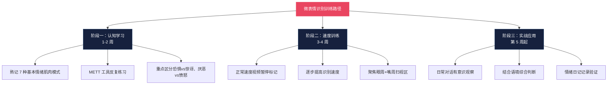
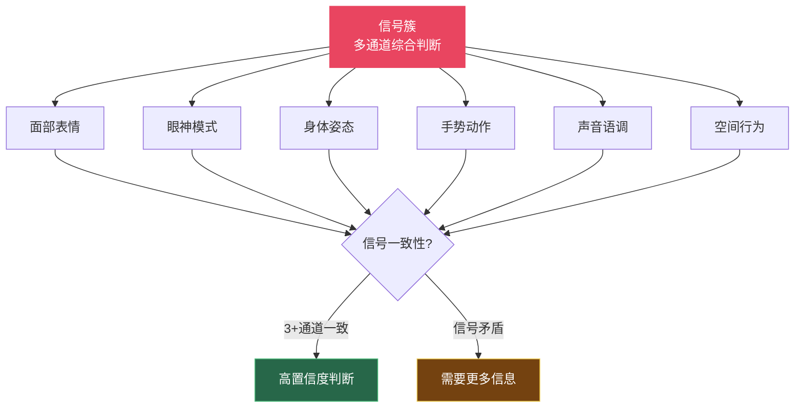
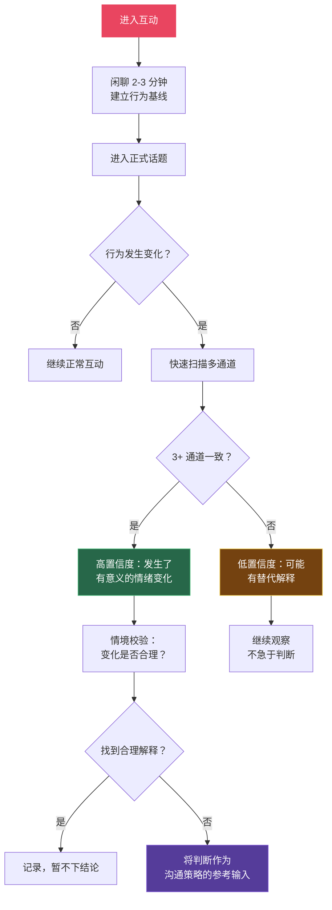
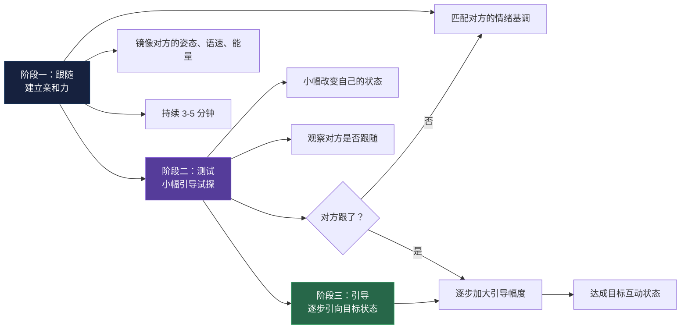
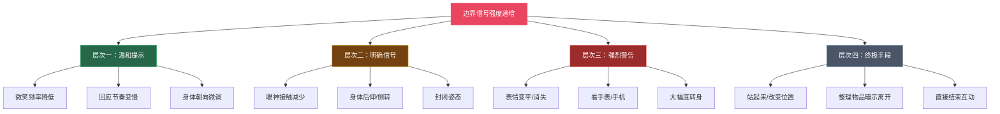
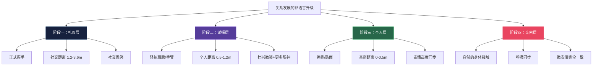

## 九、非语言沟通的高级技巧

前面八个模块帮你建立了非语言沟通的基础能力——从自我觉察到第一印象管理，你已经掌握了各个非语言通道的独立运用方法。本模块进入真正的"高级区"：**如何同时解读多个非语言通道的组合信号，如何识别微表情背后的真实情绪，如何建立对方的行为基线并捕捉偏差，以及如何通过非语言引导来影响互动的走向。**

这些技巧不是"读心术"，而是基于行为科学的系统化观察与运用方法。掌握它们之后，你将从"注意自己的非语言信号"升级为"读懂并影响他人的非语言信号"。

---

### 9.1 微表情识别：捕捉一闪而过的真实情绪

#### 9.1.1 什么是微表情

微表情（Micro-Expressions）是持续时间仅为 1/25 秒到 1/5 秒的面部表情，它们不受意识控制，会在人们试图掩饰真实情绪时"泄露"出来。这一概念由心理学家保罗·埃克曼（Paul Ekman）在 1960 年代通过跨文化面部表情研究首次系统化提出。

**微表情的核心特征：**

| 特征 | 说明 | 与普通表情的区别 |
|------|------|-----------------|
| 持续时间 | 1/25 ~ 1/5 秒 | 普通表情持续 0.5 ~ 4 秒 |
| 意识控制 | 几乎无法自主控制 | 普通表情可以有意伪装 |
| 出现时机 | 通常在情绪被压抑时出现 | 普通表情随情绪自然流露 |
| 覆盖范围 | 通常只涉及面部局部区域 | 普通表情涉及面部整体协调 |
| 可识别性 | 需要训练才能可靠捕捉 | 普通表情大多数人可自然识别 |

**为什么微表情在高级非语言沟通中如此重要？**

在商务谈判、重要面试、团队管理等高压场景中，人们会有意识地管理自己的表情——微笑表示赞同（即使内心反对），点头表示理解（其实并不同意）。微表情是穿透这层"社交面具"的窗口。当你能捕捉到对方在听到报价时一闪而过的皱眉（厌恶/不满），或者在你提出方案时瞬间的嘴角下拉（轻蔑/不认同），你就获得了语言层面永远无法得到的真实反馈。

#### 9.1.2 七种基本微表情及其识别要点

埃克曼的研究确认了七种跨文化一致的基本情绪表达。每一种都有独特的面部肌肉组合模式：

**（一）快乐（Happiness）**

- 核心肌肉：颧大肌（嘴角上扬）+ 眼轮匝肌（眼角出现鱼尾纹）
- 识别要点：真正的快乐微笑（杜兴微笑）必须同时包含嘴角和眼角的变化。如果只有嘴角上扬而眼角没有变化，这很可能是"社交微笑"——礼貌但不走心
- 微表情形态：嘴角快速上扬，眼角微缩，持续约 0.2 秒后恢复
- 常见场景：在紧张的商务谈判中，当对方说出一个意外的让步时，你可能会在对方脸上捕捉到一个极短暂的真心微笑——即使他随后立刻恢复严肃表情

**（二）悲伤（Sadness）**

- 核心肌肉：皱眉肌（眉头内侧上扬）+ 口轮匝肌（嘴角下拉）
- 识别要点：悲伤是最容易被掩饰的情绪之一。关键观察区域是眉头内侧的上扬——这个动作极难自主控制
- 微表情形态：眉毛内侧瞬间上扬并聚拢，嘴角微微下拉，眼睑轻微下垂
- 常见场景：当你不得不告诉同事他的方案没有通过时，他可能嘴上说"没关系"，但眉头上扬的微表情泄露了真实的失落

**（三）愤怒（Anger）**

- 核心肌肉：皱眉肌（眉毛下压）+ 眼轮匝肌（眼睛变窄）+ 口轮匝肌（嘴唇紧抿或嘴角拉伸）
- 识别要点：愤怒的微表情特征非常鲜明——眉毛下压、眼睛变窄、嘴唇变薄或紧抿。这三个信号同时出现时，识别准确率极高
- 微表情形态：双眉瞬间下压，眼睛变窄约 0.15 秒
- 常见场景：在会议中当你否决了一个同事的提议，你可能在他低头看文件的瞬间捕捉到眉毛下压的愤怒微表情

**（四）恐惧（Fear）**

- 核心肌肉：额肌（眉毛上扬并聚拢）+ 眼轮匝肌（上眼睑提升，露出眼白）+ 降口角肌（嘴角横向拉伸）
- 识别要点：恐惧与惊讶的区分是微表情识别中的难点。关键区别：恐惧时眉毛是聚拢的（向中间集中），惊讶时眉毛是分开的（向上扬起且保持自然间距）
- 微表情形态：眉毛上扬并内聚，上眼睑快速上提，嘴角横向拉平
- 常见场景：在面试中，当面试官问到一个候选人没有准备好的问题时，即使他保持镇定的表情，你仍然可能在最初 0.3 秒内看到恐惧的微表情

**（五）惊讶（Surprise）**

- 核心肌肉：额肌（眉毛整体上扬）+ 眼轮匝肌（眼睛睁大）+ 降下唇肌（下巴下拉）
- 识别要点：惊讶是持续时间最短的微表情（通常不到 0.2 秒），因为大脑会迅速对意外信息做出判断并转换为其他情绪。如果"惊讶"持续超过 1 秒，那很可能是假装的
- 微表情形态：眉毛整体上扬、眼睛瞬间睁大、嘴巴微张
- 常见场景：当你在商务谈判中出乎意料地提出一个新的优惠条件时，对方脸上闪过的惊讶表情告诉你——他们没有预料到这个让步

**（六）厌恶（Disgust）**

- 核心肌肉：提上唇肌（上唇上提）+ 皱鼻肌（鼻子两侧出现皱纹）
- 识别要点：厌恶的微表情主要集中在面部中下区域——上唇上提和鼻翼两侧的皱纹。这是最容易与"闻到异味"混淆的表情，需要结合情境判断
- 微表情形态：上唇短暂上提，鼻翼两侧微皱
- 常见场景：当你在介绍产品方案时，如果对方在听到某个细节时出现厌恶微表情，说明这个细节触碰到了他的负面体验或价值观

**（七）轻蔑（Contempt）**

- 核心肌肉：颧大肌单侧收缩（嘴角单侧上扬）
- 识别要点：轻蔑是唯一一个**不对称**的基本情绪表情——只有单侧嘴角上扬。这个不对称性是区分轻蔑与微笑的关键标志
- 微表情形态：嘴角单侧（通常为右侧）短暂上扬约 0.2 秒
- 常见场景：轻蔑是最需要警惕的微表情。在商务场景中，当你在陈述方案时看到对方的轻蔑微表情，意味着对方内心对你的论点或能力存在深层的不认同——这种不认同很难通过语言说服来改变

#### 9.1.3 微表情识别的训练方法

微表情识别能力并非天赋——埃克曼的研究表明，通过系统训练，大多数人的识别准确率可以从 40%（接近猜测水平）提升到 70% 以上。

**训练阶段一：认知学习（第 1 ~ 2 周）**

1. 熟记七种基本情绪对应的面部肌肉模式（参考上述描述）
2. 使用埃克曼开发的 METT（Micro Expression Training Tool）在线训练工具反复练习
3. 每天练习 15 分钟，重点关注恐惧-惊讶、厌恶-愤怒这两组最容易混淆的情绪对

**训练阶段二：速度训练（第 3 ~ 4 周）**

1. 观看正常速度的谈话视频（新闻访谈、真人秀、商务会议录像），尝试在表情出现时暂停并标记
2. 逐步提高识别速度要求——从 1 秒内识别到 0.5 秒内识别
3. 重点练习"扫视区"——对方的眼周（眉毛+眼睛）和嘴周（嘴唇+鼻翼），这两个区域承载了 80% 以上的情绪信息

**训练阶段三：实战应用（第 5 周起）**

1. 在日常对话中有意识地观察对方的面部表情变化
2. 将微表情信号与语境结合判断——不要仅凭单个微表情下结论
3. 建立"情绪日记"：每天记录 1 ~ 2 个你观察到的微表情及其语境，验证你的判断是否准确

**重要警告：微表情识别的局限性**

- 微表情揭示的是**情绪状态**，而非**具体想法**。看到厌恶微表情不等于"对方讨厌你"——可能是对方想起了不愉快的事情
- 微表情的出现频率因人而异——有些人天生面部表情控制力强，微表情极少泄露
- 文化因素会影响微表情的表达程度——东亚文化中情绪表达普遍更内敛
- **永远不要仅凭微表情做决策**——将其作为语言信息的补充参考，而非替代

---

### 9.2 信号簇分析：从单一信号到多通道判断

#### 9.2.1 为什么单一信号不可靠

单独的非语言信号就像一个孤证——它可能有多种解释。例如：

- 交叉双臂 = 防御？冷？只是习惯性姿势？椅子没扶手？
- 避开眼神 = 不诚实？内向？文化习惯？眼睛不舒服？
- 身体后仰 = 不感兴趣？在思考？椅背太舒服？

**信号簇（Signal Cluster）** 是指在同一时间窗口内（通常 2 ~ 5 秒），多个非语言通道同时发出的、指向同一判断方向的一组信号。当三个以上独立通道发出一致信号时，判断的准确率会大幅提升。

#### 9.2.2 六通道信号簇模型

一次面对面的互动中，六个非语言通道同时发送信号：

**判断置信度规则：**

| 一致信号通道数 | 置信度 | 建议行动 |
|-------------|--------|---------|
| 6 通道一致 | 极高（>90%） | 可以高度信任判断 |
| 4 ~ 5 通道一致 | 高（70-90%） | 可以作为决策参考 |
| 3 通道一致 | 中等（50-70%） | 需要继续观察确认 |
| 2 通道一致 | 低（30-50%） | 仅作为假设，需要验证 |
| 1 通道或信号矛盾 | 极低（<30%） | 不做判断，继续收集信息 |

#### 9.2.3 五种常用信号簇模式

**模式一：同意信号簇**

当对方真正赞同你的观点时，你会看到：

- 面部：微笑（杜兴微笑，嘴角+眼角）
- 眼神：稳定的眼神接触，瞳孔微扩
- 身体：微微前倾
- 手势：手掌朝上或朝向你，手指自然展开
- 声音：语调上扬，语速适中，使用"嗯""对"等肯定词
- 空间：主动缩短距离

**如果只有语言说"同意"但非语言信号不一致**——对方可能只是出于礼貌或避免冲突而口头上表示赞同。

**模式二：不同意但克制信号簇**

这在商务场景中极为常见——对方内心不同意但出于社交策略保持表面配合：

- 面部：社交微笑（仅嘴角，眼角无变化），或无表情
- 眼神：减少眼神接触，频繁看其他方向
- 身体：后仰或侧转
- 手势：手指轻敲桌面、玩笔、触摸颈部（自我安慰动作）
- 声音：语调平淡，使用"嗯……""好吧"等非承诺性回应
- 空间：保持距离或略微后退

**模式三：紧张/焦虑信号簇**

- 面部：面部肌肉紧绷，嘴唇变薄
- 眼神：快速来回移动，或频繁向下看
- 身体：坐立不安，频繁变换姿势
- 手势：自我触摸（摸脖子、搓手、拉衣领）
- 声音：语速加快或变慢，音调升高，出现填充词（"呃""那个"）
- 空间：身体后仰想远离压力源

**模式四：欺骗/隐瞒信号簇**

**重要前提：没有任何单一非语言信号可以判断一个人在说谎。** 以下模式仅在满足以下两个条件时才有参考价值：(1) 多个通道同时出现信号；(2) 这些信号偏离了对方的基线行为（详见 9.3 节）。

- 面部：表情与语言内容的时机不自然（先说"我很高兴"再微笑，而非同步）
- 眼神：回避眼神接触，或反常地过度凝视（过度控制）
- 身体：自我封闭姿态增加（手臂交叉、身体后仰）
- 手势：自我触摸频率增加（摸鼻子、捂嘴、揉眼睛）
- 声音：音调升高、语速突然变化、过多解释
- 空间：无意识地后退或转向出口方向

**模式五：权威/支配信号簇**

- 面部：表情平静、控制，下巴微微抬起
- 眼神：稳定且略长的眼神接触（>70%时间）
- 身体：占据更多空间（双腿分开、手臂展开），姿态稳定不晃动
- 手势：手掌向下、手指点触、动作幅度小但确定
- 声音：语速偏慢、音调偏低、停顿从容
- 空间：主动占据中心位置，不回避近距离接触

#### 9.2.4 信号簇分析的实战流程

在真实的互动场景中，你不可能逐一检查六个通道。以下是一个实用的"快速扫描"流程：

**步骤一：建立基线（前 2 ~ 3 分钟）**

在对话开始时，观察对方的"正常状态"——正常语速、默认姿态、习惯性手势、眼神接触的自然频率。这个基线是后续判断偏差的参照点。

**步骤二：识别"变化点"（全程）**

不需要持续分析——只需要关注**信号突然发生变化的时刻**。当对方的语速突然加快、身体突然后仰、微笑突然消失——这些变化点才是有意义的信息。

**步骤三：快速验证（变化点出现后 5 ~ 10 秒内）**

变化点出现时，快速扫描其他通道是否也发生了指向一致方向的变化。如果 3 个以上通道一致，你的判断有了可靠基础。

**步骤四：情境校验**

将信号簇的判断放入当前情境中检验——对方的非语言变化是否有合理的替代解释？比如身体后仰可能只是因为椅子不舒服，而非不感兴趣。

---

### 9.3 基线偏差检测：识别"变化"而非"标签"

#### 9.3.1 什么是基线行为

基线行为（Baseline Behavior）是指一个人在正常、放松、无压力状态下的默认非语言模式。每个人都有独特的基线——有人天生爱交叉双臂（不代表防御），有人说话时习惯看天花板（不代表不诚实），有人天生语速快（不代表紧张）。

**基线偏差检测的核心逻辑：不看"对方做了什么"，而看"对方的行为与之前相比有什么变化"。**

这是高级非语言沟通与初级判断的根本区别。初级判断试图给行为贴标签——"交叉双臂=防御"。高级判断则关注偏差——"对方在听到这个数字后从开放姿态变为交叉双臂=发生了情绪变化"。

#### 9.3.2 如何建立对方的行为基线

**方法一：闲聊建基线（最常用）**

在进入正式话题前，花 2 ~ 3 分钟聊一些轻松、无压力的话题（天气、交通、周末活动）。在此期间注意观察对方的：

- 默认姿态（坐姿习惯、是否爱交叉手臂）
- 眼神接触频率（有些人天生低，不代表不自信）
- 手势习惯（是否习惯用手辅助表达）
- 语速和音量的"舒适区"
- 微笑的频率和类型（有些人天生微笑少，不代表不友好）

**方法二：提问建基线**

提出几个你确定对方会如实回答且没有压力的中性问题（如"你是哪里人？""今天怎么过来的？"），观察对方回答时的非语言模式。这些"已知真实"的回答就是基线——后续当话题转向有压力的内容时，任何偏离基线的变化都值得注意。

**方法三：观察建基线（被动场景）**

如果你在旁听会议、观察谈判、或在社交场合中分析互动，你无法主动引导话题来建基线。此时通过观察对方在低压力互动中的表现来建立基线——比如观察他们与同事闲聊时的状态。

#### 9.3.3 关键偏差信号及其含义

一旦建立了基线，以下偏差信号值得特别关注：

| 偏差类型 | 具体变化 | 可能含义 | 验证方法 |
|---------|---------|---------|---------|
| 语速突然变化 | 从正常突然加快或放慢 | 紧张、不确定、准备回避或说谎 | 提出跟进问题观察反应 |
| 音调突然升高 | 声音变尖变高 | 情绪激动、压力增加 | 切换话题观察音调是否恢复 |
| 自我触摸增加 | 突然开始摸脖子、搓手、拉衣领 | 焦虑、不安、需要自我安慰 | 降低压力强度观察变化 |
| 手势减少 | 从丰富手势突然变僵硬 | 调用认知资源（在思考如何回应） | 给对方思考时间 |
| 眼神接触模式变化 | 突然减少或反常增加 | 回避（心虚）或过度控制（伪装） | 变换话题回到安全区域 |
| 身体朝向变化 | 从面向你突然侧转或后仰 | 兴趣下降、想结束、抗拒当前话题 | 微调话题方向 |
| 笑容消失 | 从自然表情突然变"面具脸" | 情绪启动了防御机制 | 用共情语言降低威胁感 |

#### 9.3.4 基线偏差检测的完整工作流

**实战案例：商务谈判中的基线偏差检测**

王总在谈判开始时聊了几分钟天气和行业动态。你观察到他的基线是：语速中等、手势丰富、坐姿放松靠后、眼神接触 60% 左右。

进入价格讨论后，你注意到以下变化：

- 当你报出第一个价格时，王总的手突然停在桌面上不动了（从"手势丰富"到"手势停止"——偏差 1）
- 他的身体从靠后变为微微前倾（注意力提升——可能正面也可能负面）
- 他清了清嗓子（自我安慰行为——偏差 2）
- 他的语速放慢了（认知负荷增加——偏差 3）

三个通道出现了偏差，且都指向"这个价格引发了他的情绪反应"。你无法确定他的真实想法（可能觉得太高，也可能在认真考虑），但你知道——这个数字是关键节点，需要更多观察。随后你可以抛出试探性问题（"这个价格在您的预期范围内吗？"），同时观察他的非语言反应来进一步校准判断。

---

### 9.4 非语言的"引导"与"跟随"

#### 9.4.1 引导与跟随的基本原理

非语言引导（Leading）和跟随（Following）是基于"镜像神经元"机制的高级互动技术。神经科学研究表明，当一个人观察到另一个人的动作时，自己大脑中负责相同动作的神经元也会被激活——这就是为什么看到别人打哈欠自己也会打哈欠，看到别人微笑自己也会不自觉地微笑。

**这一机制意味着：你的非语言行为可以"传染"给对方，对方的非语言行为也可以"传染"给你。** 高级沟通者会有意识地利用这一机制来引导互动的情感走向。

#### 9.4.2 跟随技巧：建立深层亲和力

跟随是引导的前提。在你获得足够的亲和力之前，任何引导尝试都可能显得突兀或控制感过强。

**跟随技巧一：镜像（Mirroring）**

镜像是指有意识地模仿对方的非语言行为——不是精确复制（那会让对方不适），而是匹配对方的整体模式。

| 维度 | 镜像方式 | 注意事项 |
|------|---------|---------|
| 姿态 | 对方前倾你也前倾，对方放松你也放松 | 不要同步复制，延迟 2 ~ 3 秒再匹配 |
| 手势 | 对方用手势表达时，你也用类似幅度 | 不要模仿具体手势，只匹配整体风格 |
| 语速 | 匹配对方的说话速度 | 差异不超过 20% |
| 音量 | 匹配对方的音量级别 | 不要太大也不要太小 |
| 呼吸 | 尝试与对方的呼吸节奏同步 | 这是最深层的镜像，需要练习 |
| 能量水平 | 对方高能量时你也提高，对方安静时你也降低 | 整体"频率"的匹配 |

**镜像的自然度校准：**

- **初级**：镜像大的身体姿态（坐姿角度、身体朝向）
- **中级**：镜像手势风格和语速节奏
- **高级**：镜像呼吸节奏和微表情同步

**镜像的禁忌：**

- 不要精确复制——对方喝水你也立刻喝水，对方摸头你也摸头，这会被感知为模仿甚至嘲笑
- 不要在对方情绪低落时镜像低落情绪——此时应该用你的积极情绪去"拉"对方
- 不要在权力差距大的场景中过度镜像下级/上级——会被解读为谄媚或不尊重

**跟随技巧二：匹配（Matching）**

匹配是镜像的"变体"——不是做相同的事，而是做"等价"的事。

- 对方用手敲桌面 = 你用脚轻点地面（都是节奏性动作）
- 对方微笑 = 你微微点头（都是正面回应信号）
- 对方身体前倾 = 你降低音量（都传递"我对此很关注"）

匹配比镜像更隐蔽，更适合在需要保持自然感的场景中使用。

**跟随技巧三：交叉镜像（Cross Mirroring）**

交叉镜像是指在一个维度上镜像对方，同时在另一个维度上做不同的事。例如：

- 对方说话时用手打节奏 → 你在对方说话时用脚打同样的节奏
- 对方身体左右摇晃 → 你用手指轻点做同样的节奏

这种技术的高级之处在于：对方的潜意识会感知到"节奏的一致性"，产生亲和感，但意识层面不会觉得你在模仿。

#### 9.4.3 引导技巧：影响互动走向

一旦通过跟随建立了足够的亲和力，你就可以开始"引导"——通过改变自己的非语言行为来影响对方。

**引导技巧一：节奏引导**

- 通过放慢自己的语速来让对方也放慢（降低紧张感）
- 通过提高自己的能量水平来带动对方提高能量
- 通过加入更多停顿来创造更深入的思考空间

**引导技巧二：姿态引导**

- 通过打开自己的身体姿态来邀请对方也打开（建立信任）
- 通过微微前倾来引导对方也靠近（增加亲密感）
- 通过改变身体朝向来引导对方的注意力方向

**引导技巧三：情绪引导**

- 通过微笑和温暖的眼神来提升对方的情绪
- 通过平静的表情和稳定的语调来安抚对方的焦虑
- 通过表达热情的声音和手势来激发对方的兴趣

#### 9.4.4 先跟后引的完整流程

最有效的非语言影响策略是"先跟后引"——先跟随对方建立亲和力，然后逐步引导对方进入你期望的状态。

**实战案例：销售场景中的先跟后引**

你是一名 B2B 销售人员，正在与一位语速快、能量高、手势丰富的潜在客户进行产品演示。

- **跟随阶段**（前 5 分钟）：你匹配对方的语速（快节奏），使用较大的手势，保持高能量。你和对方的"频率"同步，对方感觉"你和我是同一类人"
- **测试阶段**：在介绍产品优势时，你开始小幅放慢语速、降低手势幅度。观察对方——如果他也开始放慢，说明引导成功
- **引导阶段**：你继续放慢节奏，在关键卖点前加入停顿（"而这个功能……（停顿 1 秒）……能帮您节省 30% 的运营成本"）。对方跟随你的节奏进入了更深入倾听的状态——这是提出成交请求的最佳时机

---

### 9.5 非语言的"破冰"高级技巧

#### 9.5.1 空间位置策略

物理位置的选择对互动氛围有深远影响——这是大多数人忽视的非语言变量。

**位置选择原则：**

| 位置关系 | 心理效果 | 适用场景 | 避免场景 |
|---------|---------|---------|---------|
| L 形（90° 角） | 合作感、无对立 | 商务洽谈、面试、社交 | — |
| 并排（同侧） | 同盟感、共同面向外部 | 一起看屏幕/文件、散步聊天 | 需要深入对话时 |
| 面对面（180°） | 对立感、正式感 | 正式谈判、对抗性场景 | 初次社交、破冰阶段 |
| 斜角（45°） | 最舒适、最自然 | 大多数非正式互动 | 需要强正式感时 |

**座位选择的实战技巧：**

1. **进入会议室时**：如果你希望营造合作氛围，选择 L 形的位置——让对方坐在你的侧方而非正对面
2. **在咖啡厅见面时**：选择角落的沙发位或 L 形卡座，天然形成 L 形位置关系
3. **在对方办公室时**：不要主动坐到对面（等待对方指定），如果可以选，选斜角位置
4. **在开放空间时**：并排站立面向同一方向（如一起看展览、看大屏幕）比面对面站立更利于破冰

#### 9.5.2 微善意动作的累积效应

一个微小的善意动作的力量有限，但多个微善意动作的**累积效应**是巨大的。心理学中的"互惠原则"（Reciprocity Principle）表明，人们会本能地想要回报他人的善意——即使是非常微小的善意。

**高效微善意动作清单：**

**进入阶段：**
- 为对方开门或扶门
- 帮对方拉椅子
- 主动递上纸巾或水杯
- 记住并在第一句话中使用对方的名字

**对话阶段：**
- 对方说话时保持专注的点头（不是机械点头，而是在关键信息点上的确认性点头）
- 对方讲完一个观点后，用"这个观点很有意思"等语言确认
- 在对方说到个人经历时，面部表情同步对方的情绪（共情性微笑或认真表情）
- 对方拿起杯子时你也自然地拿起杯子（无意识同步的暗示）

**结束阶段：**
- 起身为对方开门
- 送对方到电梯口或门口
- 告别时说一句个性化的、基于对话内容的话（而非泛泛的"很高兴认识你"）

#### 9.5.3 自嘲式幽默的高级运用

自嘲（Self-Deprecating Humor）是高级破冰工具，因为它同时传递了三个强大信号：**自信**（你不怕暴露缺点）、**温暖**（你不居高临下）和**社交智慧**（你知道如何让人放松）。

**自嘲的正确运用公式：**

> 承认一个小的、无关紧要的不完美 + 用幽默的方式表达 + 不影响核心能力形象

**示例：**

| 场景 | 有效自嘲 | 无效自嘲（过度） |
|------|---------|----------------|
| 面试迟到 | "看来我今天的交通预判能力和我的技术能力不太匹配" | "我这个人就是没有时间观念" |
| 演讲开场 | "站在这里我突然想起大学时上台演讲腿抖了五分钟的自己——今天进步了，只抖了三分钟" | "我不太擅长公开表达，讲得不好请大家包涵" |
| 商务社交 | "我是做技术的，社交能力大概是'能和服务器聊天'的水平" | "我这人不善交际，你们聊我听着就好" |

**自嘲的边界：**

- 只自嘲**表面的、可改变的**特质，不要自嘲**深层的、本质性的**能力缺陷
- 自嘲频率控制在每 30 分钟不超过 1 次——过多会让人真的觉得你能力不足
- 自嘲之后必须有**实质内容**跟上——自嘲是开场的润滑剂，不是全程的主旋律

---

### 9.6 非语言的"边界设定"高级策略

#### 9.6.1 边界设定的非语言层次模型

非语言边界不是单一信号，而是一个从温和到强烈的渐进层次：

**核心原则：从温和开始，逐步升级。** 跳过温和层次直接使用强烈信号会显得粗鲁，而且剥夺了对方"读懂暗示"的机会。

#### 9.6.2 各层次的具体技巧

**层次一：温和提示（对方可能没意识到你需要空间）**

- 降低微笑频率——从自然微笑变为礼貌性微笑再到无微笑
- 回应节奏变慢——对方说完后等 2 ~ 3 秒再回应（正常是 1 秒以内）
- 减少主动话题——不再发起新话题，仅做最低限度的回应
- 身体朝向微调——从正面对方变为略微侧转 15 ~ 20 度

**层次二：明确信号（对方应该能感受到你的暗示）**

- 眼神接触减少到 30% 以下——看手表、看周围、看文件
- 身体后仰——明确拉开物理距离
- 封闭姿态——双臂交叉、双腿交叠
- 减少镜像——停止匹配对方的节奏和能量

**层次三：强烈警告（适用于对方持续无视前两层信号）**

- 面部表情完全变平——不微笑、不皱眉，"面具脸"
- 看手表或手机——明确传递"我有其他事情"
- 大幅度转身——身体 90 度以上转向其他方向
- 开始整理桌面上的物品

**层次四：终极手段（适用于持续越界的情况）**

- 站起来——物理上结束"坐下对话"的框架
- 走向门口——暗示"我要离开了"
- 直接语言表达——"抱歉，我需要去处理一些事情"

#### 9.6.3 特殊场景的边界设定

**场景一：社交场合中被"缠住"**

在派对或社交活动中，你被一个话匣子缠住了。直接走开太不礼貌，但你确实需要去和其他人交流。

策略：使用"三步退出法"——

1. 做一个积极的总结性回应（"你说的这个项目真的很有意思"——给对方一个正面的句号）
2. 站起来或改变身体朝向（物理信号表明对话即将结束）
3. 给出离开的理由并与未来连接（"我去打个招呼，一会儿回来继续聊"——即使你不回来，这也比直接走开礼貌得多）

**场景二：职场中被过度亲密的同事侵入空间**

有些同事喜欢在你工作时凑过来看你的屏幕，或者说话时靠得过近。

策略：使用"空间重置"——

1. 当对方靠近时，你微微后仰或向后移动椅子
2. 将电脑屏幕或文件稍微转向自己（暗示"这是我的工作空间"）
3. 如果对方继续靠近，站起来去倒杯水——物理中断互动并重置空间关系

**场景三：一对一谈话中对方越界提问**

在社交或商务场景中，对方问了你不方便回答的私人问题。

策略：使用"非语言降级"——

1. 微笑但不直接回答（微笑传递"我没有恶意"，但不回答传递"我选择不回应"）
2. 眼神接触短暂中断（向下或向侧面看 1 ~ 2 秒，然后恢复）
3. 身体语言从开放变为轻微封闭
4. 立即切换话题（"对了，说到这个，你之前提到的 XX 项目……"）

---

### 9.7 非语言的"冷读"观察技术

#### 9.7.1 什么是"冷读"

冷读（Cold Reading）在非语言沟通领域不是指"通灵"或"算命"，而是指**在事先不了解对方的情况下，通过系统化观察对方的非语言行为来快速推断其性格特征、当前情绪和可能的行为倾向**。

这一技术在商务社交（快速了解新客户）、面试（评估候选人）和团队管理（判断成员状态）中极其实用。

#### 9.7.2 五个快速观察维度

**维度一：入口行为（对方如何进入空间）**

对方进入会议室或社交场所时的最初 10 秒能提供大量信息：

| 行为特征 | 可能的性格倾向 | 说明 |
|---------|-------------|------|
| 步幅大、速度快、目光直接 | 外向、目标导向、自信 | 快速进入主题不会让这类人不适 |
| 步幅小、速度慢、先环顾四周 | 内向、谨慎、观察型 | 需要更多时间建立舒适感 |
| 进入后先找人握手/打招呼 | 社交导向、关系驱动 | 建立关系优先于讨论内容 |
| 进入后先找位置坐下 | 任务导向、效率驱动 | 直接进入正题 |

**维度二：默认姿态（对方的"自然状态"）**

在对方不知道被观察时（比如他们刚坐下还没开始对话），注意他们的默认姿态：

- 双脚平放 vs 二郎腿：前者更稳定和踏实，后者可能更灵活或多变
- 手放在哪里：放在桌面（开放、愿意展示）、放在膝盖上（收敛、不确定）、放在口袋里（可能不自在或随意）
- 身体占多大空间：展开占据更多空间（自信、支配型）、收缩占据较少空间（谦虚、保守型）

**维度三：注意力模式（对方关注什么）**

观察对方进入空间后首先关注什么：

| 首要关注点 | 可能的信息处理偏好 |
|----------|----------------|
| 先看人 | 关系导向，人际敏感度高 |
| 先看环境/物品 | 细节导向，观察力强 |
| 先看自己的手机/文件 | 任务导向，效率优先 |
| 先找出口/窗户 | 可能有焦虑倾向，或需要控制感 |

**维度四：对社交刺激的反应速度**

向对方打个招呼或提出一个轻松话题，注意对方的反应速度：

- 反应快（<1 秒）：外向型人格，社交能耗低
- 反应中等（1 ~ 3 秒）：中性，在评估情境
- 反应慢（>3 秒）：内向型人格，需要更多处理时间；或当前情绪状态不佳

**维度五：自我呈现风格**

对方的穿着、配饰、手机壳等个人物品传递了大量信息——但更值得关注的是**这些物品与场合的匹配度**：

- 略高于场合标准：注重形象管理，可能比较在意他人评价
- 明显低于场合标准：不在乎形式，或当前状态不佳
- 恰好匹配：社会敏感度高，善于情境适应
- 明显个性化的配饰（独特的手机壳、有故事的手表）：愿意表达自我，可能更愿意分享个人故事

#### 9.7.3 冷读的伦理边界

冷读是观察工具，不是操控工具。以下是必须遵守的伦理边界：

1. **推断不等于事实**——你的观察只是假设，需要通过对话来验证
2. **不要当面"揭穿"**——即使你观察到了什么，也不要说"我看出来你在紧张"
3. **用观察来更好地理解对方**，而非用来占优势或操控对方
4. **保护隐私**——你观察到的信息不应在背后议论
5. **保持开放**——你的推断可能是错的，随时准备修正

---

### 9.8 非语言影响力的心理学框架

#### 9.8.1 社会渗透理论的非语言应用

社会渗透理论（Social Penetration Theory，Altman & Taylor, 1973）描述了人际关系从表面到深层的渐进发展过程。在非语言层面，这一理论表现为**非语言亲密信号的逐步升级**。

**关键原则：非语言亲密信号必须与关系深度匹配。** 过早升级会让人不适（"这个人太自来熟了"），过度保守会阻碍关系发展（"这个人太有距离感了"）。

#### 9.8.2 情绪传染的神经机制与应用

情绪传染（Emotional Contagion）是指一个人的情绪状态会无意识地"传染"给周围的人。神经科学研究表明，这一过程主要通过以下机制发生：

1. **镜像神经元系统**：观察他人的表情时，自己大脑中对应区域也被激活
2. **面部反馈假说**：做出某种面部表情会反过来影响自己的情绪体验
3. **行为同步**：人际互动中双方的行为（呼吸、姿态、节奏）会自然趋向同步

**应用策略：**

- **提升团队士气**：在团队会议中保持高能量、积极的非语言状态——你的热情会传染给团队
- **安抚焦虑的客户**：保持平静的表情、稳定的语调、缓慢的呼吸——你的情绪稳定性会传递给对方
- **在冲突中降温**：降低语速、降低音量、放慢手势——对方会无意识地跟随你的节奏，情绪随之降温

#### 9.8.3 非语言的权力动态

非语言信号在权力关系中扮演着微妙但深刻的角色。以下规律基于大量组织行为学研究：

**权力高的人倾向于：**
- 占据更多物理空间
- 使用更少的自我触摸（更少需要自我安慰）
- 保持更稳定的姿态（更少坐立不安）
- 使用更多侵入性手势（拍肩膀、手指指向）
- 打断他人时的非语言信号更自信
- 微笑更少（权力不需要讨好）

**权力低的人倾向于：**
- 占据较少空间
- 更多自我触摸（自我安慰需求更高）
- 姿态变化更频繁
- 更多点头和附和性微笑
- 眼神接触更短（避免挑战权威）
- 更多模仿上级的非语言行为

**理解这一动态的实践价值：**

- 当你想**传递权威感**时，有意识地使用高权力非语言信号（稳定姿态、占据空间、减少自我触摸）
- 当你想**传递亲和力**时，适度使用低权力信号（点头、微笑、缩短距离）
- 当你想**平衡权威和亲和**时，在不同时间点交替使用——开场用权威信号建立专业形象，对话深入后用亲和信号建立信任

---

### 9.9 常见误区与纠正

#### 误区一：把微表情当"读心术"

**错误表现**：看到对方出现厌恶微表情就断定"他讨厌我"。

**纠正**：微表情揭示的是**情绪状态**，而非**具体想法或对象**。厌恶可能是对刚才讨论的话题内容的反应，可能是想起了不愉快的事情，甚至可能只是闻到了什么气味。正确的做法是将微表情作为"信号灯"——它告诉你"对方的情绪发生了变化"，但你需要结合语境来判断变化的原因和方向。

#### 误区二：过度镜像导致"恐怖谷"效应

**错误表现**：刻意模仿对方的每一个动作——对方喝水你也喝水，对方翘腿你也翘腿，对方摸头发你也摸头发。

**纠正**：镜像的核心是**匹配整体模式**而非精确复制。过度同步会让对方产生一种说不清的不适感（类似恐怖谷效应）。正确的做法是：延迟 3 ~ 5 秒后匹配大的姿态类信号，不跟随小的、具体的手部动作。

#### 误区三：忽视个体差异

**错误表现**：看到对方交叉双臂就判断为"防御"，看到对方不看你就判断为"不自信"。

**纠正**：每个人的非语言基线都不同。有些人天生喜欢交叉双臂（只是舒适的习惯），有些人天生眼神接触频率低（文化习惯或个人性格）。**永远先建立基线，再判断偏差。** 不要用"行为标签词典"去套用每个人。

#### 误区四：在高压场景中过度分析

**错误表现**：在重要面试或谈判中试图同时分析对方的六个通道信号，结果自己大脑超载，反而表现失常。

**纠正**：高级观察技巧需要**在自身表现不受影响的前提下**使用。如果你还在为自己的非语言信号费力（第二阶段"有意识有能力"），就把注意力放在自身表现上。观察对方是当你自身的非语言管理已经自动化之后才需要做的事情。

#### 误区五：用非语言信号替代语言沟通

**错误表现**：觉得已经读懂了对方的非语言信号，就不再用语言去确认。

**纠正**：非语言信号的解读始终存在不确定性。当你观察到重要的信号变化时，正确做法是**用语言去验证**——"我注意到你好像对这个方案有些顾虑，能说说你的想法吗？"非语言观察是为了让你提出更好的问题，而非替代对话。

#### 误区六：忽视文化差异

**错误表现**：用同一套非语言标准来判断所有人。

**纠正**：眼神接触频率、身体距离、表情外露程度、手势幅度在不同文化之间差异巨大。在跨文化场景中，你需要先了解对方文化的基本非语言规范，再建立个人基线，然后才能判断偏差。详见本章第八节"第一印象管理"中的跨文化差异部分。

---

### 9.10 高级技巧的综合应用：完整案例推演

#### 场景：一次关键的商务谈判

你是某科技公司的业务负责人，正在与一家潜在客户的技术总监进行第一次面对面的产品方案讨论。

**第一阶段：进入与破冰（0 ~ 5 分钟）**

你提前到达会议室，选择了一个 L 形的座位安排。当对方进入时，你站起身，进行 90 度的转身面对对方（开放姿态），微笑并伸出手——握手力度适中、时长 2.5 秒、全程保持眼神接触。

在闲聊天气和行业动态的 2 分钟里，你建立了对方的行为基线：语速中等偏快、手势丰富、眼神接触约 65%、坐姿放松。

**第二阶段：跟随建亲和（5 ~ 10 分钟）**

进入产品介绍后，你匹配对方的语速和能量水平，手势幅度保持与对方类似的丰富程度。你注意到对方在你匹配后变得更加放松——肩膀更低、笑容更自然。亲和力建立成功。

**第三阶段：观察与信号簇分析（10 ~ 30 分钟）**

在介绍技术方案时，你注意到关键偏差信号：

- 当你提到"数据迁移需要 2 周"时，对方的手势突然停止了（从"丰富"到"停止"——偏差 1）
- 他的身体微微后仰（从"放松前倾"到"后仰"——偏差 2）
- 他的嘴唇微微紧抿（微表情——偏差 3）

三个通道一致——对方对"2 周"这个时间有情绪反应。你没有忽视这个信号，而是主动提出："数据迁移的时间是很多客户关心的重点，您这边对时间线有什么具体的考量吗？"

对方犹豫了一下，说："2 周对我们的业务来说太长了。"

你已经通过非语言观察，在对方说出来之前就知道了问题所在。如果你没有观察到信号，可能会继续介绍其他功能，而对方已经在心里否定了整个方案。

**第四阶段：引导与影响（30 ~ 45 分钟）**

了解了对方的顾虑后，你提出加急方案（1 周完成数据迁移）。在对方评估时，你放慢语速、降低音量、使用更多停顿——这些信号引导对方进入更深层的思考状态，而非快速的直觉判断。

你观察到对方在听到"1 周"时出现了以下信号簇：眉毛微微上扬（惊讶）、身体前倾回到对话中（兴趣恢复）、轻微的点头（认同萌芽）。但嘴角出现了一个短暂的不对称上扬（轻蔑微表情）——他认为你在夸大。

你立刻调整策略："1 周是在理想情况下，实际上我们需要先做一个评估，可能 10 个工作日更现实。"这个诚实的修正消除了轻蔑信号——对方的身体进一步前倾，开始主动提问实施细节。这是一个强烈的购买信号。

**第五阶段：收尾与峰终管理（最后 5 分钟）**

在结束时，你站起来走向对方，进行一次更有力的握手（比开场稍强），同时说出："今天的交流让我对你们的技术需求有了清晰的理解，我会在明天之前把加急方案的详细时间表发给您。"

这句话同时包含了总结（理解需求）、承诺（明天之前）和行动（详细时间表）——一个强有力的结束印象。

---

### 9.11 本节小结

非语言沟通的高级技巧不是"天赋"，而是系统化的观察与运用能力。本模块介绍了五个核心高级技能：

| 技能 | 核心能力 | 最适用场景 |
|------|---------|-----------|
| 微表情识别 | 捕捉一闪而过的真实情绪 | 谈判、面试、重要对话 |
| 信号簇分析 | 多通道综合判断 | 需要高准确度判断时 |
| 基线偏差检测 | 识别"变化"而非"标签" | 所有需要观察他人的场景 |
| 引导与跟随 | 通过非语言影响互动走向 | 销售、谈判、团队管理 |
| 冷读观察 | 快速推断对方特征 | 初次见面、社交活动 |

**高级技巧的掌握顺序建议：**

1. **先掌握基线偏差检测**——这是所有高级观察的基础
2. **再学习信号簇分析**——在基线基础上做多通道综合判断
3. **然后练习微表情识别**——补充快速情绪捕捉能力
4. **同时练习引导与跟随**——在互动中主动施加影响
5. **最后整合冷读技术**——在初次见面时快速建立认知框架

**最重要的提醒：** 高级技巧的运用有一个前提——**你自身的非语言管理必须已经自动化**。如果你还在为自己的姿态、眼神、语速费心，就不要分心去分析对方。先把自己修炼到"无意识有能力"阶段（第四阶段），再来观察他人。

***
