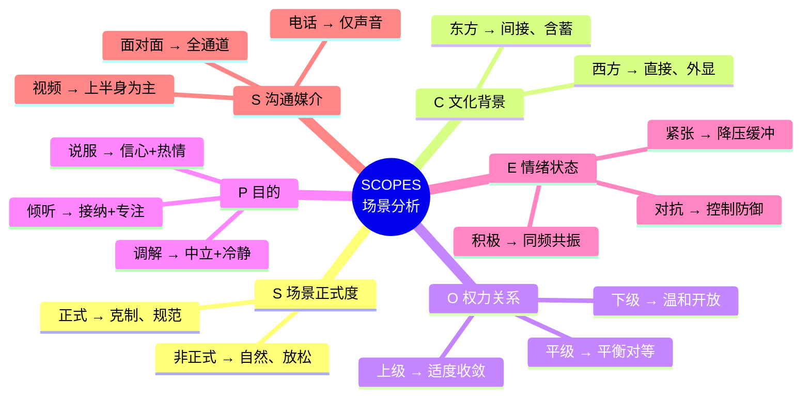
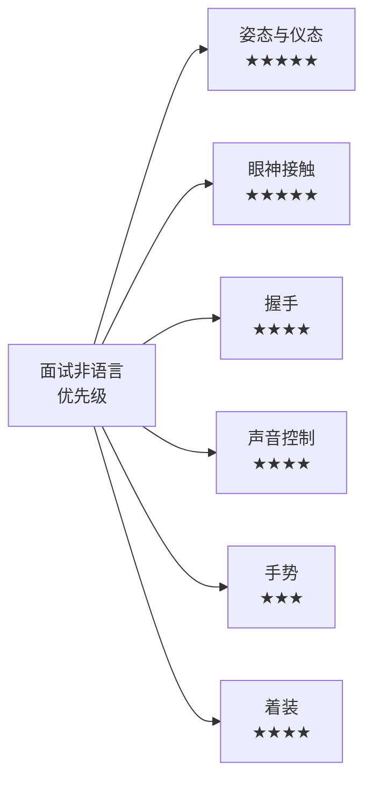
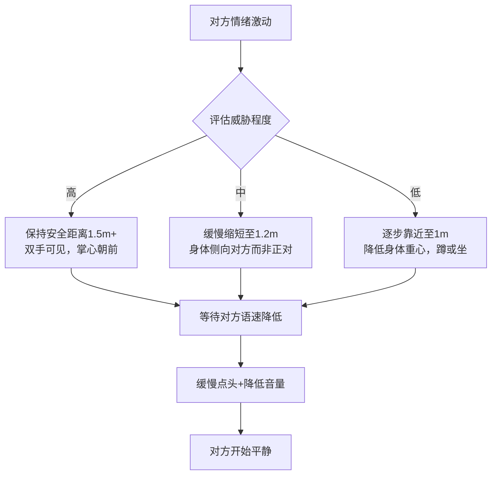

## 十、不同场景的非语言策略

前面九个模块帮你建立了非语言沟通的完整能力体系——从自我觉察到微表情识别，从手势运用到空间管理。但能力本身只是"工具箱"，真正的挑战在于**根据场景灵活调用不同的工具组合**。

同一个手势在商务谈判中可能传递自信，在亲密对话中却显得咄咄逼人；同样的眼神接触在西方文化中是真诚，在某些东亚文化中却可能是冒犯。**非语言沟通没有放之四海而皆准的公式，只有基于场景的策略性选择。**

本模块将系统梳理十大典型场景，每个场景都包含：场景特征分析、核心非语言通道优先级、具体策略清单、常见错误警示，以及一个浓缩案例。掌握这些场景化策略后，你将能够在任何社交环境中自如地调用非语言工具。

---

### 场景分析框架：SCOPES 模型

在进入具体场景之前，先建立一个通用的分析框架。面对任何沟通场景，你可以用 **SCOPES 模型** 快速评估非语言策略的六个维度：

| 维度 | 英文 | 核心问题 | 策略影响 |
|------|------|----------|----------|
| **S** — 场景正式度 | Setting | 这个场合的正式程度如何？ | 决定非语言表达的规范性和克制程度 |
| **C** — 文化背景 | Culture | 对方的文化背景对非语言行为有何期待？ | 决定距离、眼神接触、身体接触的边界 |
| **O** — 权力关系 | Power | 双方的权力/地位关系如何？ | 决定姿态的主导/从属倾向、空间占有方式 |
| **P** — 目的 | Purpose | 这次沟通的核心目的是什么？ | 决定哪些非语言通道需要强化 |
| **E** — 情绪状态 | Emotion | 当前的情绪氛围是积极、紧张还是对抗？ | 决定情绪调节和非语言信号的温度 |
| **S** — 沟通媒介 | Medium | 是面对面、视频还是电话？ | 决定可用的非语言通道范围 |

使用方法：进入任何场景前，花30秒在脑中过一遍SCOPES的六个问题。这不是要你做复杂的计算，而是培养一种**场景意识**——让你从"凭感觉行事"升级为"有策略地选择"。

---

### 场景一：求职面试——第一印象的生死时速

#### 场景特征

面试是典型的**高压力、短时间、权力不对等**场景。面试官在最初7秒内就会形成对你的第一印象（心理学中的"首因效应"），而这个印象中非语言信号的权重高达60%以上。你的能力、经验、谈吐——这些都需要时间来展示，但你的姿态、眼神、握手在你开口之前就已经"说话"了。

#### 核心通道优先级

#### 具体策略

**（一）入场与落座**

入场时的3-5步是你建立第一印象的关键窗口。具体做法：

- **步伐**：中等速度，不急不慢。步伐过快传递焦虑，过慢传递缺乏活力。每步间距约60-70厘米（正常步幅），脚掌先着地，避免拖沓声
- **站定**：走到面试官面前约1.2-1.5米处停下（社交距离），微微点头致意，等待对方示意再落座
- **落座**：不要一屁股坐下。先站在椅子旁，等面试官说"请坐"后，从容坐下。坐姿取椅面的前2/3，不要靠满椅背（过于放松）也不要只坐边缘（过于紧张）
- **双手**：自然放在桌面上或大腿上，双手交叠轻放是安全选择。避免抱臂、摸头发、转笔等自我安慰性动作

**（二）眼神管理**

面试中的眼神接触需要找到"黄金区间"——既要展示自信和诚意，又不能让对方感到被审视：

- **说话时**：60%-70%的时间保持眼神接触，尤其在回答关键问题时要直视面试官的眼睛
- **听题时**：70%-80%的时间保持眼神接触，表示你在认真倾听
- **思考时**：可以短暂将视线移向斜上方或桌面（2-3秒），表示你在认真组织语言，但不要长时间低头或看向窗外
- **多位面试官**：回答问题时主要看提问者，但每隔几秒扫视其他面试官，让每个人感到被尊重

**（三）手势与微动作**

手势在面试中的作用是**辅助表达**而非自我安抚。关键原则是"动作要有意图"：

- **积极信号**：说到关键点时用双手做出开放性手势（掌心朝上或朝前），展示数据时用手指指向简历上的具体位置，表示认同时轻微前倾并点头
- **危险信号**：频繁摸鼻子或嘴巴（暗示隐瞒）、双手交叉抱臂（防御）、坐姿后仰（不投入）、手指敲击桌面（不耐烦）、双腿抖动（焦虑）
- **"能量管理"技巧**：面试开始前，在洗手间做2分钟的"扩展性姿势"——双手叉腰或双臂展开，研究显示这可以降低皮质醇水平、提升自信感（Amy Cuddy, 2012，虽后续研究有争议，但主观感受的改善是确实的）

**（四）声音控制**

面试中你的声音是第二重要的非语言通道：

- **语速**：保持中等偏慢。紧张时人会不自觉加速，有意识地放慢20%。在回答行为面试题（"请举一个例子"）时，用"STAR法则"的节奏控制语速：情境（平稳）→ 任务（稍快）→ 行动（有力）→ 结果（放慢、加重）
- **音量**：适中偏亮。音量过小传递不自信，过大传递攻击性。一个简单测试：以对方能轻松听清但不需要侧耳为标准
- **语调**：避免"升调结尾"——把每句话都变成疑问句式的上扬语调。陈述观点时用降调结尾，传递确定性
- **停顿**：在关键观点前后加入0.5-1秒的停顿。停顿不是"卡壳"，而是给对方消化信息的时间，也展示你的从容

#### 常见错误

| 错误 | 为什么错 | 正确做法 |
|------|----------|----------|
| 过度微笑 | 全程微笑显得不真诚，尤其在讨论严肃话题时 | 在内容匹配时微笑，讨论挑战性话题时保持专注表情 |
| 面试官低头记录时停止说话 | 误以为对方不感兴趣 | 继续自然表达，记录是正常流程 |
| 入座前整理衣服太久 | 显得紧张和过度准备 | 提前在洗手间整理好，入场后只做微调 |
| 离开时太快起身 | 给人"急着走"的印象 | 起身后微笑、点头致意、说"感谢您的时间"，从容离开 |

#### 案例：林明的面试逆袭

林明是一家互联网公司的产品经理，技术能力出色但面试表现一直不理想。复盘时他发现：自己在面试中习惯性地后仰靠在椅背上，双手抱臂，回答问题时语速很快且语调平坦。

在一次关键面试前，他做了三处调整：

1. **坐姿**：改为微微前倾，双手自然放在桌面，展示开放和投入
2. **语速**：在每个回答的开头和结尾各放慢一拍，关键数字（"用户增长30%"）单独加重
3. **眼神**：回答核心问题时直视面试官的眼睛，在举例子时加入适当手势

结果：同一家公司的第二轮面试，面试官在反馈中写道"候选人对产品有深刻理解，且表达自信、条理清晰"——其实他的回答内容和第一轮几乎没有变化，改变的只是非语言信号的传递方式。

---

### 场景二：商务谈判——非语言的无声博弈

#### 场景特征

谈判是**信息博弈、利益博弈、心理博弈**的三重战场。研究表明，经验丰富的谈判者在做出让步决策时，有40%-60%的信息来源是对方的非语言信号而非语言内容（Adler, Rosen & Silverstein, 1998）。你的姿态、语调、停顿、甚至喝水的频率，都在向对方传递信号。

#### 核心通道优先级

| 通道 | 重要性 | 谈判中的特殊作用 |
|------|--------|-----------------|
| 姿态 | ★★★★★ | 传递权力地位和自信程度 |
| 声音 | ★★★★★ | 传递情绪状态和底线信号 |
| 眼神 | ★★★★ | 传递诚意和自信程度 |
| 手势 | ★★★★ | 传递开放/防御态度 |
| 空间距离 | ★★★ | 传递关系温度和权力动态 |
| 面部表情 | ★★★★ | 传递真实反应（微表情） |

#### 具体策略

**（一）座位选择的权力密码**

谈判桌的座位安排不是随机的，它会直接影响谈判的心理动态：

- **面对面坐**：最经典的谈判布局，但容易产生对抗感。适合正式商务谈判
- **L型坐**：坐在桌子的相邻两边，既有面对面的交流感，又减少了对抗性。适合合作型谈判
- **同侧坐**：坐在桌子的同一边，传递"我们是一伙的"信号。适合需要建立信任的初期谈判
- **无桌布局**：坐在沙发上，去掉桌子的物理屏障。适合高信任度的关系谈判

一个实用技巧：如果你是主场，提前安排L型座位，让对方坐在靠墙的一侧（减少背后的空间威胁感），自己坐在开放一侧（展示自信和掌控力）。

**（二）锚定效应的非语言强化**

谈判中的"锚定效应"（先出价者主导谈判区间）不仅依赖数字本身，还需要非语言的配合：

- **报出锚定价格时**：语速放慢，语调降低，眼神直视对方，微微前倾。这些信号组合传递"这是经过深思熟虑的数字"
- **对方报出不利价格时**：控制你的即时反应——不要皱眉、不要向后靠、不要发出叹息。保持中性表情2-3秒，然后用平缓的语调说"让我理解一下这个数字的基础"
- **关键技巧——"刻意停顿"**：在对方报完价后，停顿5-8秒（比正常对话中的停顿长得多）。这个沉默会产生压力，迫使对方补充信息或主动调整报价

**（三）识别对方的底线信号**

当谈判接近对方底线时，会出现以下非语言信号群：

- **声音线索**：语速突然加快（急于结束这个话题）、音量降低（底气不足）、频繁清嗓子
- **姿态线索**：身体后倾（想要"退出"这个讨论）、双手从桌面收回、交叉双臂
- **面部线索**：嘴唇紧闭（抑制不满）、快速眨眼（压力增大）、下巴收紧
- **行为线索**：频繁看手机/时钟（想要结束）、喝水频率增加（焦虑的自我安慰）

当你观察到这些信号时，意味着对方的让步空间已经接近极限。此时继续施压可能导致谈判破裂，更好的策略是转向其他议题或提出创造性方案。

**（四）"破冰"与"升温"的非语言节奏**

一场成功的谈判通常遵循这样的非语言节奏：

在僵持阶段尤其重要的是**控制情绪泄漏**——不要让焦虑、失望或愤怒通过非语言通道传递出去。一个实用技巧：在感到情绪波动时，有意识地将注意力转移到呼吸上（缓慢腹式呼吸3次），这能在5-10秒内降低生理唤醒水平。

---

### 场景三：公开演讲——掌控全场的非语言舞台

#### 场景特征

演讲是**一对多、高曝光、单向输出为主**的场景。你的非语言信号不仅影响听众对内容的接受度，还直接影响你是否能"镇住场子"。研究表明，演讲的说服力中，声音和视觉呈现的贡献度合计超过60%（Fripp, 2003）。TED演讲教练Chris Anderson指出：台上最好的演讲者，往往不是内容最深刻的人，而是最能用身体"讲故事"的人。

#### 具体策略

**（一）站姿与移动**

- **"黄金三角"站姿**：双脚与肩同宽，重心均匀分布在两脚之间，膝盖微曲（不要锁死）。这个站姿既稳定又自然，是你在台上的"默认姿态"
- **有意义的移动**：不要像笼中老虎一样来回踱步。移动要有目的——讲到不同的观点时，走到舞台的不同区域。这样听众会将空间位置与内容关联起来（"关于A他站在左边说，关于B他走到右边"）
- **台上的三个区域**：舞台中央=权威和核心观点；舞台左侧（观众右侧）=数据和事实；舞台右侧（观众左侧）=故事和情感。这不是死规则，但为你的移动提供了有意义的框架
- **避免的行为**：双手插口袋（不专业）、身体前后摇晃（焦虑）、背对观众看PPT（不尊重）

**（二）手势的"展示框"**

演讲中的手势比日常对话放大1.5-2倍才能在舞台上有效传递：

- **"展示框"技巧**：将你的核心手势活动区域想象为从腰部到肩部、两肩宽度的矩形框。手势在这个框内活动是自然且有力的
- **数字手势**：说到"第一点""第二点"时用手指明确展示，帮助听众跟上逻辑
- **对比手势**：用左右手分别代表两种对立观点（"一方面……另一方面"），在空间上制造视觉对比
- **递进手势**：用手从低到高的渐进动作表示增长、进步、升级

**（三）眼神的"灯塔扫描法"**

面对几十甚至几百人的听众，眼神管理需要一套系统方法：

1. **分区**：将观众席在心中分为左前、中前、右前、左后、中后、右后六个区
2. **锚定**：在每个区选择一个具体的人作为"锚点"（选择那些在点头或微笑的人）
3. **扫动**：每5-8秒切换一个区，看向该区的锚定点2-3秒
4. **覆盖**：确保整场演讲中每个区都被"照顾"到至少3-4次

关键原则：不要只看前排（最常见的错误），不要快速来回扫视（传递焦虑），不要盯着PPT或笔记。

**（四）声音的戏剧化运用**

演讲中的声音需要比日常对话更大的动态范围：

- **音量变化**：关键观点提高音量，亲密故事降低音量。音量的对比本身就是一种强调
- **语速变化**：正常叙述用中等语速，关键论点放慢50%，快速列举加速（创造紧迫感）
- **停顿的力量**：在揭示重要信息前停顿2-3秒（制造期待），在重要观点后停顿3-5秒（让信息沉淀），在笑声过后停顿到安静（等观众完全聚焦再继续）
- **避免"嗯""啊"填充词**：用停顿替代填充词。停顿让你显得深思熟虑，填充词让你显得不确定

---

### 场景四：职场会议——层级与协作的非语言暗流

#### 场景特征

会议是**权力关系显性化、多方互动、信息密度高**的场景。在会议中，非语言信号不仅传递个人态度，还不断定义和重塑权力结构——谁发言时大家会放下手机？谁的笑话总能引来笑声？谁的手势能让讨论方向改变？这些都比"谁的职位更高"更能反映真实的权力地图。

#### 具体策略

**（一）座位选择的策略**

会议室的座位不是随机的——每个位置都传递不同的信号：

| 座位位置 | 传递的信号 | 适合场景 |
|----------|-----------|----------|
| 主位（长桌一端） | 主导、权威、控制议程 | 你是会议主持人或最高决策者 |
| 主位对面（另一端） | 对等对话、潜在对抗 | 你需要与主持人正面讨论 |
| 主位两侧（近端） | 合作、支持、盟友 | 你想与主持人建立同盟关系 |
| 中间位置 | 参与但不主导 | 你是普通参与者，不想过度突出 |
| 角落位置 | 观察者、边缘参与者 | 你想低调观察会议动态 |

实用建议：如果你是会议的推动者但不是主持人，选择主位右侧的第二个座位——这个位置既靠近权力中心，又不会给主持人造成"挑战"的感觉。

**（二）发言时的非语言控制**

在多人会议中发言，你需要同时管理"进入发言"和"维持发言权"两个阶段：

- **进入发言**：在别人说完后，先微微前倾、张嘴吸气（准备说话的信号），同时举起一只手做"接手"手势。如果两个人同时开口，保持你的手势但微笑看向对方，示意"你先说"或"我接着说"
- **维持发言权**：说话时保持手势展开、眼神扫视全场、音量稳定。如果你感觉到有人要插话，可以略微提高音量、加快手势节奏，同时用眼神接触那位准备插话的人——这是一种非语言的"我还没说完"信号
- **被挑战时**：不要向后靠（退缩信号）、不要交叉双臂（防御信号）、不要提高音量（对抗信号）。正确的做法是保持前倾、降低语速、用平缓但坚定的语调回应

**（三）倾听者的非语言反馈**

会议中你不仅是发言者，更是倾听者。优秀的倾听非语言反馈包括：

- **同步点头**：在对方说到关键点时缓慢点头（每1-2秒一次），传递"我在跟随你的逻辑"
- **记录姿态**：低头记笔记是有价值的非语言反馈——它传递"你说的值得记录"。但注意不要一直低头，每30-45秒抬头看一次发言者
- **镜像**：如果会议氛围积极，适度镜像发言者的姿态可以建立默契。但如果存在分歧，避免镜像——它会暗示你认同对方的立场

---

### 场景五：冲突调解——降压与重建连接

#### 场景特征

冲突场景是**情绪高唤醒、信任低水平、非语言信号被放大**的特殊环境。当人处于愤怒或防御状态时，对非语言信号的敏感度会提高3-5倍，同时也更容易误读中性信号为敌意信号。在冲突中，你的每一个非语言动作都可能成为"灭火器"或"火上浇油"。

#### 具体策略

**（一）姿态降级序列**

当对方情绪激动时，你的首要任务是**降低对方的生理唤醒水平**。这需要一套渐进式的姿态降级策略：

**为什么身体侧向对方而非正对？** 正面对立的姿态（face-to-face）在进化心理学中是"挑战"的原始信号，而侧向姿态（side-by-side或45度角）传递"我不是你的对手"。这不是要你完全背对对方，而是将身体朝向偏转30-45度。

**（二）声音的"降温"技巧**

在冲突中，声音是最容易失控也最容易调整的通道：

- **音量匹配再降低**：先匹配对方的音量（不要比对方大，也不要太小——太小会让对方觉得你在"哄小孩"），然后在30秒内逐步降低到正常音量。对方通常会无意识地跟随你的音量下降
- **语速拉长**：将正常语速放慢20%-30%，每个词之间稍微增加间距。慢语速传递"我不急，我有耐心听你说"
- **音调下沉**：愤怒时人的声带紧绷，音调自然升高。有意识地降低喉头位置，让声音从胸腔发出，传递稳定感
- **关键句式配合**："我理解你的感受"这句话用慢速+低音量+轻微前倾来说，效果是快速+高音量+后仰的5倍以上

**（三）需要绝对避免的非语言行为**

在冲突场景中，以下行为会被对方解读为敌意或蔑视，必须严格控制：

- **手指指向对方**：这是最具攻击性的手势之一，在几乎所有文化中都被视为"指责"
- **翻白眼或嘴角下拉**：轻蔑信号，会让冲突瞬间升级
- **双臂抱胸+后仰**：传递"我不在乎你说什么"，会让对方感到被忽视
- **频繁看手机或时钟**：传递"你的时间不值得我认真对待"
- **叹气**：无论多么轻的叹气，在冲突中都会被放大为"不耐烦"或"瞧不起"

**（四）调解者的非语言中立策略**

如果你是冲突的第三方调解者，你的非语言信号需要保持中立：

- **身体朝向**：在双方之间交替朝向，不偏向任何一方。每说完一个观点，将身体转向另一方，确保双方感受到同等的关注
- **眼神分配**：双方各获得约50%的眼神接触时间。如果一方在叙述时另一方表现出不满，用温和但坚定的眼神安抚不满的一方
- **姿态一致性**：对双方使用相同的姿态——如果你对一方前倾倾听，对另一方也要保持同样的前倾。姿态的差异会被解读为"偏心"

---

### 场景六：社交聚会——快速建立连接的非语言魔法

#### 场景特征

社交聚会（派对、行业活动、校友会等）是**信息密度低、关系建立快、时间碎片化**的场景。你通常只有3-5分钟来建立第一印象并决定是否继续深入交流。在这个场景中，非语言策略的核心目标是：**让对方在最短时间内感到你"好接近、有趣、值得认识"**。

#### 具体策略

**（一）入场的"开放信号组合"**

进入社交场合时，你的身体就是一个广告牌。以下信号组合可以最大化你的"可接近性"：

- **姿态**：站直但不僵硬，重心均匀分布在两脚，双手自然垂在身体两侧或一只手拿饮料（不要双手都拿东西——会封闭身体前侧）
- **面部**：嘴角微微上扬（不是夸张的笑容，而是一种"我心情不错"的基调表情），眉毛偶尔轻抬（这是人类表达"友善好奇"的原始信号）
- **眼神**：扫视全场，对上眼神时微笑并轻微点头——这是最简单有效的"我愿意交流"信号
- **避免的行为**：靠墙站立（退缩）、低头看手机（自我封闭）、双手抱胸（防御）、与认识的人扎堆不散（社交舒适区陷阱）

**（二）破冰对话中的非语言配合**

在社交破冰中，非语言信号比你说什么更重要：

- **镜像技巧**：对方喝饮料时你也喝、对方换站姿时你跟随、对方笑时你跟着笑。这种无意识的同步会创造"我们很像"的感觉。但注意节奏——对方做完动作后1-2秒再跟随，同步太快会显得刻意
- **"积极倾听三件套"**：点头（表示理解）+ 微笑（表示认同）+ 前倾（表示兴趣）。在社交场景中，这三者同时出现时，对方会感到"这个人真的对我感兴趣"
- **触摸的梯度**：在合适的情况下，从"安全触摸"开始——轻触前臂（全世界最不冒犯的触摸区域）1-2秒，如果对方没有退缩或表现出不适，可以在后续对话中适度重复。绝对不要在初次见面时触碰肩膀以上或腰部以下的区域

**（三）群体对话中的非语言定位**

当你加入一个已在进行的对话群体时：

- **先在外围站立**，身体朝向群体，微笑倾听1-2分钟，了解话题和氛围
- **等待自然的对话间隙**（笑声后、话题转换时），微微前倾并用开放手势进入
- **进入后不要立刻占据中心**——先做"倾听者+回应者"，用点头和微笑支持当前的发言者，在3-5分钟后再开始主导话题
- 如果群体没有为你让出空间（身体朝向没有调整），说明他们可能不欢迎新加入者——不要硬挤进去，礼貌退出即可

---

### 场景七：约会与亲密关系——温度与边界的平衡

#### 场景特征

亲密场景是**高情感投入、高敏感度、边界模糊**的特殊环境。非语言信号在这里的作用远超语言——研究表明，在恋爱关系的建立阶段，非语言信号对吸引力判断的贡献超过80%（Givens, 1978）。更重要的是，在亲密关系中，非语言信号传递的是**情感温度**而非信息内容。

#### 具体策略

**（一）吸引力的非语言信号**

在约会初期，以下非语言信号可以有效传递吸引力：

- **延长眼神接触**：在普通社交中，眼神接触持续1-3秒。在约会场景中，可以延长到3-5秒，然后微笑移开。这种"看→移开→再看"的节奏被称为"三角注视"——先看一只眼睛，移到另一只眼睛，再移到嘴唇，然后回到眼睛
- **声音变柔**：降低音量、放慢语速、增加声音的"温暖感"（胸腔共鸣增加）。研究显示，当人对谈话对象感到吸引时，声音会自然变得柔和（Hughes, 2020）
- **身体朝向的渐进靠近**：从社交距离（1.2m）逐步缩短到个人距离（0.5-1m），观察对方的反应。如果对方没有后退或表现出不适，说明边界是可以继续缩短的
- **"无意触碰"**：在对话中自然地轻触对方手臂或手背（例如说到有趣的事情时"碰一下"），持续1-2秒后自然移开

**（二）读懂对方的非语言信号**

约会中对方可能不会直接告诉你"我对你有感觉"或"我觉得不舒服"，但非语言信号会诚实地"说话"：

**兴趣信号：**
- 身体朝向你，尤其是脚尖的方向（脚尖指向谁，说明注意力在谁身上）
- 在你说话时频繁微笑，且笑容涉及眼部肌肉（杜兴微笑）
- 不自觉地调整外表（拨弄头发、整理衣领——"求偶性整理"行为）
- 缩短与你的距离，找借口靠近
- 镜像你的动作和姿态

**不适信号：**
- 身体后倾或转向侧面
- 交叉双臂或用手中的物品（包、杯子）挡在身体前面
- 眼神游移、频繁看手机或周围环境
- 短暂的微表情闪过（皱眉、嘴角下拉）
- 回答简短，身体僵硬

**关键原则**：当观察到不适信号时，**立刻后退一步（物理距离和心理距离）**。不要试图用更多的热情来"融化"对方——这只会让不适加剧。给对方空间，让关系的节奏由更谨慎的一方来主导。

**（三）长期关系中的非语言维护**

在长期亲密关系中，非语言沟通的重点从"吸引"转向"维护连接"：

- **日常微接触**：出门前的拥抱（至少6秒——研究表明6秒以上的拥抱能触发催产素释放）、路过时的轻触肩膀、并肩行走时的手牵手
- **"转向"而非"转离"**：John Gottman的研究发现，幸福的伴侣在日常中会"转向"对方的非语言邀请（回应一个微笑、接住一个眼神、回应一个拥抱），而关系恶化的伴侣则习惯性"转离"（忽视、回避、不回应）
- **冲突中的非语言修复**：在争吵中，一个适时的微笑、一次温柔的触摸、一个缓和的语调，比任何道歉的话都更有效。Gottman称之为"修复尝试"（repair attempt），其成功率高度依赖非语言的真诚度

---

### 场景八：跨文化场景——同一个动作，不同的含义

#### 场景特征

跨文化场景是**规则切换、敏感度加倍、误读风险最高**的场景。同一个非语言动作在不同文化中可能有完全相反的含义。在跨文化沟通中，非语言策略的核心原则是**"先观察，后模仿"——不要假设你知道对方的规则**。

#### 关键文化差异对照表

| 非语言维度 | 东亚文化（中日韩） | 西方文化（欧美） | 中东文化 | 拉美文化 |
|-----------|-------------------|----------------|----------|----------|
| **眼神接触** | 对上级/长者适度减少，过多被视为不敬 | 直接眼神接触=自信真诚 | 异性间减少 | 频繁且持久 |
| **握手** | 较轻，时间较短 | 坚定有力，2-3秒 | 同性间较久，异性间可能避免 | 温暖且伴随身体接触 |
| **个人距离** | 较大的个人空间（约1m） | 约0.6-1.2m | 同性间较近 | 较近，约0.5m |
| **身体接触** | 较少，尤其在公共场合 | 适度（握手、拍肩） | 同性间较多 | 频繁（拥抱、贴面） |
| **点头** | 日本=我在听（不一定同意）；中国=同意或理解 | 点头=同意 | 左右摇头=是（印度、保加利亚） | 点头=理解/同意 |
| **手势** | 避免大手势 | 手势自然外展 | 避免左手递物 | 手势丰富外放 |
| **沉默** | 积极（思考、尊重） | 消极（不适、尴尬） | 可以是尊重 | 不太舒服 |

#### 具体策略

**（一）"文化扫描"三步法**

进入跨文化场景前，用三步快速校准你的非语言行为：

1. **预习**：了解对方文化的基本非语言禁忌（如在泰国不要用脚指人，在日本不要在电梯里大声说话）
2. **观察**：到达后先花5-10分钟观察当地人如何互动——他们的距离多近、眼神接触多频繁、手势幅度多大
3. **校准**：以对方的行为模式为基准调整自己的行为。宁可偏保守（少做）也不要冒进（做太多）

**（二）高风险行为清单**

以下是跨文化场景中最高风险的非语言行为——这些动作在某些文化中可能造成严重冒犯：

- **竖大拇指**：在中东和西非部分地区是侮辱性手势
- **OK手势（拇指食指成圈）**：在巴西、土耳其是侮辱性手势
- **用左手递物**：在印度、中东、东南亚部分地区被视为不洁
- **拍头**：在佛教文化中，头部被视为最神圣的部位
- **露出鞋底**：在阿拉伯文化中，鞋底被视为不洁，将鞋底对着人是严重侮辱
- **公共场合大声笑**：在日本文化中，大声笑可能被视为不成熟或不自控

**（三）适应而非模仿**

跨文化适应不等于"变成对方"。核心原则是：

- **调整幅度，不改变本质**：你可以减少手势幅度来适应东亚文化，但不需要完全消除手势
- **尊重禁忌，保留风格**：在了解对方文化禁忌后避免踩雷，但在安全范围内保持你自己的沟通风格
- **出错后快速修复**：如果不小心触犯了文化禁忌，立刻真诚道歉并用对方文化的道歉方式补救（如在日本鞠躬道歉）

---

### 场景九：线上与远程沟通——屏幕背后的非语言重建

#### 场景特征

远程沟通（视频会议、直播、线上教学）是**非语言通道被严重压缩**的场景。你的下半身完全消失，手势被限制在屏幕框内，空间距离感丧失，触觉通道被完全关闭。2020年后的研究表明，视频会议疲劳（Zoom Fatigue）的一个重要原因是大脑需要更费力地处理残缺的非语言信号（Bailenson, 2021）。

#### 具体策略

**（一）镜头中的"画框管理"**

你的摄像头画面就是你的"虚拟身体"，需要精心管理：

- **头部位置**：头部应在画面上方1/3处，不要顶着画面顶部（压迫感），也不要沉到画面底部（"井底视角"）
- **眼睛高度**：摄像头应与眼睛齐平或略高。摄像头低于眼睛会让人看到你的鼻孔和下巴（不专业的视角），高于眼睛则会让你看起来在"仰望"——即使你只是在正常坐姿
- **距离**：坐在离摄像头约60-80cm处，确保你的头部和肩膀完整出现在画面中，头部上方留约10%的空白
- **背景**：简洁、不杂乱。避免强光从背后照射（变成剪影），避免虚拟背景在移动时"吃掉"你的耳朵或头发

**（二）"镜头眼神"技巧**

视频中最大的非语言挑战是"眼神"——当你看屏幕上对方的脸时，在对方看来你在看下方而不是看他们的眼睛：

- **核心技巧**：在重要发言时，直接看摄像头而不是屏幕。这在对方看来就是你在直视他们的眼睛
- **实用做法**：将对方的视频窗口拖到屏幕顶部、紧贴摄像头下方的位置。这样你看对方的脸时，视线与摄像头的偏差最小
- **切换策略**：在一般性的讨论中看屏幕上的对方（自然的社交行为），在关键观点、自我介绍、总结陈词时看摄像头（建立连接感）

**（三）手势与上半身的激活**

在视频中，你需要将非语言表达"浓缩"到上半身：

- **手势范围**：在胸部到肩膀的高度、两肩宽度的范围内做手势。确保手势不超出画面，也不要太靠近脸部（变形）
- **前倾信号**：在视频中，身体微微前倾是"我在投入参与"的最有效信号。当你想要表达认同或兴趣时，前倾5-10度
- **点头的放大**：视频中的点头比面对面交流中需要更明显——幅度稍大、频率稍慢，确保在小屏幕上能被对方捕捉到
- **表情的增强**：视频压缩了面部的视觉信息，你的微笑需要比面对面时稍微"大"一点——嘴角上扬幅度增加10%-15%

**（四）声音的视频化调整**

视频会议中的音频通常被压缩，你的声音需要适应这种压缩：

- **语速放慢**：音频压缩会损失部分语音清晰度，放慢15%-20%的语速可以弥补
- **避免同时说话**：视频的音频延迟（100-300ms）使得两个人同时说话时会产生尴尬的重叠。在别人说完后停顿0.5-1秒再开口
- **善用静音**：不说话时按静音——不仅是消除背景噪音，也是一种非语言信号："现在是你的发言时间，我在专注听"

---

### 场景十：服务与销售——信任建立的非语言密码

#### 场景特征

服务与销售场景是**目标导向、信任关键、短时间窗口**的环境。客户在与你互动的前30秒内就会形成"是否信任你"的判断，而这个判断中非语言信号的权重超过50%（Ambady & Rosenthal, 1993，"薄片判断"理论）。你的任务是通过非语言信号快速传递三个核心信息：**我可信、我专业、我在乎你**。

#### 具体策略

**（一）迎接客户的非语言三件套**

客户进门或上线的前10秒，用以下信号组合建立初始信任：

1. **即时回应**：在客户出现后3秒内做出反应——抬头、微笑、身体朝向客户。即使你正在忙，也要先用眼神和点头表示"我看到你了"
2. **微笑的类型选择**：服务场景中使用"杜兴微笑"（眼角+嘴角同时变化的真诚微笑）而非"社交微笑"（只有嘴角）。杜兴微笑能让客户的好感度提升40%以上
3. **开放姿态**：双手自然放在身体两侧或桌面上（掌心可见），身体朝向客户，不交叉双臂

**（二）倾听时的"客户全聚焦"**

当客户描述需求或问题时，你的非语言信号应该传递"你是此刻我世界的中心"：

- **眼神接触**：70%-80%的时间看客户，不要看电脑屏幕、手机或其他同事
- **前倾**：适度前倾，传递"我在认真听你说话"
- **同步反应**：在客户表达情感时（如对产品质量的不满），你的面部表情应该同步——适度皱眉、点头、嘴角下拉。这传递"我在乎你的感受"
- **记录**：在客户说话时做笔记（或在电脑上打字记录），并时不时抬头看客户——"你说的我在记"

**（三）产品展示中的非语言说服**

在展示产品或服务时，你的非语言信号可以显著影响客户的感知价值：

- **手势引导**：用手掌朝上的手势引导客户注意产品关键部位，而不是用手指"戳"
- **动作放慢**：在演示产品的核心功能时，放慢你的动作速度50%。慢动作传递"这个很重要，请注意"
- **价值锚定的姿态**：在说出价格或核心优势时，停顿、直视客户、微微前倾。这三个信号组合传递"这是经过认真思考的价值"
- **等待反应的耐心**：报价后，保持沉默并直视客户，等待他们的反应。不要急于补充解释或折扣——沉默让你显得自信，急于补充则显得底气不足

**（四）处理投诉时的非语言降级**

客户投诉是服务场景中最高压力的子场景，需要同时传递两种信号："我理解你的不满"和"我能解决这个问题"：

- **身体高度**：如果客户站着，你也站起来；如果客户坐着，你也坐下。不要出现"你坐我站"的高度差——这会传递居高临下的信号
- **身体朝向**：正对客户，不要侧身或后仰。正对传递"我全身心投入来解决你的问题"
- **语速匹配再降低**：先匹配客户的语速和音量（太快的语速会让激动的客户觉得你不在乎），然后逐步降低到正常水平
- **"解决信号"姿态**：在提出解决方案时，双手掌心向上（"这是我为你准备的方案"），身体前倾，语速放慢。这个姿态组合传递"我有信心解决你的问题"

---

### 跨场景通用原则

无论你面对的是哪种场景，以下五条原则始终适用：

**（一）一致性原则**

你的语言内容、声音语调和身体动作必须传递一致的信息。如果你说"我很高兴见到你"但双臂交叉、身体后倾，对方会相信你的身体而不是你的话。梅拉比安的研究虽然被广泛误读，但其核心洞察是正确的：**当语言和非语言矛盾时，人们倾向于相信非语言信号**。

**（二）适应性原则**

没有一套非语言策略可以通吃所有场景。核心能力不是"记住每个场景该怎么做"，而是培养**快速评估场景并调整行为**的能力。SCOPES模型就是为此设计的工具——反复使用直到它成为你进入任何场景时的本能反应。

**（三）自然性原则**

所有技巧最终都要内化为自然习惯，而不是刻意表演。刻意的非语言操控会让对方感到"这个人不真实"。正确的方法是：先刻意练习（在安全的环境中），然后逐步减少意识控制，直到技巧融入你的自然行为模式。研究表明，一个新习惯的形成平均需要66天（Lally et al., 2010）。

**（四）观察先于行动原则**

在任何不熟悉的场景中，花前5分钟观察而不是行动。观察环境中其他人的非语言行为模式——他们的距离、眼神、手势、音量——然后以此为基准调整自己。"先观察后行动"永远比"先行动后调整"更安全。

**（五）反馈循环原则**

非语言沟通能力的提升依赖于持续的反馈循环：

- **即时反馈**：在对话中观察对方对你非语言信号的反应（微笑、点头、后退、皱眉）
- **事后复盘**：重要对话后回顾自己的非语言表现——哪些信号收到了积极反馈，哪些导致了负面反应
- **录像回看**：定期用手机录下自己在模拟场景中的表现，观察自己的非语言习惯——大多数人对自己的非语言行为存在严重的"盲区"
- **信任的人**：找一个你信任的人，请他在与你互动时提供非语言反馈——"你刚才说话时一直在摸鼻子"或"你刚才的眼神让我不太舒服"

---

### 自测清单：我的场景适应能力到了哪个水平？

用以下清单评估你在不同场景中的非语言策略掌握程度：

**入门级（0-3分）**——你开始意识到非语言信号的存在

- [ ] 我知道不同场景需要不同的非语言策略
- [ ] 我能在重要场合中有意识地控制自己的姿态
- [ ] 我能识别基本的情绪表情（开心、生气、悲伤）

**进阶级（4-7分）**——你能在熟悉的场景中有策略地运用非语言信号

- [ ] 我能在面试/谈判等特定场景中运用非语言策略
- [ ] 我能读懂对方的基本非语言信号并做出调整
- [ ] 我能控制自己的情绪泄漏（不将焦虑/愤怒传递给对方）
- [ ] 我了解不同文化的基本非语言禁忌

**精通级（8-10分）**——你能在任何场景中自如地运用非语言沟通

- [ ] 我能在30秒内评估一个新场景并调整非语言策略
- [ ] 我能捕捉微表情并据此调整互动策略
- [ ] 我能在冲突中通过非语言信号降级对方情绪
- [ ] 我能在跨文化场景中灵活调整非语言行为
- [ ] 我能在线上会议中有效运用上半身和声音传递信号

如果评分在0-3分，建议回到本章前面的模块逐一学习；如果在4-7分，选择你最薄弱的1-2个场景进行针对性练习；如果在8-10分，尝试在真实场景中主动应用，并通过事后复盘持续精进。
