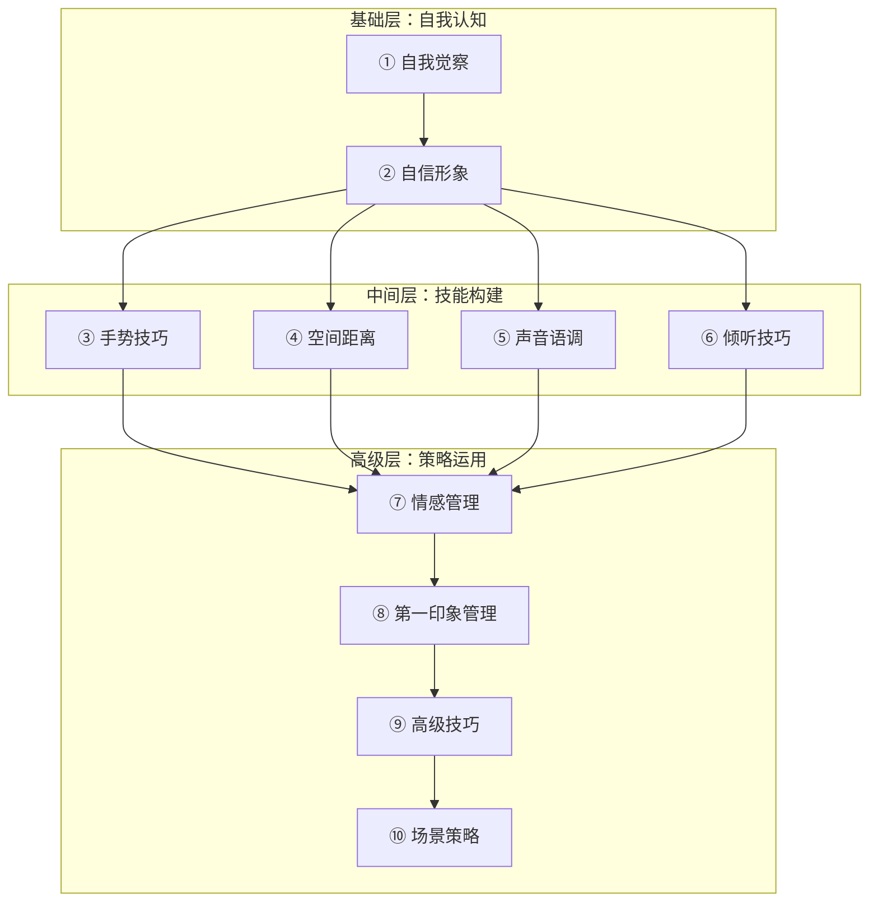
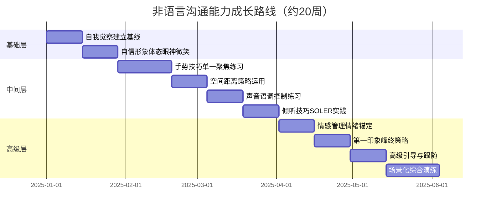

## 本节小结

本节从"理论"走向"实践"，系统拆解了非语言沟通的十大核心技能模块。从自我觉察的起点出发，经由自信形象塑造、手势表达、空间管理、声音控制、倾听技巧、情感管理、第一印象管理，直至高级技巧与场景化策略，构建了一条完整的非语言沟通能力成长路径。以下从知识体系回顾、核心框架整合、能力成长路线三个维度进行总结。

---

### 一、十大模块知识体系回顾

非语言沟通的十大模块并非孤立存在，而是形成了一个三层递进的技能体系。基础层决定了你能走多远，中间层决定了你能做多好，高级层决定了你能走多高。

#### 1.1 基础层：自我认知（模块①②）

**自我觉察**是一切改变的起点。研究显示，约70%的人无法准确描述自己的眼神接触模式（与实际偏差超过40%），80%以上的人不知道自己的"默认表情"是什么。大脑每秒接收约1100万比特的感官信息，但意识层面仅处理约50比特（Zimmerman, 1989），这意味着绝大多数非语言行为在无意识中运行。自我觉察的核心任务是：将无意识的非语言行为纳入意识监控范围。

关键方法包括：

- **七维度自我观察清单**：体态姿势、手势习惯、眼神模式、面部表情、声音特征、空间偏好、外在形象
- **三遍视频回看法**：第一遍关声音只看画面，第二遍关画面只听声音，第三遍综合检查一致性
- **七天轮换微练习**：每天聚焦一个维度，从眼神接触（第1天）到综合运用（第7天）
- **触发器法**：手机解锁=体态扫描，开门=表情检查，坐下=身体语言检查

**自信形象**建立在三个支柱之上——体态、眼神、微笑。Amy Cuddy的研究表明，高能量姿势（如胜利姿势、超人姿势）在重要场合前保持2分钟，可以显著提升心理状态。杜兴微笑（涉及眼轮匝肌、出现鱼尾纹）与社交微笑的区别，是判断真诚度的关键信号。

#### 1.2 中间层：技能构建（模块③⑥⑤⑥）

**手势技巧**的核心是"黄金区域"——腰部与肩部之间的空间。十大核心手势包括列举、对比、大小描述、拒绝（掌心向外）、接纳（掌心向上）、强调、指向（全掌而非单指）、连接、时间线、框架手势。手势的能量级别需匹配场景：高能量（大型演讲）、中能量（商务会议）、低能量（亲密对话）。

**空间距离**基于霍尔（Hall）的四区域模型：

| 区域 | 距离范围 | 典型场景 | 关键信号 |
|------|----------|----------|----------|
| 亲密距离 | 0-45cm | 情侣、亲子 | 进入需明确许可 |
| 个人距离 | 45-120cm | 朋友交谈 | 舒适社交范围 |
| 社交距离 | 120-360cm | 商务会谈 | 正式互动标准 |
| 公共距离 | 360cm以上 | 公开演讲 | 单向传播为主 |

渐进式缩短距离（从社交距离逐步过渡到个人距离）是建立信任的有效策略，但必须随时观察对方的舒适度信号。

**声音语调**是被严重低估的非语言工具。四个核心控制维度：音量、音调、语速、停顿。关键数据：在重点信息前停顿2秒，可将听众记忆留存率提升40%。四种停顿类型各有用途——悬念停顿制造期待，强调停顿突出重点，消化停顿留出理解时间，情感停顿引发共鸣。

**倾听技巧**以SOLER模型为核心框架：Squarely（正面朝向）、Open（开放姿态）、Lean（微微前倾）、Eye contact（眼神接触）、Relaxed（放松状态）。"WAIT技巧"——对方说完后等待1-2秒再回应——是展示深度倾听的简单而有效的方法。镜像神经元机制解释了为什么表情同步（反映对方的情绪状态）能产生真正的共情效果。

#### 1.3 高级层：策略运用（模块运用（模块⑦⑧⑨⑩）

**情感管理**的关键认知是：情绪会通过非语言信号"溢出"给他人，且情绪具有传染性。压抑情绪（suppression）会导致更多非语言泄漏，正确的做法是管理情绪而非压制情绪。情绪锚定法——在重要场合前花1-2分钟回忆一个积极记忆——可以设定情感基调。4-7-8呼吸法（吸气4秒、屏息7秒、呼气8秒）是快速调节生理状态的有效工具。

**第一印象管理**基于两大科学发现：Todorov（2006）的研究表明，面部可信度判断在100毫秒内完成，基于温暖度（意图）和能力（技能）两个维度；Kahneman的峰终定律表明，体验记忆由高峰时刻和结束时刻决定，而非平均水平。六大非语言要素按影响力排序：面部表情 > 眼神接触 > 体态姿势 > 握手 > 声音 > 外在形象。

**高级技巧**聚焦于非语言"引导"与"跟随"的策略运用。核心逻辑是先通过镜像匹配建立默契（rapport），再逐步引入期望的行为变化。边界设定信号（减少眼神接触、后倾、封闭姿态）是保护个人空间的重要技能。

**场景化策略**将前九个模块的所有技巧整合到四种典型情境中：正式场合（稳健克制）、非正式场合（自然放松）、冲突场景（冷静开放）、亲密场景（温暖亲近）。核心认知是：同一套非语言工具，因场景不同需要截然不同的校准方式。

---

### 二、贯穿全节的六大核心原则

纵览十大模块，有六条原则贯穿始终，它们是将零散技巧整合为系统能力的关键纽带。

#### 2.1 信号一致性（Signal Consistency）

这是贯穿所有模块的"元原则"。一致性的三个维度：

- **跨通道一致性**：面部表情、手势、身体姿态、声音语调传递同一信息。例如，说"我很高兴见到你"时，如果双臂交叉、声音平淡、表情僵硬，接收方会倾向于相信非语言信号而非语言内容——这就是Mehrabian 7-38-55法则的底层逻辑
- **语言-非语言一致性**：言语内容与身体信号不匹配时，人们更倾向于相信非语言信号。研究表明，当两者冲突时，非语言信号的可信度是语言内容的5倍以上
- **时间一致性**：在不同时间、不同场合保持稳定的非语言风格。突然的行为变化会被敏锐的观察者捕捉到，可能引发不信任

#### 2.2 自然性（Naturality）

所有技巧的终极目标是内化为自然习惯，而非刻意表演。Noel Burch的四阶段能力模型清晰地描绘了这一过程：

| 阶段 | 状态 | 特征 | 持续时间参考 |
|------|------|------|-------------|
| 阶段一 | 无意识无能力 | 不知道自己不知道 | 不确定 |
| 阶段二 | 有意识无能力 | 知道自己不擅长 | 可能持续数周 |
| 阶段三 | 有意识有能力 | 做得好但需要刻意努力 | 21-66天（习惯养成） |
| 阶段四 | 无意识有能力 | 自动化执行 | 持续维护即可 |

大多数人停留在阶段二到阶段三之间就放弃了，因为"刻意"的感觉让人不舒服。突破的关键是：每次只聚焦一个技能，坚持21天形成肌肉记忆后再进入下一个。

#### 2.3 场景适应性（Context Adaptation）

没有放之四海皆准的非语言策略。不同场景对同一信号的解读可能完全相反：

- 眼神接触：在一对一交流中占60-70%为宜，但在东亚文化中，对长辈或上级的过多直视可能被视为不敬
- 身体距离：拉丁美洲和阿拉伯文化偏好较近距离，北欧和东亚文化偏好较远距离
- 手势幅度：南欧文化中大幅度手势是热情的表达，在东亚文化中可能被视为不够沉稳

场景适应性的核心能力是：快速评估当前情境（正式/非正式、冲突/亲密、文化背景），然后从你的非语言"工具箱"中选择合适的工具组合。

#### 2.4 渐进性（Progressiveness）

非语言沟通能力的提升是一个持续的过程，不可能一蹴而就。有效的学习路径是：

1. **自我觉察**（第1-2周）：建立基线，了解自己的默认模式
2. **单一技能聚焦**（第3-8周）：每次只练习一个维度，每天15分钟
3. **多技能整合**（第9-14周）：将已掌握的技能组合运用
4. **场景化应用**（第15-20周）：在真实场景中反复练习
5. **自动化执行**（第21周以后）：技能成为自然反应

#### 2.5 真实性（Authenticity）

所有技巧服务于表达真实的自我，而非创造一个虚假的人设。杜兴微笑之所以比社交微笑更有力量，正是因为它源于真实的情感。当技巧被用来放大而非伪造内在状态时，效果最佳。试图伪装情绪时，非语言泄漏（nonverbal leakage）会通过微表情、身体姿态等渠道暴露真实感受。

#### 2.6 文化敏感性（Cultural Sensitivity）

爱德华·霍尔提出的高语境文化与低语境文化框架，是理解跨文化非语言差异的基本工具。高语境文化（如中国、日本、阿拉伯国家）中，非语言信号承载更多信息，含蓄和间接是尊重的表现；低语境文化（如美国、德国、北欧）中，语言本身承载更多信息，直接和明确是效率的体现。

---

### 三、关键理论模型速查

本节涉及多个学科的理论模型，以下汇总便于回顾和查阅：

| 模型名称 | 提出者 | 核心内容 | 应用模块 |
|----------|--------|----------|----------|
| 7-38-55法则 | Mehrabian | 信息传递：内容7%、语调38%、肢体语言55% | 贯穿全节 |
| 四阶段能力模型 | Noel Burch | 无意识无能力→有意识无能力→有意识有能力→无意识有能力 | 模块① |
| 四区域空间模型 | Hall | 亲密/个人/社交/公共四个距离区域 | 模块④ |
| SOLER模型 | Egan | 正面朝向/开放姿态/前倾/眼神接触/放松 | 模块⑥ |
| 温暖-能力二维模型 | Todorov | 第一印象基于温暖度和能力两个维度，100毫秒内完成 | 模块⑧ |
| 峰终定律 | Kahneman | 体验记忆由高峰时刻和结束时刻决定 | 模块⑧ |
| 首因效应 | Solomon Asch | 先接收的信息对整体印象有更大影响 | 模块⑧ |
| 高/低语境文化 | Hall | 高语境文化依赖非语言信号，低语境文化依赖语言内容 | 模块⑩ |
| 情绪传染理论 | Hatfield | 情绪会自动从一个人传递给另一个人 | 模块⑦ |
| 镜像神经元理论 | Rizzolatti | 观察他人行为时大脑会自动模拟，产生共情基础 | 模块⑥ |
| 工作记忆模型 | Cowan (2001) | 工作记忆容量约4±1个组块，限制多通道同时处理 | 模块① |

---

### 四、能力自评与成长路线

#### 4.1 非语言沟通能力自评清单

以下自评表覆盖十大模块的核心能力项，按1-5分评估（1=完全不掌握，5=自动化执行）：

| 能力维度 | 自评项 | 得分 |
|----------|--------|------|
| 自我觉察 | 我能准确描述自己的眼神接触模式 | ___ |
| 自我觉察 | 我知道自己的默认面部表情 | ___ |
| 自我觉察 | 我能在对话中实时监控自己的非语言信号 | ___ |
| 自信形象 | 我在重要场合前会使用高能量姿势 | ___ |
| 自信形象 | 我能自然运用杜兴微笑 | ___ |
| 手势技巧 | 我的手势与语言内容同步 | ___ |
| 手势技巧 | 我能根据场景调整手势幅度 | ___ |
| 空间管理 | 我能根据关系和场景选择合适距离 | ___ |
| 空间管理 | 我能识别他人的空间舒适度信号 | ___ |
| 声音控制 | 我能有意识地调整语速和音调 | ___ |
| 声音控制 | 我善用停顿来增强表达效果 | ___ |
| 倾听技巧 | 我能用SOLER模型展示倾听 | ___ |
| 倾听技巧 | 我会等对方说完再回应 | ___ |
| 情感管理 | 我能在压力下保持冷静的非语言表现 | ___ |
| 情感管理 | 我能用情绪锚定法调节状态 | ___ |
| 第一印象 | 我了解第一印象的关键时间节点 | ___ |
| 第一印象 | 我能有意识地管理首因效应和峰终效应 | ___ |
| 高级技巧 | 我能先镜像匹配再引导对方 | ___ |
| 高级技巧 | 我能用非语言信号设定边界 | ___ |
| 场景策略 | 我能根据不同场景切换非语言风格 | ___ |

**总分解读**：20-40分（入门期，聚焦基础层）、41-60分（成长期，强化中间层）、61-80分（成熟期，精进高级层）、81-100分（专家级，持续维护）

#### 4.2 分阶段成长路线图

---

### 五、常见陷阱与避坑指南

在学习和实践非语言沟通的过程中，以下陷阱最容易让人走弯路：

#### 5.1 试图同时改变所有维度

**表现**：学完所有模块后，每次对话都在脑子里同时监控眼神、手势、声音、距离……结果手忙脚乱，反而表现更差。

**根因**：工作记忆容量有限（Cowan, 2001：约4±1个组块），无法同时有意识地管理6-7个非语言通道。

**解法**：每次只聚焦一个维度，练习到半自动化后再加入下一个。就像学开车——先练方向盘，再加油门，最后才同时操作。

#### 5.2 把技巧当表演

**表现**：刻意摆出"自信姿势"、练习"完美微笑"，但内心并不自信。结果显得僵硬、不自然，甚至产生反效果。

**根因**：混淆了"技巧内化"和"表面伪装"。技巧的本质是放大内在状态的表达效率，而非凭空创造一个不存在的状态。

**解法**：先调整内在状态（情绪锚定、认知重构），再用外在技巧放大它。真实永远比完美更有感染力。

#### 5.3 忽视文化差异

**表现**：在国内学的沟通技巧，出国后照搬；或者用西方教材的标准衡量所有人。

**根因**：非语言信号的含义高度依赖文化语境。一个在纽约表示"OK"的手势，在巴西是侮辱性手势。

**解法**：在新文化环境中，先观察当地人的非语言模式，再调整自己的策略。默认假设：你熟悉的规则不一定适用于当前环境。

#### 5.4 只看单次表现，忽视长期模式

**表现**：因为一次面试中眼神接触不够就认为自己"不擅长非语言沟通"。

**根因**：非语言沟通的效果是长期模式的累积，单次表现受情绪、环境、疲劳等多种因素影响。

**解法**：用视频记录和日记建立长期追踪，关注趋势而非单点。真正的能力体现在一致性上。

#### 5.5 只关注发送，忽视接收

**表现**：花大量时间练习如何"发送"非语言信号，却忽略了如何"接收"和解读他人的非语言信号。

**根因**：沟通是双向的。无法准确解读对方的非语言信号，就无法做出恰当的回应。

**解法**：倾听技巧（模块⑥）和情感管理（模块⑦）的核心就是接收端的能力。每天花5分钟观察陌生人的互动，练习解读他们的关系和情绪状态。

#### 5.6 过度解读微表情

**表现**：看了几本FACS（面部动作编码系统）的书后，开始在日常对话中分析每一个微表情，搞得自己和对方都很紧张。

**根因**：微表情研究（Ekman）在实验室条件下有效，但日常场景中噪音太多，单独一个微表情几乎没有诊断价值。

**解法**：关注整体模式而非单一信号。一个人双臂交叉可能是因为冷、因为习惯、因为紧张——需要结合其他信号和情境综合判断。

---

### 六、从"知道"到"做到"：行动清单

知识只有在行动中才能转化为能力。以下是基于十大模块提炼的最高优先级行动项：

**本周就可以开始的三件事：**

1. **录制一段3分钟的自我对话视频**，用三遍回看法分析自己的非语言模式。这是建立自我觉察基线的最快方法
2. **在下一次重要对话前，花2分钟做高能量姿势+情绪锚定**。选择一个让你感到自豪的回忆，保持胜利姿势2分钟
3. **在下一次倾听他人时，刻意练习SOLER模型**——正面朝向、开放姿态、微微前倾、保持眼神接触、放松

**持续21天的习惯养成：**

- 每天选择一个"触发器"事件（如手机解锁、开门、坐下），触发时快速扫描当前的体态和表情
- 每次对话后花30秒回顾：我的非语言信号与语言内容一致吗？
- 每周用手机录一段1分钟的说话练习，回放检查声音语调的四个维度（音量、音调、语速、停顿）

**每月一次的深度练习：**

- 选择一个真实场景（如求职面试、商务会议、社交聚会），事先设计完整的非语言策略，事后用视频或他人反馈复盘
- 跨文化场景练习：如果有机会与不同文化背景的人互动，观察并记录非语言差异

---

### 七、本节与后续章节的衔接

在下一节"实战案例"中，我们将把本节学到的十大核心技巧投入八大实战场景——求职面试、公开演讲、约会、商务谈判、销售、领导力、社交、服务——进行具体展示。每个案例都将综合运用多个模块的技巧，展示它们在真实场景中如何协同工作。

> **学习建议**：如果你对某个模块的掌握还不够扎实，建议先回到对应章节复习和练习，再进入实战案例部分。实战的前提是基本功到位——没有扎实的单一技能，场景化整合只会手忙脚乱。
