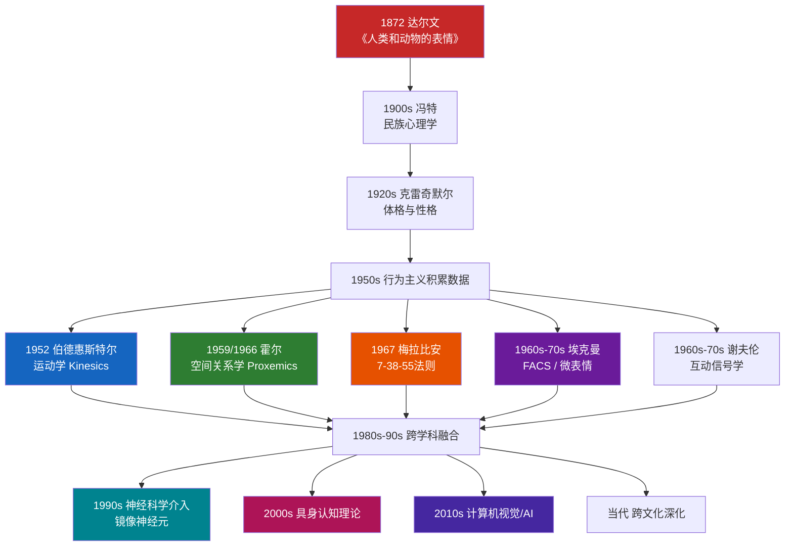

## 一、非语言沟通的学科渊源

非语言沟通（Nonverbal Communication）并非某位学者灵光一现的产物，而是跨越一百五十余年、涉及生物学、心理学、人类学、社会学、语言学、神经科学等多个学科的累积结晶。理解这段学科发展史，不仅能帮助我们把握非语言沟通的理论根基，更能理解为什么同一行为在不同理论框架下会有截然不同的解读——这种理论自觉，是从"凭感觉看人"跃升到"有依据地理解人"的关键分水岭。

### 1.1 达尔文：一切的起点

#### 1.1.1 《人类和动物的表情》的核心贡献

1872年，查尔斯·达尔文（Charles Darwin）出版了《人类和动物的表情》（*The Expression of the Emotions in Man and Animals*），这部著作被公认为非语言沟通研究的奠基之作。达尔文在这本书中提出了三条核心原则：

**有用联合性习惯原则（Serviceable Associated Habits）**：某些表情动作最初是与实用性行为相关联的。例如，狗在准备攻击时露出牙齿，最初是为了保护犬齿、便于撕咬；人类在愤怒时皱眉、鼻翼扩张，最初是为了增强视觉聚焦和增大呼吸量。这些实用行为通过代代遗传，逐渐固化为本能反应，即便原始功能已经消失，表情仍然保留下来。

**对立原则（Antithesis）**：当一个心理状态与其对立面产生时，身体会做出完全相反的动作。狗在表示顺从时身体低伏、尾巴下垂（与攻击时的昂首竖尾完全对立）；人在表示自信时挺胸抬头（与表示谦卑时的低头缩肩对立）。这条原则解释了为什么非语言信号往往以"对"的形式出现——每一种姿态都有其对立面。

**神经系统的直接作用原则（Direct Action of the Nervous System）**：某些表情是神经系统在强烈情绪下的直接生理产物，与意志或习惯无关。极度恐惧时的面色苍白（血液重新分配到大肌肉群以准备"逃跑"反应）、极度愤怒时的全身颤抖（交感神经系统过度激活），都是这类反应。它们不可伪装、不可抑制，因此是判断真实情绪的可靠线索。

这三条原则至今仍是解读非语言行为的基础框架。现代研究不断证实，人类约有20种基本面部表情具有跨文化一致性，这正是达尔文进化论观点的有力证据。

#### 1.1.2 达尔文的研究方法论

达尔文采用的研究方法在当时极具开创性。他建立了一套"比较法"——同时观察人类婴儿、精神障碍患者、不同文化背景的成年人以及多种动物的情绪表达，寻找其中的共性。他的研究素材包括：摄影师纪尧姆-本杰明·杜兴（Guillaume-Benjamin Duchenne）的面部电刺激实验照片（通过电刺激面部肌肉，系统记录不同肌肉组合产生的表情）、来自世界各地传教士和旅行者提供的跨文化观察报告、以及他对自己孩子长达数年的日记式观察记录。

这种多维度、跨物种的比较研究方法，为后来的跨文化表情研究确立了范式。

### 1.2 从达尔文到现代：半个世纪的沉寂与酝酿（1872-1950）

达尔文之后，非语言沟通研究并没有立刻蓬勃发展。这段"沉寂期"并非空白，而是多个相关学科各自积累基础的酝酿阶段。

#### 1.2.1 冯特的民族心理学

德国心理学家威廉·冯特（Wilhelm Wundt）——实验心理学之父——在他的十卷本《民族心理学》（*Völkerpsychologie*, 1900-1920）中系统讨论了手势、表情和语言的关系。冯特认为手势是语言的前身，原始民族的手势系统比文明社会更为发达，因为文明社会用口语替代了大部分手势功能。这一观点虽然带有时代局限性，但提出了一个重要命题：非语言行为与语言发展之间存在深层关联。

#### 1.2.2 克雷奇默尔的体型-气质理论

德国精神病学家恩斯特·克雷奇默尔（Ernst Kretschmer）在《体格与性格》（*Körperbau und Charakter*, 1921）中将体型与气质类型相关联，试图从身体形态推断性格特征。尽管他最初的分类过于简单化，但这一思路开创了"从外在形态推断内在特质"的研究路径，后来演变为印象管理和非语言自我呈现的研究方向。

#### 1.2.3 行为主义的"去情绪化"

20世纪上半叶，行为主义（Behaviorism）在美国心理学界占据主导地位。华生（John B. Watson）和斯金纳（B.F. Skinner）主张只研究可观察、可测量的外在行为，拒绝讨论"内在心理状态"。行为主义对外部行为的严格关注，客观上积累了大量关于表情、姿态与刺激-反应关联的数据，但同时也抑制了对非语言沟通"意义"的深入探讨。直到认知革命（1950年代末）之后，研究者才重新获得研究"内在状态"的合法性。

### 1.3 现代非语言沟通研究的诞生（1950-1970年代）

1950年代至1970年代是非语言沟通研究的"黄金奠基期"，一批开创性学者几乎同时在不同维度上建立了这一领域的核心理论框架。

#### 1.3.1 雷·伯德惠斯特尔：运动学的创立

雷·伯德惠斯特尔（Ray Birdwhistell）是最早将非语言行为作为独立学科来系统研究的学者之一。他在1952年出版的《运动学导论》（*Introduction to Kinesics*）中首创了"运动学"（Kinesics）这一术语，将其定义为"对身体运动在沟通中的功能进行系统研究的学科"。

伯德惠斯特尔的方法论深受语言学结构主义的影响。他将身体动作类比为语言中的音素和词素：最小的有意义单位叫"运动素"（kine），由运动素组合而成的更大单位叫"运动形态"（kinemorph），运动形态按照语法规则组合形成"运动短语"（kinemorphic phrase）。他的团队通过慢动作逐帧分析电影录像，试图建立一套"身体语言的语法"。

**伯德惠斯特尔的核心发现包括**：

- 美国人至少使用约60种不同的面部运动单元，每种都有特定的社会含义
- 身体动作与言语之间存在精密的同步关系——说话时的手势不是随意的，而是与语法结构和语义内容严格对应的
- 不同文化群体拥有不同的"运动体系"（movement system），同一种手势在不同文化中可能含义完全不同

虽然伯德惠斯特尔后来因其过度追求语言学类比、忽视生物本能因素而受到批评，但他确立了一个关键理念：**身体动作是可以像语言一样被系统分析的符号系统**。这一理念直接催生了后来的微表情分析、身体语言读术等应用方向。

#### 1.3.2 爱德华·霍尔：空间关系学的奠基

爱德华·T·霍尔（Edward T. Hall）是一位在纳瓦霍人和霍皮人部落中长期进行田野调查的人类学家。他在1959年的《无声的语言》（*The Silent Language*）和1966年的《隐藏的维度》（*The Hidden Dimension*）中，首次系统提出了"空间关系学"（Proxemics）——研究人类如何使用空间进行沟通的学科。

**霍尔的四区模型**至今仍是理解人际距离的标准框架：

| 距离类型 | 范围 | 适用场景 | 典型互动 |
|---------|------|---------|---------|
| 亲密距离（Intimate） | 0-45 cm | 恋人、亲子、密友 | 拥抱、耳语、身体接触 |
| 个人距离（Personal） | 45-120 cm | 好友、熟人 | 日常对话、社交场合 |
| 社交距离（Social） | 120-360 cm | 同事、陌生人间的正式交流 | 商务会议、工作讨论 |
| 公共距离（Public） | 360 cm以上 | 公共场合 | 演讲、授课、舞台表演 |

霍尔的重要贡献不仅在于划分了距离区间，更在于他揭示了空间使用的文化差异。他发现：拉丁美洲人和阿拉伯人在对话时习惯保持较近的距离（约30-50厘米），而北欧人和北美人则倾向于更远的距离（约60-120厘米）。当不同文化背景的人对话时，距离偏好不同会导致一方觉得"太近了，不舒服"，另一方觉得"太远了，不亲切"——这种误解在跨文化商务场景中极为常见。

霍尔还提出了"单一活动链"（Single Active Chain）和"多重活动链"（Polyactive Chain）的概念：西方人倾向于一次专注于一件事（单一活动链），而拉丁文化中的人同时处理多件事（多重活动链）。这一差异体现在空间使用上，就是拉丁文化中的对话空间更容易被第三方"插入"，而北欧文化中则视为打扰。

#### 1.3.3 保罗·埃克曼：表情研究的集大成者

保罗·埃克曼（Paul Ekman）是20世纪后半叶非语言沟通研究领域最具影响力的学者。他从1960年代开始的一系列研究，几乎重新定义了人们对表情的理解。

**跨文化表情研究**：埃克曼与华莱士·弗里森（Wallace V. Friesen）在1960-1970年代进行了一系列里程碑式的跨文化研究。他们前往巴布亚新几内亚的弗雷族（Fore）——一个与外部世界几乎没有接触的原始部落——让当地人辨识西方人的表情照片。结果显示，弗雷族人能够准确辨认快乐、悲伤、愤怒、恐惧、惊讶、厌恶这六种基本表情，准确率与西方被试相当。这一发现有力支持了达尔文的假设：**基本面部表情是人类进化过程中形成的本能反应，具有跨文化的普遍性**。

**面部动作编码系统（FACS）**：埃克曼和弗里森在1978年开发了面部动作编码系统（Facial Action Coding System）。FACS将人类面部的所有可能运动分解为46个独立的"动作单元"（Action Units, AU），每个AU对应一组特定的面部肌肉或肌肉群的收缩。例如：

- AU1+AU4 = 皱眉（眉内侧上抬 + 眉间下降）
- AU6+AU12 = 真实的微笑（眼轮匝肌收缩产生"鱼尾纹" + 嘴角上扬）
- AU12单独出现 = 礼节性微笑（仅嘴角上扬，眼部无变化）

FACS至今仍是面部表情研究的"黄金标准"工具，被广泛应用于心理学研究、临床诊断、动画制作、人机交互等领域。2019年，FACS已被机器学习自动化算法（如OpenFace）所实现，使得大规模表情分析成为可能。

**微表情研究**：埃克曼还发现了"微表情"（Micro-expression）——持续时间仅1/25秒到1/5秒的快速面部表情，通常是被刻意压抑的真实情绪的瞬间泄漏。微表情不能被有意识地抑制或伪造，因此被视为识别欺骗的重要线索。虽然微表情在测谎领域的实际效果仍有争议，但这一概念深刻影响了执法审讯、安全筛查和临床心理评估的实践。

#### 1.3.4 阿尔伯特·梅拉比安：信息传递比例的研究

阿尔伯特·梅拉比安（Albert Mehrabian）是加州大学洛杉矶分校的心理学家，他在1967年发表的两项实验研究，产生了非语言沟通领域最著名也最常被误解的数据——"7-38-55法则"。

梅拉比安的实验设计如下：他让被试听同一句话（如"dear"或"honey"），但配合不同的语调（喜欢、中性、厌恶），同时让另一组被试看同一句话，但配合不同的面部表情。然后测量被试对说话者态度的判断。

**他的原始结论是**：当面部表情与语调不一致时，被试对说话者态度的判断中，面部表情占55%，语调占38%，语言内容仅占7%。

**这个数据的适用范围极其有限**，它仅适用于以下条件同时成立的情况：

1. 话题涉及情感态度（而非事实信息）
2. 面部表情、语调和语言内容之间存在矛盾
3. 被试需要判断说话者的"真实态度"

**常见误读**：很多人将7-38-55法则理解为"所有沟通中，肢体语言占55%、语调占38%、语言占7%"，这完全曲解了梅拉比安的本意。在传递事实信息时（如报一个电话号码、讲解一个技术方案），语言内容显然是主导因素。梅拉比安本人多次公开澄清这一误读，但"55-38-7"法则已经被传播得如此广泛，以至于它已经成为非语言沟通研究中最具影响力也最具误导性的"神话"之一。

**正确理解**：7-38-55法则的核心启示是——在涉及情感和态度的沟通中，非语言信号的影响力远超语言内容。这个定性结论是成立的，但具体比例数字不可泛化。

#### 1.3.5 阿尔伯特·谢夫伦：互动信号学

阿尔伯特·谢夫伦（Albert Scheflen）是一位精神科医生和人类学家，他在1960-1970年代的研究开创了"互动信号学"（Interactional Signaling）这一方向。谢夫伦的核心贡献在于：**人类在社交互动中的身体姿态不是孤立的个体行为，而是参与者之间的同步协调系统**。

他发现的"姿态呼应"（Postural Congruence）现象指出：当两个人处于融洽的互动中时，他们的身体姿态会不自觉地趋于一致——一方交叉双腿，另一方也会交叉；一方身体前倾，另一方也会前倾。这种同步是无意识发生的，但它传递着"我们是一伙的""我认同你"的社会信号。

谢夫伦还提出了"行为流"（Behavioral Stream）的概念：人类的沟通行为是一个连续的、不中断的"流"，而非一系列独立的"点"。一次对话中的每个姿态、每次眼神接触、每个手势，都不是独立事件，而是嵌入在整个互动序列中的"行为句子"，必须放在时间线上下文中才能正确解读。

### 1.4 跨学科融合与当代发展（1980年代至今）

#### 1.4.1 神经科学的介入

1990年代以来，脑成像技术（fMRI、EEG、MEG）的发展，使得研究者能够直接观察大脑在处理非语言信息时的活动模式，为这一领域注入了全新的实证基础。

**镜像神经元（Mirror Neurons）**：1992年，意大利帕尔马大学的贾科莫·里佐拉蒂（Giacomo Rizzolatti）团队在猕猴大脑的前运动皮层（F5区）发现了一组特殊神经元——当猴子执行某个动作（如抓取食物）时这些神经元放电，而当猴子看到另一只猴子执行同样的动作时，这些神经元也放电。1996年，这一发现被正式发表并在人类身上得到验证。

镜像神经元的发现为非语言沟通提供了神经生物学层面的解释：**我们理解他人的情绪和意图，不仅通过"认知推理"，更通过大脑自动"镜像"对方的动作和表情**。当你看到别人打哈欠时自己也想打哈欠（共情性哈欠），当你看到别人被针扎时自己也感到疼痛（共情性疼痛），都是镜像神经元系统的产物。

**杏仁核与情绪面孔**：神经影像学研究反复证实，杏仁核（amygdala）是大脑中处理面部表情的关键结构，尤其对恐惧表情高度敏感。杏仁核受损的患者（如著名的S.M.病例）无法从面部表情中识别恐惧，但能够正常识别其他情绪。这一发现揭示了大脑对不同情绪表情的处理路径是分离的，而非统一的。

**梭状回面孔区（FFA）**：位于颞叶下部的梭状回面孔区专门负责面孔识别。当FFA受损时，患者会出现"面孔失认症"（prosopagnosia）——能够识别物体，却无法识别人脸。这说明人脸处理在大脑中拥有专属的"硬件"，也解释了为什么人类对面部表情的变化如此敏感——面孔识别系统与情绪识别系统在大脑中是紧密相连的。

#### 1.4.2 计算机视觉与人工智能

2010年代以来，深度学习技术的突破使得机器自动识别非语言行为成为现实。

- **自动表情识别**：基于卷积神经网络（CNN）的表情识别系统，已经在实验室环境中达到90%以上的准确率。Affectiva、Emotient等商业公司已将这一技术应用于广告效果测试、用户体验评估、远程教育监测等领域。
- **姿态估计**：OpenPose、MediaPipe等开源工具能够实时检测人体骨架的关键点位置，使得机器能够分析手势、姿态、行走模式等身体语言。
- **多模态情感计算**：当代研究已经不再局限于单一通道，而是综合分析面部表情、语音韵律、身体姿态、生理信号（心率、皮肤电导）等多个维度，实现对人类情绪状态的综合判断。

然而，自动化非语言行为分析面临着严峻的伦理争议：未经同意的面部表情监控、算法对不同种族的表情识别准确率差异（研究表明，多数表情识别算法对浅肤色面孔的准确率高于深肤色面孔）、以及将微表情测谎应用于执法和司法场景的可靠性问题。

#### 1.4.3 跨文化研究的深化

随着全球化的深入，跨文化非语言沟通研究从早期的"寻找普遍性"逐渐转向"理解差异性"。

- **表情展示规则（Display Rules）**：埃克曼在1970年代提出的这一概念指出，虽然基本表情具有普遍性，但不同文化对"在什么场合可以展示什么表情"有不同的规则。日本文化鼓励在上级面前抑制负面表情（用微笑替代不悦），而地中海文化则鼓励夸张表达情绪。这意味着同样的内在情绪，在不同文化中可能呈现为完全不同的外在表达。
- **眼神接触的文化差异**：在西方文化中，直接的眼神接触通常被解读为诚实、自信和尊重；而在许多亚洲和非洲文化中，对长辈或上级的持续直视被视为不敬甚至挑衅。这种差异在跨文化商务谈判和国际职场中经常引发误解。
- **手势的文化特异性**：许多手势在不同文化中有截然不同的含义。"OK"手势（拇指和食指形成圆圈）在美国表示"好的"，在巴西是侮辱性手势，在日本表示"钱"。竖起大拇指在西方表示"赞"，在中东某些地区是侮辱性手势。

#### 1.4.4 具身认知的理论革命

21世纪初兴起的"具身认知"（Embodied Cognition）理论，从根本上挑战了传统的"大脑=计算机"隐喻。具身认知的核心观点是：**认知不仅仅发生在大脑中，而是身体、环境和大脑三者互动的产物**。

这一理论对非语言沟通研究产生了深远影响：

- 面部反馈假说（Facial Feedback Hypothesis）：不是"高兴了才微笑"，而是"微笑也会让你感到高兴"。研究发现，用牙齿咬住铅笔（模拟微笑的面部肌肉运动）的被试，比用嘴唇夹住铅笔（不激活微笑肌肉）的被试报告更积极的情绪。
- 身体姿态影响决策：身体姿态挺直的被试比身体蜷缩的被试表现出更高的自信水平和更强的风险承受意愿。
- 空间位置影响人际关系：坐在对面的人比坐在旁边的人更容易产生竞争感，坐在旁边的人更容易产生合作感。

具身认知理论将非语言行为从"沟通的附属品"提升为"认知和情绪的构成要素"——你的身体姿态不是在"反映"你的心理状态，它本身就是你心理状态的一部分。

### 1.5 学科发展脉络总览

### 1.6 学科渊源的核心启示

理解非语言沟通的学科渊源，能为我们后续的理论学习和实践应用提供三个关键启示：

**第一，非语言沟通的研究根基是实证科学，而非民间智慧。** "察言观色"自古有之，但将它从经验直觉提升为可验证的科学知识，是达尔文、埃克曼等学者一百五十年工作的成果。这意味着我们可以用系统的方法去学习和训练非语言沟通能力，而非仅靠"天赋"和"悟性"。

**第二，没有单一理论能够解释所有非语言行为。** 进化论解释了基本表情的普遍性，但无法解释文化差异；文化相对论解释了展示规则的多样性，但无法解释跨文化的一致性。成熟的非语言沟通理解需要多理论视角的综合运用。

**第三，技术正在改变非语言沟通的边界。** 在远程视频会议、虚拟现实、元宇宙等新型沟通场景中，传统的面对面非语言线索被部分过滤或扭曲。理解这些限制，并学会在技术媒介中有效传递和接收非语言信号，是当代沟通能力的新维度。

***

> **本节关键人物速查**
>
> | 学者 | 贡献 | 代表作 | 核心概念 |
> |------|------|--------|---------|
> | 达尔文 | 非语言行为的进化论基础 | 《人类和动物的表情》(1872) | 三条原则：有用联合习惯、对立、神经直接作用 |
> | 伯德惠斯特尔 | 身体运动的系统分析 | 《运动学导论》(1952) | Kinesics、运动素（kine） |
> | 霍尔 | 人际空间距离的系统研究 | 《隐藏的维度》(1966) | Proxemics、四区模型、活动链 |
> | 埃克曼 | 面部表情的跨文化研究 | 《情绪解析》(1972) | FACS、基本表情、微表情、展示规则 |
> | 梅拉比安 | 非语言因素在态度判断中的权重 | 《无声的信息》(1971) | 7-38-55法则（仅限态度判断场景） |
> | 谢夫伦 | 互动中的身体同步性 | 《心理治疗中的时间》(1966) | 姿态呼应、行为流 |
> | 里佐拉蒂 | 镜像神经元的发现 | PNAS (1996) | 共情的神经生物学基础 |
