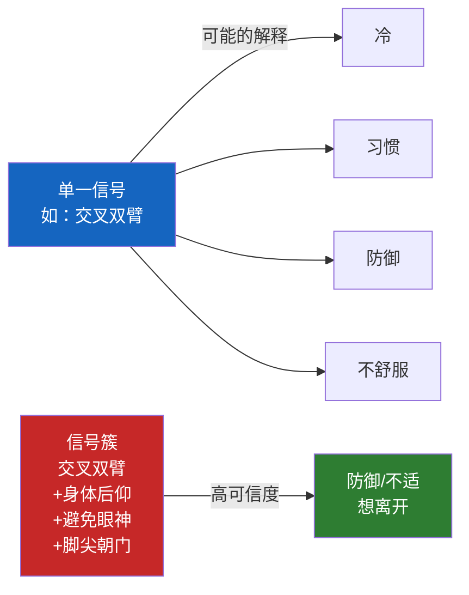
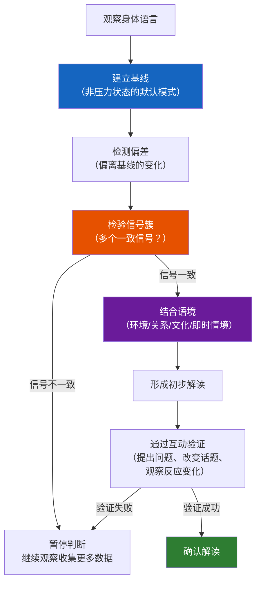

## 二、身体语言（Body Language）

### 2.1 身体语言的定义与学科定位

身体语言（Body Language）是非语言沟通体系中最核心、覆盖范围最广的概念。从狭义上说，它指除语言和声音特征之外，通过身体各部位的动作、位置和姿态变化来传递信息的沟通方式。从广义上说，它涵盖了面部表情、手势、眼神接触、身体姿态、空间距离、身体接触等所有以身体为媒介的非语言信号——在本书的框架中，我们将身体语言作为总概念，后续各节分别深入探讨其各个子维度。

理解身体语言需要先理解它的学科根基。在第一章中我们已经介绍了雷·伯德惠斯特尔（Ray Birdwhistell）在1952年创立的**运动学**（Kinesics），他将身体动作类比为语言系统：最小的有意义单位叫"运动素"（kine），由运动素组合而成的更大单位叫"运动形态"（kinemorph），运动形态按照语法规则组合形成"运动短语"（kinemorphic phrase）。虽然这一类比后来被批评过于机械，但它确立了一个关键认知：**身体动作不是随机的、混乱的，而是有结构、有规律、可系统分析的符号系统**。

这一认知的重要性在于：既然身体语言是有结构的，它就是可以被学习、被训练、被有意识运用的。非语言沟通能力不是某种神秘的"天赋"或"直觉"，而是一套可以通过系统学习和刻意练习来掌握的技能。

### 2.2 身体语言的进化起源

身体语言的历史远比口语语言古老。语言学和人类学的研究表明，人类口语语言的历史大约在5万至10万年之间，但身体语言——特别是通过面部表情、姿态和手势传递情感与意图的能力——可以追溯到数百万年前的灵长类祖先。

#### 2.2.1 语言出现之前的沟通系统

在口语语言尚未进化的漫长岁月中，人类祖先完全依赖非语言信号来完成所有社会功能：

- **协调集体行动**：狩猎时的无声手势配合、对危险信号的身体反应（僵直、后退），是群体生存的基础
- **建立社会等级**：通过姿态的扩张与收缩来确立支配与服从关系——挺胸抬头、占据更大空间的个体传递支配信号，缩小身体、低头的个体传递服从信号
- **表达情感与意图**：愤怒时的面部肌肉紧绷、恐惧时的瞳孔扩大和身体僵直、友好时的微笑和放松姿态，都是在语言出现之前就已经进化完善的情感表达系统
- **建立亲密关系**：身体接触（梳理毛发、拥抱）是灵长类建立和维护社会联结的核心方式

#### 2.2.2 为什么身体语言比语言更"诚实"

进化心理学提供了一个解释框架：语言是后来进化出的"新系统"，位于大脑皮层（新皮质），可以被有意识地控制和编排；而身体语言的核心处理路径位于更古老的边缘系统（limbic system），包括杏仁核和下丘脑，这些结构负责"战斗或逃跑"反应，其输出速度快于意识控制。

这就是为什么当一个人试图说谎时，他的语言可以经过精心编排，但身体语言往往会"泄露"真实信息——手指的微小颤动、脚尖不自觉地朝向出口、眨眼频率的突然变化。这些信号不是刻意发出的，而是边缘系统对威胁和压力的本能反应。

#### 2.2.3 "边缘系统劫持"与身体语言

丹尼尔·戈尔曼（Daniel Goleman）在《情商》中提出的"边缘系统劫持"（Amygdala Hijack）概念，为理解身体语言的不可控性提供了关键解释。当一个人感受到强烈情绪（恐惧、愤怒、极度焦虑）时，杏仁核会"劫持"大脑的处理路径，绕过前额叶皮层的理性分析，直接触发身体反应。在这种状态下：

- 面部血色变化（变红或变白）不可伪装
- 瞳孔的放大与缩小不可有意控制
- 呼吸模式的改变（屏息或急促呼吸）难以完全掩饰
- 手掌出汗、声音颤抖等自主神经系统反应不受意志支配

这解释了为什么在高压场景（审讯、关键谈判、重要面试）中，身体语言的解读价值尤其高——压力越大，边缘系统对身体的控制越强，理性伪装越困难。

### 2.3 身体语言的基本分类体系

理解身体语言需要一个清晰的分类框架。学术界已经发展出几种互补的分类方式，每种都从不同维度揭示身体语言的运作机制。

#### 2.3.1 按功能分类：埃克曼-弗里森的六类体系

保罗·埃克曼（Paul Ekman）和华莱士·弗里森（Wallace V. Friesen）在1969年提出了身体语言最经典的功能分类，将非言语身体动作分为六大类：

| 类型 | 英文名 | 定义 | 可控程度 | 示例 |
|------|--------|------|----------|------|
| **象征符号** | Emblems | 有明确的、可直接用语言替代的含义的手势 | 高（完全可有意使用） | 竖大拇指="好"、挥手="再见"、点头="是" |
| **说明性手势** | Illustrators | 伴随语言出现，用于辅助说明语言内容的手势和动作 | 中等（说话时自然产生） | 用手比划大小、手指计数、指向某物 |
| **情感展示** | Affect Displays | 表达情绪状态的面部表情和身体动作 | 低至中等（情绪自发产生，但可部分伪装） | 微笑表示高兴、皱眉表示困惑、身体前倾表示兴趣 |
| **适应性动作** | Adaptors | 用于缓解紧张或满足身体需求的自我触摸和调整动作 | 低（通常是无意识的） | 搓手、摸头发、玩笔、调整领带、抖腿 |
| **调节性动作** | Regulators | 用于控制和调节对话流程的动作 | 中等 | 点头示意对方继续、抬手示意对方暂停、身体前倾表示想发言 |
| **身体指向** | Illustrators (deictic) | 用身体部位指向特定方向或人 | 高 | 用手指方向、用目光引导注意 |

这一体系的核心价值在于：不同类型的信号有不同的解读方式。象征符号具有直接的语义含义（类似于"单词"），适应性动作主要反映内在情绪状态（而非对外传递信息），调节性动作则服务于互动流程的管理。将所有身体语言混为一谈地解读，是业余读术最常见的错误。

#### 2.3.2 按信号强度分类：从微弱到强烈

身体语言信号的强度存在巨大差异，这直接影响其可观察性和解读价值：

**宏观信号（Macro-signals）**：明显的、有意或半有意的身体动作，如大幅度挥手、用力握手、身体大幅前倾或后仰。这些信号最容易被观察到，但也最容易被有意识地控制和伪装。

**微观信号（Micro-signals）**：短暂的、细微的、通常是无意识的身体变化，如嘴角的瞬间微动、眉毛的快速上扬、指尖的微小颤动。这些信号最难以伪装，因此在判断真实性时最有价值，但需要训练才能识别。

**信号强度受到三个因素影响：**

1. **持续时间**：真实的情绪表达通常持续0.5-4秒；过短（不到0.5秒）可能是微表情泄露；过长（超过4秒）可能是刻意表演
2. **幅度大小**：幅度越大的动作越容易被观察到，但文化差异显著——地中海文化中的手势幅度远大于东亚文化
3. **身体部位**：面部和手部信号最为丰富，也最容易被观察；下肢（脚和腿）的信号最不容易被有意识控制，因此在判断真实态度时反而最有价值

#### 2.3.3 按信号方向分类：主动发出 vs. 被动泄露

**主动信号（Deliberate Signals）**：有意识发出的身体语言，目的是向对方传递特定信息。例如，面试时特意保持挺直的坐姿、销售时刻意使用开放性手势。主动信号的可控性高，但正因如此，它们的"真实性"需要结合被动信号来验证。

**被动信号（Involuntary Signals）**：无意识泄露的身体语言，反映真实的内在状态。例如，紧张时的搓手、不适时的脚尖转向门口、说谎时的眨眼频率增加。被动信号的可控性低，因此在判断真实情感时具有更高的参考价值。

### 2.4 开放性与封闭性身体语言

**开放性身体语言**与**封闭性身体语言**是最基础、也是最实用的二元分类框架。这一框架的核心价值在于，它不需要逐个解读每一个具体动作，而是通过整体模式来判断一个人的心理状态——是接纳的还是防御的，是自信的还是不安的。

#### 2.4.1 开放性身体语言的信号系统

开放性身体语言传递"我接纳你，我愿意与你互动"的信号。其典型表现包括：

- **上肢开放**：双臂自然展开或放在身体两侧（而非交叉），手掌向上或外露，手指放松伸展。手掌外露是人类进化中最强的信任信号之一——在灵长类动物中，展示手心意味着"我没有武器"。
- **躯干朝向**：身体正面对着对方，躯干微微前倾（约5-15度），表示"我对你感兴趣，我在认真听"。
- **腿部开放**：双脚平放在地面上，两腿自然分开或不交叉。腿的开放程度在很多文化中是放松和自信的信号。
- **面部开放**：眉毛自然或微微上扬，眼睛睁大（非瞪视），嘴角微微上翘或保持中性。面部肌肉没有明显的紧张感。
- **整体空间**：身体占据的空间较大，没有明显的收缩迹象。站姿时双脚与肩同宽，坐姿时身体占据椅子的大部分。

#### 2.4.2 封闭性身体语言的信号系统

封闭性身体语言传递"我在保护自己，我不太舒适或不太信任"的信号。其典型表现包括：

- **上肢封闭**：双臂交叉是最经典的封闭信号，但需要注意——双臂交叉也可能只是因为冷或习惯。判断的关键是：交叉时是否伴随其他封闭信号（身体后仰、避免眼神接触等）。
- **躯干回避**：身体侧转、后仰或向下缩，肩膀内扣，整体轮廓变小。这些是进化中"保护核心器官"的本能反应。
- **腿部封闭**：双腿紧紧交叉或缠绕，脚踝锁在一起（被称为"脚踝锁"，常见于紧张的面试者），或双脚缠在椅子腿上。
- **面部封闭**：皱眉、嘴角下撇、下巴收紧、眼睛变窄。面部肌肉整体呈现紧绷状态。
- **自我安慰动作（Self-soothing gestures）**：搓手、抚摸颈部、触摸锁骨区域——这些动作是婴儿期自我安慰行为的成人残留版，压力越大，出现频率越高。

#### 2.4.3 关键原则：不读单一信号，读信号簇

判断开放性或封闭性时，最重要的一条原则是：**不要根据单一信号下结论，要观察信号簇（Signal Clusters）**。

一个人交叉双臂可能只是因为冷或找不到放手臂的地方，但如果同时伴随着身体后仰、双腿交叉、头部微微偏向一侧、避免眼神接触——这些信号组合在一起，几乎可以确定此人处于防御或不适状态。

**信号簇解读的实操框架：**

| 信号数量 | 可信度 | 建议行动 |
|---------|--------|----------|
| 仅1个信号 | 低（可能是习惯或环境因素） | 暂不作判断，继续观察 |
| 2-3个一致信号 | 中等（可能反映真实状态） | 形成初步假设，通过后续互动验证 |
| 4个以上一致信号 | 高（很可能反映真实状态） | 可以较有信心地作判断，但仍需结合语境 |

### 2.5 身体语言中的镜像与同步

#### 2.5.1 镜像效应（Mirroring）的科学基础

**镜像效应**是指当两个人关系融洽或感到相互连接时，他们会不自觉地模仿对方的身体姿态、手势、动作节奏甚至呼吸模式。这一现象的神经基础是第一章中介绍的镜像神经元系统——当我们观察另一个人的动作时，大脑中执行相同动作的神经区域会被自动激活，就好像我们自己在做那个动作一样。

镜像效应的核心价值在于它既是一个**诊断工具**（判断关系质量的指标），也是一个**干预工具**（主动建立连接的手段）：

- **作为诊断工具**：如果你注意到对话中的另一方开始模仿你的姿态（你翘腿他也翘腿，你前倾他也前倾），这通常是一个强烈的积极信号，表明他对你说的内容感兴趣并且感到舒适。
- **作为干预工具**：有意识地、微妙地匹配对方的姿态和动作节奏，可以加速建立信任和亲和力。

#### 2.5.2 主动镜像的操作指南

**正确的镜像做法：**

1. **延迟1-3秒**：不要立即模仿对方的动作，这会显得刻意。等对方调整姿态后，自然地、逐步地调整自己的姿态来匹配。
2. **匹配大模式而非小细节**：镜像对方的整体姿态方向（前倾/后仰、开放/封闭），而不是每一个小动作（摸鼻子、转笔）。过于精确的模仿会让对方感到不安。
3. **保持自然流畅**：你是在"调频"而非"复制"。如果对方身体前倾，你可以在接下来的30秒内慢慢调整自己的坐姿；如果对方说话节奏慢，你也放慢节奏。
4. **接受不完美匹配**：完全对称的镜像反而显得不自然。对方双手放在桌上，你一只手放在桌上、另一只手自然放在腿上——这种"大致匹配"比精确复制更有效。

**镜像的禁忌：**

- 不要模仿对方的负面动作（如搓手、抖腿），这会将对方的紧张"传染"给你
- 不要在对方明显注意到的情况下进行镜像——如果对方突然改变姿态看你是否跟着变，说明你被发现了，应立即自然地恢复到独立姿态
- 不要对地位明显高于你的人进行过于明显的镜像——在权力不对等的关系中，过度镜像可能被解读为缺乏主见或讨好

#### 2.5.3 超越镜像：行为同步（Behavioral Synchrony）

镜像只是行为同步的一种形式。更深层的同步包括：

- **节奏同步**：两个人的说话节奏、呼吸节奏趋于一致。研究表明，共同唱歌、共同运动等活动可以快速建立节奏同步，这解释了为什么体育运动和音乐活动是建立团队凝聚力的有效手段。
- **情感同步**：两个人的情绪状态趋于一致。这就是为什么在一个紧张的团队中，一个人的焦虑会"传染"给其他人；而在一个积极的团队中，一个人的热情也能带动整个团队。
- **注意力同步**：两个人的目光关注同一件事物。这是人类从婴儿期就具备的能力——婴儿在6个月左右开始能够跟随成人的目光方向（"联合注意"），这是社交发展的里程碑。

### 2.6 身体语言的空间维度

身体语言不仅涉及"做什么动作"，还涉及"在什么空间位置做动作"。空间的使用本身就是一种强有力的身体语言。

#### 2.6.1 领地行为（Territoriality）

人类和动物一样，会通过占据和标记空间来传递社会信号。领地行为有三种类型：

- **主要领地**：个人认为属于自己的固定空间（家、办公室、固定座位）。侵犯主要领地会引起强烈的防御反应。
- **次要领地**：临时占用的公共空间（图书馆的座位、会议室中的位置）。通过放置物品（笔记本、水杯、外套）来标记所有权。
- **交互领地**：在互动中形成的身体周围空间。当有人靠得太近时，我们会感到不适并后退，这正是交互领地被侵犯时的典型反应。

在实际沟通中，对领地行为的敏感度直接影响人际关系质量。未经允许坐在"某人的位置"、在他人办公桌上放东西、不经敲门进入他人空间——这些看似微小的"领地侵犯"，都会在对方心中积累负面情绪。

#### 2.6.2 身体朝向与"脚尖法则"

身体朝向是判断一个人真实兴趣方向的可靠指标。与面部表情不同，身体朝向（尤其是下肢朝向）很难被有意识地控制。

**"脚尖法则"的核心要点：**

- 如果一个人的脚尖指向你，说明他的注意力和兴趣集中在你身上
- 如果一个人的脚尖指向门口或其他方向，说明他内心想要离开或注意力不在这里
- 在群体互动中，观察每个人的脚尖方向，可以看出谁对谁感兴趣、谁想要加入或退出对话
- 在站立交谈中，如果对方的一只脚朝向你、另一只脚朝向其他方向，他可能处于"想走但出于礼貌留下"的状态

#### 2.6.3 身体占据空间的信号意义

一个人占据空间的大小传递着关于其自信度、权力地位和情绪状态的强烈信号：

- **空间扩张**（双腿分开站、手臂搭在椅背上、双手撑在桌上）通常传递自信、支配和放松的信号
- **空间收缩**（双腿并拢、双臂收拢、身体蜷缩）通常传递紧张、顺从或低自尊的信号

艾米·卡迪（Amy Cuddy）在2012年TED演讲中提出的"权力姿势"（Power Posing）理论，虽然其生理效应（睾酮和皮质醇水平变化）在后续研究中未能一致地被复制，但其核心洞察——身体姿态会影响心理状态和外在表现——得到了具身认知研究的广泛支持。

### 2.7 身体语言的文化差异

身体语言的解读深受文化背景影响。同一种动作在不同文化中可能传递完全不同的信号，忽视这一事实是跨文化沟通中最常见的错误之一。

#### 2.7.1 头部动作的文化编码差异

| 动作 | 多数文化 | 例外文化 | 具体差异 |
|------|---------|---------|----------|
| 点头 | 表示"是/同意" | 保加利亚、阿尔巴尼亚、印度部分地区 | 点头表示"不"，摇头表示"是" |
| 摇头 | 表示"不/拒绝" | 同上 | 摇头表示"是" |
| 仰头 | 关注/犹豫 | 希腊、土耳其 | 仰头同时发出"tsk"声表示否定 |

#### 2.7.2 手势的文化陷阱

| 手势 | 美国/西方 | 其他文化 |
|------|----------|----------|
| "OK"手势（拇指食指成圈） | 好的/没问题 | 巴西：侮辱性手势；日本：钱；法国：零或无价值 |
| 竖大拇指 | 赞/好 | 中东部分地区：侮辱性手势 |
| 召唤手势（掌心向上招手） | "过来" | 菲律宾：只用于召唤动物，对人使用是侮辱 |
| V字手势（手背朝外） | 和平/胜利 | 英国、澳大利亚、爱尔兰：侮辱性手势 |
| 左手递物 | 无特殊含义 | 中东、南亚：左手被认为是不洁的，递物应用右手 |

#### 2.7.3 身体接触的文化光谱

人类学家将不同文化对身体接触的接受度放在一个光谱上：

- **高接触文化**（拉丁美洲、中东、南欧、南亚）：对话时频繁触碰对方手臂和肩膀，同性之间的身体接触（挽手、搭肩）是友谊的正常表达，公共场合的拥抱和贴面礼是标准社交程序。
- **中等接触文化**（美国、澳大利亚、中国城市地区）：握手是标准社交接触，朋友之间偶尔的拥抱或拍背可接受，但对陌生人的身体接触保持距离。
- **低接触文化**（北欧、日本、韩国）：社交接触以鞠躬或点头为主，对身体接触的舒适阈值较低，即使是朋友之间也很少在公共场合有身体接触。

#### 2.7.4 跨文化身体语言的实操建议

1. **到一个新文化环境时，先观察当地人怎么做，而不是假设"全世界都一样"**
2. **当不确定某个手势的含义时，避免使用可能有歧义的手势，用语言替代**
3. **对于身体接触，遵循"对方先动"原则——让对方发起接触，你做出对等回应**
4. **如果无意中违反了当地文化规范，真诚道歉比过度解释更有效**

### 2.8 身体语言的系统解读方法

学会解读身体语言不是记忆一堆"含义对照表"，而是掌握一套系统的分析方法。以下方法框架适用于所有身体语言信号的解读。

#### 2.8.1 第一步：建立基线（Baseline）

每个人都有自己的"默认身体语言模式"——说话时的默认手势频率、默认坐姿、默认的面部表情幅度、默认的眼神接触频率。这些默认状态就是这个人的"基线"。

**建立基线的实操方法：**

1. **观察非压力状态**：在轻松的、无利害关系的对话中观察对方的自然状态——他的默认姿态是什么？说话时手势多还是少？眼神接触频率如何？
2. **记录关键特征**：注意对方的说话速度、手势频率、身体朝向、坐着时腿的位置、站立时重心的位置。
3. **识别"热区"和"冷区"**：有些人天生手势丰富、表情外放（"热"基线），有些人天生动作幅度小、表情含蓄（"冷"基线）。同一个动作（如频繁手势），对"热"基线的人来说是正常状态，对"冷"基线的人来说可能是显著变化。

**基线偏差才是真正的信号。** 一个平时说话滔滔不绝的人突然变得沉默，远比一个本来话就不多的人的沉默更有意义。一个习惯开放性姿态的人突然交叉双臂，远比一个习惯封闭性姿态的人的交叉双臂更值得解读。

#### 2.8.2 第二步：观察偏差（Deviation）

在建立了基线之后，观察对方的身体语言是否发生了偏离基线的变化：

- **方向偏差**：从开放转向封闭，或从封闭转向开放
- **幅度偏差**：动作幅度突然增大或减小
- **频率偏差**：某个动作的出现频率突然增加（如搓手、抖腿从偶尔变为持续）
- **时间偏差**：某个动作持续的时间突然变长或变短

#### 2.8.3 第三步：检验信号簇（Cluster Validation）

单一信号的价值有限。寻找多个一致的信号共同指向同一结论：

#### 2.8.4 第四步：结合语境（Context Integration）

同一个动作在不同语境中有不同的含义。脱离语境解读身体语言是最大的错误来源之一。

**语境的四个维度：**

1. **物理环境**：会议室、咖啡厅、家中、户外——不同场景对身体语言的"正常范围"有不同的定义
2. **社会关系**：上下级、同事、朋友、陌生人——关系类型决定了哪些行为是正常的
3. **文化背景**：同一动作在不同文化中的含义可能完全相反
4. **即时情境**：刚才发生了什么？对方刚刚说了什么？对话的主题是什么？

#### 2.8.5 解读流程总图

### 2.9 身体语言的数字时代演变

在远程工作和数字沟通成为常态的今天，身体语言的传递方式正在发生深刻变化，理解这些变化对于当代沟通者至关重要。

#### 2.9.1 视频会议中的身体语言

视频会议将身体语言的信息通道从"全视角"压缩为"头肩特写"，产生了以下影响：

- **手势空间受限**：画面中只有上半身可见，大幅度手势可能超出画面范围，降低其表达效果。建议在视频会议中将摄像头设置在略高于视线的位置，保持手势动作在胸部以下。
- **眼神接触悖论**：看着屏幕上的对方的脸，对方并不会觉得你在看他（因为你在看屏幕而非摄像头）；要制造"眼神接触"效果，你需要看着摄像头——但这样你就看不到对方的反应了。建议将对方的视频窗口拖到靠近摄像头的位置。
- **"Zoom疲劳"的非语言根源**：在视频会议中，你能看到自己的脸（相当于一面镜子），持续的自我监控会消耗大量认知资源。同时，非语言线索的减少迫使大脑更努力地工作来"补全"信息，加剧了疲劳。
- **下肢信号完全消失**：视频中看不见对方的腿和脚，而下肢恰恰是最难有意识控制的身体部位——这意味着在视频沟通中，你失去了最有价值的"真实性"信号来源。

#### 2.9.2 文字沟通中的"数字身体语言"

当视觉和听觉通道完全关闭时，人类会通过其他方式创造"身体语言"的等价物：

- **标点符号**：句号的冷淡感（"好的。"vs"好的"）、感叹号的热情程度、省略号的暧昧和犹豫——这些已经成为数字沟通中的"情感语调"
- **表情符号（Emoji）**：直接继承了面部表情的情感传递功能。研究表明，阅读带表情符号的文本时，大脑中处理面部表情的区域会被激活
- **消息节奏**：回复速度本身就是一种"数字身体语言"——秒回传递热情和重视，长时间不回复传递冷淡或不在意
- **语气词**：在中文语境中，"嗯"和"嗯嗯"、"哦"和"噢噢"、"好"和"好的呀"传递的情感温度完全不同

#### 2.9.3 语音通话中的身体语言退化

在纯语音通话中，身体语言退化为仅剩声音通道的信息：

- 音调、语速、音量、停顿成为传递情感的唯一非语言通道
- "嗯""啊""呃"等填充词的频率和时长传递犹豫或信心程度
- 呼吸声传递紧张或放松状态
- 笑声的真诚程度可通过声学特征（节奏均匀性、持续时间）判断

### 2.10 身体语言的常见误区

#### 误区一："交叉双臂=防御"

**真相**：交叉双臂的含义取决于语境。在寒冷的环境中，交叉双臂可能只是保暖。在没有扶手的椅子上，交叉双臂可能只是在找一个舒适的手臂位置。有些人习惯性地交叉双臂，无论在什么场合都是如此——这是他们的基线行为，不反映任何特殊的心理状态。判断是否为防御信号，需要看是否伴随其他封闭性信号（身体后仰、避免眼神接触、下颌收紧等）。

#### 误区二："读懂身体语言=读心术"

**真相**：身体语言能告诉你一个人的情绪状态和大致态度，但无法告诉你他在想什么。"他交叉双臂、身体后仰"可能意味着他不同意、感到不舒服、觉得冷、只是在换一个姿势——你需要更多的信息才能缩小可能性。声称能从几个动作就"读出"对方内心想法的，不是科学，是表演。

#### 误区三："身体语言的含义是固定不变的"

**真相**：同一个动作的含义因人、因文化、因语境而异。一个天生手指灵活的人的"玩手指"动作可能毫无心理含义；一个北欧人保持较远的身体距离不是因为他不喜欢你，而是文化习惯；一个在空调房里交叉双臂的人可能只是冷。**没有任何一个身体语言信号具有放之四海而皆准的固定含义。**

#### 误区四："我能完全控制自己的身体语言"

**真相**：你可以在一定程度上有意识地调整自己的身体语言（保持挺直的坐姿、保持开放性手势），但你无法完全控制。微表情、瞳孔变化、声音的微小颤抖、皮肤血色变化——这些都是自主神经系统的反应，不受意志支配。同时，刻意控制身体语言需要消耗认知资源，当你的注意力集中在其他事情上（如思考要说什么）时，被压抑的身体语言习惯会重新浮现。这也是为什么长时间的表演式身体语言不可持续——你越是疲惫和分心，真实的身体语言就越容易泄露。

#### 误区五："学习身体语言就是学习'含义清单'"

**真相**：真正有效的身体语言能力不是记住100个动作的含义（"摸鼻子=说谎""看右边=编造"——这些都没有科学依据），而是培养三个能力：观察力（注意到变化）、基线思维（理解偏差才有意义）、语境敏感度（结合场景解读）。这是一个需要长期训练的感知能力，而非一次性的知识记忆。

### 2.11 本节核心知识图谱

```mermaid
graph TB
    BL["身体语言 Body Language"]

    BL --> ORIG["进化起源"]
    BL --> CLS["分类体系"]
    BL --> OC["开放/封闭"]
    BL --> MIR["镜像与同步"]
    BL --> SP["空间维度"]
    BL --> CULT["文化差异"]
    BL --> METH["解读方法"]
    BL --> DIG["数字演变"]
    BL --> MYTH["常见误区"]

    ORIG --> OR1["先于语言数百万年"]
    ORIG --> OR2["边缘系统控制"]
    ORIG --> OR3["比语言更难伪装"]

    CLS --> CL1["埃克曼六类功能分类"]
    CLS --> CL2["宏观/微观信号强度"]
    CLS --> CL3["主动/被动信号方向"]

    OC --> OC1["开放: 接纳/信任/自信"]
    OC --> OC2["封闭: 防御/不适/拒绝"]
    OC --> OC3["信号簇原则"]

    MIR --> M1["镜像效应"]
    MIR --> M2["行为同步"]
    MIR --> M3["主动镜像操作指南"]

    SP --> SP1["领地行为"]
    SP --> SP2["脚尖法则"]
    SP --> SP3["空间占据与权力"]

    CULT --> CU1["头部动作差异"]
    CULT --> CU2["手势文化陷阱"]
    CULT --> CU3["身体接触光谱"]

    METH --> ME1["建立基线"]
    METH --> ME2["检测偏差"]
    METH --> ME3["检验信号簇"]
    METH --> ME4["结合语境"]

    DIG --> DI1["视频会议"]
    DIG --> DI2["数字身体语言"]
    DIG --> DI3["语音通话"]

    style BL fill:#C62828,color:white
    style ORIG fill:#1565C0,color:white
    style CLS fill:#1565C0,color:white
    style OC fill:#2E7D32,color:white
    style MIR fill:#2E7D32,color:white
    style METH fill:#6A1B9A,color:white
    style CULT fill:#E65100,color:white
```

### 2.12 本节小结

身体语言是非语言沟通的总系统，它涵盖了人类通过身体动作、姿态、位置和空间使用来传递信息的所有方式。本节建立的核心认知框架包括：

1. **进化根基**：身体语言先于语言数百万年进化，深植于边缘系统，比语言更本能、更难伪装
2. **分类体系**：埃克曼-弗里森的功能分类（象征符号、说明性手势、情感展示、适应性动作、调节性动作）为系统分析提供了框架
3. **核心二元框架**：开放性与封闭性身体语言是最基础、最实用的判断框架，但必须通过信号簇而非单一信号来判断
4. **镜像与同步**：镜像效应既是诊断工具也是干预工具，但必须自然、微妙、延迟
5. **解读方法论**：基线→偏差→信号簇→语境，这四步流程是所有身体语言解读的通用方法
6. **文化敏感性**：没有任何身体语言信号具有跨文化的固定含义，跨文化沟通中"先观察再行动"是铁律
7. **数字时代的适应**：视频、文字、语音各有其身体语言的等价物和限制

后续各节将分别深入面部表情、眼神接触、手势、姿态、空间距离、声音语调等子维度——它们都是本节所述"身体语言"这个总系统的组成部分。

***
