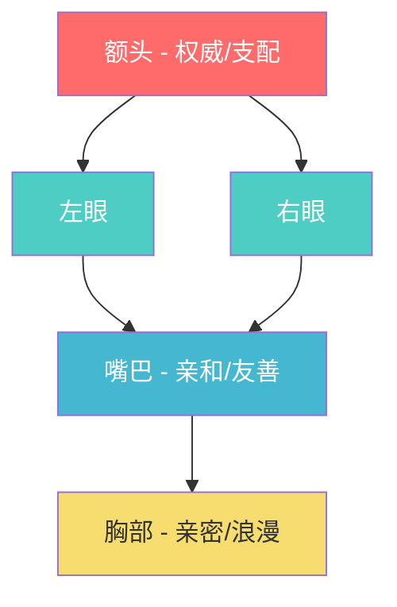
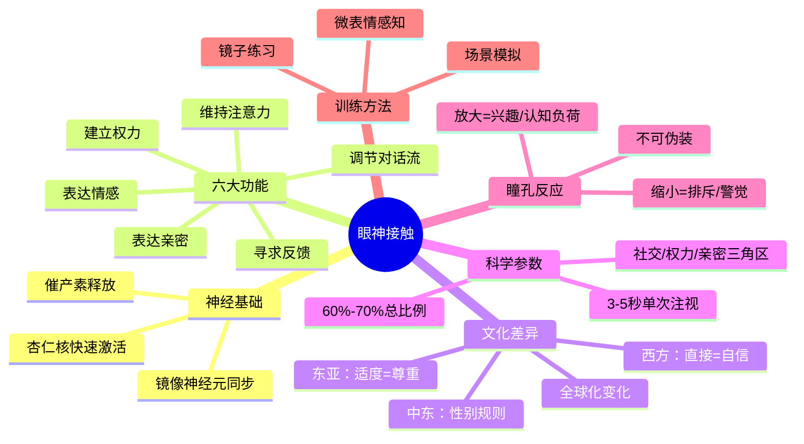

## 四、眼神接触（Eye Contact）

眼神接触是人类最古老、最强大的非语言信号之一。在所有非语言沟通渠道中，眼神传递的信息密度最高——它可以在零点几秒内完成"建立信任→传递情绪→确认共识"的完整闭环。英国心理学家 Michael Argyle 在其经典著作 *Bodily Communication* 中指出，眼神接触承担的功能比任何其他单一非语言行为都多，包括调节对话流、表达情感、建立权力关系、寻求反馈等。理解眼神接触的机制，是掌握非语言沟通的关键一步。

### 4.1 眼神接触的神经科学基础

眼神接触不仅仅是"看"这个动作，它涉及复杂的神经回路和激素反应。

#### 4.1.1 杏仁核与眼神检测

人类大脑中存在专门负责检测眼神方向的神经回路。梭状回面孔区（Fusiform Face Area, FFA）和颞上沟（Superior Temporal Sulcus, STS）协同工作，在他人看向你时快速激活。功能性磁共振成像（fMRI）研究显示，即使在面孔图像呈现仅 17 毫秒、远低于意识觉察阈值时，杏仁核依然对直视目光产生显著激活（Kawashima et al., 1999; Conty et al., 2010）。这意味着眼神接触的检测在很大程度上是前意识的——你"感觉到"有人在看你，往往比你"看到"他更快。

#### 4.1.2 催产素与信任回路

直接的眼神接触会触发大脑释放催产素（Oxytocin），这是一种与社会联结和信任密切相关的神经肽。Kameda et al.（2020）的研究发现，持续 3-5 秒的眼神接触可以显著提升互动双方的催产素水平，从而增强信任感和合作意愿。这也解释了为什么在谈判或商务会谈中，适度的眼神接触能提高达成协议的概率。

#### 4.1.3 镜像神经元与共情

眼神接触还能激活镜像神经系统。当我们与他人对视时，大脑中的镜像神经元会同步激活，使我们能更准确地"读取"对方的情绪状态。这种神经层面的同步是共情能力的生理基础，也是眼神接触能够快速建立情感连接的原因。

### 4.2 眼神接触的核心功能

眼神接触在沟通中承担六大核心功能：

#### 4.2.1 调节对话流（Regulatory Function）

眼神接触是对话轮次管理的核心工具。说话者在发言即将结束时，通常会看向对方，发出"该你说了"的信号；而在发言过程中，说话者往往会减少眼神接触以避免被打断。听话者则通过持续的目光接触来表达"我在听，请继续"。

| 场景 | 眼神模式 | 含义 |
|------|----------|------|
| 说话者说完一句话后看对方 | 注视 + 短暂沉默 | "轮到你说了" |
| 说话者说话时偶尔看对方 | 间歇注视 | "你在听吗？确认一下" |
| 听话者长时间盯着说话者 | 持续注视 | "我很有兴趣，请继续" |
| 听话者频繁看手机或别处 | 回避视线 | "我不太想继续这个话题" |

#### 4.2.2 表达情感（Emotional Expression）

眼神是情绪传递最直接的窗口。不同的眼神模式对应不同的情感状态：

- **亲密与吸引**：瞳孔放大、目光在对方面部缓慢移动、频繁的短暂注视
- **信任与坦诚**：稳定的中等时长注视、自然的眨眼频率（每分钟 15-20 次）
- **敌意与威胁**：长时间不眨眼的凝视、瞳孔收缩、下巴微抬
- **恐惧与不安**：快速扫视、瞳孔放大、频繁眨眼（频率可升至每分钟 30 次以上）
- **悲伤与失落**：目光下垂、减少与他人的目光接触、注视时间缩短

#### 4.2.3 建立与维持注意力（Attention Function）

眼神接触是最有效的注意力引导工具。在教学、演讲、汇报等场景中，演讲者通过有策略的眼神扫视可以将听众的注意力牢牢锁住。认知心理学中的"眼神捕获效应"（Gaze Cueing Effect）表明，当一个人看向某个方向时，观察者的注意力会不自觉地跟随（Friesen & Kingstone, 1998）。

#### 4.2.4 建立权力与地位（Power Function）

眼神接触在权力关系中扮演核心角色。研究表明：

- **高地位者**倾向于在说话时更多地看向对方，在听话时则减少目光接触
- **低地位者**则相反：说话时减少直视，听话时增加注视以示关注和尊重
- 在初次见面中，谁先移开视线，往往在后续互动中处于相对被动的地位

Exline et al.（1975）的实验发现，被要求维持眼神接触的人自我报告了更高的主观地位感。这意味着眼神接触不仅反映权力关系，还能主动建构权力关系。

#### 4.2.5 寻求反馈（Monitoring Function）

在交流过程中，我们持续通过眼神接触来"采样"对方的反应。说话者会每隔几秒快速看一眼对方，检查对方是否理解、是否同意、是否感兴趣。这种"视觉反馈环路"是对话流畅进行的关键机制。当说话者看不到对方的反馈时（例如电话沟通），会不自觉地增加言语填充词（"嗯""那个"），因为缺少了眼神反馈的校准。

#### 4.2.6 表达亲密与调情（Affection Function）

眼神接触是亲密关系建立的基石。Aron et al.（1997）著名的"36个问题"实验中，最后一项就是让两个陌生人对视 4 分钟——结果多对参与者报告产生了强烈的亲密感。在调情场景中，典型的模式是：先短暂注视 → 移开 → 再次注视（"二次注视"信号），这种模式传递的是"我对你感兴趣但不想太冒犯"的信息。

### 4.3 眼神接触的文化差异

眼神接触的文化规范差异巨大，忽视这些差异可能导致严重的跨文化误解。

#### 4.3.1 主要文化区域对比

| 文化区域 | 眼神规范 | 对直视的解读 | 对回避的解读 |
|----------|----------|-------------|-------------|
| 北美/西欧 | 直接、稳定的眼神接触 | 自信、诚实、专注 | 回避、不诚实、不自信 |
| 东亚（中日韩） | 适度、间歇性注视 | 对长辈/上级直视 = 不尊重/挑衅 | 尊重、谦逊、有教养 |
| 南亚 | 因种姓/年龄/性别差异大 | 下属直视上级 = 不敬 | 顺从、礼貌 |
| 中东 | 同性间密切注视 | 信任、亲近 | 疏远、不信任 |
| 非洲部分地区 | 下属避免直视上级 | 挑战权威 | 恭敬、服从 |
| 拉丁美洲 | 因地区差异大 | 直视上级 = 傲慢 | 礼貌、守规矩 |
| 北欧 | 相对节制的注视 | 过度注视 = 侵犯隐私 | 保持距离感 |

#### 4.3.2 日本文化的特殊性

日本文化中的眼神规范尤其值得单独讨论。在日本，直视他人的眼睛（特别是地位高于自己的人）被认为是一种冒犯行为。日本人在对话中习惯将目光聚焦在对方的颈部或嘴巴周围区域，而非直接对视。这并不意味着不尊重——恰恰相反，这是一种深层的社会礼仪（礼儀、れいぎ）。在与日本商务伙伴交流时，强迫对方进行直视反而会让对方感到不适。

#### 4.3.3 伊斯兰文化中的性别规则

在许多伊斯兰文化中，异性之间的直接眼神接触被视为不恰当，甚至可能被解读为性暗示或调情。穆斯林男性被教导"降低视线"（غض البصر），尤其是在面对非亲属异性时。而在同性之间，眼神接触则相对密切和持久。在跨文化商务场合中，了解这些规范至关重要。

#### 4.3.4 全球化带来的变化

值得注意的是，随着全球化进程和年轻一代的成长，上述文化规范正在发生变化。在日本、中国、韩国的年轻城市人群中，受西方文化影响，直接的眼神接触接受度明显高于年长一代。然而，在正式商务或与长辈交流的传统场合中，保守策略仍然是安全的选择。

### 4.4 眼神接触的科学参数

#### 4.4.1 时间比例

Argyle & Dean（1965）的经典研究表明，理想的眼神接触比例在不同场景中有显著差异：

| 场景类型 | 理想注视比例 | 说明 |
|----------|-------------|------|
| 亲密朋友闲聊 | 60%-70% | 大部分时间保持自然注视 |
| 正式商务会议 | 40%-60% | 适度注视，避免压迫感 |
| 演讲/汇报 | 30%-50% | 扫视全场，每人 2-3 秒 |
| 陌生人初次见面 | 30%-50% | 逐步增加，避免过强注视 |
| 谈判/辩论 | 50%-70% | 较高注视比例以展现自信 |
| 安慰/倾听 | 60%-80% | 高注视比例以传达关注 |

低于参考值会被解读为回避或不自信；高于参考值则可能被视为具有威胁性或过度亲密。

#### 4.4.2 持续时长

单次眼神接触的理想时长因场景而异：

- **社交对话**：3-5 秒，然后自然移开再回来
- **强调关键观点时**：5-8 秒，配合语调变化
- **表达真诚/严肃时**：6-10 秒，但需要缓慢、自然地过渡
- **超过 10 秒**：几乎在所有社交场景中都会造成不适（除非是亲密伴侣之间）

Kleinke（1986）的研究发现，3.2 秒是最常见的自然注视时长——低于这个数字显得回避，高于这个数字则需要特定的情感或权力语境来支撑。

#### 4.4.3 视觉三角区与注视模式

自然的眼神接触并非"盯住一个点"，而是在对方面部的特定区域之间移动：

- **社交三角区**：在对方的双眼和嘴巴之间形成的倒三角区域中移动。这是日常社交中最常见的模式，适用于大部分社交和商务场景。
- **权力三角区**：在对方的双眼和额头之间形成的正三角区域中移动。注视额头区域传递的是权威感和支配感，适合在需要展现自信和主导地位的场景中使用（如领导讲话、法官宣判）。
- **亲密三角区**：在对方的双眼和胸部之间形成的区域中移动。这种模式传递亲密和浪漫信号，仅适用于亲密关系场景。

### 4.5 瞳孔反应：不可伪装的信号

#### 4.5.1 瞳孔变化的生理机制

瞳孔的大小变化（瞳孔散缩反应，Pupillary Response）由自主神经系统控制，不受意识支配。瞳孔直径的变化范围大约为 2mm（强光/排斥）到 8mm（暗光/兴奋），这个差异在面对面交流中足以被大脑的前意识系统捕捉到。

#### 4.5.2 瞳孔放大的触发条件

以下情况会触发瞳孔放大：

- **兴趣与吸引**：看到有吸引力的人或物时，瞳孔可扩大 20%-40%
- **认知负荷增加**：处理复杂信息、进行心算、回忆困难记忆时
- **情绪唤起**：恐惧、愤怒、兴奋等强烈情绪下
- **药物与化学物质**：阿托品、酒精、某些兴奋剂会导致瞳孔扩大

#### 4.5.3 瞳孔缩小的触发条件

- **强烈的负面情绪**：厌恶、排斥
- **高亮环境**：强光下的正常生理反应
- **特定药物**：阿片类药物、某些缩瞳剂

#### 4.5.4 瞳孔反应的实际应用

在历史上，瞳孔反应曾被用于多种实际场景：

- **市场营销研究**：通过测量消费者看到不同产品图片时的瞳孔变化，评估产品的吸引力（Hess & Polt, 1960）
- **审讯心理学**：瞳孔变化是测谎的辅助指标之一（尽管单独使用并不可靠）
- **用户体验设计**：通过瞳孔测量评估用户对界面的注意力分布

虽然在日常对话中，瞳孔变化难以被有意识地察觉，但它会影响我们对他人"眼中光芒"或"眼神温度"的直觉感受。当我们觉得某人"眼里有光"或"目光冰冷"时，瞳孔状态往往是重要的潜在线索。

### 4.6 不同场景中的眼神接触策略

#### 4.6.1 商务会议与谈判

在商务场景中，眼神接触是建立信任和展现自信的关键工具：

- **握手时**：保持 2-3 秒的直接注视，传递自信和诚意
- **陈述观点时**：轮流看向每位参与者 2-3 秒，展现平等和关注
- **回应质疑时**：保持稳定注视，展现坦诚和自信
- **谈判僵局时**：适度减少直接注视，降低紧张感
- **达成共识时**：通过延长注视和点头来确认和强化

#### 4.6.2 公开演讲

演讲中的眼神接触需要兼顾整个场域：

- **三角扫视法**：将观众席分为左、中、右三个区域，轮流与每个区域的观众进行 3-5 秒的眼神接触
- **点状接触法**：在每个区域中选择一个具体的人进行短暂注视，让该区域的观众都感觉被"看到"
- **避免陷阱**：不要只看前排、不要只看PPT、不要扫视过快（显得紧张）或只盯着笔记

#### 4.6.3 面试场景

面试中的眼神接触直接影响面试官对候选人的评估：

- **回答问题时**：70% 的时间看向面试官，展现自信和真诚
- **思考时**：可以短暂移开视线（看向斜上方是正常思考姿态），但不要超过 2-3 秒
- **小组面试**：回答谁的问题就主要看谁，但要兼顾其他面试官
- **陷阱**：盯着面试官不眨眼会显得攻击性；一直低头看桌面会显得缺乏自信

#### 4.6.4 亲密关系与约会

在亲密关系的建立过程中，眼神接触的使用更加微妙：

- **初期吸引阶段**：短暂注视 + 移开 + 再次注视（"二次注视"模式），传递兴趣但保持距离
- **深化连接阶段**：逐步延长对视时间，配合微笑和轻柔的语调
- **长期伴侣**：日常中保持适当的眼神接触可以维持情感连接——研究表明，伴侣之间的眼神接触频率与关系满意度呈正相关

#### 4.6.5 冲突与对抗

在冲突场景中，眼神接触传递的信号完全不同：

- **不眨眼的持续凝视**：被普遍解读为威胁和挑战
- **频繁的视线游移**：可能被解读为紧张或不真诚
- **策略性建议**：在化解冲突时，采用适度的间歇性注视比持续直视更有效——它既传递了关注，又避免了对抗性

#### 4.6.6 数字时代的屏幕沟通

视频会议的普及带来了全新的眼神接触挑战：

- **注视摄像头 ≠ 看对方**：为了让对方"感觉"你在看他们，需要看向摄像头而非屏幕上的画面
- **延迟效应**：视频通话中的延迟会导致眼神信号"错位"，增加沟通疲劳
- **技巧**：在视频会议中，将对方的画面窗口拖到摄像头正下方，可以兼顾"看对方"和"看摄像头"的需求

### 4.7 眼神接触的常见误区与纠正

#### 误区一：眼神接触越多越好

**错误认知**：以为持续不间断地盯着对方就是好的眼神接触。

**事实**：过度的注视（超过 70% 的时间）会造成压迫感，甚至被解读为攻击性。大脑需要通过短暂的视线转移来"休息"和处理信息。自然的、有节奏的注视-转移-再注视才是健康的眼神模式。

**纠正方法**：采用"3-5秒法则"——每次注视维持 3-5 秒，然后自然地移开 1-2 秒，再回来。移开时可以看向对方旁边的桌面、自己的手等自然位置，不要突然看向远处或掏出手机。

#### 误区二：回避眼神就是说谎

**错误认知**：认为说话时不看对方眼睛的人一定在说谎。

**事实**：大量研究表明，眼神回避与说谎之间没有可靠的关联（DePaulo et al., 2003）。有些人在进行深度思考时会自然地减少眼神接触；内向型人格也普遍比外向型人格更少进行直接眼神接触。仅凭眼神回避就判断对方说谎，错误率极高。

**纠正方法**：评估诚实度时，不要过度依赖单一线索，而应综合言语内容、语调、肢体语言、前后一致性等多个维度。

#### 误区三：眼神接触只靠眼睛

**错误认知**：以为眼神接触只涉及眼睛的动作。

**事实**：有效的眼神接触是整个面部表情系统的一部分。没有微笑的注视可能被解读为审视或威胁；没有点头配合的注视可能显得漫不经心。眼神接触需要与微笑、点头、眉毛动作等协同工作，才能传递完整的信息。

**纠正方法**：练习"完整眼神"——注视时配合自然的微笑、适时的点头、偶尔的眉毛微动。一个"眼神+微笑"的组合远比单独的眼神接触更有亲和力。

#### 误区四：每个人的眼神规范都一样

**错误认知**：用同一套眼神标准与所有人交流。

**事实**：除了文化差异，个体差异同样巨大。自闭症谱系障碍（ASD）人群对眼神接触的舒适度和处理方式与神经典型人群有显著差异；社交焦虑症患者进行直接眼神接触时杏仁核反应过度强烈，导致实际回避行为；某些神经系统疾病（如威廉姆斯综合征）的患者会表现出异常高频率的眼神接触。

**纠正方法**：观察对方的舒适区间，以对方的自然注视频率为参照，调整自己的眼神行为使其与对方保持相似的水平——这被称为"视觉同步"（Visual Synchrony），是建立融洽关系的有效策略。

### 4.8 眼神接触的训练方法

#### 4.8.1 基础训练：觉察与校准

1. **镜子练习**：每天面对镜子练习 2 分钟的稳定注视，观察自己的面部表情变化，注意保持自然放松
2. **视频回放**：录制自己与他人对话的视频（征得对方同意后），回放分析自己的眼神模式——注视频率、时长、转移方向
3. **计数练习**：与朋友对话时，在心里默数每次注视的秒数，培养对 3-5 秒自然时长的感知

#### 4.8.2 进阶训练：场景化应用

4. **商务模拟**：与同事进行模拟商务会议，专门练习陈述观点时的眼神分配——确保每位"参会者"都被均匀地注视
5. **演讲训练**：在空房间里放置几个玩偶或标记物，练习三角扫视法，确保覆盖全场
6. **冲突模拟**：练习在意见分歧时保持冷静、适度的眼神接触——既不回避也不对抗

#### 4.8.3 高级训练：感知他人

7. **微表情训练**：学习通过眼神细节（眨眼频率、瞳孔变化、注视转移速度）判断对方的情绪状态
8. **文化适应训练**：与不同文化背景的人交流，练习根据对方的文化习惯调整自己的眼神行为
9. **团队训练**：在多人会议中练习"环形眼神分配"——确保每个参与者都感到被纳入对话

### 4.9 眼神接触研究的里程碑

了解眼神接触研究的关键里程碑，有助于理解这一领域的知识是如何积累的：

| 年份 | 研究者 | 贡献 |
|------|--------|------|
| 1965 | Argyle & Dean | 提出"亲密-距离平衡理论"，首次量化眼神接触的社会功能 |
| 1975 | Exline et al. | 揭示眼神接触与权力地位的关系 |
| 1986 | Kleinke | 系统综述眼神接触的心理学研究，定义 3.2 秒为平均自然注视时长 |
| 1997 | Aron et al. | "36个问题"实验，证明延长眼神接触可快速建立亲密感 |
| 1998 | Friesen & Kingstone | 证实"眼神捕获效应"，揭示眼神对注意力的引导作用 |
| 1999 | Kawashima et al. | fMRI 研究发现杏仁核对直视目光的快速激活 |
| 2010 | Conty et al. | 证明眼神接触检测可在意识阈限之下发生 |
| 2020 | Kameda et al. | 揭示眼神接触与催产素释放之间的因果关系 |

### 4.10 本节要点回顾

眼神接触是人类社交中最精密的信号系统之一。掌握它的规律，不仅能让你在沟通中更加自信和从容，更能让你成为一个敏锐的"读者"——通过他人的眼神，读取他们的情绪、意图和态度。在下一节中，我们将讨论面部表情这一与眼神接触密切相关的非语言沟通维度。
