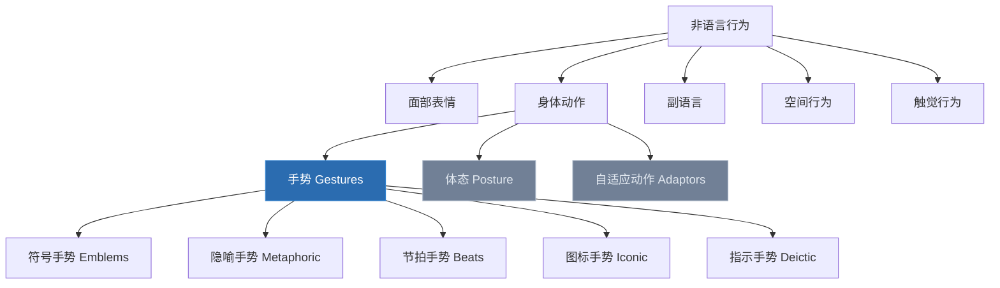
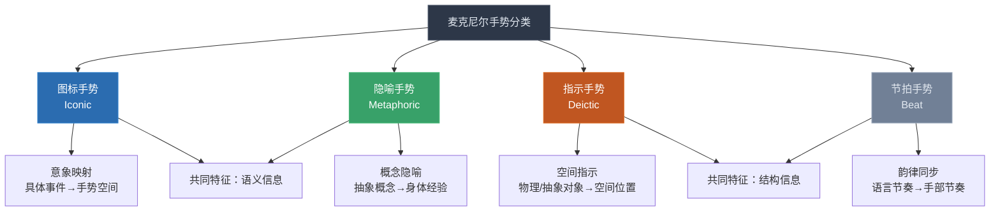
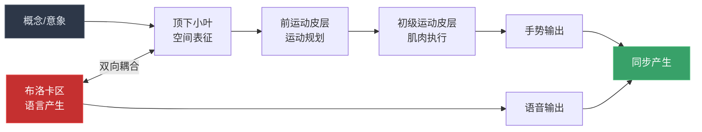
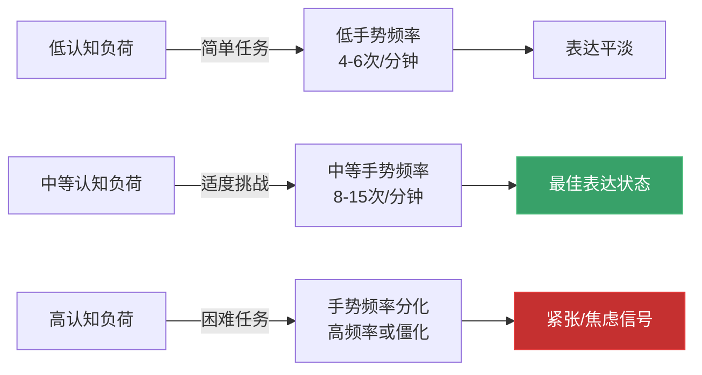

## 五、手势（Gestures）

> "手势不是语言的装饰品，而是思维本身的可见形式。" ——大卫·麦克尼尔（David McNeill），《手势与思想》

在非语言沟通的七大通道（面部表情、眼神、手势、体态、空间距离、触觉、副语言）中，手势是**唯一兼具表达功能和认知功能**的通道。面部表情主要传递情感，眼神主要调节互动，体态主要反映态度——但手势同时参与两个过程：它帮助说话者**组织思维**，同时帮助听者**解码信息**。

这种双重功能使手势成为非语言沟通研究中最具理论深度的课题。本节将从神经科学、进化心理学、认知语言学和跨文化人类学四个视角，系统阐述手势的理论基础。

### 5.1 手势的科学定义与边界

#### 5.1.1 什么是手势

在学术文献中，手势（gesture）的定义经历了从窄到宽的演变：

**狭义定义**（传统观点）：手势是有意的、可见的手部动作，用于传达信息或辅助语言表达。这个定义将手势限定为"有意的沟通行为"。

**广义定义**（当代共识）：手势是与言语同步产生的手部、臂部乃至头部和身体的动作，无论其是否具有沟通意图。这个定义由大卫·麦克尼尔（David McNeill, 1992, 2005）在其开创性研究中确立，已成为当代手势研究的标准定义。

广义定义包含三个关键要素：

| 要素 | 说明 | 意义 |
|------|------|------|
| **与言语同步** | 手势与说话同时发生，而非独立的信号 | 区别于单纯的肢体语言和哑剧动作 |
| **包含无意动作** | 不要求说话者有意识地"做手势" | 捕捉到更丰富的认知信息 |
| **不限于手部** | 臂部摆动、身体晃动、头部动作都可能携带手势信息 | 更完整地理解具身认知 |

这个定义的转变具有重大理论意义：它意味着手势研究不仅仅属于传播学，更属于认知科学——手势是**思维过程的外部投射**。

#### 5.1.2 手势与相邻概念的区分

手势研究中，"手势""体态""标记""面部表情"等概念常被混淆。以下是关键区分：

**手势 vs 体态（Posture）**：体态是身体的整体姿态（坐姿、站姿、身体朝向），变化缓慢且持续存在；手势是离散的、有时限的动作，与特定词语或短语同步。体态传递态度和关系信号，手势传递语义和认知信号。

**手势 vs 自适应动作（Adaptors）**：搓手、摸头发、摆弄笔等动作属于自适应动作——它们源于自我安抚需求，通常在焦虑或无聊时出现，不与言语同步，也没有沟通意图。手势则与言语同步产生，即使说话者没有意识到，它也在参与沟通过程。

**手势 vs 标记（Illustrators vs Emblems）**：标记（如OK手势、竖大拇指）是可以脱离语言独立存在的符号，任何文化成员都能解码；而大多数手势（如比划大小、画出路径）离开语言后含义不完整，需要与语言配合才能被理解。

### 5.2 手势的分类体系

手势的分类是手势研究的核心理论问题之一。不同的分类框架从不同的理论视角出发，各有侧重。

#### 5.2.1 Ekman-Friesen 分类法（1969）

保罗·埃克曼（Paul Ekman）和华莱士·弗里森（Wallace Friesen）在1969年提出的五分法是最早、也是最广泛引用的手势分类框架：

| 类别 | 英文名 | 功能 | 特征 | 举例 |
|------|--------|------|------|------|
| **符号手势** | Emblems | 直接替代语言 | 有明确的文化含义，可脱离语境被理解 | OK手势、竖大拇指、挥手致意、摇头 |
| **说明性手势** | Illustrators | 辅助语言表达 | 与语言同步，增强或补充语言信息 | 比划大小、画出路线、列举计数 |
| **情感展示手势** | Affect Displays | 表达情感状态 | 反映情绪变化，常与面部表情配合 | 拍桌子（愤怒）、抱头（沮丧）、摊手（无奈） |
| **调节性手势** | Regulators | 控制对话流程 | 管理说话人轮替和互动节奏 | 举手示意暂停、张掌邀请发言、点头催促继续 |
| **适应性手势** | Adaptors | 自我安抚 | 无沟通意图，源于心理需求 | 搓手、摸耳朵、摆弄物品、抠指甲 |

这个分类法的优势在于它的实操性——五个类别覆盖了手势的主要功能，易于观察者编码。但它的局限在于：它主要关注手势的"外在功能"，没有深入手势与思维的关系。

#### 5.2.2 McNeill 分类法（1992/2005）

大卫·麦克尼尔在《手势与思想》中提出的手势分类法，是当代手势研究最具影响力的理论框架。与Ekman-Friesen的功能视角不同，McNeill从**手势与语言-思维的关系**出发进行分类：

**第一类：图标手势（Iconic Gestures）**

图标手势与语言内容存在直接的意象映射关系。当你说"他把球扔过去"时，你的手做出一个"扔"的动作——这个手势在视觉上与所描述的动作相似。

图标手势的核心特征是**意象同构性**（iconic mapping）：手势的空间形态与所指对象的空间形态之间存在可识别的对应关系。这种同构性不是简单的"模仿"，而是一种认知映射——说话者将心理意象投射到手势空间中。

认知意义：图标手势揭示了说话者的**心理表征**方式。两个人描述同一事件时，如果使用不同的图标手势，说明他们对同一事件的心理表征不同。这在认知心理学研究中具有重要价值。

**第二类：隐喻手势（Metaphoric Gestures）**

隐喻手势与图标手势类似，但映射的对象不是具体的物理实体，而是**抽象概念**。当你说"我们面临两个选择"时，双手分别指向两侧——这个手势将抽象的"选择"概念投射到了具体的空间中。

隐喻手势的理论基础来自莱考夫和约翰逊（Lakoff & Johnson, 1980）的概念隐喻理论。人类理解抽象概念的方式，是将其映射到具体的身体经验上：

| 抽象概念 | 身体隐喻 | 手势表现 |
|----------|----------|----------|
| 时间 | 时间是一条水平线 | 手在空间中画出时间线 |
| 数量 | 数量是垂直高度 | 手从低处向高处移动表示增长 |
| 理解 | 理解是"抓取" | 双手做抓取动作表示"抓住要点" |
| 选择 | 选择是空间分支 | 双手分别指向不同方向 |
| 整合 | 整合是"合并" | 双手从两侧向中间合拢 |
| 控制 | 控制是"覆盖" | 手掌向下压表示掌控 |

隐喻手势表明：人类的思维不是纯粹抽象的符号运算，而是深度植根于身体经验的具身认知。

**第三类：指示手势（Deictic Gestures）**

指示手势是最简单的手势类型——用手指向某个物体、方向或空间位置。但它的认知意义远比表面看起来复杂。

指示手势分为两种：
- **物理指示**：指向实际存在的物体（"这个杯子""那个人"）
- **抽象指示**：指向空间中的虚拟位置，用于组织抽象信息（"这个问题在这里""那边是我们的目标"）

抽象指示是人类独有的认知能力。当说话者在空间中为抽象概念"分配"位置时，他们实际上在构建一个**外部认知支架**（external cognitive scaffold）——将工作记忆中的信息"卸载"到物理空间中，减轻大脑的处理负担。这是"扩展认知"（extended cognition）理论的一个经典案例。

**第四类：节拍手势（Beat Gestures）**

节拍手势是最不起眼但最频繁的手势类型。它们不传递语义信息，而是跟随语言的韵律节奏——手随着说话的节奏上下或前后摆动，像在打拍子。

节拍手势的功能长期被低估。近年来的研究表明，节拍手势至少承担三项认知功能：

1. **韵律标记**：标记语言的节奏结构，帮助听者切分连续的语音流
2. **语篇组织**：在话题转换、论点切换时出现频率增加，标记语篇结构
3. **元语言意识**：说话者在表达元语言评论（"换句话说""总结一下"）时倾向于使用节拍手势

#### 5.2.3 Kita 分类法（2000）——信息结构视角

日本认知科学家木多聡太郎（Sotaro Kita, 2000）提出了一个从信息结构角度出发的手势分类框架，补充了McNeill理论的不足。Kita认为，手势的功能不仅在于"映射意象"，更在于**组织和操控信息的语篇结构**。

Kita区分了三种语篇功能：

- **表征功能（Representational function）**：传递语义信息（对应McNeill的图标、隐喻和指示手势）
- **互动功能（Interactional function）**：管理对话的轮替、注意力和参与度（对应Ekman-Friesen的调节性手势）
- **语篇功能（Discourse function）**：标记语篇结构（话题开始、话题结束、话题切换）

语篇功能的手势研究对演讲教学有直接启示：一个优秀的演讲者不仅用手势"表达内容"，还用手势"组织结构"——标记论点的层次、切换的节点和总结的时刻。

#### 5.2.4 综合分类框架

将上述三种分类法整合，形成一个多层次的手势分类框架：

| 层次 | 分类维度 | 类别 | 理论来源 |
|------|----------|------|----------|
| **功能层** | 手势的社会/沟通功能 | 符号、说明、情感展示、调节、适应 | Ekman & Friesen (1969) |
| **认知层** | 手势与思维/语言的关系 | 图标、隐喻、指示、节拍 | McNeill (1992, 2005) |
| **语篇层** | 手势在语篇中的结构功能 | 表征、互动、语篇 | Kita (2000) |

在实际分析中，一个手势可以同时在三个层次上被编码。例如，一个演讲者在列举论点时伸出三根手指——在功能层是"说明性手势"，在认知层是"图标手势"（映射数量），在语篇层是"语篇手势"（标记列表结构）。这种多层编码提供了对手势最完整的理解。

### 5.3 手势的认知神经科学基础

手势研究在21世纪最重要的进展来自认知神经科学。脑成像技术揭示了手势产生和理解的神经机制，为"手势是思维的一部分"这一核心命题提供了神经层面的证据。

#### 5.3.1 手势产生的神经基础

手势的产生涉及多个脑区的协同工作：

**运动皮层（Motor Cortex）**

初级运动皮层（Primary Motor Cortex, M1）控制手部肌肉的运动。手部在运动皮层的"身体地图"（motor homunculus）中占据了不成比例的巨大面积——手部运动区几乎与整个躯干运动区一样大。这意味着人类大脑对手部精细运动的控制能力远超身体其他部位。

**布洛卡区（Broca's Area）**

左侧额下回（Broca's area, BA 44/45）传统上被认为是"语言产生区"。但神经影像学研究（Willems et al., 2007; Gentilucci et al., 2004）发现，布洛卡区在手势产生中同样活跃。更关键的是：当说话和手势同时进行时，布洛卡区的活动模式不是两者简单的叠加，而是一种**整合性的神经表征**——语言和手势共享同一套神经编码系统。

这一发现是"语言和手势同源"假说的关键证据。

**顶下小叶（Inferior Parietal Lobule, IPL）**

顶下小叶负责空间认知和运动规划。在手势产生过程中，它承担"空间意象→手势运动方案"的转换——将说话者的心理意象翻译为具体的手部运动指令。

**前运动皮层（Premotor Cortex）**

前运动皮层负责运动的规划和序列组织。在手势产生中，它将顶下小叶提供的空间方案编码为时间序列——决定手势从哪个位置开始、经过哪些中间位置、到达哪个终点。

#### 5.3.2 手势理解的神经基础

听者理解他人手势的神经机制与产生手势的机制存在显著的**神经重叠**（neural overlap），这一发现具有深刻的理论意义。

**镜像神经元系统（Mirror Neuron System）**

1990年代，意大利帕尔马大学的研究者在猕猴大脑中发现了镜像神经元——这些神经元在猴子执行动作和观察他人执行同一动作时都会激活。后续的人脑成像研究（Rizzolatti & Craighero, 2004）确认了人类也拥有镜像神经元系统，主要位于前运动皮层和顶下小叶。

镜像神经元对手势理解的意义在于：当我们观察他人的手势时，我们的运动系统会"模拟"这个手势——尽管我们的手没有动，但大脑中控制手部运动的区域被激活了。这种内部模拟（internal simulation）为手势理解提供了一种直接的、无需语言中介的解码机制。

**隐喻手势的额外神经成本**

与图标手势相比，隐喻手势的理解需要额外的神经加工。脑成像研究（Corina et al., 2007）发现，理解隐喻手势时，左侧颞叶（负责语义加工）和右侧半球（负责空间和隐喻理解）同时被激活。这说明隐喻手势的理解涉及**跨模态语义整合**——听者需要将手势的视觉空间信息与语言的语义信息进行匹配和整合。

这一发现对演讲实践有直接启示：当你使用隐喻手势来解释抽象概念时，听众的大脑需要更长的加工时间。因此，隐喻手势应保持更长的持续时间（2-3秒），给听众足够的解码时间。

#### 5.3.3 布洛卡区失语症与手势

布洛卡区受损导致的运动性失语症患者，不仅语言产生能力受损，手势能力也同时受损——他们在描述事件时，图标手势和隐喻手势显著减少，而节拍手势保持相对正常（Cocks et al., 2009）。

这一现象的理论意义在于：

1. 语言和手势**共享同一套产生机制**（至少部分共享），而非各自独立的系统
2. 不同类型的手势依赖不同的神经资源——语义性手势（图标、隐喻）依赖语言区，非语义性手势（节拍）依赖运动区
3. 手势训练可以作为失语症康复的辅助手段——通过"手势通道"绕过受损的语言通道，恢复沟通能力

#### 5.3.4 手势与工作记忆

工作记忆是认知心理学的核心概念之一——它是大脑在短时间内保持和操控信息的能力。手势与工作记忆之间的关系是近年来手势研究的前沿课题。

**手势减轻工作记忆负荷的机制**

Goldin-Meadow团队（2001）的经典实验发现：当被试在解决数学问题时允许使用手势，其工作记忆容量"增加"了——他们能同时保持更多的信息。机制如下：

1. **外部表征**：手势将工作记忆中的信息"卸载"到物理空间中。当你用手指在空中标记三个不同的论点位置时，这三个位置信息不再完全存储在大脑中，而部分"存储"在物理空间里
2. **空间编码**：手势将线性信息转化为空间信息。空间记忆的容量远大于线性序列记忆——你可以轻松记住房间里10件物品的位置，却很难记住10个随机数字的顺序
3. **并行处理**：语言是线性的（一次只能说一个词），手势是并行的（双手可以同时表达不同的信息）。手势与语言的并行输出增加了信息传递的带宽

**手势抑制实验的发现**

在一项关键实验中，Beilock & Goldin-Meadow（2010）要求被试在解决空间推理任务时**禁止使用手势**。结果：被试的空间推理表现下降了约20%。更有趣的是，当被试被要求将双手放在膝盖上（物理上阻止手势）时，他们的表现比将双手放在桌面上（允许手势但不使用）更差——这说明即使只是"能够做手势"这个可能性本身，就对认知有辅助作用。

这一发现与"扩展认知"（extended cognition）理论高度一致：认知不仅发生在大脑中，还延伸到身体和环境中。手势是"认知扩展"的一个具体实例。

### 5.4 手势的进化起源

手势为什么存在？它是人类独有的能力，还是与其他灵长类共享的进化遗产？这个问题对理解手势的本质至关重要。

#### 5.4.1 "手势优先"假说

语言起源是进化生物学中最棘手的问题之一。主流理论存在两大阵营：

**声音优先派**认为人类语言从发声（哭叫、警报声、感叹）进化而来，手势只是辅助工具。

**手势优先派**认为人类语言最初从手势进化而来，语言是后来才"接管"的。支持这一假说的证据包括：

1. **解剖学证据**：人类的声道（喉头位置下降、舌骨形态变化）直到约30万年前才具备产生复杂语音的条件，但人类的手部灵巧性在更早时期就已高度发达
2. **灵长类证据**：黑猩猩和倭黑猩猩可以学习数百个手语符号，但几乎无法学习语音符号。这暗示灵长类大脑中存在一个"手势-语言"通道的原型
3. **布洛卡区的双重功能**：布洛卡区同时控制语言产生和手部精细运动，暗示语言和手势在神经层面有共同的进化起源
4. **儿童语言发展**：儿童在说出第一个词之前就已开始使用指示手势（约9-12个月），手势是语言发展的先导

**综合观点**：当代多数研究者采取折中立场——语言可能从手势和发声的**协同进化**中产生，两者在进化过程中相互促进，最终形成了现代人类同时使用语言和手势的"双通道"沟通系统。

#### 5.4.2 手势的跨物种比较

| 能力维度 | 人类 | 黑猩猩 | 大猩猩 | 倭黑猩猩 |
|----------|------|--------|--------|----------|
| 符号手势 | 数百种，可组合 | ~80种，有限组合 | ~30种 | ~60种 |
| 指示手势 | 12个月出现 | 罕见 | 极罕见 | 有限使用 |
| 隐喻手势 | 复杂隐喻映射 | 未观察到 | 未观察到 | 未观察到 |
| 节拍手势 | 配合语言韵律 | 未观察到 | 未观察到 | 未观察到 |
| 教学性手势 | 频繁且有策略 | 极罕见 | 未观察到 | 未观察到 |

从表中可以看出：指示手势、隐喻手势和节拍手势是人类独有的——这三类手势恰好都依赖于**抽象思维**能力。图标手势的前体（iconic gestures的原型）在灵长类中可以观察到，但其复杂度和灵活性远低于人类。

#### 5.4.3 手势的社会功能假说

除了认知功能外，手势还可能具有进化上的社会适应功能：

**联盟信号假说**：在灵长类社会中，手势是建立和维护社会联盟的重要工具。梳理（grooming）是灵长类最重要的社交行为，其本质就是一种触觉"手势"。人类的握手、拥抱、击掌等社交手势可能是灵长类梳理行为的进化延续。

**欺骗检测假说**：手势比语言更难"造假"——因为手势的产生涉及更多无意识的神经加工环节。进化可能"选择"了观察他人手势的能力，作为检测欺骗行为的适应性机制。这解释了为什么人类天生对"手势-语言不一致"高度敏感。

**教学辅助假说**：指示手势（指着物体并命名）是人类教学行为的基石。在缺乏书面语言的原始社会中，手势是知识代际传递的核心工具。Corballis（2002）认为，人类手势的教学功能是"累积文化进化"（cumulative cultural evolution）的关键前提。

### 5.5 手势与语言发展的关系

手势不仅与成人语言并行产生，更在人类语言发展过程中扮演着关键角色——从婴儿的第一个沟通行为到第二语言学习。

#### 5.5.1 婴儿期的手势发展

婴儿的手势发展遵循一条高度规律的时间线，这条时间线在不同文化中表现出惊人的一致性：

| 月龄 | 手势类型 | 代表手势 | 认知意义 |
|------|----------|----------|----------|
| 9-10个月 | 分享性指示手势 | 指着物体给成人看 | 社会性注意力的出现 |
| 10-12个月 | 要求性指示手势 | 伸手指着想要的东西 | 意图性沟通的出现 |
| 12-14个月 | 常规性手势 | 挥手再见、摇头不要 | 符号理解的萌芽 |
| 14-18个月 | 手势-词汇组合 | 指着杯子说"要" | 语义组合的开始 |
| 18-24个月 | 手势-句子组合 | 指着球说"爸爸扔" | 语法结构的前体 |
| 24-36个月 | 隐喻手势 | 用手比划"这么高" | 抽象思维的出现 |

Goldin-Meadow（2003）的研究发现：**18个月时的手势-词汇组合模式可以预测4岁时的语言能力**。这是儿童发展研究中最早的、最可靠的预测指标之一。

#### 5.5.2 手势在第一语言习得中的功能

手势在儿童语言习得中至少承担五项关键功能：

**功能一：词汇学习的"指向"机制**

当成人指着物体并说出名称时，指示手势为婴儿提供了"共同注意"（joint attention）的锚点——婴儿知道成人指的是哪个物体，从而将词汇映射到正确的对象上。Baldwin（1993）的经典实验证明：18个月大的婴儿更倾向于跟随成人的眼神和手势方向来学习新词，而不是跟随成人手中正在把玩的物体。

**功能二：语法发展的"支架"**

儿童在掌握复杂语法结构之前，会通过手势-词汇组合来表达那些超越其语法能力的语义关系。例如，一个还不会说"把球放在桌子上"的孩子，可能会说"球"同时用手做"放"的动作。这种手势-语言互补系统是语法发展的"脚手架"——当语法能力成熟后，这些信息逐渐被语言吸收，手势的功能随之转变。

**功能三：元认知的早期表达**

儿童最早表达"知道/不知道""理解/困惑"等元认知状态的方式不是语言，而是手势——点头表示"我明白了"，摊手表示"我不确定"。这些手势在儿童能够用语言表达元认知之前（通常3-4岁）就已经出现。

**功能四：叙事能力的萌芽**

2-3岁的儿童开始在讲故事时使用手势来标记时间顺序（"先……然后……"）、角色切换（用不同的手势代表不同的人物）和空间关系。这些手势叙事能力是后来书面叙事能力的前兆。

**功能五：社交能力的指标**

儿童使用手势的频率和质量与社交能力高度相关。研究发现（Özçalışkan & Goldin-Meadow, 2011），在2岁时使用更多手势的儿童，在幼儿园阶段表现出更强的社交能力和更好的同伴关系。

#### 5.5.3 手势与第二语言学习

手势在第二语言学习中的作用近年来受到越来越多的关注。研究发现（Gullberg, 2010）：

**学习阶段**：
- 初学者倾向于使用更多的手势来弥补词汇和语法的不足
- 中级学习者的手势逐渐减少，更依赖语言
- 高级学习者的手势模式接近母语者

**教学应用**：
- **关键词伴随手势法**：在学习新词汇时，同时学习一个配套的手势。研究发现（Tellier, 2008），这种方法使词汇记忆留存率提高约30%
- **语法空间化法**：用空间手势来表示语法结构。例如，用左手标记"过去时"的虚拟位置，右手标记"现在时"，帮助学习者内化时态系统
- **文化手势学习**：学习目标语言文化中的符号手势（如日本人的鞠躬程度、意大利人的手势表达），是跨文化沟通能力的重要组成部分

### 5.6 手势的心理学机制

#### 5.6.1 手势与具身认知

具身认知（embodied cognition）是21世纪认知科学最重要的理论转向之一。它的核心主张是：认知不仅仅发生在大脑中，而是由大脑、身体和环境的动态交互所构成。手势是具身认知理论最有力的实验证据之一。

具身认知的三个核心命题在手势研究中得到了充分验证：

**命题一：身体状态影响认知过程**

Casasanto & Bottini（2014）的实验发现：当被试被要求用手做出"向上"的手势时，他们对积极词汇的反应速度更快；做出"向下"的手势时，对消极词汇的反应速度更快。这说明手部运动状态直接影响情绪-语义加工。

**命题二：抽象概念通过身体经验来理解**

隐喻手势的存在本身就是这个命题的证据。当我们说"未来在前方"并用手向前指时，这个手势激活了一种身体经验——"向前移动"——来帮助理解"时间"这个抽象概念。

**命题三：认知过程可以延伸到身体之外**

指示手势在空间中"放置"抽象信息，是认知延伸到身体之外的最直观案例。一个演讲者在空间中标记三个论点的位置，这个物理空间就成为了他的"外部工作记忆"。

#### 5.6.2 手势与认知负荷

手势使用频率与认知负荷之间存在一条倒U型关系曲线：

**低认知负荷**：当任务简单时，手势频率低，内容以节拍手势为主。

**中等认知负荷**：当任务有一定挑战但能力可应对时，手势频率增加，类型丰富，以图标和隐喻手势为主。这是"最佳表达状态"——手势自然、丰富、与语言配合默契。

**高认知负荷**：当任务超出能力时，手势出现两种分化模式：焦虑型个体的手势频率急剧上升（"手足无措"），而抑制型个体的手势频率急剧下降（"僵住了"）。这两种模式都是认知资源耗竭的信号。

#### 5.6.3 手势的情感泄露

手势是情感的"低通道"——即使说话者有意识地控制面部表情（如在"社交性微笑"中），手势仍然可能泄露真实的情感状态。这是因为手势产生涉及更多的无意识加工环节，更难被有意控制。

常见的情感泄露手势：

| 泄露手势 | 可能的真实情感 | 说明 |
|----------|---------------|------|
| 搓手/搓大腿 | 紧张、焦虑 | 自我安抚动作 |
| 摸鼻子/摸耳朵 | 不确定、可能在隐瞒 | 经典的"适应性手势" |
| 手指轻敲桌面 | 不耐烦、急躁 | 节奏性释放多余能量 |
| 手握紧成拳 | 愤怒、决心、恐惧 | 取决于面部表情的配合 |
| 手指缠绕头发 | 焦虑、不安、无聊 | 退行性自我安抚 |
| 双手插兜 | 隐藏、不坦诚、防御 | 也可能只是冷或习惯 |
| 掌心出汗后擦手 | 高度紧张 | 应激反应的生理信号 |

**重要警示**：情感泄露手势的解读必须谨慎。单一手势不能作为判断依据——必须结合手势群（gesture clusters）、语境和基线行为进行综合分析。例如，搓手可能只是因为手冷，摸鼻子可能只是因为鼻子痒。

### 5.7 手势的文化人类学

手势的文化差异是非语言沟通研究中最丰富的领域之一。同一个手势在不同文化中可能传递截然相反的含义——从最高敬意到最大侮辱。

#### 5.7.1 符号手势的全球分布

符号手势（Emblems）是唯一可以脱离语言被独立理解的手势类型，因此也是跨文化冲突的主要来源。以下是主要符号手势的全球含义分布：

**OK手势（拇指+食指成圈）**

| 地区 | 含义 | 严重程度 |
|------|------|----------|
| 美国、加拿大、澳大利亚 | "好""没问题" | 正面 |
| 日本 | "钱""零" | 中性 |
| 法国 | "零""无价值" | 轻微负面 |
| 巴西 | 侮辱性含义 | 严重冒犯 |
| 土耳其 | 侮辱性含义 | 严重冒犯 |
| 中东部分地区 | 侮辱性含义 | 严重冒犯 |
| 希腊 | "肛门"的隐喻 | 严重冒犯 |

**竖大拇指**

| 地区 | 含义 | 说明 |
|------|------|------|
| 美国、西欧、中国 | "好""赞" | 正面含义 |
| 伊朗、伊拉克 | 侮辱性含义 | 等同于西方的竖中指 |
| 拉丁美洲部分地区 | 侮辱性含义 | 严重程度因国家而异 |
| 德国 | 数字"一" | 中性，容易产生误解 |

**V字手势（食指+中指成V）**

| 地区 | 掌心向外 | 掌心向内 |
|------|----------|----------|
| 美国、中国 | "胜利""耶" | 不常见 |
| 英国、澳大利亚、新西兰 | "胜利" | 严重侮辱 |
| 法国 | "胜利" | 不常见 |
| 日本 | "耶"（拍照常用） | 不常见 |

掌心向内的V字手势在英国和澳大利亚具有严重的侮辱性——其含义等同于竖中指。这个手势的历史起源可以追溯到英法百年战争：英国长弓手被法国人俘虏后会被砍掉拉弓的两根手指，因此英国长弓手向法国人展示这两根手指（掌心向内）以示蔑视。

**"过来"手势（掌心向上，手指向自己弯曲）**

| 地区 | 含义 | 注意事项 |
|------|------|----------|
| 大多数西方国家 | "过来" | 中性 |
| 中国、日本 | "过来" | 中性 |
| 菲律宾 | 仅适用于叫动物 | 对人使用是严重侮辱 |
| 新加坡 | 仅适用于叫动物 | 同菲律宾 |
| 东欧部分地区 | 仅适用于叫动物或地位低下的人 | 需谨慎 |

#### 5.7.2 手势差异的文化根源

手势的文化差异不是随机的——它们植根于深层的文化价值观和历史经验：

**集体主义 vs 个人主义**

集体主义文化（东亚、东南亚）倾向于使用更含蓄、更克制的手势，因为大幅度的手势可能被视为"出风头"或"不尊重集体"。个人主义文化（北美、西欧）则鼓励更富表现力的手势，将其视为自信和热情的体现。

**权力距离**

高权力距离文化（如韩国、日本）中，下级对上级使用手势时必须更加克制和恭敬——大幅度手势可能被视为"不守本分"。低权力距离文化（如北欧国家）中，手势使用的社会等级差异较小。

**宗教与禁忌**

许多手势禁忌源于宗教传统。例如，左手在伊斯兰教中被视为不洁（因为传统上用于个人卫生），因此用左手递物是严重的冒犯。佛教文化中，头部被认为是灵魂的居所，因此拍别人的头是严重失礼。

#### 5.7.3 跨文化手势适应策略

在跨文化场景中，手势适应应遵循以下策略层级：

1. **安全层**：使用全掌指引、掌心向上展示等在几乎所有文化中都安全的手势
2. **观察层**：在互动开始前，观察当地人的手势习惯，注意他们使用的频率、幅度和类型
3. **模仿层**：适度模仿当地人的手势模式——镜像（mirroring）不仅建立亲和感，还能确保你使用的是对方文化中正面含义的手势
4. **确认层**：对不确定的手势，直接询问当地同事或合作伙伴。"在你们文化中，这个手势是什么意思？"这个问题本身就是尊重和学习意愿的表现
5. **回避层**：在完全陌生的文化环境中，减少手势使用是最安全的策略。手势不足只会显得"有点安静"，但手势失当可能造成不可挽回的冒犯

### 5.8 手势研究方法论

了解手势研究的方法论，不仅帮助研究者系统地观察和分析手势，也为普通读者提供了一套"自我诊断"的工具。

#### 5.8.1 手势编码系统

手势研究中最常用的编码系统是McNeill实验室开发的手势编码方案。其基本流程为：

**步骤一：视频录制**

录制被试的自然对话或演讲视频。关键要求：
- 摄像机角度需覆盖上半身（至少从腰部以上）
- 帧率不低于30fps（手势的峰值动作持续时间约0.2-0.5秒，低于30fps会错过关键帧）
- 至少有两个机位：正面和侧面（侧面视角可以观察手势的前后运动）

**步骤二：手势切分**

将连续的视频流切分为独立的手势单元。一个手势单元包含三个阶段：
- **准备阶段（Preparation）**：手从中性位置移动到起始位置
- **核心阶段（Stroke）**：手势的主要运动，与语言的关键词同步
- **回收阶段（Retraction）**：手回到中性位置

**步骤三：手势分类**

根据McNeill分类法将每个手势编码为图标、隐喻、指示或节拍。

**步骤四：语言-手势同步分析**

将手势的核心阶段与同步出现的语言单位对齐，分析两者的信息关系（互补、强化、隐喻）。

#### 5.8.2 自我观察清单

普通读者可以使用以下清单对自己的手势使用进行初步诊断：

| 观察维度 | 评估标准 | 记录方法 |
|----------|----------|----------|
| 手势频率 | 最佳范围：8-12次/分钟 | 录制3分钟对话，计算手势次数 |
| 手势类型 | 至少使用3种不同类型 | 记录每次手势的类型 |
| 手势幅度 | 与场景和距离匹配 | 确认手势是否清晰可见 |
| 手势时机 | 峰值动作落在关键词上 | 回放视频，检查同步性 |
| 一致性 | 手势与语言内容匹配 | 标记任何不一致的情况 |
| 无意识动作 | 注意适应性手势 | 记录搓手、摸头等动作的频率 |
| 手势多样性 | 避免单一手势的重复使用 | 统计不同类型手势的数量 |

#### 5.8.3 常见研究发现的统计基础

理解手势研究中的关键统计数据，有助于批判性地评估研究结论：

- **手势频率与说服力的相关系数**：r=0.45-0.63（中等至强正相关，来源：多个TED演讲分析研究）
- **手势对记忆留存的提升幅度**：20-30%（来源：Kelly et al., 2010; Church et al., 2017）
- **手势与语言同步的时间窗口**：手势峰值在关键词出现前0.5秒至后0.3秒（来源：McNeill, 2005）
- **手势训练达到自动化所需的时间**：21-66天（来源：Lally et al., 2010）
- **手势抑制对认知表现的影响**：下降15-25%（来源：Goldin-Meadow et al., 2001; Beilock & Goldin-Meadow, 2010）

### 5.9 本节核心要义

手势是非语言沟通中唯一同时参与认知过程和沟通过程的通道。本节从五个理论视角构建了手势的知识框架：

1. **分类学视角**：Ekman-Friesen的功能分类、McNeill的认知分类和Kita的语篇分类，共同构成了理解手势的多层次框架
2. **神经科学视角**：布洛卡区的双重功能、镜像神经元系统、手势-工作记忆的交互，证明手势是思维的有机组成部分
3. **进化视角**：手势可能先于语言出现，与语言协同进化，形成了人类独有的"双通道"沟通系统
4. **发展视角**：手势是语言发展的先导——从婴儿期的指示手势到学龄期的隐喻手势，手势能力的每一步发展都预示着认知能力的跃迁
5. **文化视角**：手势的文化差异植根于深层的价值观和历史经验，跨文化手势适应需要系统性的策略

理解这些理论基础，不是为了"知道更多关于手势的知识"，而是为了**更深刻地理解手势在思维和沟通中的角色**——从而在实践中更自觉、更有效地运用手势这一强大的非语言工具。

***
