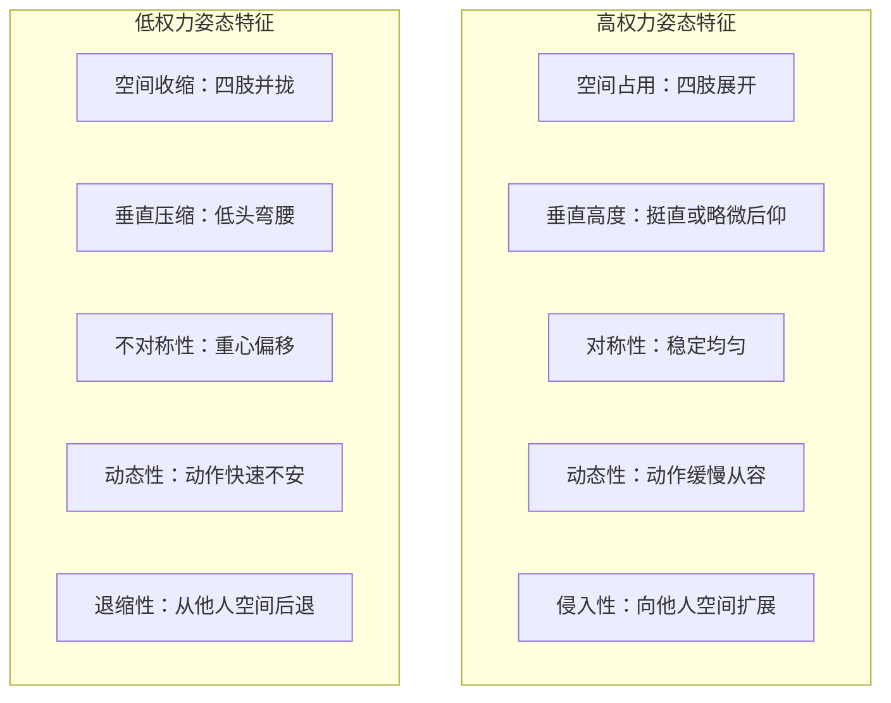
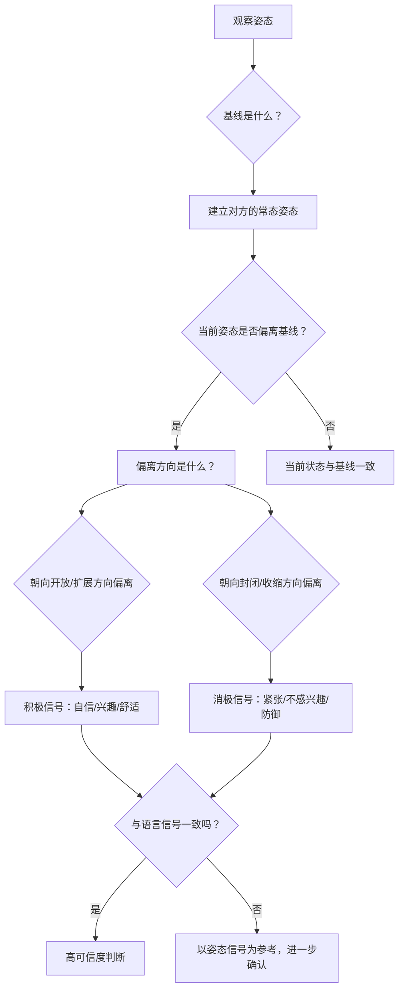

## 六、姿态（Posture）

> "身体从来不说谎。" ——玛莎·葛兰姆（Martha Graham），现代舞先驱

在非语言沟通的七大通道中，姿态（posture）占据着一个独特的位置。与手势的瞬时多变不同，姿态是一种**持续性信号**——它从你走进房间的那一刻开始广播，直到你离开才停止。与面部表情的易控性不同，姿态更难伪装——人们可以在0.2秒内换上一张"社交微笑"，却很难在整场会议中维持一个与内心状态完全矛盾的姿态。

这种**持续性**和**低可控性**的组合，使姿态成为非语言信号中最可靠的信源之一。本节将从生物力学基础、神经科学机制、分类体系、权力动态、文化差异、应用场景等维度，系统阐述姿态在非语言沟通中的作用。

### 6.1 姿态的科学基础

#### 6.1.1 生物力学视角

姿态并非简单的"站得直不直"的问题。从生物力学角度看，姿态是肌肉骨骼系统在重力场中的**动态平衡状态**。人体有超过200块骨骼、600多块肌肉和数百个关节，姿态本质上是这个复杂系统在每个瞬间的力学解算结果。

这种解算受到三个层面的因素影响：

| 层面 | 因素 | 示例 |
|------|------|------|
| **结构性因素** | 骨骼比例、肌肉张力、关节活动度 | 脊柱侧弯者难以维持对称站姿 |
| **习惯性因素** | 长期重复的运动模式、职业特征 | 程序员常见的圆肩前探头 |
| **心理性因素** | 情绪状态、动机、社会意图 | 自信时自然挺胸，沮丧时蜷缩 |

非语言沟通关注的核心是第三层——**心理性因素如何通过姿态外显**，以及观察者如何从姿态反推心理状态。

#### 6.1.2 进化心理学视角

从进化角度看，姿态信号在动物界有深厚的根基。在几乎所有群居动物中，身体的展开程度都与社会等级直接相关：

- **狼群中的阿尔法狼**：昂首挺胸，尾巴高举，占据最大空间
- **灵长类的支配展示**：直立行走、拍打胸膛、毛发竖起以增大体型
- **人类的权力姿态**：扩展性姿态（expansive posture）——占据更多空间、四肢展开、身体挺直

这种跨物种的共性指向一个进化事实：**姿态是社会等级的视觉编码**。在语言出现之前的数百万年中，灵长类动物依靠身体信号来建立和维持社会秩序。人类虽然发展出了语言，但这种古老的身体编码系统从未消失，它仍然在社交互动的底层运行。

#### 6.1.3 神经科学视角

现代神经科学揭示了姿态与大脑之间的双向通路：

**自上而下（Top-down）**：大脑的情绪中枢——杏仁核和前额叶皮层——通过自主神经系统调节肌肉张力。当你感到恐惧时，交感神经系统激活，肌肉紧绷，姿态趋于蜷缩（保护核心器官的本能反应）。当你感到安全和自信时，副交感神经系统主导，肌肉放松，姿态自然展开。

**自下而上（Bottom-up）**：姿态本身也会反向影响大脑状态。这一发现催生了"具身认知"（embodied cognition）理论——身体状态不仅反映心理状态，还可以**塑造**心理状态。直立坐姿的人在面对压力任务时，比蜷缩坐姿的人表现出更低的皮质醇水平和更高的自评信心（Nair et al., 2015）。

这个双向回路意味着：**改变姿态可以在一定程度上改变情绪状态**。这不仅是一个哲学命题，而是一个经过实验验证的神经生理事实。

### 6.2 姿态的分类体系

要系统地理解姿态信号，需要建立一个清晰的分类框架。本节从**空间维度**和**功能维度**两个角度进行分类。

#### 6.2.1 按空间维度分类

**站姿（Standing Posture）**

站姿是最具社交意义的姿态类型，因为它在社交场景中最为常见，且携带最多信息：

| 站姿特征 | 传递的信号 | 解读 |
|----------|-----------|------|
| 挺直、重心均匀分布 | 自信、准备就绪 | 开放接纳当前情境 |
| 身体微微前倾 | 兴趣、关注 | 对当前话题或互动对象投入 |
| 身体后仰或重心后移 | 保留、退缩 | 对当前内容持怀疑或不满 |
| 重心偏向一侧（hip cock） | 随意、放松 | 非正式场合的舒适状态 |
| 双脚并拢、身体僵硬 | 紧张、拘谨 | 不熟悉环境或高度警觉 |
| 重心在前脚掌 | 准备离开或行动 | 想要结束对话或采取行动 |
| 重心在后脚跟 | 被动、等待 | 等待对方先行动或表态 |

**坐姿（Sitting Posture）**

坐姿在现代社会中占据人们大部分清醒时间，尤其在工作和社交场合：

| 坐姿特征 | 传递的信号 |
|----------|-----------|
| 坐在椅子前半部分，身体前倾 | 高度参与、兴趣浓厚 |
| 完全靠在椅背上，双臂展开 | 主导感、掌控感 |
| 身体侧转，朝向门口或出口 | 想要离开、注意力不在场内 |
| 双腿交叉（翘二郎腿） | 舒适、自我保护（取决于文化） |
| 双脚平放地面，双手放在腿上 | 正式、规矩、自我约束 |
| 坐在椅子边缘 | 焦虑、紧张或准备行动 |
| 深坐（臀部尽量靠后） | 放松、安全感强 |

**行走姿态（Gait）**

行走姿态是动态的姿态信号，传递着丰富的个人信息：

- **步幅和速度**：大步快走传递目的性和自信；小步慢走传递犹豫或疲惫
- **手臂摆动**：自然的对侧摆动表明身体协调和放松；手臂僵硬或不摆动表明紧张或刻意控制
- **头部位置**：走路时下巴微抬传递自信；低头走路传递沮丧或回避
- **身体摇摆**：过度的左右摇摆可能传递不安全感或身体不适

#### 6.2.2 按功能维度分类

**开放姿态（Open Posture）**

开放姿态的核心特征是**身体前侧的暴露**。人体前侧集中了心脏、肺部、腹部等核心器官，是进化意义上的"脆弱区域"。因此，主动暴露前侧是一种**信任和自信的信号**：

- 胸口朝向对方，肩膀放松展开
- 手臂不交叉，手掌可见
- 身体正面完全面对互动对象
- 头部保持正直或微微前倾

开放姿态不等于"没有防御"。一个经验丰富的谈判者可以在保持开放姿态的同时，通过其他微信号（如手指的轻微摩擦、脚尖的方向变化）传递防御信息。

**封闭姿态（Closed Posture）**

封闭姿态的特征是**对身体前侧的保护**：

- 双臂交叉于胸前
- 身体侧转，减少正面暴露面积
- 肩膀内扣，身体前倾形成"弓形"
- 双手握住手臂或手提包等物品

封闭姿态不一定意味着敌意或拒绝。在拥挤的电梯中，封闭姿态是正常的边界维护行为；在寒冷环境中，封闭姿态是体温调节的本能反应。**解读封闭姿态必须结合情境**。

**镜像姿态（Mirroring Posture）**

镜像姿态是指无意识地模仿互动对象的姿态。这是人类最重要的社交同步机制之一：

- 镜像通常在关系融洽时自然发生
- 主动镜像对方的姿态可以**建立亲和感**
- 镜像的出现时间和匹配精度反映了关系的亲密程度
- 研究发现，服务员通过镜像顾客的姿态可以显著提高小费金额（Bailenson & Yee, 2005）

### 6.3 姿态与权力动态

#### 6.3.1 权力姿态的科学

2010年，哈佛大学教授艾米·卡迪（Amy Cuddy）、哥伦比亚大学教授达纳·卡尼（Dana Carney）和安迪·叶（Andy Yap）发表了一项引发广泛关注的研究：保持两分钟的"高权力姿态"（双手叉腰、身体展开）可以降低皮质醇水平约25%、提升睾酮水平约20%，让人在后续的面试和风险决策中表现更好。

这项研究引发了"姿态改变人生"的大众热潮，但也招致了严肃的科学质疑：

**支持性证据**：
- 2010年原始研究（Carney, Cuddy & Yap）：n=42，发现荷尔蒙变化和行为差异
- 2012年后续研究：发现高权力姿态增加风险承受能力
- 多项神经影像学研究证实：扩展性姿态激活与自信和积极情绪相关的脑区

**质疑与反驳**：
- 2015年，Ranehill等人（n=200，远大于原始样本）未能复制荷尔蒙变化
- 2017年的一项元分析（25项研究）发现，姿态对荷尔蒙的影响在统计上不显著
- 卡迪本人在2018年承认，原始研究中关于荷尔蒙变化的结论可能过于强烈

**当前科学共识**：

姿态对**主观感受**（自信心、力量感）的影响是可靠且可复制的。姿态对**生理指标**（荷尔蒙水平）的影响证据不足。换言之，"摆出自信的姿态可能让你感觉更自信"是成立的，但"摆出自信的姿态会改变你的荷尔蒙分泌"则缺乏充分证据。

这个区分至关重要：它既不否定姿态的价值，也不夸大姿态的魔力。

#### 6.3.2 社会等级中的姿态编码

在真实的社会互动中，权力等级通过姿态的多个维度同时编码：

在工作场景中，这些信号无处不在：

- **会议室中**：CFO双腿展开、手臂搭在相邻椅背上的姿态，传递着"这是我的领地"的信号；实习生双腿并拢、双臂收拢的姿态则传递着"我是来旁听的"信号
- **面试中**：面试官通常坐得更靠后、姿态更舒展；候选人通常坐得更靠前、姿态更紧缩
- **电梯中**：职位最高的人通常最后进入、站在最里面、面向门口——这是空间主导权的身体表达

#### 6.3.3 实用建议：如何有意识地管理姿态

基于上述研究，以下是经过验证的姿态管理策略：

**面试和谈判场景**：
1. 进入房间后，花30秒调整坐姿——坐直、双脚平放、双手自然放在桌面上
2. 保持适度的身体前倾（15-20度），传递参与感
3. 避免过度后仰（传递傲慢）和过度前倾（传递急切）
4. 对方发言时，微微侧头+前倾组合，传递"我在认真倾听"

**公开演讲场景**：
1. 站立时双脚与肩同宽，重心均匀分布——这传递稳定和自信
2. 避免频繁变换重心——这传递紧张
3. 适度的横向移动（步态移动）可以增加动态感，但避免来回踱步
4. 讲到关键内容时，向前迈一步——物理距离的缩短传递情感距离的缩短

**日常社交场景**：
1. 与人交谈时，身体正面朝向对方——哪怕你的头部已经在转向他
2. 在群体中，身体的朝向传递你当前最关注的人
3. 想要传达友好：保持开放姿态+偶尔的镜像
4. 想要传达权威：保持对称、稳定的姿态，减少自我安抚性动作

### 6.4 姿态的一致性与可信度

#### 6.4.1 一致性原理

姿态的可信度取决于**三个维度的一致性**：

**垂直一致性（Vertical Congruence）**：头部、躯干和脚尖应大致朝向同一个方向。人类的脚是最难有意识控制的身体部位之一——面朝一个人但脚尖指向出口，几乎总是意味着"我想离开"。这个信号在跨文化研究中高度稳定。

**情感一致性（Emotional Congruence）**：姿态应与语言内容和情感基调匹配。当一个销售人员说"我非常有信心这个方案适合您"，但身体却后仰、双臂交叉、肩膀内扣时，接收者会本能地相信姿态而非语言。研究显示，当语言与非语言信号矛盾时，人们**至少70%的情况下会相信非语言信号**（Mehrabian, 1971）。

**时间一致性（Temporal Consistency）**：一个人的基线姿态应该在一段时间内保持相对稳定。如果一个人前一分钟还在舒适地靠在椅背上，下一分钟突然坐直并双臂交叉，这种突变是情感状态转变的强烈信号。经验丰富的谈判者会专门监控对方的姿态突变，将其作为议题敏感度的实时指标。

#### 6.4.2 姿态泄露（Postural Leakage）

"姿态泄露"是指人们试图隐藏某种态度或情绪，但姿态却无意识地"泄露"了真实信息：

| 场景 | 意图表达 | 姿态泄露 |
|------|---------|---------|
| 面试者想表现自信 | "我对这个职位充满信心" | 不断调整坐姿、双手反复整理物品 |
| 销售说"这个价格很合理" | 传递价格合理性 | 身体后撤、微微侧转（对价格缺乏信心） |
| 客户说"我会考虑的" | 表示还有兴趣 | 双脚已经转向门口、身体重心前移（准备离开） |
| 同事说"我完全同意" | 表达支持 | 双臂交叉、身体微微后仰（实际上保留意见） |

识别姿态泄露的关键在于：**对比语言信号和身体信号的一致性，并以身体信号为更可靠的参考**。

### 6.5 姿态的文化差异

#### 6.5.1 站姿与坐姿的文化规范

姿态的文化差异主要体现在**规范层面**——同一种姿态在不同文化中可能被赋予完全不同的含义：

**坐姿的文化差异**：

| 姿态 | 西方文化 | 东亚文化 | 中东文化 |
|------|---------|---------|---------|
| 翘二郎腿 | 随意、自信 | 在正式场合可能被视为不敬 | 露出鞋底是严重冒犯 |
| 盘腿而坐 | 放松、非正式 | 传统场合中的标准坐姿 | 在长者面前不被接受 |
| 坐在地板上 | 仅限非正式场合 | 传统上是标准的用餐和交流姿势 | 某些场合下是谦逊的表现 |
| 身体前倾 | 积极参与 | 注意力集中 | 可能被视为侵犯私人空间 |

**站姿的权力信号差异**：

在集体主义文化中（如日本、韩国），扩展性姿态在等级关系中受到更严格的约束。下级在上级面前保持收敛姿态不仅是礼貌，更是**社会秩序的身体表达**。而在个人主义文化中（如美国、澳大利亚），姿态的扩展性更多被视为个人自信的表达，等级约束相对较弱。

#### 6.5.2 跨文化姿态误读

在跨文化交流中，姿态误读可能导致严重的沟通障碍：

**案例1：美国商人与日本合作伙伴**

美国商人在谈判中身体后仰、双手交叉放在脑后——在美国文化中这是自信和从容的信号。但日本合作伙伴将此解读为傲慢和不尊重，谈判气氛迅速冷却。

**案例2：中东学生在英国课堂**

来自中东的学生在听讲时不断前倾并点头——在中东文化中这是表示敬意和认真倾听。但英国教授误读为学生在催促教授讲快点，产生了不适当的紧迫感。

**案例3：德国工程师与中国团队**

德国工程师在会议中保持笔直的坐姿——这在德国文化中是专业和认真的表现。中国团队将此解读为紧张和不友好，整个会议的氛围变得过于拘谨。

避免跨文化姿态误读的策略：

1. **建立基线**：先观察对方在自然状态下的常态姿态，再做判断
2. **聚焦变化**：关注姿态的**变化**而非**绝对形态**，变化比形态更具有跨文化的共通性
3. **多重确认**：当姿态信号让你产生强烈直觉时，通过语言进行确认
4. **情境分析**：始终将姿态放在文化情境中解读，避免以自己的文化框架解读他人的姿态

### 6.6 姿态的个体差异

#### 6.6.1 性别差异

姿态的性别差异是一个复杂的话题，需要区分**生理因素**和**社会建构因素**：

**生理因素**：骨盆结构的差异导致男女在自然站立时的重心分布不同。女性通常骨盆更宽、腰椎前凸更大，这自然导致了不同的姿态形态。

**社会建构因素**：社会化过程对姿态的塑造远大于生理因素。研究发现：

- 男性更倾向于"空间扩展"姿态——双腿分开、手臂展开、占据更多物理空间
- 女性更倾向于"空间收缩"姿态——双腿并拢、手臂收拢、占据较少物理空间
- 这种差异在混合性别群体中比同性群体中更明显——暗示它部分是**社交表演**而非固定特质

**需要注意的陷阱**：不要用性别差异来"解释"个体差异。一个采取扩展姿态的女性可能在传递权力信号，一个采取收敛姿态的男性可能在表达谦逊——以群体统计规律来判断个体意图是姿态解读中最常见的错误之一。

#### 6.6.2 年龄差异

年龄对姿态的影响主要体现在三个层面：

1. **生理层面**：随着年龄增长，肌肉弹性下降、骨密度降低、关节活动度减小，自然导致姿态的变化（如脊柱弯曲、步幅缩短）
2. **心理层面**：人生阅历的积累通常伴随着姿态的沉稳化——年轻人倾向于更多的姿态变化和动态性，中老年人倾向于更少的姿态变化和更大的稳定性
3. **社会层面**：不同年龄群体有不同的姿态规范——青少年的"松弛感"姿态和商务人士的"专业"姿态反映了不同的社会角色期待

#### 6.6.3 职业与亚文化差异

职业对姿态的塑造作用不可低估：

- **军人**：高度对称、笔直、最小化运动——反映纪律和控制
- **艺术家/创意工作者**：不对称、动态、非传统——反映创新和个性
- **医护人员**：前倾、低头、手部稳定——反映关注和精确
- **销售人员**：开放、镜像、动态——反映社交和适应性
- **程序员**：前倾、圆肩、头部前探——反映长时间面对屏幕的物理适应

### 6.7 姿态的实操应用

#### 6.7.1 职场应用

**面试场景**：

一项对500名面试官的调查显示，62%的面试官承认在面试的前15秒内就对候选人形成了初步印象，而姿态是形成这一印象的首要非语言因素。以下是经过验证的面试姿态策略：

1. **入场**：走进面试房间时保持挺直但不僵硬的步伐，步幅适中
2. **握手时**：正面朝向面试官，保持自然的目光接触
3. **坐定后**：等面试官示意后再坐下；坐下后调整到双脚平放、双手可见的位置
4. **回答问题时**：身体微微前倾，适度的手势配合语言表达
5. **倾听时**：保持前倾+偶尔的头部微倾组合
6. **离开时**：起身的动作不急不缓，正面朝向面试官道别

**会议场景**：

- **想要发言权**：身体前倾+微微举手或张嘴——这两个信号组合比单纯的语言请求更自然
- **想要传递权威**：坐直、占据合理的桌面空间、双脚平放
- **想要推动合作**：在对方发言时保持前倾+镜像对方的姿态
- **想要化解冲突**：避免交叉双臂、将身体微微侧转（减少正面对抗感）

#### 6.7.2 社交应用

**约会场景**：

约会中的姿态信号比大多数人意识到的要复杂：

- **兴趣信号**：身体正面朝向对方、微微前倾、减少手中的物品（如放下手机）——这些传递"你是我当前的注意力焦点"
- **舒适信号**：姿态逐渐松弛、开始出现镜像行为、物理距离逐渐缩短
- **不感兴趣信号**：身体侧转、后仰、频繁查看手机或环顾四周

**社交聚会场景**：

在社交聚会中，姿态是群体动力学的视觉地图：

- 看一个群体的站位形态（圆圈形 vs 半圆形 vs 线形）可以判断群体的开放程度——圆圈形是封闭群体，半圆形是半开放群体，开口朝向你的半圆形是最容易加入的
- 站在群体边缘、身体侧转的人是正在考虑离开的人
- 站在群体中心、姿态最舒展的人是群体中的社交核心

#### 6.7.3 姿态自我训练

以下是可以每天练习的姿态训练方法：

**基础训练：镜子练习**

每天花5分钟对着镜子练习以下姿态组合：

1. "自信站姿"：双脚与肩同宽，重心均匀，双手自然垂放，下巴微抬
2. "倾听姿态"：身体前倾15度，头部微倾，保持目光接触
3. "权威坐姿"：坐直，双手放在桌面上，占据合理的桌面空间
4. "友好姿态"：身体正面朝向镜子中的自己，微笑，保持开放

**进阶训练：视频回放**

录制自己在日常对话中的视频（需要对方同意），回放时注意：

1. 你的基线姿态是什么样的？
2. 你在不同话题下姿态有变化吗？
3. 你的姿态与你想要传递的信息是否一致？
4. 你有哪些习惯性的自我安抚动作（摸头发、搓手、抖腿）？

**高级训练：情境模拟**

在低风险的社交场合练习特定的姿态管理：

1. 在咖啡店与朋友聊天时，刻意练习镜像对方的姿态
2. 在小组讨论中有意识地管理自己的参与信号（前倾+手势）
3. 在排队等待时观察周围人的姿态，练习"冷读"

### 6.8 常见误区与纠正

#### 误区一：双臂交叉一定意味着防御

**真相**：双臂交叉是最被过度解读的姿态信号之一。人们交叉双臂的原因很多——冷、习惯、舒适、手无处安放——防御只是其中一种可能。纠正方法：**不要以单一信号做判断，至少找到3个相互支撑的信号后再下结论**。

#### 误区二：自信的姿态可以伪装

**真相**：短暂的姿态调整（如面试时的"高权力姿态"）确实可以提升主观信心感，但长期的姿态模式是深层心理状态的反映，无法通过简单的"表演"来改变。一个持续焦虑的人可以在面试的前5分钟保持扩展姿态，但随着焦虑的累积，真实姿态会逐渐"突破"表演层。纠正方法：**姿态改变应与心理状态的调整并行，而非替代**。

#### 误区三：姿态信号具有普遍性

**真相**：虽然某些基础姿态（如恐惧时的蜷缩、快乐时的舒展）具有跨文化共性，但大部分姿态信号的文化差异显著。用自身文化框架解读他人的姿态是最常见的跨文化错误。纠正方法：**在跨文化场景中，永远将姿态信号视为"假设"而非"结论"**。

#### 误区四：姿态比语言更重要

**真相**：阿尔伯特·梅拉比安（Albert Mehrabian）1971年的研究被广泛误读为"沟通中93%是非语言的"。实际上，梅拉比安的实验仅限于**态度和情感**（而非信息内容）的传递，且仅限于**矛盾情境**（语言说一件事，非语言传递另一件事）。在信息传递层面，语言仍然是主导通道。纠正方法：**在信息传递中以语言为主，在情感和态度传递中重视姿态等非语言信号**。

#### 误区五：好的姿态就是"标准站姿"

**真相**：姿态的有效性取决于**情境匹配度**而非**符合某个标准模板**。一个在创意会议上保持军人般笔直姿态的人，传递的不是自信而是格格不入。纠正方法：**先观察环境中的姿态基线，将自己的姿态调整到略高于基线的水平**。

### 6.9 姿态的综合分析框架

在实际场景中，解读姿态需要一个系统化的框架：

使用这个框架时，记住以下优先级规则：

1. **变化比形态重要**：姿态的变化比姿态的绝对形态更能揭示意图
2. **集群比单点重要**：3个一致的信号比1个强烈的信号更可靠
3. **情境比规则重要**：任何姿态信号都必须放在具体情境中解读
4. **基线比标准重要**：了解一个人的常态比对照"标准姿态手册"更有价值

### 6.10 本节要点

| 维度 | 核心要点 |
|------|---------|
| 科学基础 | 姿态是肌肉骨骼系统在重力场中的动态平衡，受心理状态影响并反向影响心理状态（具身认知） |
| 分类体系 | 从空间维度（站姿/坐姿/行走）和功能维度（开放/封闭/镜像）两个角度理解姿态 |
| 权力动态 | 扩展性姿态与高权力感知相关，但"姿态改变荷尔蒙"的证据不足；姿态对主观感受的影响更可靠 |
| 一致性 | 姿态的可信度取决于垂直一致、情感一致和时间一致三个维度 |
| 文化差异 | 姿态的文化规范差异显著，跨文化场景中应避免以自身框架解读他人的姿态 |
| 实操应用 | 面试、会议、社交等场景中，有意识的姿态管理可以显著影响他人对你的感知 |
| 误区纠正 | 避免以单一信号判断、避免过度依赖梅拉比安数据、避免忽视情境因素 |

***
