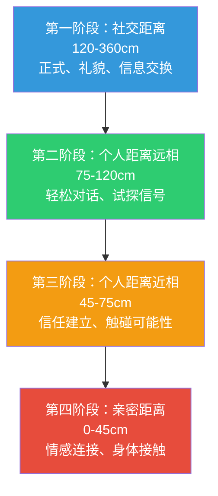
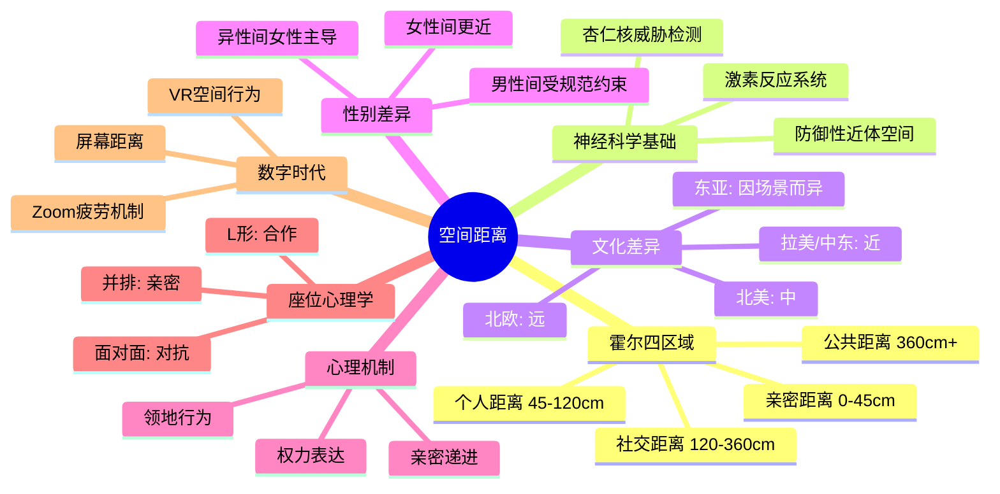

## 七、空间距离（Proxemics）

空间距离是人类最原始、最本能的非语言沟通形式之一。美国人类学家爱德华·T·霍尔（Edward T. Hall）在 1966 年出版的开创性著作 *The Hidden Dimension* 中首次系统性地提出了"空间关系学"（Proxemics）这一概念，揭示了人类如何通过物理距离的远近来传递情感、权力、意图和社会关系。霍尔的核心洞察在于：空间不是中性的容器，而是一套被文化编码的符号系统——你与他人之间的距离本身就在"说话"。

这一发现的深远意义在于，空间距离的调控往往是无意识的。人们很少会想"我要站得离他远一点"，但他们的身体已经做出了判断。理解空间距离的运作机制，能让你在社交、职场、亲密关系中拥有一个强大的"隐性沟通频道"。

### 7.1 霍尔的四区域理论

霍尔将人际空间距离划分为四个区域，每个区域对应特定的关系类型和互动模式。每个区域又进一步细分为"近相"和"远相"两个子区域，反映了同一关系类型中的亲疏细微差异。

#### 7.1.1 亲密距离（Intimate Distance）：0-45 厘米

亲密距离是人际空间中最具排他性的区域，通常只对最亲近的人开放。

**近相（0-15 厘米）**：身体几乎接触的距离。在这个范围内，人体会通过皮肤温度、呼吸节奏、心跳甚至心跳的声音来传递信息。研究表明，亲密伴侣在这个距离内可以通过嗅觉感知对方的情绪状态——人类能无意识地检测到他人汗液中的皮质醇（压力激素）浓度变化（Mujica-Parodi et al., 2009）。这个距离内的互动极度依赖信任，被陌生人突然侵入会引发强烈的生理应激反应：心跳加速、肌肉紧绷、战斗或逃跑本能激活。

**远相（15-45 厘米）**：手臂可及的距离，但仍处于"私人领地"之内。在这个范围内，可以清晰感知对方的体温、化妆品或洗护用品的气味、呼吸的细微声音。伴侣间的低声耳语、母亲安抚婴儿、密友间的私密谈话都在这个区域内发生。有趣的是，长时间处于亲密距离内会促进催产素和内啡肽的释放，这也是为什么拥抱和依偎具有天然的减压效果。

**生理机制**：人类对亲密距离的保护有深刻的进化根源。在灵长类动物中，靠近另一个体的头部和颈部区域是极度危险的行为——这意味着你进入了对方的攻击范围。人类保留了这种本能，靠近陌生人的面部区域会自动触发防御性警觉。

#### 7.1.2 个人距离（Personal Distance）：45-120 厘米

个人距离是日常社交中最常见的互动范围，也是大多数非正式对话的自然距离。

**近相（45-75 厘米）**：伸手可触的距离。在这个范围内，你可以轻松地拍对方的肩膀、握手、递东西。朋友间的日常聊天、家人一起看电视、同事在茶水间闲聊通常维持在这个距离。这个距离允许丰富的非语言信息交换——面部表情清晰可见，手势的细微变化可以被捕捉，语调的轻重缓急也更容易感知。

**远相（75-120 厘米）**：手臂伸直刚好够不到的距离。这是一个微妙的"安全边界"——你仍在社交圈内，但对方无法在你毫无防备的情况下触碰你。初次见面的两个人通常会自然地维持在这个距离，它传递的信号是"我对你友好，但我还没有完全信任你"。

**关键特性**：个人距离的远相（75-120 厘米）是社交试探的主战场。当一个人对另一个人产生好感但尚未确认对方的态度时，他们会从远相逐步向近相移动——每缩短 10-15 厘米都是一次"试探"，如果对方没有后退，就接受到了积极信号；如果对方后退，就获得了"保持距离"的反馈，而整个过程可以在不使用任何语言的情况下完成。

#### 7.1.3 社交距离（Social Distance）：120-360 厘米

社交距离是正式互动和功能性交流的区域。

**近相（120-210 厘米）**：典型的办公桌对话距离。当同事走到你桌前讨论工作，或者客户在会议室里就座时，通常处于这个距离。在这个范围内，面部表情仍然可以被辨识，但微表情和细微的瞳孔变化已经难以察觉。声音需要适度提高，语调的微妙差异开始变得不那么明显。

**远相（210-360 厘米）**：正式商务会谈、官方会面的标准距离。在这个范围内，人们倾向于使用更正式、更结构化的语言，非语言信号的传递效率显著下降——细微的面部表情几乎无法被感知，主要依赖肢体大动作和语调来传递信息。这也是为什么在重要会议中，坐在远相距离的人可能"感觉不到"对方的紧张或不满，从而导致沟通盲区。

**权力空间**：社交距离与权力的关系尤为密切。研究表明，高管的办公桌平均长度为 180 厘米，当访客坐在桌对面时，自动处于社交距离的远相——这种空间安排本身就是权力的物理表达。相比之下，"圆桌无主位"的会议室设计则有意消除了这种距离带来的等级感。

#### 7.1.4 公共距离（Public Distance）：360 厘米以上

公共距离是一对多沟通的区域，非语言信号的传递方式发生了根本性变化。

**近相（360-750 厘米）**：小型演讲、课堂授课的典型距离。在这个范围内，演讲者需要依赖更大幅度的手势、更夸张的面部表情和更有力的语调来传递信息。研究表明，听众在这个距离上对演讲者的可信度评估更多依赖于声音特质（音量、语速、语调变化）而非面部表情。

**远相（750 厘米以上）**：大型演讲、政治集会的距离。在这个范围内，个体之间的非语言交流几乎消失，取而代之的是"群体动力学"——演讲者的节奏、停顿、语调变化可以同步调控数百甚至数千人的情绪反应。这也是为什么优秀的政治演说家和宗教领袖能够仅凭声音和姿态的变化就能引发集体情绪波动。

**表演性放大**：在公共距离上，所有非语言信号都需要"放大"才能有效传递。手势需要更大幅度，声音需要更饱满，面部表情需要更鲜明。这解释了为什么舞台演员在排练时习惯性地夸大动作——他们在为远距离的观众调整信号强度。

### 7.2 空间距离的神经科学基础

空间距离不仅仅是一种社会习俗，它有深刻的生物学和神经科学基础。

#### 7.2.1 "防御性近体空间"

神经科学家 Graziano 和 Cooke（2006）的研究发现，人类大脑的顶叶皮层（Parietal Cortex）中存在一组专门编码"身体周围空间"的神经元。这些神经元以身体表面为参考系，构建了一个环绕身体的"空间地图"。当外部刺激（如陌生人的手）进入这个空间时，这些神经元会自动激活，触发防御性反应。

这个"防御性近体空间"（Defensive Peripersonal Space, DPPS）的大小因人而异，但平均约为手臂长度（约 40-60 厘米）。fMRI 研究显示，当陌生人侵入这个空间时，杏仁核和脑岛（Insula）的活动显著增强——这是大脑的威胁检测和身体感知中枢。这也解释了为什么在拥挤的地铁里，虽然理性上知道没有危险，身体仍然会感到不适。

#### 7.2.2 空间距离与激素反应

空间距离的变化会引发显著的内分泌反应：

- **靠近陌生人**：皮质醇（压力激素）水平上升，心率加快，肌肉张力增加
- **靠近亲密伴侣**：催产素水平上升，心率减缓，肌肉放松
- **空间被侵犯**：肾上腺素分泌增加，进入"警戒"状态
- **主动靠近亲密对象**：多巴胺释放增加，产生愉悦感

这些激素反应是自动的、不受意识控制的，这也意味着你无法完全"说服"自己的身体接受一个让你不适的空间距离。

#### 7.2.3 杏仁核与空间威胁检测

杏仁核在空间距离的威胁评估中扮演核心角色。Kennedy 等人（2009）研究了一位双侧杏仁核损伤的女性患者 SM，发现她对人际空间被侵犯完全没有不适感——她甚至可以让陌生人的鼻子贴近自己的鼻子而毫无反应。相比之下，正常的被试在陌生人靠近到 20 厘米以内时会出现显著的生理应激反应。这个案例有力地证明了杏仁核是空间威胁检测的关键结构。

### 7.3 空间距离的文化差异

空间距离的偏好存在显著的跨文化差异，这些差异根植于社会规范、历史传统和气候环境。

#### 7.3.1 主要文化区域的空间偏好

| 文化区域 | 典型社交距离 | 特征描述 | 潜在冲突点 |
|----------|------------|---------|-----------|
| 拉丁美洲（巴西、阿根廷、墨西哥） | 50-80 厘米 | 交谈时靠近，频繁身体接触，拥抱是标准问候 | 北欧人可能觉得被"侵入" |
| 南欧（意大利、西班牙、希腊） | 60-90 厘米 | 热情、肢体语言丰富，触碰频繁 | 东亚人可能觉得过于亲密 |
| 中东（阿拉伯国家） | 30-60 厘米 | 同性间非常近，甚至可以看到对方后退时对方跟进 | 西方人可能感到压迫 |
| 北美 | 90-120 厘米 | 标准"一臂之距"，注重个人空间 | 拉美人可能觉得冷淡 |
| 北欧（德国、瑞典、芬兰） | 120-150 厘米 | 强调个人空间，排队时也保持距离 | 南欧人可能觉得疏远 |
| 东亚（中国、日本、韩国） | 90-120 厘米 | 因场景而异，正式场合距离较远 | 中东人可能觉得不够热情 |
| 南亚（印度、巴基斯坦） | 60-90 厘米 | 同性间较近，异性间因宗教规范差异大 | 西方人可能误解意图 |

#### 7.3.2 "空间文化冲突"的典型场景

**场景一：巴西商人 vs. 日本商人**。巴西商人习惯在 60 厘米的距离交谈，当他靠近时，日本商人本能地后退；巴西人将后退解读为"不友好"，于是更加靠近；日本人感到空间被侵犯，继续后退——形成"追逐-逃跑"的恶性循环，双方都感到对方"奇怪"。

**场景二：阿拉伯学生 vs. 美国教授**。阿拉伯学生习惯在 40 厘米的距离与老师讨论问题，美国教授则习惯保持 100 厘米的距离。阿拉伯学生每次靠近，美国教授就后退，学生可能将此解读为"老师不喜欢我"，而教授则可能觉得"学生没有边界感"。

**场景三：拥挤文化 vs. 空间文化**。在东京或孟买的高峰期地铁里，人们可以接受与陌生人几乎紧贴的距离；但在斯德哥尔摩或赫尔辛基，即使在不太拥挤的地铁里，人们也会本能地与陌生人保持最大可能的距离。

#### 7.3.3 文化空间规范的成因

空间距离的文化差异并非随机形成的，研究者提出了几种解释模型：

- **气候假说**：温暖气候地区的文化倾向于更近的社交距离，因为温暖环境下人们的户外活动更多，身体暴露更多，亲密接触的禁忌更少（Sorokowska et al., 2017）
- **人口密度假说**：高人口密度地区（如东亚城市）发展出了更精细的空间管理策略，人们在拥挤环境中通过心理边界而非物理距离来维护个人空间
- **关系导向假说**：集体主义文化（拉美、中东）强调人际联结，倾向于更近的距离；个人主义文化（北欧、北美）强调个体独立，倾向于更远的距离

#### 7.3.4 全球化时代的空间规范演变

值得注意的是，全球化正在重塑空间规范。年轻一代的城市居民受国际媒体、跨文化工作环境和社交媒体的影响，其空间距离偏好正在向"中间值"靠拢。然而，在正式场合和与长辈交流时，传统规范仍然占据主导地位。最安全的跨文化策略是：**观察当地人的行为模式，以他们的距离为参照，而不是以自己的习惯为准**。

### 7.4 空间距离的性别差异

空间距离的使用存在显著的性别差异，这些差异既受生物因素影响，也受社会规范塑造。

#### 7.4.1 同性互动中的差异

- **女性之间的社交距离**通常比男性之间更近。女性在与女性朋友交谈时，平均距离约为 60-80 厘米；男性之间的平均距离约为 80-110 厘米
- **女性更频繁地使用触碰**作为亲密信号——挽手臂、搭肩膀、轻拍手背在女性间是常见的友谊表达
- **男性之间的空间距离受"男性规范"约束**：在许多文化中，男性之间过于亲近会被解读为"不够阳刚"或暗示性取向，这种社会压力导致男性之间倾向于保持更远的距离

#### 7.4.2 异性互动中的差异

- **在异性互动中，女性通常掌握空间距离的"主导权"**——女性倾向于在初期保持较远的距离，然后根据信任程度逐步缩短
- **男性在吸引场景中倾向于主动缩短距离**，但研究表明，由女性主导距离调整的配对，其关系满意度和持久性更高
- **"距离反转"现象**：在关系建立初期，女性保持较远距离；一旦关系确立，女性往往比男性更倾向于缩短日常距离——这可能与女性在亲密关系中更重视情感联结有关

#### 7.4.3 性别 × 文化的交互效应

性别差异在不同文化中的表现差异很大：

- **在拉丁美洲和中东文化中**，异性间的空间距离受到严格的社会规范约束——未婚异性之间的距离通常比同性之间远得多
- **在北欧文化中**，性别对空间距离的影响相对较小，男女之间的社交距离与同性间的距离差异不大
- **在东亚文化中**，正式场合的异性距离通常比同性距离更远，但在年轻一代的非正式社交中，这种差异正在缩小

### 7.5 空间使用的心理学机制

#### 7.5.1 领地行为（Territoriality）

人类的空间行为深深植根于动物领地本能。美国社会心理学家 Robert Sommer 在 1969 年的经典著作 *Personal Space* 中描述了人类如何通过"标记"来声明领地：

**初级领地**（Primary Territory）：属于个人的专属空间，如卧室、固定工位、"我的椅子"。入侵初级领地会引发最强烈的防御反应。

**次级领地**（Secondary Territory）：不专属但有习惯性使用权的空间，如"常去的咖啡座""图书馆里总坐的那个位置"。被他人占据时会感到不舒服，但通常不会直接对抗。

**三级领地**（Tertiary Territory）：公共空间中临时占有的位置，如公园的长椅、咖啡厅的桌子。人们通过放置物品（手机、书包、外套）来"宣告"临时领地，这种行为被称为"空间标记"（Spatial Marking）。

**空间标记的策略**：
- **物品占位**：将个人物品放在邻座上，阻止陌生人坐下
- **身体延伸**：将手臂搭在椅背上、双腿伸展，物理性地扩大领地范围
- **声音领地**：在安静的图书馆里用翻书声、键盘声来"提醒"周围人自己的存在
- **气味标记**：在办公室里使用个人化的香水或咖啡气味，虽然不是有意识的行为，但确实建立了空间的"归属感"

#### 7.5.2 权力与空间

空间是权力最直接的物理表达之一。Henley（1977）的研究系统性地揭示了空间与权力之间的关系：

**空间特权**：
- 高地位者拥有更大的物理空间（更大的办公室、更宽的座位间距）
- 高地位者拥有更多入侵他人空间的自由（老板可以走到下属桌前，但下属通常需要"预约"才能进入老板的办公室）
- 高地位者在座位选择上有优先权（会议室里最好的位置、餐桌的主位）
- 高地位者可以单方面决定互动距离（他靠近你，你不能后退；他退后，你不能跟进）

**空间反转**：有趣的是，当权力关系发生逆转时（如员工升职为经理），其空间使用模式会在几周内随之改变——更大的手势、更宽的站姿、更多的空间占据行为。这表明空间行为并非固定的个人特质，而是对权力状态的动态反应。

**办公空间的政治学**：
| 空间要素 | 高权力表达 | 低权力表达 |
|----------|----------|----------|
| 办公室大小 | 独立大办公室，门可关闭 | 开放式工位，无隐私 |
| 座位位置 | 角落或靠窗，视野开阔 | 中间位置，被包围 |
| 桌面空间 | 大桌面，个人物品丰富 | 小桌面，最少个人物品 |
| 访客距离 | 桌子作为"屏障" | 并排而坐，无屏障 |
| 站立姿态 | 双脚分开，占据更多地面 | 双脚并拢，缩小存在感 |

#### 7.5.3 空间与亲密感的递进模型

缩短人际距离是建立亲密关系的核心机制之一，但这个过程必须遵循"渐进原则"：

**关键规则**：每个阶段的过渡都需要"许可信号"。如果在社交距离阶段就直接跳到亲密距离，会触发对方的防御反应——不仅是心理上的不适，还包括生理上的应激（心率上升、肌肉紧绷、杏仁核激活）。相反，如果每次都等待对方发出积极信号（不后退、面向你、身体微微前倾）再缩小距离，亲密感的建立就会自然而顺畅。

**"空间入侵"的后果**：违反空间递进规则会导致"空间防御"——对方会通过以下方式重建边界：
1. 后退或侧移
2. 身体转向（肩膀不再面向你）
3. 交叉手臂（物理屏障）
4. 用物品（如手提包）放在两人之间
5. 减少眼神接触
6. 语调变冷、回答变短

如果忽视这些信号继续靠近，对方可能直接口头表达不满，或者选择离开。

### 7.6 座位选择的心理学

座位选择是空间距离的一个重要子领域，它传递着丰富的心理信息。

#### 7.6.1 基本座位模式

| 座位模式 | 心理含义 | 适合场景 | 不适合场景 |
|---------|---------|---------|-----------|
| 面对面（90°-180°） | 对抗性、竞争性、正式感增强 | 辩论、面试、批评性反馈 | 创意讨论、情感支持 |
| L形（90°） | 合作性、非对抗、兼顾交流与协作 | 商务讨论、辅导、咖啡聊天 | 对抗性谈判 |
| 并排（0°） | 亲密、协作、共同面向外部 | 共同工作、亲密聊天、安慰 | 正式会谈、面试 |
| 对角（135°） | 独立但不疏远、适度尊重 | 图书馆邻座、等候室 | 需要深度交流的场景 |

#### 7.6.2 "餐桌政治学"

餐桌座位是最典型的空间权力博弈场景：

- **主位（Head of the Table）**：面对门的位置，视野最开阔，是默认的权力位置。在商务宴请中，主位留给最重要的客人或最高级别的领导
- **主位两侧**：次重要的位置，通常留给第二和第三重要的客人
- **距离主位最远的位置**：权力最低的位置，通常是新人或级别最低的参与者
- **并排坐 vs. 对面坐**：在商务午餐中，与对方并排而坐传递的是"合作"信号；对面而坐则传递的是"正式"信号

#### 7.6.3 办公空间中的座位策略

**面试场景**：
- 面试官与候选人之间通常隔一张桌子（社交距离），这种安排强调了权力差异
- "去掉桌子"的面试方式（如 Google 的沙发面试）有意缩短距离，传递"平等"和"亲和"的信号
- 候选人不应选择面试官旁边的座位（过于亲近）或正对面的座位（过于对抗），最佳选择是呈 L 形的角度

**会议场景**：
- 圆桌会议传递平等信号，鼓励所有人发言
- 长桌会议强化等级差异，坐在两端的人更容易主导讨论
- 研究表明，在长桌会议中，坐在对面的人更容易产生分歧，坐在旁边的人更容易达成共识（Sommer, 1969）

**开放式办公室**：
- 工位之间的距离直接影响同事之间的互动频率——距离每增加 1 米，日常交流频率下降约 50%（Allen, 2007）
- "角落工位"和"靠窗工位"被视为非正式的权力位置，因为它们提供了更大的空间和更好的视野
- 背对走廊的工位是最不受欢迎的位置，因为它让人感觉"暴露"和"被监视"

### 7.7 特殊场景中的空间距离策略

#### 7.7.1 商务谈判

在谈判中，空间距离是一种重要的策略工具：

- **开局阶段**：保持社交距离（120-180 厘米），建立正式氛围，让双方都处于"理性"状态
- **僵局阶段**：适度缩短距离至个人距离远相（75-120 厘米），传递"我想解决问题"的信号
- **让步阶段**：身体微微前倾，缩短 10-20 厘米，配合降低音量，营造"私密协商"的氛围
- **达成协议**：缩短到个人距离近相（45-75 厘米），配合握手等身体接触，强化"合作"信号

**反面案例**：在高冲突谈判中，一方故意大幅缩短距离来施压（"空间施压"策略）。这种策略可能在短期内有效，但会严重损害长期合作关系。研究表明，被动方在被"空间施压"时，皮质醇水平可上升 30% 以上，导致防御性思维增强，反而更难做出理性让步。

#### 7.7.2 医疗与心理咨询

在医疗和心理咨询场景中，空间距离的管理直接影响信任建立和治疗效果：

- **初诊阶段**：医生/咨询师应保持社交距离远相（200-300 厘米），让患者感到安全
- **建立信任后**：逐步缩短至社交距离近相（120-200 厘米），传递关注和同理
- **敏感话题讨论**：缩短至个人距离远相（75-120 厘米），但需要观察患者的反应——如果患者身体后倾或交叉手臂，说明距离过近
- **物理检查时**：在进入亲密距离（<45 厘米）之前，必须明确告知患者并获得许可——"我现在需要检查一下您的肩膀，可以吗？"

**研究支持**：Beach 和 Lipson（1999）的研究发现，医生在问诊时坐在距离患者 120 厘米以内的位置，患者的满意度和依从性显著高于站在门口或坐在桌后的医生。

#### 7.7.3 教育与培训

教师在课堂中的空间使用直接影响学生的注意力和参与度：

- **讲台距离（公共距离）**：适合传递权威感和重要信息，但长时间保持会降低学生的参与感
- **走下讲台（社交距离）**：走到学生中间，缩短距离，能显著提高学生的注意力和互动意愿
- **个别辅导（个人距离）**：弯腰到学生桌旁，进入个人距离，传递"我在关注你"的强烈信号
- **陷阱**：对某个学生过度靠近（过于频繁走到其桌旁）可能让该学生感到被"监视"，也可能让其他学生觉得被忽视

**"移动教学法"**：优秀教师会系统性地在教室中移动，确保在每节课中与每位学生都有至少一次近距离接触（<200 厘米）。研究表明，教师的空间覆盖范围与学生的课堂参与度呈正相关。

#### 7.7.4 公共交通与拥挤空间

在电梯、地铁、公交车等无法自由选择距离的场景中，人们发展出了精细的"拥挤应对策略"：

- **身体定向**：在拥挤的电梯里，人们倾向于面朝门而非面朝他人——通过身体方向而非距离来建立"心理边界"
- **凝视规避**：在拥挤的地铁中，人们会刻意避免眼神接触，将目光投向手机、窗外或地面——这是通过切断视觉连接来补偿物理距离的缺失
- **身体紧绷**：在被迫与陌生人处于亲密距离时，人们会本能地收紧身体、收拢手臂和腿部，尽量减少身体接触面积
- **物品屏障**：用书包、文件夹、购物袋等物品在身体与他人之间建立物理屏障
- **心理脱离**：戴耳机、看手机、读书——通过将注意力转移到其他感官通道来减少对空间侵犯的不适感

**"电梯规则"**：社会学家对电梯行为的研究发现了一系列有趣的规范——进入电梯后转身面向门、保持严格的前后左右等距、避免说话、尽量减少身体晃动。这些规则在不同文化中惊人地一致，说明人类对"被迫亲密"有普遍的适应策略。

### 7.8 数字时代的空间距离

数字化通讯正在重塑人类对"空间距离"的感知。

#### 7.8.1 屏幕距离与心理距离

人们在使用电子设备时的物理距离（通常 30-60 厘米）与屏幕中对方"存在"的心理距离之间存在复杂的映射关系：

- **视频通话**：对方的面部占据了你视野中较大的比例（类似于亲密距离的视觉输入），但你感知到的心理距离却是社交距离甚至更远——这种"输入不匹配"是视频会议疲劳的重要原因之一
- **社交媒体**：浏览某人的动态在物理距离上是"零接触"，但在心理距离上可能非常近（尤其是亲密朋友或暗恋对象）——这种"心理近距离"会激活与面对面亲密接触相似的情绪反应
- **即时消息**：文字消息缺乏空间距离的信息，因此人们会通过其他渠道来补偿——标点符号的使用、回复速度、表情符号的选择都在传递"心理距离"信号

#### 7.8.2 虚拟空间中的距离行为

在虚拟现实（VR）和在线会议中，人类对空间距离的本能反应依然存在：

- **VR 研究**表明，当虚拟角色靠近到虚拟亲密距离（<45 厘米）时，用户会出现与现实世界相似的生理应激反应——心跳加速、皮肤电导增加（Bailenson et al., 2003）
- **Zoom 效应**：在视频会议中，当对方的面部填满你的屏幕时（模拟亲密距离），你的大脑会将此解读为"空间入侵"，导致持续的低水平应激——这是"Zoom 疲劳"的核心机制之一
- **应对策略**：缩小视频窗口、增大与屏幕的物理距离、使用虚拟背景来"稀释"对方的视觉存在感，都可以有效缓解视频会议中的"空间过载"

### 7.9 空间距离的常见误区与纠正

#### 误区一：每个人的空间需求都一样

**错误认知**：用同一套空间标准与所有人互动。

**事实**：空间距离的偏好受文化、性别、性格、关系、情境等多个因素的交互影响。内向型人格比外向型人格通常需要更大的个人空间；有社交焦虑症的人对空间被侵入的敏感度可能是普通人的 2-3 倍；经历过创伤的人可能对亲密距离有超常的防御反应。

**纠正方法**：在与新人互动时，从社交距离远相开始（约 150 厘米），观察对方的非语言信号。如果对方身体前倾、面向你、频繁微笑，可以逐步缩短距离；如果对方后倾、侧身、交叉手臂，说明当前距离可能已经过近。

#### 误区二：靠近就等于友好

**错误认知**：觉得缩短距离一定能传递友好和亲近。

**事实**：缩短距离只有在双方都感到舒适时才传递积极信号。如果对方没有准备好，你的"靠近"会被解读为"入侵"或"施压"。尤其在跨文化场景中，"友好地靠近"可能恰好触发对方的防御机制。

**纠正方法**：采用"镜像法"——观察对方的距离偏好，以对方的距离为基准，略远 10-15 厘米开始。让对方来主导距离的缩短，而不是你主动逼近。

#### 误区三：空间距离是固定的

**错误认知**：一旦建立了某个距离，它就应该保持不变。

**事实**：有效的空间沟通是动态的。在一次对话中，距离可能会经历多次变化——讨论轻松话题时靠近，讨论敏感话题时退后，达成共识时再次靠近。这种"空间呼吸"是自然沟通的一部分。

**纠正方法**：培养"空间意识"——在对话过程中，有意识地感知当前距离是否匹配对话内容的亲密度。轻松话题可以靠近，严肃话题应该适度退后。

#### 误区四：面对面的距离就是全部

**错误认知**：只关注与对方的直线距离。

**事实**：空间距离不仅包括直线距离，还包括角度（面对面 vs. L形 vs. 并排）、高度差（坐 vs. 站）和中间障碍物（桌子、屏幕）。两个人相距 100 厘米但中间隔一张桌子，与相距 100 厘米但没有任何障碍物，传递的心理信息完全不同——前者增加了"屏障感"和正式感，后者增加了"开放感"和亲密感。

**纠正方法**：在评估空间关系时，综合考虑距离、角度、高度和障碍物四个维度。如果想传递"开放"信号，除了缩短距离，还可以移开桌子、降低身体高度（坐下而非站着）或转向对方。

#### 误区五：在线上可以忽略空间距离

**错误认知**：空间距离只在面对面交流中起作用。

**事实**：如前文所述，视频会议中的屏幕距离、摄像头角度、画面大小都会激活空间距离相关的心理机制。在 Zoom 会议中将某人的画面放大到全屏，相当于让他的面部"侵入"你的亲密距离。

**纠正方法**：在视频会议中，将视频窗口缩小到屏幕的 1/3 到 1/2，保持与屏幕 60-90 厘米的物理距离，使用外接显示器时将视频窗口放在屏幕的边缘而非中心。

### 7.10 空间距离的训练方法

#### 7.10.1 基础训练：空间觉察

1. **距离日记**：连续一周，记录你在不同场景中与不同人的距离。标注关系类型（陌生人/同事/朋友/家人）、场景（办公室/咖啡厅/地铁）和你的舒适度评分（1-10）。一周后分析模式：你与谁的距离最远？最近？在什么场景中你感到最不舒服？

2. **"一步测试"**：在与朋友对话时，有意识地向前迈一步，观察对方的反应——是否后退？是否身体后倾？是否交叉手臂？然后再退后一步，观察对方是否放松。这个练习能帮你建立对"空间信号"的敏感度。

3. **电梯观察**：在电梯里观察人们的行为模式——他们站在哪里？面向哪个方向？如何处理眼神接触？手机使用的时机？这些都是空间距离本能反应的最佳观察场景。

#### 7.10.2 进阶训练：空间策略

4. **座位选择练习**：在下次会议或聚餐中，有意识地选择座位。想传递"合作"信号？选 L 形的位置。想传递"平等"信号？选圆桌。想传递"权威"信号？选主位。选择后观察你的位置如何影响互动质量。

5. **"空间递进"练习**：在社交场合中，练习"渐进式靠近"——从社交距离开始，每次缩短 10-15 厘米，观察对方是否给出积极信号（不后退、身体前倾、微笑）。如果对方给出消极信号，立刻回到上一个舒适距离。这个练习能帮你建立自然的"空间节奏"。

6. **跨文化空间适应**：如果你有来自不同文化背景的朋友或同事，有意识地观察他们的空间偏好。与拉丁美洲朋友交谈时尝试缩短距离，与北欧朋友交谈时注意保持距离。记录你的感受和对方的反应。

#### 7.10.3 高级训练：空间影响力

7. **"空间主导"练习**：在安全的环境中（如与好友模拟），练习通过空间行为传递权威——站姿更宽、手势更大、主动选择位置、控制距离。观察这些行为如何改变对方的互动模式。

8. **"空间安抚"练习**：当他人处于紧张或焦虑状态时，练习通过空间行为传递安全感——适度缩短距离但不侵入亲密距离、保持开放姿态、避免在两人之间放置障碍物。

9. **"空间读取"练习**：观察两个你不太熟悉的人之间的互动，尝试从他们的空间行为推断关系类型、权力动态和情感状态——他们的距离是多少？谁在主导距离的变化？身体角度如何？这些推断可以在事后通过观察他们的互动模式来验证。

### 7.11 空间距离研究的里程碑

| 年份 | 研究者 | 贡献 |
|------|--------|------|
| 1966 | Edward T. Hall | 出版 *The Hidden Dimension*，首次系统性提出空间关系学（Proxemics），定义四区域理论 |
| 1969 | Robert Sommer | 出版 *Personal Space*，系统研究人类领地行为和座位选择心理 |
| 1977 | Nancy Henley | 揭示空间距离与权力、性别之间的系统性关系 |
| 1984 | Irwin Altman | 提出"社会渗透理论"，将空间距离纳入关系发展的动态模型 |
| 2003 | Bailenson et al. | VR 研究证实虚拟空间中的距离行为与现实世界一致 |
| 2006 | Graziano & Cooke | 发现大脑中编码"防御性近体空间"的神经元回路 |
| 2007 | Thomas Allen | 提出"Allen曲线"，量化空间距离与沟通频率的关系 |
| 2009 | Kennedy et al. | 通过杏仁核损伤患者的研究证实杏仁核在空间威胁检测中的核心作用 |
| 2017 | Sorokowska et al. | 对 42 个国家的空间距离偏好进行大规模跨文化研究，验证气候假说 |

### 7.12 本节要点回顾

空间距离是人类最本能的沟通系统之一。它在意识之下运作，却深刻影响着每一次互动的质量。掌握空间距离的艺术，意味着你能读懂他人的"空间语言"，也能有意识地通过距离的远近来传递你想传递的信号——信任、权威、亲密或边界。在下一节中，我们将讨论声音语调（Paralanguage）这一与空间距离密切配合的非语言沟通维度。
