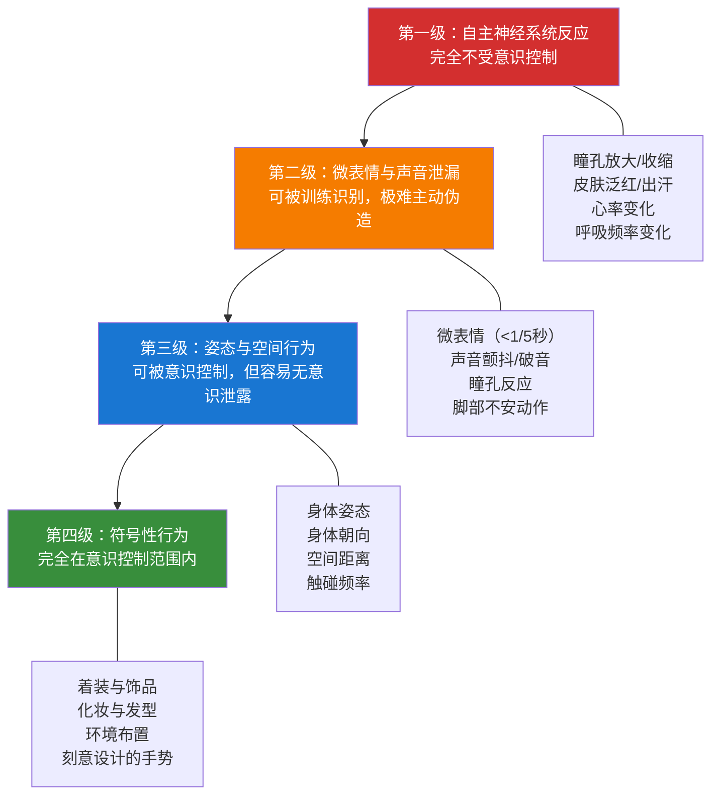
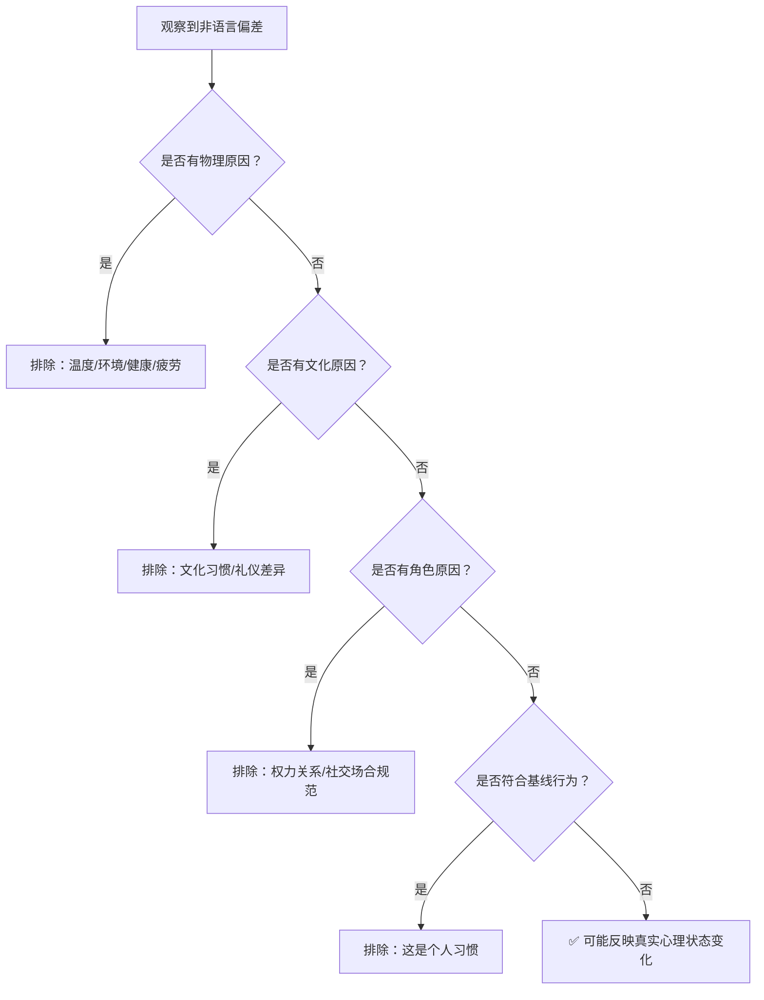
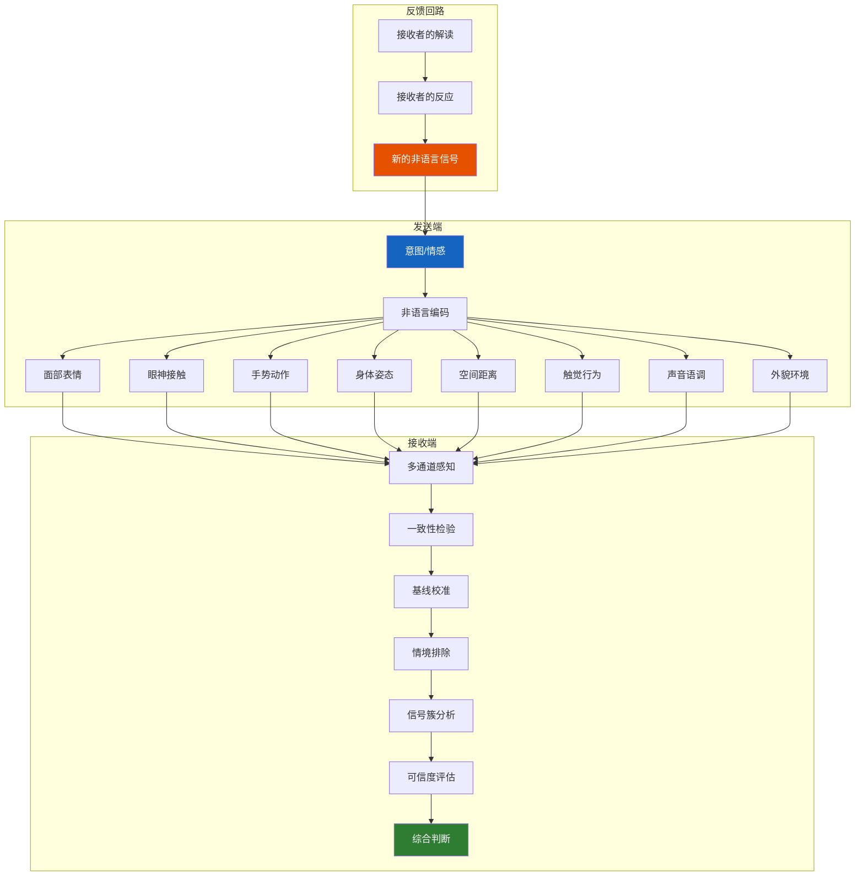

## 十一、非语言沟通的综合理解

前面十个专题分别拆解了非语言沟通的各个独立通道——面部表情、眼神接触、手势、姿态、空间距离、触觉、声音语调、外貌与环境、微表情与身体伪装、跨文化差异。但真实的人际互动从来不只激活单一通道，而是所有通道同时运转、相互叠加、彼此验证或矛盾。本节作为全章的理论收束，回答三个根本问题：

1. **如何整合**——多个非语言信号共同出现时，怎样形成统一判断？
2. **如何校准**——面对个体差异和情境变量，怎样避免误读？
3. **如何系统性提升**——从"看得懂零散信号"进阶到"整体掌控非语言沟通"？

---

### 11.1 一致性原则：非语言沟通的第一定律

#### 11.1.1 什么是一致性

一致性原则（Congruence Principle）是理解非语言沟通的基石：**当所有非语言通道传递的信息方向一致时，沟通的说服力和可信度呈指数级增长；当通道之间出现矛盾时，接收者的信任度急剧下降。**

Albert Mehrabian 在 1967 年的经典实验中发现，当语言信息与非语言信息发生冲突时，接收者对整体信息的信任度分配如下：

| 信息通道 | 传递"态度"的权重 | 可控程度 |
|----------|-----------------|---------|
| 语言内容（词汇本身） | 约 7% | 完全可控 |
| 声音语调（怎么说） | 约 38% | 部分可控 |
| 面部表情与肢体语言 | 约 55% | 最难控制 |

> **注意**：这个 7-38-55 法则严格来说只适用于"态度和情感"的传递场景，不适用于事实信息的传递。在"今天开会时间改到三点"这类信息中，语言内容的权重远高于此。但该法则揭示了一个深层规律：**在涉及态度、情感、可信度的沟通中，非语言信号的影响力远超语言内容。**

#### 11.1.2 一致性的实际表现

**正面一致性（信号叠加增强）：**

一个销售人员面带微笑（面部表情）、身体微微前倾（姿态）、保持稳定的眼神接触（眼神）、声音热情且节奏适中（语调）、穿着整洁得体（外貌）、与客户保持约一米的舒适距离（空间），所有这些信号共同传递出一个统一的信息——"我重视你，我值得信赖，我准备好为你服务"。当接收者从六个以上通道同时接收到同一方向的信号时，说服力不是简单叠加，而是产生"共振效应"。

**负面一致性缺失（信号矛盾瓦解）：**

同样是这位销售人员，如果嘴上说"非常高兴见到你"，但双臂交叉抱在胸前（封闭姿态）、表情僵硬缺乏微笑（面部）、目光频繁移向别处（眼神）、语速过快声音紧绷（语调）、脚尖指向出口方向（朝向），接收者的大脑会在毫秒级别完成矛盾检测——**语言说的是一回事，身体说的是另一回事，而大脑天然倾向于相信身体。**

#### 11.1.3 一致性缺失的神经科学机制

为什么接收者在语言与非语言冲突时倾向于相信非语言信号？原因在于大脑的信息处理架构：

- **语言内容**由前额叶皮层（prefrontal cortex）的布洛卡区和韦尼克区负责处理，这是一个有意识的、序列化的、相对较慢的过程。
- **非语言信号**由杏仁核（amygdala）、梭状回（fusiform gyrus）、镜像神经元系统（mirror neuron system）等负责处理，这是一个无意识的、并行的、极快的过程。

当两种信号冲突时，非语言信息总是"先到"——杏仁核在 200 毫秒内就能对威胁性面部表情做出反应，而语言理解至少需要 400-600 毫秒。这种时间差意味着：**在你还在分析对方"说了什么"的时候，你的身体已经对对方"怎么做的"做出了判断。**

#### 11.1.4 实践应用：一致性构建清单

在任何需要建立信任和说服力的场景中（面试、谈判、演讲、销售、约会），逐一检查以下通道是否传递一致的信息：

| 通道 | 检查点 | 常见矛盾 |
|------|--------|---------|
| 面部 | 表情是否与语言情感匹配 | 说"我很开心"但无微笑 |
| 眼神 | 是否保持适当接触 | 说"我很重视你"但频繁看手机 |
| 姿态 | 身体朝向是否面向对方 | 说"我对你感兴趣"但身体转向别处 |
| 手势 | 手势是否开放、配合内容 | 说"欢迎"但双臂交叉 |
| 声音 | 语调、语速、音量是否匹配 | 说"没问题"但声音紧绷、语速加快 |
| 空间 | 距离是否符合关系和场景 | 说"我们是朋友"但保持过远距离 |
| 朝向 | 脚尖和身体朝向是否指向对方 | 说"我听着呢"但脚尖指向门口 |

---

### 11.2 非语言信号的可信度层级

#### 11.2.1 四级可信度模型

不同的非语言信号在"反映真实内心状态"这件事上，可信度存在显著差异。核心逻辑是：**越难被意识控制的信号，越能反映真实内心状态。**

#### 11.2.2 各层级详解

**第一级：自主神经系统反应（最可信）**

这些反应由自主神经系统（ANS）的交感神经和副交感神经直接控制，没有任何意识介入的可能：

- **瞳孔反应**：当看到感兴趣的事物时，瞳孔会放大（副交感神经兴奋）；当感到威胁或厌恶时，瞳孔会收缩。瞳孔的放大和收缩完全不受意识控制，是测谎学中最可靠的生理指标之一。
- **皮肤电导**：紧张时手掌出汗（俗称"冒冷汗"），皮肤电导率会瞬间升高。这就是测谎仪（polygraph）的核心原理之一。
- **面部血液分布**：害羞或愤怒时面部泛红（血管扩张），恐惧或不适时面色苍白（血管收缩），这些反应无法被意识控制。
- **呼吸模式**：恐惧时呼吸变浅变快，放松时呼吸变深变慢。虽然可以在一定程度上控制呼吸，但在高强度情绪下很难伪装。

**第二级：微表情与声音泄漏（较可信）**

- **微表情**：持续时间不到 1/5 秒的面部表情，泄露内心真实的情感状态。Paul Ekman 的研究表明，微表情是检测欺骗的最可靠行为指标之一，因为大多数人无法有意识地控制面部肌肉的细微运动。
- **声音颤抖**：在紧张、恐惧或强烈情感下，声带的微小肌肉群会不自主地收缩，导致声音出现颤抖。这是意志力极难控制的。
- **脚部行为**：在谎言研究中，脚部行为是被低估的"泄密者"。当一个人试图用面部表情和语言掩饰紧张时，脚部往往会"出卖"真实感受——脚部抖动、脚尖转向出口方向、交叉或解开脚踝等。
- **触摸行为**：自我触摸（摸脖子、搓手、拉衣角）在紧张时会显著增加，这些动作往往是无意识的。

**第三级：姿态与空间行为（可控制但易泄露）**

- **身体姿态**：开放或封闭的姿态可以被有意识地选择，但在长时间互动中，人会无意识地回归自然姿态。
- **身体朝向**：人会无意识地将身体朝向感兴趣的人或事物，背离想要回避的对象。
- **空间距离**：可以有意识地保持特定距离，但在情感变化时会不自主地靠近（亲密/兴趣）或远离（厌恶/不安）。

**第四级：符号性行为（完全可控）**

- **着装**：完全在个人选择范围内，是"最安全"的非语言信号——人们可以通过着装来传递任何想要传递的信息。
- **饰品与配件**：手表、首饰、领带等完全是有意识的选择。
- **环境布置**：办公室的摆设、照片墙、书架上的书，都是精心设计过的"非语言信息"。

#### 11.2.3 实践意义：怎样读取真实信号

当怀疑对方言行不一时，**优先观察第一级和第二级信号**，而不是纠结于对方刻意展示的第四级信号。

例如，在商务谈判中，对方嘴上说"这个价格我们很满意"（第四级——语言，完全可控），但他的瞳孔微微收缩（第一级——不满），双手不自觉地合拢在胸前形成屏障姿态（第三级——防御），这些较低层级的信号比语言更值得采信。

---

### 11.3 基线行为：个体差异的校准器

#### 11.3.1 什么是基线行为

基线行为（Baseline Behavior）是指一个人在放松、自然、无压力状态下的默认非语言行为模式。这是理解非语言信号的**参照系**。

**为什么基线行为至关重要？** 因为非语言信号的解读从来不是"看到X就意味着Y"的绝对公式，而是"看到X**偏离了这个人的正常基线**，意味着可能发生了Y"的相对判断。

举例说明：
- 张三平常语速就很快（高基线语速），谈判时语速依然快——这是他的正常状态，不能解读为紧张。
- 李四平常语速缓慢平稳（低基线语速），谈判时突然语速加快——这才是需要关注的偏离，可能表示紧张、兴奋或隐瞒。
- 王五平常就习惯性交叉双臂（高基线封闭姿态），聊天时依然交叉——不能解读为防御或不感兴趣。
- 赵六平常习惯双手自然下垂或展开（低基线开放姿态），聊天时突然双臂交叉——这才可能是防御、不适或隐瞒的信号。

#### 11.3.2 如何建立基线行为档案

在需要深度解读某人的非语言信号之前（重要面试官、谈判对手、关键客户），通过以下步骤建立其基线行为档案：

**第一步：观察中性场景（5-10分钟）**

在对方处于放松状态时（闲聊、等候、做不相关的事情），系统性地记录以下维度：

| 维度 | 观察要点 | 示例记录 |
|------|---------|---------|
| 语速 | 每分钟大约多少字？快/中/慢？ | 中等偏快，约 200 字/分钟 |
| 音量 | 说话声音大/中/小？ | 偏小声，需要靠近才能听清 |
| 眼神接触 | 频繁/适中/回避？每次持续多久？ | 适中，每次接触约 2-3 秒后自然移开 |
| 姿态 | 自然放松还是僵硬？倾向于开放还是微微封闭？ | 自然偏开放，双手常放在桌上 |
| 手势 | 说话时手势多/少？幅度大/小？ | 手势较少，偶尔配合做小幅度手势 |
| 脚部 | 脚的位置和朝向？是否有抖动习惯？ | 坐时双脚平放地面，无明显抖动 |
| 自我触摸 | 频率高/低？通常触摸哪里？ | 偶尔摸下巴，思考时习惯摸耳朵 |
| 空间偏好 | 保持多远的距离？是否主动靠近？ | 保持约 1 米距离，不主动靠近 |

**第二步：在正常互动中持续观察**

在 3-5 次不同场景的互动中，反复验证第一步的记录是否稳定。基线行为应该是多次观察的"平均值"，而不是单次观察的结果。

**第三步：标记偏差**

当后续互动中出现与基线明显不同的行为时，记录下来并思考可能的原因。偏差本身不直接等于特定含义，但**偏差是信号**——它告诉你某些内在状态发生了变化。

#### 11.3.3 基线行为的局限

- **文化和情境修正**：同一个人在不同文化环境或不同社会角色中，基线行为可能不同。一位工程师在技术讨论时的基线，可能与他在面对高管时的基线完全不同。
- **伪装的基线**：高明的社交操控者（如专业谈判手、特工、演员）可以建立一个"假基线"来误导观察者。这是最危险的情况——你建立的基线本身就是谎言。
- **情绪状态的波动**：疲劳、疾病、药物、酒精都会改变一个人的基线行为。如果对方感冒了或宿醉未醒，他的基线就不再可靠。

---

### 11.4 信号簇原则：从碎片到拼图

#### 11.4.1 为什么不能看单一信号

单一的非语言信号几乎从不构成可靠判断的充分依据。原因有三：

1. **多义性**：同一个行为可能有完全不同的含义。双臂交叉可能是防御（"我不信任你"）、寒冷（"空调太冷了"）、舒适习惯（"我就喜欢这样坐"）、模仿（"你交叉了我也跟着交叉"）。
2. **情境依赖**：同样的行为在不同情境中含义不同。在葬礼上低头沉默是悲伤，在考试中低头沉默是专注。
3. **个体差异**：如前所述，不看基线就解读行为，可能完全误判。

#### 11.4.2 信号簇的定义与解读方法

信号簇（Signal Cluster）是指**在同一时间窗口内，多个不同通道的非语言信号共同指向同一个结论**。只有当至少 3 个以上独立通道的信号方向一致时，才能形成可靠的判断。

**示例：判断对方是否想结束对话**

| 信号通道 | 弱信号（单一不足以下结论） | 信号簇（多通道一致） |
|----------|------------------------|-------------------|
| 姿态 | 身体微微后仰 | 身体后仰 + 封闭姿态 |
| 眼神 | 偶尔看表 | 频繁看表 + 看门口 + 回避眼神 |
| 朝向 | 脚尖稍微偏转 | 脚尖明确指向出口 + 身体侧转 |
| 回应 | 回答变简短 | 回答变简短 + 不再提问 + 频繁点头附和 |
| 动作 | 无特别 | 开始整理物品 + 手机解锁 + 拿起包 |

左侧的单一行为可以有多种解释；右侧的信号簇则几乎可以确定对方想要结束对话。

#### 11.4.3 信号簇分析的实战框架

在实际互动中，按照以下框架进行信号簇分析：

**步骤一：多通道扫描**

不要只盯着对方的脸。每 15-20 秒，快速扫视对方的整个身体——从头顶到脚尖。研究表明，约 60% 的人只关注面部信号，而忽略了手部、躯干和脚部传达的大量信息。

**步骤二：通道汇聚判断**

问自己："有多少个通道的信号指向同一个方向？"

| 通道一致数 | 判断可信度 | 建议行动 |
|-----------|-----------|---------|
| 0-1 个通道 | 极低，可能误读 | 继续观察，暂不行动 |
| 2 个通道 | 低，有倾向性 | 加以注意，寻找更多证据 |
| 3 个通道 | 中等，值得关注 | 开始准备应对策略 |
| 4+ 个通道 | 高，可以采信 | 有信心地做出反应 |

**步骤三：验证性测试**

当你有了初步判断后，进行**小规模验证测试**——改变某个条件，观察对方的非语言信号是否相应变化。

例如，你判断对方对某个话题感到不适（信号簇：回避眼神、身体后仰、自我触摸增加、回应变简短），可以主动切换话题，然后观察：如果不适信号簇在 30 秒内明显消退，说明你的判断是正确的。

---

### 11.5 情境框架：非语言信号的语境依赖性

#### 11.5.1 情境变量的影响

同一个非语言行为在不同情境中含义可能完全不同。忽略情境变量是非语言沟通最常见的误读来源。

| 行为 | 情境 A | 情境 B | 情境 C |
|------|--------|--------|--------|
| 双臂交叉 | 自我安慰（寒冷/紧张） | 防御姿态（不信任/抗拒） | 舒适习惯（自然坐姿） |
| 避免眼神接触 | 欺骗/隐瞒 | 文化礼貌（东亚长辈面前） | 社交焦虑/自卑 |
| 身体前倾 | 高度兴趣/投入 | 侵略性/施压 | 听力不好/听不清 |
| 语速加快 | 紧张/焦虑 | 兴奋/热情 | 时间紧迫 |
| 摸鼻子 | 掩饰谎言 | 过敏/鼻痒 | 习惯性动作 |

#### 11.5.2 必须考虑的情境变量清单

在解读非语言信号时，必须逐一排除以下情境变量的影响：

- **环境温度**：冷了会交叉手臂、缩肩；热了会出汗、扇风、拉开衣领。这些与情绪无关。
- **文化背景**：眼神接触、身体距离、手势含义在不同文化中差异巨大（详见第十节）。
- **关系层级**：同一个人面对上级、平级、下属时的非语言行为基准完全不同。
- **身体健康**：疲劳、疼痛、疾病、药物、酒精都会显著改变非语言行为。
- **时间压力**：赶时间的人语速快、动作急、频繁看表——这些不代表不耐烦或不尊重。
- **物理环境**：嘈杂的环境会让人不自觉地靠近、大声说话；狭窄的空间会让人出现封闭姿态。
- **群体动力**：一个人在三人小组中的非语言行为，可能与一对一交流时完全不同。

#### 11.5.3 情境排除法

当你观察到一个非语言偏差时，按以下顺序排查：

只有当所有情境变量都被排除后，非语言偏差才可能反映真实的内心状态变化。**宁可多排除，不可多归因**——过度解读比忽略信号更容易造成沟通灾难。

---

### 11.6 非语言沟通的双向性：你也在"说话"

#### 11.6.1 被忽略的"发送端"

大多数人把非语言沟通当作一种"解码"技能——去"读"别人的身体语言。但同样重要（甚至更重要）的是：**你的身体每时每刻也在向周围的人"广播"信息。**

你以为你在"安静地坐着"，但你的身体告诉同事的可能是："我现在很忙，不要打扰我"（低头、快速敲键盘、不抬头看人），也可能是："我现在很无聊，欢迎来聊天"（靠在椅子上、四处张望、频繁伸懒腰）。

#### 11.6.2 非语言信号的"感染"效应

人类拥有镜像神经元系统（mirror neuron system），这使得我们看到别人的非语言行为时，会无意识地在自己的身体中"复制"这种行为。

- **情绪感染**：当你走进一个房间，所有人都低着头沉默不语，你会不自觉地压低自己的声音和动作幅度。反之，当你走进一个笑声满堂的聚会，你会不自觉地嘴角上扬。
- **姿态同步**：关系亲密的人之间，姿态会自然地趋向同步——同时翘二郎腿、同时前倾、同时拿杯子喝水。这种"镜像效应"不仅反映关系亲密，还能反过来**增强**亲密感。
- **语速和语调传染**：在对话中，双方的语速和语调会逐渐趋同。如果一个人放慢语速，另一个人通常也会跟着放慢。

**实践应用**：如果你想影响对方的情绪状态，**先改变自己的非语言状态**。想让对方放松？先让自己放松——放慢语速、降低音量、做出开放姿态。想让对方感到紧迫？适度加快语速、减少笑容、增加直视。镜像神经元会帮你完成剩下的工作。

---

### 11.7 从认知到行动：系统性提升非语言沟通能力

#### 11.7.1 四阶段能力模型

| 阶段 | 能力水平 | 特征描述 | 训练方法 |
|------|---------|---------|---------|
| 无意识无能 | 不知道自己不懂 | 忽略非语言信号，仅关注语言内容 | 意识唤醒 |
| 有意识无能 | 知道自己不懂但还做不到 | 知道要看非语言信号，但看了也读不懂 | 结构化学习 |
| 有意识有能 | 刻意运用就能做到 | 需要刻意关注才能解读和控制非语言信号 | 大量练习 |
| 无意识有能 | 自然而然就能做到 | 非语言沟通能力内化为直觉 | 持续实践 |

#### 11.7.2 结构化训练方案

**第一阶段：观察训练（第 1-2 周）**

目标：培养"多通道扫描"的习惯。

- 每天选择一个场景（咖啡厅、地铁、会议室、视频会议），花 10 分钟观察两个人之间的互动。
- 不做判断，只做**客观记录**——甲做了什么，乙做了什么，按时间线记录。
- 记录模板：时间 | 发起方 | 通道（面部/眼神/姿态/手势/声音/空间/朝向） | 具体行为 | 对方反应。

**第二阶段：模式识别训练（第 3-4 周）**

目标：开始识别信号簇和行为模式。

- 观察时不再逐行为记录，而是寻找"信号簇"——哪些行为总是同时出现？
- 尝试对信号簇进行初步的情感标签——"这一组信号看起来像什么情绪？"
- 事后（如果可能）验证你的判断——对方后来的语言或行为是否证实了你的解读？

**第三阶段：情境校准训练（第 5-6 周）**

目标：学会排除情境变量，建立基线意识。

- 对你经常互动的人（同事、朋友、家人），建立他们的基线行为档案。
- 当观察到偏差时，先排除物理/文化/角色等情境变量，再尝试解读。
- 记录你的解读和实际结果，统计准确率。

**第四阶段：双向控制训练（第 7-8 周）**

目标：学会有意识地控制自己的非语言输出。

- 在重要互动前，设定你想要传递的"非语言基调"（自信、友善、权威、好奇）。
- 互动中每隔几分钟做一次快速自检："我的姿态、表情、声音是否在传递我想要的信息？"
- 互动后复盘：你的非语言输出是否与语言内容一致？是否产生了预期的效果？

#### 11.7.3 日常微练习

不需要额外时间，在日常互动中就能练习：

| 微练习 | 时间 | 做法 |
|--------|------|------|
| 三秒扫描 | 对话开始时 | 用 3 秒快速扫视对方全身，注意开放/封闭姿态 |
| 末尾回放 | 对话结束后 | 回想对方最明显的 3 个非语言信号，推断含义 |
| 镜像校准 | 会议中 | 每 5 分钟检查一次自己的坐姿和表情是否传递了正确的信息 |
| 对比练习 | 看视频时 | 先关声音看一遍（只看身体语言），再开声音看一遍，对比你的理解和实际内容 |
| 偏差捕捉 | 任何互动 | 当对方突然改变行为模式时，立刻在脑中标记，思考可能的原因 |

---

### 11.8 常见误读与纠偏

#### 11.8.1 五大常见误读模式

**误读一："一个行为等于一个含义"**

错误：看到对方双臂交叉就判断"他在防御/不信任"。

纠正：单一行为有至少 3-5 种可能的解释。必须观察信号簇才能缩小可能性。

**误读二："我的标准适用所有人"**

错误：用自己的基线行为去衡量别人。"我紧张时语速会加快，所以对方语速加快一定是因为紧张。"

纠正：每个人的基线行为不同。必须建立对方的个体基线，才能判断偏离。

**误读三："非语言信号可以精确读心"**

错误：试图通过非语言信号判断对方在"想什么"。

纠正：非语言信号只能反映**情绪状态和态度倾向**（紧张、放松、感兴趣、不耐烦），不能揭示具体的思想内容。你能判断对方"不舒服"，但不能判断"他是因为价格不舒服还是因为时间不舒服"。

**误读四："我的解读一定正确"**

错误：对自己的非语言解读过度自信，不预留"可能误读"的空间。

纠正：非语言解读本质上是概率性的。即使有 4 个以上通道的信号簇支持，你的判断也只有 70-85% 的准确率（基于 Ekman 等人的研究），永远不是 100%。**把非语言解读当作假设，而不是事实。**

**误读五："忽略自己的非语言输出"**

错误：全神贯注地"读"对方，完全忽略了自己的身体在"说"什么。

纠正：你的非语言输出会影响对方的非语言输出。如果你的姿态是封闭的，对方也会趋向封闭——你就读到了一个被你自己"制造"出来的信号，而不是对方真实的状态。

#### 11.8.2 误读纠偏流程

当你做出一个非语言解读后，在据此行动之前，完成以下纠偏检查：

1. **情境排除**：我是否排除了所有非情绪因素（温度、环境、文化、健康、时间压力）？
2. **基线校准**：这个行为是否偏离了对方的正常基线？
3. **信号簇支持**：是否有 3 个以上通道的信号指向同一结论？
4. **替代假设**：除了我想到的解释，还有哪些合理的替代解释？
5. **验证计划**：我可以通过什么方式验证我的判断（观察后续行为、改变条件、直接询问）？

---

### 11.9 整合模型：非语言沟通的系统架构

将本章所有专题整合为一个统一的系统模型：

这个模型揭示了非语言沟通的几个核心特性：

1. **多通道并行**：发送端同时通过 8 个通道输出信号，接收端同时在 8 个通道上接收。
2. **层级过滤**：接收端通过一致性检验→基线校准→情境排除→信号簇分析→可信度评估五个层级的过滤，逐步提炼出可靠判断。
3. **动态反馈**：沟通是双向的、动态的循环——你的解读影响你的反应，你的反应创造新的信号，对方又会解读这些信号。这意味着**你不是在"读"一个固定的对象，而是在参与一个不断变化的系统**。

---

### 11.10 进阶专题：非语言沟通的边界与伦理

#### 11.10.1 能力边界：不能做什么

非语言沟通研究在以下领域的能力是有限的：

- **精确测谎**：没有任何单一的非语言行为或行为组合能以 100% 的准确率判断谎言。最优秀的专业测谎人员在实验室条件下的准确率约为 70-80%，普通人约为 54%（接近随机猜测）。
- **读取具体想法**：非语言信号反映情绪状态和态度倾向，不反映具体的思想内容。
- **跨情境泛化**：在一种场景下学到的解读规则不能直接搬到另一种场景。
- **对训练有素者的解读**：经过专业训练的人（演员、特工、专业谈判手）可以有意识地控制大多数非语言信号，包括部分第二层级的信号。

#### 11.10.2 伦理边界：不应该做什么

非语言沟通能力是一把双刃剑。以下使用方式存在伦理风险：

- **操控他人**：利用对他人情绪状态的精确感知来操纵决策。例如，发现对方在谈判中出现焦虑信号后故意加大压力。
- **未经同意的"读心"**：在私人社交场合过度分析朋友或伴侣的非语言行为，可能破坏关系中的信任基础。
- **伪科学传播**：将非语言沟通包装成"读心术"或"一眼看穿谎言"的神奇技能来误导公众或牟利。

**正确的伦理定位是**：非语言沟通能力的目的是**增进理解和连接**，而不是操控和利用。使用这种能力时，始终问自己："我这样做是在帮助沟通更顺畅，还是在获取不公平的信息优势？"

---

### 11.11 本节核心要点

| 编号 | 原则 | 核心要点 |
|------|------|---------|
| 1 | 一致性原则 | 多通道信号方向一致时说服力倍增，矛盾时信任崩塌 |
| 2 | 可信度层级 | 越难被意识控制的信号越可信（瞳孔 > 微表情 > 姿态 > 着装） |
| 3 | 基线行为 | 必须先建立个体的正常行为基线，才能判断偏差的含义 |
| 4 | 信号簇 | 至少 3 个以上通道的信号一致才形成可靠判断 |
| 5 | 情境依赖 | 同一行为在不同情境中含义不同，必须先排除情境变量 |
| 6 | 双向性 | 你的非语言输出会影响对方的状态和行为 |
| 7 | 系统训练 | 从观察到模式识别到情境校准到双向控制，四阶段渐进 |
| 8 | 概率性认知 | 非语言解读是概率性的假设，不是确定性的事实 |
