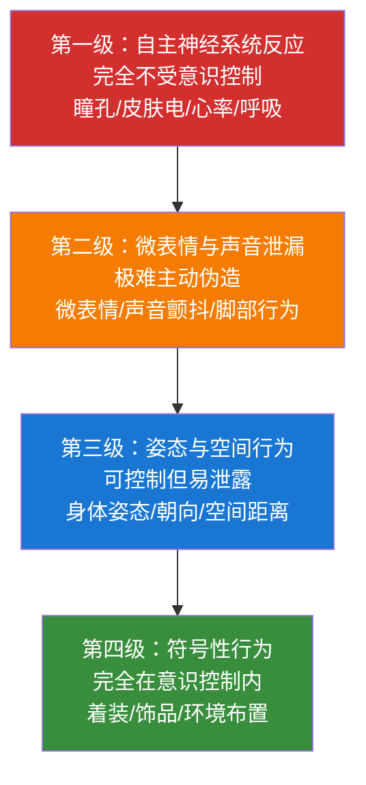
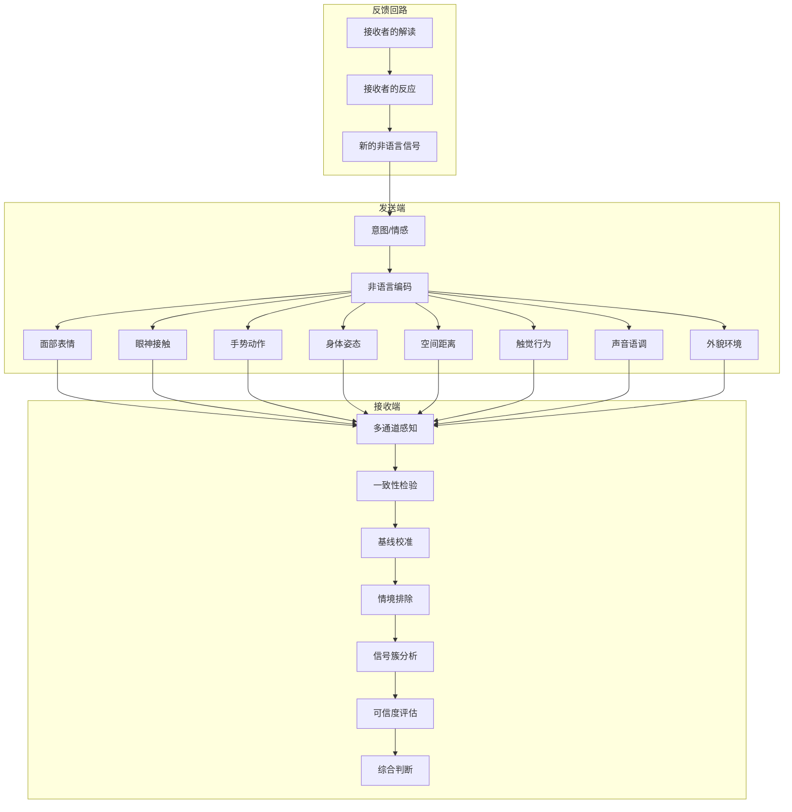

## 本节小结：非语言沟通理论基础全景回顾

本节系统梳理了非语言沟通理论基础的全部内容，从学科渊源到九大要素再到整合框架，为读者构建一张完整的知识地图。这不是简单的"复习提纲"，而是将零散知识点串联成体系的"认知升级"——读完本节后，你应该能够回答三个核心问题：非语言沟通的理论根基是什么？每个要素的核心机制和关键规则是什么？这些要素如何协同运作形成整体判断？

---

### 一、学科渊源：从达尔文到当代神经科学

#### 1.1 一百五十年的研究脉络

非语言沟通的学术研究可以追溯到达尔文 1872 年出版的《人类和动物的表情》（*The Expression of the Emotions in Man and Animals*）。这部开创性著作提出了三个核心观点，至今仍是非语言沟通研究的基石：

- **跨物种连续性**：人类的基本面部表情与灵长类动物存在进化上的连续性，不是后天习得的社会习惯。
- **普遍性假设**：某些表情（快乐、悲伤、恐惧、愤怒、惊讶、厌恶）在所有人类文化中具有相同的含义。
- **功能适应性**：非语言行为最初具有生存适应功能（例如恐惧时的睁大眼睛扩大视野，厌恶时的皱鼻阻隔有害气味）。

从达尔文到 20 世纪中叶，这一领域经历了近 80 年的沉寂。直到 1950-1970 年代，三位关键学者重新点燃了研究热潮：

| 学者 | 贡献 | 核心发现 |
|------|------|---------|
| Ray Birdwhistell（1952） | 创立"运动学"（Kinesics） | 将身体动作分解为可分析的基本单位，类似语言学中的音素 |
| Edward T. Hall（1959） | 创立"空间关系学"（Proxemics） | 人际距离存在四个同心圆区域，受文化和关系双重影响 |
| Paul Ekman（1960s-2000s） | 面部表情跨文化研究 | 验证了达尔文的普遍性假设，建立了 FACS 面部编码系统 |

1980 年代至今，神经科学、进化心理学、人工智能三个领域的介入，将非语言沟通研究推向了新的高度。功能性磁共振成像（fMRI）揭示了大脑处理非语言信号的神经通路；镜像神经元的发现解释了"共情"的生物学基础；计算机视觉和情感计算正在尝试让机器也学会"读懂"人类的非语言信号。

#### 1.2 学科渊源的核心启示

理解这段学术史对实践者有三个关键意义：

1. **非语言沟通不是玄学**：它有 150 年的实证研究积累，每一个理论主张背后都有严格的实验设计和统计验证。
2. **普遍性与文化差异并存**：基本情绪的面部表达是跨文化普遍的，但展示规则（什么时候、对谁、展示多少）是文化特定的。
3. **进化视角解释"为什么"**：理解某个非语言行为的进化起源，比仅仅记住"它意味着什么"更有价值——前者赋予你灵活应对新场景的能力，后者只能让你在教科书覆盖的场景中照本宣科。

---

### 二、九大要素：逐一拆解每个非语言通道

#### 2.1 身体语言（Body Language）

身体语言是所有非语言信号的"母系统"，涵盖身体各部位的动作和姿态组合。核心知识点包括：

- **开放姿态与封闭姿态**：双臂展开、身体面向对方、手掌可见 = 开放（传递信任与接纳）；双臂交叉、身体侧转、手掌隐藏 = 封闭（传递防御与拒绝）。
- **镜像效应**：当两个人关系融洽时，会无意识地模仿对方的身体姿态。这个"同步化"过程由镜像神经元驱动，既是关系良好的结果，也是增进关系的手段——有意识地轻微镜像对方的姿态，可以快速建立亲近感。
- **朝向与角度**：脚尖和躯干的朝向是最可靠的兴趣/回避指标。脚尖指向对方 = 感兴趣或投入；脚尖指向出口 = 想离开。这个信号之所以可靠，是因为大多数人不会刻意控制脚部朝向。

#### 2.2 面部表情（Facial Expressions）

面部是非语言信号最密集的区域——人类面部有 43 块肌肉，可以产生超过 10,000 种不同的表情组合。

- **Ekman 的六种基本情绪**：快乐、悲伤、恐惧、愤怒、惊讶、厌恶——这六种情绪的面部表达在全世界所有文化中（包括从未接触过外部世界的原始部落）都具有相同的模式，是达尔文普遍性假设的直接证据。
- **FACS 面部编码系统**：Ekman 和 Friesen 开发的面部动作编码系统（Facial Action Coding System），将面部肌肉运动分解为 46 个基本动作单元（AU）。每个 AU 对应一组特定的肌肉收缩，例如 AU12（颧大肌收缩）= 嘴角上扬 = 微笑。这套系统使得面部表情的客观量化成为可能，被广泛应用于心理学研究、测谎、动画制作和 AI 情感识别。
- **杜兴微笑与社交微笑**：真正的快乐微笑（杜兴微笑）同时激活颧大肌（嘴角上扬）和眼轮匝肌（眼角出现鱼尾纹），而社交微笑只激活颧大肌。这个区别是判断微笑是否真诚的最可靠指标——大多数人可以有意识地控制嘴角，但无法有意识地收缩眼轮匝肌。
- **表情的持续时间**：真实情绪驱动的表情持续 0.5-4 秒，且有自然的起止过程（逐渐出现、达到峰值、逐渐消退）。如果一个表情出现得太快（"闪现"）、持续得太长（僵硬）、或突然中断（像开关一样），都可能是在伪装。

#### 2.3 眼神接触（Eye Contact）

眼神是人类最强大的非语言通道之一——婴儿在能理解语言之前，就已经通过眼神与照顾者建立情感连接。

- **社交凝视三角区**：在不同社交场景中，人的视线会在面部的三个区域之间移动。亲密场景：双眼到嘴巴之间形成倒三角；社交场景：双眼到前额之间形成正三角；严肃/权威场景：两眼之间的区域和前额正中。
- **凝视的时长与含义**：正常社交对话中，说话时约 40% 的时间保持眼神接触，倾听时约 60-70%。持续超过 3 秒的直视通常会被解读为强烈的兴趣、亲密意图或威胁——具体含义取决于情境和关系。
- **瞳孔反应**：瞳孔放大（副交感神经兴奋）表示兴趣、兴奋或吸引；瞳孔收缩（交感神经兴奋）表示厌恶、威胁感知或认知负荷。瞳孔反应完全不受意识控制，是最可信的非语言信号之一。
- **眨眼频率**：正常状态下每分钟 15-20 次。频率升高通常表示紧张、不适或认知负荷增加；频率降低（凝视）表示高度专注或强烈兴趣。

#### 2.4 手势（Gestures）

手势是语言表达的重要伴奏——研究表明，手势不仅帮助听众理解说话内容，还能帮助说话者组织思维。

- **McNeill 的手势分类**：比喻手势（illustrator，配合语言描绘形状/方向）、节拍手势（beat，配合语言节奏）、隐喻手势（metaphor，用空间表示抽象概念）、指示手势（deictic，指向具体对象）和象征手势（emblem，有明确文化含义，如竖起大拇指）。
- **开放手势与封闭手势**：手掌向上、向外展开 = 诚实、邀请、开放；手指并拢、手掌向下、握拳 = 控制、权威、封闭。
- **自我触摸行为**：触摸颈部、搓手、拉衣角、摸头发——这些自我适应行为（self-adaptors）在紧张、焦虑或不适时会显著增加，是情绪压力的可靠指标。
- **文化差异警告**：同一个手势在不同文化中可能有截然不同的含义。"OK"手势在美国表示"好的"，在巴西是侮辱性手势，在法国可以表示"零"。跨文化场景中，优先使用语言而非手势来避免误解。

#### 2.5 姿态（Posture）

姿态传递的是**身份、态度和情感状态**的长期信号，而非瞬时反应。

- **Mehrabian 的姿态研究**：身体前倾 = 兴趣、投入、积极态度；身体后仰 = 放松、自信或冷漠、回避；身体侧转 = 不感兴趣或准备离开；身体僵硬 = 紧张或正式。
- **姿态的权力信号**：占据更多空间的姿态（双腿分开、手臂展开、身体后仰）传递高权力/高地位信号；收缩空间的姿态（双腿并拢、手臂收拢、身体前倾）传递低权力/低地位信号。Amy Cuddy 的研究（虽然后续有争议）表明，"权力姿态"可能通过影响睾酮和皮质醇水平来增强自信感。
- **姿态同步**：关系融洽的两个人会无意识地同步彼此的姿态（postural synchrony）。这个现象是"行为镜像"的更深层表现——不仅反映了关系质量，还能通过有意识地同步对方的姿态来增进信任。

#### 2.6 空间距离（Proxemics）

Edward T. Hall 在 1959 年提出的四区域模型至今仍是空间关系学的基础框架：

| 区域 | 距离范围 | 适用关系 | 典型场景 |
|------|---------|---------|---------|
| 亲密距离 | 0-45cm | 亲密伴侣、家人、极亲密朋友 | 拥抱、耳语、亲密接触 |
| 个人距离 | 45-120cm | 好友、熟人 | 朋友聊天、日常社交 |
| 社交距离 | 1.2-3.6m | 同事、商业伙伴、陌生人 | 商务会议、正式社交 |
| 公共距离 | 3.6m以上 | 公众人物、演讲者 | 公开演讲、舞台表演 |

空间距离的核心规则：

- **文化是最大的调节变量**：拉丁美洲、中东、南欧文化倾向更近的社交距离；北欧、东亚、北美文化倾向更远的社交距离。一个巴西人在商务会议中保持 40cm 的距离是正常的社交行为，同样的距离可能让一个芬兰人感到不安。
- **权力与距离的关系**：通常情况下，高权力者可以主动缩短距离（走进下属的办公区域），而低权力者缩短距离会被视为越界。老板可以走到你桌前说话，但你走进老板的办公室需要敲门。
- **空间侵犯的反应**：当个人空间被侵犯时，人们会采取补偿行为——身体后仰、转移视线、交叉双臂、侧转身体——这些行为是恢复心理舒适距离的无意识努力。

#### 2.7 触觉沟通（Haptics）

触觉是人类最原始的沟通通道——婴儿在能看见和听见之前，就已经通过触摸与世界互动。

- **触觉的六种功能**：积极情感表达（拥抱、拍背）、游戏/调情（轻触手臂、打闹）、控制/引导（推、拉、指方向）、仪式性接触（握手、击掌）、任务性接触（传递物品、医疗检查）、混合功能。
- **触觉的权力动态**：主动发起触碰的一方通常被感知为更有权力和地位。Henley（1977）的研究发现，在自然情境中，高地位者触碰低地位者的频率显著高于反向触碰。
- **触觉的"黄金三角"**：安全的社交触碰区域是手臂外侧（从肩膀到手肘），这个区域在大多数文化中都是可以被不太熟悉的人触碰的。向手肘以下延伸通常暗示更亲密的关系，而触碰躯干、面部或腿部则需要更近的关系基础。
- **触觉的免疫效应**：Tiffany Field 的研究表明，适当的触觉刺激（如按摩）能降低皮质醇水平、增加血清素和多巴胺分泌，直接改善情绪和免疫功能。

#### 2.8 声音语调（Paralanguage）

"怎么说"往往比"说了什么"更能传递真实信息。声音语调（也称副语言）涵盖语言内容之外的所有声音特征。

- **语调（Intonation）**：升调通常传递疑问、不确定或邀请回应的信号；降调传递确定性、权威和结束对话的信号。
- **语速（Speech Rate）**：正常对话的语速约为每分钟 120-160 个中文字。语速加快通常表示紧张、兴奋或试图抢占话语权；语速放慢通常表示强调、严肃或试图控制节奏。
- **音量（Volume）**：音量的突然变化是情绪变化的可靠指标——突然压低声音通常比突然提高音量更能吸引注意力（"耳语效应"）。
- **声音颤抖与破音**：声带微小肌肉群在强烈情绪下的不自主收缩会导致声音颤抖或突然破音，这些信号极难被意识控制，是情绪压力的可靠指标。
- **沉默的力量**：有策略的沉默（2-3 秒的停顿）比任何语言都更有力量。它传递自信、制造悬念、给对方消化信息的空间、暗示"我期待你回应"。

#### 2.9 外貌与环境（Appearance & Environment）

外貌和环境是非语言信号中"第四级"——完全在意识控制范围内，但正因为如此，它们传递的是**刻意选择的信息**。

- **第一印象的时间窗口**：研究表明，人们在 7-30 秒内就会对陌生人形成第一印象，而外貌占第一印象影响权重的 55% 以上。这个印象一旦形成，需要 8-12 次正面接触才能改变。
- **着装的认知效应**："着装认知"（enclothed cognition）研究表明，着装不仅影响他人对你的看法，还会影响你自己的认知和行为。穿正装的人在谈判中表现出更强的抽象思维能力和更坚定的立场。
- **环境的空间语言**：办公室的布局、座位安排、墙上挂的装饰——这些环境元素构成"第三层非语言信号"，无声地传递权力结构、组织文化和个人价值观。面谈时坐在桌子对面 vs. 坐在同一个拐角，会产生截然不同的互动动力学。

---

### 三、整合框架：从碎片到系统的认知升级

#### 3.1 一致性原则（Congruence Principle）

一致性是非语言沟通的第一定律。当所有非语言通道传递的信息方向一致时，沟通的说服力和可信度呈指数级增长；当通道之间出现矛盾时，接收者的信任度急剧下降。

Mehrabian 的 7-38-55 法则揭示了语言与非语言冲突时的权重分配：语言内容 7%，声音语调 38%，面部表情与肢体语言 55%。需要强调的是，这个比例严格适用于**态度和情感传递场景**，不适用于事实信息传递。但它揭示了一个深层规律——在涉及信任、情感和说服力的沟通中，非语言信号的影响力远超语言内容。

大脑处理非语言信息的速度远快于语言信息：杏仁核在 200 毫秒内就能对威胁性面部表情做出反应，而语言理解至少需要 400-600 毫秒。这意味着当你还在分析对方"说了什么"的时候，你的身体已经对对方"怎么做的"做出了判断。

#### 3.2 可信度层级模型

不同非语言信号的可信度存在显著差异。核心逻辑是：**越难被意识控制的信号，越能反映真实内心状态。**

当怀疑对方言行不一时，优先观察第一级和第二级信号。在商务谈判中，对方嘴上说"这个价格很满意"，但瞳孔微微收缩（第一级）、双手不自觉地合拢在胸前形成屏障（第三级），这些信号比语言更值得采信。

#### 3.3 基线行为：个体差异的校准器

非语言信号的解读从来不是"看到X就意味着Y"的绝对公式，而是"看到X**偏离了这个人的正常基线**，意味着可能发生了Y"的相对判断。

- 张三平常语速就很快，谈判时语速依然快——这是正常状态，不能解读为紧张。
- 李四平常语速缓慢平稳，谈判时突然语速加快——这才是需要关注的偏离信号。

建立基线行为档案需要三步：（1）在中性场景中观察 5-10 分钟，记录语速、音量、眼神、姿态等维度的默认状态；（2）在 3-5 次不同场景中反复验证；（3）在后续互动中捕捉偏离基线的行为。

基线行为的局限：文化环境变化、伪装基线、疲劳/疾病/药物等因素都会使基线失效。

#### 3.4 信号簇原则：从碎片到拼图

单一的非语言信号几乎从不构成可靠判断的充分依据——同一个行为可能有 3-5 种完全不同的解释。双臂交叉可能是防御、寒冷、舒适习惯或模仿。

信号簇原则要求：**至少 3 个以上独立通道的信号共同指向同一个结论时，才能形成可靠判断。** 例如，判断对方是否想结束对话：身体后仰 + 频繁看表/看门口 + 脚尖指向出口 + 回答变简短不再提问 + 开始整理物品——这个信号簇几乎可以确定对方想离开。

#### 3.5 情境依赖与系统整合

任何非语言信号都嵌入在具体情境中。同一行为在不同情境中含义不同：在葬礼上低头沉默是悲伤，在考试中低头沉默是专注。解读非语言信号之前，必须先排除情境变量（温度、环境噪音、文化规范、时间压力、健康状况）。

将所有要素整合为一个系统模型：

这个模型的三个核心特性：（1）多通道并行——8 个通道同时运作；（2）层级过滤——五层过滤逐步提炼可靠判断；（3）动态反馈——你的解读影响你的反应，你的反应创造新信号，对方又会解读这些信号。你不是在"读"一个固定对象，而是在参与一个不断变化的系统。

---

### 四、常见误读与能力边界

#### 4.1 五大误读模式

| 误读模式 | 典型表现 | 纠正方法 |
|----------|---------|---------|
| 一个行为=一个含义 | 看到交叉双臂就判断"他在防御" | 必须观察信号簇，单一行为有 3-5 种可能解释 |
| 我的标准适用所有人 | 用自己的行为模式衡量他人 | 先建立对方的个体基线，再判断偏离 |
| 非语言信号能精确读心 | 试图判断对方在"想什么" | 非语言信号只能反映情绪状态和态度倾向，不能揭示具体思想内容 |
| 我的解读一定正确 | 对自己的判断过度自信 | 非语言解读是概率性假设（70-85% 准确率），不是确定性事实 |
| 忽略自己的输出 | 全神贯注"读"对方，忽略自己在"说"什么 | 你的非语言输出会影响对方的状态，先管理好自己 |

#### 4.2 能力边界：不能做什么

- **精确测谎**：最优秀的专业测谎人员在实验室条件下的准确率约为 70-80%，普通人约为 54%（接近随机猜测）。没有任何单一信号或信号组合能以 100% 准确率判断谎言。
- **读取具体想法**：能判断对方"不舒服"，但不能判断"是因为价格不舒服还是因为时间不舒服"。
- **跨情境泛化**：在一种场景下学到的解读规则不能直接搬到另一种场景。
- **对训练有素者的解读**：演员、特工、专业谈判手可以有意识地控制大多数非语言信号。

#### 4.3 伦理边界：不应该做什么

- **操控他人**：利用对他人情绪状态的精确感知来操纵决策。
- **未经同意的"读心"**：在私人社交场合过度分析朋友或伴侣的非语言行为。
- **伪科学传播**：将非语言沟通包装成"读心术"来误导公众或牟利。

正确的伦理定位：非语言沟通能力的目的是**增进理解和连接**，而不是操控和利用。

---

### 五、九大要素速查对照表

下表汇总了非语言沟通九大要素的核心要点，便于快速查阅和对比：

| 要素 | 核心信号 | 最可靠指标 | 文化敏感度 | 可控程度 |
|------|---------|-----------|-----------|---------|
| 身体语言 | 开放/封闭姿态 | 朝向（脚尖方向） | 中 | 中 |
| 面部表情 | 六种基本情绪 | 杜兴微笑（眼角鱼尾纹） | 低（基本情绪普遍） | 中高 |
| 眼神接触 | 凝视时长与瞳孔反应 | 瞳孔放大/收缩 | 高（凝视规范因文化差异巨大） | 低（瞳孔不可控） |
| 手势 | 开放/封闭手势 | 象征手势的文化含义 | 极高 | 高 |
| 姿态 | 前倾/后仰/侧转 | 长时间互动中的自然回归 | 低 | 中 |
| 空间距离 | 四个距离区域 | 主动靠近或远离 | 极高 | 中 |
| 触觉 | 触碰频率与部位 | 自我触摸（压力指标） | 极高 | 中 |
| 声音语调 | 语速/音量/语调 | 声音颤抖与破音 | 中 | 中低 |
| 外貌环境 | 着装/环境布置 | 第一印象的时间窗口 | 高 | 高 |

---

### 六、从理论到实践的行动指南

理论学习的最终目的是转化为实践能力。以下是将本节理论基础转化为日常实践的行动框架：

#### 6.1 自我觉察训练（第一步，也是最重要的一步）

在试图"读懂"他人之前，先学会"读懂"自己：

- **非语言日记**：每天记录 2-3 个自己在特定场景中的非语言行为（紧张时做了什么？兴奋时做了什么？），持续 2 周建立自己的行为基线。
- **视频回看**：录制自己在对话或演讲中的表现，关掉声音只看画面，观察自己的姿态、手势、面部表情——大多数人第一次看到自己的"无声视频"时会感到惊讶。
- **声音回听**：录制自己的对话或发言，专注听语速、音量、语调变化、填充词（"嗯""那个"）的使用频率。

#### 6.2 观察力训练（从被动接收到主动觉察）

- **无声观影**：看一部没看过的电影或剧集，关掉声音只看画面，尝试通过表情、姿态、眼神推断角色的情感状态和关系动态。
- **公共场所观察**：在咖啡厅、地铁、公园等公共场所，观察陌生人之间的互动，尝试推断他们的关系（同事？情侣？初次见面？）和情感状态。
- **信号簇练习**：在日常对话中，刻意练习同时关注 3 个以上通道的信号——不要只看脸，同时注意手、脚、身体朝向和声音。

#### 6.3 一致性管理（让所有通道传递统一信息）

在面试、演讲、谈判、约会等重要场景之前，使用一致性构建清单逐一检查：

1. 我的面部表情是否与我想要传递的情感一致？
2. 我的眼神接触是否传递出自信和重视？
3. 我的姿态是开放的还是封闭的？
4. 我的手势是否配合内容还是分散注意力？
5. 我的语调、语速、音量是否与内容匹配？
6. 我与对方的距离是否符合当前关系和场景？
7. 我的着装是否与场景和想传递的形象一致？

#### 6.4 持续精进路径

| 阶段 | 目标 | 核心训练 | 预期时间 |
|------|------|---------|---------|
| 入门 | 建立自我觉察 | 非语言日记、视频回看 | 2-4 周 |
| 基础 | 读懂基本信号 | 学习六种基本情绪、识别信号簇 | 1-3 个月 |
| 进阶 | 场景化应用 | 面试/谈判/演讲的非语言策略 | 3-6 个月 |
| 精通 | 双向控制 | 管理自己输出的同时解读他人输入 | 6-12 个月 |

---

### 七、核心记忆框架

为了帮助读者在实际场景中快速调用理论知识，以下是五个最值得牢记的核心原则：

1. **一致性 > 完美性**：与其在某个单一通道上做到完美（比如练就完美的微笑），不如确保所有通道传递一致的信息。一致性缺失是信任崩塌的最快途径。

2. **信号簇 > 单一信号**：永远不要根据一个行为下结论。至少等待 3 个以上独立通道的信号指向同一方向，才形成判断。

3. **基线先于解读**：不建立个体基线就解读行为，等于用一把没有刻度的尺子测量——结果毫无意义。

4. **低层级信号 > 高层级信号**：当通道间出现矛盾时，优先采信更难被意识控制的信号（瞳孔 > 微表情 > 姿态 > 着装）。

5. **你自己也在"说话"**：在全神贯注解读他人之前，先检查自己的非语言输出是否在制造偏差。

---

在下一节中，我们将进入非语言沟通的核心技巧部分，探讨如何将这些理论知识转化为可执行的实战能力——从自我觉察的建立，到自信形象的塑造，再到不同场景下的非语言策略应用。
