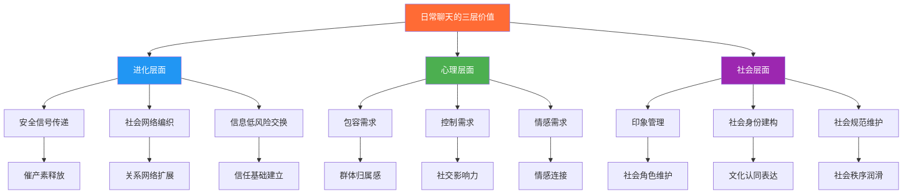
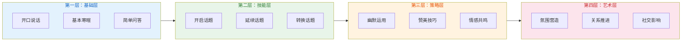
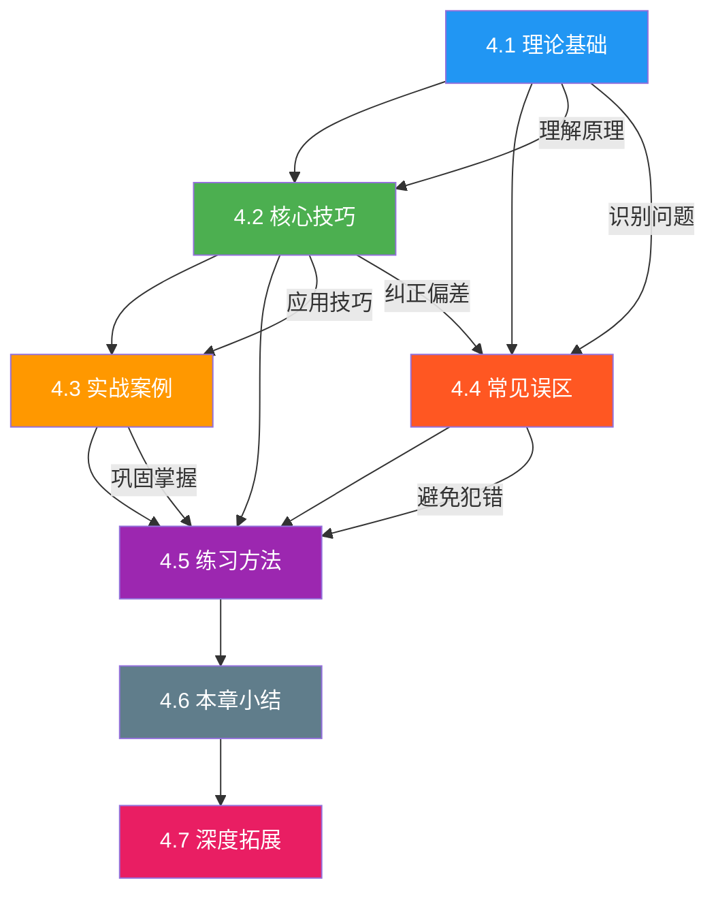
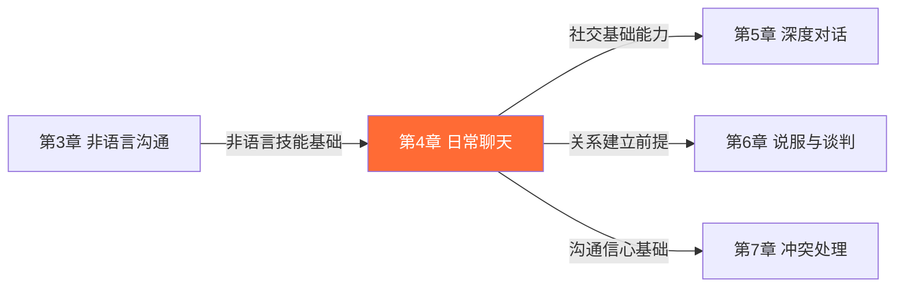

# 第四章 日常聊天

> "人类是一种无法忍受沉默的生物，而正是这种无法忍受，催生了人类最伟大的社交发明——闲聊。" ——语言学家 Robin Dunbar

## 章节概览

### 为什么日常聊天如此重要

在所有沟通形式中，日常聊天可能是最被低估的一种。许多人认为闲聊不过是"没话找话"，是浪费时间的社交仪式。然而，事实恰恰相反——日常聊天是人类社会关系的基石，是建立信任、维系情感、拓展人脉的核心能力。

这种低估造成了一个普遍的困境：很多人在正式汇报、演讲或商务谈判中表现出色，却在电梯里遇到同事时手足无措；能在会议上侃侃而谈，却在聚会上找不到话题；能写出漂亮的邮件，却不知道如何在微信上自然地开启一段对话。这种"正式沟通强、日常聊天弱"的不对称能力，在社交生活中制造了大量的尴尬和遗憾。

要理解为什么日常聊天如此重要，我们需要从三个层面来认识它。

#### 一、进化层面：闲聊是人类生存的底层技能

闲聊并非现代社会的产物，而是深深根植于人类进化历史中的社交行为。牛津大学进化心理学家 Robin Dunbar 的研究揭示了一个关键发现：灵长类动物通过互相梳理毛发来建立和维护社会关系，而人类则用语言取代了毛发梳理的功能。Dunbar 指出，人类的社交群体规模（约150人，即"Dunbar数"）远大于其他灵长类动物，仅靠身体接触无法维系如此庞大的关系网络，因此语言——尤其是闲聊——成为了人类维系社会关系的核心工具。

从神经科学的角度来看，功能性磁共振成像（fMRI）研究显示，当人们进行闲聊时，大脑中的默认模式网络（Default Mode Network, DMN）会被激活。这个网络在社会认知、共情和自我参照思维中扮演关键角色。换言之，闲聊不是大脑的"空转"，而是一种高度活跃的社交认知过程。

进化心理学认为闲聊至少承载三重生存功能：

| 功能 | 进化起源 | 现代表现 | 神经机制 |
|------|---------|---------|---------|
| 安全信号传递 | 远古部落相遇时降低冲突风险 | 初次见面的寒暄和闲谈 | 催产素释放，降低杏仁核警觉 |
| 社会网络编织 | 维护部落成员间的联盟关系 | 日常关系的维护和更新 | 奖赏回路激活，产生社交愉悦 |
| 信息低风险交换 | 在不暴露弱点的情况下试探信息 | 通过闲聊了解他人的态度和立场 | 前额叶皮层参与社会信息加工 |

#### 二、心理层面：闲聊满足人类的核心心理需求

根据美国心理学家 William Schutz 的人际需求理论，人类有三种基本的社交需求：包容需求（inclusion）、控制需求（control）和情感需求（affection）。日常聊天恰好是满足这三种需求的最低门槛方式。

**包容需求**——通过闲聊，人们确认自己属于某个社交群体。当同事在茶水间和你聊天、邻居在小区里和你打招呼，这些看似微不足道的互动，都在传递一个信号："你是这个群体的一员。"心理学研究表明，被排斥在闲聊之外（如被忽视、被排除在群聊之外）会激活与身体疼痛相同的脑区——前扣带皮层（ACC），这说明社交排斥的"心痛"并非比喻，而是真实的神经反应。

**控制需求**——在闲聊中，人们通过话题选择、话语权的分配来建立和维持社会地位。能够引导话题方向、让他人倾听并回应的人，往往在社交中拥有更大的影响力。这解释了为什么"会聊天"的人往往在职场和社交中更受欢迎——他们通过日常聊天积累了社交影响力。

**情感需求**——闲聊是人们表达关心、传递善意、建立情感连接的主要途径。心理学家 John Gottman 对婚姻关系的长期研究发现，幸福婚姻中的伴侣每天会有大量"情感投标"（emotional bids）——那些看似随意的闲聊，如"今天工作怎么样？""你看这个新闻了吗？"——而伴侣是否"转向"（turning toward）这些投标，是预测婚姻质量的最强指标之一。

#### 三、社会层面：闲聊是社会运转的润滑剂

从社会学的角度来看，社会学家 Erving Goffman 在其经典著作《日常生活中的自我呈现》中提出了"印象管理"理论，指出人们在社交互动中始终在进行"表演"，而闲聊是这种表演的最基本形式。通过闲聊，人们维护自己的社会角色、管理他人对自己的印象、确认社会规范。

社会语言学家 Peter Trudgill 的研究进一步表明，闲聊是语言变化和社会身份建构的重要载体。人们通过口音、用词、话题选择来表达自己的社会身份和群体归属。在英国，人们通过讨论天气来传递"我是有教养的英国人"的身份信号；在中国，人们通过问"吃了吗"来传递"我关心你"的社交信号。

哈佛大学的一项大规模研究（2018年发表于《Psychological Science》）追踪了超过300名参与者的日常对话模式，发现人们每天约有三分之二的对话属于闲聊范畴。更重要的是，研究发现闲聊频率与主观幸福感呈正相关——那些每天有更多闲聊互动的人，报告了更高的生活满意度和更低的孤独感。

### 日常聊天的能力模型

在深入学习之前，你需要了解日常聊天的完整能力模型。这个模型将帮助你定位自己当前的水平，并明确努力的方向。

| 层级 | 能力描述 | 典型表现 | 通过本章的学习你将 |
|------|---------|---------|-------------------|
| **第一层：基础层** | 能够开口说话，完成基本的社交寒暄 | 能说"你好"、"最近怎么样"，但对话经常冷场 | 理解为什么寒暄有意义，不再抗拒基本社交 |
| **第二层：技能层** | 掌握话题管理的核心技能 | 能找到话题、能接住话、能在需要时切换话题 | 形成完整的话题管理能力链 |
| **第三层：策略层** | 能运用幽默、赞美和共情提升聊天质量 | 聊天内容生动有趣，能让对方感到愉快 | 在合适的时机使用合适的策略 |
| **第四层：艺术层** | 能营造氛围、推进关系、影响他人 | 每次聊天都让人意犹未尽，社交影响力强 | 掌握高级技巧，向聊天艺术迈进 |

#### 自测：你目前的日常聊天水平如何？

在阅读本章内容之前，花五分钟时间诚实地回答以下问题。你的回答不需要告诉任何人，但它们将帮助你在学习过程中聚焦于自己最需要提升的部分。

**场景一：电梯偶遇**
你走进电梯，发现只有你和一位不太熟悉的同事。对方礼貌地点了点头。接下来的30秒，你会：
- A. 假装看手机，避免尴尬
- B. 点头回应，然后沉默到电梯到达
- C. 简单寒暄几句，如"今天挺早的"
- D. 自然地开启一个轻松的话题

**场景二：聚会社交**
你参加一个朋友的聚会，现场有一半人你不认识。当大家开始聊天时，你会：
- A. 只和认识的人待在一起
- B. 被动地等待别人来搭话
- C. 主动自我介绍，但不知道聊什么
- D. 自然地融入不同圈子，和不同的人聊天

**场景三：微信群聊**
你被拉进一个新的微信群，群里有同事、朋友和一些你不认识的人。有人发了一条消息，你会：
- A. 潜水看别人聊
- B. 只在被@时才回复
- C. 想回但不知道说什么
- D. 自然地参与讨论，发表自己的看法

**场景四：相亲场合**
你和一位初次见面的对象坐下来聊天。对方点完餐后看着你，空气突然安静。你会：
- A. 紧张地搓手，不知道说什么
- B. 开始像面试一样提问
- C. 找一些安全话题，但聊几句就冷了
- D. 从眼前的事物入手，自然地展开对话

**评分标准：**
- 主要选A：你在基础层，需要从克服社交焦虑和建立基本社交信心开始
- 主要选B：你在基础层向技能层过渡，需要学习主动开启对话的方法
- 主要选C：你在技能层，需要系统掌握话题管理的核心技巧
- 主要选D：你在策略层或以上，可以重点关注高级技巧和场景应用

无论你的自测结果如何，本章都将为你提供一条清晰的提升路径。日常聊天是一项可以通过系统学习和刻意练习来提升的技能，而非与生俱来的天赋。

### 本章的核心理念

本章将从四个维度系统阐述日常聊天的艺术，每个维度对应一个核心问题：

**第一，理解本质——"为什么人类需要闲聊？"**

我们将深入探讨闲聊的社会功能与心理机制。你将了解到，闲聊不是沟通的"低级形式"，而是一种高度复杂的社交智慧。Malinowski的"寒暄交流"理论、Dunbar的"社交梳理"假说、Goffman的"印象管理"框架——这些经典理论将帮助你从根本上理解日常聊天的价值和意义。

这个部分的学习价值在于：许多人之所以不擅长或不愿意进行日常聊天，是因为他们从根本上误解了闲聊的本质。当你真正理解了闲聊的深层功能后，你会发自内心地重视它，而这种重视是所有技巧提升的前提。

**第二，掌握技巧——"如何把聊天聊好？"**

我们将系统讲解五个核心技能：开启话题、延续话题、转换话题、幽默运用和赞美技巧。每个技能都将从心理机制、具体方法、实操案例三个层面展开，确保你不仅知道"怎么做"，还知道"为什么这样做"以及"在什么情况下这样做"。

例如，开启话题不仅仅是说一句"你好"——它涉及对环境的观察、对对方状态的判断、对社交情境的评估。我们将拆解这个看似简单的行为背后的完整决策过程。

**第三，场景应用——"在不同场合下如何灵活应对？"**

通过八个真实生活场景的详细案例分析，你将看到这些技巧如何在不同情境中发挥作用。从初次见面到同事闲聊，从相亲场合到微信群聊，从电梯偶遇到邻居碰面，每个场景都有其独特的社交规则和沟通策略。

我们不会只给你"标准答案"，而是会展示同一个场景下的不同应对方式，分析每种方式的效果和适用条件。这样，你获得的不是机械的模板，而是灵活应对的思维框架。

**第四，避开误区——"为什么我明明知道方法却还是聊不好？"**

日常聊天中存在许多反直觉的陷阱：你以为自己在"倾听"，实际上在"等待发言"；你以为自己在"幽默"，实际上在"冒犯"；你以为自己在"关心"，实际上在"审问"。我们将揭示日常聊天中最常见的十个误区，帮助你识别并改正那些阻碍你成为聊天高手的不良习惯。

误区纠正的价值往往大于新技巧的学习——很多人的聊天能力停滞不前，不是因为缺少技巧，而是因为存在未被察觉的错误模式。

### 本章的知识地图

下图展示了本章各节之间的逻辑关系。理论基础为后续所有内容提供底层支撑，核心技巧是实操工具箱，实战案例是技巧的场景化应用，常见误区帮你排除障碍，练习方法帮助你将知识转化为能力，深度拓展则为已经掌握基础的读者提供进阶路径。

### 本章的学习目标

通过本章的学习，你将达成以下五个核心目标。每个目标都对应着明确的能力指标，你可以用这些指标来检验自己的学习成果：

**目标一：理解闲聊的深层逻辑**

你将认识到日常聊天不仅是信息交换，更是情感连接和社会关系的维护机制。你能用自己的语言解释"为什么人类需要闲聊"、"闲聊如何建立信任"、"为什么只在有事时才联系的关系往往不牢固"。这种理解将从根本上改变你对待日常聊天的态度——从"应付"变为"重视"。

**目标二：掌握话题管理的完整技能链**

从开启话题到延续话题，从转换话题到优雅收尾，你将形成完整的聊天能力闭环。你能根据不同的社交场景和对象，选择合适的开场方式、延续策略和话题转换技巧。这个技能链的关键在于"完整性"——很多人只掌握了其中一两个环节（比如会开场但不会延续），导致对话经常在某个节点卡住。

**目标三：灵活运用幽默与赞美**

你将学会在合适的时机使用恰当的幽默和真诚的赞美，让聊天更加生动有趣。你将理解幽默的心理机制（为什么某些话好笑）、赞美的黄金法则（什么让赞美从"恭维"变为"真诚"），以及这两种技巧的常见误用方式。

**目标四：应对多样化社交场景**

无论是正式场合还是随意闲聊，无论是面对面还是线上文字聊天，你都能从容应对。八个实战场景将为你提供"社交脚本"的参考框架，让你在真实社交中不再手足无措。更重要的是，你将学会"即兴应变"——当脚本不适用时，如何快速调整策略。

**目标五：识别并改正聊天误区**

通过自我觉察，你将改掉那些无意中破坏聊天氛围的坏习惯。这些误区往往是你在多年社交中无意养成的，它们像"社交暗礁"一样，你可能根本意识不到它们的存在，但它们却在暗中损害你的社交效果。识别并消除这些暗礁，是聊天能力提升的关键突破口。

### 本章结构

| 节次 | 标题 | 核心内容 | 关键词 | 建议时长 |
|------|------|---------|--------|---------|
| 4.1 | 理论基础 | 闲聊的本质与进化根源、社交货币的五种类型、话题选择的原则与清单、聊天节奏的四个维度 | 底层逻辑、社交货币、节奏感 | 45分钟 |
| 4.2 | 核心技巧 | 开启话题的五种方法、延续话题的六种技巧、转换话题的五种方式、幽默运用的四个层次、赞美的黄金法则 | 开场、延续、转换、幽默、赞美 | 60分钟 |
| 4.3 | 实战案例 | 初次见面、同事闲聊、朋友聚会、相亲场合、微信群聊、电梯偶遇、排队等候、邻居碰面 | 八大场景、真实案例、对话分析 | 50分钟 |
| 4.4 | 常见误区 | 十大聊天误区的识别与纠正：过度自我中心、虚假赞美、审问式提问、话题终结者等 | 误区识别、行为纠正 | 30分钟 |
| 4.5 | 练习方法 | 系统化的日常练习方案：从刻意练习到自然习惯的转化路径 | 练习计划、习惯养成 | 25分钟 |
| 4.6 | 本章小结 | 核心要点回顾、行动清单、下一步学习建议 | 总结回顾、行动指南 | 15分钟 |
| 4.7 | 深度拓展 | 微表情与闲聊、跨文化闲聊差异、数字时代的聊天新规则、从闲聊到深度关系 | 进阶知识、前沿视角 | 35分钟 |

### 本章与全书的关系

在沟通表达的整体知识体系中，日常聊天占据着承上启下的关键位置：

- **承接前文**：第三章学习的非语言沟通（表情、肢体语言、声音语调）是日常聊天的"硬件基础"。你在聊天中的微笑、点头、眼神接触、语调变化，都在无声地传递社交信号。如果你跳过了第三章，建议先回顾其中关于"倾听中的非语言技巧"和"第一印象管理"的内容。
- **构建核心**：本章是全书的实战核心章节。前面的章节为你提供了沟通的理论基础和非语言工具，本章将这些知识整合为可直接应用的聊天技能。
- **服务后文**：后续章节将讨论更复杂的沟通场景（深度对话、说服谈判、冲突处理等），而这些场景都需要以良好的日常聊天能力为"地基"。一个连基本寒暄都做不好的人，很难在更高级的沟通场景中表现出色。

### 阅读建议

本章内容丰富（总计约28,000字），建议采用分层阅读策略，根据你的时间和需求选择合适的深度：

#### 策略一：快速通读型（2小时）

适合：时间紧张，希望快速建立整体框架的读者。

**操作步骤：**
1. 仔细阅读本章概览（当前文件），建立对全章的整体认知
2. 阅读4.1理论基础中的"闲聊的本质"和"社交货币"两节，理解底层逻辑
3. 浏览4.2核心技巧中每个技巧的"方法概述"部分，了解技巧清单
4. 选择4.3实战案例中与你最相关的2-3个场景，精读对话分析
5. 阅读4.6本章小结，回顾核心要点

#### 策略二：系统学习型（4小时）

适合：希望系统提升聊天能力，愿意投入时间深入学习的读者。

**操作步骤：**
1. 从头到尾按顺序阅读全部内容
2. 在每个核心技巧部分，暂停并尝试用自己的话复述要点
3. 对照4.3实战案例中的场景，回忆自己在类似场合的表现
4. 完成4.4常见误区部分的自我对照检查
5. 根据4.5练习方法，制定个人的练习计划

#### 策略三：刻意练习型（1周）

适合：不仅想学习知识，更想通过刻意练习将知识转化为能力的读者。

**操作步骤：**
1. 前两天：精读4.1理论基础和4.2核心技巧，做好笔记
2. 第三天：精读4.3实战案例，在每个场景后写下"如果是我，我会怎么说"
3. 第四天：精读4.4常见误区，进行自我对照检查，列出自己的"误区清单"
4. 第五至七天：按照4.5练习方法，每天选择一个技巧进行刻意练习
5. 每天晚上：回顾当天的练习，记录"做得好的"和"需要改进的"

无论选择哪种策略，请记住一个核心原则：**聊天能力的提升不在于读了多少理论，而在于你实际与人交流了多少次。** 本章的每一个技巧和案例，都值得你在真实生活中反复练习和验证。读完一节后，当天就找机会用上其中的技巧——哪怕只是一次简单的环境观察法开场，都比读完整章却不去实践要有效得多。

---

**准备好了吗？让我们从4.1理论基础开始，探索日常聊天背后的科学与艺术。**
