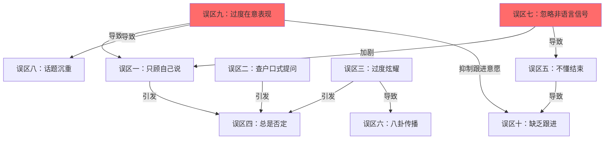

# 4.4 常见误区：阻碍你成为聊天高手的十大陷阱

聊天能力的提升，不仅要知道"该怎么做"，更要清楚"不该怎么做"。很多人明明学了不少沟通技巧，却始终无法建立良好的社交关系，根本原因往往不是缺少正确方法，而是被错误习惯拖了后腿。

本节系统梳理日常聊天中最常见的十大误区。每个误区都会从**表现特征、心理机制、真实案例、分级纠正方案**四个维度展开，帮助你精准识别自身问题并找到切实可行的改进路径。

> **阅读建议**：先通读全文，用最后的自查清单定位自己的主要误区，然后针对最突出的2-3个误区重点练习。同时改善太多习惯反而容易顾此失彼。

---

## 误区一：只顾自己说，不听对方讲

这是所有聊天误区中最普遍、也最容易被忽视的一个。很多人自认为"健谈"，实际上只是"能说"，而"能说"和"会聊"之间隔着一条叫做"倾听"的鸿沟。

### 表现特征

- 对方刚开口，就急着打断并转移到自己的话题上
- 对方分享经历时，心不在焉，只想着自己接下来要说什么
- 不断地"我也是"、"我之前"，把每个话题都拉回到自己身上
- 对方的话还没说完，就开始发表自己的观点
- 对方说了一大段，你的回应只有一句"嗯"然后马上接自己的故事
- 群聊中，别人讨论的话题你不关心，直接跳转到自己想说的内容

### 心理机制

心理学家Carl Rogers在"以人为中心疗法"中提出，**被倾听是人类最基本的心理需求之一**。当一个人感到被真正听见时，大脑会释放催产素（oxytocin），产生信任感和亲近感。反之，当感到被忽视时，大脑的杏仁核会被激活，产生防御反应。

哈佛大学2012年发表在《Psychological Science》上的研究发现，在对话中让对方说得更多的人，会被评价为"更受欢迎"和"更有亲和力"。研究者分析了超过300段初次对话，发现**倾听时间占比在60%-70%之间的对话者获得的好感度最高**。

还有一个被广泛引用的数据：一般人只能在对话中保持约17-20秒的专注倾听，之后就会开始想自己的回应。这个"17秒法则"解释了为什么大多数人都在"假装听"——他们在等对方说完，好轮到自己。

### 真实案例

> **错误示范**：
> - 小张："我上周末去爬了黄山，风景特别美！"
> - 小李："哦黄山啊，我之前去过泰山，那次可有意思了，我们凌晨三点就开始爬……"（立刻转到自己的经历）
>
> **正确示范**：
> - 小张："我上周末去爬了黄山，风景特别美！"
> - 小李："黄山！一直想去。你走了哪条线路？最震撼的是哪个景点？"
> - 小张："我们走的前山线路，日出的时候云海翻涌，真的太震撼了。"
> - 小李："云海日出，这个组合确实绝了。你之前有爬山的经验吗？体力跟得上？"（自然延伸，表达关心）

### 分级纠正方案

**入门级——建立倾听意识**

- **"80/20法则"**：让对方说80%的时间，自己说20%。初期可以用手机计时器自我监控，连续练习一周
- **"回应三步法"**：听完对方的话后，按"复述关键词 → 表达感受 → 提出问题"的顺序回应。例如："你说黄山云海很震撼（复述），光听你描述就觉得很壮观（感受），当时有拍照吗？（问题）"
- **设置"倾听提醒"**：对话开始前在心里默念"这次我要多听少说"，把注意力放在对方身上

**进阶级——深度倾听技巧**

- **"情绪标注"**：不只听内容，更要听情绪。"听起来你当时特别兴奋"比"哦是吗"有效十倍
- **"隐含需求捕捉"**：对方说"最近工作好累"，可能不只是陈述事实，而是需要倾诉或安慰。回应"是项目压力大还是人际关系？"比"我也是"更能打开话题
- **"关键词追问法"**：对方的话里提到任何一个有故事感的关键词，都可以追问。"你说'那次可惊险了'——发生了什么？"

**精通级——让对方感到被"完全理解"**

- **"映射式倾听"**：不仅复述对方说的内容，还表达出对方没说出口的感受。"你说项目延期了，听起来不只是进度的问题，更多是觉得自己的努力没被认可？"
- **"节奏匹配"**：对方说话快，你的回应也跟上节奏；对方在讲沉重的事，你的语速和语调也要配合
- **"记住并回访"**：下次见面时主动提起上次的话题——"上次你说在准备那个方案，后来怎么样了？"这种被记住的感觉是建立深度信任的最强信号

---

## 误区二：查户口式提问

"你是哪里人？做什么工作的？结婚了吗？一个月挣多少？"——如果你的聊天开场白长这样，恭喜你，你已经成功把对方推到了防御状态。

### 表现特征

- 连续不断地问问题，像在做问卷调查
- 问题过于私人或敏感（收入、年龄、体重、婚姻状况等）
- 每个问题都是封闭式的，只能用"是"或"否"回答
- 不给对方喘息的机会，一个问题接一个问题
- 把聊天变成了面试或审讯
- 不关心对方的回答，只是机械地跳到下一个问题

### 心理机制

连续提问会触发心理学中的"审讯效应"（Interrogation Effect）。当一个人感觉自己的信息在被"提取"而非"分享"时，会本能地进入防御状态。封闭式问题尤其糟糕，因为它限制了对方的表达空间，让对方感觉自己只是在被动应答。

加州大学伯克利分校的沟通研究表明，**在社交对话中，问题占比超过70%的一方，往往被对方评价为"目的性强"和"不舒服"**。而那些善于通过分享来引导对话的人，被认为更有趣、更值得交往。

### 真实案例

> **错误示范**：
> - "你是哪里人？" → "湖南的。"
> - "来北京多久了？" → "三年了。"
> - "在哪个公司？" → "在XX科技。"
> - "做什么岗位？" → "产品经理。"
> - "工资挺高的吧？" → "……还行吧。"（内心：我为什么要跟你说这些？）
>
> **正确示范**：
> - "你是哪里人？" → "湖南的。"
> - "湖南啊，我去过长沙，橘子洲头和臭豆腐印象特别深。你是湖南哪个城市？"（分享+追问）
> - "岳阳的。"
> - "岳阳楼！'先天下之忧而忧'——在那边长大的感觉是不是和课文里的意境不太一样？"（文化联想+开放式问题，自然展开话题）

### 分级纠正方案

**入门级——"一问一答一分享"原则**

每问一个问题，在对方回答后分享自己的一段相关经历或看法，然后再自然地引出下一个话题。这种"问-答-分享"的节奏能让对话像打乒乓球一样自然流畅。

**关键转换技巧**：把封闭式问题变成开放式问题。

| 封闭式（避免） | 开放式（推荐） |
|---|---|
| 你是本地人吗？ | 你老家在哪里？在那边长大是什么感觉？ |
| 你喜欢旅游吗？ | 你去过印象最深的地方是哪里？ |
| 工作忙吗？ | 最近在忙什么有意思的项目？ |
| 你结婚了吗？ | （不主动问，等对方自己提） |

**进阶级——"话题树"思维**

把对话想象成一棵树，每个话题都是一个分支。当一个分支快要枯竭（对方回答简短）时，不要硬挤问题，而是自然地转向另一个分支。好的聊天不是直线型的"一问一答"，而是沿着话题树自由生长。

**精通级——"自我暴露引导法"**

想了解对方的某些信息，先主动分享自己的相关情况。例如想知道对方是否单身，可以先说"我最近周末总是一个人待着，朋友都结婚了没人陪我玩"，对方如果愿意，自然会分享自己的状态。这比直接问"你有对象吗"高明得多。

---

## 误区三：过度炫耀自己

适度展示自己的能力和成就是正常的社交行为，但当"分享"变成"炫耀"，你的社交形象就会从"有趣的人"变成"让人不舒服的人"。

### 表现特征

- 不管对方说什么，都能找到炫耀自己的机会
- 频繁提及自己的成就、财富、人脉或品味
- 对他人的成就表现出不屑或贬低
- 用"我当年"、"我认识谁谁谁"来抬高自己
- 喜欢"凡尔赛"——表面上抱怨，实际上在炫耀（"真烦，老板又让我去巴黎出差"）
- 在群聊中频繁晒收入、晒旅行、晒奢侈品

### 心理机制

心理学中的**社会比较理论**（Festinger, 1954）指出，人们在面对他人的优越表现时，会自动进行向上比较，产生自我威胁感。适度的向上比较有激励作用，但过于强烈的比较会触发防御机制——嫉妒、自卑、疏远。

有趣的是，炫耀者的内心动机往往是**补偿性自恋**（Compensatory Narcissism）。研究表明，越是内心缺乏安全感的人，越倾向于通过外在展示来获取认可。真正的高手反而低调，因为他们不需要外界的认可来确认自己的价值。

英国心理学家Robin Dunbar的研究还发现，**炫耀行为会激活听者大脑中的"社会等级评估"区域**，让人本能地将炫耀者标记为"竞争者"而非"合作者"，从而降低亲近意愿。

### 真实案例

> **错误示范**：
> - 小王："我最近在学吉他。"
> - 小陈："吉他？我十年前就过了十级了，后来觉得太简单就不玩了，现在在学钢琴。"
> - （小王内心：我只是想分享一下我的爱好……）
>
> **正确示范**：
> - 小王："我最近在学吉他。"
> - 小陈："真的？学的什么风格？刚开始练和弦的时候手指会很痛吧？"
> - 小王："是啊，按F和弦按得手指都红了。"
> - 小陈："哈哈，这个阶段大家都经历过。我记得当时用了一个练习方法还挺有效的……"（以帮助者而非碾压者的姿态回应）

### 分级纠正方案

**入门级——控制"我"的频率**

对话中每说三次"我"，就刻意转向"你"或"我们"。简单但有效。你可以录音回听自己的日常对话，统计"我"的出现频率，目标是降到每分钟不超过3次。

**进阶级——"谦逊表达"替代"直接炫耀"**

| 炫耀表达（避免） | 谦逊表达（推荐） |
|---|---|
| 这个项目全靠我力挽狂澜 | 团队配合得好，我只是做了自己那部分 |
| 我认识XX大佬 | 之前有幸跟XX交流过，学到了不少 |
| 我年薪百万了 | 还行，够生活，还在努力 |
| 我这次考了第一名 | 运气比较好，刚好复习到的知识点都考了 |

**精通级——"赋能型分享"**

最高级的展示不是炫耀自己有多强，而是让别人在你的帮助下变强。当你分享经验时，把重点放在"这对别人有什么用"上，而不是"这证明我有多厉害"。例如，不说"我当年一个月就升职了"，而说"我发现有一个方法可能对你现在的处境有帮助——"。前者是炫耀，后者是赋能，而赋能者永远是最受欢迎的人。

---

## 误区四：总是否定对方

"不对"、"你错了"、"其实不是这样的"——如果这是你的口头禅，那你的聊天对象很可能已经在心里默默拉黑你了。

### 表现特征

- 对方说什么都要反驳或纠正
- 习惯性地说"不对"、"你错了"、"其实不是这样"
- 对对方的观点表现出不屑或轻视
- 总是试图证明自己比对方更正确
- 喜欢用"但是"来开头自己的每一句话
- 在非原则性问题上也要争个对错

### 心理机制

美国心理学家John Gottman在其著名的婚姻研究中发现，**"蔑视"（Contempt）是预测关系破裂的最强信号**，比争吵、防御和冷战都更具破坏力。而习惯性否定对方，本质上就是一种蔑视的微表达——它传递的潜台词是"你不够聪明，你的判断不值得尊重"。

神经科学研究显示，当一个人的观点被否定时，大脑中被激活的区域与**身体受到攻击时相同**（前扣带回皮层和前岛叶）。这意味着，被人当面否定，在生理层面等同于被打了一拳。难怪被否定的人会本能地进入"战斗或逃跑"模式。

还有一个重要概念叫**"确认偏误"（Confirmation Bias）**：人们天然倾向于寻找支持自己观点的证据，忽略反驳的证据。所以当你否定对方时，对方的第一反应不是反思，而是加倍坚持自己的立场——你的否定反而强化了对方的错误观点。

### 真实案例

> **错误示范**：
> - 小刘："我觉得Python是最好的入门编程语言。"
> - 小赵："不对，Python太简单了，应该从C语言开始，这样基础才扎实。"
> - （对话立刻变成了辩论，气氛紧张）
>
> **正确示范**：
> - 小刘："我觉得Python是最好的入门编程语言。"
> - 小赵："Python确实很适合作为第一门语言，语法简洁上手快。你是怎么开始接触Python的？"
> - （先认可，再好奇地深入了解，而不是急着否定）
>
> 如果确实需要表达不同观点：
> - 小赵："Python作为入门语言确实很好。我个人是从C语言开始的，回头来看觉得有好处也有坏处——好处是底层概念理解得更深，坏处是一开始太痛苦差点放弃。这两种路径你觉得哪个更适合初学者？"（分享个人经历+开放式讨论，而非居高临下地纠正）

### 分级纠正方案

**入门级——消灭"否定开场白"**

把以下词组从你的日常用语中删除，替换为更温和的表达：

| 否定表达（删除） | 替代表达 |
|---|---|
| 不对 | 我有一个不同的角度 |
| 你错了 | 这个问题确实有多种看法 |
| 其实不是这样 | 我理解你的意思，不过我之前看到过另一种说法 |
| 但是 | 而且 / 同时 / 另外 |
| 你说的根本不对 | 你说的有一定道理，不过我想补充一点 |

**进阶级——"先跟后带"技巧**

这是心理咨询中的核心技术。先跟随对方的节奏和立场，建立信任和共识，再引导对方考虑新的角度。

- **第一步（跟）**："你说得有道理"、"我理解你的想法"、"这个角度很有意思"
- **第二步（带）**："如果从另一个角度来看……"、"我还注意到一个现象……"、"有个问题我一直在想……"

**精通级——"苏格拉底式提问"**

不直接否定，而是通过提问引导对方自己发现问题。例如，对方说"创业很简单"，你不说"你错了"，而问"你觉得创业最大的挑战是什么？"让对方在回答过程中自己反思和修正。

---

## 误区五：不懂得结束对话

一场好的对话需要一个好的结尾。很多人要么在该结束时拖泥带水，让双方都尴尬；要么不知道如何优雅地退出，只能生硬地消失。

### 表现特征

- 对方已经明显表现出想结束对话的信号，但仍然滔滔不绝
- 聊到没话说了还在硬撑，制造尴尬的沉默
- 不知道如何优雅地结束一段对话
- 每次聊天都要聊到"天荒地老"
- 微信聊天中对方已经很久不回复了，你还在继续发消息
- 结束对话时感觉很突兀，让人觉得你是在"逃离"

### 心理机制

诺贝尔经济学奖得主Daniel Kahneman提出的**"峰终定律"（Peak-End Rule）**指出，人们对一段经历的记忆主要取决于两个时刻：**高峰时刻**（最愉快或最痛苦的点）和**结束时刻**。换句话说，一段对话的整体体验，很大程度上取决于它如何结束。

如果一段对话在愉快的高潮处结束，即使中间有一些平淡的时刻，回忆起来也会觉得"那次聊得真开心"。反之，如果对话在尴尬的沉默或匆忙的告别中结束，即使中间聊得很好，整体印象也会打折扣。

### 真实案例

> **错误示范（微信聊天）**：
> - 小孙："今天聊得真开心！"
> - 小周："是啊是啊！"
> - 小孙："你明天上班吗？"
> - 小周："上。"
> - 小孙："几点下班？"
> - 小周："六点。"
> - 小孙："下班后干嘛？"
> - 小周："……可能回家吧。"
> - （小周内心：我已经在敷衍了，你怎么还聊？）
>
> **正确示范（微信聊天）**：
> - 小孙："今天聊得真开心！不早了，你早点休息~"
> - 小周："哈哈好的，你也是！"
> - 小孙："下次有空一起去试试你说的那家店！晚安~"
> - （在高点结束，留下期待感）

### 分级纠正方案

**入门级——学会识别结束信号**

对方出现以下任何两个信号，就应该开始准备结束对话：

- 回复变得越来越短（"嗯"、"哦"、"是啊"）
- 不再主动延伸话题
- 频繁看手机或手表
- 开始整理东西（包、外套、桌面）
- 用"那……"开头的句子（这是中文语境中最典型的结束信号）
- 身体转向出口方向

**进阶级——准备三种结束模板**

根据不同场景准备不同的结束语：

| 场景 | 结束模板 |
|---|---|
| 初次认识 | "跟你聊天很愉快，加个微信吧，以后多联系~" |
| 时间到了 | "时间过得太快了，我还有点事，改天继续聊？" |
| 话聊完了 | "今天聊得挺尽兴的，下次再好好聊！" |
| 微信聊天 | "不早了，早点休息，晚安~" |
| 需要提前离开 | "抱歉我得先走了，但今天聊的内容我记下来了，下次接着聊！" |

**精通级——"悬念式结束"**

在对话最愉快的时候，主动抛出一个"下次见面的理由"：

- "对了，你说的那个问题我回去想想，下次见面给你我的方案。"
- "你推荐的那本书我一定去看，看完咱们交流一下读后感。"
- "我知道一家特别适合你说的那种场景的餐厅，下次带你去。"

这种结束方式不仅让对话在高峰处收尾，还为下次见面埋下了自然的理由。

---

## 误区六：八卦传播者

在社交中，信息就是社交货币。但如果你流通的"货币"都是别人不愿公开的隐私，你很快就会成为社交场上的"高风险资产"——表面受欢迎，实际上没人敢跟你深交。

### 表现特征

- 喜欢在聊天中传播他人的隐私和八卦
- 把别人告诉你的秘密当作聊天素材
- 在不同的人之间传话，制造矛盾
- 通过分享八卦来获取关注和社交价值
- 用"我只告诉你一个人"来开头的八卦分享
- 对别人的隐私表现出过度的兴趣和好奇

### 心理机制

传播八卦在进化心理学中有其根源——**"社会信息交换"（Social Information Exchange）**。在远古部落中，分享他人的信息有助于维护群体规范和识别潜在威胁。但在现代社交中，过度传播他人隐私会触发一个叫**"信任折扣"（Trust Discount）**的心理效应：当人们知道你经常谈论别人的隐私时，他们会自动假设你也会在背后谈论自己。即使你此刻说的全是好话，听者也会怀疑你的动机。

斯坦福大学的研究发现，**一个人传播八卦的频率与其被信任的程度呈显著负相关**。更有趣的是，这种效应是"传染性"的——当你在A面前说了B的八卦，A不仅会降低对你的信任，还会降低对B的信任，但最终受损最大的还是你自己的声誉。

### 真实案例

> **错误示范**：
> - 小李跟小张说："我跟你说，小王好像跟女朋友分手了，你别告诉别人啊。"
> - 小张转头就跟小刘说："我跟你说个事，小王失恋了，小李告诉我的，你保密啊。"
> - 结果：小王知道了，从此不信任小李和小张。小李知道是小张说的，两人关系破裂。
>
> **正确示范**：
> - 有人跟你说别人的八卦时，最好的回应是不参与、不传播、不评论。
> - "嗯，这个我不太了解，不太好说什么。"（温和地结束话题）
> - 或者转移话题："对了，你最近在忙什么？"

### 分级纠正方案

**入门级——建立"信息防火墙"**

给自己定一条铁律：**别人告诉你的私事，不要传播给任何第三方**。这个规则简单粗暴，但极其有效。刚开始可能很难管住嘴，但坚持一个月你就会发现，别人开始把你看作"值得信赖的人"。

**进阶级——成为八卦的"终结者"**

当有人向你传播八卦时，不参与讨论、不追问细节、不发表评价。你可以用以下方式化解：

- 不回应 + 转移话题："哦……对了，你看过最近那个XX电影吗？"
- 表示中立："这个我真不了解，不好说什么。"
- 正面引导："他应该有自己的考虑吧。"

**精通级——培养"正向信息传播"的习惯**

用分享正面信息来替代八卦。"小王最近那个项目做得真不错"、"小张的PPT做得特别专业"——当你习惯性地传播正面信息时，你在社交圈中的形象会从"八卦源"变成"正能量源"。

---

## 误区七：忽略非语言信号

在数字时代，很多人已经习惯了线上文字沟通，面对面聊天时的"非语言信号感知能力"严重退化。但人与人之间的深层连接，很大程度上依赖非语言信息的传递和接收。

### 表现特征

- 不关注对方的面部表情、肢体语言和语气变化
- 对方已经表现出不适，但自己完全没有察觉
- 忽略环境中的社交信号（如对方想结束对话、有人在等对方等）
- 只关注对方说了什么，而不关注对方怎么说
- 在微信聊天中忽略对方回复速度、语气词、表情包的信号含义

### 心理机制

Albert Mehrabian在1971年提出的"7-38-55法则"常被引用：在表达情感和态度时，**语言内容占7%，语调占38%，面部表情和肢体语言占55%**。虽然这个比例在不同场景下会有变化，核心结论是确定的——非语言信息在人际沟通中的权重远超大多数人想象。

更现代的研究来自耶鲁大学情绪智力中心。他们发现，**高情商的人在对话中平均每分钟会进行5-7次"微表情扫描"**，即快速观察对方的面部表情变化。这种能力让他们能实时调整对话策略，保持沟通的舒适度。

### 面对面场景中的关键非语言信号

| 信号类型 | 积极信号 | 消极信号 |
|---|---|---|
| 眼神 | 持续注视、瞳孔放大 | 频繁移开目光、眼神空洞 |
| 身体朝向 | 面向你、身体前倾 | 侧身、后仰、朝向出口 |
| 手臂 | 自然放松、手势配合语言 | 交叉抱胸、双手插兜 |
| 头部 | 频繁点头、微笑 | 低头、皱眉、频繁摇头 |
| 语速 | 与你匹配、语调起伏 | 越来越快或越来越慢、语调平淡 |
| 回应 | 主动延伸话题、追问 | 简短回答、不再提问 |

### 微信聊天中的非语言信号

数字沟通中同样存在大量非语言信号，只是表现形式不同：

| 信号 | 积极信号 | 消极信号 |
|---|---|---|
| 回复速度 | 及时回复 | 长时间不回或越来越慢 |
| 消息长度 | 详细回复 | 越来越短（"嗯"、"哦"、"哈哈"） |
| 表情包 | 使用与你互动的表情包 | 只回复微笑/OK等敷衍表情 |
| 话题延伸 | 主动开启新话题 | 只回答问题不延伸 |
| 主动发起 | 对方主动找你聊 | 永远是你先开口 |
| 标点符号 | 轻松的语气（~、！） | 冷淡的句号结尾。 |

### 分级纠正方案

**入门级——建立"观察意识"**

在下一次对话中，给自己设定一个提醒：每2分钟观察一次对方的表情和肢体语言。不需要分析得很深入，只是养成"注意看"的习惯。

**进阶级——"实时调频"**

在对话中根据观察到的信号实时调整策略：
- 对方皱眉 → 放慢节奏，检查是不是说了什么让对方不舒服的话
- 对方频繁看手机 → 准备结束对话或转换话题
- 对方回答变短 → 可能话题不对味，切换到对方可能更感兴趣的领域
- 对方身体前倾 → 当前话题对方很感兴趣，可以深入展开

**精通级——"微表情直觉"**

通过长期练习，将非语言信号的识别从"刻意观察"变成"自动感知"。这需要大量的社交实践和事后复盘。每次重要对话结束后，花5分钟回忆对方的表情变化，分析哪些信号你注意到了，哪些遗漏了。

---

## 误区八：话题总是太沉重

深度对话有价值，但如果你每次聊天都像在做心理咨询或哲学讨论，你的社交关系会变得异常沉重。日常聊天的主要功能是**连接和放松**，不是解决问题。

### 表现特征

- 每次聊天都要讨论严肃的社会问题或人生哲学
- 喜欢在轻松场合谈论工作压力、生活困境
- 把每次对话都变成"心灵鸡汤"分享会
- 不会用轻松的话题来调节气氛
- 别人在开玩笑，你突然开始分析人生意义
- 总是把话题往负面方向引导（"这个社会就是这样"、"人心太复杂了"）

### 心理机制

心理学中有一个概念叫**"情绪传染"（Emotional Contagion）**——人的情绪会无意识地被周围人的情绪影响。如果你总是带入沉重的话题，对方的情绪也会被拉低。长期下来，别人会把你的出现与"不舒服的感觉"联系在一起，自然会减少与你社交的意愿。

积极心理学创始人Martin Seligman的研究表明，**人类的"最佳心理状态"需要3:1的正负情绪比**——即每经历1次负面情绪，需要3次正面情绪来平衡。如果你的聊天总是沉重的，你在破坏这个比例。

### 真实案例

> **错误示范**：
> - 公司聚餐，大家都在聊周末去哪儿玩。
> - 小马："说起来，你们有没有觉得现在年轻人压力太大了？房贷、婚姻、职场内卷……"
> - （气氛瞬间降温，大家面面相觑）
>
> **正确示范**：
> - 大家在轻松聊天，小马察觉到话题开始变沉，主动调节：
> - "哎说到压力，我最近发现一个解压神器——"（引入轻松话题，保持氛围）

### 分级纠正方案

**入门级——准备"轻话题清单"**

随时准备5-10个轻松有趣的话题，以备冷场或气氛变沉时使用：

- 美食探店（"最近发现一家特别好吃的XX"）
- 旅行见闻（"你们有没有去过XX？"）
- 影视综艺（"最近有什么好看的剧吗？"）
- 有趣的新闻或冷知识
- 宠物、小孩的趣事
- 最近买到的好东西

**进阶级——"升降机技巧"**

学会在轻松话题和深度话题之间灵活切换，就像电梯可以在不同楼层间自由移动：

- **上升**：从轻松话题自然过渡到深度话题。"说到旅行，我其实一直觉得旅行最大的意义不是看风景，而是……"
- **下降**：从深度话题回落到轻松话题。"这个话题聊得太深了哈哈，说个轻松的——你猜我昨天遇到了什么搞笑的事？"

关键原则：**上升要自然，下降要迅速**。深度话题应该像甜点，偶尔出现让人惊喜；而不是主菜，每餐必备。

**精通级——"氛围建筑师"**

最高级的聊天者能主动塑造整个对话的氛围。他们能感知到群体的情绪状态，并在合适的时候注入合适的能量——该活跃时活跃，该安静时安静，该幽默时幽默。这种能力需要大量的社交实践和高度的情绪觉察力。

---

## 误区九：过于在意自己的表现

这个误区是"社交焦虑"的核心特征。很多人不是不会聊天，而是太害怕"聊不好"，结果越怕越紧张，越紧张越聊不好，形成恶性循环。

### 表现特征

- 聊天时过度紧张，担心自己说错话
- 对话结束后反复回忆自己的表现，寻找"失误"
- 过于在意对方对自己的评价
- 因为害怕表现不好而回避社交场合
- 说话前在脑子里反复"排练"要说什么，结果错过最佳发言时机
- 在社交场合中沉默，不是因为没话说，而是不确定该不该说

### 心理机制

**"聚光灯效应"（Spotlight Effect）**是社交焦虑背后最关键的心理机制。康奈尔大学的Thomas Gilovich在2000年的经典实验中发现，人们平均高估了别人对自己外表和行为关注度的**2倍以上**。你以为所有人都在盯着你看，实际上大多数人忙着关注自己。

另一个关键机制是**"透明度错觉"（Illusion of Transparency）**——人们高估自己的紧张和不安被他人察觉的程度。研究显示，即使你内心紧张得要命，外表看起来通常比你自己想象的平静得多。

社交焦虑者的大脑中，**杏仁核（负责威胁检测的区域）对社交信号的敏感度比普通人高约30%**。这意味着，同样的社交场景，焦虑者感受到的"威胁"比普通人强烈得多。好消息是，通过训练，这种过度敏感是可以被调节的。

### 真实案例

> **典型的社交焦虑内心戏**：
> - （聚会上）"我该说什么？如果说了冷笑话大家不笑怎么办？"
> - "刚才那句话是不是不太得体？他们会不会觉得我很奇怪？"
> - "算了，还是别说了，万一说错话……"
> - （聚会结束后）"我今天表现太差了，全程像个木头一样。"
>
> **实际上**，别人的想法：（他们根本没有注意到你）

### 分级纠正方案

**入门级——注意力外移**

社交焦虑的根本问题在于**注意力过度聚焦在自己身上**。最简单有效的应对方法是：把注意力从"我表现得怎么样"转移到"对方在说什么、在感受什么"。

具体练习：在下一次对话中，给自己一个任务——在对方说完后，复述对方最后说的一个关键词。这个简单的注意力任务会自动把你从自我监控模式切换到关注对方模式。

**进阶级——设定"学习目标"而非"表现目标"**

| 表现目标（容易焦虑） | 学习目标（减轻焦虑） |
|---|---|
| 我要表现得很自然 | 我要观察对方有什么有趣的爱好 |
| 我不能说错话 | 我要学会一种新的话题开启方式 |
| 我要给大家留下好印象 | 我要了解三个人的背景故事 |
| 我不能紧张 | 我要练习在紧张时依然能说话 |

**精通级——"渐进式暴露疗法"**

社交能力的提升需要循序渐进地暴露在社交场景中：

1. **Level 1**：与熟人进行轻松的日常聊天（低压力）
2. **Level 2**：在小群体中主动发言（中低压力）
3. **Level 3**：与陌生人开启对话（中等压力）
4. **Level 4**：在大型社交场合中自如交流（中高压力）
5. **Level 5**：在公开场合演讲或主持（高压力）

每一级都需要在上一级感到舒适后才进入下一级。跳级会适得其反。

---

## 误区十：缺乏跟进和维护

很多人在认识新朋友或与老朋友聊天后就"断线"了——聊完就消失，下次见面又是从零开始。这种"一次性社交"模式让你永远无法建立真正有价值的人际关系。

### 表现特征

- 聊天时聊得很好，但之后就不再联系
- 加了微信之后从不互动
- 每次见面都是"从零开始"，不记得上次聊了什么
- 只在需要帮助时才联系别人
- 朋友圈从不给别人点赞评论
- 逢年过节从不发问候消息

### 心理机制

牛津大学人类学家Robin Dunbar提出的**"社会脑假说"**指出，人类能维护的社交关系数量有认知上限——大约150人（邓巴数）。但这150人内部还有更紧密的层次：最核心的5人、亲密的15人、友好的50人。每一层关系的维系都需要**最小互动频率**——低于这个频率，关系就会自然淡化到更外层。

心理学中的**"单纯曝光效应"（Mere Exposure Effect）**告诉我们，人们对频繁出现在自己生活中的人会产生更多的好感。这就是为什么定期互动——哪怕只是朋友圈点个赞——都能维持关系的"温度"。

还有一个关键概念叫**"关系银行账户"（Relationship Bank Account）**。每次积极互动都是"存款"，每次忽视或伤害都是"取款"。如果你只在需要帮助时才联系别人（取款），从不主动维护关系（存款），账户很快就会透支。

### 真实案例

> **一次性社交的典型模式**：
> - 认识新朋友 → 聊得很开心 → 加微信 → 之后再无互动 → 三个月后想约对方 → 发现已经不好意思开口了 → 关系不了了之
>
> **可持续社交的模式**：
> - 认识新朋友 → 聊得很开心 → 加微信 → 当天晚上发一条"今天聊得很开心，那家餐厅我整理一下发你" → 一周后朋友圈互动 → 两周后分享一篇对方可能感兴趣的文章 → 一个月后自然地约下次见面

### 分级纠正方案

**入门级——"24小时跟进法则"**

与任何新认识的人聊天后，24小时内发送一条跟进消息。内容可以很简单：

- "今天聊得很开心，你说的那个XX我去了解一下~"
- "回去搜了一下你推荐的那本书，已经下单了！"
- "今天认识你很高兴，以后多交流~"

这条消息的目的不是延续对话，而是让对方知道你记得这次聊天，你重视这个连接。

**进阶级——建立"关系维护系统"**

用笔记工具（手机备忘录、Notion等）为重要的人际关系建立档案：

| 信息项 | 示例 |
|---|---|
| 姓名/昵称 | 小王/王哥 |
| 认识场景 | XX公司年会，2024年3月 |
| 兴趣爱好 | 篮球、摄影、登山 |
| 重要日期 | 生日6月15日 |
| 上次聊天内容 | 说最近在准备考PMP |
| 下次跟进计划 | 一个月后问问PMP考得怎么样 |

维护频率参考：

| 关系层级 | 维护频率 | 维护方式 |
|---|---|---|
| 核心朋友（5人） | 每周至少1次 | 直接聊天、约见面 |
| 亲密朋友（15人） | 每月至少1次 | 聊天、朋友圈互动 |
| 普通朋友（50人） | 每季度至少1次 | 节日问候、朋友圈互动 |
| 认识的人（150人） | 每半年至少1次 | 点赞、节日群发 |

**精通级——"价值先行"社交**

不要只在需要帮助时才联系别人。相反，养成**主动为别人提供价值**的习惯：

- 看到对朋友有用的信息，主动转发
- 朋友发了朋友圈，真诚地评论而非只点赞
- 了解到朋友在某个领域有困难，主动提供帮助
- 在自己的社交圈中做"连接者"——把可能互相帮助的人介绍给彼此

这种"价值先行"的社交方式会让你成为社交网络中的"枢纽节点"——所有人都愿意与你保持连接，因为你总能为他们带来价值。

---

## 误区之间的系统性关联

以上十个误区并非孤立存在，它们之间存在密切的因果和强化关系。理解这些关联，有助于你更系统地改善自己的聊天能力。

从上图可以看出，有两个误区是"根因型"的——**误区九（过度在意表现）**和**误区七（忽略非语言信号）**。前者导致焦虑和自我中心，后者让你失去对对话的实时感知能力。改善这两个根因，其他误区也会相应减轻。

---

## 综合自查清单与改进路线图

### 第一阶段：自我诊断

根据最近一个月的社交表现，诚实评估自己在每个误区上的严重程度（0=完全不存在，5=非常严重）：

| 序号 | 误区 | 自查问题 | 严重程度(0-5) |
|------|------|----------|:---:|
| 1 | 只顾自己说 | 最近一次对话中，我说话的时间是否超过了50%？ | ___ |
| 2 | 查户口式提问 | 我是否连续问了三个以上的问题而没有分享自己的信息？ | ___ |
| 3 | 过度炫耀 | 最近一次对话中，我是否频繁使用"我"字？ | ___ |
| 4 | 总是否定 | 最近一次对话中，我是否多次说"不对"或"但是"？ | ___ |
| 5 | 不懂结束 | 最近一次对话是否在尴尬的沉默中结束？ | ___ |
| 6 | 八卦传播 | 最近一周内，我是否传播了他人的隐私？ | ___ |
| 7 | 忽略非语言 | 最近一次对话中，我是否注意到了对方的表情变化？ | ___ |
| 8 | 话题沉重 | 最近一次社交中，我是否只讨论了严肃话题？ | ___ |
| 9 | 过度在意 | 最近一次社交后，我是否反复回想自己的表现？ | ___ |
| 10 | 缺乏跟进 | 最近一个月内，我是否主动联系了三位以上的朋友？ | ___ |

### 第二阶段：制定改进计划

**评分在4-5分的误区**：这是你的核心问题，需要优先解决。每天针对这个误区进行刻意练习。

**评分在2-3分的误区**：这是你的薄弱环节，每周至少练习一次。

**评分在0-1分的误区**：继续保持，偶尔检查是否退步。

### 第三阶段：30天改善路径

| 周次 | 重点练习 | 每日任务 |
|------|----------|----------|
| 第1周 | 识别误区（建立觉察） | 每次对话后用自查清单给自己打分 |
| 第2周 | 攻克最严重的1-2个误区 | 每天刻意练习对应的"入门级"方法 |
| 第3周 | 扩展到更多误区 | 每天练习"进阶级"方法 |
| 第4周 | 整合与巩固 | 在真实社交中综合运用，复盘整体表现 |

### 第四阶段：持续精进

改变聊天习惯不是一朝一夕的事。心理学研究表明，**养成一个新的社交习惯平均需要66天**（伦敦大学学院Phillippa Lally的研究）。给自己足够的耐心，把改善聊天能力当作一个长期的、渐进的过程。

如果你发现自己在多个项目上都存在困扰，不要气馁。**意识到问题的存在，本身就是改变的第一步。**在下一节中，我们将提供更系统的练习方法和实战场景，帮助你将本节学到的知识转化为真正的社交能力。
